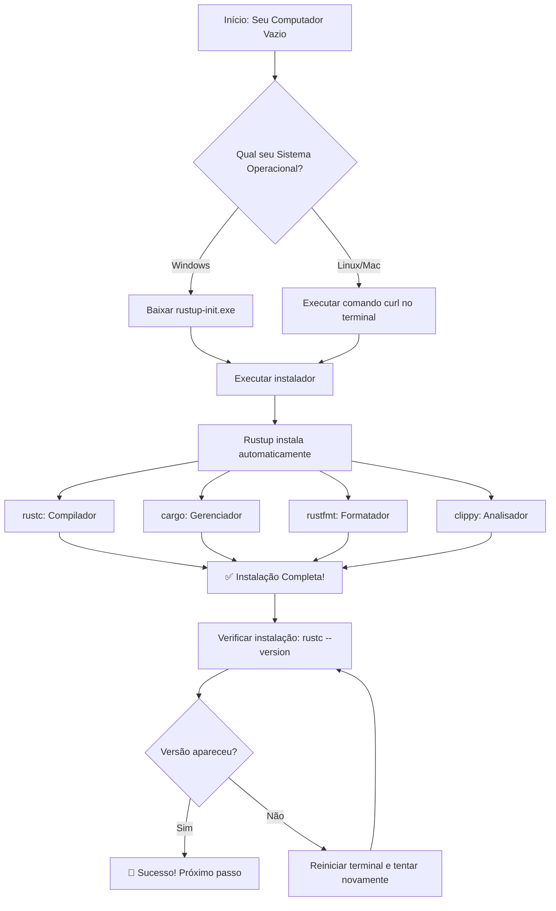
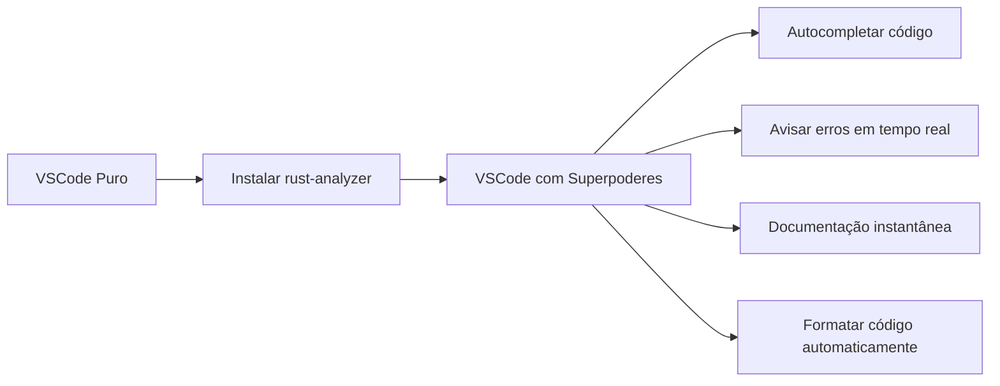
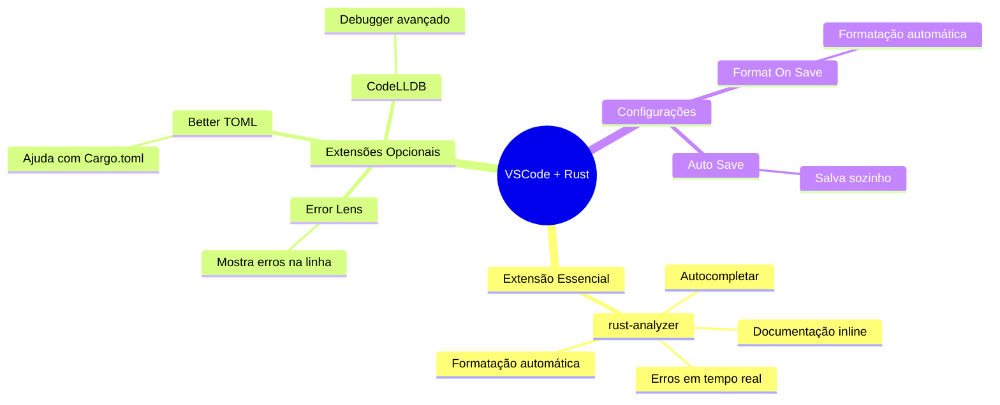
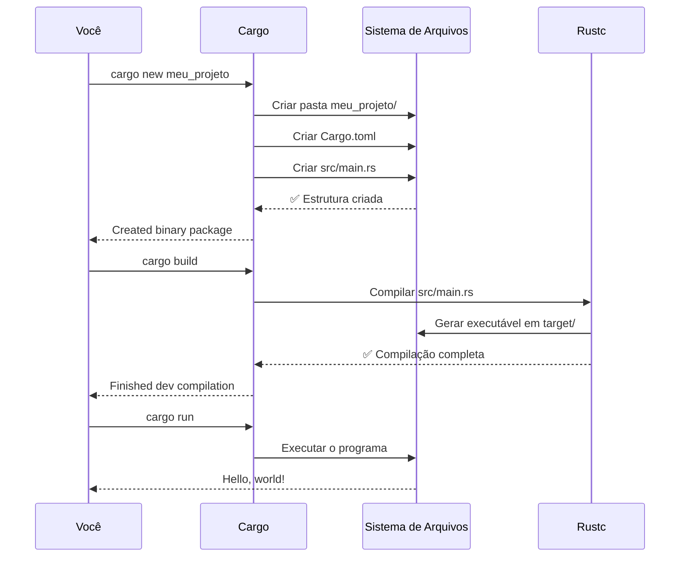
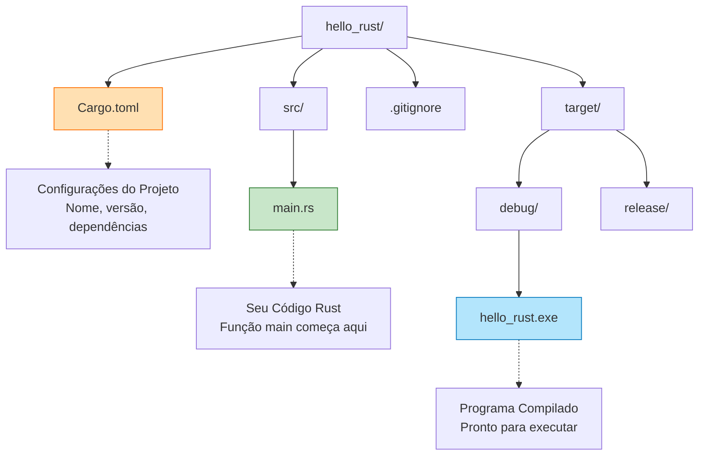
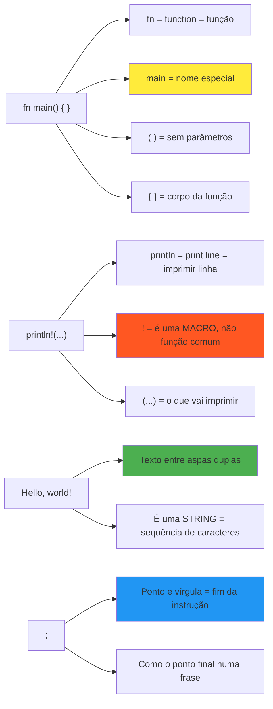
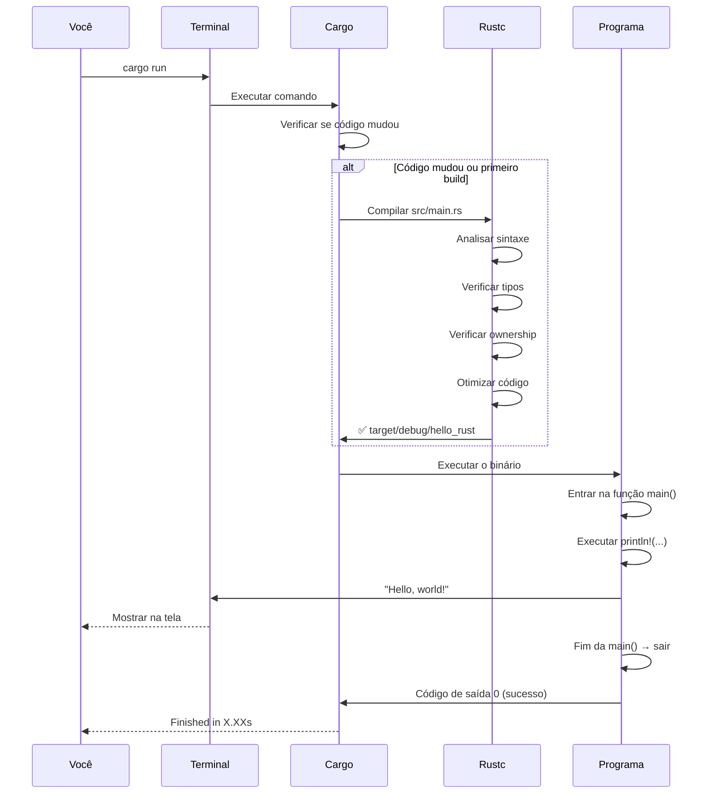
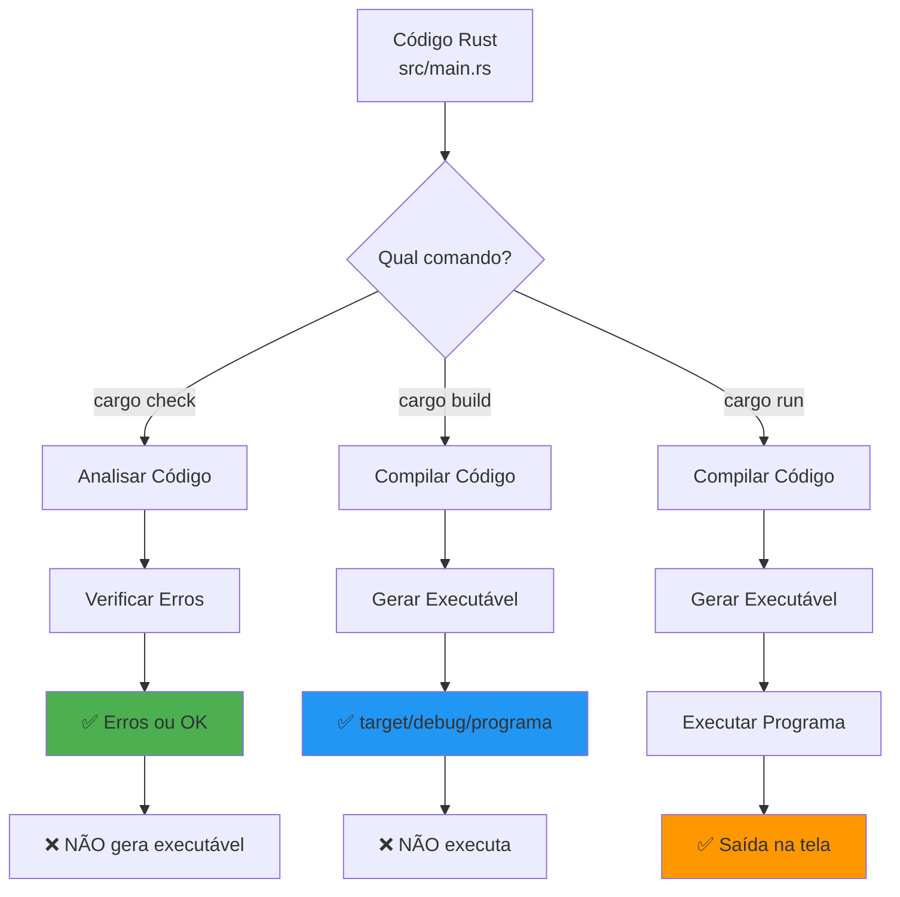

# 📅 DIA 1 - Setup e Hello World: A Oficina do Ferreiro

## 📑 ÍNDICE

1. [🎭 A História do Ferreiro](#-a-história-do-ferreiro)
2. [📋 Objetivos de Aprendizagem](#-objetivos-de-aprendizagem)
3. [🎯 Ativação do Conhecimento Prévio](#-ativação-do-conhecimento-prévio)
4. [📚 Apresentação do Conteúdo](#-apresentação-do-conteúdo)
   - [O Que é Rust?](#o-que-é-rust)
   - [Instalando o Kit do Ferreiro](#instalando-o-kit-do-ferreiro)
   - [Configurando Sua Bancada de Trabalho](#configurando-sua-bancada-de-trabalho)
   - [Criando Seu Primeiro Projeto](#criando-seu-primeiro-projeto)
   - [Anatomia do Hello World](#anatomia-do-hello-world)
5. [💡 Demonstração e Modelagem](#-demonstração-e-modelagem)
6. [🎯 Prática Guiada](#-prática-guiada)
7. [🔄 Feedback e Avaliação](#-feedback-e-avaliação)
8. [🚀 Transferência e Aplicação](#-transferência-e-aplicação)
9. [📖 Glossário](#-glossário)

---

## 🎭 A HISTÓRIA DO FERREIRO

Imagine que você acabou de herdar uma antiga oficina de ferreiro do seu avô. A oficina está vazia, sem ferramentas, sem bigorna, sem nada. Você tem três opções:

**Opção 1:** Ir ao mercado e comprar cada ferramenta separadamente, uma por uma, sem saber se elas funcionam juntas.

**Opção 2:** Contratar um mestre ferreiro que traz suas próprias ferramentas, mas você nunca aprende como funcionam.

**Opção 3:** Receber um **kit completo de ferreiro profissional** - bigorna, martelo, forno, moldes - tudo que precisa, testado e garantido para funcionar perfeitamente junto. E mais: vem com um **manual ilustrado** que te ensina a usar cada ferramenta.

**Rust é exatamente a Opção 3!** Quando você instala Rust, não recebe apenas um "compilador" (a ferramenta que transforma seu código em programa). Você recebe um **kit completo de desenvolvimento**:

- **rustc** (o ferreiro mestre que transforma metal bruto em espadas)
- **cargo** (o gerente da oficina que organiza tudo)
- **rustfmt** (o polidor que deixa suas peças bonitas)
- **rust-analyzer** (o assistente inteligente que te guia)

E o melhor: esse kit funciona **exatamente igual** no Windows, Linux e Mac. É como ter a mesma oficina mágica que se adapta a qualquer lugar do mundo!

Hoje, você vai montar sua oficina. No fim do dia, você terá forjado sua primeira peça: um programa que diz "Olá, Mundo!" - a tradição de todos os ferreiros iniciantes.

---

## 📋 OBJETIVOS DE APRENDIZAGEM

Ao final deste dia, você será capaz de:

- [ ] **Instalar** o ambiente completo de desenvolvimento Rust (rustup, cargo, rustc) no seu sistema operacional
- [ ] **Configurar** o VSCode com a extensão rust-analyzer para ter suporte inteligente ao código
- [ ] **Criar** um novo projeto Rust usando o Cargo e compreender sua estrutura de diretórios
- [ ] **Executar** seu primeiro programa "Hello, World!" e entender cada linha do código
- [ ] **Utilizar** os comandos essenciais do Cargo (build, run, check) e explicar a diferença entre eles

---

## 🎯 ATIVAÇÃO DO CONHECIMENTO PRÉVIO

Antes de começar, reflita sobre estas perguntas:

**🤔 Perguntas para Conexão:**

1. Você já instalou algum programa no computador? Qual foi a experiência?
2. Você já usou algum editor de texto (Word, Bloco de Notas)? Programar é como escrever em um editor especial!
3. Você sabe o que é uma "receita de bolo"? Programar é escrever receitas para o computador seguir!
4. Já organizou arquivos em pastas no computador? Projetos Rust funcionam assim!

**💭 Reflexão Inicial:**

Não se preocupe se você nunca programou antes. Todo mundo começa do zero! A programação é como aprender um novo idioma: no começo parece estranho, mas com prática, fica natural. E o melhor: o computador não julga seus erros - ele só te avisa e você tenta de novo!

---

## 📚 APRESENTAÇÃO DO CONTEÚDO

### 🦀 O Que é Rust?

**Analogia:** Se linguagens de programação fossem carros:

- **Python** seria um carro automático, fácil de dirigir, mas não muito rápido
- **C** seria um carro de Fórmula 1, super rápido, mas você precisa controlar cada peça
- **Rust** seria um **Tesla** - rápido como Fórmula 1, mas com piloto automático que te avisa antes de você bater!

**Rust é uma linguagem de programação que:**

✅ É **extremamente rápida** (velocidade de C/C++)  
✅ É **super segura** (te avisa de erros antes de rodar)  
✅ Tem **ferramentas excelentes** incluídas (não precisa ficar catando pela internet)  
✅ Tem uma **comunidade incrível** (gente disposta a ajudar)

**Por que aprender Rust primeiro?**

Porque Rust te ensina os **fundamentos corretos** desde o início. É como aprender a dirigir em um carro com instrutor - você aprende do jeito certo e depois pode dirigir qualquer carro!

---

### 🛠️ Instalando o Kit do Ferreiro

Vamos instalar o **rustup** - o instalador oficial do Rust. Pense nele como o "App Store" do Rust: ele instala tudo que você precisa e mantém tudo atualizado.



---

#### 🪟 INSTALAÇÃO NO WINDOWS (Passo a Passo Detalhado)

**PASSO 1: Baixar o Instalador**

1. Abra seu navegador (Chrome, Edge, Firefox - qualquer um)
2. Digite na barra de endereço: `https://rustup.rs`
3. Você verá um site minimalista com um link grande
4. Clique no link **"rustup-init.exe (64-bit)"**
5. O arquivo (cerca de menos de 20 MB) será baixado na pasta Downloads

**PASSO 2: Executar o Instalador**

1. Vá na pasta **Downloads** (geralmente `C:\Users\SeuNome\Downloads`)
2. Encontre o arquivo `rustup-init.exe`
3. **Clique duas vezes** no arquivo
4. O Windows pode mostrar um aviso de segurança dizendo "Aplicativo desconhecido"
   - Clique em **"Mais informações"**
   - Depois clique em **"Executar assim mesmo"**
5. Uma janela preta (terminal) abrirá com texto

**PASSO 3: Escolher as Opções**

Você verá algo assim no terminal:

```
Welcome to Rust!

Current installation options:

   default host triple: x86_64-pc-windows-msvc
     default toolchain: stable
               profile: default
  modify PATH variable: yes

1) Proceed with standard installation (default - just press enter)
2) Customize installation
3) Cancel installation
```

**O que fazer:**
- Digite o número **1** (ou apenas aperte ENTER)
- Isso escolhe a instalação padrão - perfeita para iniciantes!

**PASSO 4: Aguardar a Instalação**

- Você verá várias linhas de texto passando rapidamente
- É o rustup baixando e instalando os componentes
- Parece hackeamento de filme, mas é só progresso! 😎
- Aguarde 2-5 minutos (depende da sua internet)

**PASSO 5: Verificar Sucesso**

Quando terminar, você verá:

```
Rust is installed now. Great!
```

Agora, **IMPORTANTE**: Feche o terminal e abra um **novo terminal**!

**Como abrir o terminal no Windows:**
- Aperte a tecla **Windows** + **R**
- Digite `cmd` e aperte ENTER
- Uma janela preta abre - esse é o terminal!

No terminal novo, digite:

```bash
rustc --version
```

Se aparecer algo como:

```
rustc 1.91.1 (ed61e7d7e 2025-11-07)
```

**🎉 PARABÉNS! Rust instalado com sucesso!**

---

#### 🐧 INSTALAÇÃO NO LINUX (Passo a Passo Detalhado)

**PASSO 1: Abrir o Terminal**

- Aperte **Ctrl + Alt + T** (atalho universal no Linux)
- Ou procure por "Terminal" no menu de aplicativos

**PASSO 2: Executar o Comando de Instalação**

No terminal, cole este comando (copie e cole, não digite!):

```bash
curl --proto '=https' --tlsv1.2 -sSf https://sh.rustup.rs | sh
```

**O que esse comando faz?**
- `curl`: programa que baixa arquivos da internet
- `--proto '=https'`: garante conexão segura
- O resto: baixa o instalador oficial do Rust e executa

Aperte **ENTER**

**PASSO 3: Escolher Opções**

Você verá as mesmas opções do Windows:

```
1) Proceed with installation (default)
2) Customize installation  
3) Cancel installation
```

Digite **1** e aperte ENTER

**PASSO 4: Aguardar Instalação**

- Texto vai passar rápido na tela
- Aguarde 2-5 minutos

**PASSO 5: Configurar o PATH**

Quando terminar, o instalador vai pedir para você executar:

```bash
source $HOME/.cargo/env
```

**O que isso faz?**  
Diz pro terminal onde o Rust foi instalado. Execute esse comando!

**PASSO 6: Verificar**

Digite:

```bash
rustc --version
```

Se ver a versão do Rust: **🎉 Sucesso!**

---

### 🖥️ Configurando Sua Bancada de Trabalho (VSCode)

Agora você tem as ferramentas do ferreiro. Mas precisa de uma **bancada de trabalho** organizada. É aqui que entra o **VSCode** (Visual Studio Code).

**Analogia:** Se o Rust é o martelo, o VSCode é sua bancada com:
- Luz para você enxergar bem
- Régua para medir
- Assistente que te avisa: "Cuidado, esse prego tá torto!"



---

#### PASSO 1: Instalar o VSCode

**Se você ainda não tem o VSCode:**

1. Acesse: `https://code.visualstudio.com`
2. Clique em **"Download"**
3. Escolha seu sistema operacional (Windows/Linux)
4. Instale normalmente (é como instalar qualquer programa)

**Se você já tem:** Pule para o próximo passo!

---

#### PASSO 2: Instalar a Extensão rust-analyzer

O **rust-analyzer** é seu assistente inteligente. Ele:
- Completa o código pra você
- Mostra erros enquanto você digita
- Explica funções quando você passa o mouse
- Formata o código automaticamente

**Como instalar:**

1. Abra o VSCode
2. Na lateral esquerda, clique no ícone de **quadradinhos** (Extensions)
   - Ou aperte **Ctrl + Shift + X** (Windows/Linux)
3. Na caixa de busca, digite: `rust-analyzer`
4. Vai aparecer uma extensão com logo branco
5. Clique no botão **"Install"** (Instalar)
6. Aguarde uns segundos
7. Pode fechar a aba da extensão

**✅ Pronto! Seu VSCode agora fala Rust fluentemente!**

---

#### PASSO 3: Configurações Opcionais (mas recomendadas)

Vamos fazer alguns ajustes para melhorar sua experiência:

1. No VSCode, aperte **Ctrl + ,** (abre Configurações)
2. Na caixa de busca, digite: `format on save`
3. Marque a caixinha **"Editor: Format On Save"**
   - Agora, sempre que você salvar um arquivo, ele formata automaticamente!



---

### 🏗️ Criando Seu Primeiro Projeto

Agora vem a mágica! Vamos usar o **Cargo** para criar nosso primeiro projeto.

**Cargo é o gerente da sua oficina.** Ele:
- Cria a estrutura de pastas
- Organiza seus arquivos
- Compila seu código
- Gerencia dependências (bibliotecas externas)
- Roda seus programas

**Analogia:** Imagine que você vai fazer um bolo. O Cargo:
- Separa os ingredientes nas gavetas certas
- Organiza as receitas
- Liga o forno na temperatura certa
- Te avisa se esqueceu algum ingrediente



---

#### CRIANDO O PROJETO - Screencast Textual

Vamos criar um projeto chamado `hello_rust`. Siga comigo passo a passo:

**PASSO 1: Abrir o Terminal no VSCode**

1. Abra o VSCode
2. No menu superior, clique em **Terminal → New Terminal**
   - Ou aperte **Ctrl + '** (Control + aspas simples)
3. Um terminal abre na parte de baixo do VSCode

**PASSO 2: Navegar até uma Pasta**

Vamos criar o projeto numa pasta organizada. Sugestão: criar uma pasta `projetos_rust`

**No Windows:**
```bash
cd C:\Users\SeuNome\Documents
mkdir projetos_rust
cd projetos_rust
```

**No Linux:**
```bash
cd ~/Documentos
mkdir projetos_rust
cd projetos_rust
```

**O que esses comandos fazem?**
- `cd`: "Change Directory" - muda de pasta (como clicar duas vezes numa pasta)
- `mkdir`: "Make Directory" - cria uma pasta nova
- `~/Documentos`: pasta Documentos do seu usuário

**PASSO 3: Criar o Projeto**

Agora, digite o comando mágico:

```bash
cargo new hello_rust
```

Você verá:

```
     Created binary (application) `hello_rust` package
```

**🎉 Pronto! Seu primeiro projeto Rust foi criado!**

**PASSO 4: Abrir o Projeto no VSCode**

```bash
cd hello_rust
code .
```

**O que aconteceu:**
- `cd hello_rust`: entrou na pasta do projeto
- `code .`: abriu o VSCode na pasta atual

Se o comando `code .` não funcionar:
- Feche o VSCode
- Navegue até a pasta `hello_rust` pelo explorador de arquivos
- Clique com botão direito dentro da pasta
- Escolha "Abrir com Code" (ou arraste a pasta para o VSCode)

---

### 📂 Estrutura de um Projeto Rust

Quando você criou o projeto, o Cargo criou esta estrutura:

```
hello_rust/
│
├── Cargo.toml          ← O "cérebro" do projeto
├── src/                ← Pasta do código-fonte
│   └── main.rs         ← Seu código Rust fica aqui
│
└── .gitignore          ← (Ignora arquivos desnecessários)
```



---

#### 📄 O Arquivo Cargo.toml (A Certidão de Nascimento do Projeto)

Abra o arquivo `Cargo.toml` no VSCode. Você verá:

```toml
[package]
name = "hello_rust"
version = "0.1.0"
edition = "2024"

[dependencies]
```

**Traduzindo linha por linha:**

| Linha | O que significa | Analogia |
|-------|----------------|----------|
| `[package]` | Seção de informações do pacote | "Dados Pessoais" no formulário |
| `name = "hello_rust"` | Nome do seu projeto | Seu nome de batismo |
| `version = "0.1.0"` | Versão do projeto | Sua idade/série |
| `edition = "2024"` | Versão da linguagem Rust usada | "Modelo 2024" (como carros) |
| `[dependencies]` | Bibliotecas que você vai usar | Lista de ingredientes da receita |

**Por enquanto, `[dependencies]` está vazio** - não precisamos de nenhuma biblioteca externa para nosso primeiro programa!

---

#### 📝 O Arquivo main.rs (Onde a Mágica Acontece)

Agora, abra o arquivo `src/main.rs`. Você verá:

```rust {.line-numbers}
fn main() {
    println!("Hello, world!");
}
```

**Esse é seu primeiro programa Rust!** Apenas 3 linhas! Vamos dissecar:

---

### 🔬 Anatomia do Hello World (Linha por Linha)



---

**LINHA 1: `fn main() {`**

```rust {.line-numbers}
fn main() {
```

Vamos quebrar em pedaços:

1. **`fn`** = abreviação de "function" (função)
   - **Analogia:** Uma função é como uma receita. É um conjunto de instruções com um nome.

2. **`main`** = nome da função
   - **Especial!** `main` é um nome mágico em Rust. 
   - É a **porta de entrada** do programa.
   - Quando você roda o programa, Rust procura por `fn main()` e começa por ali.
   - **Analogia:** É como a porta da frente da sua casa - todo visitante entra por ali!

3. **`()`** = parênteses vazios
   - Aqui vão os "ingredientes" que a função recebe.
   - Vazio significa: essa função não precisa de nenhum ingrediente para funcionar.

4. **`{`** = abre chave
   - Marca o início do "corpo" da função.
   - Tudo entre `{` e `}` é o que a função faz.

---

**LINHA 2: `    println!("Hello, world!");`**

```rust {.line-numbers}
    println!("Hello, world!");
```

1. **Os 4 espaços no começo** = indentação
   - Rust não obriga indentação, mas é boa prática!
   - Mostra visualmente que esse código está "dentro" da função main.

2. **`println!`** = macro que imprime texto
   - **`print`** = imprimir
   - **`ln`** = line (linha) - pula para a próxima linha depois
   - **`!`** = ponto de exclamação indica que é uma **macro**, não uma função normal
   
   **Diferença entre função e macro:**
   - Função: receita fixa
   - Macro: receita que se adapta ao que você precisa (mais poderosa!)

3. **`("Hello, world!")`** = o que será impresso
   - Os parênteses `()` contêm os argumentos da macro
   - `"Hello, world!"` = texto entre aspas duplas = **string**
   - String é uma sequência de caracteres (letras, números, símbolos)

4. **`;`** = ponto e vírgula
   - Marca o **fim da instrução**.
   - É obrigatório em Rust!
   - **Analogia:** É como o ponto final no fim de uma frase.

---

**LINHA 3: `}`**

```rust {.line-numbers}
}
```

- **`}`** = fecha chave
- Marca o **fim** do corpo da função.
- Toda chave aberta `{` precisa de uma fechada `}` correspondente!

---

### 🎬 Demonstração Completa do Fluxo

Veja o que acontece quando você roda o programa:



---

## 💡 DEMONSTRAÇÃO E MODELAGEM

Agora vamos **rodar o programa** pela primeira vez! Vou te guiar como se estivesse ao seu lado.

### 🚀 Comandos Essenciais do Cargo

Existem 3 comandos principais que você usará constantemente:

| Comando | O que faz | Quando usar | Tempo |
|---------|-----------|-------------|-------|
| `cargo build` | Compila o código, gera executável | Quando quer só compilar sem rodar | ~2-5s |
| `cargo run` | Compila E executa o programa | O mais usado! Compila e roda | ~2-5s |
| `cargo check` | Verifica se compila, mas não gera executável | Para checar erros rapidamente | ~1-2s |

---

### 🎯 EXECUTANDO: cargo run

No terminal do VSCode (ainda dentro da pasta `hello_rust`), digite:

```bash
cargo run
```

**Primeira execução** - você verá algo assim:

```
   Compiling hello_rust v0.1.0 (C:\Users\...\hello_rust)
    Finished dev [unoptimized + debuginfo] target(s) in 2.35s
     Running `target\debug\hello_rust.exe`
Hello, world!
```

**🎉 PARABÉNS! Você acabou de executar seu primeiro programa Rust!**

---

**Vamos entender cada linha da saída:**

1. **`Compiling hello_rust v0.1.0`**
   - Cargo está compilando seu projeto
   - Mostra o nome e versão do Cargo.toml

2. **`Finished dev [unoptimized + debuginfo] target(s) in 2.35s`**
   - `dev` = modo de desenvolvimento (mais rápido de compilar, programa mais lento)
   - `unoptimized` = código não otimizado (pra compilar rápido)
   - `debuginfo` = informações para debugar (encontrar erros)
   - `in 2.35s` = demorou 2.35 segundos

3. **`Running target\debug\hello_rust.exe`**
   - Agora está executando o programa que foi compilado
   - O programa está em `target/debug/hello_rust.exe`

4. **`Hello, world!`**
   - **ESSA É A SAÍDA DO SEU PROGRAMA!**
   - Foi o `println!` que imprimiu isso!

---

### 🏗️ ENTENDENDO: cargo build

Agora vamos usar o `cargo build` para entender a diferença:

```bash
cargo build
```

Saída:

```
    Finished dev [unoptimized + debuginfo] target(s) in 0.01s
```

**Percebeu?** Foi super rápido (0.01s) porque o código já estava compilado!

`cargo build`:
- ✅ Compila o código
- ❌ NÃO executa o programa
- 📦 Gera o executável em `target/debug/`

**Quando usar?**
- Quando você quer só verificar se o código compila
- Quando vai executar o programa manualmente depois

---

### ⚡ SUPER RÁPIDO: cargo check

Agora teste o mais rápido de todos:

```bash
cargo check
```

Saída:

```
    Checking hello_rust v0.1.0
    Finished dev [unoptimized + debuginfo] target(s) in 0.05s
```

`cargo check`:
- ✅ Verifica se o código compila
- ❌ NÃO gera executável
- ❌ NÃO executa o programa
- ⚡ É o MAIS RÁPIDO dos três

**Quando usar?**
- Durante o desenvolvimento, para verificar erros rapidamente
- Quando você está escrevendo código e quer feedback rápido
- **Dica:** Configure seu editor para rodar `cargo check` automaticamente!

---

### 📊 Comparação Visual dos Comandos



---

### 🔍 Explorando a Pasta target/

Quando você executa `cargo build` ou `cargo run`, o Cargo cria uma pasta chamada `target/`. Vamos explorar:

```
hello_rust/
└── target/
    └── debug/
        ├── hello_rust.exe     ← Seu programa executável
        ├── hello_rust.pdb     ← Informações de debug
        └── deps/              ← Dependências compiladas
```

**Você pode executar o programa diretamente!**

No Windows:
```bash
.\target\debug\hello_rust.exe
```

No Linux:
```bash
./target/debug/hello_rust
```

Saída:
```
Hello, world!
```

**🤯 Incrível!** Você criou um programa executável de verdade!

---

## 🎯 PRÁTICA GUIADA

Agora é sua vez de colocar a mão na massa! Vamos criar um programa mais interessante do que apenas "Hello, world!".

### 🎨 EXERCÍCIO: Cartão de Visitas Digital

**Contexto e Motivação:**

Imagina que você está em um evento de tecnologia e quer se apresentar de forma criativa. Em vez de entregar um cartão físico, você vai criar um **programa que exibe seu cartão de visitas digital** no terminal!

**Objetivo:**

Criar um programa Rust que imprime um cartão de visitas formatado com:
- Seu nome
- Sua profissão/interesse
- Seus contatos (GitHub, LinkedIn, ou o que preferir)
- Uma mensagem de boas-vindas

---

### 📋 Especificação Detalhada

Seu programa deve imprimir algo assim:

```
╔═════════════════════════════════════════╗
║                                         ║
║         🦀 CARTÃO DE VISITAS 🦀         ║
║                                         ║
║  Nome: [SEU NOME]                       ║
║  Profissão: Estudante de Rust           ║
║                                         ║
║  📧 Email: seuemail@exemplo.com         ║
║  🐙 GitHub: github.com/seunick          ║
║                                         ║
║  "Aprendendo Rust, um dia por vez!"     ║
║                                         ║
╔═════════════════════════════════════════╗
```

---

### 🏗️ Código Inicial (Esqueleto)

Primeiro, crie um novo projeto:

```bash
cd ~/projetos_rust  # ou C:\Users\SeuNome\Documents\projetos_rust
cargo new cartao_visitas
cd cartao_visitas
code .
```

Agora, abra o arquivo `src/main.rs` e substitua o conteúdo por este esqueleto:

```rust {.line-numbers}
fn main() {
    // TODO: Imprimir a borda superior
    
    // TODO: Imprimir linha vazia
    
    // TODO: Imprimir título "CARTÃO DE VISITAS"
    
    // TODO: Imprimir linha vazia
    
    // TODO: Imprimir seu nome
    
    // TODO: Imprimir sua profissão
    
    // TODO: Imprimir linha vazia
    
    // TODO: Imprimir email
    
    // TODO: Imprimir GitHub
    
    // TODO: Imprimir linha vazia
    
    // TODO: Imprimir mensagem
    
    // TODO: Imprimir linha vazia
    
    // TODO: Imprimir borda inferior
}
```

---

### 💡 Dicas Progressivas

**DICA 1 - Imprimindo Bordas:**

Para imprimir a borda superior, use `println!` com o texto:

```rust {.line-numbers}
println!("╔═════════════════════════════════════════╗");
```

**DICA 2 - Linhas Vazias:**

Para uma linha vazia com bordas laterais:

```rust {.line-numbers}
println!("║                                         ║");
```

**DICA 3 - Texto Centralizado:**

Para o título centralizado:

```rust {.line-numbers}
println!("║         🦀 CARTÃO DE VISITAS 🦀         ║");
```

**DICA 4 - Informações Pessoais:**

Para adicionar suas informações:

```rust {.line-numbers}
println!("║  Nome: João Silva                       ║");
println!("║  Profissão: Estudante de Rust           ║");
```

**DICA 5 - Múltiplas Linhas:**

Você pode usar `println!` várias vezes seguidas! Cada `println!` adiciona uma nova linha.

---

### ✅ Solução Completa Comentada

**Tente resolver sozinho primeiro! Só olhe a solução depois de tentar!**

<details>
<summary>🔓 Clique aqui para ver a solução (tente antes!)</summary>

```rust {.line-numbers}
// Função principal - ponto de entrada do programa
fn main() {
    // Imprimir borda superior do cartão
    // Os caracteres especiais criam uma moldura bonita
    println!("╔═════════════════════════════════════════╗");
    
    // Linha vazia para dar espaço
    println!("║                                         ║");
    
    // Título do cartão com emojis de caranguejo (mascote do Rust!)
    println!("║         🦀 CARTÃO DE VISITAS 🦀         ║");
    
    // Mais uma linha vazia
    println!("║                                         ║");
    
    // Informações pessoais
    // Substitua "João Silva" pelo seu nome!
    println!("║  Nome: João Silva                       ║");
    println!("║  Profissão: Estudante de Rust           ║");
    
    // Linha separadora
    println!("║                                         ║");
    
    // Contatos
    // Substitua pelos seus contatos reais!
    println!("║  📧 Email: joao@exemplo.com             ║");
    println!("║  🐙 GitHub: github.com/joaosilva        ║");
    
    // Linha separadora
    println!("║                                         ║");
    
    // Mensagem motivacional
    println!("║  \"Aprendendo Rust, um dia por vez!\"     ║");
    
    // Linha vazia final
    println!("║                                         ║");
    
    // Borda inferior (fechando o cartão)
    println!("╚═════════════════════════════════════════╝");
}
```

</details>

---

### 🚀 Para Rodar:

```bash
cargo run
```

---

### 🎨 Variações Opcionais (Para Quem Quer Ir Além!)

**Variação 1: Adicionar mais informações**

Adicione mais linhas com:
- Seu site pessoal
- Seu Twitter/LinkedIn
- Suas linguagens favoritas
- Seu hobbies

**Variação 2: Usar cores (avançado, mas divertido!)**

Rust pode imprimir texto colorido! Adicione este código no TOPO do `main.rs` (antes da função main):

```rust {.line-numbers}
// Códigos ANSI para cores
const RESET: &str = "\x1b[0m";
const GREEN: &str = "\x1b[32m";
const BLUE: &str = "\x1b[34m";
const YELLOW: &str = "\x1b[33m";

fn main() {
    println!("{GREEN}╔═════════════════════════════════════════╗{RESET}");
    // ... resto do código
}
```

**Variação 3: ASCII Art**

Adicione um desenho ASCII! Exemplo:

```rust {.line-numbers}
println!("║           ___                           ║");
println!("║          (o o)                          ║");
println!("║       ooO--(_)--Ooo                     ║");
```

---

### 🌍 Conexão com o Mundo Real

**Por que isso é útil?**

- **Você acabou de criar um programa executável de verdade!**
- Em situações reais, programas de linha de comando são muito usados:
  - Ferramentas de desenvolvimento (git, npm, cargo)
  - Scripts de automação
  - Programas de servidor

**Próximos passos naturais:**
- Dia 2: Aprender a fazer o programa pedir o nome do usuário
- Dia 3: Salvar o cartão em um arquivo
- Futuro: Criar um site que gera cartões personalizados!

---

## 🔄 FEEDBACK E AVALIAÇÃO

### ✅ Checklist de Verificação

Marque cada item que você conseguiu fazer hoje:

**Instalação:**
- [ ] Instalei o Rust com rustup no meu computador
- [ ] Verifiquei a instalação com `rustc --version`
- [ ] O comando `cargo --version` funciona no terminal

**Configuração do VSCode:**
- [ ] Instalei o VSCode (ou já tinha)
- [ ] Instalei a extensão rust-analyzer
- [ ] Configurei "Format On Save"

**Primeiro Projeto:**
- [ ] Criei um projeto com `cargo new hello_rust`
- [ ] Entendi a estrutura de pastas (Cargo.toml, src/main.rs)
- [ ] Executei o programa com `cargo run`
- [ ] Vi "Hello, world!" na tela

**Comandos do Cargo:**
- [ ] Entendi a diferença entre `cargo build`, `cargo run` e `cargo check`
- [ ] Executei cada um deles pelo menos uma vez
- [ ] Encontrei o executável na pasta `target/debug/`

**Código Rust:**
- [ ] Entendi o que é `fn main()`
- [ ] Sei o que `println!` faz (imprime na tela)
- [ ] Entendi que `;` termina uma instrução
- [ ] Modifiquei o código e executei de novo

**Exercício Prático:**
- [ ] Criei o projeto `cartao_visitas`
- [ ] Personalizei o cartão com minhas informações
- [ ] Executei e vi meu cartão na tela
- [ ] (Opcional) Experimentei variações criativas

---

### ❌ Erros Comuns e Soluções

**ERRO 1: "rustc não é reconhecido como comando"**

**Sintoma:** Quando digita `rustc --version`, aparece erro.

**Causa:** O terminal não sabe onde o Rust foi instalado.

**Solução:**
1. **Feche e reabra o terminal** (isso geralmente resolve!)
2. Se não resolver:
   - Windows: Reinicie o computador
   - Linux: Execute `source $HOME/.cargo/env`

---

**ERRO 2: rust-analyzer não funciona no VSCode**

**Sintoma:** Não aparece autocompletar, erros não são mostrados.

**Soluções:**
1. Verifique se a extensão está instalada (ícone de quadradinhos, procure "rust-analyzer")
2. Reabra o VSCode
3. Abra a pasta do projeto (não apenas o arquivo!)
4. Aguarde 10-20 segundos (rust-analyzer leva um tempo para inicializar)

---

**ERRO 3: "cargo: command not found"**

**Causa:** Cargo não está instalado ou não está no PATH.

**Solução:**
1. Reinstale o Rust com rustup (ele instala o cargo junto)
2. Reinicie o terminal

---

**ERRO 4: Erro de compilação ao rodar o programa**

Exemplo:
```
error: expected `;`, found `}`
```

**Causa:** Você esqueceu o `;` no final de uma linha.

**Solução:** Adicione `;` no final da linha indicada no erro.

**ERRO 5: Caracteres especiais não aparecem corretamente**

**Sintoma:** Em vez de `╔═══╗` aparece `????`.

**Causa:** Terminal não suporta UTF-8.

**Solução Windows:**
```bash
chcp 65001
```

Ou use caracteres ASCII simples:
```
+------------------------+
|                        |
|  CARTAO DE VISITAS     |
+------------------------+
```

---

### 🎓 Auto-Avaliação (Perguntas Reflexivas)

Responda mentalmente:

1. **Você consegue explicar o que é o Cargo em suas próprias palavras?**
   - Se sim: Excelente! Você entendeu o conceito.
   - Se não: Releia a seção "Criando Seu Primeiro Projeto" e a analogia do gerente da oficina.

2. **Você sabe a diferença entre `cargo run` e `cargo build`?**
   - Resposta esperada: `cargo run` compila E executa; `cargo build` só compila.

3. **O que a função `main()` representa em um programa Rust?**
   - Resposta esperada: É o ponto de entrada, onde o programa começa a executar.

4. **Por que `println!` tem um ponto de exclamação?**
   - Resposta esperada: Porque é uma macro, não uma função comum.

5. **Você conseguiria criar um novo projeto Rust do zero agora, sem olhar as instruções?**
   - Se sim: Parabéns! Você internalizou o conhecimento.
   - Se não: Pratique criando 2-3 projetos novos com nomes diferentes.

---

## 🚀 TRANSFERÊNCIA E APLICAÇÃO

### 🏆 Desafio Bônus (Opcional)

Se você terminou tudo e quer mais desafio, tente este:

**DESAFIO: Calculadora de Apresentação**

Crie um programa que imprime:
- Uma saudação
- Seu nome
- Sua idade
- O ano que você nasceu (calculado a partir da idade)
- Uma despedida

Exemplo de saída:
```
Olá! 👋
Meu nome é João Silva
Tenho 25 anos
Nasci em 1999
Prazer em conhecê-lo!
```

**Dica:** Você ainda não sabe fazer contas em Rust, então pode calcular o ano manualmente e colocar no código!

---

### 🔗 Conexão com o Próximo Dia

**No Dia 1, você aprendeu:**
- ✅ Configurar o ambiente
- ✅ Criar projetos
- ✅ Imprimir texto na tela

**No Dia 2, você vai aprender:**
- 📝 Criar **variáveis** para guardar informações
- 🔄 Fazer o programa **mudar** as informações
- 🎲 Trabalhar com diferentes **tipos de dados** (números, textos)

**Prévia do Dia 2:**

Imagine que seu cartão de visitas está "gravado em pedra" - você não pode mudar nada depois de compilar. No Dia 2, vamos aprender a criar **variáveis**, que são como "caixinhas" onde você pode guardar e mudar informações!

```rust {.line-numbers}
// Prévia do que vem:
let nome = "João";  // variável com texto
let idade = 25;     // variável com número
println!("Olá, {}! Você tem {} anos.", nome, idade);
```

---

### 📚 Recursos Extras para Aprofundamento

**Documentação Oficial (em inglês, mas vale a pena!):**
- [Rust Book](https://doc.rust-lang.org/book/) - O livro oficial de Rust
- [Rust By Example](https://doc.rust-lang.org/rust-by-example/) - Aprenda com exemplos

**Comunidades em Português:**
- [Rust Brasil - Discord](https://discord.gg/rust-br)
- [Rust Brasil - Telegram](https://t.me/rustlangbr)

**Para Praticar:**
- [Rustlings](https://github.com/rust-lang/rustlings) - Pequenos exercícios para resolver
- [Exercism - Rust Track](https://exercism.org/tracks/rust) - Exercícios com mentoria

---

## 📖 GLOSSÁRIO

Termos que você aprendeu hoje:

| Termo | Significado | Analogia |
|-------|-------------|----------|
| **Rust** | Linguagem de programação rápida e segura | O ferreiro mestre |
| **rustup** | Instalador oficial do Rust | A "App Store" do Rust |
| **rustc** | Compilador do Rust | O ferreiro que transforma metal em espada |
| **Cargo** | Gerenciador de projetos e dependências | O gerente da oficina |
| **Compilar** | Transformar código-fonte em executável | Transformar receita em bolo |
| **Executável** | Programa que pode rodar no computador | O bolo pronto |
| **Função** | Bloco de código com um nome que faz algo | Uma receita |
| **main()** | Função especial onde o programa começa | Porta de entrada da casa |
| **println!** | Macro que imprime texto na tela | Alto-falante que anuncia algo |
| **Macro** | Código que gera código (mais poderoso que função) | Molde adaptável |
| **String** | Sequência de caracteres (texto) | Colar de letras |
| **;** (ponto e vírgula) | Marca o fim de uma instrução | Ponto final da frase |
| **Cargo.toml** | Arquivo de configuração do projeto | Certidão de nascimento |
| **src/** | Pasta onde fica o código-fonte | Gaveta de rascunhos |
| **target/** | Pasta onde ficam os executáveis compilados | Prateleira de produtos finais |

---

## 🎉 PARABÉNS!

Você completou o **Dia 1** da sua jornada em Rust! 

### 🏆 Conquistas Desbloqueadas:

- ✅ **Instalador Profissional** - Configurou o ambiente completo
- ✅ **Primeiro Programa** - Criou e executou código Rust
- ✅ **Rustáceo Iniciante** - Entendeu o básico da linguagem
- ✅ **Cartão Digital** - Criou um programa personalizado

### 📊 Progresso:

```
Dia 1/60: ████ 1.7% completo
```

Você plantou a semente. Agora é regar todos os dias! 🌱

**Mensagem Final:**

Hoje pode parecer que você aprendeu "pouco" - apenas imprimir texto. Mas você fez algo ENORME:

1. Configurou um ambiente profissional completo
2. Entendeu o ciclo de desenvolvimento (escrever → compilar → executar)
3. Criou um programa de verdade que roda no seu computador
4. Aprendeu os comandos essenciais

Você está **oficialmente** um programador Rust! 🦀

**Nos vemos no Dia 2!**

---

[🔝 Voltar ao Índice](#índice)