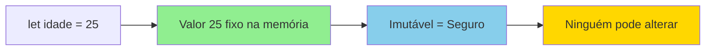
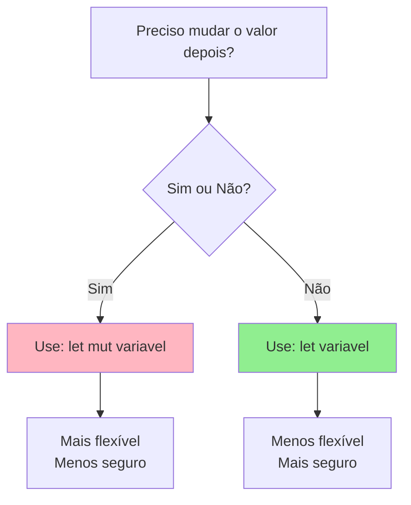
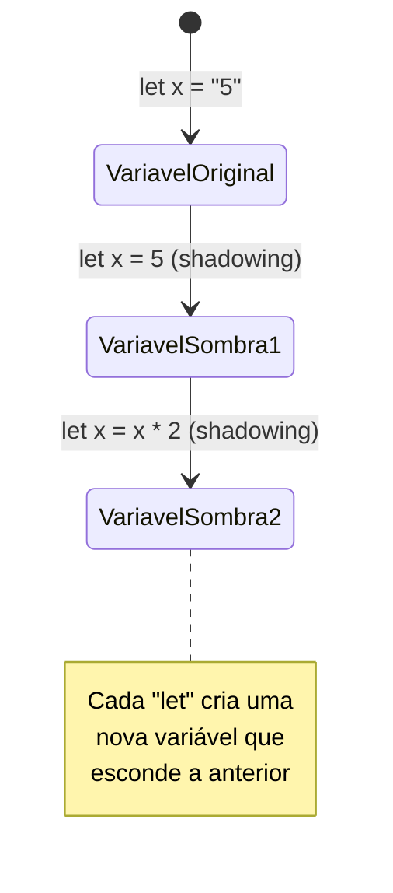
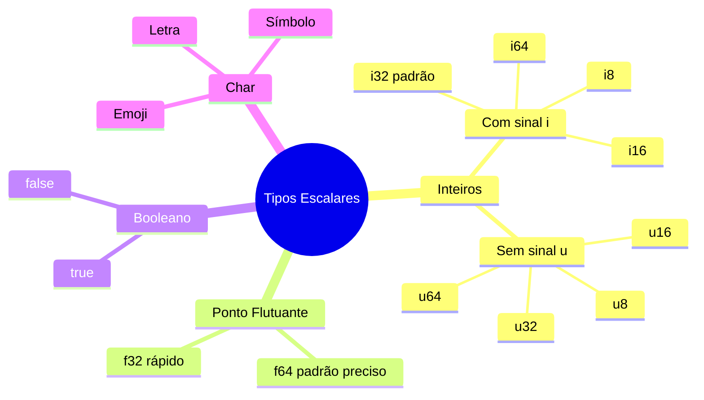
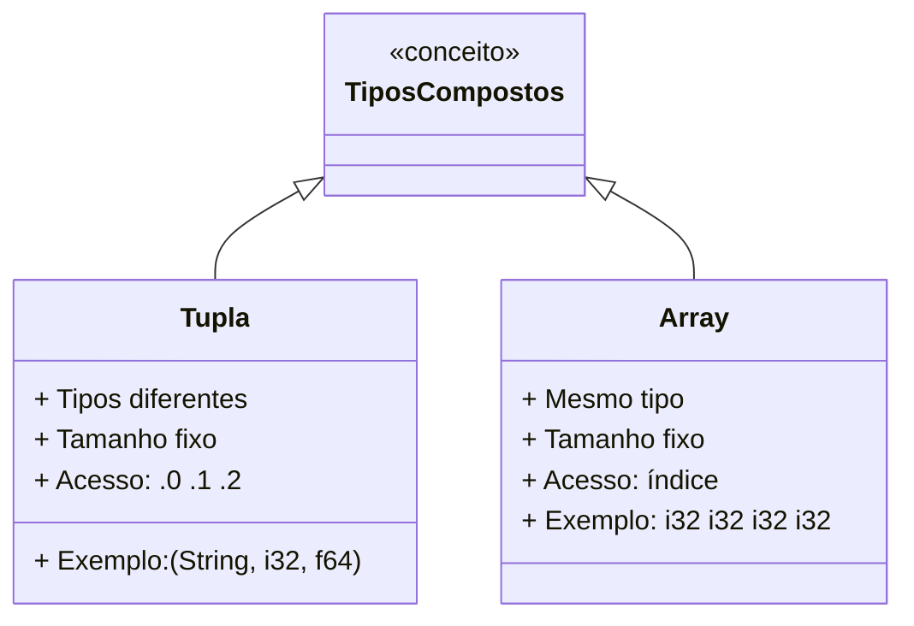
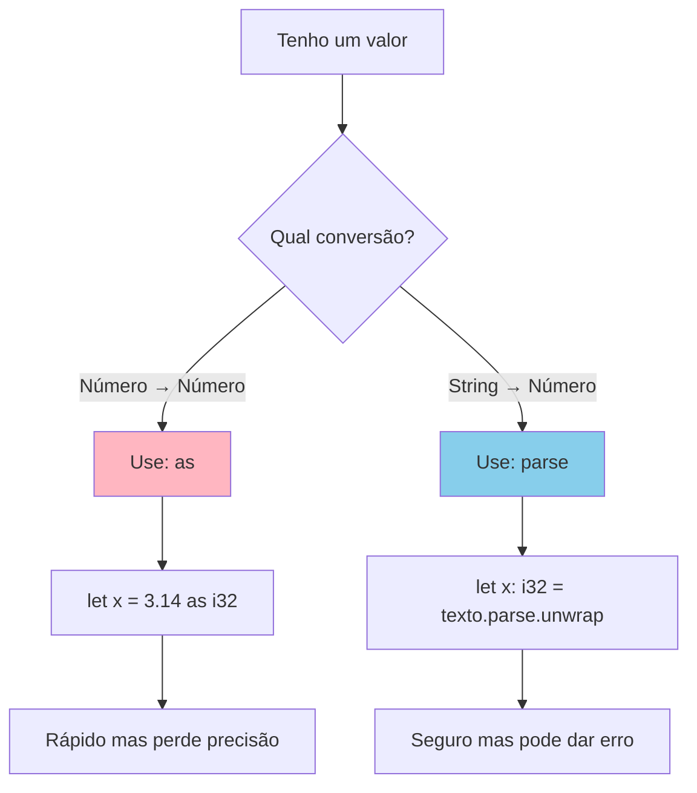

# 📅 DIA 2 - Variáveis e Tipos de Dados: O Armazém Organizado

## 🎭 A História do Armazém

Imagine que você é o gerente de um armazém ultra-moderno. Neste armazém, **cada caixa tem regras específicas**: algumas são lacradas permanentemente (imutáveis), outras podem ser abertas e modificadas (mutáveis). Além disso, cada tipo de produto precisa da caixa certa: joias vão em cofres pequenos, móveis em containers grandes, e líquidos em recipientes especiais.

O Rust funciona exatamente assim! É um gerente rigoroso que **exige que você declare exatamente qual tipo de caixa vai usar e se ela pode ser aberta ou não**. Parece chato? Não! Essa rigidez previne 95% dos bugs que existem em outras linguagens. É como ter um sistema anti-roubo automático no seu código! 🔒

---

## 📚 O QUE VOCÊ VAI APRENDER HOJE

**Conceitos:**
- Imutabilidade: o superpoder padrão do Rust
- Mutabilidade: quando e como permitir mudanças
- Shadowing: a arte de reutilizar nomes
- Tipos escalares: os átomos do Rust
- Tipos compostos: juntando os átomos
- Conversões entre tipos: a diplomacia dos dados

**Habilidades:**
- Declarar variáveis imutáveis e mutáveis corretamente
- Escolher o tipo de dado ideal para cada situação
- Converter dados entre diferentes tipos com segurança
- Usar shadowing para transformar dados mantendo o mesmo nome

---

## 📋 OBJETIVOS DE APRENDIZAGEM

Ao final deste dia, você será capaz de:
- [ ] **Declarar** variáveis imutáveis e mutáveis usando `let` e `let mut` apropriadamente
- [ ] **Identificar** e utilizar os 4 tipos escalares principais (inteiros, ponto flutuante, booleano, char)
- [ ] **Criar** tuplas e arrays para armazenar múltiplos valores
- [ ] **Converter** tipos de dados usando `as` e `parse()` sem causar erros
- [ ] **Aplicar** shadowing para transformar variáveis mantendo legibilidade do código

---

## 🔄 REVISÃO RÁPIDA DO DIA 1

No primeiro dia, você configurou o Rust e escreveu seu primeiro programa! Você usou:
- `fn main()` → a porta de entrada do programa
- `println!()` → para mostrar mensagens na tela
- `cargo new` → para criar projetos
- `cargo run` → para executar seu código

Hoje vamos aprofundar em como o Rust armazena e organiza informações! 🚀

---

## 📚 APRESENTAÇÃO DO CONTEÚDO

### 1️⃣ Imutabilidade por Padrão: A Caixa Lacrada

**Analogia:** Imagine uma caixa de correio. Uma vez que você coloca a carta dentro e fecha, ninguém pode abrir e trocar a carta sem destruir a caixa. É seguro, mas inflexível.

Em Rust, **todas as variáveis são imutáveis por padrão**. Isso significa que uma vez que você atribui um valor, ele não pode mais ser alterado:

```rust
fn main() {
    let idade = 25; // Caixa lacrada com o número 25
    println!("Idade: {}", idade);
    
    // idade = 26; // ❌ ERRO! Não pode mudar uma variável imutável!
}
```

**Por que isso é bom?** Porque previne que outras partes do código mudem valores acidentalmente. É como ter uma prova de que "esse valor não vai mudar de jeito nenhum".



---

### 2️⃣ Mutabilidade: A Caixa com Chave

**Analogia:** Agora imagine um cofre com chave. Você pode abrir, trocar o conteúdo, e fechar de novo. Flexível, mas precisa de permissão explícita.

Quando você **realmente precisa** mudar um valor, use `let mut`:

```rust
fn main() {
    let mut pontos = 0; // Caixa com chave - pode mudar!
    println!("Pontos iniciais: {}", pontos);
    
    pontos = 10; // ✅ OK! Variável é mutável
    println!("Novos pontos: {}", pontos);
    
    pontos = pontos + 5; // Pode fazer operações e atualizar
    println!("Pontos finais: {}", pontos);
}
```

**Comparação Visual:**

```rust
// ❌ IMUTÁVEL - Não pode mudar
let x = 5;
// x = 6; // ERRO!

// ✅ MUTÁVEL - Pode mudar
let mut y = 5;
y = 6; // Funciona!
y = y + 1; // Funciona!
```



---

### 3️⃣ Shadowing: A Arte da Transformação

**Analogia:** Imagine que você tem uma caixa rotulada "VALOR". Você pode pegar outra caixa, copiar o rótulo "VALOR", colocar algo diferente dentro, e a antiga caixa desaparece. É como fazer um upgrade mantendo o mesmo nome!

Shadowing permite **redeclarar uma variável com o mesmo nome**, criando uma nova variável que "sombreia" a antiga:

```rust
fn main() {
    let espaco = "   ";     // String com espaços
    println!("Texto: '{}'", espaco);
    
    let espaco = espaco.len(); // Agora é um número (tamanho da string)!
    println!("Tamanho: {}", espaco);
    
    // A variável mudou de tipo: String → número!
}
```

**Shadowing vs Mutabilidade:**

```rust
// SHADOWING - Pode mudar o tipo!
let idade = "25";        // String
let idade = 25;          // Agora é número - tipo mudou! ✅

// MUTABILIDADE - NÃO pode mudar o tipo!
let mut pontos = "10";   // String
// pontos = 10;          // ❌ ERRO! Não pode mudar de String para número
```

**Quando usar cada um?**
- **Shadowing:** Quando quer transformar o dado (ex: texto → número)
- **Mutabilidade:** Quando quer apenas atualizar o mesmo tipo de dado



---

### 4️⃣ Tipos Escalares: Os Átomos do Rust

**Analogia:** Pense em tipos escalares como átomos individuais - são os blocos de construção mais básicos. Não podem ser divididos em partes menores.

#### 🔢 Inteiros (Números sem vírgula)

Existem vários "tamanhos de caixas" para números inteiros:

| Tipo | Tamanho | Range (alcance) | Exemplo de uso |
|------|---------|-----------------|----------------|
| `i8` | 8 bits | -128 a 127 | Temperatura em °C |
| `i16` | 16 bits | -32.768 a 32.767 | Altitude em metros |
| `i32` | 32 bits | -2 bilhões a +2 bilhões | **Padrão** - idade, pontos |
| `i64` | 64 bits | Muito grande | População mundial |
| `u8` | 8 bits | 0 a 255 | Idade, porcentagem |
| `u16` | 16 bits | 0 a 65.535 | Porta de rede |
| `u32` | 32 bits | 0 a 4 bilhões | IDs, contadores |
| `u64` | 64 bits | 0 a muito grande | Bytes de arquivo |

**Dica de Ouro:** `i` = integer com sinal (pode ser negativo), `u` = unsigned sem sinal (só positivo)

```rust
fn main() {
    // Rust assume i32 se você não especificar
    let idade = 25;              // i32 automaticamente
    
    // Especificando o tipo explicitamente
    let temperatura: i8 = -10;   // Pode ser negativo
    let progresso: u8 = 75;      // Só positivo (0-100%)
    
    // Números grandes
    let populacao: u64 = 8_000_000_000; // Sublinhado ajuda a ler!
    
    println!("Idade: {}", idade);
    println!("Temperatura: {}°C", temperatura);
    println!("Progresso: {}%", progresso);
    println!("População: {}", populacao);
}
```

#### 🎯 Ponto Flutuante (Números com vírgula)

Para números decimais, temos 2 opções:

```rust
fn main() {
    let altura = 1.75;           // f64 por padrão (mais preciso)
    let peso: f32 = 70.5;        // f32 (mais rápido, menos preciso)
    
    println!("Altura: {:.2}m", altura);  // .2 = 2 casas decimais
    println!("Peso: {:.1}kg", peso);
}
```

**Escolha:**
- `f32` → Quando precisa economizar memória (jogos, milhões de valores)
- `f64` → Padrão, use quando a precisão importa (cálculos científicos)

#### ✅ Booleano (Verdadeiro ou Falso)

O tipo mais simples - só 2 valores possíveis:

```rust
fn main() {
    let esta_chovendo = true;
    let tem_guarda_chuva = false;
    
    println!("Chovendo? {}", esta_chovendo);
    println!("Tem guarda-chuva? {}", tem_guarda_chuva);
    
    // Muito usado em decisões (você verá no Dia 3!)
    let precisa_guarda_chuva = esta_chovendo && !tem_guarda_chuva;
    println!("Precisa comprar? {}", precisa_guarda_chuva);
}
```

#### 🔤 Char (Um único caractere)

Para letras, símbolos, emojis - **sempre entre aspas simples**:

```rust
fn main() {
    let letra: char = 'A';
    let emoji: char = '😊';
    let simbolo: char = '€';
    
    println!("Letra: {}", letra);
    println!("Emoji: {}", emoji);
    println!("Símbolo: {}", simbolo);
    
    // ⚠️ Aspas duplas são para texto (String), não char!
    // let errado: char = "A"; // ❌ ERRO!
}
```



---

### 5️⃣ Tipos Compostos: Juntando os Átomos

**Analogia:** Se tipos escalares são átomos individuais, tipos compostos são moléculas - várias coisas juntas em uma única estrutura.

#### 📦 Tuplas: A Caixa Compartimentada

Tuplas são como uma caixa de ferramentas com divisórias: cada compartimento guarda um tipo diferente de coisa.

```rust
fn main() {
    // Tupla mistura tipos diferentes
    let pessoa = ("Bianeck", 40, 1.75);
    //             String    i32   f64
    
    // Acessando valores por índice (começa em 0)
    println!("Nome: {}", pessoa.0);
    println!("Idade: {}", pessoa.1);
    println!("Altura: {}m", pessoa.2);
    
    // Desestruturação - extrair tudo de uma vez
    let (nome, idade, altura) = pessoa;
    println!("{} tem {} anos e {:.2}m", nome, idade, altura);
}
```

**Características:**
- Tamanho fixo (não pode adicionar/remover itens depois)
- Pode misturar tipos diferentes
- Acesso por índice: `.0`, `.1`, `.2`...

#### 📋 Arrays: A Prateleira Organizada

Arrays são como uma prateleira onde **todas as caixas são idênticas** - mesmo tipo, tamanho fixo.

```rust
fn main() {
    // Array: todos os valores do mesmo tipo
    let notas = [8.5, 9.0, 7.5, 10.0, 8.0];
    //           todos f64
    
    // Acessando por índice (começa em 0)
    println!("Primeira nota: {}", notas[0]);
    println!("Última nota: {}", notas[4]);
    
    // Declaração explícita: [tipo; tamanho]
    let semana: [&str; 7] = ["Dom", "Seg", "Ter", "Qua", "Qui", "Sex", "Sáb"];
    println!("Hoje é: {}", semana[1]); // Segunda-feira
    
    // Array com valores repetidos: [valor; quantidade]
    let zeros = [0; 5]; // [0, 0, 0, 0, 0]
    println!("Array de zeros: {:?}", zeros); // {:?} mostra o array completo
}
```

**Diferença Tupla vs Array:**

```rust
// TUPLA - tipos diferentes, acesso com ponto
let tupla = (10, "texto", true);
println!("{}", tupla.0);

// ARRAY - mesmo tipo, acesso com colchetes
let array = [10, 20, 30];
println!("{}", array[0]);
```



---

### 6️⃣ Conversão de Tipos (Type Casting)

**Analogia:** É como trocar a embalagem de um produto. Você tem suco em uma garrafa grande (f64) e quer colocar em garrafas pequenas (i32). Às vezes funciona, às vezes perde informação!

#### 🔄 Conversão com `as` (Casting Explícito)

Use `as` quando quer forçar a conversão entre tipos numéricos:

```rust
fn main() {
    // Conversão de ponto flutuante para inteiro
    let pi: f64 = 3.14159;
    let pi_inteiro = pi as i32; // Perde a parte decimal!
    println!("Pi completo: {}", pi);
    println!("Pi como inteiro: {}", pi_inteiro); // 3
    
    // Conversão entre tamanhos diferentes
    let grande: i64 = 1000;
    let pequeno = grande as i32;
    println!("Convertido: {}", pequeno);
    
    // ⚠️ Cuidado com overflow!
    let numero: i32 = 500;
    let convertido = numero as i8; // i8 só vai até 127!
    println!("Overflow! {}", convertido); // Valor estranho!
}
```

**Regra de Ouro:** Use `as` apenas quando tiver certeza que os valores cabem no tipo destino.

#### 📝 Conversão de String para Número (Parse)

Converter texto em número é super comum (ex: ler idade digitada pelo usuário):

```rust
fn main() {
    // Parse - converter string em número
    let texto_idade = "25";
    let idade: i32 = texto_idade.parse().unwrap(); // unwrap = confie que vai funcionar
    println!("Idade: {}", idade);
    
    // Exemplo mais seguro (você verá melhor no Dia 10!)
    let texto = "42";
    match texto.parse::<i32>() {
        Ok(numero) => println!("Número convertido: {}", numero),
        Err(_) => println!("Não é um número válido!"),
    }
    
    // Parse com ponto flutuante
    let texto_altura = "1.75";
    let altura: f64 = texto_altura.parse().unwrap();
    println!("Altura: {}m", altura);
}
```

**Explicação do `unwrap()`:** É como dizer "confio que essa string é um número válido, se não for, pode encerrar o programa". Por enquanto, use assim. Mais tarde você aprenderá formas mais seguras!



---

## 💡 DEMONSTRAÇÃO COMPLETA: MINI CALCULADORA

Vamos juntar tudo que aprendemos em um exemplo prático:

```rust
fn main() {
    println!("=== CALCULADORA DE MÉDIA ===\n");
    
    // 1. Variáveis imutáveis para notas
    let nota1: f64 = 8.5;
    let nota2: f64 = 9.0;
    let nota3: f64 = 7.5;
    
    println!("Nota 1: {:.1}", nota1);
    println!("Nota 2: {:.1}", nota2);
    println!("Nota 3: {:.1}", nota3);
    
    // 2. Cálculo da média
    let soma = nota1 + nota2 + nota3;
    let media = soma / 3.0;
    
    println!("\nMédia: {:.2}", media);
    
    // 3. Usando booleano para verificação
    let aprovado = media >= 7.0;
    println!("Aprovado? {}", aprovado);
    
    // 4. Shadowing para arredondar
    let media = media as i32; // Agora é inteiro!
    println!("Média arredondada: {}", media);
    
    // 5. Tupla com informações do aluno
    let aluno = ("João", media, aprovado);
    println!("\n=== RESUMO ===");
    println!("Aluno: {}", aluno.0);
    println!("Média: {}", aluno.1);
    println!("Status: {}", if aluno.2 {"Aprovado"} else {"Reprovado"});
    
    // 6. Array com todas as notas
    let notas = [nota1, nota2, nota3];
    println!("\nNotas registradas: {:?}", notas);
}
```

**O que este código demonstra:**
- ✅ Variáveis imutáveis (`let`)
- ✅ Tipos ponto flutuante (`f64`)
- ✅ Operações matemáticas
- ✅ Booleanos para condições
- ✅ Shadowing (média f64 → i32)
- ✅ Tuplas para agrupar dados
- ✅ Arrays para coleções
- ✅ Conversão com `as`

---

## 🎯 PRÁTICA GUIADA: CONVERSOR DE TEMPERATURA

Vamos criar um programinha simples que converte temperatura de Celsius para Fahrenheit!

### 📝 O Desafio

Crie um programa que:
1. Armazene uma temperatura em Celsius
2. Converta para Fahrenheit usando a fórmula: `F = C * 1.8 + 32`
3. Mostre ambas as temperaturas
4. Use tipos apropriados para cada valor

### 🎯 Código Inicial (Esqueleto)

Comece com este código base:

```rust
fn main() {
    // 1. Declare uma variável para temperatura em Celsius
    let celsius = ___; // Complete aqui!
    
    // 2. Converta para Fahrenheit
    let fahrenheit = ___; // Fórmula: C * 1.8 + 32
    
    // 3. Mostre os resultados
    println!("Temperatura: ___°C", ___);
    println!("Equivalente: ___°F", ___);
}
```

### 💡 Dicas Progressivas

**Dica 1 - Tipos:** Use `f64` para trabalhar com decimais. Exemplo: `let celsius: f64 = 25.0;`

**Dica 2 - Cálculo:** Lembre-se que em Rust você escreve a matemática diretamente: `celsius * 1.8 + 32.0`

**Dica 3 - Formatação:** Use `{:.1}` no `println!` para mostrar apenas 1 casa decimal

### ✅ Solução Completa Comentada

```rust
fn main() {
    // Armazenando temperatura em Celsius
    // Usamos f64 porque temperatura pode ter decimais
    let celsius: f64 = 25.0;
    
    // Convertendo para Fahrenheit
    // Fórmula: F = C × 1.8 + 32
    let fahrenheit = celsius * 1.8 + 32.0;
    
    // Mostrando os resultados
    // {:.1} significa "mostre com 1 casa decimal"
    println!("Temperatura: {:.1}°C", celsius);
    println!("Equivalente: {:.1}°F", fahrenheit);
    
    // EXTRA: Verificando se está quente
    let esta_quente = celsius > 30.0;
    println!("Está quente? {}", esta_quente);
}
```

**Saída esperada:**
```
Temperatura: 25.0°C
Equivalente: 77.0°F
Está quente? false
```

### 🌟 Variações Opcionais (Se quiser ir além!)

**Variação 1 - Múltiplas Temperaturas:**
```rust
fn main() {
    let celsius: f64 = 0.0;
    let fahrenheit = celsius * 1.8 + 32.0;
    println!("{}°C = {:.1}°F", celsius, fahrenheit);
    
    let celsius: f64 = 25.0; // Shadowing!
    let fahrenheit = celsius * 1.8 + 32.0;
    println!("{}°C = {:.1}°F", celsius, fahrenheit);
    
    let celsius: f64 = 100.0; // Shadowing novamente!
    let fahrenheit = celsius * 1.8 + 32.0;
    println!("{}°C = {:.1}°F", celsius, fahrenheit);
}
```

**Variação 2 - Usando Array:**
```rust
fn main() {
    let temperaturas_celsius = [0.0, 10.0, 20.0, 30.0];
    
    println!("Conversão de temperaturas:");
    println!("{}°C = {:.1}°F", temperaturas_celsius[0], temperaturas_celsius[0] * 1.8 + 32.0);
    println!("{}°C = {:.1}°F", temperaturas_celsius[1], temperaturas_celsius[1] * 1.8 + 32.0);
    println!("{}°C = {:.1}°F", temperaturas_celsius[2], temperaturas_celsius[2] * 1.8 + 32.0);
}
```

---

## 🔄 FEEDBACK E AVALIAÇÃO

### ✅ Checklist de Conceitos

Você compreendeu e consegue explicar:

- [ ] Por que variáveis são imutáveis por padrão no Rust?
- [ ] Quando usar `let` vs `let mut`?
- [ ] O que é shadowing e como difere de mutabilidade?
- [ ] Diferença entre tipos inteiros com sinal (i) e sem sinal (u)?
- [ ] Quando usar `f32` vs `f64`?
- [ ] Diferença entre tupla e array?
- [ ] Como converter números usando `as`?
- [ ] Como converter strings em números com `parse()`?

### ⚠️ Erros Comuns e Como Evitar

**Erro 1: Tentar mudar variável imutável**
```rust
// ❌ ERRADO
let x = 5;
x = 6; // Erro: cannot assign twice to immutable variable

// ✅ CORRETO
let mut x = 5;
x = 6; // Funciona!
```

**Erro 2: Misturar tipos sem conversão**
```rust
// ❌ ERRADO
let idade: i32 = 25;
let altura: f64 = 1.75;
// let soma = idade + altura; // Erro: tipos diferentes!

// ✅ CORRETO
let soma = idade as f64 + altura; // Converta primeiro!
```

**Erro 3: Confundir aspas simples e duplas**
```rust
// ❌ ERRADO
let letra: char = "A"; // Erro: expected char, found &str

// ✅ CORRETO
let letra: char = 'A'; // Aspas simples para char
let texto: &str = "A"; // Aspas duplas para string
```

**Erro 4: Array com índice errado**
```rust
let numeros = [10, 20, 30];
// println!("{}", numeros[3]); // ❌ Erro: índice 3 não existe!
println!("{}", numeros[2]); // ✅ OK: último elemento é índice 2
```

### 📊 Quiz de Fixação

**Questão 1:** O que acontece neste código?
```rust
let x = 5;
let x = x + 1;
let x = x * 2;
println!("{}", x);
```
a) Erro de compilação  
b) Imprime 5  
c) Imprime 12  
d) Imprime 11  

<details>
<summary>Resposta</summary>
<strong>c) Imprime 12</strong> - Shadowing permite redeclarar: 5 → 6 → 12
</details>

**Questão 2:** Qual tipo usar para armazenar a idade de uma pessoa?
```rust
let idade: ___ = 25;
```
a) `f64` - pode ter decimais  
b) `i8` - número pequeno positivo/negativo  
c) `u8` - número pequeno apenas positivo (0-255)  
d) `char` - caractere  

<details>
<summary>Resposta</summary>
<strong>c) u8</strong> - Idade é positiva e nunca passa de 255
</details>

**Questão 3:** O que está errado aqui?
```rust
let mut valores = (10, 20, 30);
valores.0 = 15;
```
a) Tuplas não podem ser mutáveis  
b) Sintaxe de acesso está errada  
c) Nada está errado, funciona perfeitamente  
d) Precisa usar colchetes ao invés de parênteses  

<details>
<summary>Resposta</summary>
<strong>a) Tuplas não podem ser mutáveis</strong> - Tuplas são sempre imutáveis no Rust, mesmo com `mut`
</details>

**Questão 4:** Qual conversão está correta?
```rust
let texto = "42";
// Como converter para número?
```
a) `let num = texto as i32;`  
b) `let num: i32 = texto.parse().unwrap();`  
c) `let num = i32(texto);`  
d) `let num = texto.to_i32();`  

<details>
<summary>Resposta</summary>
<strong>b)</strong> - Use `parse().unwrap()` para converter string em número
</details>

**Questão 5:** Qual a diferença entre estas duas declarações?
```rust
let mut x = 5;
x = 6;

let x = 5;
let x = 6;
```
a) Não há diferença prática  
b) Primeira usa mutabilidade, segunda usa shadowing  
c) Ambas causam erro  
d) Segunda é mais rápida  

<details>
<summary>Resposta</summary>
<strong>b)</strong> - `mut` permite alterar valor, shadowing cria nova variável
</details>

---

## 🚀 TRANSFERÊNCIA E APLICAÇÃO

### 🎁 Desafio Bônus: Calculadora de Idade

Se você se sentir confiante, tente criar este programa:

**Objetivo:** Criar um programa que:
- Armazena o ano atual (2025)
- Armazena o ano de nascimento
- Calcula a idade
- Mostra se é maior de idade (18+)

**Esqueleto:**
```rust
fn main() {
    let ano_atual = 2025;
    let ano_nascimento = ___; // Seu ano de nascimento
    
    let idade = ___;  // Calcule aqui
    let maior_idade = ___; // Use booleano
    
    println!("Você tem {} anos", idade);
    println!("Maior de idade? {}", maior_idade);
}
```

### 🔗 Preparação para o Dia 3

No próximo dia, você vai aprender a fazer seu programa **tomar decisões**! Vamos usar:
- `if`, `else` → "Se isso, faça aquilo"
- `match` → Super switch poderoso do Rust
- Loops → Repetir ações

Os conceitos de **booleanos** e **comparações** que você viu hoje serão fundamentais!

### 📚 Recursos Complementares

**Para se aprofundar:**
- [Rust Book - Capítulo 3.1](https://doc.rust-lang.org/book/ch03-01-variables-and-mutability.html) (Variáveis)
- [Rust Book - Capítulo 3.2](https://doc.rust-lang.org/book/ch03-02-data-types.html) (Tipos)
- [Rust by Example - Primitives](https://doc.rust-lang.org/rust-by-example/primitives.html)

**Pratique mais:**
- Experimente converter diferentes temperaturas
- Crie tuplas com suas informações pessoais
- Teste overflow propositalmente para ver o que acontece

---

## ✅ CHECKPOINT DO DIA

Você consegue fazer isso sem olhar exemplos?

- [ ] Declarar variável imutável e explicar por quê é o padrão
- [ ] Criar variável mutável quando realmente preciso mudar valores
- [ ] Usar shadowing para transformar dados mantendo o mesmo nome
- [ ] Escolher entre `i32`, `u32`, `f64` dependendo do contexto
- [ ] Criar uma tupla com dados mistos e acessar valores
- [ ] Criar um array e acessar elementos por índice
- [ ] Converter um número decimal em inteiro com `as`
- [ ] Converter string "100" em número usando `parse()`

**Se marcou todos, você dominou o Dia 2! 🎉**

---

## 🎊 PARABÉNS!

Você acabou de dominar os fundamentos de como Rust organiza e protege dados! Esses conceitos são a base de **tudo** que você vai construir daqui pra frente.

**O que você conquistou hoje:**
- ✅ Entendeu o superpoder da imutabilidade
- ✅ Aprendeu quando e como usar mutabilidade
- ✅ Dominou o conceito único de shadowing
- ✅ Conheceu todos os tipos primitivos do Rust
- ✅ Criou estruturas compostas (tuplas e arrays)
- ✅ Converteu dados entre diferentes tipos com segurança

**Próximo passo:** No Dia 3, você vai fazer seu código **tomar decisões inteligentes**! Prepare-se para `if`, `else`, `match` e loops! 🚀

Rust não é fácil, mas cada dia você está construindo bases **sólidas** que vão te tornar um programador muito melhor. Continue assim! 💪

[🔝 Voltar ao Índice](#-dia-2---variáveis-e-tipos-de-dados-o-armazém-organizado)