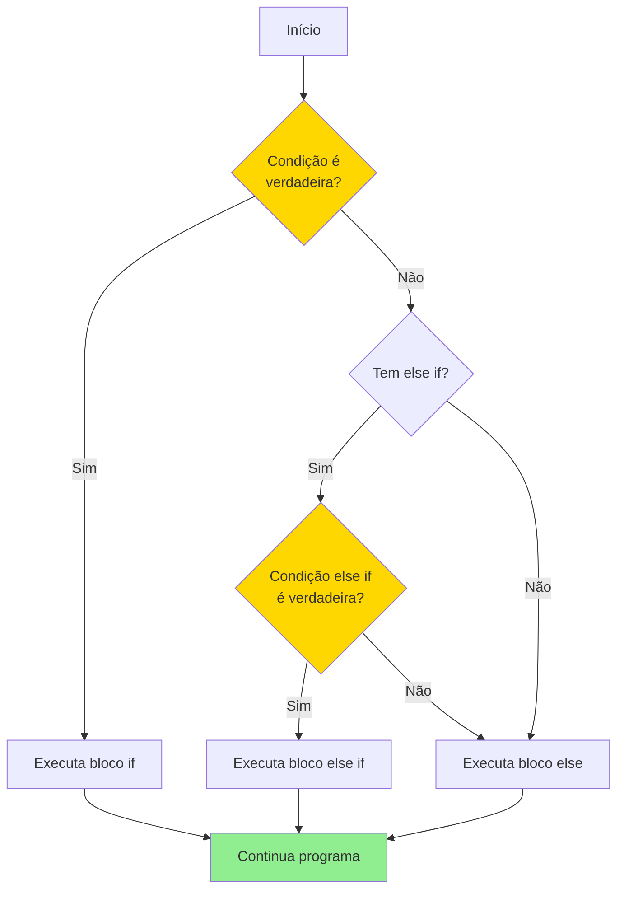
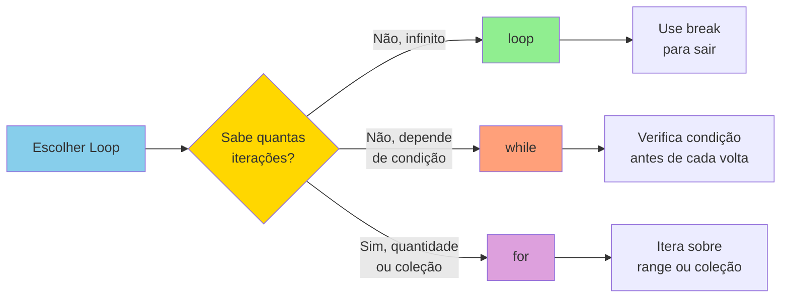
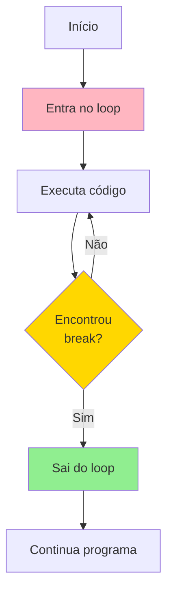
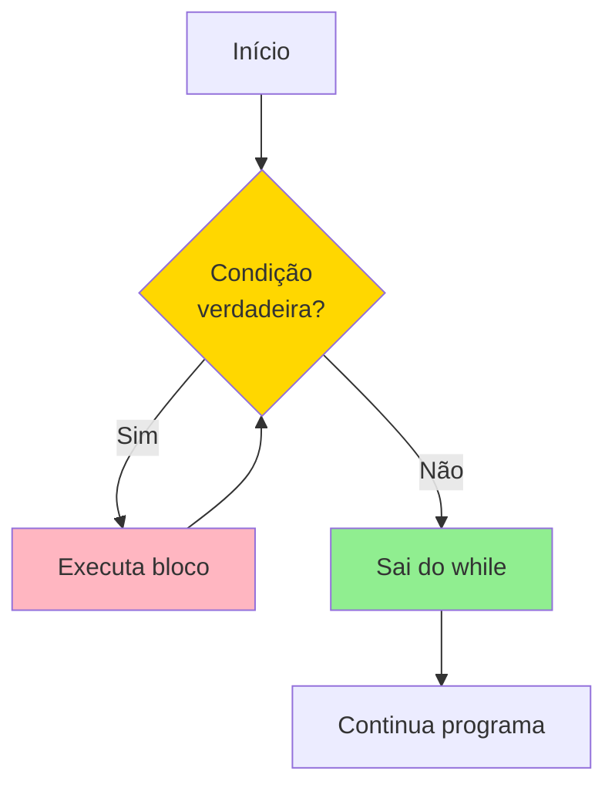
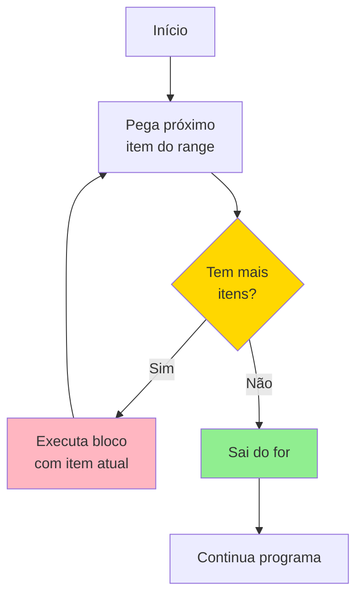
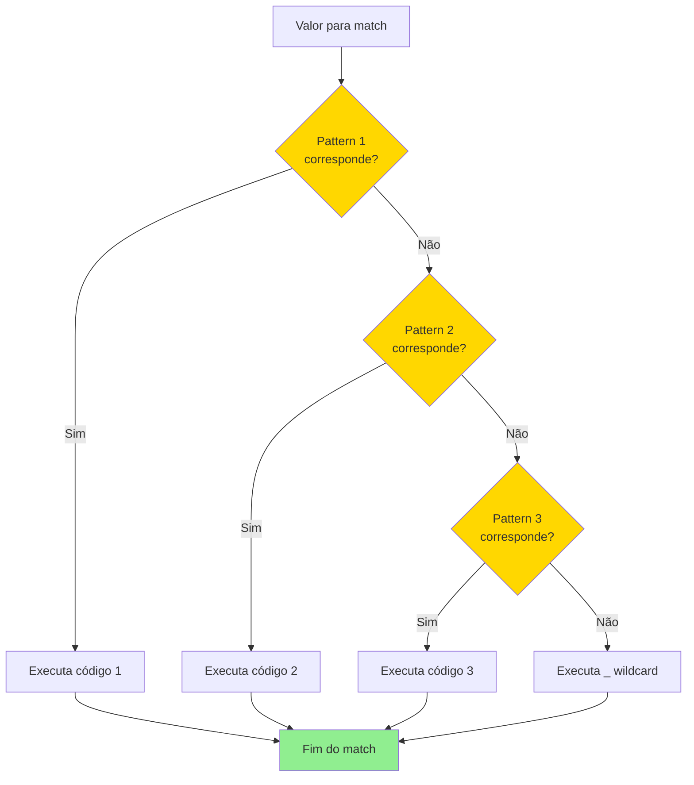
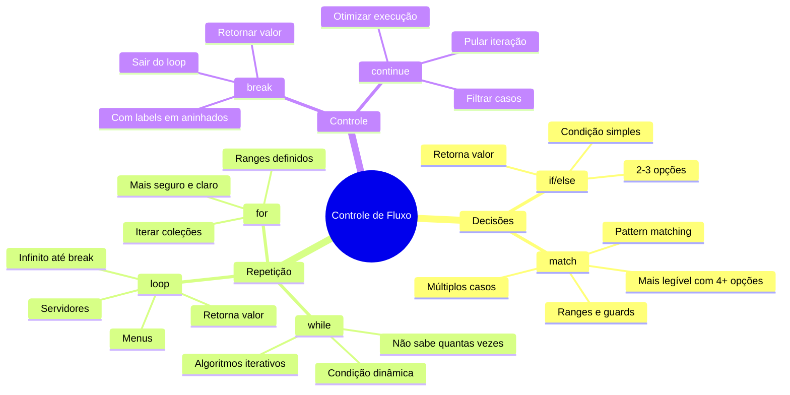

# 📅 DIA 3 - Controle de Fluxo: Escolhendo os Caminhos da Sua Aventura

[🏠 Início](#índice) | [📋 Objetivos](#objetivos-de-aprendizagem) | [🎭 História](#a-história-do-explorador) | [📚 Conteúdo](#conteúdo-técnico) | [🎯 Exercício](#exercício-do-dia) | [✅ Checkpoint](#checkpoint-do-dia)

---

## 🎭 A História do Explorador

Imagine que você é um **explorador em uma ilha misteriosa** procurando por tesouros escondidos. Em cada ponto da jornada, você precisa tomar **decisões**:

- **Vejo uma bifurcação:** Vou para a esquerda ou direita? (if/else)
- **Encontro um rio:** Devo atravessá-lo repetidamente até encontrar a ponte? (loop)
- **Subo uma montanha:** Continuo enquanto tiver energia? (while)
- **Exploro cavernas:** Vou checar as 10 cavernas da ilha, uma por uma? (for)
- **Encontro um mapa antigo:** Cada símbolo indica uma ação diferente - qual é? (match)

No **Dia 2**, você aprendeu sobre os **tipos de tesouro** que pode encontrar (variáveis e tipos). Hoje, você vai aprender a **navegar pela ilha** e **escolher seus caminhos**. Cada estrutura de controle é como uma **ferramenta diferente no seu kit de explorador** - saber qual usar em cada situação é a chave para se tornar um mestre aventureiro em Rust! 🗺️

---

## 📋 OBJETIVOS DE APRENDIZAGEM

Ao final deste dia, você será capaz de:

**🎯 Objetivo 1:** Utilizar `if/else` **como expressões** para tomar decisões e retornar valores diretamente em variáveis.

**🎯 Objetivo 2:** Diferenciar e aplicar corretamente os três tipos de loops (`loop`, `while`, `for`) escolhendo o mais apropriado para cada situação.

**🎯 Objetivo 3:** Implementar `match` para realizar **pattern matching** com múltiplas condições de forma elegante e segura.

**🎯 Objetivo 4:** Controlar o fluxo de loops usando `break` e `continue`, incluindo **labels** para loops aninhados.

**🎯 Objetivo 5:** Criar um programa interativo completo que combine todas as estruturas de controle de fluxo aprendidas.

---

## 📚 CONTEÚDO TÉCNICO

### 🔀 PARTE 1: If/Else - A Bifurcação do Caminho

#### 💡 Conceito Central

Em Rust, `if/else` não é apenas um **statement** (comando), mas uma **expressão** que **retorna um valor**. Isso significa que você pode usar `if/else` para atribuir valores diretamente a variáveis!

**Analogia:** É como escolher entre duas portas - cada porta te leva a um tesouro diferente, e você pode **pegar o tesouro e guardar na sua mochila** (variável) diretamente.

#### 📊 Diagrama de Fluxo



#### 🔍 If/Else Básico

```rust {.line-numbers}
fn main() {
    let energia = 75;
    
    // If/else como expressão - retorna valor!
    let status = if energia > 50 {
        "Forte para explorar!" // sem ponto e vírgula = retorna valor
    } else {
        "Precisa descansar..."
    };
    
    println!("Status: {}", status);
    // Output: Status: Forte para explorar!
}
```

#### ⚡ If/Else Encadeado (else if)

```rust {.line-numbers}
fn main() {
    let tesouros_encontrados = 7;
    
    let nivel_explorador = if tesouros_encontrados >= 10 {
        "Mestre Explorador"
    } else if tesouros_encontrados >= 5 {
        "Explorador Experiente"
    } else if tesouros_encontrados >= 1 {
        "Aprendiz"
    } else {
        "Novato"
    };
    
    println!("Nível: {}", nivel_explorador);
    // Output: Nível: Explorador Experiente
}
```

#### ⚠️ Importante: Tipos Devem Ser Compatíveis

```rust {.line-numbers}
fn main() {
    let numero = 5;
    
    // ❌ ERRO: Tipos incompatíveis (i32 vs &str)
    // let resultado = if numero > 3 {
    //     10  // i32
    // } else {
    //     "pequeno"  // &str
    // };
    
    // ✅ CORRETO: Ambos os braços retornam i32
    let resultado = if numero > 3 {
        10
    } else {
        0
    };
    
    println!("Resultado: {}", resultado);
}
```

---

### 🔄 PARTE 2: Loops - Percorrendo Caminhos Repetidamente

Rust oferece **três tipos de loops**, cada um com um propósito específico. É como ter **três tipos de veículos** para explorar a ilha:

- **loop:** Helicóptero - voa para sempre até você decidir pousar (`break`)
- **while:** Barco a vela - navega enquanto houver vento (condição verdadeira)
- **for:** Trem nos trilhos - percorre uma rota definida (iteração sobre coleção)

#### 📊 Diagrama Comparativo



---

#### 🔁 Loop Infinito (loop)

O `loop` cria um **loop infinito** que só para quando você usar `break`.

```rust {.line-numbers}
fn main() {
    let mut contador = 0;
    
    loop {
        contador += 1;
        println!("Explorando caverna {}...", contador);
        
        if contador == 3 {
            println!("Tesouro encontrado!");
            break; // Sai do loop
        }
    }
    
    println!("Total de cavernas exploradas: {}", contador);
}
```

**Output:**
```
Explorando caverna 1...
Explorando caverna 2...
Explorando caverna 3...
Tesouro encontrado!
Total de cavernas exploradas: 3
```

#### 💎 Loop que Retorna Valor

Assim como `if`, `loop` também pode **retornar um valor** com `break`!

```rust {.line-numbers}
fn main() {
    let mut tentativas = 0;
    
    let resultado = loop {
        tentativas += 1;
        
        if tentativas == 5 {
            break tentativas * 10; // Retorna 50
        }
    };
    
    println!("Pontuação final: {}", resultado);
    // Output: Pontuação final: 50
}
```

#### 📊 Fluxograma do Loop



---

#### ⏰ While - Loop Condicional

O `while` executa **enquanto** uma condição for verdadeira.

```rust {.line-numbers}
fn main() {
    let mut energia = 100;
    let mut distancia = 0;
    
    // Caminha enquanto tiver energia
    while energia > 0 {
        distancia += 10; // Avança 10 metros
        energia -= 15;   // Gasta energia
        
        println!("Distância: {}m | Energia: {}%", distancia, energia);
    }
    
    println!("\nParou! Energia esgotada.");
    println!("Total percorrido: {}m", distancia);
}
```

**Output:**
```
Distância: 10m | Energia: 85%
Distância: 20m | Energia: 70%
Distância: 30m | Energia: 55%
Distância: 40m | Energia: 40%
Distância: 50m | Energia: 25%
Distância: 60m | Energia: 10%
Distância: 70m | Energia: -5%

Parou! Energia esgotada.
Total percorrido: 70m
```

#### 📊 Fluxograma While



---

#### 🚂 For - Iteração sobre Sequências

O `for` é perfeito para percorrer **ranges** (intervalos) ou **coleções**.

##### 📐 Ranges em Rust

```rust {.line-numbers}
fn main() {
    // Range EXCLUSIVO: 1..5 = 1, 2, 3, 4 (NÃO inclui 5)
    println!("Cavernas de 1 a 4:");
    for caverna in 1..5 {
        println!("  Explorando caverna {}", caverna);
    }
    
    println!("\nCavernas de 1 a 5:");
    // Range INCLUSIVO: 1..=5 = 1, 2, 3, 4, 5 (inclui 5)
    for caverna in 1..=5 {
        println!("  Explorando caverna {}", caverna);
    }
}
```

**Diferença Importante:**
- `1..5` → 1, 2, 3, 4 (não inclui o 5)
- `1..=5` → 1, 2, 3, 4, 5 (inclui o 5)

##### 🔄 For com Rev (reverso)

```rust {.line-numbers}
fn main() {
    println!("Contagem regressiva:");
    for numero in (1..=5).rev() {
        println!("{}...", numero);
    }
    println!("Partiu explorar!");
}
```

**Output:**
```
Contagem regressiva:
5...
4...
3...
2...
1...
Partiu explorar!
```

#### 📊 Fluxograma For



---

### 📊 Tabela Comparativa: Loop vs While vs For

| Característica             | loop                     | while                          | for                             |
| -------------------------- | ------------------------ | ------------------------------ | ------------------------------- |
| **Quando usar**            | Loop infinito até break  | Enquanto condição é verdadeira | Iterar sobre sequências         |
| **Condição**               | Nenhuma (infinito)       | Verifica antes de cada volta   | Automática (baseada em coleção) |
| **Exemplo de uso**         | Menus, servidores, games | Algoritmos iterativos          | Processar arrays, ranges        |
| **Retorna valor?**         | Sim, com `break valor`   | Não diretamente                | Não diretamente                 |
| **Risco de loop infinito** | Alto (sem break)         | Médio (condição sempre true)   | Baixo (termina automaticamente) |
| **Clareza de código**      | Explícito sobre infinito | Clara intenção condicional     | Mais legível para coleções      |

---

### 🎯 PARTE 3: Break e Continue - Controlando a Jornada

#### 🛑 Break - Saindo do Loop

`break` **interrompe completamente** o loop.

```rust {.line-numbers}
fn main() {
    for numero in 1..=10 {
        if numero == 5 {
            println!("Encontrou tesouro no número {}!", numero);
            break; // Para o loop completamente
        }
        println!("Procurando... {}", numero);
    }
    println!("Loop finalizado!");
}
```

**Output:**
```
Procurando... 1
Procurando... 2
Procurando... 3
Procurando... 4
Encontrou tesouro no número 5!
Loop finalizado!
```

#### ⏭️ Continue - Pulando Iteração

`continue` **pula para a próxima iteração** do loop.

```rust {.line-numbers}
fn main() {
    for numero in 1..=10 {
        if numero % 2 == 0 {
            continue; // Pula números pares
        }
        println!("Número ímpar: {}", numero);
    }
}
```

**Output:**
```
Número ímpar: 1
Número ímpar: 3
Número ímpar: 5
Número ímpar: 7
Número ímpar: 9
```

#### 🏷️ Labels - Loops Aninhados

Quando você tem **loops dentro de loops**, pode usar **labels** para controlar qual loop deve ser interrompido.

```rust {.line-numbers}
fn main() {
    // Label do loop externo
    'explorar_ilha: for regiao in 1..=3 {
        println!("\n=== Explorando Região {} ===", regiao);
        
        for caverna in 1..=5 {
            println!("  Caverna {}", caverna);
            
            if regiao == 2 && caverna == 3 {
                println!("  🏆 TESOURO LENDÁRIO ENCONTRADO!");
                println!("  Missão completa, voltando para casa!");
                break 'explorar_ilha; // Sai do loop externo
            }
        }
    }
    
    println!("\n✅ Expedição finalizada!");
}
```

**Output:**
```
=== Explorando Região 1 ===
  Caverna 1
  Caverna 2
  Caverna 3
  Caverna 4
  Caverna 5

=== Explorando Região 2 ===
  Caverna 1
  Caverna 2
  Caverna 3
  🏆 TESOURO LENDÁRIO ENCONTRADO!
  Missão completa, voltando para casa!

✅ Expedição finalizada!
```

---

### 🎲 PARTE 4: Match - O Mapa do Tesouro

O `match` é uma das ferramentas **mais poderosas** de Rust. Ele permite fazer **pattern matching** - comparar um valor contra múltiplos padrões e executar código diferente para cada um.

**Analogia:** Você encontrou um **mapa antigo com símbolos místicos**. Cada símbolo indica uma ação diferente. O `match` te ajuda a interpretar cada símbolo e agir de acordo!

#### 📊 Diagrama de Decisão Match



#### 🔍 Match Básico

```rust {.line-numbers}
fn main() {
    let simbolo = 3;
    
    match simbolo {
        1 => println!("🗡️ Símbolo da Espada - Vá para o norte!"),
        2 => println!("🛡️ Símbolo do Escudo - Defenda-se!"),
        3 => println!("🏆 Símbolo do Tesouro - Cave aqui!"),
        4 => println!("⚠️ Símbolo de Perigo - Cuidado!"),
        _ => println!("❓ Símbolo desconhecido"),
    }
}
```

**Output:** `🏆 Símbolo do Tesouro - Cave aqui!`

#### 💡 Match como Expressão

Assim como `if`, `match` também retorna valor!

```rust {.line-numbers}
fn main() {
    let codigo_tesouro = 2;
    
    let tesouro = match codigo_tesouro {
        1 => "Moedas de ouro",
        2 => "Diamante raro",
        3 => "Mapa antigo",
        _ => "Baú vazio",
    };
    
    println!("Você encontrou: {}", tesouro);
    // Output: Você encontrou: Diamante raro
}
```

#### 🎯 Match com Ranges

```rust {.line-numbers}
fn main() {
    let pontuacao = 87;
    
    let nivel = match pontuacao {
        0..=49 => "Iniciante",
        50..=74 => "Intermediário",
        75..=89 => "Avançado",
        90..=100 => "Mestre",
        _ => "Pontuação inválida",
    };
    
    println!("Nível: {}", nivel);
    // Output: Nível: Avançado
}
```

#### 🔀 Match com Múltiplos Valores (Pipe |)

```rust {.line-numbers}
fn main() {
    let dia_semana = 6;
    
    let tipo_dia = match dia_semana {
        1 | 2 | 3 | 4 | 5 => "Dia de trabalho",
        6 | 7 => "Final de semana",
        _ => "Dia inválido",
    };
    
    println!("{}", tipo_dia);
    // Output: Final de semana
}
```

#### ⚡ Match com Guards (if adicional)

```rust {.line-numbers}
fn main() {
    let numero = 7;
    
    match numero {
        n if n < 0 => println!("Número negativo"),
        n if n % 2 == 0 => println!("Número par: {}", n),
        n if n % 2 != 0 => println!("Número ímpar: {}", n),
        _ => println!("Caso especial"),
    }
    // Output: Número ímpar: 7
}
```

---

### 🗺️ PARTE 5: Mapa Mental - Quando Usar Cada Estrutura



---

## 💡 DEMONSTRAÇÃO E MODELAGEM

### Exemplo Progressivo: Sistema de Exploração

Vamos construir um exemplo que evolui gradualmente em complexidade.

#### 📌 Nível 1: Simples - Decisão Básica

```rust {.line-numbers}
fn main() {
    let energia = 80;
    
    if energia > 50 {
        println!("Vamos explorar!");
    } else {
        println!("Melhor descansar...");
    }
}
```

#### 📌 Nível 2: Intermediário - Loop + Match

```rust {.line-numbers}
fn main() {
    let mut posicao = 1;
    
    loop {
        println!("\n--- Posição {} ---", posicao);
        
        match posicao {
            1 => println!("Início da trilha"),
            2 => println!("Encontrou uma bifurcação"),
            3 => {
                println!("TESOURO ENCONTRADO!");
                break;
            }
            _ => println!("Continua explorando..."),
        }
        
        posicao += 1;
    }
}
```

#### 📌 Nível 3: Avançado - Combinando Tudo

```rust {.line-numbers}
fn main() {
    let mut energia = 100;
    let mut tesouros = 0;
    
    'exploracao: for regiao in 1..=3 {
        println!("\n=== REGIÃO {} ===", regiao);
        
        while energia > 0 {
            energia -= 10;
            println!("Energia: {}%", energia);
            
            let encontrou = regiao * 3; // Simula descoberta
            
            match encontrou {
                3 | 6 => {
                    tesouros += 1;
                    println!("✨ Tesouro encontrado! Total: {}", tesouros);
                }
                9 => {
                    println!("🏆 TESOURO LENDÁRIO!");
                    break 'exploracao;
                }
                _ => continue,
            }
            
            if tesouros >= 2 {
                println!("Missão cumprida!");
                break 'exploracao;
            }
        }
    }
    
    let status = if tesouros > 0 {
        "Sucesso"
    } else {
        "Falhou"
    };
    
    println!("\nStatus final: {} | Tesouros: {}", status, tesouros);
}
```

---

## 🎯 EXERCÍCIO DO DIA: Jogo de Adivinhação Interativo

### 🎮 Contexto

Você vai criar um **jogo de adivinhação** onde o programa escolhe um número secreto e o jogador tem tentativas limitadas para descobri-lo. O jogo deve dar dicas (maior/menor) e calcular pontuação baseada no número de tentativas!

### 📋 Especificação

**Requisitos:**

1. Número secreto entre 1 e 100
2. Máximo de 7 tentativas
3. Sistema de dicas (seu palpite é maior ou menor)
4. Validação de entrada (números válidos)
5. Sistema de pontuação:
   - Acertou na 1ª tentativa: 100 pontos
   - Cada tentativa a mais: -10 pontos
6. Perguntar se quer jogar novamente
7. **Usar:** `loop`, `match`, `if/else`, `break`, `continue`

### 🏗️ Código Inicial (Scaffolding)

```rust {.line-numbers}
use std::io;

fn main() {
    println!("🎯 BEM-VINDO AO JOGO DE ADIVINHAÇÃO! 🎯");
    println!("======================================\n");
    
    // O número secreto (depois você pode tornar aleatório)
    let numero_secreto = 42;
    
    let mut tentativas = 0;
    let tentativas_maximas = 7;
    
    // TODO: Criar um loop principal para o jogo
    // TODO: Ler o palpite do usuário
    // TODO: Validar se é um número válido
    // TODO: Usar match para comparar com o número secreto
    // TODO: Dar dicas e controlar tentativas
    // TODO: Calcular pontuação final
}
```

### 💡 Dicas Progressivas

**🔹 Dica 1 - Lendo Entrada do Usuário:**

```rust {.line-numbers}
let mut entrada = String::new();
io::stdin()
    .read_line(&mut entrada)
    .expect("Falha ao ler entrada");

// Converter String para número
let palpite: i32 = match entrada.trim().parse() {
    Ok(num) => num,
    Err(_) => {
        println!("Por favor, digite um número válido!");
        continue; // Volta para o início do loop
    }
};
```

**🔹 Dica 2 - Estrutura do Loop Principal:**

```rust {.line-numbers}
loop {
    tentativas += 1;
    println!("\nTentativa {}/{}", tentativas, tentativas_maximas);
    
    // TODO: Ler palpite
    // TODO: Comparar com número secreto
    
    if tentativas >= tentativas_maximas {
        println!("\n💀 Suas tentativas acabaram!");
        break;
    }
}
```

**🔹 Dica 3 - Usando Match para Comparações:**

```rust {.line-numbers}
use std::cmp::Ordering;

match palpite.cmp(&numero_secreto) {
    Ordering::Less => println!("📉 Seu palpite é MENOR!"),
    Ordering::Greater => println!("📈 Seu palpite é MAIOR!"),
    Ordering::Equal => {
        println!("🎉 PARABÉNS! Você acertou!");
        break;
    }
}
```

### ✅ Solução Completa Comentada

```rust {.line-numbers}
use std::io;
use std::cmp::Ordering;

fn main() {
    println!("🎯 BEM-VINDO AO JOGO DE ADIVINHAÇÃO! 🎯");
    println!("======================================");
    println!("Tente adivinhar o número entre 1 e 100!\n");
    
    // Número secreto (em um jogo real, seria aleatório)
    let numero_secreto = 42;
    
    // Variáveis de controle do jogo
    let mut tentativas = 0;
    let tentativas_maximas = 7;
    let mut acertou = false;
    
    // Loop principal do jogo
    loop {
        tentativas += 1;
        println!("\n--- Tentativa {}/{} ---", tentativas, tentativas_maximas);
        print!("Digite seu palpite: ");
        
        // Garante que o print apareça antes do input
        use std::io::Write;
        io::stdout().flush().unwrap();
        
        // Lê a entrada do usuário
        let mut entrada = String::new();
        io::stdin()
            .read_line(&mut entrada)
            .expect("Falha ao ler entrada");
        
        // Converte para número e valida
        let palpite: i32 = match entrada.trim().parse() {
            Ok(num) => {
                // Valida se está no intervalo correto
                if num < 1 || num > 100 {
                    println!("⚠️ Digite um número entre 1 e 100!");
                    tentativas -= 1; // Não conta como tentativa
                    continue;
                }
                num
            }
            Err(_) => {
                println!("❌ Por favor, digite um número válido!");
                tentativas -= 1; // Não conta como tentativa
                continue;
            }
        };
        
        // Compara o palpite com o número secreto
        match palpite.cmp(&numero_secreto) {
            Ordering::Less => println!("📉 Seu palpite é MENOR que o número secreto!"),
            Ordering::Greater => println!("📈 Seu palpite é MAIOR que o número secreto!"),
            Ordering::Equal => {
                println!("\n🎉🎉🎉 PARABÉNS! Você acertou! 🎉🎉🎉");
                acertou = true;
                break; // Sai do loop
            }
        }
        
        // Verifica se as tentativas acabaram
        if tentativas >= tentativas_maximas {
            println!("\n💀 Game Over! Suas tentativas acabaram!");
            println!("O número secreto era: {}", numero_secreto);
            break;
        }
        
        // Dica extra baseada na proximidade
        let diferenca = (palpite - numero_secreto).abs();
        match diferenca {
            1..=5 => println!("🔥 Muito quente!"),
            6..=10 => println!("🌡️ Quente!"),
            11..=20 => println!("🧊 Frio!"),
            _ => println!("❄️ Muito frio!"),
        }
    }
    
    // Cálculo da pontuação
    if acertou {
        let pontuacao = 100 - ((tentativas - 1) * 10);
        
        println!("\n📊 ESTATÍSTICAS FINAIS");
        println!("====================");
        println!("Tentativas usadas: {}", tentativas);
        println!("Pontuação: {} pontos", pontuacao);
        
        // Avaliação baseada na pontuação
        let avaliacao = match pontuacao {
            100 => "🏆 PERFEITO! Primeira tentativa!",
            80..=90 => "⭐ Excelente!",
            60..=79 => "👍 Muito bom!",
            40..=59 => "👌 Bom!",
            _ => "📈 Continue praticando!",
        };
        
        println!("Avaliação: {}", avaliacao);
    }
    
    println!("\n✨ Obrigado por jogar! ✨");
}
```

### 🚀 Melhorias Opcionais (Desafio Bônus)

Se você terminou o exercício principal, tente implementar:

**1. Níveis de Dificuldade:**
```rust {.line-numbers}
// Fácil: 1-50, 10 tentativas
// Médio: 1-100, 7 tentativas
// Difícil: 1-200, 5 tentativas
```

**2. Jogar Novamente:**
```rust {.line-numbers}
loop {
    // Todo o código do jogo aqui
    
    println!("\nJogar novamente? (s/n): ");
    let mut resposta = String::new();
    io::stdin().read_line(&mut resposta).unwrap();
    
    match resposta.trim().to_lowercase().as_str() {
        "s" | "sim" => continue,
        _ => break,
    }
}
```

**3. Histórico de Palpites:**
```rust {.line-numbers}
let mut historico = Vec::new();
historico.push(palpite);

// Mostrar ao final
println!("Seus palpites: {:?}", historico);
```

---

## 🔄 FEEDBACK E AVALIAÇÃO

### ✅ Checklist de Aprendizado

Marque o que você conseguiu fazer:

**Decisões:**
- [ ] Usar `if/else` como expressão para atribuir valores
- [ ] Encadear condições com `else if`
- [ ] Garantir que tipos sejam compatíveis nos braços do `if`

**Loops:**
- [ ] Criar um `loop` infinito e sair com `break`
- [ ] Retornar valor de um `loop`
- [ ] Usar `while` com condições dinâmicas
- [ ] Iterar sobre ranges com `for`
- [ ] Diferenciar `..` (exclusivo) de `..=` (inclusivo)

**Controle:**
- [ ] Usar `break` para sair de loops
- [ ] Usar `continue` para pular iterações
- [ ] Aplicar labels em loops aninhados

**Pattern Matching:**
- [ ] Usar `match` para múltiplos casos
- [ ] Retornar valores com `match`
- [ ] Usar ranges em patterns
- [ ] Combinar múltiplos valores com `|`
- [ ] Adicionar guards com `if`

**Projeto:**
- [ ] Completar o jogo de adivinhação
- [ ] Validar entrada do usuário
- [ ] Implementar sistema de pontuação
- [ ] Combinar todas as estruturas de controle

### ⚠️ Erros Comuns e Como Resolver

**1. Loop Infinito Acidental:**

```rust {.line-numbers}
// ❌ ERRADO: Esqueceu o break
let mut i = 0;
loop {
    println!("{}", i);
    i += 1;
    // Loop infinito! Nunca para!
}

// ✅ CORRETO: Adicione condição de saída
let mut i = 0;
loop {
    println!("{}", i);
    i += 1;
    if i >= 5 {
        break;
    }
}
```

**2. Esquecer Underscore (_) no Match:**

```rust {.line-numbers}
// ❌ ERRADO: Não cobre todos os casos
let numero = 10;
match numero {
    1 => println!("Um"),
    2 => println!("Dois"),
    // E se numero for 3, 4, 5...?
}

// ✅ CORRETO: Sempre use _ para cobrir casos restantes
match numero {
    1 => println!("Um"),
    2 => println!("Dois"),
    _ => println!("Outro número"),
}
```

**3. Tipos Incompatíveis no If:**

```rust {.line-numbers}
// ❌ ERRADO: Retorna tipos diferentes
let resultado = if true {
    10  // i32
} else {
    "dez"  // &str - ERRO!
};

// ✅ CORRETO: Mesmo tipo em ambos os braços
let resultado = if true {
    10
} else {
    0
};
```

**4. Esquecer .cmp() ao Comparar:**

```rust {.line-numbers}
use std::cmp::Ordering;

// ✅ CORRETO
match palpite.cmp(&numero_secreto) {
    Ordering::Less => println!("Menor"),
    Ordering::Greater => println!("Maior"),
    Ordering::Equal => println!("Igual"),
}
```

### 🔍 Debugging de Loops

**Técnica 1 - Contador de Segurança:**

```rust {.line-numbers}
let mut contador = 0;
loop {
    contador += 1;
    println!("Iteração: {}", contador);
    
    if contador > 100 {
        println!("AVISO: Loop passou de 100 iterações!");
        break;
    }
}
```

**Técnica 2 - Prints de Debug:**

```rust {.line-numbers}
while condicao {
    println!("DEBUG: Valor atual = {}", variavel);
    println!("DEBUG: Condição = {}", condicao);
    // resto do código
}
```

### 📝 Quiz Interativo

**Pergunta 1:** Qual a diferença entre `1..5` e `1..=5`?

<details>
<summary>Ver resposta</summary>

- `1..5` → Range exclusivo: 1, 2, 3, 4 (NÃO inclui o 5)
- `1..=5` → Range inclusivo: 1, 2, 3, 4, 5 (INCLUI o 5)

</details>

**Pergunta 2:** Quando usar `loop` ao invés de `while`?

<details>
<summary>Ver resposta</summary>

Use `loop` quando:
- Você quer um loop infinito explícito
- Precisa retornar um valor com `break`
- A condição de saída é complexa e fica melhor dentro do loop
- Está criando menus ou servidores que rodam "para sempre"

</details>

**Pergunta 3:** O que faz este código?

```rust {.line-numbers}
'externo: for x in 1..=3 {
    for y in 1..=3 {
        if x == 2 && y == 2 {
            break 'externo;
        }
        println!("{}, {}", x, y);
    }
}
```

<details>
<summary>Ver resposta</summary>

Imprime:
```
1, 1
1, 2
1, 3
2, 1
```

Quando x=2 e y=2, `break 'externo` sai do loop externo completamente, não apenas do loop interno.

</details>

### 🎯 Auto-avaliação Reflexiva

Responda mentalmente:

1. Consigo explicar quando usar cada tipo de loop?
2. Entendo a diferença entre `break` e `continue`?
3. Sei usar `match` ao invés de múltiplos `if/else`?
4. Consegui completar o exercício sozinho?
5. O que foi mais desafiador hoje?

---

## ✅ CHECKPOINT DO DIA

Você consegue:

- [ ] Usar `if/else` como expressão que retorna valor
- [ ] Escolher entre `loop`, `while` e `for` apropriadamente
- [ ] Diferenciar ranges exclusivos (`..`) de inclusivos (`..=`)
- [ ] Implementar `match` com múltiplos padrões
- [ ] Usar `break` e `continue` para controlar loops
- [ ] Aplicar labels em loops aninhados
- [ ] Validar entrada do usuário
- [ ] Criar um programa interativo completo

**Se você marcou 6 ou mais, parabéns! Você está pronto para o Dia 4! 🎉**

Se teve dificuldade em alguns pontos:
- Revise a seção específica
- Pratique mais com o exercício
- Experimente variações do código
- Lembre-se: **errar faz parte do aprendizado!**

---

## 🚀 TRANSFERÊNCIA E APLICAÇÃO

### 🎁 Desafio Bônus: Menu Interativo

Crie um **menu de opções** para um sistema de gerenciamento de explorador:

```rust {.line-numbers}
loop {
    println!("\n=== MENU DO EXPLORADOR ===");
    println!("1. Ver status");
    println!("2. Explorar região");
    println!("3. Descansar");
    println!("4. Ver inventário");
    println!("5. Sair");
    
    // TODO: Ler opção
    // TODO: Usar match para executar ação
    // TODO: Opção 5 deve usar break
}
```

### 🔗 Conexão com Dia 4: Funções

No próximo dia, você vai aprender sobre **Funções** - como organizar todo esse código em blocos reutilizáveis! Imagine poder criar:

```rust {.line-numbers}
fn calcular_pontuacao(tentativas: i32) -> i32 {
    // Sua lógica aqui
}

fn validar_entrada(texto: &str) -> Result<i32, String> {
    // Validação aqui
}
```

Você vai transformar seu código em peças modulares e organizadas! 📦

### 📚 Recursos Extras

**Documentação Oficial:**
- [The Rust Book - Control Flow](https://doc.rust-lang.org/book/ch03-05-control-flow.html)
- [Rust by Example - Flow Control](https://doc.rust-lang.org/rust-by-example/flow_control.html)

**Pratique Mais:**
- [Rustlings - exercícios if/match](https://github.com/rust-lang/rustlings)
- [Exercism - Rust Track](https://exercism.org/tracks/rust)

**Vídeos (inglês):**
- "Rust Crash Course" - controle de fluxo
- "Let's Get Rusty" - pattern matching

---

## 🎉 PARABÉNS!

Você completou o **Dia 3** e agora sabe:

✅ Tomar decisões com `if/else` como expressões
✅ Repetir ações com `loop`, `while` e `for`
✅ Fazer pattern matching poderoso com `match`
✅ Controlar loops com `break`, `continue` e labels
✅ Criar programas interativos completos

Você está construindo uma **base sólida** em Rust! Continue praticando, experimente variações dos exemplos, e lembre-se: **cada erro é uma oportunidade de aprender**! 🦀

**Rust não é apenas uma linguagem - é uma nova maneira de pensar sobre programação!**

Nos vemos no Dia 4! 🚀

---

[🔝 Voltar ao Início](#índice)
