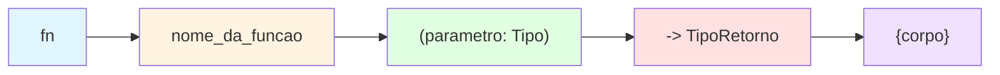
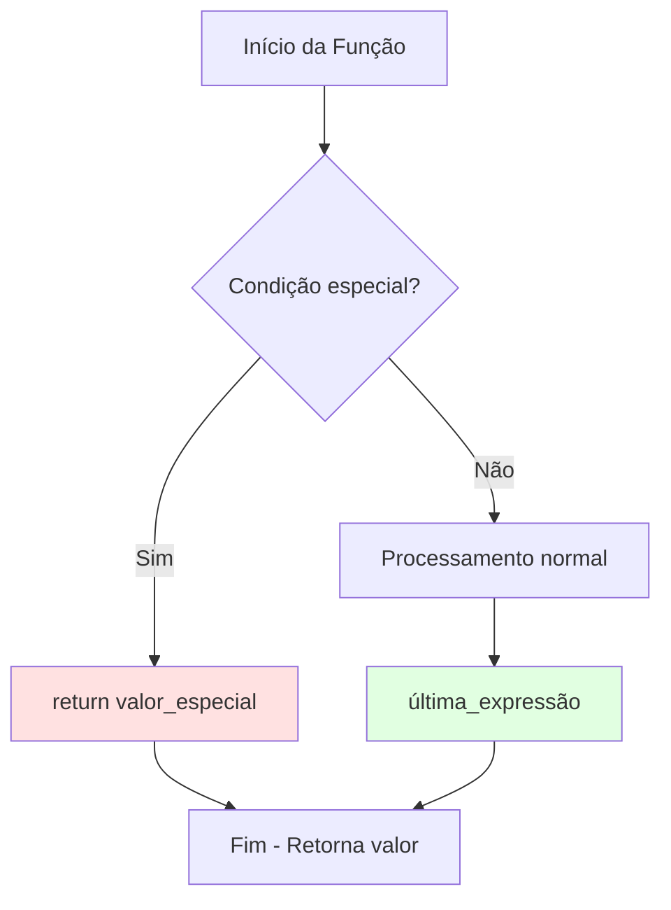
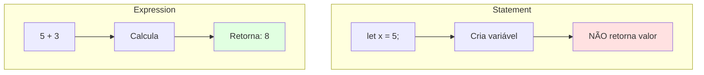
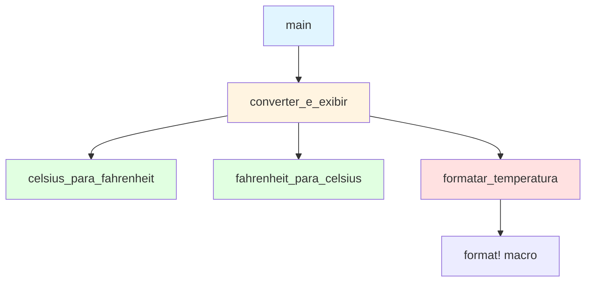
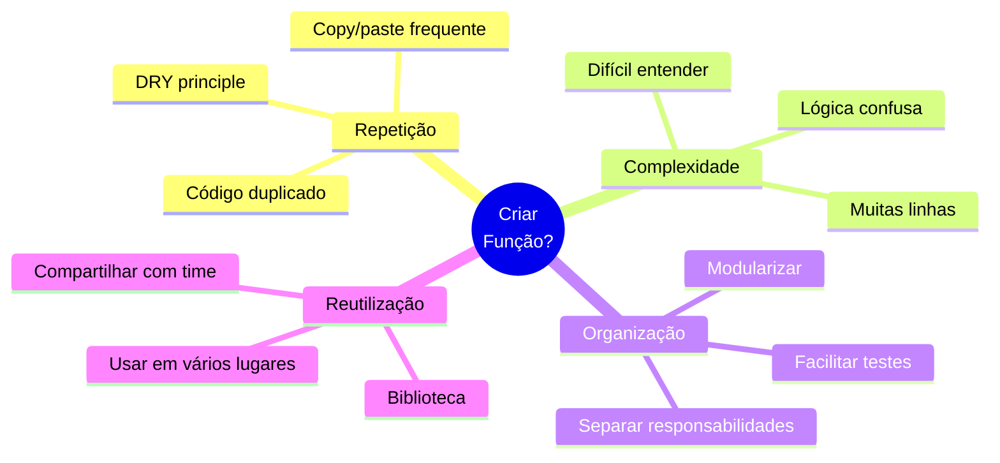
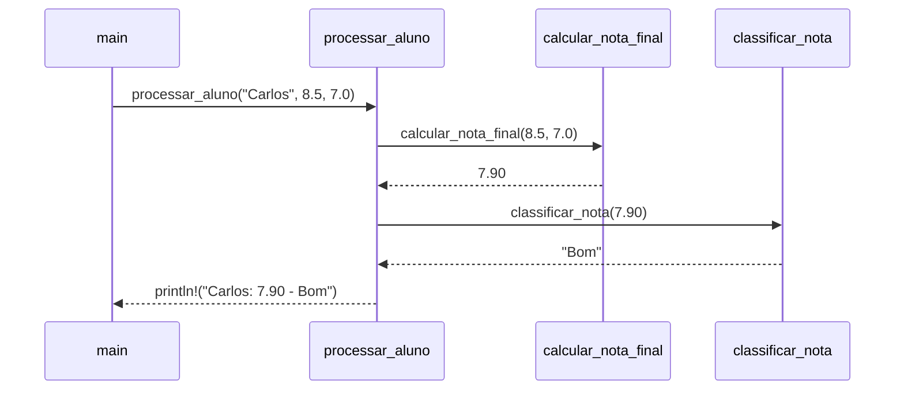
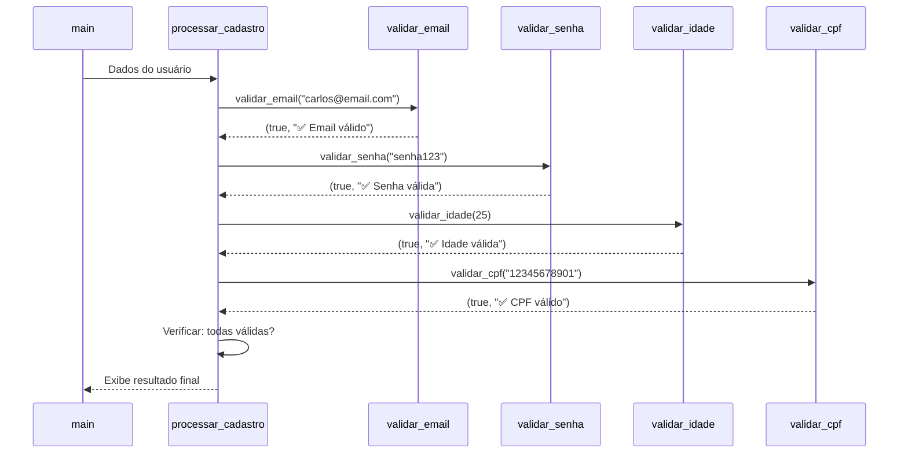

# 📅 DIA 4 - Funções: A Arte de Construir Componentes Reutilizáveis

## 🎭 A HISTÓRIA DA FÁBRICA DE COMPONENTES

Imagine uma fábrica moderna. Em vez de um único operário fazendo todo o trabalho manualmente do início ao fim, a fábrica é dividida em **estações especializadas**. Uma estação corta o metal, outra solda, outra pinta, outra embala. Cada estação:

- Tem uma **entrada específica** (matéria-prima)
- Realiza uma **transformação única** (processamento)
- Produz uma **saída padronizada** (resultado)
- Pode ser **reutilizada** infinitas vezes
- Funciona de forma **independente** das outras

**Funções em Rust são exatamente essas estações especializadas!** Elas pegam dados de entrada (parâmetros), processam esses dados e devolvem um resultado. E o melhor: você escreve uma vez, usa quantas vezes precisar.

Até agora, você vinha escrevendo todo o código dentro da função `main()`. Hoje, você vai aprender a criar suas próprias "estações de trabalho" e transformar seu código em algo **organizado, reutilizável e profissional**.

---

## 📚 O QUE VOCÊ VAI APRENDER

**Conceitos:**
- Anatomia completa de uma função em Rust
- Parâmetros e tipos
- Valores de retorno (implícito vs explícito)
- Statements vs Expressions (conceito revolucionário!)
- Tuplas para retornar múltiplos valores
- Modularização e DRY principle

**Habilidades:**
- Criar funções com sintaxe correta
- Passar dados para funções
- Retornar resultados de funções
- Organizar código em componentes reutilizáveis
- Decompor problemas complexos em funções simples

---

## 📋 OBJETIVOS DE APRENDIZAGEM

Ao final deste dia, você será capaz de:

- [ ] **Declarar funções** com sintaxe correta (`fn nome(param: tipo) -> tipo_retorno`)
- [ ] **Passar parâmetros** de diferentes tipos para funções
- [ ] **Retornar valores** usando retorno implícito e explícito
- [ ] **Diferenciar statements de expressions** (conceito fundamental em Rust)
- [ ] **Usar tuplas** para retornar múltiplos valores
- [ ] **Modularizar código** dividindo tarefas em funções especializadas
- [ ] **Aplicar o princípio DRY** (Don't Repeat Yourself) no seu código

---

## 📚 CONTEÚDO

### 1️⃣ ANATOMIA DE UMA FUNÇÃO

Vamos começar pelo básico absoluto. Uma função em Rust tem esta estrutura:

```rust
fn nome_da_funcao(parametro: Tipo) -> TipoRetorno {
    // corpo da função
    valor_retorno // sem ponto e vírgula!
}
```

**Diagrama - Anatomia Completa:**



**Componentes:**

| Componente | Descrição | Obrigatório? |
|------------|-----------|--------------|
| `fn` | Palavra-chave que declara função | ✅ Sim |
| `nome_da_funcao` | Identificador (snake_case) | ✅ Sim |
| `(param: Tipo)` | Parâmetros de entrada | ❌ Não (pode ser vazio) |
| `-> TipoRetorno` | Tipo do valor retornado | ❌ Não (se não retorna nada) |
| `{ corpo }` | Bloco de código | ✅ Sim |

---

### 2️⃣ FUNÇÕES SEM PARÂMETROS E SEM RETORNO

Começando pelo mais simples - funções que apenas executam ações:

```rust
fn saudar() {
    println!("Olá! Bem-vindo ao mundo das funções!");
}

fn main() {
    saudar(); // Chama a função
    saudar(); // Pode chamar quantas vezes quiser!
    saudar(); // Reutilização em ação!
}
```

**Saída:**
```
Olá! Bem-vindo ao mundo das funções!
Olá! Bem-vindo ao mundo das funções!
Olá! Bem-vindo ao mundo das funções!
```

💡 **Observação:** Quando uma função não retorna nada, ela implicitamente retorna `()` (unit type - tupla vazia).

---

### 3️⃣ FUNÇÕES COM PARÂMETROS

Agora vamos adicionar **entradas** para nossas funções:

```rust
fn saudar_pessoa(nome: &str) {
    println!("Olá, {}! Prazer em conhecê-lo!", nome);
}

fn calcular_dobro(numero: i32) {
    let resultado = numero * 2;
    println!("O dobro de {} é {}", numero, resultado);
}

fn main() {
    saudar_pessoa("Carlos");
    saudar_pessoa("Ana");
    
    calcular_dobro(5);
    calcular_dobro(42);
}
```

**Saída:**
```
Olá, Carlos! Prazer em conhecê-lo!
Olá, Ana! Prazer em conhecê-lo!
O dobro de 5 é 10
O dobro de 42 é 84
```

**Múltiplos parâmetros:**

```rust
fn calcular_area_retangulo(largura: f64, altura: f64) {
    let area = largura * altura;
    println!("Área: {} m²", area);
}

fn main() {
    calcular_area_retangulo(5.0, 3.0);  // Saída: Área: 15 m²
    calcular_area_retangulo(10.5, 2.5); // Saída: Área: 26.25 m²
}
```

---

### 4️⃣ FUNÇÕES COM RETORNO

Aqui está o poder real das funções - **transformar entradas em saídas!**

#### 🔹 Retorno Implícito (sem ponto e vírgula)

```rust
fn somar(a: i32, b: i32) -> i32 {
    a + b  // SEM ponto e vírgula = retorno implícito!
}

fn multiplicar(x: i32, y: i32) -> i32 {
    x * y  // A última expressão é retornada
}

fn main() {
    let resultado1 = somar(5, 3);
    let resultado2 = multiplicar(4, 7);
    
    println!("5 + 3 = {}", resultado1);  // Saída: 8
    println!("4 × 7 = {}", resultado2);  // Saída: 28
}
```

#### 🔹 Retorno Explícito (com `return`)

```rust
fn dividir(dividendo: f64, divisor: f64) -> f64 {
    if divisor == 0.0 {
        println!("Erro: divisão por zero!");
        return 0.0;  // Retorna cedo em caso de erro
    }
    
    dividendo / divisor  // Retorno implícito normal
}

fn main() {
    println!("10 ÷ 2 = {}", dividir(10.0, 2.0));  // 5.0
    println!("10 ÷ 0 = {}", dividir(10.0, 0.0));  // 0.0 (com mensagem de erro)
}
```

**Diagrama - Fluxo de Retorno:**



---

### 5️⃣ STATEMENTS VS EXPRESSIONS (CONCEITO FUNDAMENTAL!)

**Este é um dos conceitos mais importantes de Rust!** Entenda isso e você entenderá 50% da sintaxe da linguagem.

#### 🔸 Statement (Declaração)
- **Executa uma ação**
- **NÃO produz valor**
- Termina com ponto e vírgula `;`
- Exemplos: `let x = 5;`, `println!("oi");`

#### 🔸 Expression (Expressão)
- **Avalia para um valor**
- **PRODUZ um resultado**
- NÃO termina com `;` (quando queremos usar o valor)
- Exemplos: `5 + 3`, `if x > 0 { 10 } else { 0 }`, blocos `{ ... }`

**Diagrama - Diferença Visual:**



**Exemplo Prático:**

```rust
fn exemplo_expressions() -> i32 {
    let x = 5; // Statement
    
    // Um BLOCO é uma expression!
    let y = {
        let temp = x + 1;
        temp * 2  // SEM ; = retorna o valor!
    }; // O bloco retorna 12, que é atribuído a y
    
    println!("y = {}", y); // y = 12
    
    // if/else também é expression!
    let resultado = if y > 10 {
        100  // Retorna 100
    } else {
        0    // Retorna 0
    };
    
    resultado // Retorna 100
}

fn main() {
    let valor = exemplo_expressions();
    println!("Resultado: {}", valor); // 100
}
```

⚠️ **ERRO COMUM - Adicionar `;` por acidente:**

```rust
fn errado() -> i32 {
    let x = 10;
    x + 5; // ❌ Com ; vira statement, não retorna nada!
}
// ERRO: função deveria retornar i32, mas retorna ()

fn correto() -> i32 {
    let x = 10;
    x + 5  // ✅ Sem ; = expression, retorna 15!
}
```

---

### 6️⃣ RETORNANDO MÚLTIPLOS VALORES COM TUPLAS

Rust não permite múltiplos valores de retorno diretos, mas tuplas resolvem isso elegantemente:

```rust
// Retorna (quociente, resto)
fn dividir_com_resto(dividendo: i32, divisor: i32) -> (i32, i32) {
    let quociente = dividendo / divisor;
    let resto = dividendo % divisor;
    (quociente, resto)  // Tupla!
}

fn main() {
    let (q, r) = dividir_com_resto(17, 5);
    println!("17 ÷ 5 = {} com resto {}", q, r);
    // Saída: 17 ÷ 5 = 3 com resto 2
    
    // Pode usar a tupla inteira também
    let resultado = dividir_com_resto(100, 7);
    println!("Resultado completo: {:?}", resultado);
    // Saída: Resultado completo: (14, 2)
}
```

**Exemplo Prático - Estatísticas:**

```rust
fn calcular_estatisticas(numeros: &[i32]) -> (i32, i32, f64) {
    let minimo = *numeros.iter().min().unwrap();
    let maximo = *numeros.iter().max().unwrap();
    let soma: i32 = numeros.iter().sum();
    let media = soma as f64 / numeros.len() as f64;
    
    (minimo, maximo, media) // (mínimo, máximo, média)
}

fn main() {
    let dados = [10, 25, 15, 30, 20];
    let (min, max, avg) = calcular_estatisticas(&dados);
    
    println!("Mínimo: {}", min);   // 10
    println!("Máximo: {}", max);   // 30
    println!("Média: {:.2}", avg); // 20.00
}
```

---

### 7️⃣ FUNÇÕES CHAMANDO FUNÇÕES (MODULARIZAÇÃO)

O verdadeiro poder das funções aparece quando elas trabalham juntas:

```rust
// Funções especializadas e reutilizáveis
fn celsius_para_fahrenheit(celsius: f64) -> f64 {
    celsius * 9.0 / 5.0 + 32.0
}

fn fahrenheit_para_celsius(fahrenheit: f64) -> f64 {
    (fahrenheit - 32.0) * 5.0 / 9.0
}

fn formatar_temperatura(valor: f64, unidade: &str) -> String {
    format!("{:.1}°{}", valor, unidade)
}

// Função coordenadora que usa as outras
fn converter_e_exibir(temp: f64, de: &str, para: &str) {
    let convertida = match (de, para) {
        ("C", "F") => celsius_para_fahrenheit(temp),
        ("F", "C") => fahrenheit_para_celsius(temp),
        _ => temp,
    };
    
    let origem = formatar_temperatura(temp, de);
    let destino = formatar_temperatura(convertida, para);
    
    println!("{} = {}", origem, destino);
}

fn main() {
    converter_e_exibir(25.0, "C", "F");  // 25.0°C = 77.0°F
    converter_e_exibir(98.6, "F", "C");  // 98.6°F = 37.0°C
}
```

**Diagrama - Arquitetura Modular:**



---

### 8️⃣ QUANDO CRIAR UMA FUNÇÃO?

**Mapa Mental - Sinais de que você precisa criar uma função:**



**Princípio DRY (Don't Repeat Yourself):**

❌ **ANTES (repetitivo):**
```rust
fn main() {
    // Calculando área 1
    let largura1 = 5.0;
    let altura1 = 3.0;
    let area1 = largura1 * altura1;
    println!("Área 1: {}", area1);
    
    // Calculando área 2
    let largura2 = 8.0;
    let altura2 = 4.0;
    let area2 = largura2 * altura2;
    println!("Área 2: {}", area2);
    
    // Calculando área 3
    let largura3 = 10.0;
    let altura3 = 2.5;
    let area3 = largura3 * altura3;
    println!("Área 3: {}", area3);
}
```

✅ **DEPOIS (com função):**
```rust
fn calcular_e_exibir_area(largura: f64, altura: f64) {
    let area = largura * altura;
    println!("Área: {} m²", area);
}

fn main() {
    calcular_e_exibir_area(5.0, 3.0);
    calcular_e_exibir_area(8.0, 4.0);
    calcular_e_exibir_area(10.0, 2.5);
}
```

**Benefícios:**
- 📉 Menos linhas de código
- 🔧 Fácil de modificar (só um lugar)
- 🐛 Fácil de testar
- 📖 Mais legível

---

## 💡 DEMONSTRAÇÃO E MODELAGEM

### EVOLUÇÃO DE UM PROGRAMA: SEM FUNÇÕES → COM FUNÇÕES

**Problema:** Calcular nota final de alunos (média ponderada: provas 60%, trabalhos 40%)

#### 🔴 VERSÃO 1: Sem funções (código repetitivo)

```rust
fn main() {
    // Aluno 1
    let aluno1_nome = "Carlos";
    let aluno1_prova = 8.5;
    let aluno1_trabalho = 7.0;
    let aluno1_nota = aluno1_prova * 0.6 + aluno1_trabalho * 0.4;
    println!("{}: {:.2}", aluno1_nome, aluno1_nota);
    
    // Aluno 2
    let aluno2_nome = "Ana";
    let aluno2_prova = 9.0;
    let aluno2_trabalho = 8.5;
    let aluno2_nota = aluno2_prova * 0.6 + aluno2_trabalho * 0.4;
    println!("{}: {:.2}", aluno2_nome, aluno2_nota);
    
    // Aluno 3
    let aluno3_nome = "Pedro";
    let aluno3_prova = 7.0;
    let aluno3_trabalho = 6.5;
    let aluno3_nota = aluno3_prova * 0.6 + aluno3_trabalho * 0.4;
    println!("{}: {:.2}", aluno3_nome, aluno3_nota);
}
```

**Problemas:**
- Código duplicado 3 vezes
- Se mudar os pesos, precisa alterar em 3 lugares
- Difícil de manter

---

#### 🟡 VERSÃO 2: Com função de cálculo

```rust
fn calcular_nota_final(prova: f64, trabalho: f64) -> f64 {
    prova * 0.6 + trabalho * 0.4
}

fn main() {
    let aluno1_nome = "Carlos";
    let aluno1_nota = calcular_nota_final(8.5, 7.0);
    println!("{}: {:.2}", aluno1_nome, aluno1_nota);
    
    let aluno2_nome = "Ana";
    let aluno2_nota = calcular_nota_final(9.0, 8.5);
    println!("{}: {:.2}", aluno2_nome, aluno2_nota);
    
    let aluno3_nome = "Pedro";
    let aluno3_nota = calcular_nota_final(7.0, 6.5);
    println!("{}: {:.2}", aluno3_nome, aluno3_nota);
}
```

**Melhorias:**
- Cálculo centralizado
- Ainda tem repetição na exibição

---

#### 🟢 VERSÃO 3: Totalmente modularizada

```rust
fn calcular_nota_final(prova: f64, trabalho: f64) -> f64 {
    prova * 0.6 + trabalho * 0.4
}

fn classificar_nota(nota: f64) -> &'static str {
    if nota >= 9.0 {
        "Excelente"
    } else if nota >= 7.0 {
        "Bom"
    } else if nota >= 5.0 {
        "Regular"
    } else {
        "Insuficiente"
    }
}

fn processar_aluno(nome: &str, prova: f64, trabalho: f64) {
    let nota = calcular_nota_final(prova, trabalho);
    let classificacao = classificar_nota(nota);
    println!("{}: {:.2} - {}", nome, nota, classificacao);
}

fn main() {
    processar_aluno("Carlos", 8.5, 7.0);
    processar_aluno("Ana", 9.0, 8.5);
    processar_aluno("Pedro", 7.0, 6.5);
}
```

**Saída:**
```
Carlos: 7.90 - Bom
Ana: 8.80 - Bom
Pedro: 6.80 - Regular
```

**Diagrama - Fluxo de Chamadas:**



**Benefícios finais:**
- ✅ Cada função faz UMA coisa bem feita
- ✅ Fácil de testar cada parte
- ✅ Fácil de modificar (alterar pesos, adicionar classificações)
- ✅ Código limpo e profissional

---

## 🎯 PRÁTICA GUIADA: SISTEMA DE VALIDAÇÃO DE CADASTRO

### 📝 CONTEXTO

Você foi contratado para desenvolver um sistema de validação de cadastro de usuários. O sistema precisa validar:

1. **Email:** Deve conter `@` e `.`
2. **Senha:** Mínimo 8 caracteres, pelo menos 1 número
3. **Idade:** Entre 18 e 120 anos
4. **CPF:** Exatamente 11 dígitos (validação básica)

O programa deve processar um cadastro completo e informar se TODOS os campos são válidos.

---

### 🎯 ESPECIFICAÇÃO DO EXERCÍCIO

**Entrada:**
- Nome do usuário
- Email
- Senha
- Idade
- CPF (como String)

**Saída:**
- Resultado da validação de cada campo
- Mensagem final: "Cadastro aprovado!" ou "Cadastro rejeitado!"

**Requisitos técnicos:**
- Criar uma função para cada tipo de validação
- Cada função de validação retorna `(bool, String)` - (válido?, mensagem)
- Função principal `processar_cadastro` que coordena tudo
- Usar tuplas para retornar múltiplos valores

---

### 🧩 SCAFFOLDING (Código Inicial)

```rust
fn main() {
    // Dados de teste
    let nome = "Carlos Silva";
    let email = "carlos@email.com";
    let senha = "senha123";
    let idade = 25;
    let cpf = "12345678901";
    
    // Chame processar_cadastro aqui
    processar_cadastro(nome, email, senha, idade, cpf);
}

// TODO: Implementar esta função
fn validar_email(email: &str) -> (bool, String) {
    // Dica: use .contains() para verificar @ e .
    // Retorne (true, "Email válido") ou (false, "Email inválido: ...")
}

// TODO: Implementar esta função
fn validar_senha(senha: &str) -> (bool, String) {
    // Dica: use .len() e .chars().any(|c| c.is_numeric())
}

// TODO: Implementar esta função
fn validar_idade(idade: u8) -> (bool, String) {
    // Dica: verificar se está entre 18 e 120
}

// TODO: Implementar esta função
fn validar_cpf(cpf: &str) -> (bool, String) {
    // Dica: use .len() para verificar se tem 11 caracteres
    // Dica: use .chars().all(|c| c.is_numeric()) para verificar se são todos números
}

// TODO: Implementar esta função coordenadora
fn processar_cadastro(nome: &str, email: &str, senha: &str, idade: u8, cpf: &str) {
    println!("=== VALIDAÇÃO DE CADASTRO ===");
    println!("Nome: {}", nome);
    println!();
    
    // Valide cada campo e armazene os resultados
    // Exiba o resultado de cada validação
    // Determine se o cadastro foi aprovado (todas as validações passaram)
}
```

---

### 💡 DICAS PROGRESSIVAS

**Dica 1 - Validação de Email:**
```rust
fn validar_email(email: &str) -> (bool, String) {
    let tem_arroba = email.contains('@');
    let tem_ponto = email.contains('.');
    
    if tem_arroba && tem_ponto {
        (true, String::from("✅ Email válido"))
    } else {
        (false, String::from("❌ Email inválido: deve conter @ e ."))
    }
}
```

---

**Dica 2 - Validação de Senha:**
```rust
fn validar_senha(senha: &str) -> (bool, String) {
    let tamanho_ok = senha.len() >= 8;
    let tem_numero = senha.chars().any(|c| c.is_numeric());
    
    if tamanho_ok && tem_numero {
        (true, String::from("✅ Senha válida"))
    } else if !tamanho_ok {
        (false, String::from("❌ Senha inválida: mínimo 8 caracteres"))
    } else {
        (false, String::from("❌ Senha inválida: deve conter pelo menos 1 número"))
    }
}
```

---

**Dica 3 - Estrutura da função coordenadora:**
```rust
fn processar_cadastro(nome: &str, email: &str, senha: &str, idade: u8, cpf: &str) {
    println!("=== VALIDAÇÃO DE CADASTRO ===");
    println!("Nome: {}\n", nome);
    
    // Validar cada campo
    let (email_valido, msg_email) = validar_email(email);
    let (senha_valida, msg_senha) = validar_senha(senha);
    let (idade_valida, msg_idade) = validar_idade(idade);
    let (cpf_valido, msg_cpf) = validar_cpf(cpf);
    
    // Exibir resultados
    println!("{}", msg_email);
    println!("{}", msg_senha);
    println!("{}", msg_idade);
    println!("{}", msg_cpf);
    
    // Verificar se TODOS são válidos
    let tudo_valido = email_valido && senha_valida && idade_valida && cpf_valido;
    
    println!();
    if tudo_valido {
        println!("🎉 CADASTRO APROVADO!");
    } else {
        println!("⚠️ CADASTRO REJEITADO! Corrija os erros acima.");
    }
}
```

---

### ✅ SOLUÇÃO COMPLETA COMENTADA

```rust
// Valida se o email contém @ e .
fn validar_email(email: &str) -> (bool, String) {
    let tem_arroba = email.contains('@');
    let tem_ponto = email.contains('.');
    
    if tem_arroba && tem_ponto {
        (true, String::from("✅ Email válido"))
    } else {
        (false, String::from("❌ Email inválido: deve conter @ e ."))
    }
}

// Valida se a senha tem mínimo 8 caracteres e pelo menos 1 número
fn validar_senha(senha: &str) -> (bool, String) {
    let tamanho_ok = senha.len() >= 8;
    let tem_numero = senha.chars().any(|c| c.is_numeric());
    
    if tamanho_ok && tem_numero {
        (true, String::from("✅ Senha válida"))
    } else if !tamanho_ok {
        (false, String::from("❌ Senha inválida: mínimo 8 caracteres"))
    } else {
        (false, String::from("❌ Senha inválida: deve conter pelo menos 1 número"))
    }
}

// Valida se a idade está entre 18 e 120 anos
fn validar_idade(idade: u8) -> (bool, String) {
    if idade >= 18 && idade <= 120 {
        (true, String::from("✅ Idade válida"))
    } else if idade < 18 {
        (false, String::from("❌ Idade inválida: menor de 18 anos"))
    } else {
        (false, String::from("❌ Idade inválida: valor não realista"))
    }
}

// Valida se o CPF tem exatamente 11 dígitos numéricos
fn validar_cpf(cpf: &str) -> (bool, String) {
    let tamanho_correto = cpf.len() == 11;
    let apenas_numeros = cpf.chars().all(|c| c.is_numeric());
    
    if tamanho_correto && apenas_numeros {
        (true, String::from("✅ CPF válido (formato)"))
    } else if !tamanho_correto {
        (false, format!("❌ CPF inválido: deve ter 11 dígitos (tem {})", cpf.len()))
    } else {
        (false, String::from("❌ CPF inválido: deve conter apenas números"))
    }
}

// Função coordenadora que processa todo o cadastro
fn processar_cadastro(nome: &str, email: &str, senha: &str, idade: u8, cpf: &str) {
    println!("=== VALIDAÇÃO DE CADASTRO ===");
    println!("Nome: {}\n", nome);
    
    // Validar cada campo usando as funções especializadas
    let (email_valido, msg_email) = validar_email(email);
    let (senha_valida, msg_senha) = validar_senha(senha);
    let (idade_valida, msg_idade) = validar_idade(idade);
    let (cpf_valido, msg_cpf) = validar_cpf(cpf);
    
    // Exibir resultado de cada validação
    println!("{}", msg_email);
    println!("{}", msg_senha);
    println!("{}", msg_idade);
    println!("{}", msg_cpf);
    
    // Verificar se TODOS os campos são válidos
    let tudo_valido = email_valido && senha_valida && idade_valida && cpf_valido;
    
    // Mensagem final
    println!();
    if tudo_valido {
        println!("🎉 CADASTRO APROVADO!");
        println!("Usuário {} cadastrado com sucesso!", nome);
    } else {
        println!("⚠️ CADASTRO REJEITADO!");
        println!("Por favor, corrija os erros acima e tente novamente.");
    }
}

fn main() {
    // Teste 1: Cadastro válido
    println!(">>> TESTE 1: Cadastro válido\n");
    processar_cadastro(
        "Carlos Silva",
        "carlos@email.com",
        "senha123",
        25,
        "12345678901"
    );
    
    println!("\n{}\n", "=".repeat(50));
    
    // Teste 2: Cadastro com erros
    println!(">>> TESTE 2: Cadastro com erros\n");
    processar_cadastro(
        "Ana Costa",
        "ana.email.com",    // Email sem @
        "curta1",           // Senha muito curta
        16,                 // Menor de idade
        "123456789"         // CPF incompleto
    );
}
```

**Saída esperada:**

```
>>> TESTE 1: Cadastro válido

=== VALIDAÇÃO DE CADASTRO ===
Nome: Carlos Silva

✅ Email válido
✅ Senha válida
✅ Idade válida
✅ CPF válido (formato)

🎉 CADASTRO APROVADO!
Usuário Carlos Silva cadastrado com sucesso!

==================================================

>>> TESTE 2: Cadastro com erros

=== VALIDAÇÃO DE CADASTRO ===
Nome: Ana Costa

❌ Email inválido: deve conter @ e .
❌ Senha inválida: mínimo 8 caracteres
❌ Idade inválida: menor de 18 anos
❌ CPF inválido: deve ter 11 dígitos (tem 9)

⚠️ CADASTRO REJEITADO!
Por favor, corrija os erros acima e tente novamente.
```

---

### 🎯 DIAGRAMA DE FLUXO DO EXERCÍCIO



---

### 🚀 EXTENSÕES OPCIONAIS (DESAFIOS)

Se você terminou e quer mais desafios:

1. **Validação de email avançada:**
   - Verificar se tem texto antes e depois do @
   - Verificar se o domínio tem pelo menos 2 caracteres

2. **Validação de senha forte:**
   - Exigir letra maiúscula
   - Exigir caractere especial (!@#$%&*)

3. **Validação de CPF real:**
   - Implementar o algoritmo de dígitos verificadores

4. **Função de formatação:**
   - Criar `formatar_cpf(cpf: &str) -> String` que retorna "123.456.789-01"

5. **Sistema de múltiplos cadastros:**
   - Usar Vec para armazenar vários cadastros
   - Loop para cadastrar várias pessoas

---

## 🔄 FEEDBACK E AVALIAÇÃO

### ✅ CHECKLIST DE BOAS PRÁTICAS

Revise seu código do exercício:

- [ ] **Nomes descritivos:** Funções têm nomes claros (ex: `validar_email`, não `valida_e`)
- [ ] **Snake_case:** Nomes de funções em minúsculas com underscore
- [ ] **Uma responsabilidade:** Cada função faz UMA coisa bem feita
- [ ] **Retorno explícito:** Tipo de retorno declarado corretamente
- [ ] **Sem ponto e vírgula:** Última expressão sem `;` para retornar
- [ ] **Comentários úteis:** Documentar o propósito de cada função
- [ ] **Reutilização:** Código não duplicado
- [ ] **Modularidade:** Funções pequenas e testáveis

---

### ⚠️ ERROS COMUNS E SOLUÇÕES

| Erro | Sintoma | Solução |
|------|---------|---------|
| **Esquecer tipo de retorno** | `expected (), found i32` | Adicionar `-> i32` na assinatura |
| **Adicionar `;` no retorno** | `mismatched types` | Remover `;` da última expressão |
| **Esquecer `return` em saída antecipada** | Código não retorna cedo | Usar `return valor;` dentro de if |
| **Tipo errado de parâmetro** | `mismatched types` | Verificar tipo esperado vs passado |
| **Função não retorna em todos os caminhos** | `function doesn't return` | Garantir retorno em todos os if/else |

**Exemplo de erro comum:**

```rust
// ❌ ERRADO
fn calcular(x: i32) -> i32 {
    let resultado = x * 2;
    resultado;  // Com ; não retorna!
}

// ✅ CORRETO
fn calcular(x: i32) -> i32 {
    let resultado = x * 2;
    resultado  // Sem ; retorna o valor
}
```

---

### 📝 QUIZ - TESTE SEU CONHECIMENTO

**1. O que está errado nesta função?**
```rust
fn somar(a: i32, b: i32) {
    a + b
}
```
<details>
<summary>Resposta</summary>
Falta especificar o tipo de retorno: `-> i32`
</details>

---

**2. Qual é a diferença entre estas duas versões?**
```rust
// Versão A
fn funcao_a() -> i32 {
    return 10;
}

// Versão B
fn funcao_b() -> i32 {
    10
}
```
<details>
<summary>Resposta</summary>
Ambas retornam 10. A diferença é estilística:
- Versão A usa `return` explícito
- Versão B usa retorno implícito (mais idiomático em Rust)
</details>

---

**3. Este código compila? Por quê?**
```rust
fn processar(x: i32) -> i32 {
    let y = x + 5;
}
```
<details>
<summary>Resposta</summary>
NÃO compila. Erro: "implicitly returns `()` but expected `i32`".
Solução: adicionar `y` (sem `;`) no final para retornar o valor.
</details>

---

**4. Qual é o valor de `resultado`?**
```rust
fn misterio() -> i32 {
    let x = {
        let y = 5;
        y + 1
    };
    x * 2
}

let resultado = misterio();
```
<details>
<summary>Resposta</summary>
`12`
- Bloco interno: `y + 1` = 6 (atribuído a x)
- `x * 2` = 6 * 2 = 12
</details>

---

**5. Como retornar três valores de uma função?**
<details>
<summary>Resposta</summary>
Usando tuplas:

```rust
fn calcular() -> (i32, i32, i32) {
    (10, 20, 30)
}

let (a, b, c) = calcular();
```
</details>

---

### 🎯 AUTO-AVALIAÇÃO

Você está pronto para o próximo dia se consegue:

| Habilidade | Consegue? |
|------------|-----------|
| Declarar função com sintaxe correta | [ ] |
| Criar função que recebe parâmetros | [ ] |
| Criar função que retorna valores | [ ] |
| Explicar diferença statement vs expression | [ ] |
| Usar retorno implícito (sem `;`) | [ ] |
| Retornar múltiplos valores com tuplas | [ ] |
| Decompor problema em múltiplas funções | [ ] |
| Aplicar o princípio DRY | [ ] |

**Se marcou TODOS, parabéns! Você dominou funções! 🎉**

---

## 🚀 TRANSFERÊNCIA E APLICAÇÃO

### 🎓 DESAFIO EXTRA: CALCULADORA MODULAR

Crie uma calculadora usando funções:

**Requisitos:**
- Funções separadas: `somar`, `subtrair`, `multiplicar`, `dividir`
- Função `calcular(a, b, operacao)` que chama a função certa
- Função `exibir_resultado` que formata a saída
- Tratamento de divisão por zero

**Estrutura sugerida:**
```rust
fn somar(a: f64, b: f64) -> f64 { ... }
fn subtrair(a: f64, b: f64) -> f64 { ... }
fn multiplicar(a: f64, b: f64) -> f64 { ... }
fn dividir(a: f64, b: f64) -> Option<f64> { ... } // Retorna None se divisor = 0

fn calcular(a: f64, b: f64, op: char) -> Option<f64> { ... }
fn exibir_resultado(a: f64, b: f64, op: char, resultado: Option<f64>) { ... }

fn main() {
    exibir_resultado(10.0, 5.0, '+', calcular(10.0, 5.0, '+'));
    exibir_resultado(10.0, 0.0, '/', calcular(10.0, 0.0, '/'));
}
```

---

### 📖 CONEXÃO COM O PRÓXIMO DIA

**Dia 5: Strings e I/O**

Agora que você domina funções, no próximo dia você vai aprender:
- Como trabalhar com texto (String vs &str)
- Como receber input do usuário
- Como processar e manipular strings
- **Usar suas funções para validar entrada de usuário!**

Você vai poder criar programas **interativos** onde o usuário digita dados e suas funções processam tudo!

---

### 🔗 RECURSOS COMPLEMENTARES

**Documentação Oficial:**
- [The Rust Book - Chapter 3.3: Functions](https://doc.rust-lang.org/book/ch03-03-how-functions-work.html)
- [Rust by Example - Functions](https://doc.rust-lang.org/rust-by-example/fn.html)

**Leitura recomendada:**
- [Statements and Expressions](https://doc.rust-lang.org/reference/statements-and-expressions.html)
- [Function Pointers](https://doc.rust-lang.org/book/ch19-05-advanced-functions-and-closures.html)

**Prática extra:**
- [Exercism - Rust Track](https://exercism.org/tracks/rust) - Exercícios práticos
- [Rustlings](https://github.com/rust-lang/rustlings) - Exercícios interativos

---

## 🎉 PARABÉNS!

Você completou o Dia 4 e agora é capaz de:

✅ Criar funções reutilizáveis  
✅ Organizar código de forma modular  
✅ Entender statements vs expressions  
✅ Retornar valores simples e múltiplos  
✅ Decompor problemas complexos  
✅ Escrever código profissional e limpo  

**Você está construindo uma base sólida em Rust!** 

Funções são o coração de qualquer programa bem estruturado. Você agora tem o poder de criar código que é:
- 🔄 Reutilizável
- 🧪 Testável
- 📖 Legível
- 🔧 Manutenível

Continue assim! Amanhã você vai adicionar interatividade aos seus programas! 🚀

---

[🔝 Voltar ao Índice](#-dia-4---funções-a-arte-de-construir-componentes-reutilizáveis)

---

**Dica final:** Pratique criando funções sempre que você notar código repetido. Quanto mais você pratica, mais natural se torna pensar de forma modular! 💡