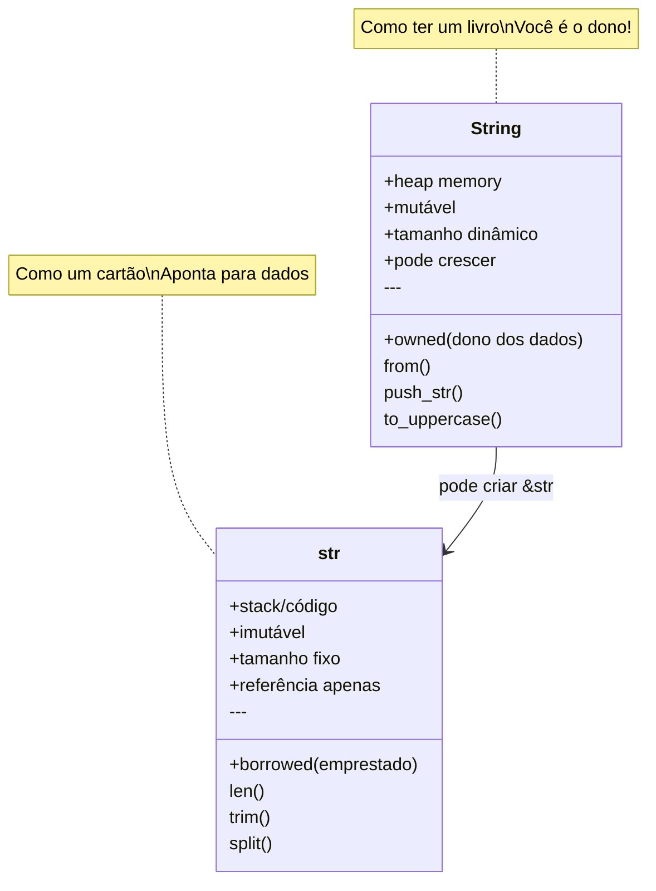
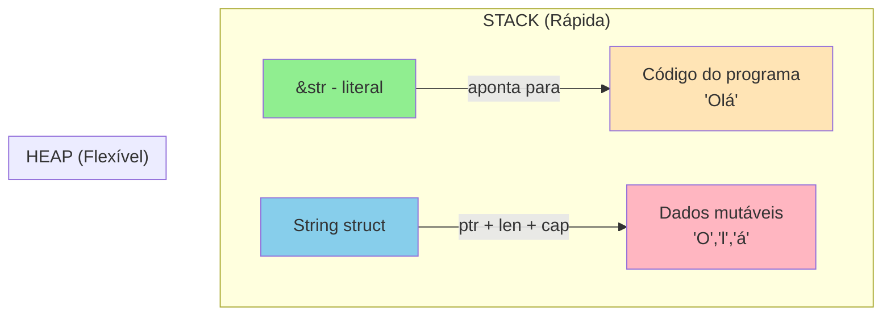
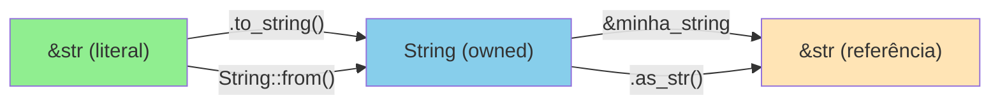
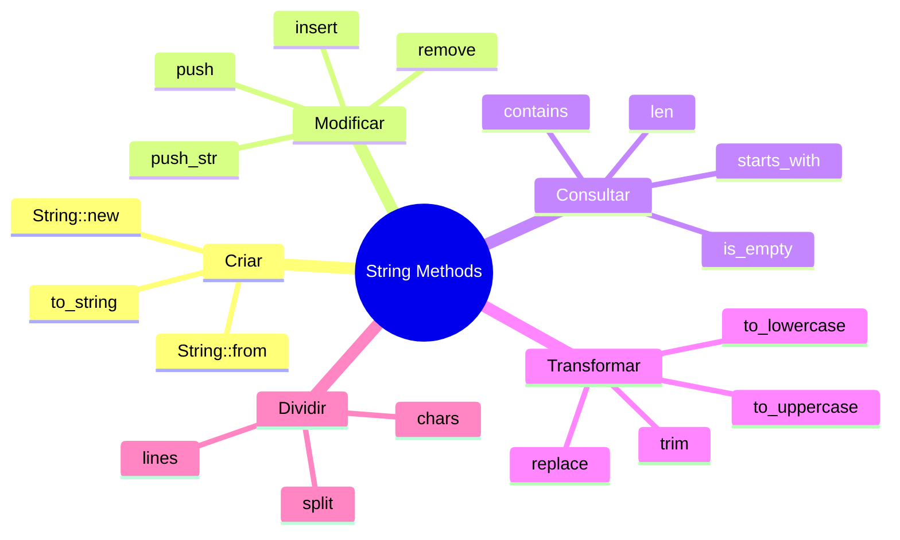
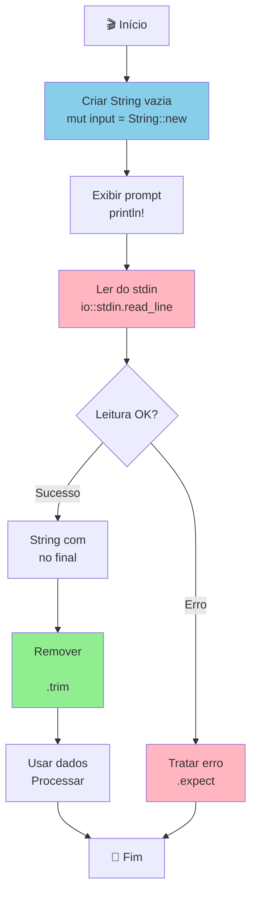
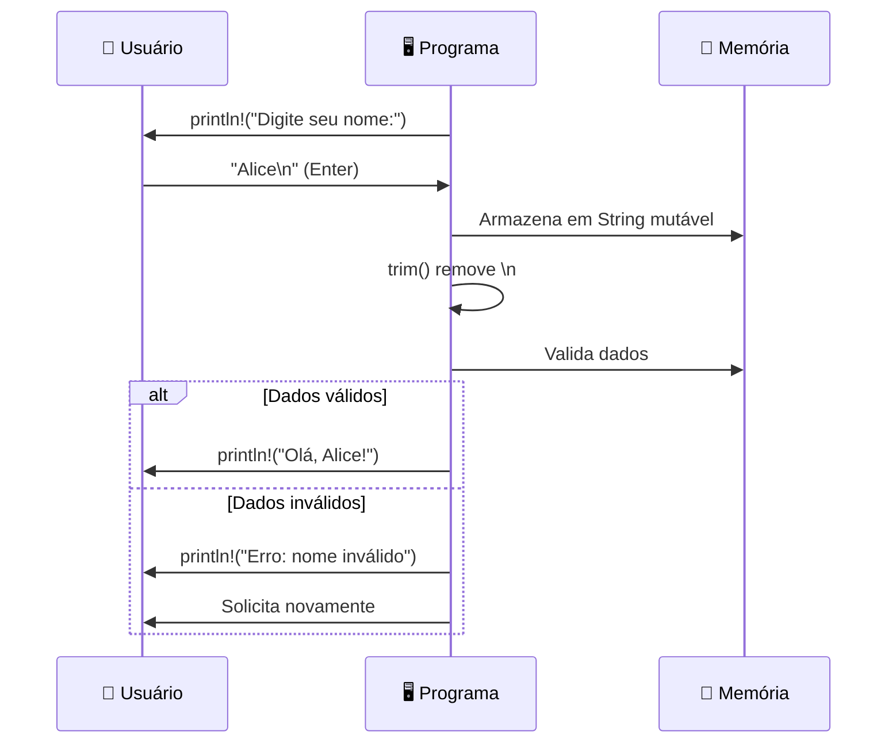

# 📅 DIA 5 - Strings e I/O: A Biblioteca de Textos 📚

## 🎭 A HISTÓRIA DA BIBLIOTECA MÁGICA

Imagine que você entrou em uma **biblioteca mágica** com dois tipos de livros:

🔵 **Livros Reais (String)**: Você é o **dono**. Pode escrever neles, arrancar páginas, adicionar capítulos, levar para casa. São seus! Mas ocupam espaço na sua mochila (heap).

🟢 **Referências da Biblioteca (&str)**: São como **cartões** que apontam para livros fixos nas prateleiras. Você pode *ler* através deles, mas não pode modificar o livro original. São leves e rápidos, mas temporários.

Agora você vai aprender a ser um **bibliotecário Rust** — manipulando textos com segurança e conversando com os usuários do seu programa! 🦀

---

## 📚 O QUE VOCÊ VAI APRENDER

**Conceitos:**
- Diferença crucial entre `String` e `&str`
- Como criar, modificar e concatenar strings
- Ler dados do usuário (input)
- Formatar e exibir informações (output)
- Tratar erros básicos em entrada de dados

**Habilidades:**
- Escolher entre `String` e `&str` apropriadamente
- Criar programas interativos que conversam com usuários
- Validar e formatar dados de entrada
- Usar métodos de manipulação de texto
- Construir interfaces amigáveis no terminal

---

## 📋 OBJETIVOS DE APRENDIZAGEM

Ao final deste dia, você será capaz de:

- [ ] **Explicar** a diferença entre `String` (owned) e `&str` (borrowed) com clareza
- [ ] **Criar** strings de múltiplas formas (`String::from()`, `.to_string()`, literais)
- [ ] **Manipular** strings usando métodos como `push_str`, `replace`, `trim`, `split`
- [ ] **Ler** entrada do usuário usando `std::io::stdin()`
- [ ] **Formatar** saída com `println!`, `format!` e debug printing (`{:?}`)
- [ ] **Construir** um programa interativo completo com validação de dados
- [ ] **Tratar** erros básicos de input/output de forma amigável

---

## 🧠 ATIVAÇÃO DO CONHECIMENTO PRÉVIO

**Revisão Rápida:**

Nos dias anteriores, você aprendeu sobre:
- **Variáveis** (`let`, `mut`) — Dia 2
- **Tipos primitivos** (`i32`, `f64`, `bool`) — Dia 2
- **Controle de fluxo** (`if`, `loop`, `match`) — Dia 3
- **Funções** (parâmetros, retorno) — Dia 4

Hoje, vamos trabalhar com um tipo **mais complexo**: texto! Strings são fundamentais para:
- Interagir com usuários 💬
- Processar dados textuais 📝
- Construir interfaces 🖥️
- Manipular arquivos e redes 🌐

**Conexão com o Mundo Real:**
Pense na última vez que você usou um aplicativo: digitou seu nome, endereço de email, senha... Tudo isso são **strings**! Hoje você vai aprender a lidar com esse tipo de dado essencial.

---

## 📚 APRESENTAÇÃO DO CONTEÚDO

### 🎯 PARTE 1: String vs &str — O Conceito Mais Importante

#### Diagrama: A Diferença Fundamental



#### Analogia Expandida: Biblioteca de Textos

| Aspecto | `String` (Livro Real) | `&str` (Referência) |
|---------|----------------------|---------------------|
| **Propriedade** | Você é dono | Apenas visualização |
| **Modificação** | ✅ Pode editar | ❌ Somente leitura |
| **Custo** | Ocupa memória heap | Leve (apenas ponteiro) |
| **Duração** | Vive até você descartar | Temporária |
| **Uso típico** | Dados que mudam | Literais, visualização |

#### Memória: O Que Acontece Por Baixo dos Panos



**Explicação Visual:**

- **`&str` literais** (`"Olá"`) são **embutidas no código** — super rápidas, mas imutáveis
- **`String`** aloca no **heap** — pode crescer, mas tem custo de alocação

---

### 🛠️ PARTE 2: Criando e Convertendo Strings

#### Método 1: Literais de String (sempre `&str`)

```rust {.line-numbers}
// Literais são SEMPRE &str
let saudacao: &str = "Olá, Mundo!"; // Tipo explícito
let nome = "Rust"; // Tipo inferido como &str

println!("Saudação: {}", saudacao);
println!("Nome: {}", nome);
```

#### Método 2: Criar String Owned

```rust {.line-numbers}
// Forma 1: String::from() - mais explícita
let mut mensagem = String::from("Bem-vindo");

// Forma 2: .to_string() - mais concisa
let mut titulo = "Curso de Rust".to_string();

// Agora podemos MODIFICAR porque são String
mensagem.push_str(" ao Rust!"); // Adiciona texto
titulo.push('🦀'); // Adiciona um caractere

println!("{}", mensagem); // Bem-vindo ao Rust!
println!("{}", titulo);   // Curso de Rust🦀
```

#### Conversões: String ↔ &str



```rust {.line-numbers}
// De &str para String
let literal: &str = "Olá";
let owned1: String = literal.to_string();
let owned2: String = String::from(literal);

// De String para &str
let minha_string = String::from("Mundo");
let referencia1: &str = &minha_string;      // Emprestar
let referencia2: &str = minha_string.as_str(); // Método explícito

println!("Owned: {}, Borrowed: {}", owned1, referencia1);
```

---

### 🔧 PARTE 3: Manipulando Strings

#### Mapa Mental de Métodos



#### Concatenação: 3 Formas Diferentes

```rust {.line-numbers}
fn main() {
    // ❌ PROBLEMA: Tentando usar + com duas referências
    let s1 = "Olá";
    let s2 = "Mundo";
    // let erro = s1 + s2; // ERRO! Não compila

    // ✅ FORMA 1: Operador + (consome a primeira String)
    let parte1 = String::from("Olá, ");
    let parte2 = "Mundo!"; // &str
    let resultado1 = parte1 + parte2; // parte1 foi movida!
    // println!("{}", parte1); // ERRO! parte1 não existe mais
    println!("Forma 1: {}", resultado1);

    // ✅ FORMA 2: push_str (modifica in-place)
    let mut texto = String::from("Rust");
    texto.push_str(" é"); // Adiciona &str
    texto.push(' ');      // Adiciona char
    texto.push_str("incrível!");
    println!("Forma 2: {}", texto);

    // ✅ FORMA 3: format! macro (MELHOR - não consome nada!)
    let nome = "Alice";
    let idade = 25;
    let frase = format!("Olá, {}! Você tem {} anos.", nome, idade);
    println!("Forma 3: {}", frase);
    println!("Nome ainda existe: {}", nome); // ✅ nome não foi movida
}
```

**Comparação Visual:**

| Método | Consome? | Flexível? | Recomendado Para |
|--------|----------|-----------|------------------|
| `+` | ✅ Sim (primeira) | ❌ Não | Concatenação simples |
| `push_str` | ❌ Não (modifica) | ⚠️ Parcial | Construção incremental |
| `format!` | ❌ Não | ✅ Sim | Múltiplas variáveis |

#### Métodos Essenciais

```rust {.line-numbers}
fn main() {
    let texto = String::from("  Rust Programming  ");

    // 1. Tamanho
    println!("Tamanho: {} caracteres", texto.len());

    // 2. Remover espaços (trim)
    let limpo = texto.trim();
    println!("Limpo: '{}'", limpo); // 'Rust Programming'

    // 3. Substituir
    let novo = limpo.replace("Programming", "Language");
    println!("Substituído: {}", novo); // Rust Language

    // 4. Verificar conteúdo
    if limpo.contains("Rust") {
        println!("Contém 'Rust'!");
    }

    // 5. Dividir em palavras
    let palavras: Vec<&str> = limpo.split(' ').collect();
    println!("Palavras: {:?}", palavras); // ["Rust", "Programming"]

    // 6. Maiúsculas/Minúsculas
    println!("MAIÚSCULO: {}", limpo.to_uppercase());
    println!("minúsculo: {}", limpo.to_lowercase());

    // 7. Checar vazio
    let vazia = String::new();
    if vazia.is_empty() {
        println!("String vazia!");
    }
}
```

---

### 💬 PARTE 4: Input/Output — Conversando com o Usuário

#### Fluxo de Leitura de Input



#### Template Básico de Input

```rust {.line-numbers}
use std::io; // Importar biblioteca de I/O

fn main() {
    // Passo 1: Criar String mutável vazia
    let mut entrada = String::new();
    
    // Passo 2: Exibir mensagem ao usuário
    println!("Digite seu nome:");
    
    // Passo 3: Ler da entrada padrão (teclado)
    io::stdin()
        .read_line(&mut entrada)  // Passa referência mutável
        .expect("Falha ao ler linha"); // Tratamento básico de erro
    
    // Passo 4: Remover o \n (enter) do final
    let nome = entrada.trim();
    
    // Passo 5: Usar o dado
    println!("Olá, {}!", nome);
}
```

**Análise Linha por Linha:**

```rust {.line-numbers}
let mut entrada = String::new();
// ↑ DEVE ser mutável porque read_line vai modificar
// ↑ String::new() cria string vazia (sem alocação inicial)

io::stdin()
// ↑ Acessa a entrada padrão (teclado)

.read_line(&mut entrada)
// ↑ &mut = empresta mutavelmente
// ↑ Lê até encontrar Enter (\n)
// ↑ ADICIONA à string (não substitui!)

.expect("Falha ao ler linha");
// ↑ Se houver erro, programa para com essa mensagem
// ↑ (veremos tratamento melhor nos próximos dias)

let nome = entrada.trim();
// ↑ Remove espaços e \n do início/fim
// ↑ Retorna &str (não String!)
```

#### Formatação de Output

```rust {.line-numbers}
fn main() {
    let nome = "Alice";
    let idade = 25;
    let altura = 1.65;
    
    // {} - Display normal
    println!("Nome: {}", nome);
    
    // Múltiplas variáveis
    println!("{} tem {} anos", nome, idade);
    
    // Posicional
    println!("{0} tem {1} anos. {0} é legal!", nome, idade);
    
    // Nomeado
    println!("{pessoa} tem {anos} anos", pessoa=nome, anos=idade);
    
    // Precisão numérica
    println!("Altura: {:.2} metros", altura); // 1.65
    
    // {:?} - Debug (útil para desenvolvimento)
    let numeros = vec![1, 2, 3];
    println!("Debug: {:?}", numeros); // [1, 2, 3]
    
    // {:#?} - Pretty Debug (formatado)
    println!("Pretty:\n{:#?}", numeros);
    // [
    //     1,
    //     2,
    //     3,
    // ]
}
```

---

### 🔁 PARTE 5: Padrão Completo de Interação

#### Sequência de Interação Usuário-Programa



#### Exemplo: Leitura com Validação

```rust {.line-numbers}
use std::io;

fn main() {
    println!("=== Sistema de Cadastro ===\n");
    
    // Ler nome
    loop {
        println!("Digite seu nome (mínimo 2 caracteres):");
        let mut nome = String::new();
        io::stdin()
            .read_line(&mut nome)
            .expect("Erro ao ler");
        
        let nome = nome.trim(); // Remove \n
        
        // Validação simples
        if nome.len() >= 2 {
            println!("✅ Nome aceito: {}\n", nome);
            break; // Sai do loop
        } else {
            println!("❌ Nome muito curto. Tente novamente.\n");
            // Loop continua
        }
    }
    
    println!("Cadastro concluído! 🎉");
}
```

---

## 💡 DEMONSTRAÇÃO E MODELAGEM

### Exemplo Completo: Calculadora de Nome

Vamos construir um programa que:
1. Lê o nome completo do usuário
2. Conta letras e palavras
3. Exibe informações formatadas

```rust {.line-numbers}
use std::io;

fn main() {
    println!("🔤 CALCULADORA DE NOME 🔤");
    println!("===========================\n");
    
    // Passo 1: Ler nome completo
    println!("Digite seu nome completo:");
    let mut entrada = String::new();
    io::stdin()
        .read_line(&mut entrada)
        .expect("Falha ao ler entrada");
    
    // Passo 2: Limpar entrada (remover \n e espaços extras)
    let nome_limpo = entrada.trim();
    
    // Passo 3: Análises
    let total_letras = nome_limpo.len();
    let palavras: Vec<&str> = nome_limpo.split_whitespace().collect();
    let num_palavras = palavras.len();
    
    // Verificar se tem conteúdo
    if nome_limpo.is_empty() {
        println!("❌ Você não digitou nada!");
        return; // Sai da função main
    }
    
    // Passo 4: Exibir resultados
    println!("\n📊 ANÁLISE DO SEU NOME:");
    println!("━━━━━━━━━━━━━━━━━━━━━━━━");
    println!("📝 Nome completo: {}", nome_limpo);
    println!("🔢 Total de caracteres: {}", total_letras);
    println!("📚 Número de palavras: {}", num_palavras);
    println!("🔠 MAIÚSCULAS: {}", nome_limpo.to_uppercase());
    println!("🔡 minúsculas: {}", nome_limpo.to_lowercase());
    
    // Passo 5: Mostrar palavras separadas
    println!("\n📦 Palavras encontradas:");
    for (i, palavra) in palavras.iter().enumerate() {
        println!("   {}. {}", i + 1, palavra);
    }
    
    // Passo 6: Checar iniciais
    let primeira_letra = nome_limpo.chars().next().unwrap_or('?');
    println!("\n✨ Primeira letra: '{}'", primeira_letra);
    
    if nome_limpo.contains("a") || nome_limpo.contains("A") {
        println!("💡 Seu nome contém a letra 'A'!");
    }
    
    println!("\n🎉 Análise concluída!");
}
```

**Execução de Exemplo:**

```
🔤 CALCULADORA DE NOME 🔤
===========================

Digite seu nome completo:
Alice Silva Santos

📊 ANÁLISE DO SEU NOME:
━━━━━━━━━━━━━━━━━━━━━━━━
📝 Nome completo: Alice Silva Santos
🔢 Total de caracteres: 19
📚 Número de palavras: 3
🔠 MAIÚSCULAS: ALICE SILVA SANTOS
🔡 minúsculas: alice silva santos

📦 Palavras encontradas:
   1. Alice
   2. Silva
   3. Santos

✨ Primeira letra: 'A'
💡 Seu nome contém a letra 'A'!

🎉 Análise concluída!
```

---

## 🎯 PRÁTICA GUIADA — EXERCÍCIO DO DIA

### 📋 SISTEMA DE CADASTRO INTERATIVO

#### 🎬 Contexto

Você foi contratado para criar um **sistema de cadastro básico** para uma loja online. O programa deve:

1. ✅ Solicitar **nome completo** do cliente (validar mínimo 3 caracteres)
2. ✅ Solicitar **email** (validar que contém '@')
3. ✅ Solicitar **telefone** (validar que tem pelo menos 8 dígitos)
4. ✅ Exibir um **resumo formatado** dos dados
5. ✅ Perguntar se os dados estão corretos
6. ✅ Tratar erros de input com mensagens amigáveis

#### 🎯 Objetivo Pedagógico

Este exercício combina:
- Manipulação de `String` e `&str`
- Leitura de input múltiplas vezes
- Validação de dados
- Formatação de output
- Controle de fluxo (loops, condicionais)
- Tratamento básico de erros

#### 📝 Especificação Técnica

**Estrutura:**
```
┌─────────────────────────────┐
│  CADASTRO DE CLIENTE        │
├─────────────────────────────┤
│ 1. Ler nome                 │
│    ↓ Validar (len >= 3)     │
│ 2. Ler email                │
│    ↓ Validar (contém @)     │
│ 3. Ler telefone             │
│    ↓ Validar (len >= 8)     │
│ 4. Exibir resumo            │
│ 5. Confirmar (S/N)          │
│    ↓                        │
│ 6. Mensagem final           │
└─────────────────────────────┘
```

**Validações:**
- **Nome**: Pelo menos 3 caracteres, não vazio
- **Email**: Deve conter '@', pelo menos 5 caracteres
- **Telefone**: Pelo menos 8 caracteres (números ou formatado)

#### 🔧 Código Inicial (Scaffolding)

```rust {.line-numbers}
use std::io;

fn main() {
    println!("╔════════════════════════════════╗");
    println!("║   📝 CADASTRO DE CLIENTE       ║");
    println!("╚════════════════════════════════╝\n");
    
    // TODO 1: Ler e validar nome
    let nome = ler_nome();
    
    // TODO 2: Ler e validar email
    let email = ler_email();
    
    // TODO 3: Ler e validar telefone
    let telefone = ler_telefone();
    
    // TODO 4: Exibir resumo
    exibir_resumo(&nome, &email, &telefone);
    
    // TODO 5: Confirmar dados
    let confirmado = confirmar();
    
    // TODO 6: Mensagem final
    if confirmado {
        println!("\n✅ Cadastro realizado com sucesso!");
        println!("🎉 Bem-vindo(a), {}!", nome);
    } else {
        println!("\n❌ Cadastro cancelado.");
    }
}

// TODO: Implementar estas funções

fn ler_nome() -> String {
    // Seu código aqui
    String::new() // Placeholder
}

fn ler_email() -> String {
    // Seu código aqui
    String::new() // Placeholder
}

fn ler_telefone() -> String {
    // Seu código aqui
    String::new() // Placeholder
}

fn exibir_resumo(nome: &str, email: &str, telefone: &str) {
    // Seu código aqui
}

fn confirmar() -> bool {
    // Seu código aqui
    true // Placeholder
}
```

#### 💡 Dicas Progressivas

<details>
<summary><strong>🔵 Dica 1: Estrutura de Validação com Loop</strong></summary>

Para validar com loop até entrada correta:
```rust {.line-numbers}
fn ler_nome() -> String {
    loop {
        println!("Digite seu nome completo:");
        let mut entrada = String::new();
        io::stdin().read_line(&mut entrada).expect("Erro ao ler");
        
        let nome = entrada.trim().to_string();
        
        if nome.len() >= 3 {
            return nome; // Sai da função retornando nome válido
        } else {
            println!("❌ Nome muito curto (mínimo 3 caracteres). Tente novamente.\n");
        }
    }
}
```
</details>

<details>
<summary><strong>🟢 Dica 2: Validação de Email</strong></summary>

Para checar se contém '@':
```rust {.line-numbers}
fn ler_email() -> String {
    loop {
        println!("Digite seu email:");
        let mut entrada = String::new();
        io::stdin().read_line(&mut entrada).expect("Erro ao ler");
        
        let email = entrada.trim().to_string();
        
        if email.contains('@') && email.len() >= 5 {
            return email;
        } else {
            println!("❌ Email inválido (deve conter @ e ter pelo menos 5 caracteres).\n");
        }
    }
}
```
</details>

<details>
<summary><strong>🟡 Dica 3: Formatação do Resumo</strong></summary>

Use formatação bonita com bordas:
```rust {.line-numbers}
fn exibir_resumo(nome: &str, email: &str, telefone: &str) {
    println!("\n╔════════════════════════════════╗");
    println!("║     📋 RESUMO DO CADASTRO      ║");
    println!("╠════════════════════════════════╣");
    println!("║ 👤 Nome:     {:18}║", nome);
    println!("║ 📧 Email:    {:18}║", email);
    println!("║ 📱 Telefone: {:18}║", telefone);
    println!("╚════════════════════════════════╝\n");
}
```
</details>

#### ✅ Solução Completa Comentada

```rust {.line-numbers}
use std::io;

fn main() {
    // Cabeçalho do sistema
    println!("╔════════════════════════════════╗");
    println!("║   📝 CADASTRO DE CLIENTE       ║");
    println!("╚════════════════════════════════╝\n");
    
    // Passo 1: Ler nome com validação
    let nome = ler_nome();
    
    // Passo 2: Ler email com validação
    let email = ler_email();
    
    // Passo 3: Ler telefone com validação
    let telefone = ler_telefone();
    
    // Passo 4: Mostrar resumo formatado
    exibir_resumo(&nome, &email, &telefone);
    
    // Passo 5: Confirmar dados
    let confirmado = confirmar();
    
    // Passo 6: Mensagem final baseada na confirmação
    if confirmado {
        println!("\n✅ Cadastro realizado com sucesso!");
        println!("🎉 Bem-vindo(a), {}!", nome);
        println!("📬 Enviaremos um email de confirmação para: {}", email);
    } else {
        println!("\n❌ Cadastro cancelado.");
        println!("💡 Você pode tentar novamente quando quiser!");
    }
}

/// Lê e valida o nome do usuário
/// Retorna uma String com o nome válido
fn ler_nome() -> String {
    loop {
        // Solicitar entrada
        println!("👤 Digite seu nome completo:");
        let mut entrada = String::new();
        
        // Ler do teclado
        io::stdin()
            .read_line(&mut entrada)
            .expect("❌ Erro ao ler entrada");
        
        // Limpar entrada (remove \n e espaços extras)
        let nome = entrada.trim().to_string();
        
        // Validação 1: Não vazio
        if nome.is_empty() {
            println!("❌ Nome não pode estar vazio!\n");
            continue; // Volta ao início do loop
        }
        
        // Validação 2: Tamanho mínimo
        if nome.len() < 3 {
            println!("❌ Nome muito curto (mínimo 3 caracteres). Tente novamente.\n");
            continue;
        }
        
        // Validação 3: Apenas letras e espaços (opcional)
        let apenas_letras = nome.chars().all(|c| c.is_alphabetic() || c.is_whitespace());
        if !apenas_letras {
            println!("❌ Nome deve conter apenas letras.\n");
            continue;
        }
        
        // Todas as validações passaram!
        println!("✅ Nome aceito!\n");
        return nome; // Sai da função retornando o nome
    }
}

/// Lê e valida o email do usuário
/// Retorna uma String com o email válido
fn ler_email() -> String {
    loop {
        println!("📧 Digite seu email:");
        let mut entrada = String::new();
        
        io::stdin()
            .read_line(&mut entrada)
            .expect("❌ Erro ao ler entrada");
        
        let email = entrada.trim().to_string();
        
        // Validação 1: Não vazio
        if email.is_empty() {
            println!("❌ Email não pode estar vazio!\n");
            continue;
        }
        
        // Validação 2: Tamanho mínimo
        if email.len() < 5 {
            println!("❌ Email muito curto.\n");
            continue;
        }
        
        // Validação 3: Contém @
        if !email.contains('@') {
            println!("❌ Email inválido (deve conter @).\n");
            continue;
        }
        
        // Validação 4: Tem algo antes e depois do @
        let partes: Vec<&str> = email.split('@').collect();
        if partes.len() != 2 || partes[0].is_empty() || partes[1].is_empty() {
            println!("❌ Formato de email inválido.\n");
            continue;
        }
        
        println!("✅ Email aceito!\n");
        return email;
    }
}

/// Lê e valida o telefone do usuário
/// Retorna uma String com o telefone válido
fn ler_telefone() -> String {
    loop {
        println!("📱 Digite seu telefone (mínimo 8 dígitos):");
        let mut entrada = String::new();
        
        io::stdin()
            .read_line(&mut entrada)
            .expect("❌ Erro ao ler entrada");
        
        let telefone = entrada.trim().to_string();
        
        // Validação 1: Não vazio
        if telefone.is_empty() {
            println!("❌ Telefone não pode estar vazio!\n");
            continue;
        }
        
        // Validação 2: Contar apenas dígitos
        let digitos: String = telefone.chars().filter(|c| c.is_numeric()).collect();
        
        if digitos.len() < 8 {
            println!("❌ Telefone deve ter pelo menos 8 dígitos.\n");
            continue;
        }
        
        println!("✅ Telefone aceito!\n");
        return telefone;
    }
}

/// Exibe um resumo formatado dos dados cadastrados
/// Usa referências (&str) porque não precisa modificar
fn exibir_resumo(nome: &str, email: &str, telefone: &str) {
    println!("╔════════════════════════════════════════════╗");
    println!("║         📋 RESUMO DO CADASTRO              ║");
    println!("╠════════════════════════════════════════════╣");
    
    // Formatação com padding (preenchimento)
    println!("║ 👤 Nome:     {:<30}║", nome);
    println!("║ 📧 Email:    {:<30}║", email);
    println!("║ 📱 Telefone: {:<30}║", telefone);
    
    println!("╚════════════════════════════════════════════╝\n");
}

/// Pergunta ao usuário se os dados estão corretos
/// Retorna true se confirmado, false caso contrário
fn confirmar() -> bool {
    loop {
        println!("Os dados estão corretos? (S/N):");
        let mut resposta = String::new();
        
        io::stdin()
            .read_line(&mut resposta)
            .expect("❌ Erro ao ler entrada");
        
        // Converter para minúscula e pegar primeiro caractere
        let resposta = resposta.trim().to_lowercase();
        
        match resposta.as_str() {
            "s" | "sim" | "y" | "yes" => {
                return true; // Confirmado
            }
            "n" | "nao" | "não" | "no" => {
                return false; // Cancelado
            }
            _ => {
                println!("❌ Resposta inválida. Digite S para Sim ou N para Não.\n");
                // Loop continua
            }
        }
    }
}
```

#### 🎬 Exemplo de Execução Completa

```
╔════════════════════════════════╗
║   📝 CADASTRO DE CLIENTE       ║
╚════════════════════════════════╝

👤 Digite seu nome completo:
A
❌ Nome muito curto (mínimo 3 caracteres). Tente novamente.

👤 Digite seu nome completo:
Alice Silva
✅ Nome aceito!

📧 Digite seu email:
alice
❌ Email inválido (deve conter @).

📧 Digite seu email:
alice@email.com
✅ Email aceito!

📱 Digite seu telefone (mínimo 8 dígitos):
123
❌ Telefone deve ter pelo menos 8 dígitos.

📱 Digite seu telefone (mínimo 8 dígitos):
11987654321
✅ Telefone aceito!

╔════════════════════════════════════════════╗
║         📋 RESUMO DO CADASTRO              ║
╠════════════════════════════════════════════╣
║ 👤 Nome:     Alice Silva                   ║
║ 📧 Email:    alice@email.com               ║
║ 📱 Telefone: 11987654321                   ║
╚════════════════════════════════════════════╝

Os dados estão corretos? (S/N):
s

✅ Cadastro realizado com sucesso!
🎉 Bem-vindo(a), Alice Silva!
📬 Enviaremos um email de confirmação para: alice@email.com
```

---

### 🌟 MELHORIAS OPCIONAIS (Desafios Extra)

Se você quiser ir além, tente adicionar:

#### 🔹 Nível 1: Interface Melhorada
```rust {.line-numbers}
// Adicionar cores com códigos ANSI
println!("\x1b[32m✅ Sucesso!\x1b[0m"); // Verde
println!("\x1b[31m❌ Erro!\x1b[0m");    // Vermelho

// Limpar tela (cross-platform)
print!("\x1b[2J\x1b[1;1H");
```

#### 🔹 Nível 2: Menu Completo
```rust {.line-numbers}
loop {
    println!("1. Novo cadastro");
    println!("2. Sair");
    // Lógica de menu...
}
```

#### 🔹 Nível 3: Salvar em Arquivo
```rust {.line-numbers}
use std::fs::File;
use std::io::Write;

// Salvar dados em arquivo de texto
let mut arquivo = File::create("cadastro.txt").unwrap();
writeln!(arquivo, "Nome: {}", nome).unwrap();
```

---

## 🔄 FEEDBACK E AVALIAÇÃO

### ✅ CHECKLIST DE CONCEITOS

Marque o que você compreendeu:

**String vs &str:**
- [ ] Sei explicar a diferença entre `String` (owned) e `&str` (borrowed)
- [ ] Entendo quando usar `String::from()` vs `.to_string()`
- [ ] Consigo converter entre `String` e `&str`
- [ ] Compreendo o custo de memória de cada tipo

**Manipulação de Strings:**
- [ ] Sei concatenar strings com `+`, `push_str`, e `format!`
- [ ] Uso métodos como `trim()`, `split()`, `replace()`, `contains()`
- [ ] Entendo `len()`, `is_empty()`, `to_uppercase()`, `to_lowercase()`
- [ ] Consigo iterar sobre caracteres com `chars()`

**Input/Output:**
- [ ] Sei ler entrada do usuário com `io::stdin().read_line()`
- [ ] Sempre uso `.trim()` para remover `\n` da entrada
- [ ] Entendo por que a variável precisa ser `mut`
- [ ] Uso `.expect()` para tratamento básico de erros

**Formatação:**
- [ ] Uso `println!` com placeholders `{}`
- [ ] Sei formatar com posicionamento `{0}`, `{1}`
- [ ] Uso `{:?}` para debug printing
- [ ] Consigo formatar números com precisão `{:.2}`

**Validação:**
- [ ] Implemento loops de validação até entrada correta
- [ ] Forneço mensagens de erro amigáveis
- [ ] Verifico tamanho, formato e conteúdo das strings

---

### 🚨 ERROS COMUNS E SOLUÇÕES

#### ❌ Erro 1: Tentar Modificar &str

```rust {.line-numbers}
// ERRADO: &str é imutável!
let texto = "Olá";
texto.push_str(" Mundo"); // ❌ ERRO de compilação

// CORRETO: Use String
let mut texto = String::from("Olá");
texto.push_str(" Mundo"); // ✅ Funciona!
println!("{}", texto); // Olá Mundo
```

#### ❌ Erro 2: Esquecer .trim() no Input

```rust {.line-numbers}
// PROBLEMA: \n fica na string!
let mut entrada = String::new();
io::stdin().read_line(&mut entrada).unwrap();
println!("'{}'", entrada); // 'Alice\n' ← vê o \n?

// SOLUÇÃO: Sempre use trim()
let entrada = entrada.trim();
println!("'{}'", entrada); // 'Alice' ← limpo!
```

#### ❌ Erro 3: Esquecer mut no read_line

```rust {.line-numbers}
// ERRADO: read_line precisa modificar a string
let entrada = String::new();
io::stdin().read_line(&mut entrada).unwrap(); // ❌ ERRO!

// CORRETO: Variável deve ser mutável
let mut entrada = String::new();
io::stdin().read_line(&mut entrada).unwrap(); // ✅ OK!
```

#### ❌ Erro 4: Confundir + com Concatenação

```rust {.line-numbers}
// PROBLEMA: Operador + consome a primeira String
let s1 = String::from("Olá");
let s2 = String::from(" Mundo");
let resultado = s1 + &s2; // s1 foi movida!
println!("{}", s1); // ❌ ERRO! s1 não existe mais

// SOLUÇÃO 1: Use format! (melhor)
let s1 = String::from("Olá");
let s2 = String::from(" Mundo");
let resultado = format!("{}{}", s1, s2);
println!("{} {}", s1, s2); // ✅ Ambos existem!

// SOLUÇÃO 2: Clone se necessário
let resultado = s1.clone() + &s2;
println!("{}", s1); // ✅ s1 ainda existe
```

#### ❌ Erro 5: Não Validar Input

```rust {.line-numbers}
// PERIGOSO: Aceita qualquer entrada
let mut entrada = String::new();
io::stdin().read_line(&mut entrada).unwrap();
let idade: i32 = entrada.trim().parse().unwrap(); // ❌ Pode panic!

// MELHOR: Valide e trate erros
let mut entrada = String::new();
io::stdin().read_line(&mut entrada).unwrap();

match entrada.trim().parse::<i32>() {
    Ok(idade) => println!("Idade: {}", idade),
    Err(_) => println!("❌ Digite um número válido!"),
}
```

---

### 📝 QUIZ DE AUTO-AVALIAÇÃO

**Pergunta 1:** Qual a diferença entre `String` e `&str`?
<details>
<summary>Ver Resposta</summary>

- **`String`**: Tipo owned (dono dos dados), alocado no heap, mutável, pode crescer
- **`&str`**: Referência borrowed (emprestada), imutável, aponta para dados fixos

**Analogia:** `String` é ter o livro. `&str` é ter o cartão da biblioteca.
</details>

**Pergunta 2:** O que faz `.trim()` e por que é importante no input?
<details>
<summary>Ver Resposta</summary>

`.trim()` remove espaços em branco e `\n` do início/fim da string.

É crucial porque `read_line()` inclui o `\n` (Enter) digitado pelo usuário. Sem `.trim()`, você teria:
```rust {.line-numbers}
"Alice\n" // Com \n
"Alice"   // Sem \n (após trim)
```
</details>

**Pergunta 3:** Por que esta linha causa erro?
```rust {.line-numbers}
let texto = String::new();
io::stdin().read_line(&mut texto).unwrap(); // ❌
```
<details>
<summary>Ver Resposta</summary>

`texto` não é mutável (`mut`), mas `read_line()` precisa modificar a string para adicionar a entrada do usuário.

**Correção:**
```rust {.line-numbers}
let mut texto = String::new(); // ✅ Adiciona mut
```
</details>

**Pergunta 4:** Qual a melhor forma de concatenar múltiplas strings?
<details>
<summary>Ver Resposta</summary>

`format!` macro é a melhor para múltiplas strings:

```rust {.line-numbers}
let nome = "Alice";
let idade = 25;

// ✅ MELHOR
let frase = format!("{} tem {} anos", nome, idade);

// ⚠️ Funciona mas verboso
let mut frase = String::from(nome);
frase.push_str(" tem ");
frase.push_str(&idade.to_string());
frase.push_str(" anos");

// ❌ Consome variáveis
let frase = nome.to_string() + " tem " + &idade.to_string() + " anos";
```
</details>

**Pergunta 5:** Como converter `&str` para `String`?
<details>
<summary>Ver Resposta</summary>

Duas formas equivalentes:

```rust {.line-numbers}
let literal: &str = "Olá";

// Forma 1: .to_string()
let owned1 = literal.to_string();

// Forma 2: String::from()
let owned2 = String::from(literal);

// Ambas criam uma String owned no heap
```
</details>

---

## 🚀 TRANSFERÊNCIA E APLICAÇÃO

### 🎯 Desafio Extra: Analisador de Texto Avançado

Crie um programa que:
1. Lê um parágrafo do usuário
2. Conta: palavras, caracteres, vogais, consoantes
3. Encontra a palavra mais longa
4. Exibe estatísticas formatadas
5. Pergunta se o usuário quer analisar outro texto

**Dica:** Use `.split_whitespace()`, `.chars()`, e matches para vogais!

---

### 🔗 Preparação para o Dia 6: Structs

No próximo dia, você vai aprender a criar **tipos personalizados** (structs)! Vamos usar strings para representar campos como `nome`, `email`, etc. dentro de estruturas de dados complexas.

**Preview:**
```rust {.line-numbers}
struct Usuario {
    nome: String,      // ← Você já domina isso!
    email: String,     // ← E isso também!
    ativo: bool,
}
```

---

### 📚 RECURSOS EXTRAS

**Documentação Oficial:**
- [The Rust Book - Chapter 8.2: Strings](https://doc.rust-lang.org/book/ch08-02-strings.html)
- [std::string::String](https://doc.rust-lang.org/std/string/struct.String.html)
- [std::io](https://doc.rust-lang.org/std/io/index.html)

**Vídeos Recomendados:**
- "Rust Strings Explained" - Let's Get Rusty
- "String vs &str in Rust" - No Boilerplate

**Prática:**
- [Rustlings](https://github.com/rust-lang/rustlings) - Exercícios strings09-strings11
- [Exercism Rust Track](https://exercism.org/tracks/rust) - "Bob", "Gigasecond"

---

## 🎉 PARABÉNS!

Você completou o **Dia 5**! Hoje você:

✅ Dominou a diferença crucial entre `String` e `&str`  
✅ Aprendeu a manipular texto como um profissional  
✅ Criou programas interativos que conversam com usuários  
✅ Implementou validação robusta de dados  
✅ Tratou erros de forma amigável  

**Você está construindo bases sólidas!** 🚀

Strings são fundamentais em programação, e agora você sabe manipulá-las em Rust com segurança e eficiência. Nos próximos dias, vamos usar strings para construir estruturas de dados ainda mais poderosas!

---

### 💪 MOTIVAÇÃO FINAL

> "Strings podem parecer simples, mas dominar `String` vs `&str` é um dos **marcos mais importantes** em Rust. Você acabou de vencer um dos conceitos que mais confunde iniciantes! 🏆"

**Próximo Passo:** No Dia 6, vamos combinar tudo que você aprendeu (variáveis, funções, strings) para criar **tipos personalizados** com structs!

**Continue assim! Você está no caminho certo para se tornar um Rustáceo! 🦀**

---

[🔝 Voltar ao Topo](#-dia-5---strings-e-io-a-biblioteca-de-textos-)