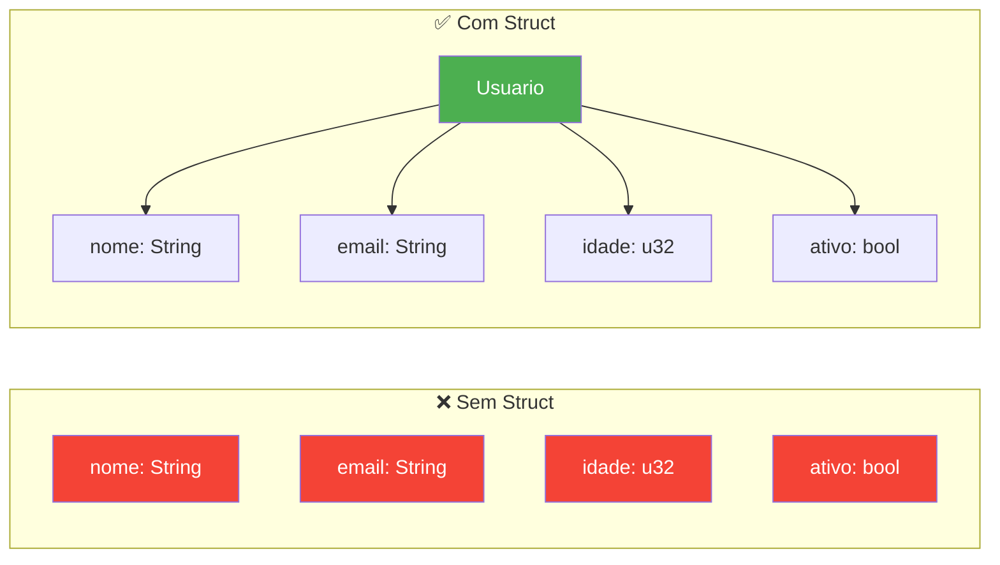
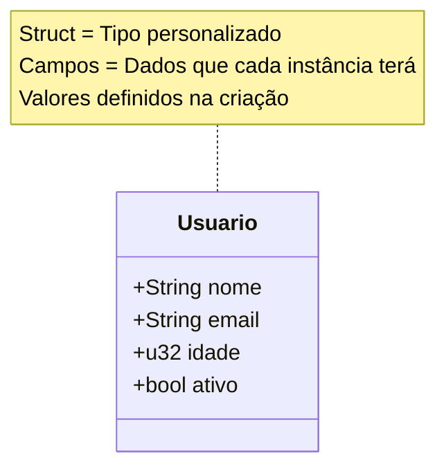
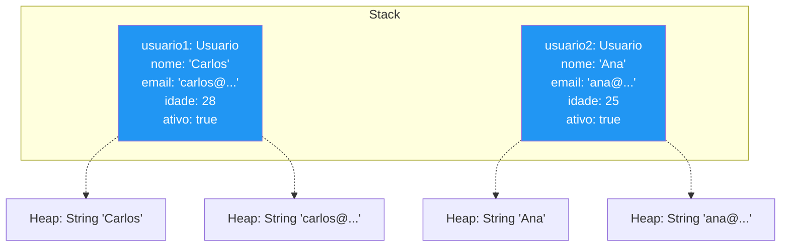
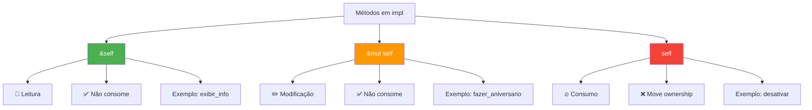
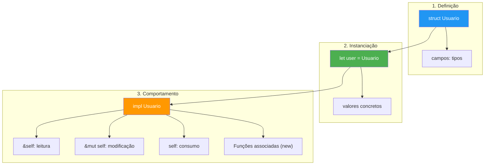

# 📅 DIA 6 - Structs: Seus Blocos de Construção Personalizados

## 🎭 A História do Arquiteto

Imagine um arquiteto que precisa projetar casas. No início, ele tentava descrever cada casa com informações soltas:

```rust {.line-numbers}
let endereco = "Rua das Flores, 123";
let numero_quartos = 3;
let area = 120.5;
let proprietario = "Ana Silva";
let preco = 350000.0;
```

Um dia, ele percebeu: "Estou gerenciando 5 variáveis para UMA casa! E se eu tiver 10 casas? Seriam 50 variáveis soltas!"

Então ele descobriu os **Structs** - como criar um **projeto padronizado** onde todas as informações relacionadas ficam organizadas em um único lugar. Cada casa se tornou uma **unidade coesa**, com sua própria "planta baixa" definida.

**Structs são seus blocos de LEGO personalizados em Rust**: você define o formato, e depois cria quantas peças precisar!

---

## 📚 O QUE VOCÊ VAI APRENDER

**Conceitos:**
- Definição de structs (tipos personalizados)
- Instanciação e inicialização de campos
- Métodos de instância vs funções associadas
- Tuple structs e unit structs
- Desestruturação de dados

**Habilidades:**
- Modelar dados relacionados com structs
- Implementar comportamentos com `impl`
- Diferenciar `self`, `&self` e `&mut self`
- Organizar código de forma profissional

---

## 📋 OBJETIVOS DE APRENDIZAGEM

Ao final deste dia, você será capaz de:
- [ ] **Definir structs** para agrupar dados relacionados em tipos personalizados
- [ ] **Instanciar structs** e acessar seus campos de forma eficiente
- [ ] **Implementar métodos** que operam sobre instâncias (`&self`, `&mut self`, `self`)
- [ ] **Criar funções associadas** (construtoras e utilitárias)
- [ ] **Aplicar structs** para modelar problemas do mundo real com organização e clareza

---

## 🎯 CONTEÚDO

### 1. O Problema: Dados Relacionados Desorganizados

**Antes de Structs:**

```rust {.line-numbers}
// 🚫 Problema: Dados soltos e difíceis de gerenciar
let usuario_nome = String::from("Carlos");
let usuario_email = String::from("carlos@email.com");
let usuario_idade = 28;
let usuario_ativo = true;

// Se tivermos 2 usuários? 8 variáveis!
// Se tivermos 10? 40 variáveis! 😱
```

**Depois de Structs:**

```rust {.line-numbers}
// ✅ Solução: Dados organizados em um tipo
struct Usuario {
    nome: String,
    email: String,
    idade: u32,
    ativo: bool,
}

// Quantos usuários precisar, sem bagunça!
let usuario1 = Usuario { /* ... */ };
let usuario2 = Usuario { /* ... */ };
```

**Diagrama: Comparação Visual**



---

### 2. Anatomia de um Struct

#### 2.1 Definição: A "Planta Baixa"

```rust {.line-numbers}
// Define o TIPO (blueprint/molde)
struct Usuario {
    // Campo: nome_do_campo: tipo
    nome: String,      // Texto mutável
    email: String,     // Outro texto
    idade: u32,        // Número inteiro sem sinal
    ativo: bool,       // Verdadeiro ou falso
}
// Observação: Struct é como uma classe em outras linguagens,
// mas SEM métodos definidos aqui dentro (veremos 'impl' depois)
```

**Diagrama UML: Estrutura do Usuario**



---

### 3. Instanciação: Criando Objetos Concretos

#### 3.1 Nível Básico

```rust {.line-numbers}
fn main() {
    // Criar uma instância (objeto concreto a partir do molde)
    let usuario1 = Usuario {
        nome: String::from("Carlos"),
        email: String::from("carlos@email.com"),
        idade: 28,
        ativo: true,
    };
    
    // Acessar campos com ponto (.)
    println!("Nome: {}", usuario1.nome);
    println!("Email: {}", usuario1.email);
    println!("Idade: {}", usuario1.idade);
}
// Saída:
// Nome: Carlos
// Email: carlos@email.com
// Idade: 28
```

#### 3.2 Field Init Shorthand (Atalho Prático)

```rust {.line-numbers}
fn criar_usuario(nome: String, email: String) -> Usuario {
    let idade = 25;
    let ativo = true;
    
    // ✅ Se a variável tem o MESMO NOME do campo, não precisa repetir!
    Usuario {
        nome,      // Shorthand para: nome: nome
        email,     // Shorthand para: email: email
        idade,     // Shorthand para: idade: idade
        ativo,     // Shorthand para: ativo: ativo
    }
}

fn main() {
    let usuario = criar_usuario(
        String::from("Ana"),
        String::from("ana@email.com")
    );
    println!("{}", usuario.nome); // Ana
}
```

#### 3.3 Mutabilidade

```rust {.line-numbers}
fn main() {
    // Instância IMUTÁVEL (padrão)
    let usuario1 = Usuario {
        nome: String::from("Pedro"),
        email: String::from("pedro@email.com"),
        idade: 30,
        ativo: true,
    };
    
    // usuario1.idade = 31; // ❌ ERRO! Não pode modificar
    
    // Instância MUTÁVEL (mut)
    let mut usuario2 = Usuario {
        nome: String::from("Maria"),
        email: String::from("maria@email.com"),
        idade: 27,
        ativo: true,
    };
    
    usuario2.idade = 28;  // ✅ OK! Pode modificar
    usuario2.ativo = false;
    
    println!("Nova idade: {}", usuario2.idade); // 28
}

// IMPORTANTE: Em Rust, toda a struct é mut ou imut.
// Não existe "um campo mutável e outro imutável".
```

**Diagrama: Instâncias na Memória**



---

### 4. Implementação: Adicionando Comportamento com `impl`

**Analogia:** Se struct é a "planta da casa", `impl` é o "manual de operações" - define o que você pode FAZER com a casa.

#### 4.1 Métodos de Instância

```rust {.line-numbers}
struct Usuario {
    nome: String,
    email: String,
    idade: u32,
    ativo: bool,
}

// impl = implementation (implementação)
impl Usuario {
    // Método que LÊ dados (&self = referência compartilhada)
    fn exibir_info(&self) {
        println!("Usuário: {}", self.nome);
        println!("Email: {}", self.email);
        println!("Idade: {} anos", self.idade);
        println!("Status: {}", if self.ativo { "Ativo" } else { "Inativo" });
    }
    
    // Método que MODIFICA dados (&mut self = referência mutável)
    fn fazer_aniversario(&mut self) {
        self.idade += 1;
        println!("🎉 Parabéns, {}! Agora você tem {} anos!", self.nome, self.idade);
    }
    
    // Método que CONSOME a instância (self = ownership)
    fn desativar(mut self) -> Self {
        self.ativo = false;
        println!("⚠️ Usuário {} foi desativado.", self.nome);
        self // Retorna a instância modificada
    }
    
    // Método que verifica condições (lógica de negócio)
    fn eh_maior_de_idade(&self) -> bool {
        self.idade >= 18
    }
}

fn main() {
    let mut usuario = Usuario {
        nome: String::from("Lucas"),
        email: String::from("lucas@email.com"),
        idade: 17,
        ativo: true,
    };
    
    usuario.exibir_info();           // Usa &self
    println!("Maior de idade? {}", usuario.eh_maior_de_idade()); // false
    
    usuario.fazer_aniversario();     // Usa &mut self
    println!("Maior de idade? {}", usuario.eh_maior_de_idade()); // true
    
    let usuario = usuario.desativar(); // Consome e retorna
    // usuario.fazer_aniversario();   // ❌ ERRO! 'usuario' foi movido
}
```

**Diagrama: As 3 Variações de Self**



#### 4.2 Funções Associadas (Associated Functions)

Funções associadas são como **métodos estáticos** em outras linguagens: não operam sobre uma instância, mas sobre o TIPO.

```rust {.line-numbers}
impl Usuario {
    // Função construtora (padrão: new)
    fn new(nome: String, email: String, idade: u32) -> Self {
        Self {
            nome,
            email,
            idade,
            ativo: true, // Valor padrão
        }
    }
    
    // Função de conversão
    fn from_string(dados: &str) -> Self {
        let partes: Vec<&str> = dados.split(',').collect();
        Self {
            nome: partes[0].to_string(),
            email: partes[1].to_string(),
            idade: partes[2].parse().unwrap_or(0),
            ativo: true,
        }
    }
    
    // Função utilitária
    fn criar_admin(nome: String) -> Self {
        Self {
            nome,
            email: String::from("admin@sistema.com"),
            idade: 0,
            ativo: true,
        }
    }
}

fn main() {
    // Chamadas com :: (não com .)
    let user1 = Usuario::new(
        String::from("Pedro"),
        String::from("pedro@email.com"),
        25
    );
    
    let user2 = Usuario::from_string("Ana,ana@email.com,30");
    
    let admin = Usuario::criar_admin(String::from("Root"));
    
    user1.exibir_info(); // Agora usa . porque temos uma instância
}
```

**Comparação: Métodos vs Funções Associadas**

| Característica | Métodos | Funções Associadas |
|----------------|---------|-------------------|
| **Primeiro parâmetro** | `self`, `&self` ou `&mut self` | Nenhum |
| **Chamada** | `instancia.metodo()` | `Tipo::funcao()` |
| **Propósito** | Opera sobre instância | Cria instância ou utilitários |
| **Exemplo comum** | `exibir_info()` | `new()`, `from_string()` |
| **Acesso a dados** | Tem acesso aos campos | Não tem acesso (sem self) |

---

### 5. Tuple Structs: Structs Anônimos

Quando você só precisa agrupar tipos SEM nomear os campos:

```rust {.line-numbers}
// Tuple struct (parênteses ao invés de chaves)
struct Cor(u8, u8, u8);      // RGB
struct Ponto(f64, f64);       // x, y
struct IdUsuario(u32);        // Wrapper para ID

fn main() {
    let vermelho = Cor(255, 0, 0);
    let origem = Ponto(0.0, 0.0);
    let id = IdUsuario(12345);
    
    // Acesso por índice (como tuplas)
    println!("R: {}, G: {}, B: {}", vermelho.0, vermelho.1, vermelho.2);
    println!("x: {}, y: {}", origem.0, origem.1);
    println!("ID: {}", id.0);
}

impl Cor {
    fn nova(r: u8, g: u8, b: u8) -> Self {
        Self(r, g, b)
    }
    
    fn eh_preto(&self) -> bool {
        self.0 == 0 && self.1 == 0 && self.2 == 0
    }
}
```

**Quando usar?**
- Wrapper types (encapsular um valor: `IdUsuario(u32)`)
- Coordenadas simples (`Ponto(f64, f64)`)
- Quando nomes dos campos não agregam clareza

---

### 6. Unit Structs: Structs Vazios

Structs sem NENHUM campo - úteis para traits (veremos no futuro):

```rust {.line-numbers}
struct Marcador;          // Sem campos, sem parênteses
struct Token;

fn main() {
    let m = Marcador;
    let t = Token;
}

// Útil para: tipos marker, estados, implementar traits
```

---

### 7. Desestruturação: Extraindo Dados

```rust {.line-numbers}
struct Usuario {
    nome: String,
    email: String,
    idade: u32,
    ativo: bool,
}

fn main() {
    let usuario = Usuario {
        nome: String::from("Julia"),
        email: String::from("julia@email.com"),
        idade: 32,
        ativo: true,
    };
    
    // Desestruturação completa
    let Usuario { nome, email, idade, ativo } = usuario;
    println!("Nome extraído: {}", nome);
    
    // Desestruturação parcial (.. ignora o resto)
    let usuario2 = Usuario {
        nome: String::from("Carlos"),
        email: String::from("carlos@email.com"),
        idade: 28,
        ativo: false,
    };
    
    let Usuario { nome, idade, .. } = usuario2;
    println!("{} tem {} anos", nome, idade);
    
    // Em match
    match usuario2 {
        Usuario { ativo: true, .. } => println!("Usuário ativo"),
        Usuario { ativo: false, nome, .. } => println!("{} está inativo", nome),
    }
}
```

---

### 8. Padrões de Design com Structs

#### 8.1 Builder Pattern (Construtor Fluente)

```rust {.line-numbers}
struct Conta {
    titular: String,
    saldo: f64,
    tipo_conta: String,
    limite: f64,
}

impl Conta {
    fn nova(titular: String) -> Self {
        Self {
            titular,
            saldo: 0.0,
            tipo_conta: String::from("Comum"),
            limite: 0.0,
        }
    }
    
    fn com_saldo(mut self, saldo: f64) -> Self {
        self.saldo = saldo;
        self
    }
    
    fn com_tipo(mut self, tipo: String) -> Self {
        self.tipo_conta = tipo;
        self
    }
    
    fn com_limite(mut self, limite: f64) -> Self {
        self.limite = limite;
        self
    }
}

fn main() {
    // Construção fluente (encadeamento)
    let conta = Conta::nova(String::from("Maria"))
        .com_saldo(1000.0)
        .com_tipo(String::from("Premium"))
        .com_limite(500.0);
}
```

---

## 💡 RESUMO VISUAL: Arquitetura de Structs



---

## 🎯 EXERCÍCIO DO DIA: Sistema de Gerenciamento de Biblioteca

### Contexto

Você foi contratado para criar um sistema de gerenciamento de uma biblioteca comunitária. O sistema precisa organizar informações sobre livros e permitir operações básicas de cadastro e consulta.

### Especificação

Crie um sistema com:

1. **Struct `Livro`** com:
   - `titulo` (String)
   - `autor` (String)
   - `ano_publicacao` (u32)
   - `isbn` (String)
   - `disponivel` (bool)
   - `numero_paginas` (u32)

2. **Métodos de instância**:
   - `exibir_detalhes(&self)` - Mostra todas as informações
   - `emprestar(&mut self)` - Marca como indisponível
   - `devolver(&mut self)` - Marca como disponível
   - `eh_classico(&self) -> bool` - Verifica se tem mais de 50 anos

3. **Funções associadas**:
   - `novo(titulo, autor, ano, isbn, paginas)` - Construtor
   - `criar_classico(titulo, autor, ano)` - Atalho para clássicos

4. **Struct `Biblioteca`** (lista de livros):
   - `livros: Vec<Livro>`

5. **Métodos da Biblioteca**:
   - `adicionar_livro(livro)` - Adiciona à coleção
   - `listar_disponiveis()` - Mostra livros disponíveis
   - `buscar_por_autor(autor)` - Encontra livros do autor

### Código Inicial (Scaffolding)

```rust {.line-numbers}
struct Livro {
    // TODO: Defina os campos aqui
}

impl Livro {
    // TODO: Implemente os métodos aqui
}

struct Biblioteca {
    // TODO: Defina o campo livros
}

impl Biblioteca {
    // TODO: Implemente os métodos aqui
}

fn main() {
    // TODO: Teste seu código aqui
}
```

### Dicas Progressivas

**💡 Dica 1 - Estrutura Básica:**
Comece definindo os campos do struct `Livro`. Lembre-se: `String` para textos, `u32` para números, `bool` para verdadeiro/falso.

**💡 Dica 2 - Construtor:**
A função `novo` deve retornar `Self` e inicializar `disponivel` como `true` por padrão.

**💡 Dica 3 - Emprestar/Devolver:**
Esses métodos precisam de `&mut self` porque modificam o campo `disponivel`.

**💡 Dica 4 - Biblioteca:**
Use `Vec<Livro>` para armazenar a lista. O método `adicionar_livro` usa `push()`.

**💡 Dica 5 - Busca:**
Use um loop `for` e `if` para verificar o campo `autor`. Considere `.to_lowercase()` para busca case-insensitive.

### Solução Completa

<details>
<summary>Clique para ver a solução</summary>

```rust {.line-numbers}
// ========== DEFINIÇÃO DOS STRUCTS ==========

struct Livro {
    titulo: String,
    autor: String,
    ano_publicacao: u32,
    isbn: String,
    disponivel: bool,
    numero_paginas: u32,
}

impl Livro {
    // Função associada: construtor padrão
    fn novo(
        titulo: String,
        autor: String,
        ano_publicacao: u32,
        isbn: String,
        numero_paginas: u32,
    ) -> Self {
        Self {
            titulo,
            autor,
            ano_publicacao,
            isbn,
            disponivel: true, // Por padrão, livro novo está disponível
            numero_paginas,
        }
    }
    
    // Função associada: atalho para clássicos
    fn criar_classico(titulo: String, autor: String, ano_publicacao: u32) -> Self {
        Self {
            titulo,
            autor,
            ano_publicacao,
            isbn: String::from("N/A"), // Clássicos podem não ter ISBN
            disponivel: true,
            numero_paginas: 0, // Número de páginas não especificado
        }
    }
    
    // Método: exibir todas as informações
    fn exibir_detalhes(&self) {
        println!("\n📖 Detalhes do Livro:");
        println!("   Título: {}", self.titulo);
        println!("   Autor: {}", self.autor);
        println!("   Ano: {}", self.ano_publicacao);
        println!("   ISBN: {}", self.isbn);
        println!("   Páginas: {}", self.numero_paginas);
        println!("   Status: {}", if self.disponivel { "✅ Disponível" } else { "❌ Emprestado" });
    }
    
    // Método: emprestar livro (modifica estado)
    fn emprestar(&mut self) {
        if self.disponivel {
            self.disponivel = false;
            println!("✅ '{}' foi emprestado com sucesso!", self.titulo);
        } else {
            println!("❌ '{}' já está emprestado.", self.titulo);
        }
    }
    
    // Método: devolver livro (modifica estado)
    fn devolver(&mut self) {
        if !self.disponivel {
            self.disponivel = true;
            println!("✅ '{}' foi devolvido. Obrigado!", self.titulo);
        } else {
            println!("⚠️ '{}' não estava emprestado.", self.titulo);
        }
    }
    
    // Método: verificar se é clássico (leitura)
    fn eh_classico(&self) -> bool {
        let ano_atual = 2024; // Em produção, use uma biblioteca de data
        ano_atual - self.ano_publicacao > 50
    }
}

// ========== STRUCT BIBLIOTECA ==========

struct Biblioteca {
    livros: Vec<Livro>,
}

impl Biblioteca {
    // Função associada: criar biblioteca vazia
    fn nova() -> Self {
        Self {
            livros: Vec::new(),
        }
    }
    
    // Método: adicionar livro à coleção
    fn adicionar_livro(&mut self, livro: Livro) {
        println!("➕ Adicionando '{}' à biblioteca...", livro.titulo);
        self.livros.push(livro);
    }
    
    // Método: listar livros disponíveis
    fn listar_disponiveis(&self) {
        println!("\n📚 Livros Disponíveis:");
        let mut encontrados = 0;
        
        for livro in &self.livros {
            if livro.disponivel {
                println!("   • {} - {} ({})", 
                    livro.titulo, 
                    livro.autor, 
                    livro.ano_publicacao
                );
                encontrados += 1;
            }
        }
        
        if encontrados == 0 {
            println!("   Nenhum livro disponível no momento.");
        } else {
            println!("\nTotal: {} livro(s) disponível(is)", encontrados);
        }
    }
    
    // Método: buscar livros por autor
    fn buscar_por_autor(&self, autor: &str) {
        println!("\n🔍 Buscando livros de '{}':", autor);
        let mut encontrados = 0;
        
        for livro in &self.livros {
            // Busca case-insensitive
            if livro.autor.to_lowercase().contains(&autor.to_lowercase()) {
                let status = if livro.disponivel { "✅" } else { "❌" };
                println!("   {} {} ({}) - {}", 
                    status,
                    livro.titulo, 
                    livro.ano_publicacao,
                    if livro.eh_classico() { "📜 CLÁSSICO" } else { "" }
                );
                encontrados += 1;
            }
        }
        
        if encontrados == 0 {
            println!("   Nenhum livro encontrado para este autor.");
        }
    }
    
    // Método extra: estatísticas da biblioteca
    fn estatisticas(&self) {
        let total = self.livros.len();
        let disponiveis = self.livros.iter().filter(|l| l.disponivel).count();
        let emprestados = total - disponiveis;
        let classicos = self.livros.iter().filter(|l| l.eh_classico()).count();
        
        println!("\n📊 Estatísticas da Biblioteca:");
        println!("   Total de livros: {}", total);
        println!("   Disponíveis: {}", disponiveis);
        println!("   Emprestados: {}", emprestados);
        println!("   Clássicos: {}", classicos);
    }
}

// ========== PROGRAMA PRINCIPAL ==========

fn main() {
    println!("=== SISTEMA DE GERENCIAMENTO DE BIBLIOTECA ===\n");
    
    // Criar biblioteca
    let mut biblioteca = Biblioteca::nova();
    
    // Adicionar livros usando construtor padrão
    let livro1 = Livro::novo(
        String::from("O Senhor dos Anéis"),
        String::from("J.R.R. Tolkien"),
        1954,
        String::from("978-0544003415"),
        1178
    );
    
    let livro2 = Livro::novo(
        String::from("Clean Code"),
        String::from("Robert C. Martin"),
        2008,
        String::from("978-0132350884"),
        464
    );
    
    // Adicionar clássicos usando atalho
    let livro3 = Livro::criar_classico(
        String::from("Dom Casmurro"),
        String::from("Machado de Assis"),
        1899
    );
    
    let livro4 = Livro::criar_classico(
        String::from("1984"),
        String::from("George Orwell"),
        1949
    );
    
    // Adicionar à biblioteca
    biblioteca.adicionar_livro(livro1);
    biblioteca.adicionar_livro(livro2);
    biblioteca.adicionar_livro(livro3);
    biblioteca.adicionar_livro(livro4);
    
    // Listar disponíveis
    biblioteca.listar_disponiveis();
    
    // Emprestar livro (precisamos de acesso mutável)
    // NOTA: Como movemos os livros para o Vec, precisamos acessá-los via índice
    println!("\n--- OPERAÇÕES DE EMPRÉSTIMO ---");
    biblioteca.livros[0].emprestar();  // Emprestar "O Senhor dos Anéis"
    biblioteca.livros[1].emprestar();  // Emprestar "Clean Code"
    
    // Listar disponíveis novamente
    biblioteca.listar_disponiveis();
    
    // Devolver um livro
    println!("\n--- DEVOLUÇÃO ---");
    biblioteca.livros[0].devolver();
    
    // Buscar por autor
    biblioteca.buscar_por_autor("Machado");
    biblioteca.buscar_por_autor("Martin");
    
    // Exibir detalhes de um livro específico
    println!("\n--- DETALHES DE UM LIVRO ---");
    biblioteca.livros[2].exibir_detalhes();
    
    // Estatísticas finais
    biblioteca.estatisticas();
    
    println!("\n=== FIM DO PROGRAMA ===");
}
```

**Saída esperada:**

```text
=== SISTEMA DE GERENCIAMENTO DE BIBLIOTECA ===

➕ Adicionando 'O Senhor dos Anéis' à biblioteca...
➕ Adicionando 'Clean Code' à biblioteca...
➕ Adicionando 'Dom Casmurro' à biblioteca...
➕ Adicionando '1984' à biblioteca...

📚 Livros Disponíveis:
   • O Senhor dos Anéis - J.R.R. Tolkien (1954)
   • Clean Code - Robert C. Martin (2008)
   • Dom Casmurro - Machado de Assis (1899)
   • 1984 - George Orwell (1949)

Total: 4 livro(s) disponível(is)

--- OPERAÇÕES DE EMPRÉSTIMO ---
✅ 'O Senhor dos Anéis' foi emprestado com sucesso!
✅ 'Clean Code' foi emprestado com sucesso!

📚 Livros Disponíveis:
   • Dom Casmurro - Machado de Assis (1899)
   • 1984 - George Orwell (1949)

Total: 2 livro(s) disponível(is)

--- DEVOLUÇÃO ---
✅ 'O Senhor dos Anéis' foi devolvido. Obrigado!

🔍 Buscando livros de 'Machado':
   ✅ Dom Casmurro (1899) - 📜 CLÁSSICO

🔍 Buscando livros de 'Martin':
   ❌ Clean Code (2008) - 

--- DETALHES DE UM LIVRO ---

📖 Detalhes do Livro:
   Título: Dom Casmurro
   Autor: Machado de Assis
   Ano: 1899
   ISBN: N/A
   Páginas: 0
   Status: ✅ Disponível

📊 Estatísticas da Biblioteca:
   Total de livros: 4
   Disponíveis: 3
   Emprestados: 1
   Clássicos: 3

=== FIM DO PROGRAMA ===
```

</details>

### Extensões Opcionais (Desafio Extra)

1. **Sistema de Categorias:** Adicione um enum `Categoria` (Ficção, Técnico, Biografia) ao struct `Livro`

2. **Busca Avançada:** Implemente `buscar_por_titulo()` e `buscar_por_ano()`

3. **Reservas:** Adicione campo `reservado_para: Option<String>` e método `reservar()`

4. **Histórico:** Crie struct `Emprestimo` com data e usuário

5. **Ordenação:** Implemente método para ordenar livros por título ou ano

---

## 🔄 FEEDBACK E AVALIAÇÃO

### Checklist de Conceitos

Verifique se você consegue:

- [ ] **Definir** um struct com múltiplos campos de tipos diferentes
- [ ] **Instanciar** um struct com todos os campos preenchidos
- [ ] **Acessar e modificar** campos de structs mutáveis
- [ ] **Explicar** a diferença entre `&self`, `&mut self` e `self`
- [ ] **Implementar métodos** de instância com `impl`
- [ ] **Criar funções associadas** (construtoras e utilitárias)
- [ ] **Usar field init shorthand** quando apropriado
- [ ] **Aplicar desestruturação** para extrair campos

### Erros Comuns e Soluções

| Erro | Causa | Solução |
|------|-------|---------|
| `cannot assign to immutable field` | Tentou modificar struct imutável | Declare com `let mut` |
| `method takes self but is called on a reference` | Chamou método `self` em `&self` | Use `.clone()` ou ajuste método |
| `moved value` | Usou instância após consumo | Use `&self` ao invés de `self` |
| `no field on type` | Campo não existe no struct | Verifique nome do campo |
| `expected struct, found tuple` | Confundiu sintaxe | Use `{}` para structs nomeados |

### Quiz Rápido

**1. Qual é a diferença entre um método e uma função associada?**
<details>
<summary>Resposta</summary>
Método tem `self` como primeiro parâmetro e opera sobre uma instância (chamado com `.`). Função associada não tem `self` e é chamada com `::` no tipo.
</details>

**2. Quando usar `&mut self` ao invés de `&self`?**
<details>
<summary>Resposta</summary>
Use `&mut self` quando o método precisa modificar os campos da instância. Use `&self` para apenas ler dados.
</details>

**3. O que acontece quando um método recebe `self` (sem &)?**
<details>
<summary>Resposta</summary>
O método consome a instância (move ownership). A instância não pode mais ser usada após a chamada, a menos que o método a retorne.
</details>

**4. Como criar uma instância mutável de um struct?**
<details>
<summary>Resposta</summary>
Use `let mut nome = StructTipo { ... };`. Toda a instância é mutável ou imutável, não campos individuais.
</details>

---

## 🚀 TRANSFERÊNCIA E APLICAÇÃO

### Conexão com o Próximo Dia

Excelente trabalho! Você agora sabe criar **tipos personalizados** com structs e organizá-los com métodos. 

No **Dia 7: Enums e Pattern Matching**, você aprenderá a criar tipos que podem ter **múltiplos estados possíveis** (como um usuário que pode ser Admin, Editor ou Leitor). Enums são complementares a structs e juntos formam a base da modelagem de dados em Rust.

**Pergunta para reflexão:** Como você poderia usar enums DENTRO de structs para representar o "status" de um usuário (Ativo, Suspenso, Banido)?

### Recursos Complementares

**Documentação Oficial:**
- [The Rust Book - Chapter 5: Structs](https://doc.rust-lang.org/book/ch05-00-structs.html)
- [Rust by Example - Structs](https://doc.rust-lang.org/rust-by-example/custom_types/structs.html)

**Prática Extra:**
- [Rustlings Exercises - Structs](https://github.com/rust-lang/rustlings)
- Crie structs para modelar: Produtos de e-commerce, Posts de blog, Tarefas de to-do list

**Vídeos Recomendados:**
- "Let's Get Rusty - Structs in Rust" (YouTube)
- "Rust Structs Explained" por Ryan Levick

---

## ✅ CHECKPOINT DO DIA

Você consegue marcar todos estes itens?

- [ ] Explico o que é um struct e por que usá-lo
- [ ] Defino structs com múltiplos campos
- [ ] Instancio structs e acesso campos
- [ ] Implemento métodos com `impl`
- [ ] Diferencio `&self`, `&mut self` e `self`
- [ ] Crio funções associadas (new, etc)
- [ ] Uso field init shorthand
- [ ] Entendo tuple structs e unit structs
- [ ] Aplico desestruturação

**Se marcou pelo menos 7 itens, você está pronto para o próximo dia!** 🎉

Se algum conceito ainda está confuso, revise a seção correspondente ou refaça o exercício com modificações.

---

## 🎯 DESAFIO FINAL: Sistema de E-commerce Simplificado

Aplique tudo que aprendeu criando:

1. **Struct `Produto`**: nome, preço, estoque, categoria
2. **Struct `Carrinho`**: lista de produtos, total
3. **Métodos**: adicionar_produto, remover_produto, calcular_total, aplicar_desconto
4. **Funções associadas**: criar_produto_promocional

Este desafio consolida todos os conceitos do dia. Boa sorte! 🚀

---

**Parabéns por completar o Dia 6!** Você deu um passo gigantesco na modelagem de dados em Rust. Structs são a base de praticamente todos os programas profissionais. Continue assim! 💪🦀

[🔝 Voltar ao Índice](#-dia-6---structs-seus-blocos-de-construção-personalizados)