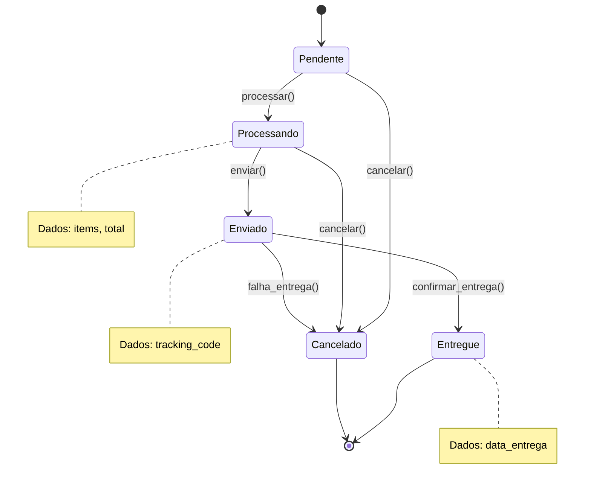
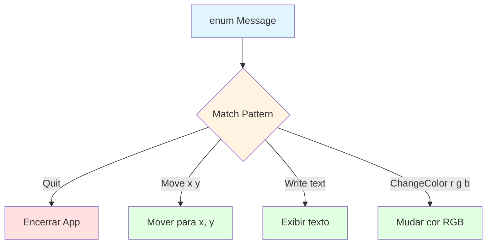
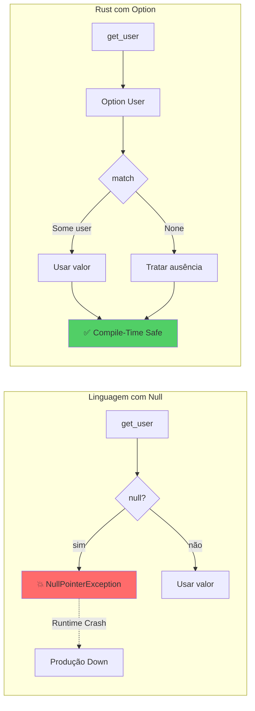
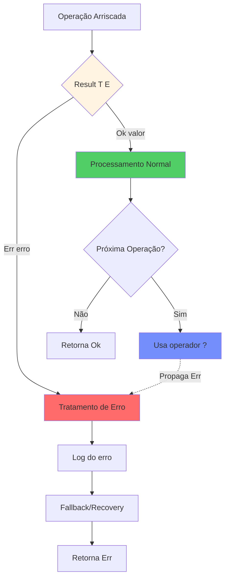
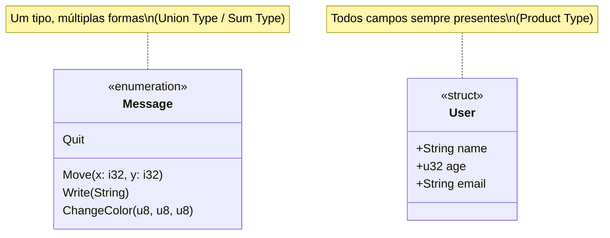
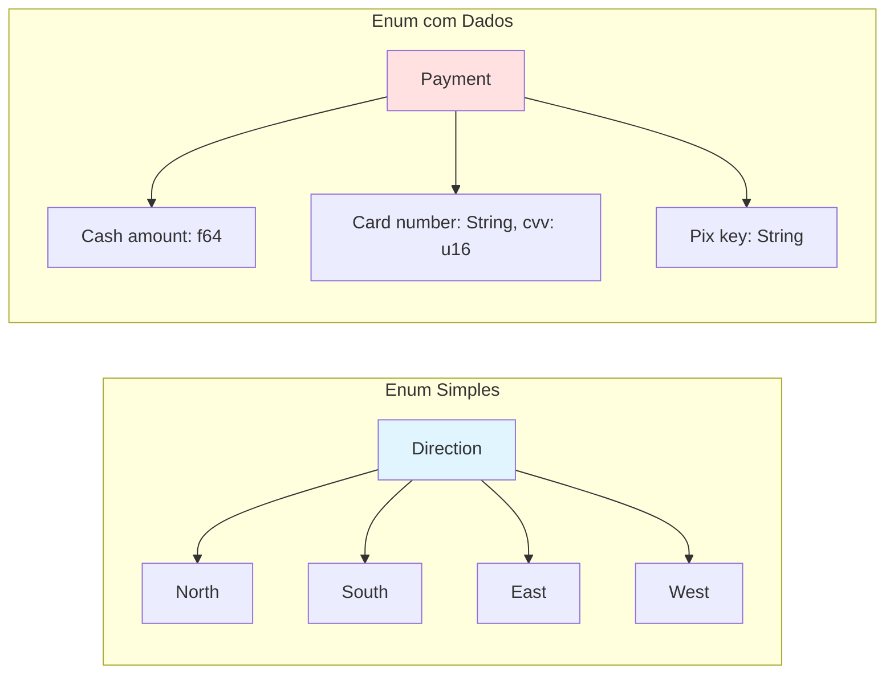

# 🦀 Dia 7: Enums - O Superpoder de Rust

---

## 📋 Objetivos de Aprendizagem

Ao final desta aula, você será capaz de:

1. **Compreender tipos algébricos de dados** - Enums como união de tipos distintos
2. **Criar enums básicos e com dados associados** - Variantes que carregam informações
3. **Dominar Option<T>** - Eliminar erros de null pointer de sua vida
4. **Utilizar Result<T, E>** - Tratamento de erros explícito e seguro
5. **Aplicar pattern matching avançado** - Exaustividade garantida pelo compilador
6. **Implementar máquinas de estado** - Modelar sistemas complexos com segurança de tipos

---

## 🎭 Ativação do Conhecimento Prévio

### Revisão Rápida: O que você já sabe

**Structs (Dia anterior):**
- Agrupam dados relacionados usando **multiplicação de tipos** (produto cartesiano)
- `struct User { name: String, age: u32 }` = name **E** age

**Match (Dia 5):**
- Pattern matching para controle de fluxo
- Deve cobrir todos os casos possíveis

### 🌳 Analogia: A Árvore de Decisões

Imagine que você está em uma encruzilhada com múltiplos caminhos:

- **Structs** são como uma **mochila**: você carrega TODOS os itens ao mesmo tempo (name E age E email)
- **Enums** são como **caminhos diferentes**: você escolhe UM caminho por vez (caminho A OU caminho B OU caminho C)

### 📖 História: O Problema do Valor Ausente

Em linguagens tradicionais (C, Java, JavaScript), usamos `null` para representar "ausência de valor":

```javascript
// JavaScript - O desastre do null
let user = findUser(id);
console.log(user.name.toUpperCase()); // 💥 CRASH! user pode ser null
```

**Tony Hoare**, inventor do `null`, chamou isso de "erro de um bilhão de dólares". Por quê?
- Crashes inesperados
- NullPointerException em produção
- Verificações if (x != null) esquecidas

**Rust resolve isso completamente** com `Option<T>` - e o compilador FORÇA você a tratar o caso ausente!

---

## 📚 Apresentação do Conteúdo

### 1. Enums Básicos - A Fundação

Um enum define um tipo que pode ser **uma de várias variantes**:

```rust {.line-numbers}
// Enum simples - escolha EXCLUSIVA
enum Direction {
    North,
    South,
    East,
    West,
}

fn main() {
    let moving = Direction::North;
    
    match moving {
        Direction::North => println!("Indo para o norte!"),
        Direction::South => println!("Indo para o sul!"),
        Direction::East => println!("Indo para o leste!"),
        Direction::West => println!("Indo para o oeste!"),
    }
}
```

**Ponto-chave:** Uma variável do tipo `Direction` pode ser North **OU** South **OU** East **OU** West - NUNCA mais de uma ao mesmo tempo.

---

### 2. Enums com Dados - O Verdadeiro Poder

Aqui Rust se destaca! Cada variante pode carregar dados diferentes:

```rust {.line-numbers}
enum Message {
    Quit,                       // Sem dados
    Move { x: i32, y: i32 },   // Struct anônima
    Write(String),              // String
    ChangeColor(u8, u8, u8),   // Tupla de 3 valores
}

fn process_message(msg: Message) {
    match msg {
        Message::Quit => {
            println!("Encerrando aplicação");
        }
        Message::Move { x, y } => {
            println!("Movendo para x: {}, y: {}", x, y);
        }
        Message::Write(text) => {
            println!("Texto: {}", text);
        }
        Message::ChangeColor(r, g, b) => {
            println!("Mudando cor para RGB({}, {}, {})", r, g, b);
        }
    }
}

fn main() {
    let msg1 = Message::Move { x: 10, y: 20 };
    let msg2 = Message::Write(String::from("Olá!"));
    let msg3 = Message::ChangeColor(255, 0, 0);
    
    process_message(msg1);
    process_message(msg2);
    process_message(msg3);
}
```

---

### 3. Option<T> - Adeus, Null!

`Option<T>` é um enum da biblioteca padrão que representa um valor que pode ou não existir:

```rust {.line-numbers}
enum Option<T> {
    Some(T),  // Contém um valor do tipo T
    None,     // Não contém valor
}
```

**Comparação Rust vs Outras Linguagens:**

| Conceito | JavaScript/Java | Rust |
|----------|-----------------|------|
| Valor existe | `user` | `Some(user)` |
| Valor ausente | `null` | `None` |
| Verificação | `if (user != null)` | `match` obrigatório |
| Segurança | ❌ Runtime error | ✅ Compile-time safety |

**Exemplo prático:**

```rust {.line-numbers}
fn find_user(id: u32) -> Option<String> {
    if id == 1 {
        Some(String::from("Alice"))
    } else {
        None
    }
}

fn main() {
    let user = find_user(1);
    
    // ❌ ERRO DE COMPILAÇÃO - não pode usar diretamente
    // println!("{}", user); 
    
    // ✅ CORRETO - deve usar match
    match user {
        Some(name) => println!("Usuário encontrado: {}", name),
        None => println!("Usuário não encontrado"),
    }
    
    // Ou usando if let (atalho para 1 caso)
    if let Some(name) = find_user(1) {
        println!("Encontrado: {}", name);
    }
}
```

**Métodos úteis de Option:**

```rust {.line-numbers}
fn main() {
    let some_value = Some(42);
    let no_value: Option<i32> = None;
    
    // unwrap_or: valor padrão se None
    println!("{}", some_value.unwrap_or(0)); // 42
    println!("{}", no_value.unwrap_or(0));   // 0
    
    // map: transforma o valor se Some
    let doubled = some_value.map(|x| x * 2);
    println!("{:?}", doubled); // Some(84)
    
    // and_then: encadeia operações Option
    let result = some_value.and_then(|x| {
        if x > 40 {
            Some(x + 10)
        } else {
            None
        }
    });
    println!("{:?}", result); // Some(52)
}
```

---

### 4. Result<T, E> - Tratamento de Erros Revolucionário

`Result<T, E>` representa uma operação que pode **suceder** (Ok) ou **falhar** (Err):

```rust {.line-numbers}
enum Result<T, E> {
    Ok(T),   // Sucesso com valor T
    Err(E),  // Erro com valor E
}
```

**Comparação com Exceptions:**

| Aspecto | Java/Python (Exceptions) | Rust (Result) |
|---------|--------------------------|---------------|
| Visibilidade | ❌ Invisível na assinatura | ✅ Explícito no tipo |
| Obrigação | ❌ Opcional (pode esquecer) | ✅ Compilador força tratamento |
| Performance | ❌ Overhead de stack unwinding | ✅ Zero-cost abstractions |
| Controle | ❌ try/catch distante | ✅ match no local exato |

**Exemplo completo:**

```rust {.line-numbers}
use std::fs::File;
use std::io::Read;

fn read_file_content(path: &str) -> Result<String, String> {
    let mut file = match File::open(path) {
        Ok(f) => f,
        Err(e) => return Err(format!("Erro ao abrir: {}", e)),
    };
    
    let mut content = String::new();
    match file.read_to_string(&mut content) {
        Ok(_) => Ok(content),
        Err(e) => Err(format!("Erro ao ler: {}", e)),
    }
}

fn main() {
    match read_file_content("data.txt") {
        Ok(content) => println!("Conteúdo: {}", content),
        Err(error) => println!("Erro: {}", error),
    }
    
    // Operador ? - propaga erro automaticamente
    // (veremos em detalhes no Dia 9)
}
```

---

### 5. Pattern Matching Avançado

**Exaustividade garantida:**

```rust {.line-numbers}
enum Status {
    Active,
    Inactive,
    Pending,
}

fn check_status(status: Status) {
    match status {
        Status::Active => println!("Ativo"),
        Status::Inactive => println!("Inativo"),
        // ❌ ERRO DE COMPILAÇÃO: faltou Status::Pending
    }
}
```

**Guards (condições extras):**

```rust {.line-numbers}
fn categorize_number(num: Option<i32>) {
    match num {
        Some(x) if x < 0 => println!("Negativo: {}", x),
        Some(x) if x == 0 => println!("Zero"),
        Some(x) if x > 100 => println!("Grande: {}", x),
        Some(x) => println!("Normal: {}", x),
        None => println!("Sem valor"),
    }
}
```

**Múltiplos padrões:**

```rust {.line-numbers}
enum Color {
    Red,
    Green,
    Blue,
    Yellow,
    Black,
}

fn is_primary(color: Color) -> bool {
    match color {
        Color::Red | Color::Green | Color::Blue => true,
        _ => false, // _ = "qualquer outro caso"
    }
}
```

---

### 6. if let e while let - Atalhos Convenientes

**if let** - quando você só se importa com **um** caso:

```rust {.line-numbers}
fn main() {
    let favorite_color: Option<&str> = Some("blue");
    
    // Versão completa com match
    match favorite_color {
        Some(color) => println!("Sua cor é {}", color),
        None => (), // ignora
    }
    
    // Versão compacta com if let
    if let Some(color) = favorite_color {
        println!("Sua cor é {}", color);
    }
    
    // Com else
    if let Some(color) = favorite_color {
        println!("Cor: {}", color);
    } else {
        println!("Sem cor favorita");
    }
}
```

**while let** - loop enquanto o padrão combinar:

```rust {.line-numbers}
fn main() {
    let mut stack = vec![1, 2, 3];
    
    // Remove e processa até o vetor esvaziar
    while let Some(top) = stack.pop() {
        println!("Processando: {}", top);
    }
    // Saída: 3, 2, 1
}
```

---

## 📊 Diagramas Obrigatórios

### Diagrama 1: Máquina de Estados - Ciclo de Vida de Pedido



### Diagrama 2: Árvore de Decisão - Match Exaustivo



### Diagrama 3: Fluxo Option<T> vs Null Tradicional



### Diagrama 4: Fluxo Result<T, E> para Tratamento de Erros



### Diagrama 5: UML - Enum com Dados vs Struct



### Diagrama 6: Comparação - Enums Simples vs Enums com Dados



---

## 💡 Demonstração e Modelagem

### Por que Enums Rust são Revolucionários?

**1. Eliminação de Null Pointer**

```rust {.line-numbers}
// ❌ Em Java/C - perigo constante
String name = user.getName(); // pode ser null!
int length = name.length();   // 💥 NullPointerException

// ✅ Em Rust - segurança garantida
let name: Option<String> = user.get_name();
// ❌ ERRO DE COMPILAÇÃO - não compila!
// let length = name.len();

// ✅ CORRETO - compilador força você a verificar
let length = match name {
    Some(n) => n.len(),
    None => 0,
};
```

**2. Erros Explícitos (sem Exceptions invisíveis)**

```rust {.line-numbers}
// ❌ Java - exception invisível na assinatura
public User loadUser(int id) throws IOException {
    // pode lançar exceção que você esquece de tratar
}

// ✅ Rust - erro visível no tipo de retorno
fn load_user(id: u32) -> Result<User, DatabaseError> {
    // erro É PARTE do tipo, impossível ignorar
}
```

**3. Match Exaustivo (impossível esquecer casos)**

```rust {.line-numbers}
enum TrafficLight {
    Red,
    Yellow,
    Green,
}

fn can_go(light: TrafficLight) -> bool {
    match light {
        TrafficLight::Red => false,
        TrafficLight::Yellow => false,
        // ❌ ERRO DE COMPILAÇÃO: faltou Green!
    }
}

// O compilador FORÇA você a cobrir todos os casos
// = zero bugs de "esqueci de verificar X"
```

---

## 🎯 Prática Guiada - Exercício Completo

### Sistema de Pedidos E-Commerce (Máquina de Estados)

**Contexto:** Você está desenvolvendo o backend de um e-commerce. Cada pedido passa por estados específicos, e nem todas transições são válidas.

**Requisitos:**
1. Estados: Pendente, Processando, Enviado, Entregue, Cancelado
2. Cada estado carrega dados específicos
3. Transições válidas devem ser aplicadas
4. Usar Option para campos opcionais
5. Usar Result para operações que podem falhar
6. Match exaustivo para processar estados

**Modelagem dos Estados:**

| Estado | Dados Associados | Transições Válidas |
|--------|------------------|-------------------|
| Pendente | items: Vec<String> | → Processando, Cancelado |
| Processando | items, total: f64 | → Enviado, Cancelado |
| Enviado | tracking_code: String | → Entregue, Cancelado |
| Entregue | delivery_date: String | (final) |
| Cancelado | reason: String | (final) |

**Código Completo:**

```rust {.line-numbers}
// Definição do Enum com dados em cada estado
#[derive(Debug)]
enum OrderStatus {
    Pending { 
        items: Vec<String> 
    },
    Processing { 
        items: Vec<String>, 
        total: f64 
    },
    Shipped { 
        tracking_code: String 
    },
    Delivered { 
        delivery_date: String 
    },
    Cancelled { 
        reason: String 
    },
}

struct Order {
    id: u32,
    status: OrderStatus,
}

impl Order {
    // Cria novo pedido no estado Pendente
    fn new(id: u32, items: Vec<String>) -> Self {
        Order {
            id,
            status: OrderStatus::Pending { items },
        }
    }
    
    // Transição: Pendente → Processando
    fn process(&mut self) -> Result<(), String> {
        match &self.status {
            OrderStatus::Pending { items } => {
                if items.is_empty() {
                    return Err(String::from("Não é possível processar pedido vazio"));
                }
                
                // Calcula total (simulação)
                let total = items.len() as f64 * 50.0;
                
                self.status = OrderStatus::Processing {
                    items: items.clone(),
                    total,
                };
                
                Ok(())
            }
            _ => Err(String::from("Só é possível processar pedidos pendentes")),
        }
    }
    
    // Transição: Processando → Enviado
    fn ship(&mut self, tracking_code: String) -> Result<(), String> {
        match &self.status {
            OrderStatus::Processing { .. } => {
                if tracking_code.is_empty() {
                    return Err(String::from("Código de rastreio inválido"));
                }
                
                self.status = OrderStatus::Shipped { tracking_code };
                Ok(())
            }
            _ => Err(String::from("Só é possível enviar pedidos em processamento")),
        }
    }
    
    // Transição: Enviado → Entregue
    fn deliver(&mut self, delivery_date: String) -> Result<(), String> {
        match &self.status {
            OrderStatus::Shipped { .. } => {
                self.status = OrderStatus::Delivered { delivery_date };
                Ok(())
            }
            _ => Err(String::from("Só é possível entregar pedidos enviados")),
        }
    }
    
    // Transição: * → Cancelado (de qualquer estado exceto final)
    fn cancel(&mut self, reason: String) -> Result<(), String> {
        match &self.status {
            OrderStatus::Delivered { .. } => {
                Err(String::from("Não é possível cancelar pedido já entregue"))
            }
            OrderStatus::Cancelled { .. } => {
                Err(String::from("Pedido já está cancelado"))
            }
            _ => {
                self.status = OrderStatus::Cancelled { reason };
                Ok(())
            }
        }
    }
    
    // Exibe informações do pedido baseado no estado atual
    fn display_info(&self) {
        println!("\n📦 Pedido #{}", self.id);
        
        match &self.status {
            OrderStatus::Pending { items } => {
                println!("Status: ⏳ Pendente");
                println!("Items: {}", items.join(", "));
            }
            OrderStatus::Processing { items, total } => {
                println!("Status: ⚙️  Processando");
                println!("Items: {}", items.join(", "));
                println!("Total: R$ {:.2}", total);
            }
            OrderStatus::Shipped { tracking_code } => {
                println!("Status: 🚚 Enviado");
                println!("Rastreio: {}", tracking_code);
            }
            OrderStatus::Delivered { delivery_date } => {
                println!("Status: ✅ Entregue");
                println!("Data de entrega: {}", delivery_date);
            }
            OrderStatus::Cancelled { reason } => {
                println!("Status: ❌ Cancelado");
                println!("Motivo: {}", reason);
            }
        }
    }
    
    // Retorna Option: Some se pode cancelar, None se não pode
    fn can_cancel(&self) -> Option<bool> {
        match &self.status {
            OrderStatus::Delivered { .. } | OrderStatus::Cancelled { .. } => None,
            _ => Some(true),
        }
    }
}

fn main() {
    println!("=== SISTEMA DE PEDIDOS E-COMMERCE ===\n");
    
    // Criando pedido
    let items = vec![
        String::from("Mouse Gamer"),
        String::from("Teclado Mecânico"),
        String::from("Headset"),
    ];
    
    let mut order = Order::new(1001, items);
    order.display_info();
    
    // Processando pedido
    println!("\n--- Processando pedido ---");
    match order.process() {
        Ok(_) => println!("✅ Pedido processado com sucesso!"),
        Err(e) => println!("❌ Erro: {}", e),
    }
    order.display_info();
    
    // Enviando pedido
    println!("\n--- Enviando pedido ---");
    match order.ship(String::from("BR123456789")) {
        Ok(_) => println!("✅ Pedido enviado!"),
        Err(e) => println!("❌ Erro: {}", e),
    }
    order.display_info();
    
    // Verificando se pode cancelar
    println!("\n--- Verificando cancelamento ---");
    match order.can_cancel() {
        Some(true) => println!("⚠️  Pedido pode ser cancelado"),
        Some(false) => println!("⚠️  Pedido não pode ser cancelado"),
        None => println!("❌ Estado final - cancelamento não aplicável"),
    }
    
    // Entregando pedido
    println!("\n--- Entregando pedido ---");
    match order.deliver(String::from("2024-03-15")) {
        Ok(_) => println!("✅ Pedido entregue!"),
        Err(e) => println!("❌ Erro: {}", e),
    }
    order.display_info();
    
    // Tentando cancelar após entrega (deve falhar)
    println!("\n--- Tentando cancelar após entrega ---");
    match order.cancel(String::from("Mudei de ideia")) {
        Ok(_) => println!("✅ Pedido cancelado"),
        Err(e) => println!("❌ Erro: {}", e),
    }
    
    // Criando segundo pedido para testar cancelamento
    println!("\n\n=== SEGUNDO PEDIDO - TESTE DE CANCELAMENTO ===\n");
    let mut order2 = Order::new(1002, vec![String::from("Monitor 4K")]);
    order2.display_info();
    
    order2.process().ok();
    order2.display_info();
    
    println!("\n--- Cancelando pedido ---");
    match order2.cancel(String::from("Cliente desistiu da compra")) {
        Ok(_) => println!("✅ Pedido cancelado com sucesso!"),
        Err(e) => println!("❌ Erro: {}", e),
    }
    order2.display_info();
}
```

**Saída Esperada:**

```
=== SISTEMA DE PEDIDOS E-COMMERCE ===

📦 Pedido #1001
Status: ⏳ Pendente
Items: Mouse Gamer, Teclado Mecânico, Headset

--- Processando pedido ---
✅ Pedido processado com sucesso!

📦 Pedido #1001
Status: ⚙️  Processando
Items: Mouse Gamer, Teclado Mecânico, Headset
Total: R$ 150.00

--- Enviando pedido ---
✅ Pedido enviado!

📦 Pedido #1001
Status: 🚚 Enviado
Rastreio: BR123456789

--- Verificando cancelamento ---
⚠️  Pedido pode ser cancelado

--- Entregando pedido ---
✅ Pedido entregue!

📦 Pedido #1001
Status: ✅ Entregue
Data de entrega: 2024-03-15

--- Tentando cancelar após entrega ---
❌ Erro: Não é possível cancelar pedido já entregue

=== SEGUNDO PEDIDO - TESTE DE CANCELAMENTO ===

📦 Pedido #1002
Status: ⏳ Pendente
Items: Monitor 4K

📦 Pedido #1002
Status: ⚙️  Processando
Items: Monitor 4K
Total: R$ 50.00

--- Cancelando pedido ---
✅ Pedido cancelado com sucesso!

📦 Pedido #1002
Status: ❌ Cancelado
Motivo: Cliente desistiu da compra
```

**Análise Detalhada da Solução:**

**1. Segurança de Tipos:**
- Cada estado carrega apenas os dados relevantes
- Impossível acessar `tracking_code` em um pedido Pendente
- O compilador garante que todos os campos estão presentes

**2. Transições Válidas:**
- Cada método verifica o estado atual com `match`
- Retorna `Result<(), String>` para indicar sucesso ou erro
- Impossível fazer transições inválidas (ex: Pendente → Entregue direto)

**3. Pattern Matching Exaustivo:**
- `match` força você a considerar todos os estados possíveis
- Se adicionar novo estado, o compilador aponta todos os lugares que precisam ser atualizados

**4. Option e Result:**
- `can_cancel()` retorna `Option<bool>` - Some(true/false) ou None
- Métodos de transição retornam `Result` - Ok ou Err com mensagem

**Extensões Possíveis:**

```rust {.line-numbers}
// 1. Adicionar histórico de estados
struct Order {
    id: u32,
    status: OrderStatus,
    history: Vec<(OrderStatus, String)>, // (estado, timestamp)
}

// 2. Notificações por estado
impl Order {
    fn notify_customer(&self) {
        match &self.status {
            OrderStatus::Shipped { tracking_code } => {
                println!("📧 Email: Seu pedido foi enviado! Rastreio: {}", tracking_code);
            }
            OrderStatus::Delivered { .. } => {
                println!("📧 Email: Seu pedido foi entregue! Avalie sua compra.");
            }
            _ => {}
        }
    }
}

// 3. Validações mais complexas
impl Order {
    fn validate_transition(&self, new_status: &OrderStatus) -> Result<(), String> {
        // Lógica de validação de regras de negócio
    }
}
```

---

## 🔄 Feedback e Avaliação

### ✅ Checklist de Conceitos Dominados

Marque o que você consegue fazer com confiança:

- [ ] Criar enums básicos com variantes simples
- [ ] Criar enums com dados associados a cada variante
- [ ] Usar `Option<T>` para representar valores que podem não existir
- [ ] Usar `Result<T, E>` para operações que podem falhar
- [ ] Escrever `match` exaustivo para cobrir todos os casos
- [ ] Usar `if let` como atalho para casos únicos
- [ ] Usar `while let` para loops condicionais
- [ ] Implementar máquinas de estado com enums
- [ ] Entender a diferença entre enums Rust e de outras linguagens

### 🚫 Erros Comuns e Como Evitar

**1. Esquecer de cobrir todos os casos no match**

```rust {.line-numbers}
// ❌ ERRO
match option_value {
    Some(x) => println!("{}", x),
    // Faltou None - não compila!
}

// ✅ CORRETO
match option_value {
    Some(x) => println!("{}", x),
    None => println!("Sem valor"),
}
```

**2. Tentar acessar dados sem match**

```rust {.line-numbers}
let value: Option<i32> = Some(10);

// ❌ ERRO - Option não tem operador de acesso direto
// let x = value + 5;

// ✅ CORRETO
let x = match value {
    Some(v) => v + 5,
    None => 5,
};
```

**3. Usar unwrap() sem garantia**

```rust {.line-numbers}
let value: Option<i32> = None;

// ❌ PERIGO - panic! se None
// let x = value.unwrap();

// ✅ CORRETO - sempre verifique ou use unwrap_or
let x = value.unwrap_or(0);
```

**4. Ignorar Result sem tratamento**

```rust {.line-numbers}
fn may_fail() -> Result<i32, String> {
    Ok(42)
}

// ❌ RUIM - ignora erro silenciosamente
may_fail();

// ✅ CORRETO - sempre trate ou propague
match may_fail() {
    Ok(v) => println!("Sucesso: {}", v),
    Err(e) => println!("Erro: {}", e),
}
```

### 📝 Quiz Rápido

**1. Qual a diferença entre struct e enum?**
<details>
<summary>Ver Resposta</summary>

- **Struct**: Tipo produto (AND) - contém TODOS os campos simultaneamente
- **Enum**: Tipo soma (OR) - é UMA das variantes por vez
</details>

**2. Por que Option<T> é melhor que null?**
<details>
<summary>Ver Resposta</summary>

- **Segurança em tempo de compilação**: compilador força tratamento
- **Explícito no tipo**: a assinatura da função mostra que pode não haver valor
- **Zero null pointer exceptions**: impossível ter erro de runtime
</details>

**3. Quando usar Result vs Option?**
<details>
<summary>Ver Resposta</summary>

- **Option**: quando o valor pode ou não existir (ausência é normal)
  - Exemplo: buscar item em cache, último elemento de array
- **Result**: quando a operação pode falhar e você quer informar POR QUÊ
  - Exemplo: ler arquivo, fazer requisição HTTP, parsear dados
</details>

**4. O que acontece se esquecer um caso no match?**
<details>
<summary>Ver Resposta</summary>

**Erro de compilação!** Rust exige match exaustivo. Isso previne bugs de "esqueci de verificar X".
</details>

### 🎯 Auto-Avaliação

Teste seu conhecimento recriando o sistema de pedidos, mas com estas modificações:

1. Adicione estado `AwaitingPayment` entre Pending e Processing
2. Adicione método `refund()` que só funciona se Delivered
3. Adicione campo `estimated_delivery` (Option<String>) em Shipped
4. Crie enum `PaymentMethod` e adicione ao Processing

---

## 🚀 Transferência e Aplicação

### 💪 Desafio: Sistema de Autenticação

Implemente um sistema de autenticação com os seguintes requisitos:

**Enums necessários:**

```rust {.line-numbers}
// Estados de autenticação
enum AuthStatus {
    Unauthenticated,
    Authenticating { username: String },
    Authenticated { 
        username: String, 
        token: String,
        expires_at: u64, // timestamp
    },
    SessionExpired { username: String },
    Locked { reason: String },
}

// Resultado de operações de auth
enum AuthResult {
    Success { token: String },
    InvalidCredentials,
    AccountLocked { reason: String },
    NetworkError { details: String },
}
```

**Requisitos:**
1. Implementar struct `AuthSession` com campo `status: AuthStatus`
2. Método `login(username, password) -> Result<String, String>` 
3. Método `validate_session() -> Option<String>` (retorna token se válido)
4. Método `logout()`
5. Transições de estado devem ser validadas
6. Usar match exaustivo em todas as operações

**Testes esperados:**
- Login com credenciais corretas → Authenticated
- Login com credenciais erradas → InvalidCredentials
- Validar sessão expirada → None
- Tentar login em conta bloqueada → Err

**Dica:** Use `std::time::SystemTime` para timestamps reais.

### 📚 Recursos Adicionais

**Documentação Oficial:**
- [The Rust Book - Chapter 6: Enums and Pattern Matching](https://doc.rust-lang.org/book/ch06-00-enums.html)
- [Rust By Example - Enums](https://doc.rust-lang.org/rust-by-example/custom_types/enum.html)
- [std::option::Option](https://doc.rust-lang.org/std/option/enum.Option.html)
- [std::result::Result](https://doc.rust-lang.org/std/result/enum.Result.html)

**Vídeos Recomendados:**
- "Rust's Enum: A Deep Dive" - No Boilerplate
- "Option and Result in Rust" - Let's Get Rusty

**Artigos:**
- "Algebraic Data Types in Rust" - comparação com Haskell/ML
- "Error Handling in Rust" - Result vs Exceptions

### 🎓 Preparação para o Dia 8

**Próximos tópicos:**
- **Genéricos (Generics)** - Como Option<T> e Result<T, E> são implementados
- **Traits** - Comportamentos compartilhados entre tipos
- **Lifetimes básicos** - Referências em structs e enums

**Pré-requisito para amanhã:**
- Revisar ownership e borrowing
- Entender bem pattern matching
- Praticar com Option e Result

**Conceitos que se conectarão:**
- Enums + Traits = polimorfismo poderoso
- Enums + Generics = abstrações reutilizáveis
- Enums + Lifetimes = estruturas de dados complexas

---

## 🎊 Parabéns!

Você acabou de dominar um dos recursos mais poderosos de Rust: **Enums com dados**. 

Você agora sabe:
- ✅ Eliminar null pointer exceptions com Option<T>
- ✅ Tratar erros explicitamente com Result<T, E>
- ✅ Criar máquinas de estado type-safe
- ✅ Usar pattern matching exaustivo para código à prova de bugs

**Rust não tem null. Rust não precisa de null.** 🦀

Amanhã você vai aprender como criar suas próprias versões de Option e Result usando **Generics** e **Traits**!

---

**Tempo estimado de estudo:** 3-4 horas
**Próxima aula:** Dia 8 - Generics e Traits

🦀 **Happy Coding!**