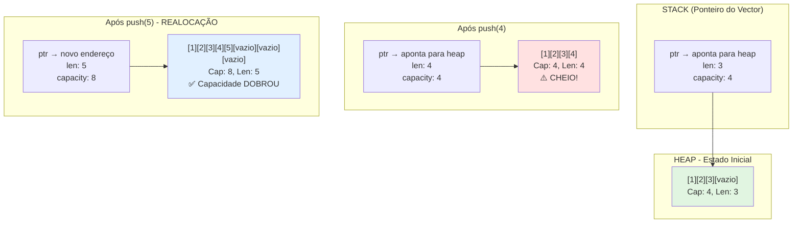
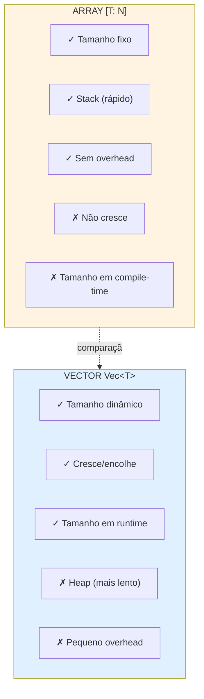
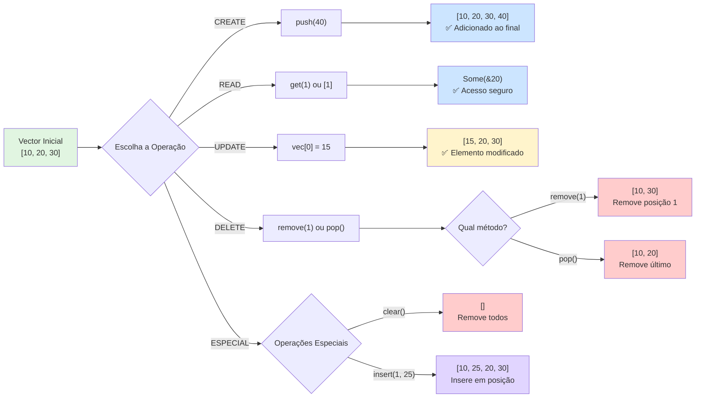
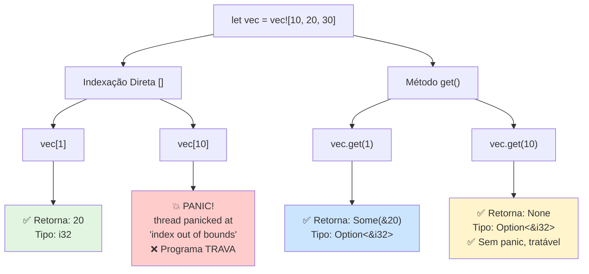
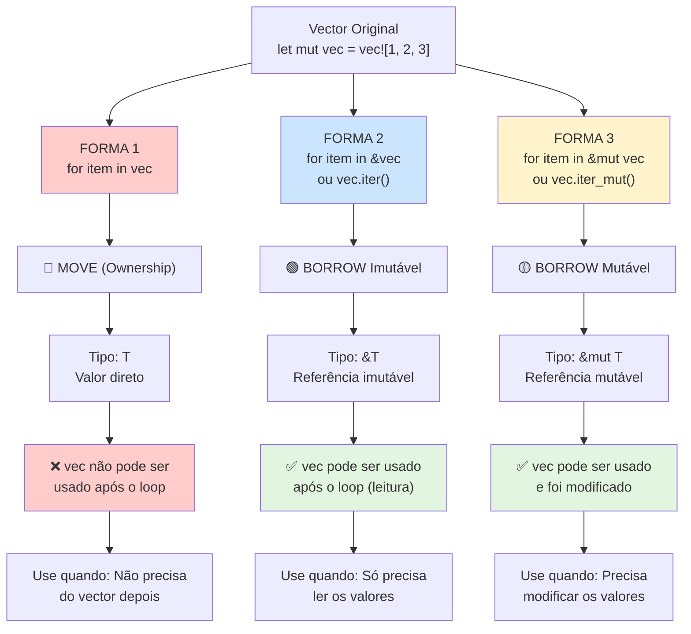
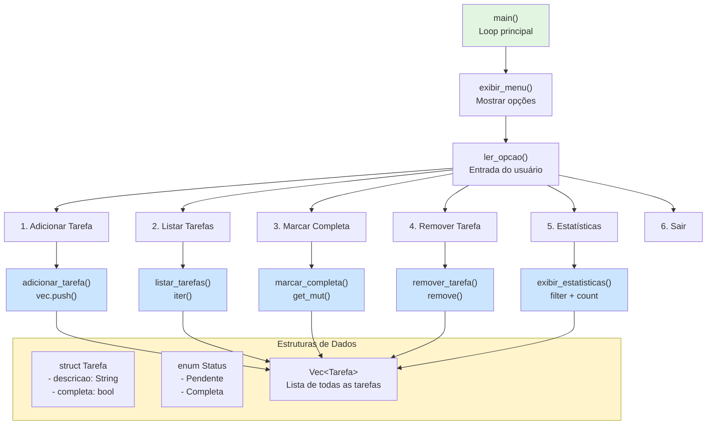

# 📦 Dia 8: Vectors em Rust - Coleções Dinâmicas

---

## 📋 OBJETIVOS DE APRENDIZAGEM

Ao final desta lição, você será capaz de:

1. **Criar** vectors usando diferentes métodos (`Vec::new()`, `vec![]`, `with_capacity()`)
2. **Manipular** dados dinamicamente (adicionar, remover, modificar elementos)
3. **Acessar** elementos de forma segura usando `get()` vs indexação direta
4. **Iterar** sobre vectors usando três técnicas distintas
5. **Compreender** a diferença entre capacidade e comprimento
6. **Aplicar** vectors em projetos reais (sistema de gerenciamento de tarefas)

---

## 🎭 ATIVAÇÃO DO CONHECIMENTO PRÉVIO

### 📌 Revisão: O que você já sabe

Nos dias anteriores, você trabalhou com **arrays**:

```rust {.line-numbers}
let numeros: [i32; 5] = [1, 2, 3, 4, 5]; // Tamanho FIXO em tempo de compilação
```

**Limitações dos arrays:**
- ❌ Tamanho fixo e imutável
- ❌ Não podem crescer ou encolher
- ❌ Tamanho definido em tempo de compilação

---

### 🏢 Analogia: A Estante Dinâmica

Imagine duas situações:

**Array = Estante Fixa:**
- Você compra uma estante com exatamente 5 prateleiras
- Se tiver 6 livros, um fica de fora
- Se tiver 3 livros, 2 prateleiras ficam vazias
- Não dá para adicionar ou remover prateleiras

**Vector = Estante Expansível:**
- Começa com algumas prateleiras
- Quando enche, você adiciona mais prateleiras automaticamente
- Quando remove livros, pode encolher se quiser
- **Flexível e adaptável às suas necessidades**

---

### 📖 História Real: Por que Vectors são Essenciais

Você está desenvolvendo um app de lista de compras:
- O usuário adiciona itens (quantidade variável)
- Remove itens já comprados
- A lista cresce e encolhe constantemente
- **Impossível prever o tamanho em tempo de compilação**

➡️ **Vectors são a solução perfeita para dados dinâmicos!**

---

## 📚 APRESENTAÇÃO DO CONTEÚDO

### 1️⃣ O que é um Vector?

**`Vec<T>`** é uma coleção **dinâmica** e **redimensionável** que:
- Armazena elementos do mesmo tipo `T`
- Cresce automaticamente quando necessário
- É alocada no **heap** (memória dinâmica)
- Possui ownership sobre seus elementos

---

### 📊 DIAGRAMA 1: Memória - Vector Crescendo Dinamicamente



**📌 Conceitos-chave:**
- **`ptr`**: Ponteiro para os dados no heap
- **`len`**: Número de elementos atualmente armazenados
- **`capacity`**: Espaço total alocado (pode ser maior que `len`)
- **Crescimento**: Quando `len == capacity`, o vector **realoca** dobrando a capacidade

---

### 2️⃣ Criação de Vectors

#### Método 1: `Vec::new()` - Vector Vazio

```rust {.line-numbers}
let mut numeros: Vec<i32> = Vec::new(); // Capacidade inicial: 0
numeros.push(10); // Agora tem capacidade e comprimento
```

#### Método 2: `vec![]` - Macro com Valores Iniciais

```rust {.line-numbers}
let numeros = vec![1, 2, 3, 4, 5]; // Tipo inferido: Vec<i32>
let zeros = vec![0; 10]; // 10 zeros: [0, 0, 0, ..., 0]
```

#### Método 3: `Vec::with_capacity()` - Pré-alocação

```rust {.line-numbers}
let mut numeros = Vec::with_capacity(100); // Capacidade: 100, len: 0
// Evita realocações se você sabe o tamanho aproximado
```

**⚡ Dica de Performance:**
Use `with_capacity()` quando souber quantos elementos vai adicionar para evitar realocações custosas.

---

### 📊 DIAGRAMA 2: Comparação Array vs Vector



---

### 3️⃣ Manipulação de Vectors

#### 📊 Tabela de Métodos Principais

| Método | Descrição | Exemplo | Retorno |
|--------|-----------|---------|---------|
| **`push(valor)`** | Adiciona ao final | `vec.push(5)` | `()` |
| **`pop()`** | Remove do final | `vec.pop()` | `Option<T>` |
| **`insert(idx, val)`** | Insere em posição | `vec.insert(2, 10)` | `()` |
| **`remove(idx)`** | Remove em posição | `vec.remove(1)` | `T` |
| **`clear()`** | Remove todos | `vec.clear()` | `()` |
| **`len()`** | Número de elementos | `vec.len()` | `usize` |
| **`is_empty()`** | Verifica se vazio | `vec.is_empty()` | `bool` |
| **`capacity()`** | Capacidade total | `vec.capacity()` | `usize` |

---

### 📊 DIAGRAMA 3: Fluxograma de Operações CRUD



---

### 💻 Código Demonstrativo: Operações Básicas

```rust {.line-numbers}
fn main() {
    // Criação
    let mut numeros = vec![10, 20, 30];
    println!("Inicial: {:?}", numeros); // [10, 20, 30]
    
    // CREATE - Adicionar elementos
    numeros.push(40);
    println!("Após push(40): {:?}", numeros); // [10, 20, 30, 40]
    
    numeros.insert(1, 15); // Insere 15 na posição 1
    println!("Após insert(1, 15): {:?}", numeros); // [10, 15, 20, 30, 40]
    
    // READ - Acessar elementos (veremos em detalhes a seguir)
    println!("Elemento na posição 2: {}", numeros[2]); // 20
    
    // UPDATE - Modificar elementos
    numeros[0] = 5;
    println!("Após numeros[0] = 5: {:?}", numeros); // [5, 15, 20, 30, 40]
    
    // DELETE - Remover elementos
    let removido = numeros.remove(1); // Remove posição 1
    println!("Removido: {}, Vector: {:?}", removido, numeros); // 15, [5, 20, 30, 40]
    
    let ultimo = numeros.pop(); // Remove último
    println!("Pop: {:?}, Vector: {:?}", ultimo, numeros); // Some(40), [5, 20, 30]
    
    // Informações
    println!("Comprimento: {}", numeros.len()); // 3
    println!("Capacidade: {}", numeros.capacity()); // Varia (geralmente > 3)
    println!("Está vazio? {}", numeros.is_empty()); // false
    
    // Limpar tudo
    numeros.clear();
    println!("Após clear: {:?}", numeros); // []
    println!("Está vazio? {}", numeros.is_empty()); // true
}
```

---

### 4️⃣ Acesso Seguro: `get()` vs Indexação Direta `[]`

**🚨 CRÍTICO: Diferença entre Segurança e Panic**

#### ❌ Indexação Direta `[]` - Pode causar PANIC

```rust {.line-numbers}
let numeros = vec![10, 20, 30];

let valor = numeros[1]; // ✅ OK: retorna 20
println!("{}", valor);

let valor = numeros[10]; // ❌ PANIC! Índice fora dos limites
// thread 'main' panicked at 'index out of bounds'
```

**Quando usar:**
- ✅ Quando você tem **certeza absoluta** que o índice existe
- ✅ Em loops controlados com `len()`

---

#### ✅ Método `get()` - Seguro, retorna `Option<T>`

```rust {.line-numbers}
let numeros = vec![10, 20, 30];

// Acesso seguro
match numeros.get(1) {
    Some(valor) => println!("Valor: {}", valor), // 20
    None => println!("Índice inválido"),
}

// Acesso a índice inválido
match numeros.get(10) {
    Some(valor) => println!("Valor: {}", valor),
    None => println!("Índice inválido"), // ← Executa isso, sem panic!
}

// Usando if let (mais conciso)
if let Some(valor) = numeros.get(2) {
    println!("Terceiro elemento: {}", valor); // 30
}
```

**Quando usar:**
- ✅ Quando o índice vem de entrada do usuário
- ✅ Quando não tem certeza se o índice existe
- ✅ **Sempre que possível para código mais robusto**

---

#### 📊 Comparação Visual: get() vs []



---

### 5️⃣ Iteração sobre Vectors

Existem **três formas principais** de iterar, cada uma com comportamento diferente de **ownership**.

### 📊 DIAGRAMA 4: Três Formas de Iteração



---

#### Forma 1: `for item in vec` - Consome o Vector (Move)

```rust {.line-numbers}
let numeros = vec![1, 2, 3, 4, 5];

for num in numeros { // numeros é MOVIDO
    println!("{}", num); // num é do tipo i32 (valor)
}

// println!("{:?}", numeros); // ❌ ERRO! numeros foi movido
```

**Quando usar:**
- Quando você **não precisa** do vector após o loop
- Quando quer **consumir** os elementos

---

#### Forma 2: `for item in &vec` ou `.iter()` - Referência Imutável

```rust {.line-numbers}
let numeros = vec![1, 2, 3, 4, 5];

// Forma abreviada
for num in &numeros { // Empresta imutavelmente
    println!("{}", num); // num é do tipo &i32 (referência)
}

// Forma explícita (equivalente)
for num in numeros.iter() {
    println!("{}", num);
}

println!("{:?}", numeros); // ✅ OK! numeros ainda existe
```

**Quando usar:**
- Quando precisa **ler** os elementos
- Quando quer **usar o vector depois** do loop
- **Forma mais comum na prática**

---

#### Forma 3: `for item in &mut vec` ou `.iter_mut()` - Referência Mutável

```rust {.line-numbers}
let mut numeros = vec![1, 2, 3, 4, 5];

// Forma abreviada
for num in &mut numeros { // Empresta mutavelmente
    *num *= 2; // num é &mut i32, usa * para modificar
}

// Forma explícita (equivalente)
for num in numeros.iter_mut() {
    *num += 10;
}

println!("{:?}", numeros); // ✅ [22, 24, 26, 28, 30] - modificado!
```

**Quando usar:**
- Quando precisa **modificar** os elementos
- Quando quer **manter o vector** após modificações

---

### 📊 Tabela Comparativa: Iteração

| Sintaxe | Tipo do Item | Ownership | Vector Após Loop | Uso Principal |
|---------|-------------|-----------|------------------|---------------|
| `for item in vec` | `T` | Move | ❌ Consumido | Consumir elementos |
| `for item in &vec` | `&T` | Borrow | ✅ Disponível | Ler elementos |
| `for item in &mut vec` | `&mut T` | Borrow Mut | ✅ Modificado | Modificar elementos |

---

### 6️⃣ Slices: Visualizações de Partes do Vector

**Slices** permitem acessar **parte** de um vector sem copiar dados.

```rust {.line-numbers}
let numeros = vec![10, 20, 30, 40, 50];

// Slice do índice 1 até 3 (não inclui 4)
let slice = &numeros[1..4]; // [20, 30, 40]
println!("{:?}", slice);

// Slice do início até índice 3
let slice_inicio = &numeros[..3]; // [10, 20, 30]
println!("{:?}", slice_inicio);

// Slice do índice 2 até o fim
let slice_fim = &numeros[2..]; // [30, 40, 50]
println!("{:?}", slice_fim);

// Slice completo
let slice_completo = &numeros[..]; // [10, 20, 30, 40, 50]
println!("{:?}", slice_completo);
```

**🎯 Visualização:**

```
Índices:   0   1   2   3   4
         ┌───┬───┬───┬───┬───┐
Vector:  │10 │20 │30 │40 │50 │
         └───┴───┴───┴───┴───┘
         
&numeros[1..4]  →  [20, 30, 40]
         ╔═══════════════╗
         ║   1   2   3   ║

&numeros[..3]   →  [10, 20, 30]
     ╔═══════════╗
     ║ 0   1   2 ║

&numeros[2..]   →  [30, 40, 50]
             ╔═══════════════╗
             ║ 2   3   4     ║
```

---

### 7️⃣ Capacidade vs Comprimento

**Entender essa diferença é crucial para performance!**

```rust {.line-numbers}
let mut numeros = Vec::with_capacity(10);
println!("Len: {}, Cap: {}", numeros.len(), numeros.capacity());
// Len: 0, Cap: 10

numeros.push(1);
numeros.push(2);
println!("Len: {}, Cap: {}", numeros.len(), numeros.capacity());
// Len: 2, Cap: 10 (ainda tem espaço)

// Reservar mais capacidade sem realocar
numeros.reserve(20); // Garante capacidade para mais 20
println!("Cap após reserve: {}", numeros.capacity());
// Cap: 22 ou mais

// Encolher capacidade ao mínimo necessário
numeros.shrink_to_fit();
println!("Cap após shrink: {}", numeros.capacity());
// Cap: 2 (igual ao len)
```

**⚡ Dica de Performance:**

1. **`len()`**: Número de elementos **realmente armazenados** (O(1))
2. **`capacity()`**: Espaço **alocado** no heap (O(1))
3. **`reserve(n)`**: Garante capacidade para mais `n` elementos
4. **`shrink_to_fit()`**: Libera memória não usada

---

## 💡 DEMONSTRAÇÃO E MODELAGEM

### 🎬 Exemplo Passo a Passo: Gerenciador de Notas

Vamos criar um sistema simples que demonstra todos os conceitos:

```rust {.line-numbers}
fn main() {
    // 1. CRIAÇÃO - Notas de alunos
    let mut notas: Vec<f64> = Vec::new();
    
    // 2. ADIÇÃO - Inserir notas
    notas.push(8.5);
    notas.push(7.0);
    notas.push(9.5);
    notas.push(6.5);
    println!("Notas: {:?}", notas);
    
    // 3. LEITURA SEGURA - Buscar nota específica
    println!("\n--- Busca Segura ---");
    match notas.get(2) {
        Some(nota) => println!("Terceira nota: {}", nota),
        None => println!("Nota não encontrada"),
    }
    
    // Busca insegura (pode dar panic)
    if notas.len() > 3 {
        println!("Quarta nota (indexação direta): {}", notas[3]);
    }
    
    // 4. ITERAÇÃO - Calcular média
    println!("\n--- Cálculo de Média ---");
    let mut soma = 0.0;
    for nota in &notas { // Borrow imutável
        soma += nota;
    }
    let media = soma / notas.len() as f64;
    println!("Média: {:.2}", media);
    
    // 5. MODIFICAÇÃO - Adicionar ponto extra em todas
    println!("\n--- Ponto Extra (+0.5) ---");
    for nota in &mut notas { // Borrow mutável
        *nota += 0.5;
        if *nota > 10.0 {
            *nota = 10.0; // Limitar a 10
        }
    }
    println!("Notas após ponto extra: {:?}", notas);
    
    // 6. REMOÇÃO - Remover última nota
    println!("\n--- Remoção ---");
    if let Some(removida) = notas.pop() {
        println!("Nota removida: {}", removida);
    }
    println!("Notas restantes: {:?}", notas);
    
    // 7. SLICE - Ver apenas as duas primeiras
    println!("\n--- Slice ---");
    let duas_primeiras = &notas[..2];
    println!("Duas primeiras notas: {:?}", duas_primeiras);
    
    // 8. INFORMAÇÕES
    println!("\n--- Informações ---");
    println!("Total de notas: {}", notas.len());
    println!("Capacidade alocada: {}", notas.capacity());
    println!("Está vazio? {}", notas.is_empty());
}
```

**📤 Saída Esperada:**

```
Notas: [8.5, 7.0, 9.5, 6.5]

--- Busca Segura ---
Terceira nota: 9.5
Quarta nota (indexação direta): 6.5

--- Cálculo de Média ---
Média: 7.88

--- Ponto Extra (+0.5) ---
Notas após ponto extra: [9.0, 7.5, 10.0, 7.0]

--- Remoção ---
Nota removida: 7.0
Notas restantes: [9.0, 7.5, 10.0]

--- Slice ---
Duas primeiras notas: [9.0, 7.5]

--- Informações ---
Total de notas: 3
Capacidade alocada: 4
Está vazio? false
```

---

## 🎯 PRÁTICA GUIADA - Exercício Completo

### 🗂️ Sistema de Gerenciamento de Tarefas (Todo List)

**Contexto:** Você vai criar um aplicativo de produtividade pessoal para gerenciar tarefas diárias.

#### 📋 Requisitos Funcionais

1. ✅ **Adicionar** nova tarefa
2. ❌ **Remover** tarefa por índice
3. ✏️ **Marcar** tarefa como completa
4. 📊 **Listar** todas as tarefas
5. 🔍 **Filtrar** por status (pendentes/completas)
6. 📈 **Estatísticas** (total, completas, pendentes)
7. 🎯 Menu interativo no terminal

---

### 📊 DIAGRAMA 5: Arquitetura da Aplicação



---

### 💻 Solução Completa

```rust {.line-numbers}
use std::io::{self, Write};

// 1. ESTRUTURAS DE DADOS

#[derive(Debug, Clone)]
struct Tarefa {
    descricao: String,
    completa: bool,
}

impl Tarefa {
    // Construtor para criar nova tarefa
    fn nova(descricao: String) -> Self {
        Tarefa {
            descricao,
            completa: false,
        }
    }
    
    // Marcar como completa
    fn marcar_completa(&mut self) {
        self.completa = true;
    }
    
    // Retornar status como string
    fn status(&self) -> &str {
        if self.completa {
            "✓ Completa"
        } else {
            "○ Pendente"
        }
    }
}

// 2. GERENCIADOR DE TAREFAS

struct GerenciadorTarefas {
    tarefas: Vec<Tarefa>,
}

impl GerenciadorTarefas {
    // Criar gerenciador vazio
    fn novo() -> Self {
        GerenciadorTarefas {
            tarefas: Vec::new(),
        }
    }
    
    // Adicionar tarefa
    fn adicionar(&mut self, descricao: String) {
        let tarefa = Tarefa::nova(descricao);
        self.tarefas.push(tarefa);
        println!("✅ Tarefa adicionada com sucesso!");
    }
    
    // Listar todas as tarefas
    fn listar_todas(&self) {
        if self.tarefas.is_empty() {
            println!("📭 Nenhuma tarefa cadastrada.");
            return;
        }
        
        println!("\n📋 === TODAS AS TAREFAS ===");
        for (indice, tarefa) in self.tarefas.iter().enumerate() {
            println!(
                "[{}] {} - {}",
                indice,
                tarefa.status(),
                tarefa.descricao
            );
        }
        println!();
    }
    
    // Listar apenas pendentes
    fn listar_pendentes(&self) {
        println!("\n⏳ === TAREFAS PENDENTES ===");
        let mut encontrou = false;
        
        for (indice, tarefa) in self.tarefas.iter().enumerate() {
            if !tarefa.completa {
                println!("[{}] {}", indice, tarefa.descricao);
                encontrou = true;
            }
        }
        
        if !encontrou {
            println!("🎉 Nenhuma tarefa pendente!");
        }
        println!();
    }
    
    // Listar apenas completas
    fn listar_completas(&self) {
        println!("\n✅ === TAREFAS COMPLETAS ===");
        let mut encontrou = false;
        
        for (indice, tarefa) in self.tarefas.iter().enumerate() {
            if tarefa.completa {
                println!("[{}] {}", indice, tarefa.descricao);
                encontrou = true;
            }
        }
        
        if !encontrou {
            println!("❌ Nenhuma tarefa completa ainda.");
        }
        println!();
    }
    
    // Marcar tarefa como completa (acesso seguro)
    fn marcar_completa(&mut self, indice: usize) {
        match self.tarefas.get_mut(indice) {
            Some(tarefa) => {
                if tarefa.completa {
                    println!("⚠️ Tarefa já estava completa!");
                } else {
                    tarefa.marcar_completa();
                    println!("✅ Tarefa marcada como completa!");
                }
            }
            None => {
                println!("❌ Índice inválido! Tarefa não encontrada.");
            }
        }
    }
    
    // Remover tarefa
    fn remover(&mut self, indice: usize) {
        if indice < self.tarefas.len() {
            let tarefa = self.tarefas.remove(indice);
            println!("🗑️ Tarefa removida: {}", tarefa.descricao);
        } else {
            println!("❌ Índice inválido! Tarefa não encontrada.");
        }
    }
    
    // Exibir estatísticas
    fn estatisticas(&self) {
        let total = self.tarefas.len();
        
        let completas = self.tarefas
            .iter()
            .filter(|t| t.completa)
            .count();
        
        let pendentes = total - completas;
        
        let percentual = if total > 0 {
            (completas as f64 / total as f64) * 100.0
        } else {
            0.0
        };
        
        println!("\n📊 === ESTATÍSTICAS ===");
        println!("Total de tarefas: {}", total);
        println!("✅ Completas: {}", completas);
        println!("⏳ Pendentes: {}", pendentes);
        println!("📈 Progresso: {:.1}%", percentual);
        println!();
    }
    
    // Buscar tarefa por palavra-chave
    fn buscar(&self, termo: &str) {
        println!("\n🔍 === RESULTADOS DA BUSCA ===");
        let mut encontrou = false;
        
        for (indice, tarefa) in self.tarefas.iter().enumerate() {
            if tarefa.descricao.to_lowercase().contains(&termo.to_lowercase()) {
                println!(
                    "[{}] {} - {}",
                    indice,
                    tarefa.status(),
                    tarefa.descricao
                );
                encontrou = true;
            }
        }
        
        if !encontrou {
            println!("❌ Nenhuma tarefa encontrada com o termo '{}'.", termo);
        }
        println!();
    }
}

// 3. INTERFACE DO USUÁRIO

fn exibir_menu() {
    println!("\n╔════════════════════════════════════════╗");
    println!("║   📝 GERENCIADOR DE TAREFAS           ║");
    println!("╠════════════════════════════════════════╣");
    println!("║  1. Adicionar tarefa                  ║");
    println!("║  2. Listar todas                      ║");
    println!("║  3. Listar pendentes                  ║");
    println!("║  4. Listar completas                  ║");
    println!("║  5. Marcar como completa              ║");
    println!("║  6. Remover tarefa                    ║");
    println!("║  7. Estatísticas                      ║");
    println!("║  8. Buscar tarefa                     ║");
    println!("║  0. Sair                              ║");
    println!("╚════════════════════════════════════════╝");
    print!("\nEscolha uma opção: ");
    io::stdout().flush().unwrap();
}

fn ler_linha() -> String {
    let mut input = String::new();
    io::stdin()
        .read_line(&mut input)
        .expect("Erro ao ler entrada");
    input.trim().to_string()
}

fn ler_numero() -> usize {
    loop {
        let input = ler_linha();
        match input.parse::<usize>() {
            Ok(num) => return num,
            Err(_) => {
                print!("❌ Entrada inválida! Digite um número: ");
                io::stdout().flush().unwrap();
            }
        }
    }
}

// 4. FUNÇÃO PRINCIPAL

fn main() {
    let mut gerenciador = GerenciadorTarefas::novo();
    
    // Adicionar tarefas de exemplo
    gerenciador.adicionar("Estudar Rust - Vectors".to_string());
    gerenciador.adicionar("Fazer exercícios práticos".to_string());
    gerenciador.adicionar("Ler documentação oficial".to_string());
    
    println!("🎉 Bem-vindo ao Gerenciador de Tarefas!");
    println!("💡 3 tarefas de exemplo foram adicionadas.");
    
    loop {
        exibir_menu();
        let opcao = ler_numero();
        
        match opcao {
            1 => {
                print!("📝 Digite a descrição da tarefa: ");
                io::stdout().flush().unwrap();
                let descricao = ler_linha();
                if !descricao.is_empty() {
                    gerenciador.adicionar(descricao);
                } else {
                    println!("❌ Descrição não pode ser vazia!");
                }
            }
            
            2 => {
                gerenciador.listar_todas();
            }
            
            3 => {
                gerenciador.listar_pendentes();
            }
            
            4 => {
                gerenciador.listar_completas();
            }
            
            5 => {
                gerenciador.listar_todas();
                print!("Digite o índice da tarefa para marcar como completa: ");
                io::stdout().flush().unwrap();
                let indice = ler_numero();
                gerenciador.marcar_completa(indice);
            }
            
            6 => {
                gerenciador.listar_todas();
                print!("Digite o índice da tarefa para remover: ");
                io::stdout().flush().unwrap();
                let indice = ler_numero();
                gerenciador.remover(indice);
            }
            
            7 => {
                gerenciador.estatisticas();
            }
            
            8 => {
                print!("🔍 Digite o termo de busca: ");
                io::stdout().flush().unwrap();
                let termo = ler_linha();
                gerenciador.buscar(&termo);
            }
            
            0 => {
                println!("\n👋 Até logo! Suas tarefas foram salvas na memória.");
                println!("🎯 Continue praticando Rust!");
                break;
            }
            
            _ => {
                println!("❌ Opção inválida! Tente novamente.");
            }
        }
    }
}
```

---

### 🎮 Exemplo de Uso

```
🎉 Bem-vindo ao Gerenciador de Tarefas!
💡 3 tarefas de exemplo foram adicionadas.

╔════════════════════════════════════════╗
║   📝 GERENCIADOR DE TAREFAS           ║
╠════════════════════════════════════════╣
║  1. Adicionar tarefa                  ║
║  2. Listar todas                      ║
║  3. Listar pendentes                  ║
║  4. Listar completas                  ║
║  5. Marcar como completa              ║
║  6. Remover tarefa                    ║
║  7. Estatísticas                      ║
║  8. Buscar tarefa                     ║
║  0. Sair                              ║
╚════════════════════════════════════════╝

Escolha uma opção: 2

📋 === TODAS AS TAREFAS ===
[0] ○ Pendente - Estudar Rust - Vectors
[1] ○ Pendente - Fazer exercícios práticos
[2] ○ Pendente - Ler documentação oficial

Escolha uma opção: 5
Digite o índice da tarefa para marcar como completa: 0
✅ Tarefa marcada como completa!

Escolha uma opção: 7

📊 === ESTATÍSTICAS ===
Total de tarefas: 3
✅ Completas: 1
⏳ Pendentes: 2
📈 Progresso: 33.3%
```

---

### 🎯 Conceitos Aplicados no Exercício

1. ✅ **Vec::new()** - Criar vector vazio
2. ✅ **push()** - Adicionar tarefas
3. ✅ **get_mut()** - Modificar com segurança
4. ✅ **remove()** - Remover tarefas
5. ✅ **iter()** - Listar com referências
6. ✅ **enumerate()** - Obter índices
7. ✅ **filter()** - Filtrar por status
8. ✅ **count()** - Contar elementos
9. ✅ **is_empty()** - Verificar vazio
10. ✅ **len()** - Tamanho do vector

---

### 🚀 Extensões Propostas

Desafios para você implementar:

1. **Prioridades**: Adicione campo `prioridade: u8` (1-5)
2. **Datas**: Use biblioteca `chrono` para prazos
3. **Categorias**: Adicione `categoria: String` (trabalho, pessoal, etc.)
4. **Persistência**: Salve em arquivo JSON
5. **Ordenação**: Ordene por prioridade ou data
6. **Edição**: Permita editar descrição de tarefas

---

## 🔄 FEEDBACK E AVALIAÇÃO

### ✅ Checklist de Operações

Você consegue fazer sem consultar?

- [ ] Criar vector vazio com `Vec::new()`
- [ ] Criar vector com valores usando `vec![]`
- [ ] Adicionar elemento com `push()`
- [ ] Remover último elemento com `pop()`
- [ ] Acessar elemento com `get()` (seguro)
- [ ] Modificar elemento com indexação `vec[i] = valor`
- [ ] Iterar com referência `for item in &vec`
- [ ] Iterar com referência mutável `for item in &mut vec`
- [ ] Remover elemento específico com `remove()`
- [ ] Criar slice com `&vec[inicio..fim]`
- [ ] Verificar tamanho com `len()`
- [ ] Verificar se está vazio com `is_empty()`

---

### ⚠️ Erros Comuns

#### 1. **Índice fora dos limites**

```rust {.line-numbers}
let vec = vec![1, 2, 3];
let valor = vec[5]; // ❌ PANIC!

// ✅ CORRETO:
if let Some(valor) = vec.get(5) {
    println!("{}", valor);
} else {
    println!("Índice inválido");
}
```

#### 2. **Esquecer `mut` ao modificar**

```rust {.line-numbers}
let vec = vec![1, 2, 3]; // ❌ imutável
vec.push(4); // ERRO!

// ✅ CORRETO:
let mut vec = vec![1, 2, 3];
vec.push(4);
```

#### 3. **Confundir ownership na iteração**

```rust {.line-numbers}
let vec = vec![1, 2, 3];

for num in vec { // Move ownership
    println!("{}", num);
}

println!("{:?}", vec); // ❌ ERRO! vec foi movido

// ✅ CORRETO:
for num in &vec { // Empresta
    println!("{}", num);
}
println!("{:?}", vec); // ✅ OK!
```

#### 4. **Modificar sem desreferenciar**

```rust {.line-numbers}
let mut vec = vec![1, 2, 3];

for num in &mut vec {
    num += 10; // ❌ ERRO! num é &mut i32
}

// ✅ CORRETO:
for num in &mut vec {
    *num += 10; // Desreferencia com *
}
```

---

### 🧠 Quiz Rápido

**1. Qual método retorna `Option<T>` ao acessar elemento?**
- a) `vec[i]`
- b) `vec.get(i)` ✅
- c) `vec.at(i)`

**2. Qual forma de iteração permite modificar elementos?**
- a) `for item in vec`
- b) `for item in &vec`
- c) `for item in &mut vec` ✅

**3. O que acontece quando `push()` e `len == capacity`?**
- a) Erro de compilação
- b) Panic em runtime
- c) Realocação dobrando capacidade ✅

**4. Qual a diferença entre `len()` e `capacity()`?**
- a) São iguais
- b) `len` ≤ `capacity` sempre ✅
- c) `capacity` ≤ `len` sempre

**5. Como criar slice dos 3 primeiros elementos?**
- a) `&vec[0..3]` ✅
- b) `vec.slice(3)`
- c) `&vec[..=3]`

---

### 📝 Auto-Avaliação

Classifique seu entendimento (1-5):

| Tópico | Nota | Precisa revisar? |
|--------|------|------------------|
| Criar vectors | ___ | ☐ |
| Adicionar/remover elementos | ___ | ☐ |
| `get()` vs `[]` | ___ | ☐ |
| Iteração (3 formas) | ___ | ☐ |
| Slices | ___ | ☐ |
| Capacidade vs comprimento | ___ | ☐ |
| Ownership em vectors | ___ | ☐ |

**Se marcou 4-5:** Parabéns! Você dominou vectors! 🎉  
**Se marcou 2-3:** Revise os exemplos e faça o exercício novamente.  
**Se marcou 1:** Releia a seção de apresentação e pratique mais.

---

## 🚀 TRANSFERÊNCIA E APLICAÇÃO

### 🎯 Desafio Final: Gerenciador de Contatos

**Objetivo:** Criar sistema de agenda com `Vec<Contato>`

**Requisitos:**

```rust {.line-numbers}
struct Contato {
    nome: String,
    telefone: String,
    email: String,
}

// Implementar:
// 1. Adicionar contato
// 2. Remover por índice
// 3. Buscar por nome (retorna Vec<&Contato>)
// 4. Listar todos ordenados (use .sort_by())
// 5. Editar contato existente
// 6. Contar total de contatos
```

**Dica:** Use `get_mut()` para editar e `.iter().filter()` para buscar.

---

### 📚 Preparação para Dia 9

No próximo dia, você aprenderá sobre:

- **HashMaps** - Estruturas chave-valor
- **Comparação**: Vec vs HashMap (quando usar cada um)
- **Iteração** sobre pares chave-valor
- **Performance** de buscas (O(n) vs O(1))

**Conexão com Vectors:**
- Ambos armazenam múltiplos valores
- HashMap usa Vec internamente
- Você combinará ambos em projetos reais

---

### 🔗 Recursos Complementares

**Documentação Oficial:**
- [std::vec::Vec](https://doc.rust-lang.org/std/vec/struct.Vec.html)
- [Rust By Example - Vectors](https://doc.rust-lang.org/rust-by-example/std/vec.html)
- [The Rust Book - Cap 8.1](https://doc.rust-lang.org/book/ch08-01-vectors.html)

**Exercícios Práticos:**
- [Rustlings - Vec Exercises](https://github.com/rust-lang/rustlings)
- [Exercism - Rust Track](https://exercism.org/tracks/rust)

**Conceitos Avançados (Futuro):**
- Métodos: `drain()`, `extend()`, `append()`
- Traits: `From`, `Into`, `IntoIterator`
- Performance: Vec vs VecDeque vs LinkedList

---

## 📌 Resumo dos Pontos-Chave

### 🎯 O que você aprendeu hoje:

1. **Vectors são coleções dinâmicas** que crescem automaticamente
2. **Três formas de criar**: `new()`, `vec![]`, `with_capacity()`
3. **`get()` é seguro** (retorna `Option`), `[]` pode dar panic
4. **Três formas de iterar**: move, borrow, borrow mut
5. **Slices permitem visualizações** sem copiar dados
6. **Capacidade ≥ comprimento** sempre
7. **Performance importa**: use `with_capacity()` quando souber o tamanho

### 💪 Você agora consegue:

- ✅ Criar e manipular vectors dinamicamente
- ✅ Acessar elementos com segurança
- ✅ Iterar corretamente respeitando ownership
- ✅ Aplicar vectors em aplicações reais
- ✅ Entender diferença entre capacidade e comprimento
- ✅ Escolher entre `get()` e `[]` conscientemente

---

## 🎉 Parabéns!

Você concluiu o **Dia 8** e agora domina **Vectors em Rust**! 🦀

Continue praticando, faça o desafio proposto e prepare-se para **HashMaps** no próximo dia!

**🔥 Dica Final:** A melhor forma de aprender é **praticar**. Modifique o código do exercício, adicione recursos, quebre e conserte. É assim que se torna expert em Rust!

---

**#RustLearning #Day8Complete #VectorsInRust #LearnToCode** 🚀