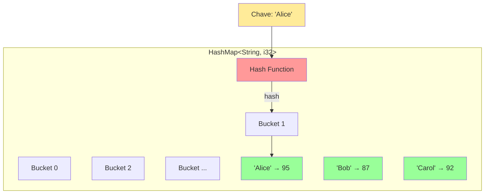
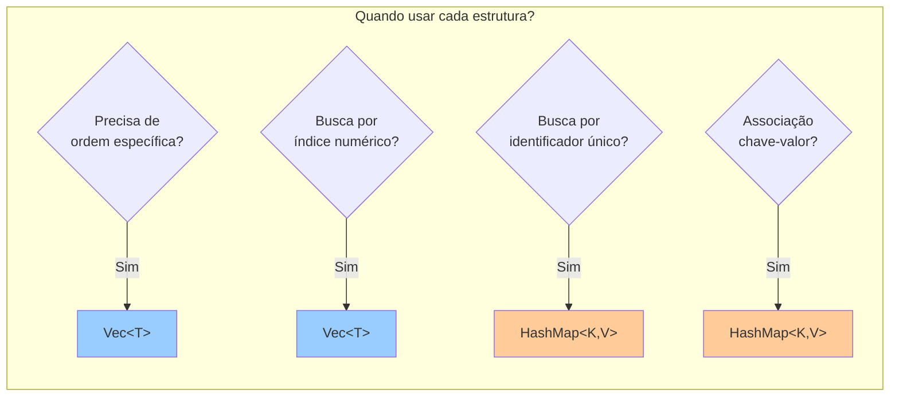
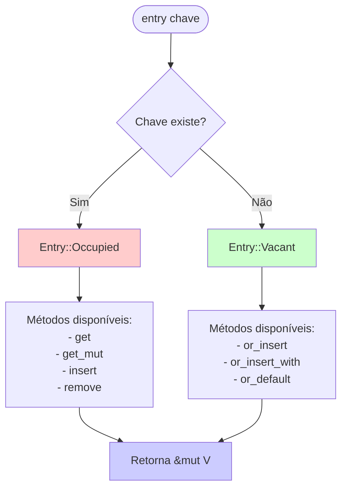
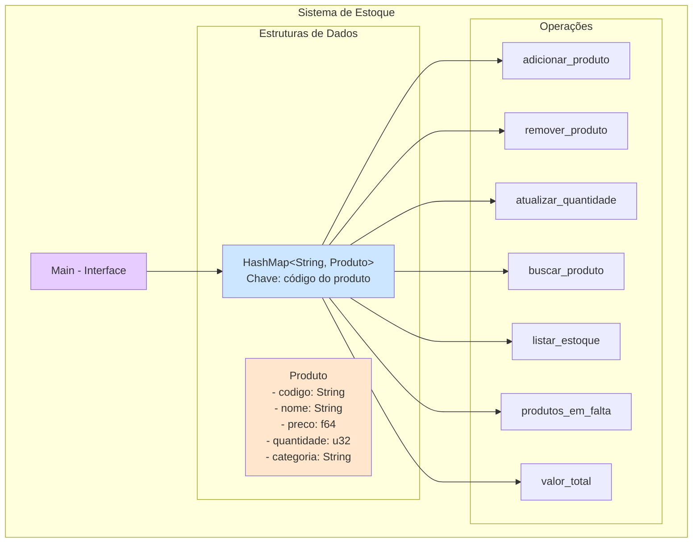

# 📘 Dia 9: HashMap<K, V> em Rust

## 📋 OBJETIVOS DE APRENDIZAGEM

Ao final desta lição, você será capaz de:

✅ **Compreender** o conceito de estruturas de dados baseadas em chave-valor  
✅ **Criar e manipular** HashMaps para armazenar dados associativos  
✅ **Aplicar** operações fundamentais: inserção, busca, remoção e verificação  
✅ **Utilizar** a Entry API para atualizações eficientes e idiomáticas  
✅ **Iterar** sobre chaves, valores e pares de um HashMap  
✅ **Decidir** quando usar HashMap ao invés de Vec  
✅ **Implementar** soluções práticas com HashMaps em contextos reais

---

## 🎭 ATIVAÇÃO DO CONHECIMENTO PRÉVIO

### Revisão: O que você já sabe sobre Vec

Você já estudou **Vec<T>**, uma coleção que armazena elementos em **sequência ordenada**. Para acessar um elemento, você usa um **índice numérico**:

```rust {.line-numbers}
let numeros = vec![10, 20, 30];
let segundo = numeros[1]; // 20
```

**Limitação**: E se você quiser buscar informações usando algo mais significativo que um número? Por exemplo, buscar o preço de um produto pelo seu nome?

---

### 🔑 Analogia: O Dicionário Inteligente

Imagine um **dicionário físico**:
- Você não procura palavras pela "página 47" ou "posição 235"
- Você busca diretamente pela **palavra** (chave)
- E encontra rapidamente a **definição** (valor)

**HashMap funciona exatamente assim!**

É uma estrutura que associa **chaves únicas** a **valores**, permitindo busca extremamente rápida (O(1) em média).

---

### 📖 História: O Problema do Estoque Desorganizado

*Maria gerencia uma loja de eletrônicos. Ela mantém o estoque em uma lista numerada:*

```
Posição 0: Mouse
Posição 1: Teclado
Posição 2: Monitor
...
```

*Quando um cliente pergunta: "Tem o Mouse Gamer X disponível?", Maria precisa **percorrer toda a lista** até encontrar.*

*Depois de implementar um sistema com HashMap, ela pode buscar instantaneamente:*

```rust {.line-numbers}
estoque.get("MOUSE-001") // Acesso direto!
```

**HashMap transforma buscas lentas em acessos instantâneos.**

---

## 📚 APRESENTAÇÃO DO CONTEÚDO

### Diagrama 1: Estrutura Conceitual do HashMap



**Como funciona:**
1. A **chave** passa por uma função hash
2. O hash determina em qual **bucket** armazenar
3. Busca rápida: hash da chave → bucket → valor

---

### Diagrama 2: Comparação Vec vs HashMap



---

### 📊 Tabela de Métodos Principais

| Método           | Assinatura         | Descrição                       | Retorno                      |
| ---------------- | ------------------ | ------------------------------- | ---------------------------- |
| `new()`          | `HashMap::new()`   | Cria HashMap vazio              | `HashMap<K, V>`              |
| `insert()`       | `insert(k, v)`     | Insere/atualiza par chave-valor | `Option<V>` (valor anterior) |
| `get()`          | `get(&k)`          | Busca valor por chave           | `Option<&V>`                 |
| `remove()`       | `remove(&k)`       | Remove par pela chave           | `Option<V>`                  |
| `contains_key()` | `contains_key(&k)` | Verifica se chave existe        | `bool`                       |
| `entry()`        | `entry(k)`         | Acessa entrada (Entry API)      | `Entry<K, V>`                |
| `keys()`         | `keys()`           | Iterador sobre chaves           | `Keys<K, V>`                 |
| `values()`       | `values()`         | Iterador sobre valores          | `Values<K, V>`               |
| `iter()`         | `iter()`           | Iterador sobre pares            | `Iter<K, V>`                 |
| `len()`          | `len()`            | Número de elementos             | `usize`                      |
| `is_empty()`     | `is_empty()`       | Verifica se está vazio          | `bool`                       |

---

### 1️⃣ Criação de HashMap

Para usar HashMap, você precisa importá-lo:

```rust {.line-numbers}
use std::collections::HashMap;

fn main() {
    // Criação de um HashMap vazio
    let mut pontuacoes: HashMap<String, i32> = HashMap::new();
    
    // Inserindo dados
    pontuacoes.insert(String::from("Alice"), 95);
    pontuacoes.insert(String::from("Bob"), 87);
    pontuacoes.insert(String::from("Carol"), 92);
    
    println!("{:?}", pontuacoes);
    // Saída: {"Alice": 95, "Bob": 87, "Carol": 92}
}
```

**Observações importantes:**
- HashMap **não está no prelude** (diferente de Vec), então precisa ser importado
- Você deve especificar os tipos `<K, V>` ou deixar Rust inferir
- HashMap precisa ser **mutável** (`mut`) para inserir dados

---

### 2️⃣ Operações Fundamentais

#### **insert() - Inserção e Atualização**

```rust {.line-numbers}
use std::collections::HashMap;

fn main() {
    let mut estoque = HashMap::new();
    
    // Primeira inserção
    estoque.insert("MOUSE-001", 50);
    
    // Atualização (mesma chave)
    let valor_antigo = estoque.insert("MOUSE-001", 45);
    
    println!("Valor anterior: {:?}", valor_antigo); // Some(50)
    println!("Valor atual: {:?}", estoque.get("MOUSE-001")); // Some(45)
}
```

**Comportamento:** `insert()` retorna `Option<V>`:
- `None` se a chave não existia
- `Some(valor_antigo)` se a chave já existia (e foi substituída)

---

#### **get() - Busca Segura**

```rust {.line-numbers}
use std::collections::HashMap;

fn main() {
    let mut precos = HashMap::new();
    precos.insert("Café", 5.50);
    precos.insert("Pão", 3.00);
    
    // Busca que encontra
    match precos.get("Café") {
        Some(&preco) => println!("Café custa: R$ {}", preco),
        None => println!("Produto não encontrado"),
    }
    
    // Busca que não encontra
    match precos.get("Leite") {
        Some(&preco) => println!("Leite custa: R$ {}", preco),
        None => println!("Produto não encontrado"),
    }
    
    // Usando unwrap_or para valor padrão
    let preco_suco = precos.get("Suco").unwrap_or(&0.0);
    println!("Suco: R$ {}", preco_suco); // 0.0
}
```

**⚠️ IMPORTANTE:** `get()` retorna `Option<&V>` (referência), não `Option<V>`:
- Retorna **referência** ao valor (não move ownership)
- Sempre use `&` no pattern matching: `Some(&valor)`

---

#### **remove() - Remoção**

```rust {.line-numbers}
use std::collections::HashMap;

fn main() {
    let mut inventario = HashMap::new();
    inventario.insert("Espada", 1);
    inventario.insert("Poção", 5);
    
    // Remove e retorna o valor
    let item_removido = inventario.remove("Poção");
    println!("Removido: {:?}", item_removido); // Some(5)
    
    // Tentativa de remover item inexistente
    let nao_existe = inventario.remove("Escudo");
    println!("Não existe: {:?}", nao_existe); // None
    
    println!("Inventário: {:?}", inventario); // {"Espada": 1}
}
```

---

#### **contains_key() - Verificação**

```rust {.line-numbers}
use std::collections::HashMap;

fn main() {
    let mut usuarios = HashMap::new();
    usuarios.insert("admin", "senha123");
    usuarios.insert("user1", "abc456");
    
    if usuarios.contains_key("admin") {
        println!("Usuário admin existe!");
    }
    
    if !usuarios.contains_key("guest") {
        println!("Usuário guest não encontrado");
    }
}
```

---

### 3️⃣ Entry API - A Forma Idiomática

A **Entry API** é o padrão idiomático em Rust para trabalhar com entradas de HashMap, especialmente para **atualizar valores condicionalmente**.

### Diagrama 3: Fluxograma Entry API



---

#### **or_insert() - Inserir se não existir**

```rust {.line-numbers}
use std::collections::HashMap;

fn main() {
    let mut pontos = HashMap::new();
    
    // Insere 10 se "Jogador1" não existir
    pontos.entry("Jogador1").or_insert(10);
    pontos.entry("Jogador1").or_insert(20); // Não faz nada (já existe)
    
    println!("{:?}", pontos); // {"Jogador1": 10}
}
```

---

#### **or_insert_with() - Inserir com função**

```rust {.line-numbers}
use std::collections::HashMap;

fn main() {
    let mut cache = HashMap::new();
    
    // Calcula valor apenas se necessário (lazy evaluation)
    let valor = cache.entry("resultado").or_insert_with(|| {
        println!("Calculando valor pesado...");
        42 * 42
    });
    
    println!("Valor: {}", valor); // 1764
    
    // Segunda chamada não executa a função
    let valor2 = cache.entry("resultado").or_insert_with(|| {
        println!("Isso não será impresso");
        0
    });
    
    println!("Valor2: {}", valor2); // 1764
}
```

**Vantagem:** Evita computação desnecessária quando a chave já existe.

---

#### **Padrão: Contador de Frequência**

```rust {.line-numbers}
use std::collections::HashMap;

fn main() {
    let texto = "o rato roeu a roupa do rei de roma";
    let mut contador = HashMap::new();
    
    for palavra in texto.split_whitespace() {
        // Incrementa contador (insere 0 se não existir)
        let count = contador.entry(palavra).or_insert(0);
        *count += 1;
    }
    
    println!("{:#?}", contador);
    /*
    {
        "o": 1,
        "rato": 1,
        "roeu": 1,
        "a": 1,
        "roupa": 1,
        "do": 1,
        "rei": 1,
        "de": 1,
        "roma": 1,
    }
    */
}
```

**Explicação:**
1. `entry(palavra)` obtém a entrada
2. `or_insert(0)` retorna `&mut i32` (referência mutável)
3. `*count += 1` desreferencia e incrementa

---

### 4️⃣ Iteração sobre HashMap

#### **Iterar sobre pares (chave, valor)**

```rust {.line-numbers}
use std::collections::HashMap;

fn main() {
    let mut notas = HashMap::new();
    notas.insert("Alice", 95);
    notas.insert("Bob", 87);
    notas.insert("Carol", 92);
    
    // Iteração sobre referências
    for (nome, nota) in &notas {
        println!("{}: {}", nome, nota);
    }
}
```

---

#### **Iterar apenas sobre chaves**

```rust {.line-numbers}
use std::collections::HashMap;

fn main() {
    let mut capitais = HashMap::new();
    capitais.insert("Brasil", "Brasília");
    capitais.insert("Argentina", "Buenos Aires");
    
    println!("Países:");
    for pais in capitais.keys() {
        println!("- {}", pais);
    }
}
```

---

#### **Iterar apenas sobre valores**

```rust {.line-numbers}
use std::collections::HashMap;

fn main() {
    let mut salarios = HashMap::new();
    salarios.insert("João", 5000);
    salarios.insert("Maria", 6500);
    salarios.insert("Pedro", 4800);
    
    let total: i32 = salarios.values().sum();
    println!("Folha de pagamento total: R$ {}", total);
}
```

---

#### **Iteração mutável**

```rust {.line-numbers}
use std::collections::HashMap;

fn main() {
    let mut precos = HashMap::new();
    precos.insert("Produto A", 100.0);
    precos.insert("Produto B", 200.0);
    
    // Aplicar desconto de 10%
    for preco in precos.values_mut() {
        *preco *= 0.9;
    }
    
    println!("{:?}", precos);
    // {"Produto A": 90.0, "Produto B": 180.0}
}
```

---

### 5️⃣ HashMap com Tipos Complexos

```rust {.line-numbers}
use std::collections::HashMap;

#[derive(Debug)]
struct Produto {
    nome: String,
    preco: f64,
    quantidade: u32,
}

fn main() {
    let mut estoque: HashMap<String, Produto> = HashMap::new();
    
    estoque.insert(
        String::from("MOUSE-001"),
        Produto {
            nome: String::from("Mouse Gamer"),
            preco: 150.0,
            quantidade: 25,
        },
    );
    
    estoque.insert(
        String::from("TECLADO-001"),
        Produto {
            nome: String::from("Teclado Mecânico"),
            preco: 350.0,
            quantidade: 10,
        },
    );
    
    // Buscar produto
    if let Some(produto) = estoque.get("MOUSE-001") {
        println!("Produto: {}", produto.nome);
        println!("Preço: R$ {:.2}", produto.preco);
        println!("Estoque: {} unidades", produto.quantidade);
    }
}
```

---

## 💡 DEMONSTRAÇÃO E MODELAGEM

### Padrões Comuns de Uso

#### **Padrão 1: Agregação de Dados**

```rust {.line-numbers}
use std::collections::HashMap;

fn main() {
    let vendas = vec![
        ("Janeiro", 1000),
        ("Fevereiro", 1500),
        ("Janeiro", 800),
        ("Março", 2000),
        ("Fevereiro", 1200),
    ];
    
    let mut vendas_por_mes = HashMap::new();
    
    for (mes, valor) in vendas {
        let total = vendas_por_mes.entry(mes).or_insert(0);
        *total += valor;
    }
    
    println!("{:#?}", vendas_por_mes);
    /*
    {
        "Janeiro": 1800,
        "Fevereiro": 2700,
        "Março": 2000,
    }
    */
}
```

---

#### **Padrão 2: Agrupamento**

```rust {.line-numbers}
use std::collections::HashMap;

fn main() {
    let alunos = vec![
        ("Alice", "Matemática"),
        ("Bob", "História"),
        ("Carol", "Matemática"),
        ("David", "História"),
        ("Eve", "Matemática"),
    ];
    
    let mut por_disciplina: HashMap<&str, Vec<&str>> = HashMap::new();
    
    for (aluno, disciplina) in alunos {
        por_disciplina.entry(disciplina).or_insert(Vec::new()).push(aluno);
    }
    
    println!("{:#?}", por_disciplina);
    /*
    {
        "Matemática": ["Alice", "Carol", "Eve"],
        "História": ["Bob", "David"],
    }
    */
}
```

---

#### **Padrão 3: Cache/Memoização**

```rust {.line-numbers}
use std::collections::HashMap;

fn fibonacci_memo(n: u32, cache: &mut HashMap<u32, u64>) -> u64 {
    if n <= 1 {
        return n as u64;
    }
    
    // Verifica se já está no cache
    if let Some(&resultado) = cache.get(&n) {
        return resultado;
    }
    
    // Calcula e armazena no cache
    let resultado = fibonacci_memo(n - 1, cache) + fibonacci_memo(n - 2, cache);
    cache.insert(n, resultado);
    resultado
}

fn main() {
    let mut cache = HashMap::new();
    
    for i in 0..10 {
        println!("fib({}) = {}", i, fibonacci_memo(i, &mut cache));
    }
}
```

---

## 🎯 PRÁTICA GUIADA: Sistema de Gerenciamento de Estoque

### Diagrama 4: Arquitetura do Sistema



---

### 📦 Exercício Completo: Sistema de Estoque

**Contexto:** Você foi contratado para desenvolver um sistema de gerenciamento de estoque para uma loja de eletrônicos. O sistema deve permitir:

1. ✅ Adicionar produtos com código único
2. ✅ Remover produtos
3. ✅ Atualizar quantidade em estoque
4. ✅ Buscar produto por código
5. ✅ Listar todo o estoque
6. ✅ Identificar produtos em falta (quantidade < 5)
7. ✅ Calcular valor total do estoque

---

### 💻 Solução Completa

```rust {.line-numbers}
use std::collections::HashMap;

// Estrutura que representa um produto
#[derive(Debug, Clone)]
struct Produto {
    codigo: String,
    nome: String,
    preco: f64,
    quantidade: u32,
    categoria: String,
}

impl Produto {
    fn new(codigo: String, nome: String, preco: f64, quantidade: u32, categoria: String) -> Self {
        Produto {
            codigo,
            nome,
            preco,
            quantidade,
            categoria,
        }
    }
    
    fn valor_total(&self) -> f64 {
        self.preco * self.quantidade as f64
    }
}

// Sistema de gerenciamento de estoque
struct SistemaEstoque {
    produtos: HashMap<String, Produto>,
}

impl SistemaEstoque {
    fn new() -> Self {
        SistemaEstoque {
            produtos: HashMap::new(),
        }
    }
    
    // 1. Adicionar produto
    fn adicionar_produto(&mut self, produto: Produto) -> Result<(), String> {
        if self.produtos.contains_key(&produto.codigo) {
            return Err(format!("Produto com código {} já existe!", produto.codigo));
        }
        
        self.produtos.insert(produto.codigo.clone(), produto);
        Ok(())
    }
    
    // 2. Remover produto
    fn remover_produto(&mut self, codigo: &str) -> Result<Produto, String> {
        self.produtos
            .remove(codigo)
            .ok_or_else(|| format!("Produto {} não encontrado", codigo))
    }
    
    // 3. Atualizar quantidade (usando Entry API)
    fn atualizar_quantidade(&mut self, codigo: &str, quantidade: i32) -> Result<(), String> {
        let produto = self.produtos
            .get_mut(codigo)
            .ok_or_else(|| format!("Produto {} não encontrado", codigo))?;
        
        let nova_quantidade = produto.quantidade as i32 + quantidade;
        
        if nova_quantidade < 0 {
            return Err(String::from("Quantidade não pode ser negativa"));
        }
        
        produto.quantidade = nova_quantidade as u32;
        Ok(())
    }
    
    // 4. Buscar produto
    fn buscar_produto(&self, codigo: &str) -> Option<&Produto> {
        self.produtos.get(codigo)
    }
    
    // 5. Listar todo o estoque
    fn listar_estoque(&self) {
        if self.produtos.is_empty() {
            println!("Estoque vazio!");
            return;
        }
        
        println!("\n{'=':<70}");
        println!("ESTOQUE COMPLETO");
        println!("{'=':<70}");
        println!("{:<12} {:<25} {:<12} {:<8} {:<15}", 
                 "CÓDIGO", "NOME", "PREÇO", "QTD", "CATEGORIA");
        println!("{'-':<70}");
        
        for produto in self.produtos.values() {
            println!("{:<12} {:<25} R$ {:>8.2} {:>8} {:<15}",
                     produto.codigo,
                     produto.nome,
                     produto.preco,
                     produto.quantidade,
                     produto.categoria);
        }
        println!("{'=':<70}\n");
    }
    
    // 6. Produtos em falta (quantidade < 5)
    fn produtos_em_falta(&self) -> Vec<&Produto> {
        self.produtos
            .values()
            .filter(|p| p.quantidade < 5)
            .collect()
    }
    
    // 7. Valor total do estoque
    fn valor_total(&self) -> f64 {
        self.produtos
            .values()
            .map(|p| p.valor_total())
            .sum()
    }
    
    // Função auxiliar: listar por categoria
    fn listar_por_categoria(&self, categoria: &str) {
        let produtos: Vec<_> = self.produtos
            .values()
            .filter(|p| p.categoria == categoria)
            .collect();
        
        if produtos.is_empty() {
            println!("Nenhum produto na categoria '{}'", categoria);
            return;
        }
        
        println!("\nProdutos na categoria '{}':", categoria);
        for produto in produtos {
            println!("  - {} ({}): {} unidades", 
                     produto.nome, produto.codigo, produto.quantidade);
        }
    }
}

fn main() {
    let mut estoque = SistemaEstoque::new();
    
    // Adicionando produtos
    println!("=== ADICIONANDO PRODUTOS ===\n");
    
    let produtos = vec![
        Produto::new(
            String::from("MOUSE-001"),
            String::from("Mouse Gamer RGB"),
            150.00,
            25,
            String::from("Periféricos"),
        ),
        Produto::new(
            String::from("TECLADO-001"),
            String::from("Teclado Mecânico"),
            350.00,
            10,
            String::from("Periféricos"),
        ),
        Produto::new(
            String::from("MONITOR-001"),
            String::from("Monitor 27\" 144Hz"),
            1200.00,
            3,
            String::from("Monitores"),
        ),
        Produto::new(
            String::from("HEADSET-001"),
            String::from("Headset 7.1"),
            280.00,
            15,
            String::from("Áudio"),
        ),
        Produto::new(
            String::from("WEBCAM-001"),
            String::from("Webcam Full HD"),
            320.00,
            2,
            String::from("Vídeo"),
        ),
    ];
    
    for produto in produtos {
        match estoque.adicionar_produto(produto) {
            Ok(_) => println!("✓ Produto adicionado com sucesso"),
            Err(e) => println!("✗ Erro: {}", e),
        }
    }
    
    // Listar estoque completo
    estoque.listar_estoque();
    
    // Buscar produto específico
    println!("=== BUSCAR PRODUTO ===\n");
    match estoque.buscar_produto("MOUSE-001") {
        Some(produto) => {
            println!("Produto encontrado:");
            println!("  Nome: {}", produto.nome);
            println!("  Preço: R$ {:.2}", produto.preco);
            println!("  Quantidade: {}", produto.quantidade);
            println!("  Valor total: R$ {:.2}", produto.valor_total());
        }
        None => println!("Produto não encontrado"),
    }
    
    // Atualizar quantidade
    println!("\n=== ATUALIZAR QUANTIDADE ===\n");
    match estoque.atualizar_quantidade("MOUSE-001", -5) {
        Ok(_) => println!("✓ Quantidade atualizada (vendeu 5 unidades)"),
        Err(e) => println!("✗ Erro: {}", e),
    }
    
    match estoque.atualizar_quantidade("MONITOR-001", 10) {
        Ok(_) => println!("✓ Quantidade atualizada (recebeu 10 unidades)"),
        Err(e) => println!("✗ Erro: {}", e),
    }
    
    // Produtos em falta
    println!("\n=== PRODUTOS EM FALTA (< 5 unidades) ===\n");
    let em_falta = estoque.produtos_em_falta();
    
    if em_falta.is_empty() {
        println!("Nenhum produto em falta!");
    } else {
        println!("⚠️  ATENÇÃO: {} produto(s) com estoque baixo:\n", em_falta.len());
        for produto in em_falta {
            println!("  - {} ({}): {} unidades restantes",
                     produto.nome, produto.codigo, produto.quantidade);
        }
    }
    
    // Valor total do estoque
    println!("\n=== VALOR TOTAL DO ESTOQUE ===\n");
    println!("Valor total em estoque: R$ {:.2}", estoque.valor_total());
    
    // Listar por categoria
    println!("\n=== PRODUTOS POR CATEGORIA ===");
    estoque.listar_por_categoria("Periféricos");
    estoque.listar_por_categoria("Monitores");
    
    // Remover produto
    println!("\n=== REMOVER PRODUTO ===\n");
    match estoque.remover_produto("WEBCAM-001") {
        Ok(produto) => println!("✓ Produto '{}' removido com sucesso", produto.nome),
        Err(e) => println!("✗ Erro: {}", e),
    }
    
    // Listar estoque final
    println!("\n=== ESTOQUE FINAL ===");
    estoque.listar_estoque();
}
```

---

### 📊 Saída Esperada

```
=== ADICIONANDO PRODUTOS ===

✓ Produto adicionado com sucesso
✓ Produto adicionado com sucesso
✓ Produto adicionado com sucesso
✓ Produto adicionado com sucesso
✓ Produto adicionado com sucesso

======================================================================
ESTOQUE COMPLETO
======================================================================
CÓDIGO       NOME                      PREÇO        QTD      CATEGORIA      
----------------------------------------------------------------------
MOUSE-001    Mouse Gamer RGB           R$   150.00       25 Periféricos    
TECLADO-001  Teclado Mecânico          R$   350.00       10 Periféricos    
MONITOR-001  Monitor 27" 144Hz         R$  1200.00        3 Monitores       
HEADSET-001  Headset 7.1               R$   280.00       15 Áudio           
WEBCAM-001   Webcam Full HD            R$   320.00        2 Vídeo           
======================================================================

=== BUSCAR PRODUTO ===

Produto encontrado:
  Nome: Mouse Gamer RGB
  Preço: R$ 150.00
  Quantidade: 25
  Valor total: R$ 3750.00

=== ATUALIZAR QUANTIDADE ===

✓ Quantidade atualizada (vendeu 5 unidades)
✓ Quantidade atualizada (recebeu 10 unidades)

=== PRODUTOS EM FALTA (< 5 unidades) ===

⚠️  ATENÇÃO: 1 produto(s) com estoque baixo:

  - Webcam Full HD (WEBCAM-001): 2 unidades restantes

=== VALOR TOTAL DO ESTOQUE ===

Valor total em estoque: R$ 23840.00

=== PRODUTOS POR CATEGORIA ===

Produtos na categoria 'Periféricos':
  - Mouse Gamer RGB (MOUSE-001): 20 unidades
  - Teclado Mecânico (TECLADO-001): 10 unidades

Produtos na categoria 'Monitores':
  - Monitor 27" 144Hz (MONITOR-001): 13 unidades

=== REMOVER PRODUTO ===

✓ Produto 'Webcam Full HD' removido com sucesso

=== ESTOQUE FINAL ===

======================================================================
ESTOQUE COMPLETO
======================================================================
CÓDIGO       NOME                      PREÇO        QTD      CATEGORIA      
----------------------------------------------------------------------
MOUSE-001    Mouse Gamer RGB           R$   150.00       20 Periféricos    
TECLADO-001  Teclado Mecânico          R$   350.00       10 Periféricos    
MONITOR-001  Monitor 27" 144Hz         R$  1200.00       13 Monitores       
HEADSET-001  Headset 7.1               R$   280.00       15 Áudio           
======================================================================
```

---

### 🎓 Conceitos Aplicados no Exercício

| Conceito           | Onde foi usado                            |
| ------------------ | ----------------------------------------- |
| **HashMap::new()** | Criação do estoque                        |
| **insert()**       | Adicionar produtos                        |
| **get()**          | Buscar produto por código                 |
| **get_mut()**      | Atualizar quantidade                      |
| **remove()**       | Remover produto                           |
| **contains_key()** | Verificar duplicatas                      |
| **values()**       | Listar todos os produtos                  |
| **filter()**       | Produtos em falta                         |
| **map() + sum()**  | Valor total do estoque                    |
| **Entry API**      | Poderia ser usado em atualizar_quantidade |

---

### 🚀 Extensões Sugeridas

1. **Sistema de Categorias Avançado**
   - Criar HashMap de categorias
   - Cada categoria tem lista de códigos de produtos

2. **Alertas Automáticos**
   - Notificar quando produto atingir estoque mínimo
   - Histórico de alertas

3. **Relatórios**
   - Produtos mais vendidos
   - Categoria com maior valor em estoque
   - Produtos sem movimentação

4. **Persistência**
   - Salvar estoque em arquivo
   - Carregar estoque de arquivo

---

## 🔄 FEEDBACK E AVALIAÇÃO

### ✅ Checklist de Operações

Marque o que você já domina:

- [ ] Criar HashMap vazio com `HashMap::new()`
- [ ] Importar HashMap com `use std::collections::HashMap`
- [ ] Inserir pares chave-valor com `insert()`
- [ ] Buscar valores com `get()` e tratar `Option`
- [ ] Remover elementos com `remove()`
- [ ] Verificar existência com `contains_key()`
- [ ] Usar `entry().or_insert()` para inserção condicional
- [ ] Usar `entry().or_insert_with()` para lazy evaluation
- [ ] Iterar sobre pares com `iter()`
- [ ] Iterar sobre chaves com `keys()`
- [ ] Iterar sobre valores com `values()`
- [ ] Modificar valores com `values_mut()`
- [ ] Trabalhar com HashMap de structs

---

### ⚠️ Erros Comuns

#### **1. Esquecer de importar HashMap**

```rust {.line-numbers}
// ❌ ERRO
fn main() {
    let mut map = HashMap::new(); // HashMap não encontrado
}

// ✅ CORRETO
use std::collections::HashMap;

fn main() {
    let mut map = HashMap::new();
}
```

---

#### **2. Não tratar Option em get()**

```rust {.line-numbers}
// ❌ ERRO (pode causar panic)
let valor = *map.get("chave").unwrap();

// ✅ CORRETO
match map.get("chave") {
    Some(&valor) => println!("Valor: {}", valor),
    None => println!("Chave não encontrada"),
}

// ✅ OU usar unwrap_or
let valor = map.get("chave").unwrap_or(&0);
```

---

#### **3. Confundir & no pattern matching**

```rust {.line-numbers}
// ❌ ERRO
match map.get("chave") {
    Some(valor) => println!("{}", valor), // valor é &i32, não i32
    None => println!("Não encontrado"),
}

// ✅ CORRETO
match map.get("chave") {
    Some(&valor) => println!("{}", valor), // desreferencia
    None => println!("Não encontrado"),
}
```

---

#### **4. Não usar Entry API quando apropriado**

```rust {.line-numbers}
// ❌ MENOS IDIOMÁTICO
if !map.contains_key("chave") {
    map.insert("chave", 0);
}
let valor = map.get_mut("chave").unwrap();
*valor += 1;

// ✅ IDIOMÁTICO
let valor = map.entry("chave").or_insert(0);
*valor += 1;
```

---

### 📝 Quiz: Entry API

**Pergunta 1:** O que `entry().or_insert(10)` retorna?

a) `Option<&mut V>`  
b) `&mut V`  
c) `V`  
d) `Option<V>`

<details>
<summary>Resposta</summary>
<b>b) &mut V</b> - Retorna uma referência mutável ao valor (existente ou recém-inserido)
</details>

---

**Pergunta 2:** Qual a diferença entre `or_insert()` e `or_insert_with()`?

<details>
<summary>Resposta</summary>
<b>or_insert_with()</b> recebe uma closure que só é executada se a chave não existir (lazy evaluation), evitando computação desnecessária.
</details>

---

**Pergunta 3:** Complete o código para contar palavras:

```rust {.line-numbers}
let mut contador = HashMap::new();
for palavra in texto.split_whitespace() {
    // Complete aqui
}
```

<details>
<summary>Resposta</summary>

```rust {.line-numbers}
let count = contador.entry(palavra).or_insert(0);
*count += 1;
```
</details>

---

### 🎯 Auto-Avaliação

**Nível 1 - Iniciante:** Consigo criar HashMap, inserir e buscar valores  
**Nível 2 - Intermediário:** Uso Entry API e itero sobre coleções  
**Nível 3 - Avançado:** Implemento sistemas complexos com HashMap  

**Onde você se encaixa?**

---

## 🚀 TRANSFERÊNCIA E APLICAÇÃO

### 🏆 Desafio: Contador de Palavras Avançado

Crie um programa que:

1. Leia um texto
2. Conte a frequência de cada palavra (case-insensitive)
3. Ignore pontuação
4. Mostre as 5 palavras mais frequentes
5. Calcule o total de palavras únicas

**Dicas:**
- Use `to_lowercase()` para normalizar
- Use `chars().filter()` para remover pontuação
- Use `Vec` + `sort_by()` para ordenar por frequência

---

### 📚 Preparação para o Dia 10

No próximo dia, você aprenderá sobre:

- **Tratamento de Erros** com `Result<T, E>`
- Propagação de erros com `?`
- Criação de erros customizados
- Padrões de error handling

**Conexão com HashMap:** Você já viu `Result` sendo usado nas funções do sistema de estoque!

---

### 🔗 Recursos Extras

**Documentação Oficial:**
- [std::collections::HashMap](https://doc.rust-lang.org/std/collections/struct.HashMap.html)
- [Entry API](https://doc.rust-lang.org/std/collections/hash_map/enum.Entry.html)

**Leitura Complementar:**
- The Rust Book - Chapter 8.3: Storing Keys with Associated Values in Hash Maps
- Rust by Example - HashMap

**Exercícios Práticos:**
- Implementar cache de Fibonacci
- Sistema de votação
- Índice invertido para busca de texto

---

## 📌 RESUMO FINAL

### Conceitos-Chave

✅ **HashMap** armazena pares chave-valor com busca O(1)  
✅ **get()** retorna `Option<&V>` - sempre trate o Option  
✅ **Entry API** é a forma idiomática de atualizar valores  
✅ **or_insert()** insere apenas se a chave não existir  
✅ Use HashMap quando precisar buscar por identificadores únicos  
✅ Use Vec quando precisar ordem ou acesso por índice  

---

### Quando Usar HashMap vs Vec

| Critério                | Vec              | HashMap          |
| ----------------------- | ---------------- | ---------------- |
| **Busca por índice**    | ✅ O(1)           | ❌ Não aplicável  |
| **Busca por valor**     | ❌ O(n)           | ✅ O(1) com chave |
| **Ordem garantida**     | ✅ Sim            | ❌ Não            |
| **Chave personalizada** | ❌ Apenas índices | ✅ Qualquer tipo  |
| **Memória**             | Mais eficiente   | Overhead de hash |

---

### Código de Referência Rápida

```rust {.line-numbers}
use std::collections::HashMap;

// Criar
let mut map = HashMap::new();

// Inserir
map.insert("chave", 42);

// Buscar
if let Some(&valor) = map.get("chave") {
    println!("{}", valor);
}

// Entry API
let count = map.entry("palavra").or_insert(0);
*count += 1;

// Iterar
for (k, v) in &map {
    println!("{}: {}", k, v);
}
```

---

## 🎉 Parabéns!

Você completou o **Dia 9: HashMap<K, V>**!

Agora você domina uma das estruturas de dados mais poderosas e utilizadas em Rust. HashMap é fundamental para resolver problemas reais de forma eficiente.

**Próximo passo:** Pratique o desafio do contador de palavras e prepare-se para aprender sobre tratamento de erros!

---

**Continue praticando e explorando! 🦀**
