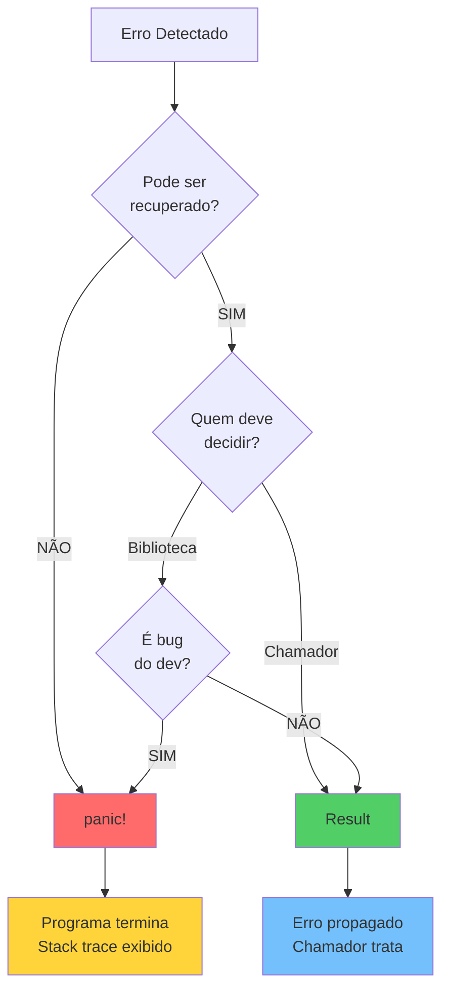
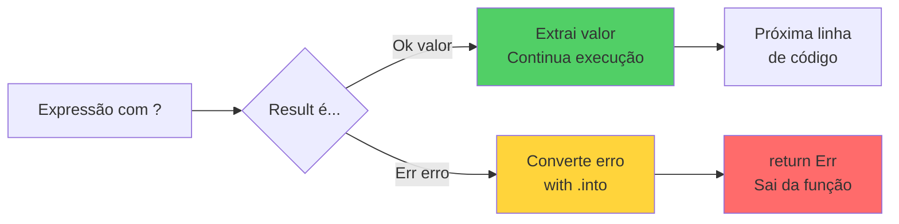
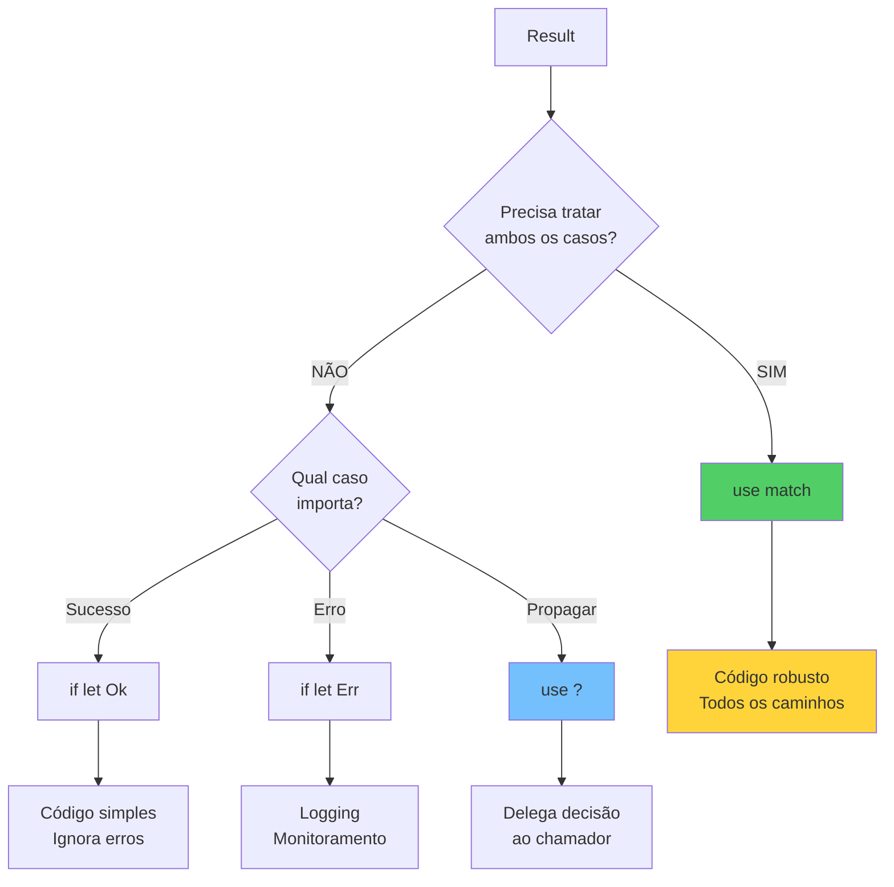
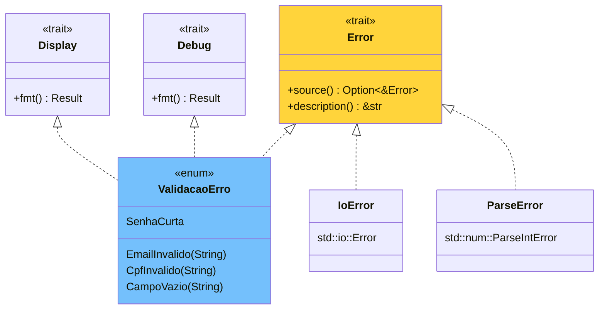
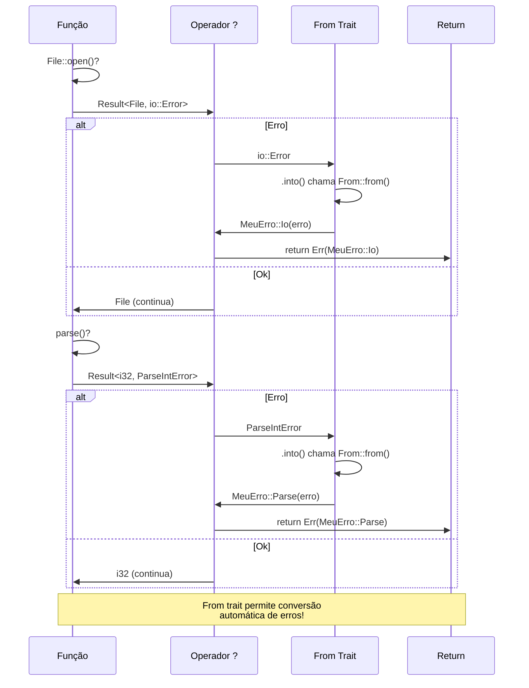

# 🦀 Dia 10: Error Handling em Rust

## 📋 OBJETIVOS DE APRENDIZAGEM

Ao final desta lição, você será capaz de:

✅ **Distinguir** entre erros recuperáveis (Result) e irrecuperáveis (panic!)  
✅ **Aplicar** o operador `?` para propagação elegante de erros  
✅ **Criar** tipos de erro customizados com mensagens informativas  
✅ **Implementar** tratamento de erros robusto em aplicações reais  
✅ **Escrever** código defensivo que falha graciosamente  
✅ **Converter** entre diferentes tipos de erro usando o trait `From`

---

## 🎭 ATIVAÇÃO DO CONHECIMENTO PRÉVIO

### Revisão Rápida: Result e Option

Você já conhece esses tipos fundamentais:

```rust {.line-numbers}
enum Option<T> {
    Some(T),
    None,
}

enum Result<T, E> {
    Ok(T),
    Err(E),
}
```

### 🏗️ Analogia: Sistema de Segurança em Edifícios

Imagine um edifício moderno com múltiplas camadas de segurança:

- **🚨 Alarme de Incêndio (panic!)**: Evacuação imediata, situação crítica
- **🚪 Portas de Emergência (Result)**: Saídas controladas, situação gerenciável
- **📋 Protocolos de Resposta (Error Types)**: Procedimentos específicos para cada situação
- **🔄 Sistema de Backup (Recovery)**: Planos alternativos quando algo falha

**Em Rust, erros são valores que fluem pelo código**, não exceções que "explodem" a pilha de execução!

### 📖 História Real: O Crash do Mars Climate Orbiter

Em 1999, a NASA perdeu uma sonda de $327 milhões porque um software usava **unidades imperiais** enquanto outro usava **métricas**. Um sistema robusto de validação de tipos e erros teria evitado esse desastre. Rust nos força a pensar em erros desde o design!

---

## 📚 APRESENTAÇÃO DO CONTEÚDO

### 1️⃣ panic! vs Result<T, E>

#### 🚨 panic! - Erros Irrecuperáveis

Use quando o programa **não pode continuar** de forma segura:

```rust {.line-numbers}
fn dividir_array(arr: &[i32], index: usize) -> i32 {
    if index >= arr.len() {
        panic!("Índice {} fora dos limites! Tamanho: {}", index, arr.len());
    }
    arr[index]
}

// Situações para panic!:
// - Bugs no código (invariantes violadas)
// - Estados impossíveis
// - Protótipos e testes
```

#### ✅ Result<T, E> - Erros Recuperáveis

Use quando o **chamador pode decidir** o que fazer:

```rust {.line-numbers}
use std::fs::File;
use std::io::Read;

fn ler_arquivo(caminho: &str) -> Result<String, std::io::Error> {
    let mut arquivo = File::open(caminho)?;
    let mut conteudo = String::new();
    arquivo.read_to_string(&mut conteudo)?;
    Ok(conteudo)
}

// Situações para Result:
// - Operações de I/O (arquivos, rede)
// - Parsing de dados
// - Validações de entrada do usuário
// - Qualquer operação que pode falhar previsivelmente
```

#### 📊 Diagrama: Árvore de Decisão



---

### 2️⃣ unwrap() e expect() - Quando Usar

#### ⚠️ unwrap() - "Confio que não vai falhar"

```rust {.line-numbers}
// ❌ EVITE em produção:
let arquivo = File::open("config.txt").unwrap(); // Panic se falhar!

// ✅ OK em:
// - Testes
let resultado = funcao_testada().unwrap();

// - Protótipos rápidos
// - Quando você SABE que não pode falhar
let numero: i32 = "42".parse().unwrap(); // String literal válida
```

#### 💬 expect() - "Se falhar, mostre ESTA mensagem"

```rust {.line-numbers}
// ✅ MELHOR que unwrap():
let arquivo = File::open("config.txt")
    .expect("ERRO CRÍTICO: config.txt não encontrado! Verifique a instalação.");

// Mensagem aparece no panic, facilitando debug
```

#### 📋 Tabela Comparativa

| Método | Quando Usar | Produção? | Mensagem de Erro |
|--------|-------------|-----------|------------------|
| `unwrap()` | Testes, protótipos | ❌ Não | Genérica |
| `expect()` | Casos "impossíveis" | ⚠️ Raramente | Customizada |
| `match` | Tratamento completo | ✅ Sim | Você controla |
| `if let` | Tratamento simples | ✅ Sim | Você controla |
| `?` | Propagação | ✅ Sim | Automática |

---

### 3️⃣ Operador ? - Propagação Elegante

#### 🎯 O Problema Sem o ?

```rust {.line-numbers}
use std::fs::File;
use std::io::{self, Read};

// Código verboso e repetitivo:
fn ler_usuario_v1(caminho: &str) -> Result<String, io::Error> {
    let mut arquivo = match File::open(caminho) {
        Ok(f) => f,
        Err(e) => return Err(e), // Propaga erro manualmente
    };
    
    let mut conteudo = String::new();
    match arquivo.read_to_string(&mut conteudo) {
        Ok(_) => Ok(conteudo),
        Err(e) => Err(e), // Propaga erro manualmente
    }
}
```

#### ✨ A Solução com ?

```rust {.line-numbers}
// Código limpo e idiomático:
fn ler_usuario_v2(caminho: &str) -> Result<String, io::Error> {
    let mut arquivo = File::open(caminho)?; // ? propaga automaticamente
    let mut conteudo = String::new();
    arquivo.read_to_string(&mut conteudo)?; // ? propaga automaticamente
    Ok(conteudo)
}

// Ainda mais conciso:
fn ler_usuario_v3(caminho: &str) -> Result<String, io::Error> {
    let mut conteudo = String::new();
    File::open(caminho)?.read_to_string(&mut conteudo)?;
    Ok(conteudo)
}
```

#### 🔄 Como o ? Funciona

```rust {.line-numbers}
// Este código:
let resultado = operacao_que_pode_falhar()?;

// É equivalente a:
let resultado = match operacao_que_pode_falhar() {
    Ok(valor) => valor,
    Err(erro) => return Err(erro.into()), // Nota o .into()!
};
```

#### 📊 Diagrama: Fluxo do Operador ?



#### ⚠️ Restrições do ?

```rust {.line-numbers}
// ❌ Só funciona em funções que retornam Result ou Option:
fn main() {
    let arquivo = File::open("test.txt")?; // ERRO DE COMPILAÇÃO!
    // main() retorna (), não Result
}

// ✅ Solução 1: main retornando Result
fn main() -> Result<(), Box<dyn std::error::Error>> {
    let arquivo = File::open("test.txt")?; // Funciona!
    Ok(())
}

// ✅ Solução 2: Tratar o erro
fn main() {
    let arquivo = match File::open("test.txt") {
        Ok(f) => f,
        Err(e) => {
            eprintln!("Erro ao abrir arquivo: {}", e);
            return;
        }
    };
}
```

---

### 4️⃣ match vs if let para Result

#### 🎯 match - Tratamento Completo

```rust {.line-numbers}
use std::fs::File;

fn abrir_com_fallback(caminho: &str) -> File {
    match File::open(caminho) {
        Ok(arquivo) => {
            println!("✅ Arquivo aberto com sucesso!");
            arquivo
        },
        Err(erro) => {
            eprintln!("⚠️ Erro ao abrir {}: {}", caminho, erro);
            eprintln!("📁 Criando arquivo padrão...");
            File::create(caminho).expect("Não foi possível criar arquivo")
        }
    }
}
```

#### 🎯 if let - Tratamento Parcial

```rust {.line-numbers}
use std::fs::File;

fn tentar_abrir(caminho: &str) {
    // Só me importo com o caso de sucesso:
    if let Ok(arquivo) = File::open(caminho) {
        println!("✅ Arquivo aberto!");
        // usar arquivo...
    }
    // Ignoro erros silenciosamente
}

// Ou só me importo com erros:
fn logar_erro(caminho: &str) {
    if let Err(e) = File::open(caminho) {
        eprintln!("❌ Falha ao abrir {}: {}", caminho, e);
    }
}
```

#### 📊 Diagrama: Comparação de Abordagens



---

### 5️⃣ Criar Tipos de Erro Customizados

#### 🎨 Enum de Erros - Abordagem Idiomática

```rust {.line-numbers}
use std::fmt;

// 1. Defina seu enum de erros
#[derive(Debug)]
enum ValidacaoErro {
    EmailInvalido(String),
    SenhaCurta { minimo: usize, atual: usize },
    CpfInvalido(String),
    CampoVazio(String),
}

// 2. Implemente Display para mensagens amigáveis
impl fmt::Display for ValidacaoErro {
    fn fmt(&self, f: &mut fmt::Formatter) -> fmt::Result {
        match self {
            ValidacaoErro::EmailInvalido(email) => {
                write!(f, "❌ Email inválido: '{}'. Deve conter '@' e domínio.", email)
            },
            ValidacaoErro::SenhaCurta { minimo, atual } => {
                write!(f, "❌ Senha muito curta: {} caracteres (mínimo: {})", atual, minimo)
            },
            ValidacaoErro::CpfInvalido(cpf) => {
                write!(f, "❌ CPF inválido: '{}'. Deve ter 11 dígitos.", cpf)
            },
            ValidacaoErro::CampoVazio(campo) => {
                write!(f, "❌ Campo obrigatório vazio: '{}'", campo)
            },
        }
    }
}

// 3. Implemente std::error::Error (opcional, mas recomendado)
impl std::error::Error for ValidacaoErro {}
```

#### 🏗️ Usando Erros Customizados

```rust {.line-numbers}
fn validar_email(email: &str) -> Result<(), ValidacaoErro> {
    if email.is_empty() {
        return Err(ValidacaoErro::CampoVazio("email".to_string()));
    }
    
    if !email.contains('@') {
        return Err(ValidacaoErro::EmailInvalido(email.to_string()));
    }
    
    Ok(())
}

fn validar_senha(senha: &str) -> Result<(), ValidacaoErro> {
    const MINIMO: usize = 8;
    
    if senha.is_empty() {
        return Err(ValidacaoErro::CampoVazio("senha".to_string()));
    }
    
    if senha.len() < MINIMO {
        return Err(ValidacaoErro::SenhaCurta {
            minimo: MINIMO,
            atual: senha.len(),
        });
    }
    
    Ok(())
}
```

#### 📊 Diagrama: Hierarquia de Erros



---

### 6️⃣ From Trait - Conversão Automática de Erros

#### 🔄 O Problema: Múltiplos Tipos de Erro

```rust {.line-numbers}
use std::fs::File;
use std::io::Read;

// Esta função pode ter DOIS tipos de erro diferentes:
fn ler_numero_do_arquivo(caminho: &str) -> Result<i32, ???> {
    let mut arquivo = File::open(caminho)?; // io::Error
    let mut conteudo = String::new();
    arquivo.read_to_string(&mut conteudo)?; // io::Error
    let numero: i32 = conteudo.trim().parse()?; // ParseIntError
    Ok(numero)
}
```

#### ✨ Solução 1: Box<dyn Error>

```rust {.line-numbers}
use std::error::Error;

// Aceita QUALQUER tipo de erro:
fn ler_numero_do_arquivo(caminho: &str) -> Result<i32, Box<dyn Error>> {
    let mut arquivo = File::open(caminho)?;
    let mut conteudo = String::new();
    arquivo.read_to_string(&mut conteudo)?;
    let numero: i32 = conteudo.trim().parse()?;
    Ok(numero)
}

// ✅ Vantagem: Simples, funciona com qualquer erro
// ❌ Desvantagem: Perde informação de tipo, não pode fazer match específico
```

#### ✨ Solução 2: Enum + From Trait

```rust {.line-numbers}
use std::fmt;
use std::io;
use std::num::ParseIntError;

// 1. Enum que engloba todos os erros possíveis
#[derive(Debug)]
enum MeuErro {
    Io(io::Error),
    Parse(ParseIntError),
}

// 2. Implemente Display
impl fmt::Display for MeuErro {
    fn fmt(&self, f: &mut fmt::Formatter) -> fmt::Result {
        match self {
            MeuErro::Io(e) => write!(f, "Erro de I/O: {}", e),
            MeuErro::Parse(e) => write!(f, "Erro de parsing: {}", e),
        }
    }
}

impl std::error::Error for MeuErro {}

// 3. Implemente From para conversão automática
impl From<io::Error> for MeuErro {
    fn from(erro: io::Error) -> Self {
        MeuErro::Io(erro)
    }
}

impl From<ParseIntError> for MeuErro {
    fn from(erro: ParseIntError) -> Self {
        MeuErro::Parse(erro)
    }
}

// 4. Agora o ? converte automaticamente!
fn ler_numero_do_arquivo(caminho: &str) -> Result<i32, MeuErro> {
    let mut arquivo = File::open(caminho)?; // io::Error -> MeuErro::Io
    let mut conteudo = String::new();
    arquivo.read_to_string(&mut conteudo)?; // io::Error -> MeuErro::Io
    let numero: i32 = conteudo.trim().parse()?; // ParseIntError -> MeuErro::Parse
    Ok(numero)
}

// 5. Chamador pode fazer match específico!
fn main() {
    match ler_numero_do_arquivo("numero.txt") {
        Ok(n) => println!("Número lido: {}", n),
        Err(MeuErro::Io(e)) => eprintln!("Problema com arquivo: {}", e),
        Err(MeuErro::Parse(e)) => eprintln!("Número inválido no arquivo: {}", e),
    }
}
```

#### 📊 Diagrama: Conversão Automática com From



---

### 📊 Comparação: Rust Errors vs Exceptions


#### 🆚 Tabela Comparativa Detalhada

| Aspecto | Rust (Result) | Exceptions (Java/Python) |
|---------|---------------|--------------------------|
| **Tipo** | Valor normal | Fluxo de controle especial |
| **Visibilidade** | Explícito na assinatura | Implícito (ou documentado) |
| **Compilador** | Força tratamento | Não força (checked exceptions em Java) |
| **Performance** | Zero overhead | Stack unwinding custoso |
| **Composição** | Fácil com ?, map, and_then | Difícil, aninhamento de try/catch |
| **Debugging** | Fluxo linear | Stack trace pode ser confuso |
| **Recuperação** | Explícita e local | Pode ser distante do erro |

---

## 💡 DEMONSTRAÇÃO E MODELAGEM

### 🎬 Evolução de Tratamento de Erros

#### Versão 1: Iniciante (Muitos unwrap)

```rust {.line-numbers}
use std::fs::File;
use std::io::Read;

// ❌ Código frágil - panic em qualquer erro
fn processar_config_v1() {
    let mut arquivo = File::open("config.txt").unwrap(); // PANIC!
    let mut conteudo = String::new();
    arquivo.read_to_string(&mut conteudo).unwrap(); // PANIC!
    let porta: u16 = conteudo.trim().parse().unwrap(); // PANIC!
    println!("Porta configurada: {}", porta);
}
```

#### Versão 2: Intermediário (Tratamento básico)

```rust {.line-numbers}
// ✅ Melhor - trata erros, mas verboso
fn processar_config_v2() -> Result<u16, String> {
    let mut arquivo = match File::open("config.txt") {
        Ok(f) => f,
        Err(e) => return Err(format!("Erro ao abrir arquivo: {}", e)),
    };
    
    let mut conteudo = String::new();
    match arquivo.read_to_string(&mut conteudo) {
        Ok(_) => {},
        Err(e) => return Err(format!("Erro ao ler arquivo: {}", e)),
    };
    
    let porta: u16 = match conteudo.trim().parse() {
        Ok(p) => p,
        Err(e) => return Err(format!("Porta inválida: {}", e)),
    };
    
    Ok(porta)
}
```

#### Versão 3: Avançado (Idiomático com ?)

```rust {.line-numbers}
use std::error::Error;

// ✅ Idiomático - conciso e robusto
fn processar_config_v3() -> Result<u16, Box<dyn Error>> {
    let mut conteudo = String::new();
    File::open("config.txt")?.read_to_string(&mut conteudo)?;
    let porta: u16 = conteudo.trim().parse()?;
    Ok(porta)
}
```

#### Versão 4: Produção (Com fallback e logging)

```rust {.line-numbers}
use std::fs;
use std::error::Error;

const PORTA_PADRAO: u16 = 8080;

// ✅ Código de produção - robusto com fallback
fn processar_config_v4() -> Result<u16, Box<dyn Error>> {
    match carregar_porta_do_arquivo() {
        Ok(porta) => {
            println!("✅ Porta carregada do arquivo: {}", porta);
            Ok(porta)
        },
        Err(e) => {
            eprintln!("⚠️ Erro ao carregar config: {}", e);
            eprintln!("📌 Usando porta padrão: {}", PORTA_PADRAO);
            Ok(PORTA_PADRAO) // Fallback gracioso
        }
    }
}

fn carregar_porta_do_arquivo() -> Result<u16, Box<dyn Error>> {
    let conteudo = fs::read_to_string("config.txt")?;
    let porta: u16 = conteudo.trim().parse()?;
    
    // Validação adicional
    if porta < 1024 {
        return Err("Porta deve ser >= 1024 (portas privilegiadas)".into());
    }
    
    Ok(porta)
}
```

---

### 🎯 Padrões de Recovery (Recuperação)

```rust {.line-numbers}
use std::fs;

// Padrão 1: Fallback para valor padrão
fn ler_config_ou_padrao(caminho: &str, padrao: &str) -> String {
    fs::read_to_string(caminho).unwrap_or_else(|_| padrao.to_string())
}

// Padrão 2: Retry com limite
fn operacao_com_retry<F, T, E>(mut operacao: F, max_tentativas: u32) -> Result<T, E>
where
    F: FnMut() -> Result<T, E>,
{
    let mut tentativas = 0;
    loop {
        match operacao() {
            Ok(resultado) => return Ok(resultado),
            Err(e) => {
                tentativas += 1;
                if tentativas >= max_tentativas {
                    return Err(e);
                }
                println!("⚠️ Tentativa {} falhou, tentando novamente...", tentativas);
            }
        }
    }
}

// Padrão 3: Criar recurso se não existir
fn abrir_ou_criar(caminho: &str) -> Result<fs::File, std::io::Error> {
    fs::File::open(caminho).or_else(|_| {
        println!("📁 Arquivo não existe, criando...");
        fs::File::create(caminho)
    })
}
```

---

## 🎯 PRÁTICA GUIADA

### 🏋️ Exercício Completo: Sistema de Validação Robusto

**Contexto**: Você está desenvolvendo um sistema de cadastro de usuários para uma aplicação web. O formulário coleta email, senha e CPF. Você precisa validar todos os campos e fornecer mensagens de erro claras e úteis.

**Requisitos**:
1. ✅ Validar formato de email (deve conter @ e domínio)
2. ✅ Validar senha (mínimo 8 caracteres, deve ter número e letra maiúscula)
3. ✅ Validar CPF (11 dígitos, apenas números)
4. ✅ Criar enum de erros customizado
5. ✅ Usar operador ? para propagação
6. ✅ Mensagens de erro amigáveis
7. ✅ Logging de tentativas de cadastro
8. ✅ Recovery quando possível

#### 📝 Solução Completa

```rust {.line-numbers}
use std::fmt;

// ========================================
// 1. DEFINIÇÃO DE ERROS CUSTOMIZADOS
// ========================================

#[derive(Debug)]
enum ErroValidacao {
    EmailInvalido { email: String, motivo: String },
    SenhaFraca { problemas: Vec<String> },
    CpfInvalido { cpf: String, motivo: String },
    CampoVazio { campo: String },
}

impl fmt::Display for ErroValidacao {
    fn fmt(&self, f: &mut fmt::Formatter) -> fmt::Result {
        match self {
            ErroValidacao::EmailInvalido { email, motivo } => {
                write!(f, "❌ Email inválido '{}': {}", email, motivo)
            },
            ErroValidacao::SenhaFraca { problemas } => {
                write!(f, "❌ Senha não atende aos requisitos:\n")?;
                for problema in problemas {
                    write!(f, "   • {}\n", problema)?;
                }
                Ok(())
            },
            ErroValidacao::CpfInvalido { cpf, motivo } => {
                write!(f, "❌ CPF inválido '{}': {}", cpf, motivo)
            },
            ErroValidacao::CampoVazio { campo } => {
                write!(f, "❌ Campo obrigatório não preenchido: '{}'", campo)
            },
        }
    }
}

impl std::error::Error for ErroValidacao {}

// ========================================
// 2. ESTRUTURA DE DADOS
// ========================================

#[derive(Debug)]
struct Usuario {
    email: String,
    senha: String, // Em produção, use hash!
    cpf: String,
}

// ========================================
// 3. FUNÇÕES DE VALIDAÇÃO
// ========================================

fn validar_email(email: &str) -> Result<(), ErroValidacao> {
    // Verifica se está vazio
    if email.trim().is_empty() {
        return Err(ErroValidacao::CampoVazio {
            campo: "email".to_string(),
        });
    }
    
    // Verifica se contém @
    if !email.contains('@') {
        return Err(ErroValidacao::EmailInvalido {
            email: email.to_string(),
            motivo: "deve conter '@'".to_string(),
        });
    }
    
    // Verifica se tem domínio após @
    let partes: Vec<&str> = email.split('@').collect();
    if partes.len() != 2 || partes[1].is_empty() || !partes[1].contains('.') {
        return Err(ErroValidacao::EmailInvalido {
            email: email.to_string(),
            motivo: "formato deve ser usuario@dominio.com".to_string(),
        });
    }
    
    Ok(())
}

fn validar_senha(senha: &str) -> Result<(), ErroValidacao> {
    if senha.is_empty() {
        return Err(ErroValidacao::CampoVazio {
            campo: "senha".to_string(),
        });
    }
    
    let mut problemas = Vec::new();
    
    // Verifica tamanho mínimo
    if senha.len() < 8 {
        problemas.push(format!(
            "Deve ter no mínimo 8 caracteres (atual: {})",
            senha.len()
        ));
    }
    
    // Verifica se tem número
    if !senha.chars().any(|c| c.is_numeric()) {
        problemas.push("Deve conter pelo menos um número".to_string());
    }
    
    // Verifica se tem letra maiúscula
    if !senha.chars().any(|c| c.is_uppercase()) {
        problemas.push("Deve conter pelo menos uma letra maiúscula".to_string());
    }
    
    // Verifica se tem letra minúscula
    if !senha.chars().any(|c| c.is_lowercase()) {
        problemas.push("Deve conter pelo menos uma letra minúscula".to_string());
    }
    
    if !problemas.is_empty() {
        return Err(ErroValidacao::SenhaFraca { problemas });
    }
    
    Ok(())
}

fn validar_cpf(cpf: &str) -> Result<(), ErroValidacao> {
    if cpf.trim().is_empty() {
        return Err(ErroValidacao::CampoVazio {
            campo: "cpf".to_string(),
        });
    }
    
    // Remove caracteres não numéricos
    let cpf_limpo: String = cpf.chars().filter(|c| c.is_numeric()).collect();
    
    // Verifica se tem 11 dígitos
    if cpf_limpo.len() != 11 {
        return Err(ErroValidacao::CpfInvalido {
            cpf: cpf.to_string(),
            motivo: format!("deve ter 11 dígitos (encontrados: {})", cpf_limpo.len()),
        });
    }
    
    // Verifica se não são todos dígitos iguais (000.000.000-00, etc)
    if cpf_limpo.chars().all(|c| c == cpf_limpo.chars().next().unwrap()) {
        return Err(ErroValidacao::CpfInvalido {
            cpf: cpf.to_string(),
            motivo: "não pode ter todos os dígitos iguais".to_string(),
        });
    }
    
    // Em produção, implementar validação completa com dígitos verificadores
    
    Ok(())
}

// ========================================
// 4. FUNÇÃO PRINCIPAL DE CADASTRO
// ========================================

fn cadastrar_usuario(
    email: &str,
    senha: &str,
    cpf: &str,
) -> Result<Usuario, ErroValidacao> {
    // Usa ? para propagar erros automaticamente
    validar_email(email)?;
    validar_senha(senha)?;
    validar_cpf(cpf)?;
    
    // Se chegou aqui, todos os campos são válidos!
    Ok(Usuario {
        email: email.trim().to_lowercase(), // Normaliza email
        senha: senha.to_string(), // Em produção: hash a senha!
        cpf: cpf.chars().filter(|c| c.is_numeric()).collect(), // Remove formatação
    })
}

// ========================================
// 5. FUNÇÃO COM LOGGING E RECOVERY
// ========================================

fn processar_cadastro(email: &str, senha: &str, cpf: &str) {
    println!("\n🔄 Processando cadastro...");
    println!("📧 Email: {}", email);
    println!("🔐 Senha: {}", "*".repeat(senha.len()));
    println!("🆔 CPF: {}", cpf);
    println!("{}", "=".repeat(50));
    
    match cadastrar_usuario(email, senha, cpf) {
        Ok(usuario) => {
            println!("✅ SUCESSO! Usuário cadastrado:");
            println!("   Email: {}", usuario.email);
            println!("   CPF: {}", usuario.cpf);
            println!("   Senha: [HASH ARMAZENADO COM SEGURANÇA]");
        },
        Err(erro) => {
            eprintln!("\n{}", erro);
            eprintln!("\n💡 Dica: Corrija os erros acima e tente novamente.");
            
            // Logging para monitoramento (em produção, usar biblioteca de log)
            eprintln!("\n📊 [LOG] Tentativa de cadastro falhou: {:?}", erro);
        }
    }
}

// ========================================
// 6. FUNÇÃO MAIN COM CASOS DE TESTE
// ========================================

fn main() {
    println!("🦀 Sistema de Validação Robusto em Rust\n");
    
    // Caso 1: Todos os campos válidos ✅
    processar_cadastro(
        "joao.silva@email.com",
        "Senha123",
        "123.456.789-09"
    );
    
    // Caso 2: Email inválido ❌
    processar_cadastro(
        "emailsemarroba",
        "Senha123",
        "12345678909"
    );
    
    // Caso 3: Senha fraca ❌
    processar_cadastro(
        "maria@email.com",
        "123",
        "98765432100"
    );
    
    // Caso 4: CPF inválido ❌
    processar_cadastro(
        "pedro@email.com",
        "SenhaForte123",
        "123" // Muito curto
    );
    
    // Caso 5: Múltiplos erros (testa propagação) ❌
    processar_cadastro(
        "", // Email vazio
        "fraca",
        "00000000000" // CPF com dígitos iguais
    );
    
    // Caso 6: CPF com formatação (recovery) ✅
    processar_cadastro(
        "ana@email.com",
        "SenhaSegura123",
        "123.456.789-09" // Com pontos e traço - será limpo
    );
}
```

#### 🎯 Saída Esperada

```
🦀 Sistema de Validação Robusto em Rust

🔄 Processando cadastro...
📧 Email: joao.silva@email.com
🔐 Senha: ********
🆔 CPF: 123.456.789-09
==================================================
✅ SUCESSO! Usuário cadastrado:
   Email: joao.silva@email.com
   CPF: 12345678909
   Senha: [HASH ARMAZENADO COM SEGURANÇA]

🔄 Processando cadastro...
📧 Email: emailsemarroba
🔐 Senha: ********
🆔 CPF: 12345678909
==================================================

❌ Email inválido 'emailsemarroba': deve conter '@'

💡 Dica: Corrija os erros acima e tente novamente.

📊 [LOG] Tentativa de cadastro falhou: EmailInvalido { email: "emailsemarroba", motivo: "deve conter '@'" }

[... mais casos de teste ...]
```

---

### 🚀 Extensões do Exercício

#### Extensão 1: Coletar Múltiplos Erros

```rust {.line-numbers}
// Em vez de parar no primeiro erro, colete todos:
fn validar_todos_campos(
    email: &str,
    senha: &str,
    cpf: &str,
) -> Result<(), Vec<ErroValidacao>> {
    let mut erros = Vec::new();
    
    if let Err(e) = validar_email(email) {
        erros.push(e);
    }
    
    if let Err(e) = validar_senha(senha) {
        erros.push(e);
    }
    
    if let Err(e) = validar_cpf(cpf) {
        erros.push(e);
    }
    
    if erros.is_empty() {
        Ok(())
    } else {
        Err(erros)
    }
}
```

#### Extensão 2: Sugestões de Correção

```rust {.line-numbers}
fn sugerir_correcao(erro: &ErroValidacao) -> String {
    match erro {
        ErroValidacao::EmailInvalido { .. } => {
            "💡 Exemplo de email válido: usuario@exemplo.com".to_string()
        },
        ErroValidacao::SenhaFraca { .. } => {
            "💡 Exemplo de senha forte: MinhaSenh@123".to_string()
        },
        ErroValidacao::CpfInvalido { .. } => {
            "💡 Formato aceito: 123.456.789-09 ou 12345678909".to_string()
        },
        ErroValidacao::CampoVazio { .. } => {
            "💡 Este campo é obrigatório".to_string()
        },
    }
}
```

---

## 🔄 FEEDBACK E AVALIAÇÃO

### ✅ Checklist de Boas Práticas

Marque cada item que você consegue fazer:

- [ ] **Escolho Result em vez de panic! para erros recuperáveis**
- [ ] **Evito unwrap() em código de produção**
- [ ] **Uso expect() com mensagens descritivas quando apropriado**
- [ ] **Aplico o operador ? para propagação limpa de erros**
- [ ] **Crio tipos de erro customizados com Display implementado**
- [ ] **Escrevo mensagens de erro úteis para usuários finais**
- [ ] **Implemento From trait para conversão automática de erros**
- [ ] **Uso match quando preciso tratar casos específicos**
- [ ] **Implemento fallbacks e recovery quando possível**
- [ ] **Faço logging de erros para monitoramento**
- [ ] **Valido entradas do usuário defensivamente**
- [ ] **Documento erros possíveis na documentação da função**

**Meta**: Marcar pelo menos 10 itens após completar a prática!

---

### ⚠️ Erros Comuns de Iniciantes

#### 1. Unwrap Excessivo

```rust {.line-numbers}
// ❌ EVITE:
let arquivo = File::open("config.txt").unwrap();
let conteudo = fs::read_to_string("data.txt").unwrap();
let numero: i32 = input.parse().unwrap();

// ✅ PREFIRA:
let arquivo = File::open("config.txt")?;
let conteudo = fs::read_to_string("data.txt")?;
let numero: i32 = input.parse()?;
```

#### 2. Ignorar Erros Silenciosamente

```rust {.line-numbers}
// ❌ EVITE:
let _ = File::create("log.txt"); // Ignora erro!

// ✅ PREFIRA:
if let Err(e) = File::create("log.txt") {
    eprintln!("Aviso: não foi possível criar log: {}", e);
}
```

#### 3. Mensagens de Erro Inúteis

```rust {.line-numbers}
// ❌ EVITE:
return Err("erro".into());
return Err("falhou".into());

// ✅ PREFIRA:
return Err(format!(
    "Falha ao abrir arquivo '{}': arquivo não encontrado. \
     Verifique se o caminho está correto.",
    caminho
).into());
```

#### 4. Não Usar ? Quando Deveria

```rust {.line-numbers}
// ❌ EVITE (verboso):
let resultado = match operacao() {
    Ok(val) => val,
    Err(e) => return Err(e),
};

// ✅ PREFIRA (idiomático):
let resultado = operacao()?;
```

---

### 🧠 Quiz de Auto-Avaliação

**1. Quando você deve usar panic! em vez de Result?**
<details>
<summary>Ver resposta</summary>

Use `panic!` quando:
- O programa encontrou um bug (invariante violada)
- O estado é irrecuperável e continuar seria perigoso
- Em testes (é esperado que falhe)
- Em protótipos rápidos

Use `Result` quando:
- Erros são esperados e recuperáveis
- O chamador pode decidir como lidar
- Operações de I/O, parsing, validação
</details>

**2. O que o operador ? faz exatamente?**
<details>
<summary>Ver resposta</summary>

O `?` faz três coisas:
1. Se Result é `Ok(valor)`, extrai o valor e continua
2. Se Result é `Err(erro)`, chama `.into()` no erro (conversão)
3. Retorna imediatamente com `return Err(erro_convertido)`

É equivalente a:
```rust {.line-numbers}
match expressao {
    Ok(val) => val,
    Err(e) => return Err(e.into()),
}
```
</details>

**3. Por que implementar From trait para erros?**
<details>
<summary>Ver resposta</summary>

Implementar `From` permite:
- Conversão automática de erros com `?`
- Código mais limpo (sem conversões manuais)
- Composição de diferentes tipos de erro
- Manter informação de tipo específico

Exemplo:
```rust {.line-numbers}
impl From<io::Error> for MeuErro {
    fn from(e: io::Error) -> Self {
        MeuErro::Io(e)
    }
}

// Agora ? converte automaticamente:
let arquivo = File::open("x.txt")?; // io::Error -> MeuErro
```
</details>

**4. Qual a diferença entre unwrap() e expect()?**
<details>
<summary>Ver resposta</summary>

Ambos causam panic se Result é Err:
- `unwrap()`: mensagem genérica
- `expect("mensagem")`: mensagem customizada

```rust {.line-numbers}
// unwrap: "called `Result::unwrap()` on an `Err` value: ..."
let x = resultado.unwrap();

// expect: "ERRO CRÍTICO: config não encontrada: ..."
let x = resultado.expect("ERRO CRÍTICO: config não encontrada");
```

`expect()` é melhor para debugging!
</details>

---

## 🚀 TRANSFERÊNCIA E APLICAÇÃO

### 🎯 Desafio Final: Parser de CSV com Tratamento de Erros

**Objetivo**: Criar um parser robusto de arquivos CSV que:
1. Lê arquivo CSV
2. Valida formato (número de colunas consistente)
3. Converte tipos (String → números)
4. Reporta erros com linha e coluna específicas
5. Continua processando após erros não-críticos

**Estrutura Sugerida**:

```rust {.line-numbers}
#[derive(Debug)]
enum CsvErro {
    Io(std::io::Error),
    FormatoInvalido { linha: usize, motivo: String },
    ConversaoFalhou { linha: usize, coluna: usize, valor: String },
}

struct Registro {
    nome: String,
    idade: u32,
    salario: f64,
}

fn parsear_csv(caminho: &str) -> Result<Vec<Registro>, CsvErro> {
    // Seu código aqui!
    todo!()
}
```

**Casos de Teste**:
```csv
nome,idade,salario
João,30,5000.50
Maria,25,6000.00
Pedro,abc,7000.00  # Erro: idade inválida
Ana,28  # Erro: falta coluna salario
```

**Dicas**:
- Use `?` para propagação
- Implemente `From` para conversões
- Forneça mensagens detalhadas
- Considere usar `Vec<Result<Registro, CsvErro>>` para coletar erros parciais

---

### 📚 Preparação para Dia 11: Testes Automatizados

No próximo dia, você aprenderá:
- Testes unitários com `#[test]`
- Testes de integração
- **Testar código que pode falhar** (Result em testes)
- Mocks e fixtures
- TDD (Test-Driven Development)

**Pré-requisito**: Entender Result é essencial, pois testaremos funções que retornam Result!

---

### 🔗 Recursos Complementares

#### 📖 Documentação Oficial
- [The Rust Book - Chapter 9: Error Handling](https://doc.rust-lang.org/book/ch09-00-error-handling.html)
- [Rust by Example - Error Handling](https://doc.rust-lang.org/rust-by-example/error.html)
- [std::error::Error trait](https://doc.rust-lang.org/std/error/trait.Error.html)

#### 📦 Crates Úteis
- **`anyhow`**: Error handling simplificado para aplicações
- **`thiserror`**: Macros para criar erros customizados facilmente
- **`color-eyre`**: Relatórios de erro bonitos e informativos

#### 🎥 Vídeos Recomendados
- "Error Handling in Rust" - Jon Gjengset
- "Rust Error Handling Best Practices" - Rust Conf

#### 💡 Artigos
- "Rust Error Handling Survey" - análise de padrões reais
- "Ergonomic Error Handling" - discussões da comunidade

---

## 🎓 RESUMO DA LIÇÃO

### Conceitos-Chave Aprendidos

1. **🚨 panic! vs Result**: Erros irrecuperáveis vs recuperáveis
2. **✨ Operador ?**: Propagação elegante e automática
3. **🎨 Erros Customizados**: Tipos específicos com Display
4. **🔄 From Trait**: Conversão automática entre tipos de erro
5. **💬 Mensagens Úteis**: Erros informativos para usuários
6. **🛡️ Código Defensivo**: Validação e fallbacks

### Mantra do Error Handling em Rust

> **"Erros são valores, não exceções.  
> Trate-os explicitamente, propague-os elegantemente,  
> e sempre forneça contexto útil."**

---

## 🎉 Parabéns!

Você completou o **Dia 10: Error Handling**! 

Agora você sabe como escrever código Rust robusto e confiável que:
- ✅ Falha graciosamente
- ✅ Fornece feedback útil
- ✅ É fácil de manter e debugar
- ✅ Segue as melhores práticas da comunidade

**Próximo passo**: Pratique o exercício de validação, tente o desafio do parser CSV, e prepare-se para aprender sobre testes automatizados!

🦀 **Happy Coding!** 🦀
