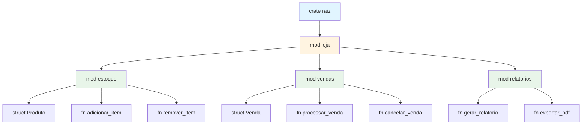
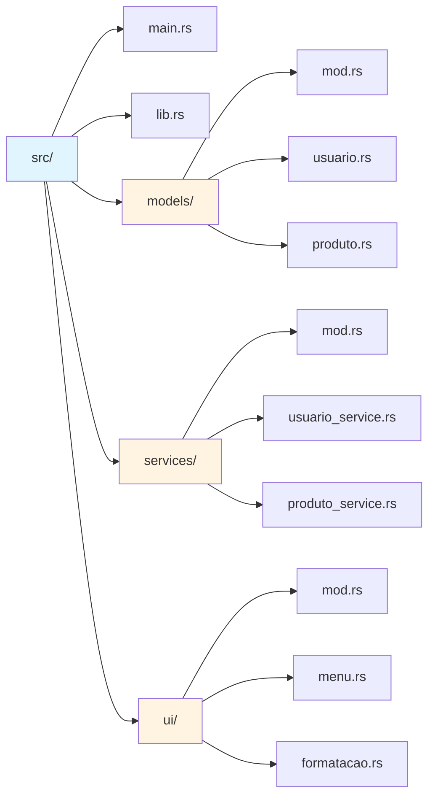
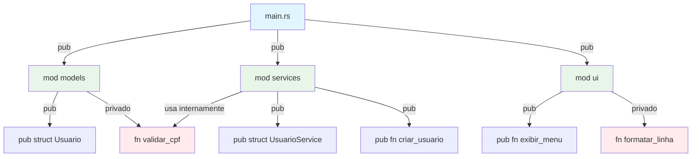
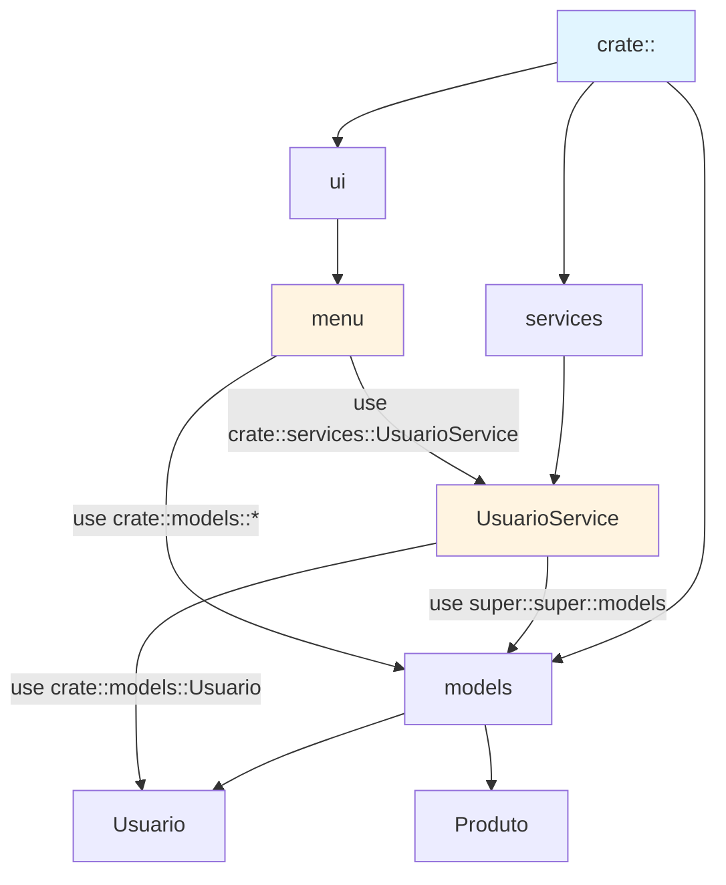

# 📦 Dia 11: Módulos e Organização de Código em Rust

## 📋 Objetivos de Aprendizagem

Ao final desta lição, você será capaz de:

1. **Organizar código** em módulos hierárquicos usando `mod`
2. **Controlar visibilidade** com `pub` e entender o padrão privado
3. **Importar itens** eficientemente com `use`
4. **Navegar paths** usando `crate`, `super` e `self`
5. **Estruturar projetos** em múltiplos arquivos (`mod.rs`, `lib.rs`, `main.rs`)
6. **Aplicar princípios** de separação de responsabilidades
7. **Refatorar código monolítico** em arquitetura modular escalável

---

## 🎭 Ativação do Conhecimento Prévio

### 🏗️ Analogia: A Arquitetura do Projeto

Imagine que você está construindo uma **casa**:

- **Sem módulos**: Tudo em um único cômodo gigante - cozinha, quarto, banheiro, sala, tudo misturado. Funciona? Sim. É organizado? Não!
  
- **Com módulos**: Cada cômodo tem sua função específica. A cozinha tem utensílios de cozinha, o quarto tem a cama, o banheiro tem o chuveiro. Você sabe onde encontrar cada coisa!

**Em Rust:**
- Começamos com tudo em `main.rs` (a casa de um cômodo só)
- À medida que o projeto cresce, separamos em módulos (cômodos especializados)
- Cada módulo tem responsabilidades claras
- A visibilidade (`pub`) controla quem pode acessar o quê (portas trancadas vs abertas)

### 📖 História Real

Muitos desenvolvedores iniciantes cometem o mesmo erro: colocam todo o código em `main.rs` até que o arquivo tenha 2000+ linhas. Aí, quando precisam adicionar uma feature nova, passam horas procurando onde está cada função. **Não seja essa pessoa!** Aprenda a organizar desde o início.

### 🔄 Revisão Rápida

Nos dias anteriores, você criou:
- **Dia 8**: Sistema de gerenciamento (structs, enums, métodos)
- **Dia 9**: Tratamento de erros (Result, Option)

Hoje, vamos pegar esse código e **organizá-lo profissionalmente**.

---

## 📚 Apresentação do Conteúdo

### 1️⃣ Módulos Básicos: `mod nome { }`

Módulos são **namespaces** que agrupam código relacionado.

```rust {.line-numbers}
// Tudo em um arquivo (main.rs)
mod matematica {
    pub fn somar(a: i32, b: i32) -> i32 {
        a + b
    }
    
    fn subtrair(a: i32, b: i32) -> i32 {  // privado por padrão
        a - b
    }
}

fn main() {
    let resultado = matematica::somar(5, 3);
    println!("Resultado: {}", resultado);
    
    // matematica::subtrair(5, 3);  // ❌ ERRO: função privada
}
```

**Pontos-chave:**
- `mod` cria um módulo
- Itens são **privados por padrão**
- `pub` torna itens públicos
- Acesso via `nome_modulo::item`

---

### 2️⃣ Visibilidade: `pub` vs Privado

```rust {.line-numbers}
mod banco {
    pub struct ContaBancaria {
        pub titular: String,
        saldo: f64,  // privado - não pode ser acessado diretamente
    }
    
    impl ContaBancaria {
        pub fn nova(titular: String, saldo_inicial: f64) -> Self {
            ContaBancaria {
                titular,
                saldo: saldo_inicial,
            }
        }
        
        pub fn consultar_saldo(&self) -> f64 {
            self.saldo
        }
        
        pub fn depositar(&mut self, valor: f64) {
            if valor > 0.0 {
                self.saldo += valor;
            }
        }
        
        fn auditoria_interna(&self) {  // privado
            println!("Auditando conta...");
        }
    }
}

fn main() {
    let mut conta = banco::ContaBancaria::nova("Alice".to_string(), 1000.0);
    
    println!("Titular: {}", conta.titular);  // ✅ campo público
    // println!("Saldo: {}", conta.saldo);   // ❌ campo privado
    
    println!("Saldo: {}", conta.consultar_saldo());  // ✅ método público
    conta.depositar(500.0);
    
    // conta.auditoria_interna();  // ❌ método privado
}
```

**Regras de Visibilidade:**
- **Padrão**: Tudo é privado
- **`pub`**: Público para módulos externos
- **`pub(crate)`**: Público apenas dentro do crate
- **`pub(super)`**: Público apenas para o módulo pai
- **Campos de struct**: Podem ter visibilidade individual

---

### 3️⃣ Importação com `use`

```rust {.line-numbers}
mod geometria {
    pub mod formas {
        pub struct Circulo {
            pub raio: f64,
        }
        
        impl Circulo {
            pub fn area(&self) -> f64 {
                3.14159 * self.raio * self.raio
            }
        }
        
        pub struct Retangulo {
            pub largura: f64,
            pub altura: f64,
        }
        
        impl Retangulo {
            pub fn area(&self) -> f64 {
                self.largura * self.altura
            }
        }
    }
}

// Sem use - caminho completo
fn exemplo_sem_use() {
    let c = geometria::formas::Circulo { raio: 5.0 };
    println!("Área: {}", c.area());
}

// Com use - importação
use geometria::formas::Circulo;
use geometria::formas::Retangulo;

fn exemplo_com_use() {
    let c = Circulo { raio: 5.0 };
    let r = Retangulo { largura: 4.0, altura: 6.0 };
    
    println!("Círculo: {}", c.area());
    println!("Retângulo: {}", r.area());
}

// Use com múltiplos itens
use geometria::formas::{Circulo as C, Retangulo as R};

// Use com glob (use com moderação!)
use geometria::formas::*;

fn main() {
    exemplo_sem_use();
    exemplo_com_use();
}
```

---

### 4️⃣ Paths: `crate`, `super`, `self`

```rust {.line-numbers}
mod loja {
    pub mod estoque {
        pub fn verificar_item(nome: &str) -> bool {
            println!("Verificando: {}", nome);
            true
        }
    }
    
    pub mod vendas {
        // Caminho absoluto desde a raiz do crate
        use crate::loja::estoque;
        
        pub fn vender_item(nome: &str) {
            // Usando super para acessar módulo irmão
            if super::estoque::verificar_item(nome) {
                println!("Vendendo: {}", nome);
            }
        }
        
        pub fn processar_venda() {
            // self refere-se ao módulo atual
            self::vender_item("Notebook");
        }
    }
    
    pub fn relatorio() {
        // Acesso direto a módulo filho
        estoque::verificar_item("Mouse");
        vendas::vender_item("Teclado");
    }
}

fn main() {
    loja::vendas::processar_venda();
    loja::relatorio();
}
```

**Resumo de Paths:**
- **`crate::`**: Caminho absoluto desde a raiz do crate
- **`super::`**: Módulo pai (um nível acima)
- **`self::`**: Módulo atual (opcional, geralmente implícito)
- **Caminho relativo**: Direto do escopo atual

---

### 5️⃣ Arquivos Separados: Estrutura de Projeto

#### **Opção 1: Arquivo por Módulo**

```
meu_projeto/
├── Cargo.toml
└── src/
    ├── main.rs
    ├── matematica.rs
    └── geometria.rs
```

**src/main.rs:**
```rust {.line-numbers}
mod matematica;  // Rust procura matematica.rs
mod geometria;   // Rust procura geometria.rs

fn main() {
    let soma = matematica::somar(5, 3);
    let area = geometria::area_circulo(5.0);
    
    println!("Soma: {}, Área: {}", soma, area);
}
```

**src/matematica.rs:**
```rust {.line-numbers}
pub fn somar(a: i32, b: i32) -> i32 {
    a + b
}

pub fn multiplicar(a: i32, b: i32) -> i32 {
    a * b
}
```

**src/geometria.rs:**
```rust {.line-numbers}
pub fn area_circulo(raio: f64) -> f64 {
    3.14159 * raio * raio
}

pub fn area_retangulo(largura: f64, altura: f64) -> f64 {
    largura * altura
}
```

---

#### **Opção 2: Módulo com Submódulos (usando `mod.rs`)**

```
meu_projeto/
├── Cargo.toml
└── src/
    ├── main.rs
    └── geometria/
        ├── mod.rs
        ├── circulo.rs
        └── retangulo.rs
```

**src/main.rs:**
```rust {.line-numbers}
mod geometria;

use geometria::{circulo, retangulo};

fn main() {
    let area_c = circulo::area(5.0);
    let area_r = retangulo::area(4.0, 6.0);
    
    println!("Círculo: {}, Retângulo: {}", area_c, area_r);
}
```

**src/geometria/mod.rs:**
```rust {.line-numbers}
pub mod circulo;
pub mod retangulo;

// Re-export para facilitar uso
pub use circulo::Circulo;
pub use retangulo::Retangulo;
```

**src/geometria/circulo.rs:**
```rust {.line-numbers}
pub struct Circulo {
    pub raio: f64,
}

impl Circulo {
    pub fn nova(raio: f64) -> Self {
        Circulo { raio }
    }
    
    pub fn area(&self) -> f64 {
        3.14159 * self.raio * self.raio
    }
}

pub fn area(raio: f64) -> f64 {
    3.14159 * raio * raio
}
```

**src/geometria/retangulo.rs:**
```rust {.line-numbers}
pub struct Retangulo {
    pub largura: f64,
    pub altura: f64,
}

impl Retangulo {
    pub fn nova(largura: f64, altura: f64) -> Self {
        Retangulo { largura, altura }
    }
    
    pub fn area(&self) -> f64 {
        self.largura * self.altura
    }
}

pub fn area(largura: f64, altura: f64) -> f64 {
    largura * altura
}
```

---

#### **Opção 3: Módulo com Submódulos (Rust 2018+ sem `mod.rs`)**

```
meu_projeto/
├── Cargo.toml
└── src/
    ├── main.rs
    ├── geometria.rs
    └── geometria/
        ├── circulo.rs
        └── retangulo.rs
```

**src/geometria.rs** (substitui `mod.rs`):
```rust {.line-numbers}
pub mod circulo;
pub mod retangulo;

pub use circulo::Circulo;
pub use retangulo::Retangulo;
```

---

### 6️⃣ `lib.rs` vs `main.rs`

#### **Biblioteca (lib.rs)**

```
minha_lib/
├── Cargo.toml
└── src/
    ├── lib.rs
    ├── models.rs
    └── utils.rs
```

**src/lib.rs:**
```rust {.line-numbers}
pub mod models;
pub mod utils;

// Re-exports para API pública limpa
pub use models::{Usuario, Produto};
pub use utils::formatar_preco;

// Função pública da biblioteca
pub fn inicializar() {
    println!("Biblioteca inicializada!");
}
```

#### **Binário + Biblioteca**

```
meu_app/
├── Cargo.toml
└── src/
    ├── lib.rs      // Lógica reutilizável
    ├── main.rs     // Ponto de entrada
    ├── models.rs
    └── services.rs
```

**src/lib.rs:**
```rust {.line-numbers}
pub mod models;
pub mod services;

pub use models::Usuario;
pub use services::UsuarioService;
```

**src/main.rs:**
```rust {.line-numbers}
use meu_app::{Usuario, UsuarioService};

fn main() {
    let usuario = Usuario::novo("Alice".to_string());
    let service = UsuarioService::new();
    
    service.processar(&usuario);
}
```

---

## 🎨 Diagramas Arquiteturais

### Diagrama 1: Árvore de Módulos



---

### Diagrama 2: Estrutura de Diretórios



---

### Diagrama 3: Fluxo de Visibilidade



---

### Diagrama 4: Paths e Imports



---

## 💡 Demonstração e Modelagem

### 🔄 Evolução: De Monolítico para Modular

#### **ANTES: Tudo em `main.rs` (❌ Não recomendado)**

```rust {.line-numbers}
// main.rs - 500+ linhas, difícil de manter

use std::collections::HashMap;

struct Usuario {
    id: u32,
    nome: String,
    email: String,
}

struct Produto {
    id: u32,
    nome: String,
    preco: f64,
}

struct Venda {
    id: u32,
    usuario_id: u32,
    produto_id: u32,
    quantidade: u32,
}

fn criar_usuario(nome: String, email: String) -> Usuario {
    // lógica...
    Usuario { id: 1, nome, email }
}

fn validar_email(email: &str) -> bool {
    email.contains('@')
}

fn criar_produto(nome: String, preco: f64) -> Produto {
    // lógica...
    Produto { id: 1, nome, preco }
}

fn calcular_preco_total(preco: f64, quantidade: u32) -> f64 {
    preco * quantidade as f64
}

fn processar_venda(usuario_id: u32, produto_id: u32, quantidade: u32) -> Venda {
    // lógica...
    Venda { id: 1, usuario_id, produto_id, quantidade }
}

fn exibir_menu() {
    println!("=== MENU ===");
    println!("1. Criar Usuário");
    println!("2. Criar Produto");
    println!("3. Processar Venda");
}

fn formatar_preco(preco: f64) -> String {
    format!("R$ {:.2}", preco)
}

fn main() {
    exibir_menu();
    // ... mais código ...
}

// ... mais 400 linhas ...
```

**Problemas:**
- ❌ Difícil encontrar funções específicas
- ❌ Sem separação de responsabilidades
- ❌ Difícil testar componentes isoladamente
- ❌ Não escalável
- ❌ Colaboração em equipe complicada

---

#### **DEPOIS: Organizado em Módulos (✅ Recomendado)**

```
projeto_loja/
├── Cargo.toml
└── src/
    ├── main.rs
    ├── lib.rs
    ├── models/
    │   ├── mod.rs
    │   ├── usuario.rs
    │   ├── produto.rs
    │   └── venda.rs
    ├── services/
    │   ├── mod.rs
    │   ├── usuario_service.rs
    │   ├── produto_service.rs
    │   └── venda_service.rs
    └── ui/
        ├── mod.rs
        ├── menu.rs
        └── formatacao.rs
```

**src/lib.rs:**
```rust {.line-numbers}
//! # Projeto Loja
//! 
//! Sistema de gerenciamento de loja com usuários, produtos e vendas.

pub mod models;
pub mod services;
pub mod ui;

// Re-exports para API pública limpa
pub use models::{Usuario, Produto, Venda};
pub use services::{UsuarioService, ProdutoService, VendaService};
```

**src/models/mod.rs:**
```rust {.line-numbers}
//! Modelos de dados da aplicação

pub mod usuario;
pub mod produto;
pub mod venda;

pub use usuario::Usuario;
pub use produto::Produto;
pub use venda::Venda;
```

**src/models/usuario.rs:**
```rust {.line-numbers}
//! Modelo de usuário

/// Representa um usuário do sistema
#[derive(Debug, Clone)]
pub struct Usuario {
    pub id: u32,
    pub nome: String,
    pub email: String,
}

impl Usuario {
    /// Cria um novo usuário
    pub fn novo(id: u32, nome: String, email: String) -> Result<Self, String> {
        if !Self::validar_email(&email) {
            return Err("Email inválido".to_string());
        }
        
        Ok(Usuario { id, nome, email })
    }
    
    /// Valida formato de email
    fn validar_email(email: &str) -> bool {
        email.contains('@') && email.contains('.')
    }
}
```

**src/models/produto.rs:**
```rust {.line-numbers}
//! Modelo de produto

/// Representa um produto da loja
#[derive(Debug, Clone)]
pub struct Produto {
    pub id: u32,
    pub nome: String,
    pub preco: f64,
    pub estoque: u32,
}

impl Produto {
    /// Cria um novo produto
    pub fn novo(id: u32, nome: String, preco: f64, estoque: u32) -> Result<Self, String> {
        if preco < 0.0 {
            return Err("Preço não pode ser negativo".to_string());
        }
        
        Ok(Produto { id, nome, preco, estoque })
    }
    
    /// Verifica se há estoque disponível
    pub fn tem_estoque(&self, quantidade: u32) -> bool {
        self.estoque >= quantidade
    }
    
    /// Reduz o estoque
    pub fn reduzir_estoque(&mut self, quantidade: u32) -> Result<(), String> {
        if !self.tem_estoque(quantidade) {
            return Err("Estoque insuficiente".to_string());
        }
        
        self.estoque -= quantidade;
        Ok(())
    }
}
```

**src/models/venda.rs:**
```rust {.line-numbers}
//! Modelo de venda

/// Representa uma venda realizada
#[derive(Debug, Clone)]
pub struct Venda {
    pub id: u32,
    pub usuario_id: u32,
    pub produto_id: u32,
    pub quantidade: u32,
    pub valor_total: f64,
}

impl Venda {
    /// Cria uma nova venda
    pub fn nova(
        id: u32,
        usuario_id: u32,
        produto_id: u32,
        quantidade: u32,
        preco_unitario: f64,
    ) -> Self {
        let valor_total = Self::calcular_total(preco_unitario, quantidade);
        
        Venda {
            id,
            usuario_id,
            produto_id,
            quantidade,
            valor_total,
        }
    }
    
    /// Calcula valor total da venda
    fn calcular_total(preco: f64, quantidade: u32) -> f64 {
        preco * quantidade as f64
    }
}
```

**src/services/mod.rs:**
```rust {.line-numbers}
//! Serviços de lógica de negócio

pub mod usuario_service;
pub mod produto_service;
pub mod venda_service;

pub use usuario_service::UsuarioService;
pub use produto_service::ProdutoService;
pub use venda_service::VendaService;
```

**src/services/usuario_service.rs:**
```rust {.line-numbers}
//! Serviço de gerenciamento de usuários

use crate::models::Usuario;
use std::collections::HashMap;

/// Gerencia operações com usuários
pub struct UsuarioService {
    usuarios: HashMap<u32, Usuario>,
    proximo_id: u32,
}

impl UsuarioService {
    /// Cria um novo serviço de usuários
    pub fn novo() -> Self {
        UsuarioService {
            usuarios: HashMap::new(),
            proximo_id: 1,
        }
    }
    
    /// Cria um novo usuário
    pub fn criar(&mut self, nome: String, email: String) -> Result<u32, String> {
        let id = self.proximo_id;
        let usuario = Usuario::novo(id, nome, email)?;
        
        self.usuarios.insert(id, usuario);
        self.proximo_id += 1;
        
        Ok(id)
    }
    
    /// Busca usuário por ID
    pub fn buscar(&self, id: u32) -> Option<&Usuario> {
        self.usuarios.get(&id)
    }
    
    /// Lista todos os usuários
    pub fn listar(&self) -> Vec<&Usuario> {
        self.usuarios.values().collect()
    }
}
```

**src/services/produto_service.rs:**
```rust {.line-numbers}
//! Serviço de gerenciamento de produtos

use crate::models::Produto;
use std::collections::HashMap;

/// Gerencia operações com produtos
pub struct ProdutoService {
    produtos: HashMap<u32, Produto>,
    proximo_id: u32,
}

impl ProdutoService {
    /// Cria um novo serviço de produtos
    pub fn novo() -> Self {
        ProdutoService {
            produtos: HashMap::new(),
            proximo_id: 1,
        }
    }
    
    /// Cria um novo produto
    pub fn criar(&mut self, nome: String, preco: f64, estoque: u32) -> Result<u32, String> {
        let id = self.proximo_id;
        let produto = Produto::novo(id, nome, preco, estoque)?;
        
        self.produtos.insert(id, produto);
        self.proximo_id += 1;
        
        Ok(id)
    }
    
    /// Busca produto por ID
    pub fn buscar(&self, id: u32) -> Option<&Produto> {
        self.produtos.get(&id)
    }
    
    /// Busca produto mutável por ID
    pub fn buscar_mut(&mut self, id: u32) -> Option<&mut Produto> {
        self.produtos.get_mut(&id)
    }
    
    /// Lista todos os produtos
    pub fn listar(&self) -> Vec<&Produto> {
        self.produtos.values().collect()
    }
}
```

**src/services/venda_service.rs:**
```rust {.line-numbers}
//! Serviço de processamento de vendas

use crate::models::Venda;
use crate::services::{UsuarioService, ProdutoService};
use std::collections::HashMap;

/// Gerencia operações de vendas
pub struct VendaService {
    vendas: HashMap<u32, Venda>,
    proximo_id: u32,
}

impl VendaService {
    /// Cria um novo serviço de vendas
    pub fn novo() -> Self {
        VendaService {
            vendas: HashMap::new(),
            proximo_id: 1,
        }
    }
    
    /// Processa uma nova venda
    pub fn processar(
        &mut self,
        usuario_service: &UsuarioService,
        produto_service: &mut ProdutoService,
        usuario_id: u32,
        produto_id: u32,
        quantidade: u32,
    ) -> Result<u32, String> {
        // Valida usuário
        let _usuario = usuario_service
            .buscar(usuario_id)
            .ok_or("Usuário não encontrado")?;
        
        // Valida produto e estoque
        let produto = produto_service
            .buscar_mut(produto_id)
            .ok_or("Produto não encontrado")?;
        
        if !produto.tem_estoque(quantidade) {
            return Err("Estoque insuficiente".to_string());
        }
        
        // Cria venda
        let id = self.proximo_id;
        let venda = Venda::nova(id, usuario_id, produto_id, quantidade, produto.preco);
        
        // Reduz estoque
        produto.reduzir_estoque(quantidade)?;
        
        // Salva venda
        self.vendas.insert(id, venda);
        self.proximo_id += 1;
        
        Ok(id)
    }
    
    /// Lista todas as vendas
    pub fn listar(&self) -> Vec<&Venda> {
        self.vendas.values().collect()
    }
}
```

**src/ui/mod.rs:**
```rust {.line-numbers}
//! Interface do usuário

pub mod menu;
pub mod formatacao;

pub use menu::exibir_menu;
pub use formatacao::{formatar_preco, formatar_usuario, formatar_produto};
```

**src/ui/menu.rs:**
```rust {.line-numbers}
//! Menu principal da aplicação

/// Exibe o menu principal
pub fn exibir_menu() {
    println!("\n{}", "=".repeat(40));
    println!("         SISTEMA DE LOJA");
    println!("{}", "=".repeat(40));
    println!("1. Gerenciar Usuários");
    println!("2. Gerenciar Produtos");
    println!("3. Processar Vendas");
    println!("4. Relatórios");
    println!("0. Sair");
    println!("{}", "=".repeat(40));
}

/// Exibe submenu de usuários
pub fn exibir_menu_usuarios() {
    println!("\n--- USUÁRIOS ---");
    println!("1. Criar Usuário");
    println!("2. Listar Usuários");
    println!("0. Voltar");
}

/// Exibe submenu de produtos
pub fn exibir_menu_produtos() {
    println!("\n--- PRODUTOS ---");
    println!("1. Criar Produto");
    println!("2. Listar Produtos");
    println!("0. Voltar");
}
```

**src/ui/formatacao.rs:**
```rust {.line-numbers}
//! Funções de formatação para exibição

use crate::models::{Usuario, Produto, Venda};

/// Formata preço em reais
pub fn formatar_preco(preco: f64) -> String {
    format!("R$ {:.2}", preco)
}

/// Formata dados de usuário para exibição
pub fn formatar_usuario(usuario: &Usuario) -> String {
    format!(
        "ID: {} | Nome: {} | Email: {}",
        usuario.id, usuario.nome, usuario.email
    )
}

/// Formata dados de produto para exibição
pub fn formatar_produto(produto: &Produto) -> String {
    format!(
        "ID: {} | Nome: {} | Preço: {} | Estoque: {}",
        produto.id,
        produto.nome,
        formatar_preco(produto.preco),
        produto.estoque
    )
}

/// Formata dados de venda para exibição
pub fn formatar_venda(venda: &Venda) -> String {
    format!(
        "ID: {} | Usuário: {} | Produto: {} | Qtd: {} | Total: {}",
        venda.id,
        venda.usuario_id,
        venda.produto_id,
        venda.quantidade,
        formatar_preco(venda.valor_total)
    )
}
```

**src/main.rs:**
```rust {.line-numbers}
//! Ponto de entrada da aplicação

use projeto_loja::{UsuarioService, ProdutoService, VendaService};
use projeto_loja::ui::{exibir_menu, formatar_usuario, formatar_produto};

fn main() {
    let mut usuario_service = UsuarioService::novo();
    let mut produto_service = ProdutoService::novo();
    let mut venda_service = VendaService::novo();
    
    // Dados de exemplo
    let usuario_id = usuario_service
        .criar("Alice Silva".to_string(), "alice@email.com".to_string())
        .expect("Erro ao criar usuário");
    
    let produto_id = produto_service
        .criar("Notebook".to_string(), 2500.0, 10)
        .expect("Erro ao criar produto");
    
    // Exibe menu
    exibir_menu();
    
    // Lista usuários
    println!("\n--- USUÁRIOS CADASTRADOS ---");
    for usuario in usuario_service.listar() {
        println!("{}", formatar_usuario(usuario));
    }
    
    // Lista produtos
    println!("\n--- PRODUTOS CADASTRADOS ---");
    for produto in produto_service.listar() {
        println!("{}", formatar_produto(produto));
    }
    
    // Processa venda
    match venda_service.processar(
        &usuario_service,
        &mut produto_service,
        usuario_id,
        produto_id,
        2,
    ) {
        Ok(venda_id) => println!("\n✅ Venda {} processada com sucesso!", venda_id),
        Err(e) => println!("\n❌ Erro ao processar venda: {}", e),
    }
}
```

**Benefícios:**
- ✅ Código organizado por responsabilidade
- ✅ Fácil localizar funcionalidades
- ✅ Testável (cada módulo pode ter seus testes)
- ✅ Escalável (adicionar novos módulos é simples)
- ✅ Colaboração facilitada (cada dev trabalha em módulos diferentes)
- ✅ Reutilizável (lib.rs pode ser usada por outros projetos)

---

## 🎯 Prática Guiada: Exercício Completo

### 📝 Exercício: Refatorar Sistema de Biblioteca

**Contexto:**  
Você criou um sistema de gerenciamento de biblioteca nos dias anteriores. Agora, o projeto cresceu e está com 800 linhas em `main.rs`. Seu chefe pediu para organizar o código antes de adicionar novas features.

**Objetivo:**  
Refatorar o código monolítico em uma arquitetura modular profissional.

---

#### **ANTES: Código Monolítico**

```rust {.line-numbers}
// main.rs - 800 linhas (versão simplificada)

use std::collections::HashMap;

#[derive(Debug, Clone)]
struct Livro {
    id: u32,
    titulo: String,
    autor: String,
    ano: u32,
    disponivel: bool,
}

#[derive(Debug, Clone)]
struct Usuario {
    id: u32,
    nome: String,
    cpf: String,
}

#[derive(Debug, Clone)]
struct Emprestimo {
    id: u32,
    usuario_id: u32,
    livro_id: u32,
    data_emprestimo: String,
    data_devolucao: Option<String>,
}

fn criar_livro(titulo: String, autor: String, ano: u32) -> Livro {
    Livro {
        id: 1,
        titulo,
        autor,
        ano,
        disponivel: true,
    }
}

fn criar_usuario(nome: String, cpf: String) -> Result<Usuario, String> {
    if !validar_cpf(&cpf) {
        return Err("CPF inválido".to_string());
    }
    Ok(Usuario { id: 1, nome, cpf })
}

fn validar_cpf(cpf: &str) -> bool {
    cpf.len() == 11
}

fn emprestar_livro(usuario_id: u32, livro_id: u32) -> Emprestimo {
    Emprestimo {
        id: 1,
        usuario_id,
        livro_id,
        data_emprestimo: "2024-01-15".to_string(),
        data_devolucao: None,
    }
}

fn exibir_menu() {
    println!("=== BIBLIOTECA ===");
    println!("1. Livros");
    println!("2. Usuários");
    println!("3. Empréstimos");
}

fn main() {
    exibir_menu();
    // ... mais 700 linhas ...
}
```

---

#### **DEPOIS: Código Modular (Solução)**

**Estrutura de Diretórios:**

```
biblioteca/
├── Cargo.toml
└── src/
    ├── main.rs
    ├── lib.rs
    ├── models/
    │   ├── mod.rs
    │   ├── livro.rs
    │   ├── usuario.rs
    │   └── emprestimo.rs
    ├── services/
    │   ├── mod.rs
    │   ├── livro_service.rs
    │   ├── usuario_service.rs
    │   └── emprestimo_service.rs
    ├── ui/
    │   ├── mod.rs
    │   ├── menu.rs
    │   └── formatacao.rs
    └── utils/
        ├── mod.rs
        └── validacao.rs
```

---

**src/lib.rs:**

```rust {.line-numbers}
//! # Sistema de Biblioteca
//! 
//! Sistema completo de gerenciamento de biblioteca com livros, usuários e empréstimos.

pub mod models;
pub mod services;
pub mod ui;
pub mod utils;

// Re-exports públicos
pub use models::{Livro, Usuario, Emprestimo};
pub use services::{LivroService, UsuarioService, EmprestimoService};
```

---

**src/models/mod.rs:**

```rust {.line-numbers}
//! Modelos de dados

pub mod livro;
pub mod usuario;
pub mod emprestimo;

pub use livro::Livro;
pub use usuario::Usuario;
pub use emprestimo::Emprestimo;
```

---

**src/models/livro.rs:**

```rust {.line-numbers}
//! Modelo de livro

/// Representa um livro da biblioteca
#[derive(Debug, Clone)]
pub struct Livro {
    pub id: u32,
    pub titulo: String,
    pub autor: String,
    pub ano: u32,
    pub disponivel: bool,
}

impl Livro {
    /// Cria um novo livro
    pub fn novo(id: u32, titulo: String, autor: String, ano: u32) -> Result<Self, String> {
        if titulo.is_empty() {
            return Err("Título não pode ser vazio".to_string());
        }
        
        if autor.is_empty() {
            return Err("Autor não pode ser vazio".to_string());
        }
        
        if ano < 1000 || ano > 2100 {
            return Err("Ano inválido".to_string());
        }
        
        Ok(Livro {
            id,
            titulo,
            autor,
            ano,
            disponivel: true,
        })
    }
    
    /// Marca livro como emprestado
    pub fn emprestar(&mut self) -> Result<(), String> {
        if !self.disponivel {
            return Err("Livro já está emprestado".to_string());
        }
        self.disponivel = false;
        Ok(())
    }
    
    /// Marca livro como devolvido
    pub fn devolver(&mut self) {
        self.disponivel = true;
    }
}

#[cfg(test)]
mod tests {
    use super::*;
    
    #[test]
    fn test_criar_livro_valido() {
        let livro = Livro::novo(
            1,
            "1984".to_string(),
            "George Orwell".to_string(),
            1949,
        );
        assert!(livro.is_ok());
    }
    
    #[test]
    fn test_emprestar_livro() {
        let mut livro = Livro::novo(
            1,
            "1984".to_string(),
            "George Orwell".to_string(),
            1949,
        ).unwrap();
        
        assert!(livro.emprestar().is_ok());
        assert!(!livro.disponivel);
        assert!(livro.emprestar().is_err());
    }
}
```

---

**src/models/usuario.rs:**

```rust {.line-numbers}
//! Modelo de usuário

use crate::utils::validacao;

/// Representa um usuário da biblioteca
#[derive(Debug, Clone)]
pub struct Usuario {
    pub id: u32,
    pub nome: String,
    pub cpf: String,
}

impl Usuario {
    /// Cria um novo usuário
    pub fn novo(id: u32, nome: String, cpf: String) -> Result<Self, String> {
        if nome.is_empty() {
            return Err("Nome não pode ser vazio".to_string());
        }
        
        if !validacao::validar_cpf(&cpf) {
            return Err("CPF inválido".to_string());
        }
        
        Ok(Usuario { id, nome, cpf })
    }
}

#[cfg(test)]
mod tests {
    use super::*;
    
    #[test]
    fn test_criar_usuario_valido() {
        let usuario = Usuario::novo(1, "Alice".to_string(), "12345678901".to_string());
        assert!(usuario.is_ok());
    }
    
    #[test]
    fn test_cpf_invalido() {
        let usuario = Usuario::novo(1, "Alice".to_string(), "123".to_string());
        assert!(usuario.is_err());
    }
}
```

---

**src/models/emprestimo.rs:**

```rust {.line-numbers}
//! Modelo de empréstimo

/// Representa um empréstimo de livro
#[derive(Debug, Clone)]
pub struct Emprestimo {
    pub id: u32,
    pub usuario_id: u32,
    pub livro_id: u32,
    pub data_emprestimo: String,
    pub data_devolucao: Option<String>,
}

impl Emprestimo {
    /// Cria um novo empréstimo
    pub fn novo(id: u32, usuario_id: u32, livro_id: u32, data: String) -> Self {
        Emprestimo {
            id,
            usuario_id,
            livro_id,
            data_emprestimo: data,
            data_devolucao: None,
        }
    }
    
    /// Registra devolução
    pub fn devolver(&mut self, data: String) {
        self.data_devolucao = Some(data);
    }
    
    /// Verifica se foi devolvido
    pub fn foi_devolvido(&self) -> bool {
        self.data_devolucao.is_some()
    }
}
```

---

**src/services/mod.rs:**

```rust {.line-numbers}
//! Serviços de lógica de negócio

pub mod livro_service;
pub mod usuario_service;
pub mod emprestimo_service;

pub use livro_service::LivroService;
pub use usuario_service::UsuarioService;
pub use emprestimo_service::EmprestimoService;
```

---

**src/services/livro_service.rs:**

```rust {.line-numbers}
//! Serviço de gerenciamento de livros

use crate::models::Livro;
use std::collections::HashMap;

/// Gerencia operações com livros
pub struct LivroService {
    livros: HashMap<u32, Livro>,
    proximo_id: u32,
}

impl LivroService {
    /// Cria novo serviço
    pub fn novo() -> Self {
        LivroService {
            livros: HashMap::new(),
            proximo_id: 1,
        }
    }
    
    /// Adiciona livro
    pub fn adicionar(&mut self, titulo: String, autor: String, ano: u32) -> Result<u32, String> {
        let id = self.proximo_id;
        let livro = Livro::novo(id, titulo, autor, ano)?;
        
        self.livros.insert(id, livro);
        self.proximo_id += 1;
        
        Ok(id)
    }
    
    /// Busca livro por ID
    pub fn buscar(&self, id: u32) -> Option<&Livro> {
        self.livros.get(&id)
    }
    
    /// Busca livro mutável por ID
    pub fn buscar_mut(&mut self, id: u32) -> Option<&mut Livro> {
        self.livros.get_mut(&id)
    }
    
    /// Lista todos os livros
    pub fn listar(&self) -> Vec<&Livro> {
        self.livros.values().collect()
    }
    
    /// Lista livros disponíveis
    pub fn listar_disponiveis(&self) -> Vec<&Livro> {
        self.livros
            .values()
            .filter(|l| l.disponivel)
            .collect()
    }
}
```

---

**src/services/usuario_service.rs:**

```rust {.line-numbers}
//! Serviço de gerenciamento de usuários

use crate::models::Usuario;
use std::collections::HashMap;

/// Gerencia operações com usuários
pub struct UsuarioService {
    usuarios: HashMap<u32, Usuario>,
    proximo_id: u32,
}

impl UsuarioService {
    /// Cria novo serviço
    pub fn novo() -> Self {
        UsuarioService {
            usuarios: HashMap::new(),
            proximo_id: 1,
        }
    }
    
    /// Cadastra usuário
    pub fn cadastrar(&mut self, nome: String, cpf: String) -> Result<u32, String> {
        // Verifica se CPF já existe
        if self.usuarios.values().any(|u| u.cpf == cpf) {
            return Err("CPF já cadastrado".to_string());
        }
        
        let id = self.proximo_id;
        let usuario = Usuario::novo(id, nome, cpf)?;
        
        self.usuarios.insert(id, usuario);
        self.proximo_id += 1;
        
        Ok(id)
    }
    
    /// Busca usuário por ID
    pub fn buscar(&self, id: u32) -> Option<&Usuario> {
        self.usuarios.get(&id)
    }
    
    /// Lista todos os usuários
    pub fn listar(&self) -> Vec<&Usuario> {
        self.usuarios.values().collect()
    }
}
```

---

**src/services/emprestimo_service.rs:**

```rust {.line-numbers}
//! Serviço de processamento de empréstimos

use crate::models::Emprestimo;
use crate::services::{LivroService, UsuarioService};
use std::collections::HashMap;

/// Gerencia operações de empréstimos
pub struct EmprestimoService {
    emprestimos: HashMap<u32, Emprestimo>,
    proximo_id: u32,
}

impl EmprestimoService {
    /// Cria novo serviço
    pub fn novo() -> Self {
        EmprestimoService {
            emprestimos: HashMap::new(),
            proximo_id: 1,
        }
    }
    
    /// Processa empréstimo
    pub fn emprestar(
        &mut self,
        usuario_service: &UsuarioService,
        livro_service: &mut LivroService,
        usuario_id: u32,
        livro_id: u32,
        data: String,
    ) -> Result<u32, String> {
        // Valida usuário
        usuario_service
            .buscar(usuario_id)
            .ok_or("Usuário não encontrado")?;
        
        // Valida e empresta livro
        let livro = livro_service
            .buscar_mut(livro_id)
            .ok_or("Livro não encontrado")?;
        
        livro.emprestar()?;
        
        // Cria empréstimo
        let id = self.proximo_id;
        let emprestimo = Emprestimo::novo(id, usuario_id, livro_id, data);
        
        self.emprestimos.insert(id, emprestimo);
        self.proximo_id += 1;
        
        Ok(id)
    }
    
    /// Processa devolução
    pub fn devolver(
        &mut self,
        livro_service: &mut LivroService,
        emprestimo_id: u32,
        data: String,
    ) -> Result<(), String> {
        let emprestimo = self.emprestimos
            .get_mut(&emprestimo_id)
            .ok_or("Empréstimo não encontrado")?;
        
        if emprestimo.foi_devolvido() {
            return Err("Livro já foi devolvido".to_string());
        }
        
        // Marca devolução
        emprestimo.devolver(data);
        
        // Atualiza livro
        let livro = livro_service
            .buscar_mut(emprestimo.livro_id)
            .ok_or("Livro não encontrado")?;
        
        livro.devolver();
        
        Ok(())
    }
    
    /// Lista empréstimos ativos
    pub fn listar_ativos(&self) -> Vec<&Emprestimo> {
        self.emprestimos
            .values()
            .filter(|e| !e.foi_devolvido())
            .collect()
    }
    
    /// Lista todos os empréstimos
    pub fn listar(&self) -> Vec<&Emprestimo> {
        self.emprestimos.values().collect()
    }
}
```

---

**src/ui/mod.rs:**

```rust {.line-numbers}
//! Interface do usuário

pub mod menu;
pub mod formatacao;

pub use menu::{exibir_menu_principal, exibir_menu_livros, exibir_menu_usuarios};
pub use formatacao::{formatar_livro, formatar_usuario, formatar_emprestimo};
```

---

**src/ui/menu.rs:**

```rust {.line-numbers}
//! Menus da aplicação

/// Exibe menu principal
pub fn exibir_menu_principal() {
    println!("\n{}", "=".repeat(50));
    println!("           SISTEMA DE BIBLIOTECA");
    println!("{}", "=".repeat(50));
    println!("1. Gerenciar Livros");
    println!("2. Gerenciar Usuários");
    println!("3. Gerenciar Empréstimos");
    println!("4. Relatórios");
    println!("0. Sair");
    println!("{}", "=".repeat(50));
}

/// Exibe menu de livros
pub fn exibir_menu_livros() {
    println!("\n--- LIVROS ---");
    println!("1. Adicionar Livro");
    println!("2. Listar Todos");
    println!("3. Listar Disponíveis");
    println!("0. Voltar");
}

/// Exibe menu de usuários
pub fn exibir_menu_usuarios() {
    println!("\n--- USUÁRIOS ---");
    println!("1. Cadastrar Usuário");
    println!("2. Listar Usuários");
    println!("0. Voltar");
}

/// Exibe menu de empréstimos
pub fn exibir_menu_emprestimos() {
    println!("\n--- EMPRÉSTIMOS ---");
    println!("1. Emprestar Livro");
    println!("2. Devolver Livro");
    println!("3. Listar Ativos");
    println!("0. Voltar");
}
```

---

**src/ui/formatacao.rs:**

```rust {.line-numbers}
//! Formatação de dados para exibição

use crate::models::{Livro, Usuario, Emprestimo};

/// Formata livro para exibição
pub fn formatar_livro(livro: &Livro) -> String {
    let status = if livro.disponivel { "✅ Disponível" } else { "❌ Emprestado" };
    format!(
        "ID: {} | {} - {} ({}) | {}",
        livro.id, livro.titulo, livro.autor, livro.ano, status
    )
}

/// Formata usuário para exibição
pub fn formatar_usuario(usuario: &Usuario) -> String {
    format!(
        "ID: {} | Nome: {} | CPF: {}",
        usuario.id, usuario.nome, usuario.cpf
    )
}

/// Formata empréstimo para exibição
pub fn formatar_emprestimo(emprestimo: &Emprestimo) -> String {
    let status = match &emprestimo.data_devolucao {
        Some(data) => format!("Devolvido em {}", data),
        None => "Em aberto".to_string(),
    };
    
    format!(
        "ID: {} | Usuário: {} | Livro: {} | Empréstimo: {} | {}",
        emprestimo.id,
        emprestimo.usuario_id,
        emprestimo.livro_id,
        emprestimo.data_emprestimo,
        status
    )
}
```

---

**src/utils/mod.rs:**

```rust {.line-numbers}
//! Utilitários gerais

pub mod validacao;

pub use validacao::validar_cpf;
```

---

**src/utils/validacao.rs:**

```rust {.line-numbers}
//! Funções de validação

/// Valida CPF (validação simplificada)
pub fn validar_cpf(cpf: &str) -> bool {
    // Remove caracteres não numéricos
    let cpf_numeros: String = cpf.chars().filter(|c| c.is_numeric()).collect();
    
    // Verifica se tem 11 dígitos
    if cpf_numeros.len() != 11 {
        return false;
    }
    
    // Verifica se não são todos iguais (ex: 111.111.111-11)
    if cpf_numeros.chars().all(|c| c == cpf_numeros.chars().next().unwrap()) {
        return false;
    }
    
    true
}

#[cfg(test)]
mod tests {
    use super::*;
    
    #[test]
    fn test_cpf_valido() {
        assert!(validar_cpf("12345678901"));
        assert!(validar_cpf("123.456.789-01"));
    }
    
    #[test]
    fn test_cpf_invalido() {
        assert!(!validar_cpf("123"));
        assert!(!validar_cpf("11111111111"));
    }
}
```

---

**src/main.rs:**

```rust {.line-numbers}
//! Ponto de entrada da aplicação

use biblioteca::{LivroService, UsuarioService, EmprestimoService};
use biblioteca::ui::{
    exibir_menu_principal,
    formatar_livro,
    formatar_usuario,
    formatar_emprestimo,
};

fn main() {
    let mut livro_service = LivroService::novo();
    let mut usuario_service = UsuarioService::novo();
    let mut emprestimo_service = EmprestimoService::novo();
    
    // Dados de exemplo
    println!("📚 Inicializando sistema...\n");
    
    // Adiciona livros
    let livro1 = livro_service
        .adicionar("1984".to_string(), "George Orwell".to_string(), 1949)
        .expect("Erro ao adicionar livro");
    
    let livro2 = livro_service
        .adicionar("O Senhor dos Anéis".to_string(), "J.R.R. Tolkien".to_string(), 1954)
        .expect("Erro ao adicionar livro");
    
    // Cadastra usuários
    let usuario1 = usuario_service
        .cadastrar("Alice Silva".to_string(), "12345678901".to_string())
        .expect("Erro ao cadastrar usuário");
    
    let usuario2 = usuario_service
        .cadastrar("Bob Santos".to_string(), "98765432100".to_string())
        .expect("Erro ao cadastrar usuário");
    
    // Exibe menu
    exibir_menu_principal();
    
    // Lista livros
    println!("\n📖 LIVROS CADASTRADOS:");
    for livro in livro_service.listar() {
        println!("  {}", formatar_livro(livro));
    }
    
    // Lista usuários
    println!("\n👥 USUÁRIOS CADASTRADOS:");
    for usuario in usuario_service.listar() {
        println!("  {}", formatar_usuario(usuario));
    }
    
    // Processa empréstimo
    println!("\n📋 PROCESSANDO EMPRÉSTIMO...");
    match emprestimo_service.emprestar(
        &usuario_service,
        &mut livro_service,
        usuario1,
        livro1,
        "2024-01-15".to_string(),
    ) {
        Ok(id) => println!("✅ Empréstimo {} realizado com sucesso!", id),
        Err(e) => println!("❌ Erro: {}", e),
    }
    
    // Lista empréstimos ativos
    println!("\n📚 EMPRÉSTIMOS ATIVOS:");
    for emprestimo in emprestimo_service.listar_ativos() {
        println!("  {}", formatar_emprestimo(emprestimo));
    }
    
    // Lista livros disponíveis
    println!("\n✅ LIVROS DISPONÍVEIS:");
    for livro in livro_service.listar_disponiveis() {
        println!("  {}", formatar_livro(livro));
    }
}
```

---

**Cargo.toml:**

```toml
[package]
name = "biblioteca"
version = "0.1.0"
edition = "2021"

[dependencies]

[lib]
name = "biblioteca"
path = "src/lib.rs"

[[bin]]
name = "biblioteca"
path = "src/main.rs"
```

---

### 🎯 Extensões do Exercício

1. **Adicionar testes por módulo:**
   - Criar `tests/` em cada módulo
   - Testar funções isoladamente

2. **Adicionar documentação:**
   - Documentar cada módulo com `//!`
   - Documentar funções públicas com `///`

3. **Criar módulo de persistência:**
   - `src/persistence/mod.rs`
   - Salvar/carregar dados em JSON

4. **Adicionar módulo de relatórios:**
   - `src/reports/mod.rs`
   - Gerar estatísticas e relatórios

---

## 🔄 Feedback e Avaliação

### ✅ Checklist de Organização

Use este checklist para avaliar seu código:

- [ ] **Separação de responsabilidades**: Cada módulo tem uma função clara?
- [ ] **Visibilidade apropriada**: Apenas o necessário é público?
- [ ] **Nomenclatura consistente**: Nomes descritivos e padronizados?
- [ ] **Estrutura de diretórios**: Organização lógica e escalável?
- [ ] **Imports limpos**: Uso adequado de `use` e re-exports?
- [ ] **Documentação**: Módulos e funções públicas documentados?
- [ ] **Testes**: Cada módulo tem seus testes?
- [ ] **Sem duplicação**: Código reutilizável está centralizado?
- [ ] **Paths claros**: Uso correto de `crate`, `super`, `self`?
- [ ] **Lib vs Main**: Lógica em `lib.rs`, execução em `main.rs`?

---

### ❌ Erros Comuns

#### **1. Esquecer `pub` em itens que devem ser públicos**

```rust {.line-numbers}
// ❌ ERRADO
mod utils {
    fn formatar(texto: &str) -> String {  // privado
        texto.to_uppercase()
    }
}

// ✅ CORRETO
mod utils {
    pub fn formatar(texto: &str) -> String {  // público
        texto.to_uppercase()
    }
}
```

---

#### **2. Paths incorretos**

```rust {.line-numbers}
// ❌ ERRADO
use super::super::super::models::Usuario;  // muito aninhado

// ✅ CORRETO
use crate::models::Usuario;  // caminho absoluto desde a raiz
```

---

#### **3. Não usar re-exports**

```rust {.line-numbers}
// ❌ ERRADO - usuário precisa saber estrutura interna
use minha_lib::models::usuario::Usuario;
use minha_lib::models::produto::Produto;

// ✅ CORRETO - API pública limpa
// Em lib.rs:
pub use models::{Usuario, Produto};

// Usuário usa:
use minha_lib::{Usuario, Produto};
```

---

#### **4. Módulos muito grandes**

```rust {.line-numbers}
// ❌ ERRADO - mod.rs com 500 linhas

// ✅ CORRETO - separar em arquivos
// models/
//   ├── mod.rs (apenas re-exports)
//   ├── usuario.rs
//   ├── produto.rs
//   └── venda.rs
```

---

#### **5. Misturar responsabilidades**

```rust {.line-numbers}
// ❌ ERRADO - lógica de UI no modelo
impl Usuario {
    pub fn exibir(&self) {
        println!("Nome: {}", self.nome);  // UI no modelo!
    }
}

// ✅ CORRETO - separar em módulo UI
// ui/formatacao.rs
pub fn formatar_usuario(usuario: &Usuario) -> String {
    format!("Nome: {}", usuario.nome)
}
```

---

### 📝 Quiz de Módulos

**1. Qual é a visibilidade padrão em Rust?**
- a) Público
- b) Privado ✅
- c) Protegido
- d) Interno

**2. Como importar múltiplos itens de um módulo?**
- a) `use modulo::item1; use modulo::item2;`
- b) `use modulo::{item1, item2};` ✅
- c) `use modulo::*;`
- d) Todas as anteriores ✅

**3. O que `crate::` representa?**
- a) Módulo pai
- b) Módulo atual
- c) Raiz do crate ✅
- d) Módulo externo

**4. Qual arquivo Rust procura para um módulo `utils`?**
- a) `utils.rs` ✅
- b) `utils/mod.rs` ✅
- c) `utils/lib.rs`
- d) `utils/main.rs`

**5. Qual a diferença entre `lib.rs` e `main.rs`?**
- a) `lib.rs` é para bibliotecas, `main.rs` para executáveis ✅
- b) São a mesma coisa
- c) `lib.rs` é privado, `main.rs` é público
- d) Não há diferença

---

### 🎯 Auto-Avaliação

Responda honestamente:

1. **Consigo organizar código em módulos hierárquicos?**
   - [ ] Sim, com confiança
   - [ ] Sim, mas com dúvidas
   - [ ] Ainda preciso praticar

2. **Entendo quando usar `pub` vs privado?**
   - [ ] Sim, completamente
   - [ ] Parcialmente
   - [ ] Preciso revisar

3. **Sei usar `crate`, `super` e `self` corretamente?**
   - [ ] Sim
   - [ ] Mais ou menos
   - [ ] Não

4. **Consigo estruturar projetos em múltiplos arquivos?**
   - [ ] Sim, facilmente
   - [ ] Com alguma dificuldade
   - [ ] Ainda não

**Se marcou "Preciso praticar/revisar" em 2+ itens:** Refaça o exercício prático e revise a seção de Apresentação do Conteúdo.

---

## 🚀 Transferência e Aplicação

### 💪 Desafio Final: Organize Seu Projeto Pessoal

**Objetivo:** Pegar um projeto que você criou nos dias anteriores e refatorá-lo completamente.

**Passos:**

1. **Análise:**
   - Identifique responsabilidades diferentes no código
   - Liste quais módulos você precisa

2. **Planejamento:**
   - Desenhe a estrutura de diretórios
   - Defina o que será público vs privado

3. **Refatoração:**
   - Crie `lib.rs` e separe lógica de execução
   - Mova código para módulos apropriados
   - Ajuste visibilidade e imports

4. **Validação:**
   - Execute o código e verifique se funciona
   - Use o checklist de organização
   - Adicione testes

5. **Documentação:**
   - Documente módulos e funções públicas
   - Crie README.md explicando a estrutura

---

### 📚 Preparação para o Dia 12

No próximo dia, você aprenderá sobre **Traits e Generics**. Para se preparar:

- Revise conceitos de interfaces/protocolos de outras linguagens
- Pense em comportamentos compartilhados entre tipos diferentes
- Mantenha seu código organizado em módulos (facilitará adicionar traits)

---

### 🔗 Recursos Extras

**Documentação Oficial:**
- [The Rust Book - Módulos](https://doc.rust-lang.org/book/ch07-00-managing-growing-projects-with-packages-crates-and-modules.html)
- [Rust By Example - Módulos](https://doc.rust-lang.org/rust-by-example/mod.html)

**Padrões de Arquitetura:**
- Separation of Concerns
- Single Responsibility Principle
- Clean Architecture (adaptado para Rust)

**Dicas:**
- Organize desde o início, não espere o código crescer
- Use `cargo doc --open` para ver documentação gerada
- Teste cada módulo isoladamente
- Mantenha API pública pequena e clara

---

## 📊 Resumo do Dia 11

### O que você aprendeu:

✅ **Módulos**: Organizar código com `mod`  
✅ **Visibilidade**: Controlar acesso com `pub`  
✅ **Imports**: Usar `use` eficientemente  
✅ **Paths**: Navegar com `crate`, `super`, `self`  
✅ **Estrutura**: Organizar projetos em arquivos e diretórios  
✅ **Arquitetura**: Separar responsabilidades (models, services, ui)  
✅ **Refatoração**: Transformar código monolítico em modular  

### Próximos passos:

1. ✍️ Complete o exercício de refatoração
2. 🎯 Organize um projeto pessoal
3. 📖 Leia sobre traits (preparação para Dia 12)
4. 💻 Pratique criar estruturas modulares desde o início

---

**🎉 Parabéns!** Você agora sabe organizar código Rust profissionalmente. Essa habilidade é fundamental para projetos reais e trabalho em equipe. Continue praticando e mantendo seu código limpo e organizado!

---

**Dia 11 ✅ Concluído | Próximo: Dia 12 - Traits e Generics 🚀**
