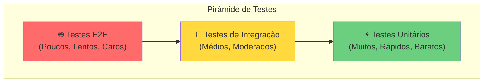
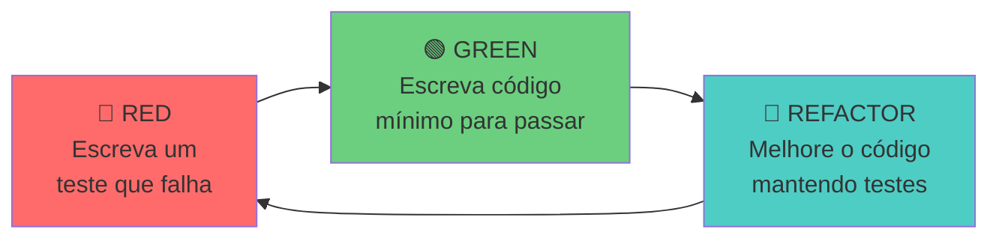
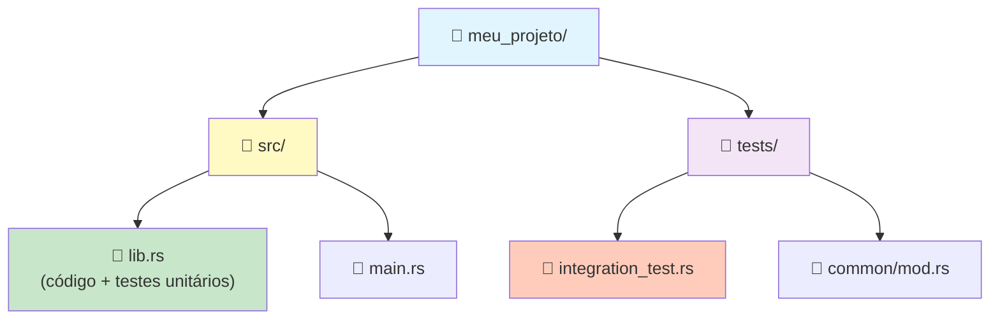
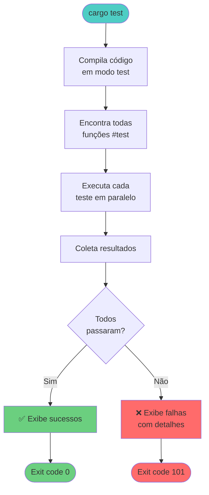

# 🧪 Dia 12: Testes em Rust - Garantindo Qualidade e Confiança

## 📋 Objetivos de Aprendizagem

Ao final desta lição, você será capaz de:

- ✅ **Escrever testes unitários** eficazes usando `#[test]` e assertions
- ✅ **Organizar testes** em módulos com `#[cfg(test)]`
- ✅ **Criar testes de integração** na pasta `tests/`
- ✅ **Aplicar TDD** (Test-Driven Development) no desenvolvimento
- ✅ **Usar cargo test** para executar e filtrar testes
- ✅ **Testar casos extremos** e comportamentos de panic
- ✅ **Desenvolver confiança** na qualidade do seu código

---

## 🎭 Ativação do Conhecimento Prévio

### 🔄 Revisão Rápida

Você já aprendeu sobre:
- **Funções**: blocos de código reutilizáveis
- **Módulos**: organização de código em namespaces
- **Result e Option**: tratamento de erros
- **Validações**: garantir dados corretos

### 🏭 Analogia: O Laboratório de Qualidade

Imagine uma fábrica de eletrônicos:

> **Sem Testes**: Os produtos vão direto da linha de produção para as lojas. Clientes descobrem defeitos. Recalls custosos. Reputação danificada.

> **Com Testes**: Cada produto passa pelo laboratório de qualidade. Defeitos são encontrados antes do envio. Clientes recebem produtos confiáveis. Marca respeitada.

**Testes em programação funcionam da mesma forma!** Eles são seu laboratório de qualidade, garantindo que seu código funciona antes de chegar aos usuários.

### 📖 História Real: O Bug de US$ 125 Milhões

Em 1999, a NASA perdeu a sonda Mars Climate Orbiter porque uma equipe usou unidades imperiais (libras) e outra usou métricas (newtons). **Um simples teste de integração teria detectado isso.**

Testes não são luxo — são **seguro contra desastres**.

---

## 📚 Apresentação do Conteúdo

### 🎯 O Que São Testes?

Testes são **código que verifica se seu código funciona corretamente**. Em Rust, testes são funções especiais marcadas com `#[test]`.

**Benefícios dos Testes:**
- ✅ **Confiança**: Você sabe que seu código funciona
- ✅ **Documentação**: Testes mostram como usar seu código
- ✅ **Refatoração segura**: Mudanças não quebram funcionalidades
- ✅ **Prevenção de regressão**: Bugs corrigidos não voltam
- ✅ **Design melhor**: Código testável é código bem estruturado

---

### 📊 DIAGRAMA 1: Pirâmide de Testes



**Regra de Ouro**: Mais testes unitários (base), menos testes de integração (meio), pouquíssimos testes E2E (topo).

---

### 📊 DIAGRAMA 2: Ciclo TDD (Test-Driven Development)



**TDD**: Escreva o teste **antes** do código. Isso garante que você pensa no design primeiro!

---

### 📊 DIAGRAMA 3: Estrutura de Projeto com Testes



---

### 📊 DIAGRAMA 4: Fluxo de Execução do `cargo test`



---

### 1️⃣ Testes Unitários Básicos

Testes unitários verificam **pequenas unidades de código** (funções, métodos) isoladamente.

```rust {.line-numbers}
// src/lib.rs

/// Soma dois números
pub fn somar(a: i32, b: i32) -> i32 {
    a + b
}

/// Divide dois números
pub fn dividir(a: f64, b: f64) -> Result<f64, String> {
    if b == 0.0 {
        Err(String::from("Divisão por zero"))
    } else {
        Ok(a / b)
    }
}

// Módulo de testes (compilado apenas com 'cargo test')
#[cfg(test)]
mod tests {
    use super::*; // Importa funções do módulo pai

    #[test]
    fn test_somar_positivos() {
        assert_eq!(somar(2, 3), 5);
    }

    #[test]
    fn test_somar_negativos() {
        assert_eq!(somar(-2, -3), -5);
    }

    #[test]
    fn test_somar_zero() {
        assert_eq!(somar(5, 0), 5);
    }

    #[test]
    fn test_dividir_sucesso() {
        let resultado = dividir(10.0, 2.0);
        assert!(resultado.is_ok());
        assert_eq!(resultado.unwrap(), 5.0);
    }

    #[test]
    fn test_dividir_por_zero() {
        let resultado = dividir(10.0, 0.0);
        assert!(resultado.is_err());
        assert_eq!(resultado.unwrap_err(), "Divisão por zero");
    }
}
```

**Anatomia de um Teste:**
1. **`#[test]`**: Marca a função como teste
2. **`#[cfg(test)]`**: Compila o módulo apenas em modo teste
3. **`use super::*`**: Importa itens do módulo pai
4. **Assertions**: Verificam condições

---

### 2️⃣ Assertions: Verificando Condições

Rust oferece várias macros de assertion:

| Macro | Uso | Exemplo |
|-------|-----|---------|
| `assert!(expr)` | Verifica se expressão é `true` | `assert!(x > 0)` |
| `assert_eq!(a, b)` | Verifica igualdade | `assert_eq!(resultado, 42)` |
| `assert_ne!(a, b)` | Verifica desigualdade | `assert_ne!(x, y)` |

```rust {.line-numbers}
#[cfg(test)]
mod tests {
    #[test]
    fn test_assertions() {
        let x = 10;
        
        // assert! - condição booleana
        assert!(x > 5);
        assert!(x < 20);
        
        // assert_eq! - igualdade (mostra valores em caso de falha)
        assert_eq!(x, 10);
        assert_eq!(x * 2, 20);
        
        // assert_ne! - desigualdade
        assert_ne!(x, 5);
        
        // Com mensagens customizadas
        assert!(x > 0, "x deve ser positivo, mas é {}", x);
        assert_eq!(x, 10, "Esperava 10, mas obteve {}", x);
    }
}
```

**💡 Dica**: Use `assert_eq!` e `assert_ne!` sempre que possível — eles mostram os valores comparados quando falham!

---

### 3️⃣ Testando Panics com `#[should_panic]`

Às vezes, você **quer** que o código entre em panic em certas situações:

```rust {.line-numbers}
pub fn dividir_inteiros(a: i32, b: i32) -> i32 {
    if b == 0 {
        panic!("Não é possível dividir por zero!");
    }
    a / b
}

#[cfg(test)]
mod tests {
    use super::*;

    #[test]
    #[should_panic]
    fn test_divisao_por_zero_entra_em_panic() {
        dividir_inteiros(10, 0); // Deve entrar em panic
    }

    #[test]
    #[should_panic(expected = "Não é possível dividir por zero")]
    fn test_panic_com_mensagem_especifica() {
        dividir_inteiros(5, 0);
    }

    #[test]
    fn test_divisao_normal() {
        assert_eq!(dividir_inteiros(10, 2), 5);
    }
}
```

**Quando usar `#[should_panic]`:**
- ✅ Testar validações que devem causar panic
- ✅ Verificar comportamento em situações inválidas
- ❌ **Não use** para controle de fluxo normal (prefira `Result`)

---

### 4️⃣ Testes de Integração

Testes de integração verificam como **múltiplos módulos trabalham juntos**. Ficam na pasta `tests/`:

```rust {.line-numbers}
// tests/integration_test.rs

use meu_projeto::*; // Importa a biblioteca

#[test]
fn test_fluxo_completo() {
    let soma = somar(5, 3);
    let resultado = dividir(soma as f64, 2.0);
    
    assert!(resultado.is_ok());
    assert_eq!(resultado.unwrap(), 4.0);
}

#[test]
fn test_encadeamento_operacoes() {
    let a = somar(10, 5);
    let b = somar(a, 3);
    assert_eq!(b, 18);
}
```

**Diferenças:**
- **Unitários**: Testam funções isoladas (dentro de `src/`)
- **Integração**: Testam a API pública (pasta `tests/`)

---

### 5️⃣ Usando `cargo test`

```bash
# Rodar todos os testes
cargo test

# Rodar testes com nome específico
cargo test somar

# Rodar um teste específico
cargo test test_somar_positivos

# Mostrar output de println! (por padrão é escondido)
cargo test -- --show-output

# Rodar testes em sequência (não paralelo)
cargo test -- --test-threads=1

# Rodar apenas testes de integração
cargo test --test integration_test

# Rodar com output detalhado
cargo test -- --nocapture
```

**Saída típica:**

```
running 5 tests
test tests::test_somar_positivos ... ok
test tests::test_somar_negativos ... ok
test tests::test_dividir_sucesso ... ok
test tests::test_dividir_por_zero ... ok
test tests::test_somar_zero ... ok

test result: ok. 5 passed; 0 failed; 0 ignored; 0 measured; 0 filtered out
```

---

### 6️⃣ Padrão AAA: Arrange-Act-Assert

Um bom teste segue três etapas claras:

```rust {.line-numbers}
#[test]
fn test_validar_email() {
    // ARRANGE (Preparar): Configure o cenário
    let email_valido = "usuario@exemplo.com";
    let email_invalido = "usuario@";
    
    // ACT (Agir): Execute a ação
    let resultado_valido = validar_email(email_valido);
    let resultado_invalido = validar_email(email_invalido);
    
    // ASSERT (Verificar): Verifique o resultado
    assert!(resultado_valido);
    assert!(!resultado_invalido);
}
```

**Benefícios:**
- ✅ Testes mais legíveis
- ✅ Intenção clara
- ✅ Fácil manutenção

---

### 7️⃣ Boas Práticas de Nomenclatura

| ❌ Ruim | ✅ Bom |
|---------|--------|
| `test1()` | `test_somar_dois_positivos()` |
| `test_funcao()` | `test_dividir_por_zero_retorna_erro()` |
| `teste()` | `test_email_invalido_sem_arroba()` |

**Padrão recomendado:**
