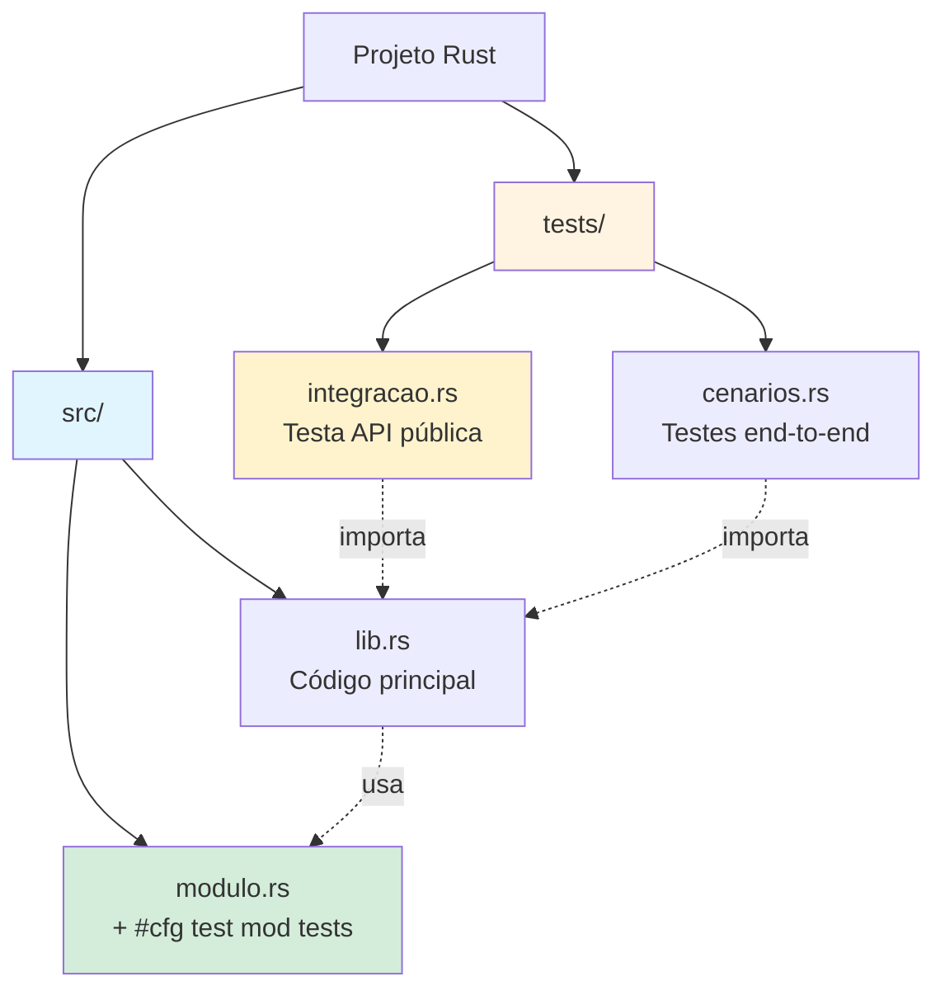
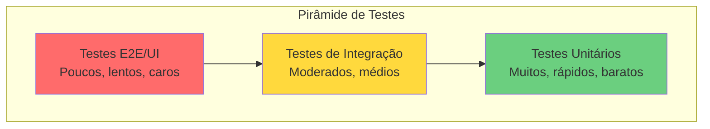
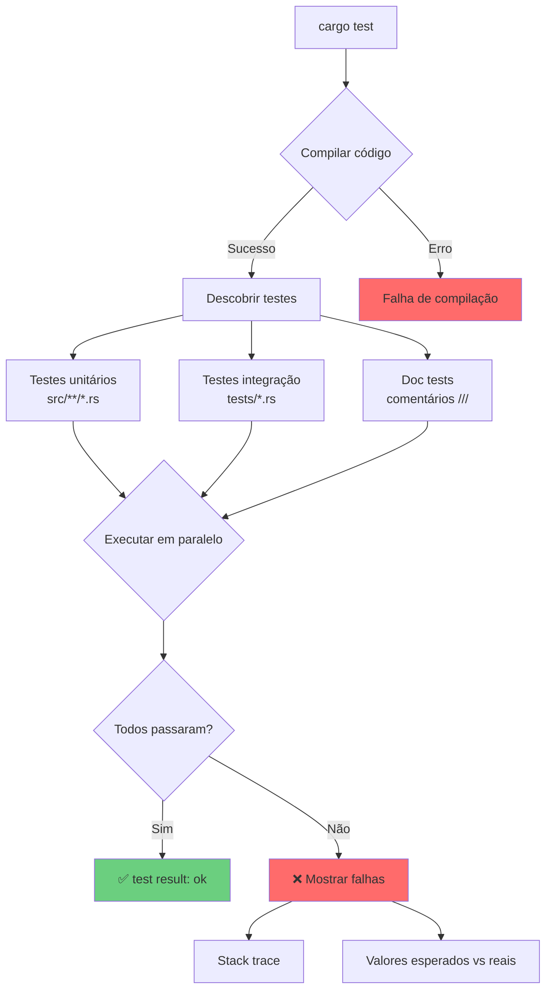
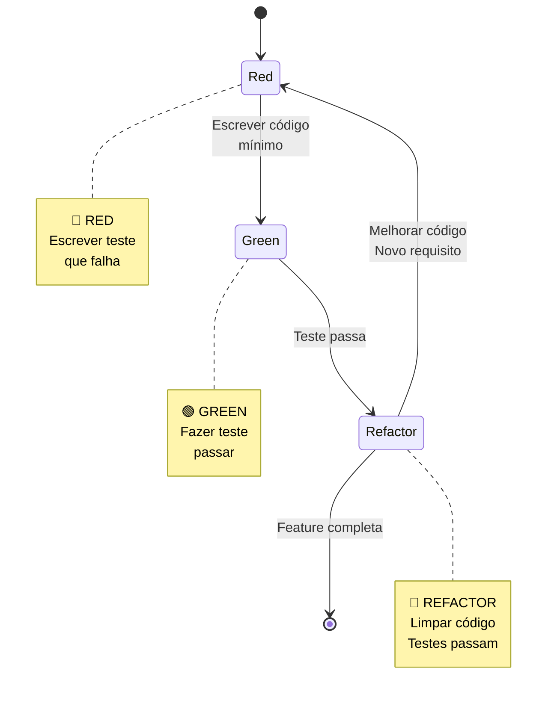

# 🧪 Dia 12: Testes em Rust - Garantindo Qualidade e Confiança

## 📋 Objetivos de Aprendizagem

Ao final desta lição, você será capaz de:

- ✅ **Escrever testes unitários** eficazes usando `#[test]` e assertions
- ✅ **Organizar testes** em módulos apropriados com `#[cfg(test)]`
- ✅ **Criar testes de integração** na pasta `tests/`
- ✅ **Utilizar cargo test** para executar, filtrar e debugar testes
- ✅ **Aplicar TDD** (Test-Driven Development) no desenvolvimento
- ✅ **Garantir qualidade** e confiança no código através de testes abrangentes

---

## 🎭 Ativação do Conhecimento Prévio

### Revisão Rápida

Você já aprendeu sobre:
- **Funções**: blocos de código reutilizáveis que executam tarefas específicas
- **Módulos**: organização de código em namespaces
- **Result e Option**: tratamento de erros e valores opcionais
- **Validações**: verificação de dados (Dia 10)

### 🏭 Analogia: O Laboratório de Qualidade

Imagine uma fábrica de eletrônicos. Antes de enviar produtos aos clientes, cada item passa por um **laboratório de qualidade** onde:

- 🔍 **Testes unitários** = Testar cada componente individualmente (bateria, tela, botões)
- 🔗 **Testes de integração** = Testar como os componentes funcionam juntos
- 📋 **Suite de testes** = Checklist completo de qualidade
- ✅ **Passar nos testes** = Produto aprovado para venda

**Em programação, testes são seu laboratório de qualidade!** Eles garantem que seu código funciona corretamente antes de "enviá-lo" para produção.

### 📖 História Real: O Bug de US$ 125 Milhões

Em 1999, a sonda **Mars Climate Orbiter** da NASA foi perdida porque uma equipe usou unidades imperiais (libras) e outra usou métricas (newtons). Um simples teste de integração teria detectado esse erro e salvado US$ 125 milhões.

**Lição**: Testes não são luxo, são necessidade!

---

## 📚 Apresentação do Conteúdo

### 1️⃣ Testes Unitários: A Base da Qualidade

Testes unitários verificam **pequenas unidades de código** (funções, métodos) isoladamente.

#### Anatomia de um Teste em Rust

```rust {.line-numbers}
// Função a ser testada
fn somar(a: i32, b: i32) -> i32 {
    a + b
}

// Módulo de testes
#[cfg(test)]
mod tests {
    use super::*; // Importa funções do módulo pai

    #[test] // Marca a função como teste
    fn test_somar_positivos() {
        let resultado = somar(2, 3);
        assert_eq!(resultado, 5); // Verifica se é igual
    }

    #[test]
    fn test_somar_negativos() {
        assert_eq!(somar(-2, -3), -5);
    }

    #[test]
    fn test_somar_zero() {
        assert_eq!(somar(0, 0), 0);
    }
}
```

**Componentes essenciais:**
- `#[cfg(test)]` - Compila o módulo apenas durante testes
- `#[test]` - Marca uma função como teste
- `use super::*` - Importa itens do módulo pai
- `assert_eq!` - Verifica igualdade

---

### 2️⃣ Assertions: Verificando Expectativas

Rust oferece três macros principais para assertions:

```rust {.line-numbers}
#[cfg(test)]
mod tests {
    #[test]
    fn test_assertions() {
        // assert! - verifica se expressão é true
        assert!(5 > 3);
        assert!(true);
        
        // assert_eq! - verifica igualdade (mais usado)
        assert_eq!(2 + 2, 4);
        assert_eq!("hello".to_uppercase(), "HELLO");
        
        // assert_ne! - verifica diferença
        assert_ne!(5, 3);
        assert_ne!("rust", "python");
    }

    #[test]
    fn test_assertions_com_mensagens() {
        let x = 10;
        // Mensagem customizada em caso de falha
        assert!(x > 5, "x deveria ser maior que 5, mas é {}", x);
        assert_eq!(x, 10, "x deveria ser 10");
    }
}
```

**Quando usar cada uma:**
- `assert!` → Condições booleanas gerais
- `assert_eq!` → Comparar valores esperados vs reais (mais comum)
- `assert_ne!` → Garantir que valores são diferentes

---

### 3️⃣ Testando Panics: `#[should_panic]`

Às vezes, queremos garantir que o código **deve** entrar em panic em certas situações:

```rust {.line-numbers}
fn dividir(a: i32, b: i32) -> i32 {
    if b == 0 {
        panic!("Divisão por zero!");
    }
    a / b
}

#[cfg(test)]
mod tests {
    use super::*;

    #[test]
    #[should_panic] // Espera que o teste entre em panic
    fn test_divisao_por_zero() {
        dividir(10, 0);
    }

    #[test]
    #[should_panic(expected = "Divisão por zero")] // Verifica mensagem
    fn test_divisao_por_zero_mensagem() {
        dividir(10, 0);
    }

    #[test]
    fn test_divisao_normal() {
        assert_eq!(dividir(10, 2), 5);
    }
}
```

---

### 4️⃣ Testando Result: Testes que Retornam Erros

Testes podem retornar `Result<(), E>` para propagação de erros:

```rust {.line-numbers}
fn processar_numero(s: &str) -> Result<i32, std::num::ParseIntError> {
    s.parse::<i32>()
}

#[cfg(test)]
mod tests {
    use super::*;

    #[test]
    fn test_processar_numero_valido() -> Result<(), std::num::ParseIntError> {
        let resultado = processar_numero("42")?;
        assert_eq!(resultado, 42);
        Ok(())
    }

    #[test]
    fn test_processar_numero_invalido() {
        let resultado = processar_numero("abc");
        assert!(resultado.is_err());
    }
}
```

---

### 5️⃣ Estrutura de Projeto com Testes

```
meu_projeto/
├── Cargo.toml
├── src/
│   ├── lib.rs          # Biblioteca principal
│   ├── main.rs         # Binário (opcional)
│   └── validador.rs    # Módulo com testes unitários
└── tests/              # Testes de integração
    ├── integracao.rs
    └── validacao_completa.rs
```

**Testes Unitários** → Dentro de `src/` com `#[cfg(test)]`  
**Testes de Integração** → Pasta `tests/` (testam a biblioteca como usuário externo)

---

### 📊 DIAGRAMA 1: Estrutura de Projeto com Testes



---

### 📊 DIAGRAMA 2: Pirâmide de Testes



**Princípio**: Mais testes unitários (base), menos testes de integração (meio), poucos testes E2E (topo).

---

### 6️⃣ Testes de Integração

Testes de integração ficam na pasta `tests/` e testam sua biblioteca como um usuário externo:

```rust {.line-numbers}
// tests/integracao.rs
use meu_projeto::validador; // Importa como dependência externa

#[test]
fn test_fluxo_completo_validacao() {
    let email = "usuario@exemplo.com";
    assert!(validador::validar_email(email));
    
    let cpf = "123.456.789-00";
    assert!(validador::validar_cpf(cpf));
}

#[test]
fn test_validacao_em_lote() {
    let emails = vec![
        "valido@test.com",
        "invalido@",
        "outro@valido.com.br"
    ];
    
    let validos: Vec<_> = emails.iter()
        .filter(|e| validador::validar_email(e))
        .collect();
    
    assert_eq!(validos.len(), 2);
}
```

**Diferenças:**
- ❌ Não usam `#[cfg(test)]` (arquivo inteiro é teste)
- ❌ Não usam `use super::*` (importam como crate externo)
- ✅ Testam API pública da biblioteca
- ✅ Cada arquivo é compilado como crate separado

---

### 7️⃣ Cargo Test: Executando Testes

```bash
# Rodar todos os testes
cargo test

# Rodar testes com nome específico
cargo test test_somar

# Rodar testes de um módulo
cargo test tests::validador

# Mostrar output de println! (mesmo em testes que passam)
cargo test -- --show-output

# Rodar testes em sequência (não paralelo)
cargo test -- --test-threads=1

# Rodar apenas testes de integração
cargo test --test integracao

# Rodar com output verboso
cargo test -- --nocapture
```

---

### 📊 DIAGRAMA 3: Fluxo de Execução do Cargo Test



---

### 8️⃣ TDD: Test-Driven Development

**TDD** é uma metodologia onde você escreve testes **antes** do código de produção.

#### Ciclo Red-Green-Refactor

```
🔴 RED    → Escrever teste que falha
🟢 GREEN  → Escrever código mínimo para passar
🔵 REFACTOR → Melhorar código mantendo testes passando
```

---

### 📊 DIAGRAMA 4: Ciclo TDD (Red-Green-Refactor)



---

## 💡 Demonstração e Modelagem

### Exemplo Completo: TDD na Prática

Vamos criar uma função `calcular_media` usando TDD:

#### 🔴 Passo 1: RED - Escrever teste que falha

```rust {.line-numbers}
#[cfg(test)]
mod tests {
    use super::*;

    #[test]
    fn test_media_de_tres_numeros() {
        assert_eq!(calcular_media(&[10.0, 20.0, 30.0]), 20.0);
    }
}

// Função ainda não existe - teste vai falhar!
```

#### 🟢 Passo 2: GREEN - Código mínimo para passar

```rust {.line-numbers}
fn calcular_media(numeros: &[f64]) -> f64 {
    let soma: f64 = numeros.iter().sum();
    soma / numeros.len() as f64
}

#[cfg(test)]
mod tests {
    use super::*;

    #[test]
    fn test_media_de_tres_numeros() {
        assert_eq!(calcular_media(&[10.0, 20.0, 30.0]), 20.0);
    }
}

// ✅ Teste passa!
```

#### 🔴 Passo 3: RED - Adicionar teste para edge case

```rust {.line-numbers}
#[cfg(test)]
mod tests {
    use super::*;

    #[test]
    fn test_media_de_tres_numeros() {
        assert_eq!(calcular_media(&[10.0, 20.0, 30.0]), 20.0);
    }

    #[test]
    fn test_media_lista_vazia() {
        assert!(calcular_media(&[]).is_nan());
    }
}

// ❌ Teste falha - divisão por zero!
```

#### 🟢 Passo 4: GREEN - Corrigir para passar

```rust {.line-numbers}
fn calcular_media(numeros: &[f64]) -> f64 {
    if numeros.is_empty() {
        return f64::NAN;
    }
    let soma: f64 = numeros.iter().sum();
    soma / numeros.len() as f64
}

// ✅ Todos os testes passam!
```

#### 🔵 Passo 5: REFACTOR - Melhorar código

```rust {.line-numbers}
fn calcular_media(numeros: &[f64]) -> f64 {
    match numeros.len() {
        0 => f64::NAN,
        n => numeros.iter().sum::<f64>() / n as f64,
    }
}

// ✅ Código mais limpo, testes ainda passam!
```

---

### Pattern AAA: Arrange-Act-Assert

Estrutura recomendada para testes claros:

```rust {.line-numbers}
#[test]
fn test_adicionar_item_carrinho() {
    // ARRANGE - Preparar dados
    let mut carrinho = Carrinho::new();
    let produto = Produto::new("Notebook", 3000.0);
    
    // ACT - Executar ação
    carrinho.adicionar(produto);
    
    // ASSERT - Verificar resultado
    assert_eq!(carrinho.total(), 3000.0);
    assert_eq!(carrinho.quantidade_itens(), 1);
}
```

---

### Bons vs Maus Testes

#### ❌ Teste Ruim

```rust {.line-numbers}
#[test]
fn test() {
    let x = funcao(1, 2, 3, 4, 5);
    assert!(x > 0);
}
```

**Problemas:**
- Nome genérico
- Não fica claro o que está testando
- Assertion vaga

#### ✅ Teste Bom

```rust {.line-numbers}
#[test]
fn test_calcular_desconto_retorna_valor_positivo_para_preco_valido() {
    // Arrange
    let preco = 100.0;
    let percentual = 10.0;
    
    // Act
    let desconto = calcular_desconto(preco, percentual);
    
    // Assert
    assert_eq!(desconto, 10.0);
    assert!(desconto > 0.0, "Desconto deve ser positivo");
}
```

**Qualidades:**
- Nome descritivo
- Estrutura AAA clara
- Assertions específicas
- Mensagens de erro úteis

---

### Padrões de Nomenclatura

```rust {.line-numbers}
#[cfg(test)]
mod tests {
    use super::*;

    // Padrão: test_<funcao>_<cenario>_<resultado_esperado>
    
    #[test]
    fn test_validar_email_com_formato_valido_retorna_true() {
        assert!(validar_email("user@example.com"));
    }

    #[test]
    fn test_validar_email_sem_arroba_retorna_false() {
        assert!(!validar_email("userexample.com"));
    }

    #[test]
    fn test_validar_email_vazio_retorna_false() {
        assert!(!validar_email(""));
    }

    // Alternativa: given_when_then
    #[test]
    fn given_email_valido_when_validar_then_retorna_true() {
        assert!(validar_email("test@test.com"));
    }
}
```

---

### Edge Cases e Testes Negativos

Sempre teste:

```rust {.line-numbers}
#[cfg(test)]
mod tests {
    use super::*;

    // ✅ Casos válidos (happy path)
    #[test]
    fn test_casos_validos() {
        assert_eq!(dividir(10, 2), 5);
        assert_eq!(dividir(100, 10), 10);
    }

    // ⚠️ Edge cases (limites)
    #[test]
    fn test_edge_cases() {
        assert_eq!(dividir(0, 5), 0);
        assert_eq!(dividir(1, 1), 1);
        assert_eq!(dividir(-10, 2), -5);
    }

    // ❌ Casos inválidos (testes negativos)
    #[test]
    #[should_panic]
    fn test_casos_invalidos() {
        dividir(10, 0);
    }

    // 🔄 Casos extremos
    #[test]
    fn test_valores_extremos() {
        assert_eq!(dividir(i32::MAX, 1), i32::MAX);
        assert_eq!(dividir(i32::MIN, 1), i32::MIN);
    }
}
```

---

## 🎯 Prática Guiada: Suite de Testes para Validador

### 📝 Exercício Completo

**Contexto**: Você desenvolveu funções de validação no Dia 10. Agora vamos garantir que elas funcionam perfeitamente através de uma suite de testes abrangente.

**Objetivo**: Criar testes unitários completos para funções de validação, cobrindo casos válidos, inválidos e edge cases.

---

### Passo 1: Estrutura Base

Crie o arquivo `src/validador.rs`:

```rust {.line-numbers}
// src/validador.rs

/// Valida formato de email
pub fn validar_email(email: &str) -> bool {
    if email.is_empty() {
        return false;
    }
    
    let partes: Vec<&str> = email.split('@').collect();
    if partes.len() != 2 {
        return false;
    }
    
    let (local, dominio) = (partes[0], partes[1]);
    
    !local.is_empty() && 
    !dominio.is_empty() && 
    dominio.contains('.')
}

/// Valida CPF (formato simplificado)
pub fn validar_cpf(cpf: &str) -> bool {
    let apenas_numeros: String = cpf.chars()
        .filter(|c| c.is_numeric())
        .collect();
    
    apenas_numeros.len() == 11
}

/// Valida senha forte
pub fn validar_senha_forte(senha: &str) -> bool {
    if senha.len() < 8 {
        return false;
    }
    
    let tem_maiuscula = senha.chars().any(|c| c.is_uppercase());
    let tem_minuscula = senha.chars().any(|c| c.is_lowercase());
    let tem_numero = senha.chars().any(|c| c.is_numeric());
    let tem_especial = senha.chars().any(|c| !c.is_alphanumeric());
    
    tem_maiuscula && tem_minuscula && tem_numero && tem_especial
}

/// Valida telefone brasileiro
pub fn validar_telefone(telefone: &str) -> bool {
    let apenas_numeros: String = telefone.chars()
        .filter(|c| c.is_numeric())
        .collect();
    
    apenas_numeros.len() == 10 || apenas_numeros.len() == 11
}

// ============================================
// 🧪 MÓDULO DE TESTES
// ============================================

#[cfg(test)]
mod tests {
    use super::*;

    // ========================================
    // TESTES: validar_email
    // ========================================

    #[test]
    fn test_validar_email_formato_valido_simples() {
        assert!(validar_email("usuario@exemplo.com"));
    }

    #[test]
    fn test_validar_email_formato_valido_com_subdominio() {
        assert!(validar_email("usuario@mail.exemplo.com"));
    }

    #[test]
    fn test_validar_email_formato_valido_com_numeros() {
        assert!(validar_email("usuario123@exemplo.com"));
    }

    #[test]
    fn test_validar_email_sem_arroba_retorna_false() {
        assert!(!validar_email("usuarioexemplo.com"));
    }

    #[test]
    fn test_validar_email_sem_dominio_retorna_false() {
        assert!(!validar_email("usuario@"));
    }

    #[test]
    fn test_validar_email_sem_local_retorna_false() {
        assert!(!validar_email("@exemplo.com"));
    }

    #[test]
    fn test_validar_email_vazio_retorna_false() {
        assert!(!validar_email(""));
    }

    #[test]
    fn test_validar_email_sem_ponto_no_dominio_retorna_false() {
        assert!(!validar_email("usuario@exemplo"));
    }

    #[test]
    fn test_validar_email_multiplos_arrobas_retorna_false() {
        assert!(!validar_email("usuario@@exemplo.com"));
    }

    // ========================================
    // TESTES: validar_cpf
    // ========================================

    #[test]
    fn test_validar_cpf_formato_com_pontos_e_traco() {
        assert!(validar_cpf("123.456.789-00"));
    }

    #[test]
    fn test_validar_cpf_formato_apenas_numeros() {
        assert!(validar_cpf("12345678900"));
    }

    #[test]
    fn test_validar_cpf_com_espacos_retorna_false() {
        assert!(!validar_cpf("123 456 789 00"));
    }

    #[test]
    fn test_validar_cpf_com_menos_digitos_retorna_false() {
        assert!(!validar_cpf("123.456.789"));
    }

    #[test]
    fn test_validar_cpf_com_mais_digitos_retorna_false() {
        assert!(!validar_cpf("123.456.789-001"));
    }

    #[test]
    fn test_validar_cpf_vazio_retorna_false() {
        assert!(!validar_cpf(""));
    }

    #[test]
    fn test_validar_cpf_com_letras_retorna_false() {
        assert!(!validar_cpf("123.456.789-0A"));
    }

    // ========================================
    // TESTES: validar_senha_forte
    // ========================================

    #[test]
    fn test_validar_senha_forte_com_todos_requisitos() {
        assert!(validar_senha_forte("Senh@123"));
    }

    #[test]
    fn test_validar_senha_forte_complexa() {
        assert!(validar_senha_forte("C0mpl3x@Pass!"));
    }

    #[test]
    fn test_validar_senha_sem_maiuscula_retorna_false() {
        assert!(!validar_senha_forte("senh@123"));
    }

    #[test]
    fn test_validar_senha_sem_minuscula_retorna_false() {
        assert!(!validar_senha_forte("SENH@123"));
    }

    #[test]
    fn test_validar_senha_sem_numero_retorna_false() {
        assert!(!validar_senha_forte("Senh@abc"));
    }

    #[test]
    fn test_validar_senha_sem_especial_retorna_false() {
        assert!(!validar_senha_forte("Senha123"));
    }

    #[test]
    fn test_validar_senha_muito_curta_retorna_false() {
        assert!(!validar_senha_forte("Se@1"));
    }

    #[test]
    fn test_validar_senha_vazia_retorna_false() {
        assert!(!validar_senha_forte(""));
    }

    #[test]
    fn test_validar_senha_exatamente_8_caracteres() {
        assert!(validar_senha_forte("Senh@123"));
    }

    // ========================================
    // TESTES: validar_telefone
    // ========================================

    #[test]
    fn test_validar_telefone_fixo_com_formatacao() {
        assert!(validar_telefone("(11) 3333-4444"));
    }

    #[test]
    fn test_validar_telefone_celular_com_formatacao() {
        assert!(validar_telefone("(11) 98888-7777"));
    }

    #[test]
    fn test_validar_telefone_apenas_numeros_10_digitos() {
        assert!(validar_telefone("1133334444"));
    }

    #[test]
    fn test_validar_telefone_apenas_numeros_11_digitos() {
        assert!(validar_telefone("11988887777"));
    }

    #[test]
    fn test_validar_telefone_com_menos_digitos_retorna_false() {
        assert!(!validar_telefone("11 3333-444"));
    }

    #[test]
    fn test_validar_telefone_com_mais_digitos_retorna_false() {
        assert!(!validar_telefone("11 98888-77777"));
    }

    #[test]
    fn test_validar_telefone_vazio_retorna_false() {
        assert!(!validar_telefone(""));
    }
}
```

---

### Passo 2: Executar os Testes

```bash
cargo test
```

**Saída esperada:**

```
running 30 tests
test tests::test_validar_cpf_com_espacos_retorna_false ... ok
test tests::test_validar_cpf_com_letras_retorna_false ... ok
test tests::test_validar_cpf_com_mais_digitos_retorna_false ... ok
test tests::test_validar_cpf_com_menos_digitos_retorna_false ... ok
test tests::test_validar_cpf_formato_apenas_numeros ... ok
test tests::test_validar_cpf_formato_com_pontos_e_traco ... ok
test tests::test_validar_cpf_vazio_retorna_false ... ok
test tests::test_validar_email_formato_valido_com_numeros ... ok
test tests::test_validar_email_formato_valido_com_subdominio ... ok
test tests::test_validar_email_formato_valido_simples ... ok
test tests::test_validar_email_multiplos_arrobas_retorna_false ... ok
test tests::test_validar_email_sem_arroba_retorna_false ... ok
test tests::test_validar_email_sem_dominio_retorna_false ... ok
test tests::test_validar_email_sem_local_retorna_false ... ok
test tests::test_validar_email_sem_ponto_no_dominio_retorna_false ... ok
test tests::test_validar_email_vazio_retorna_false ... ok
test tests::test_validar_senha_exatamente_8_caracteres ... ok
test tests::test_validar_senha_forte_com_todos_requisitos ... ok
test tests::test_validar_senha_forte_complexa ... ok
test tests::test_validar_senha_muito_curta_retorna_false ... ok
test tests::test_validar_senha_sem_especial_retorna_false ... ok
test tests::test_validar_senha_sem_maiuscula_retorna_false ... ok
test tests::test_validar_senha_sem_minuscula_retorna_false ... ok
test tests::test_validar_senha_sem_numero_retorna_false ... ok
test tests::test_validar_senha_vazia_retorna_false ... ok
test tests::test_validar_telefone_apenas_numeros_10_digitos ... ok
test tests::test_validar_telefone_apenas_numeros_11_digitos ... ok
test tests::test_validar_telefone_celular_com_formatacao ... ok
test tests::test_validar_telefone_com_mais_digitos_retorna_false ... ok
test tests::test_validar_telefone_com_menos_digitos_retorna_false ... ok

test result: ok. 30 passed; 0 failed; 0 ignored; 0 measured; 0 filtered out
```

---

### Passo 3: Testar Casos Específicos

```bash
# Testar apenas validação de email
cargo test validar_email

# Testar apenas casos que devem retornar false
cargo test retorna_false

# Mostrar output de println! nos testes
cargo test -- --show-output
```

---

### 🎓 Extensões (Desafios Extras)

#### 1. Adicionar Doc Tests

```rust {.line-numbers}
/// Valida formato de email
///
/// # Exemplos
///
/// ```
/// use meu_projeto::validador::validar_email;
///
/// assert!(validar_email("usuario@exemplo.com"));
/// assert!(!validar_email("invalido"));
/// ```
pub fn validar_email(email: &str) -> bool {
    // ... implementação
}
```

Execute com:
```bash
cargo test --doc
```

#### 2. Criar Teste de Integração

Crie `tests/validacao_completa.rs`:

```rust {.line-numbers}
use meu_projeto::validador;

#[test]
fn test_fluxo_cadastro_completo() {
    let email = "usuario@exemplo.com";
    let cpf = "123.456.789-00";
    let senha = "Senh@123";
    let telefone = "(11) 98888-7777";
    
    assert!(validador::validar_email(email), "Email inválido");
    assert!(validador::validar_cpf(cpf), "CPF inválido");
    assert!(validador::validar_senha_forte(senha), "Senha fraca");
    assert!(validador::validar_telefone(telefone), "Telefone inválido");
}
```

---

## 🔄 Feedback e Avaliação

### ✅ Checklist de Boas Práticas

Seus testes devem:

- [ ] **Ter nomes descritivos** que explicam o cenário
- [ ] **Seguir padrão AAA** (Arrange-Act-Assert)
- [ ] **Testar um comportamento por vez**
- [ ] **Ser independentes** (não dependem da ordem)
- [ ] **Ser rápidos** (executam em milissegundos)
- [ ] **Cobrir casos válidos** (happy path)
- [ ] **Cobrir casos inválidos** (testes negativos)
- [ ] **Cobrir edge cases** (limites, vazios, extremos)
- [ ] **Usar assertions apropriadas** (assert_eq!, assert!, assert_ne!)
- [ ] **Incluir mensagens de erro** quando útil

---

### 🚫 Erros Comuns em Testes

#### ❌ Erro 1: Testes Dependentes

```rust {.line-numbers}
// ❌ RUIM - Testes dependem de ordem de execução
static mut CONTADOR: i32 = 0;

#[test]
fn test_incrementar() {
    unsafe {
        CONTADOR += 1;
        assert_eq!(CONTADOR, 1);
    }
}

#[test]
fn test_incrementar_novamente() {
    unsafe {
        CONTADOR += 1;
        assert_eq!(CONTADOR, 2); // ❌ Falha se rodar isolado!
    }
}
```

```rust {.line-numbers}
// ✅ BOM - Testes independentes
#[test]
fn test_incrementar() {
    let mut contador = 0;
    contador += 1;
    assert_eq!(contador, 1);
}

#[test]
fn test_incrementar_novamente() {
    let mut contador = 0;
    contador += 1;
    assert_eq!(contador, 1);
}
```

---

#### ❌ Erro 2: Testar Múltiplos Comportamentos

```rust {.line-numbers}
// ❌ RUIM - Testa muitas coisas ao mesmo tempo
#[test]
fn test_validacoes() {
    assert!(validar_email("test@test.com"));
    assert!(validar_cpf("123.456.789-00"));
    assert!(validar_senha_forte("Senh@123"));
    // Se o primeiro falhar, não sabemos se os outros funcionam!
}
```

```rust {.line-numbers}
// ✅ BOM - Um teste por comportamento
#[test]
fn test_validar_email_formato_valido() {
    assert!(validar_email("test@test.com"));
}

#[test]
fn test_validar_cpf_formato_valido() {
    assert!(validar_cpf("123.456.789-00"));
}

#[test]
fn test_validar_senha_forte_formato_valido() {
    assert!(validar_senha_forte("Senh@123"));
}
```

---

#### ❌ Erro 3: Nomes Genéricos

```rust {.line-numbers}
// ❌ RUIM - Nome não diz nada
#[test]
fn test1() {
    assert_eq!(somar(2, 2), 4);
}

#[test]
fn test_funcao() {
    assert!(validar_email("test@test.com"));
}
```

```rust {.line-numbers}
// ✅ BOM - Nomes descritivos
#[test]
fn test_somar_dois_numeros_positivos_retorna_soma_correta() {
    assert_eq!(somar(2, 2), 4);
}

#[test]
fn test_validar_email_com_formato_valido_retorna_true() {
    assert!(validar_email("test@test.com"));
}
```

---

#### ❌ Erro 4: Não Testar Edge Cases

```rust {.line-numbers}
// ❌ RUIM - Só testa caso feliz
#[test]
fn test_dividir() {
    assert_eq!(dividir(10, 2), 5);
}
```

```rust {.line-numbers}
// ✅ BOM - Testa edge cases
#[test]
fn test_dividir_numeros_positivos() {
    assert_eq!(dividir(10, 2), 5);
}

#[test]
fn test_dividir_por_um() {
    assert_eq!(dividir(10, 1), 10);
}

#[test]
fn test_dividir_zero() {
    assert_eq!(dividir(0, 5), 0);
}

#[test]
#[should_panic(expected = "divisão por zero")]
fn test_dividir_por_zero_entra_em_panic() {
    dividir(10, 0);
}

#[test]
fn test_dividir_numeros_negativos() {
    assert_eq!(dividir(-10, 2), -5);
}
```

---

#### ❌ Erro 5: Assertions Vagas

```rust {.line-numbers}
// ❌ RUIM - Assertion não específica
#[test]
fn test_calcular_preco() {
    let preco = calcular_preco_com_desconto(100.0, 10.0);
    assert!(preco > 0.0); // Muito vago!
}
```

```rust {.line-numbers}
// ✅ BOM - Assertion específica
#[test]
fn test_calcular_preco_com_10_porcento_desconto() {
    let preco = calcular_preco_com_desconto(100.0, 10.0);
    assert_eq!(preco, 90.0);
}
```

---

#### ❌ Erro 6: Não Usar Mensagens de Erro

```rust {.line-numbers}
// ❌ RUIM - Sem contexto quando falha
#[test]
fn test_validar_idade() {
    let idade = 17;
    assert!(idade >= 18);
}
```

```rust {.line-numbers}
// ✅ BOM - Mensagem clara
#[test]
fn test_validar_idade_minima_para_cadastro() {
    let idade = 17;
    assert!(
        idade >= 18,
        "Idade {} é menor que o mínimo permitido (18)",
        idade
    );
}
```

---

### 📝 Quiz: Teste Seus Conhecimentos

#### Questão 1: Qual macro usar?

Você quer verificar se dois valores são **diferentes**. Qual macro usar?

a) `assert!(a != b)`  
b) `assert_eq!(a, b)`  
c) `assert_ne!(a, b)`  
d) `assert_diff!(a, b)`

<details>
<summary>👉 Ver resposta</summary>

**Resposta: c) `assert_ne!(a, b)`**

`assert_ne!` é específica para verificar diferença e fornece mensagens de erro melhores.
</details>

---

#### Questão 2: Onde colocar testes unitários?

a) Sempre na pasta `tests/`  
b) Em um arquivo separado `tests.rs`  
c) No mesmo arquivo, dentro de `#[cfg(test)] mod tests`  
d) Em qualquer lugar do código

<details>
<summary>👉 Ver resposta</summary>

**Resposta: c) No mesmo arquivo, dentro de `#[cfg(test)] mod tests`**

Testes unitários ficam no mesmo arquivo do código que testam, dentro de um módulo marcado com `#[cfg(test)]`.
</details>

---

#### Questão 3: O que faz `#[should_panic]`?

a) Faz o teste falhar  
b) Espera que o código entre em panic  
c) Previne panics no teste  
d) Ignora o teste

<details>
<summary>👉 Ver resposta</summary>

**Resposta: b) Espera que o código entre em panic**

`#[should_panic]` marca que o teste **deve** entrar em panic para passar. Útil para testar validações de erro.
</details>

---

#### Questão 4: Qual é a ordem correta do padrão AAA?

a) Assert - Act - Arrange  
b) Arrange - Assert - Act  
c) Arrange - Act - Assert  
d) Act - Arrange - Assert

<details>
<summary>👉 Ver resposta</summary>

**Resposta: c) Arrange - Act - Assert**

1. **Arrange**: Preparar dados
2. **Act**: Executar ação
3. **Assert**: Verificar resultado
</details>

---

#### Questão 5: Qual comando mostra output de `println!` nos testes?

a) `cargo test --verbose`  
b) `cargo test --show-output`  
c) `cargo test -- --show-output`  
d) `cargo test --print`

<details>
<summary>👉 Ver resposta</summary>

**Resposta: c) `cargo test -- --show-output`**

O `--` separa argumentos do cargo dos argumentos do test runner.
</details>

---

### 🎯 Auto-Avaliação

Avalie seu entendimento (1-5):

| Conceito | ⭐ Não entendi | ⭐⭐ Entendi pouco | ⭐⭐⭐ Entendi bem | ⭐⭐⭐⭐ Domino | ⭐⭐⭐⭐⭐ Posso ensinar |
|----------|---------------|-------------------|------------------|--------------|---------------------|
| `#[test]` e `#[cfg(test)]` | | | | | |
| Assertions (assert!, assert_eq!, assert_ne!) | | | | | |
| `#[should_panic]` | | | | | |
| Testes de integração | | | | | |
| cargo test | | | | | |
| TDD (Red-Green-Refactor) | | | | | |
| Padrão AAA | | | | | |
| Edge cases | | | | | |

**Meta**: Alcançar pelo menos ⭐⭐⭐ em todos os conceitos antes de avançar.

---

## 🚀 Transferência e Aplicação

### 🎯 Desafio 1: Testar Projeto do Dia 11

Volte ao projeto de gerenciamento que você criou no Dia 11 e adicione testes completos:

```rust {.line-numbers}
// Exemplo: Se você fez um gerenciador de tarefas

#[cfg(test)]
mod tests {
    use super::*;

    #[test]
    fn test_adicionar_tarefa() {
        let mut gerenciador = GerenciadorTarefas::new();
        gerenciador.adicionar("Estudar Rust");
        assert_eq!(gerenciador.total(), 1);
    }

    #[test]
    fn test_remover_tarefa_existente() {
        let mut gerenciador = GerenciadorTarefas::new();
        gerenciador.adicionar("Tarefa 1");
        assert!(gerenciador.remover(0).is_ok());
        assert_eq!(gerenciador.total(), 0);
    }

    #[test]
    fn test_remover_tarefa_inexistente_retorna_erro() {
        let mut gerenciador = GerenciadorTarefas::new();
        assert!(gerenciador.remover(0).is_err());
    }

    #[test]
    fn test_listar_tarefas_vazias() {
        let gerenciador = GerenciadorTarefas::new();
        assert_eq!(gerenciador.listar().len(), 0);
    }

    #[test]
    fn test_marcar_tarefa_como_concluida() {
        let mut gerenciador = GerenciadorTarefas::new();
        gerenciador.adicionar("Tarefa");
        gerenciador.concluir(0);
        assert!(gerenciador.esta_concluida(0));
    }
}
```

**Checklist do Desafio:**
- [ ] Criar módulo `#[cfg(test)]`
- [ ] Testar todas as funções principais
- [ ] Incluir testes de casos válidos
- [ ] Incluir testes de casos inválidos
- [ ] Testar edge cases (listas vazias, índices inválidos)
- [ ] Usar nomes descritivos
- [ ] Seguir padrão AAA
- [ ] Executar `cargo test` e garantir 100% de sucesso

---

### 🎯 Desafio 2: TDD - Calculadora de IMC

Pratique TDD criando uma calculadora de IMC (Índice de Massa Corporal):

**Requisitos:**
- Função `calcular_imc(peso: f64, altura: f64) -> Result<f64, String>`
- Fórmula: IMC = peso / (altura²)
- Validações:
  - Peso deve ser > 0
  - Altura deve ser > 0
  - Altura deve estar em metros (0.5 a 2.5)

**Passo a passo TDD:**

#### 🔴 RED - Escreva o teste primeiro

```rust {.line-numbers}
#[cfg(test)]
mod tests {
    use super::*;

    #[test]
    fn test_calcular_imc_valores_normais() {
        let resultado = calcular_imc(70.0, 1.75).unwrap();
        assert_eq!(resultado, 22.86); // Arredondado
    }
}

// Função ainda não existe - vai falhar!
```

#### 🟢 GREEN - Implemente o mínimo

```rust {.line-numbers}
fn calcular_imc(peso: f64, altura: f64) -> Result<f64, String> {
    Ok(peso / (altura * altura))
}
```

#### 🔴 RED - Adicione teste de validação

```rust {.line-numbers}
#[test]
fn test_calcular_imc_peso_zero_retorna_erro() {
    let resultado = calcular_imc(0.0, 1.75);
    assert!(resultado.is_err());
}
```

#### 🟢 GREEN - Adicione validação

```rust {.line-numbers}
fn calcular_imc(peso: f64, altura: f64) -> Result<f64, String> {
    if peso <= 0.0 {
        return Err("Peso deve ser maior que zero".to_string());
    }
    Ok(peso / (altura * altura))
}
```

**Continue o ciclo para:**
- Validar altura <= 0
- Validar altura fora do intervalo (0.5 - 2.5)
- Arredondar resultado para 2 casas decimais
- Testar valores extremos

---

### 🎯 Desafio 3: Suite Completa para Biblioteca

Crie uma mini-biblioteca de funções matemáticas com testes completos:

```rust {.line-numbers}
// src/matematica.rs

pub fn fatorial(n: u32) -> u64 {
    // TODO: Implementar
}

pub fn fibonacci(n: u32) -> u64 {
    // TODO: Implementar
}

pub fn eh_primo(n: u32) -> bool {
    // TODO: Implementar
}

pub fn mdc(a: u32, b: u32) -> u32 {
    // TODO: Implementar (Máximo Divisor Comum)
}

#[cfg(test)]
mod tests {
    use super::*;

    // TODO: Adicionar pelo menos 20 testes cobrindo:
    // - Casos válidos
    // - Edge cases (0, 1, números grandes)
    // - Casos inválidos
}
```

---

### 📚 Preparação para o Dia 13

No próximo dia, você aprenderá sobre **Traits e Generics**. Os testes serão essenciais para:

- Testar implementações de traits
- Verificar comportamento genérico
- Garantir que tipos diferentes funcionam corretamente

**Pré-requisito**: Certifique-se de que domina:
- ✅ Escrever testes unitários
- ✅ Usar assertions corretamente
- ✅ Organizar testes em módulos
- ✅ Executar e filtrar testes com cargo

---

### 🔗 Recursos Complementares

#### 📖 Documentação Oficial
- [The Rust Book - Chapter 11: Writing Automated Tests](https://doc.rust-lang.org/book/ch11-00-testing.html)
- [Rust By Example - Testing](https://doc.rust-lang.org/rust-by-example/testing.html)
- [cargo test documentation](https://doc.rust-lang.org/cargo/commands/cargo-test.html)

#### 🎥 Vídeos Recomendados
- "Testing in Rust" - Jon Gjengset
- "Test-Driven Development in Rust" - Rust Official Channel

#### 📚 Leitura Adicional
- "Test-Driven Development: By Example" - Kent Beck
- "The Art of Unit Testing" - Roy Osherove

#### 🛠️ Ferramentas Úteis
- **cargo-tarpaulin**: Cobertura de código
  ```bash
  cargo install cargo-tarpaulin
  cargo tarpaulin --out Html
  ```

- **cargo-watch**: Rodar testes automaticamente
  ```bash
  cargo install cargo-watch
  cargo watch -x test
  ```

- **cargo-nextest**: Test runner mais rápido
  ```bash
  cargo install cargo-nextest
  cargo nextest run
  ```

---

## 🎓 Resumo do Dia 12

### ✅ O Que Você Aprendeu

1. **Testes Unitários**
   - Usar `#[test]` para marcar testes
   - Organizar em módulos `#[cfg(test)]`
   - Importar código com `use super::*`

2. **Assertions**
   - `assert!` para condições booleanas
   - `assert_eq!` para igualdade
   - `assert_ne!` para diferença
   - Mensagens customizadas

3. **Testes Especiais**
   - `#[should_panic]` para testar panics
   - Testes que retornam `Result<(), E>`

4. **Testes de Integração**
   - Pasta `tests/` para testes externos
   - Testar API pública da biblioteca

5. **Cargo Test**
   - Executar todos os testes
   - Filtrar por nome
   - Mostrar output
   - Controlar paralelismo

6. **TDD (Test-Driven Development)**
   - Ciclo Red-Green-Refactor
   - Escrever testes antes do código
   - Refatorar com confiança

7. **Boas Práticas**
   - Padrão AAA (Arrange-Act-Assert)
   - Nomes descritivos
   - Testar edge cases
   - Testes independentes
   - Um comportamento por teste

### 🎯 Conceitos-Chave

> **"Testes não são sobre encontrar bugs, são sobre prevenir bugs."**

- 🧪 **Testes dão confiança** para refatorar e evoluir código
- 🔒 **Testes são documentação viva** que sempre está atualizada
- 🚀 **TDD melhora design** forçando você a pensar na interface primeiro
- 📊 **Pirâmide de testes**: muitos unitários, alguns integração, poucos E2E
- ✅ **Edge cases são críticos**: sempre teste limites, vazios e extremos

### 💪 Habilidades Desenvolvidas

- [x] Escrever testes unitários eficazes
- [x] Usar assertions apropriadamente
- [x] Testar casos válidos, inválidos e edge cases
- [x] Organizar testes em módulos
- [x] Criar testes de integração
- [x] Executar e filtrar testes
- [x] Aplicar TDD no desenvolvimento
- [x] Seguir boas práticas de testes

---

## 🎉 Parabéns!

Você completou o **Dia 12** e agora possui uma habilidade **essencial** para qualquer desenvolvedor profissional: **escrever testes automatizados**.

### 🌟 Próximos Passos

1. ✅ **Pratique**: Adicione testes a todos os projetos anteriores
2. 🔄 **Adote TDD**: Tente escrever testes antes do código
3. 📊 **Meça cobertura**: Use ferramentas para ver quanto código está testado
4. 🚀 **Avance**: Prepare-se para Traits e Generics no Dia 13

### 💡 Reflexão Final

> **"Código sem testes é código legado desde o primeiro dia."**  
> — Michael Feathers

Testes não são um luxo ou algo "para depois". São parte fundamental do desenvolvimento profissional. Com testes, você:

- ✅ **Dorme tranquilo** sabendo que mudanças não quebram funcionalidades
- ✅ **Refatora com confiança** sem medo de introduzir bugs
- ✅ **Documenta comportamento** de forma executável
- ✅ **Acelera desenvolvimento** no longo prazo
- ✅ **Entrega qualidade** consistente

---

## 📝 Checklist Final do Dia 12

Antes de avançar para o Dia 13, certifique-se de que:

- [ ] Entendo o que são testes unitários e por que são importantes
- [ ] Sei usar `#[test]` e `#[cfg(test)]`
- [ ] Conheço as três assertions principais (assert!, assert_eq!, assert_ne!)
- [ ] Sei quando usar `#[should_panic]`
- [ ] Entendo a diferença entre testes unitários e de integração
- [ ] Sei executar testes com `cargo test`
- [ ] Conheço o ciclo TDD (Red-Green-Refactor)
- [ ] Sei aplicar o padrão AAA (Arrange-Act-Assert)
- [ ] Completei o exercício da suite de testes para validador
- [ ] Adicionei testes ao projeto do Dia 11
- [ ] Pratiquei TDD com a calculadora de IMC

### 🎯 Meta de Qualidade

**Objetivo**: A partir de agora, **todo código que você escrever deve ter testes**.

Não é sobre perfeição, é sobre **hábito e disciplina**. Comece simples:
- 1 teste por função
- Casos válidos e inválidos
- Edge cases principais

Com o tempo, escrever testes se tornará natural e você não conseguirá mais programar sem eles!

---

**🚀 Pronto para o Dia 13: Traits e Generics!**

Nos vemos lá! 💪🦀