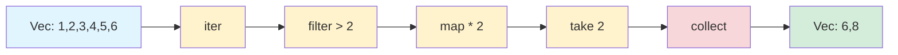
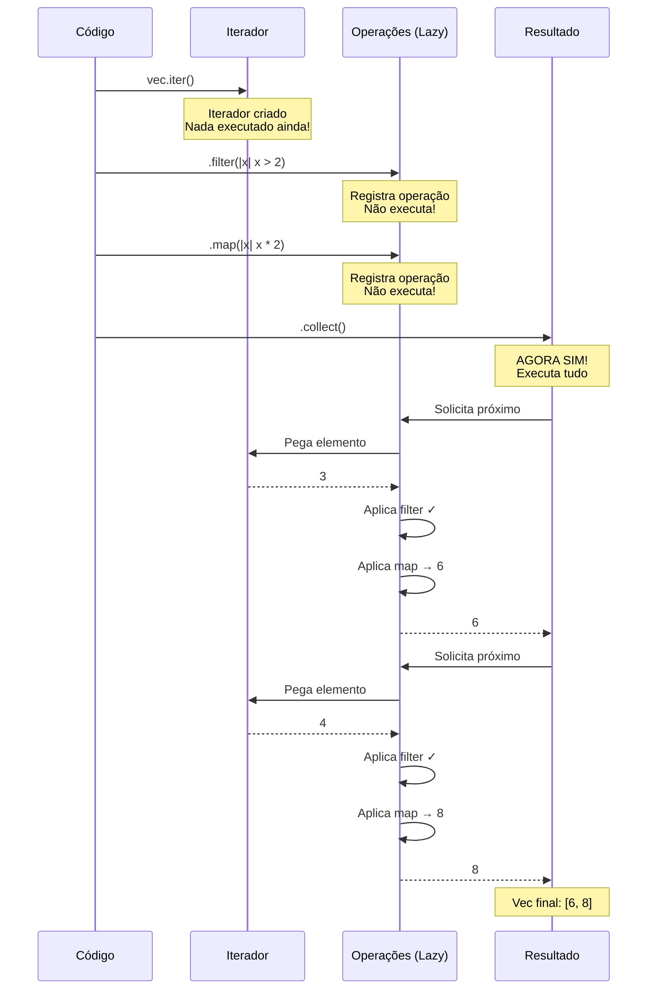
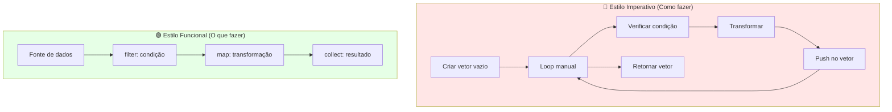
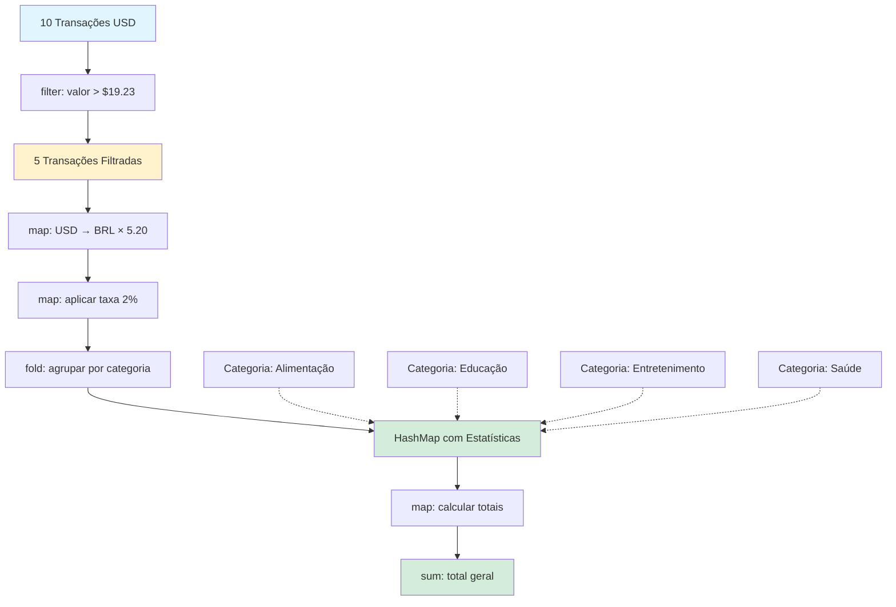

# 📘 Dia 13: Iteradores em Rust - Programação Funcional Elegante

---

## 📋 OBJETIVOS DE APRENDIZAGEM

Ao final desta lição, você será capaz de:

✅ **Compreender** as diferenças entre `iter()`, `iter_mut()` e `into_iter()`  
✅ **Aplicar** métodos adaptadores (`map`, `filter`, `take`, `skip`) para transformar dados  
✅ **Utilizar** métodos consumidores (`collect`, `fold`, `for_each`) para processar coleções  
✅ **Explicar** o conceito de lazy evaluation e suas vantagens  
✅ **Construir** pipelines de transformação encadeando múltiplos métodos  
✅ **Comparar** código imperativo vs funcional e reconhecer quando usar cada abordagem  
✅ **Aproveitar** zero-cost abstractions para código elegante e performático

---

## 🎭 ATIVAÇÃO DO CONHECIMENTO PRÉVIO

### 🔄 Revisão Rápida

Você já conhece:
- **Vetores (`Vec<T>`)**: coleções dinâmicas de dados
- **Loops `for`**: iteração elemento por elemento
- **Ownership**: movimentação e empréstimo de valores

### 🏭 Analogia: A Linha de Produção

Imagine uma **fábrica moderna** com uma linha de produção automatizada:

```
[Matéria-Prima] → [Filtro de Qualidade] → [Transformação] → [Embalagem] → [Produto Final]
```

**Características da linha de produção:**
- ⚡ **Eficiente**: cada estação faz apenas uma tarefa
- 🔗 **Encadeada**: o output de uma estação é input da próxima
- 💤 **Sob demanda**: só produz quando há pedido (lazy!)
- 🎯 **Especializada**: cada operação é otimizada

**Iteradores em Rust funcionam exatamente assim!**

### 📖 História: O Problema do Processamento Ineficiente

**Cenário**: Uma startup de fintech precisa processar milhões de transações diariamente.

**Abordagem Antiga (Imperativa)**:
```rust {.line-numbers}
// Criar vetores intermediários para cada etapa
let mut filtradas = Vec::new();
for transacao in transacoes {
    if transacao.valor > 100.0 {
        filtradas.push(transacao);
    }
}

let mut transformadas = Vec::new();
for transacao in filtradas {
    transformadas.push(transacao.valor * 1.1);
}

let mut total = 0.0;
for valor in transformadas {
    total += valor;
}
```

❌ **Problemas**: múltiplas alocações, loops separados, código verboso

**Abordagem Moderna (Funcional)**:
```rust {.line-numbers}
let total: f64 = transacoes
    .iter()
    .filter(|t| t.valor > 100.0)
    .map(|t| t.valor * 1.1)
    .sum();
```

✅ **Vantagens**: uma única passagem, zero alocações intermediárias, código elegante!

---

## 📚 APRESENTAÇÃO DO CONTEÚDO

### 🔑 Conceito Central: O que são Iteradores?

> **Iterador** é um padrão que permite percorrer elementos de uma coleção de forma **sequencial**, **preguiçosa** (lazy) e **eficiente**, aplicando transformações sem criar coleções intermediárias.

**Características principais:**
- 🦥 **Lazy Evaluation**: não executa até ser consumido
- 🚀 **Zero-Cost Abstractions**: performance equivalente a loops manuais
- 🔗 **Composição**: encadeamento de operações
- 🛡️ **Type-Safe**: erros detectados em tempo de compilação

---

### 📊 DIAGRAMA 1: Pipeline de Transformações



**Legenda:**
- 🔵 **Fonte de dados**: coleção original
- 🟡 **Adaptadores**: transformam o iterador (lazy)
- 🔴 **Consumidor**: executa e produz resultado final
- 🟢 **Resultado**: nova coleção ou valor

---

### 🔄 Os Três Tipos de Iteradores

| Método            | Tipo Retornado | Ownership           | Uso                        |
| ----------------- | -------------- | ------------------- | -------------------------- |
| **`iter()`**      | `&T`           | Empresta (imutável) | Ler valores sem modificar  |
| **`iter_mut()`**  | `&mut T`       | Empresta (mutável)  | Modificar valores in-place |
| **`into_iter()`** | `T`            | Consome/Move        | Tomar posse dos valores    |

**Exemplo comparativo:**

```rust {.line-numbers}
fn main() {
    let numeros = vec![1, 2, 3];
    
    // 1. iter() - Empréstimo imutável
    for n in numeros.iter() {
        println!("{}", n); // n é &i32
    }
    println!("Ainda posso usar: {:?}", numeros); // ✅ OK
    
    // 2. iter_mut() - Empréstimo mutável
    let mut numeros = vec![1, 2, 3];
    for n in numeros.iter_mut() {
        *n *= 2; // n é &mut i32
    }
    println!("Modificado: {:?}", numeros); // [2, 4, 6]
    
    // 3. into_iter() - Consome
    let numeros = vec![1, 2, 3];
    for n in numeros.into_iter() {
        println!("{}", n); // n é i32
    }
    // println!("{:?}", numeros); // ❌ ERRO: valor movido!
}
```

---

### 📊 DIAGRAMA 2: Lazy Evaluation em Ação



**Ponto-chave**: As operações só executam quando um **consumidor** é chamado!

---

### 🛠️ Métodos Adaptadores (Lazy)

Adaptadores **transformam** iteradores em novos iteradores, mas **não executam** até serem consumidos.

#### 1. **`map`** - Transforma cada elemento

```rust {.line-numbers}
let numeros = vec![1, 2, 3, 4];
let dobrados: Vec<i32> = numeros
    .iter()
    .map(|x| x * 2)  // Transforma cada elemento
    .collect();      // [2, 4, 6, 8]
```

#### 2. **`filter`** - Seleciona elementos que atendem condição

```rust {.line-numbers}
let numeros = vec![1, 2, 3, 4, 5, 6];
let pares: Vec<&i32> = numeros
    .iter()
    .filter(|x| *x % 2 == 0)  // Apenas pares
    .collect();                // [2, 4, 6]
```

#### 3. **`take`** - Pega os primeiros N elementos

```rust {.line-numbers}
let numeros = vec![1, 2, 3, 4, 5];
let primeiros: Vec<&i32> = numeros
    .iter()
    .take(3)      // Apenas 3 primeiros
    .collect();   // [1, 2, 3]
```

#### 4. **`skip`** - Pula os primeiros N elementos

```rust {.line-numbers}
let numeros = vec![1, 2, 3, 4, 5];
let sem_inicio: Vec<&i32> = numeros
    .iter()
    .skip(2)      // Pula 2 primeiros
    .collect();   // [3, 4, 5]
```

#### 5. **`enumerate`** - Adiciona índice

```rust {.line-numbers}
let frutas = vec!["maçã", "banana", "laranja"];
for (indice, fruta) in frutas.iter().enumerate() {
    println!("{}: {}", indice, fruta);
}
// 0: maçã
// 1: banana
// 2: laranja
```

#### 6. **`zip`** - Combina dois iteradores

```rust {.line-numbers}
let nomes = vec!["Ana", "Bruno", "Carlos"];
let idades = vec![25, 30, 28];

let pessoas: Vec<_> = nomes
    .iter()
    .zip(idades.iter())
    .collect();
// [("Ana", 25), ("Bruno", 30), ("Carlos", 28)]
```

---

### 🎯 Métodos Consumidores (Executam Imediatamente)

Consumidores **executam** o pipeline e produzem um resultado final.

#### 1. **`collect`** - Coleta em uma coleção

```rust {.line-numbers}
let numeros = vec![1, 2, 3];
let dobrados: Vec<i32> = numeros
    .iter()
    .map(|x| x * 2)
    .collect();  // Cria novo Vec
```

#### 2. **`fold`** - Reduz a um único valor (acumulador)

```rust {.line-numbers}
let numeros = vec![1, 2, 3, 4];
let soma = numeros
    .iter()
    .fold(0, |acumulador, x| acumulador + x);
// 0 + 1 = 1
// 1 + 2 = 3
// 3 + 3 = 6
// 6 + 4 = 10
println!("Soma: {}", soma); // 10
```

#### 3. **`for_each`** - Executa ação para cada elemento

```rust {.line-numbers}
let numeros = vec![1, 2, 3];
numeros
    .iter()
    .for_each(|x| println!("Número: {}", x));
```

#### 4. **`sum`** e **`product`** - Soma/multiplica todos

```rust {.line-numbers}
let numeros = vec![1, 2, 3, 4];
let soma: i32 = numeros.iter().sum();        // 10
let produto: i32 = numeros.iter().product(); // 24
```

#### 5. **`any`** e **`all`** - Testa condições

```rust {.line-numbers}
let numeros = vec![1, 2, 3, 4];
let tem_par = numeros.iter().any(|x| x % 2 == 0);    // true
let todos_positivos = numeros.iter().all(|x| *x > 0); // true
```

#### 6. **`find`** - Encontra primeiro elemento

```rust {.line-numbers}
let numeros = vec![1, 2, 3, 4];
let primeiro_par = numeros.iter().find(|x| *x % 2 == 0);
println!("{:?}", primeiro_par); // Some(2)
```

---

### 📊 DIAGRAMA 3: Imperativo vs Funcional



**Comparação lado a lado:**

```rust {.line-numbers}
// ❌ IMPERATIVO: Verboso, múltiplas etapas
fn processar_imperativo(numeros: Vec<i32>) -> Vec<i32> {
    let mut resultado = Vec::new();
    for num in numeros {
        if num > 5 {
            let transformado = num * 2;
            resultado.push(transformado);
        }
    }
    resultado
}

// ✅ FUNCIONAL: Conciso, declarativo
fn processar_funcional(numeros: Vec<i32>) -> Vec<i32> {
    numeros
        .into_iter()
        .filter(|x| *x > 5)
        .map(|x| x * 2)
        .collect()
}
```

---

### 📊 DIAGRAMA 4: Árvore de Métodos de Iteradores

```mermaid
graph TD
    Root[Iterador]
    
    Root --> Adapt[Adaptadores - Lazy]
    Root --> Consum[Consumidores - Executam]
    
    Adapt --> A1[map - Transforma]
    Adapt --> A2[filter - Filtra]
    Adapt --> A3[take - Limita]
    Adapt --> A4[skip - Pula]
    Adapt --> A5[enumerate - Indexa]
    Adapt --> A6[zip - Combina]
    Adapt --> A7[chain - Concatena]
    Adapt --> A8[flat_map - Achata]
    
    Consum --> C1[collect - Coleta]
    Consum --> C2[fold - Reduz]
    Consum --> C3[for_each - Itera]
    Consum --> C4[sum - Soma]
    Consum --> C5[product - Multiplica]
    Consum --> C6[any - Algum]
    Consum --> C7[all - Todos]
    Consum --> C8[find - Busca]
    Consum --> C9[count - Conta]
    
    style Root fill:#4a90e2
    style Adapt fill:#f5a623
    style Consum fill:#e74c3c
    style A1,A2,A3,A4,A5,A6,A7,A8 fill:#fff3cd
    style C1,C2,C3,C4,C5,C6,C7,C8,C9 fill:#f8d7da
```



---

### 🔗 Encadeamento (Chaining)

A verdadeira **elegância** dos iteradores está no encadeamento:

```rust {.line-numbers}
fn main() {
    let vendas = vec![120, 450, 80, 300, 95, 600, 150];
    
    let total_vendas_grandes: i32 = vendas
        .iter()                      // Cria iterador
        .filter(|v| **v > 100)       // Apenas vendas > 100
        .map(|v| v - 10)             // Desconto de 10
        .take(3)                     // Apenas 3 primeiras
        .sum();                      // Soma tudo
    
    println!("Total: {}", total_vendas_grandes); // 110 + 440 + 290 = 840
}
```

**Fluxo de dados:**
```
[120, 450, 80, 300, 95, 600, 150]
    ↓ filter(> 100)
[120, 450, 300, 600, 150]
    ↓ map(- 10)
[110, 440, 290, 590, 140]
    ↓ take(3)
[110, 440, 290]
    ↓ sum()
840
```

---

### ⚡ Zero-Cost Abstractions

> **Promessa do Rust**: Abstrações de alto nível com **zero overhead** em runtime!

**Teste de performance:**

```rust {.line-numbers}
use std::time::Instant;

fn main() {
    let numeros: Vec<i32> = (1..1_000_000).collect();
    
    // Versão com loop manual
    let inicio = Instant::now();
    let mut soma1 = 0;
    for n in &numeros {
        if *n % 2 == 0 {
            soma1 += n * 2;
        }
    }
    println!("Loop: {:?}", inicio.elapsed());
    
    // Versão com iteradores
    let inicio = Instant::now();
    let soma2: i32 = numeros
        .iter()
        .filter(|x| *x % 2 == 0)
        .map(|x| x * 2)
        .sum();
    println!("Iteradores: {:?}", inicio.elapsed());
    
    // Resultados idênticos e performance similar!
    assert_eq!(soma1, soma2);
}
```

**Resultado típico:**
```
Loop: 2.5ms
Iteradores: 2.5ms  ← Mesma performance!
```

**Por quê?** O compilador Rust **otimiza** iteradores para código de máquina equivalente aos loops manuais!

---

## 💡 DEMONSTRAÇÃO E MODELAGEM

### 🔍 Exemplo 1: Comparação Completa

**Problema**: Processar lista de temperaturas (°C) e calcular média das temperaturas acima de 20°C em Fahrenheit.

**Versão Imperativa:**

```rust {.line-numbers}
fn calcular_media_imperativo(temperaturas: &Vec<f64>) -> f64 {
    let mut filtradas = Vec::new();
    
    // Etapa 1: Filtrar
    for temp in temperaturas {
        if *temp > 20.0 {
            filtradas.push(*temp);
        }
    }
    
    // Etapa 2: Converter para Fahrenheit
    let mut fahrenheit = Vec::new();
    for temp in filtradas {
        fahrenheit.push(temp * 9.0 / 5.0 + 32.0);
    }
    
    // Etapa 3: Calcular média
    let mut soma = 0.0;
    for temp in &fahrenheit {
        soma += temp;
    }
    
    soma / fahrenheit.len() as f64
}
```

❌ **Problemas:**
- 3 loops separados
- 2 vetores intermediários alocados
- Código verboso (15 linhas)
- Difícil de ler a intenção

**Versão Funcional:**

```rust {.line-numbers}
fn calcular_media_funcional(temperaturas: &Vec<f64>) -> f64 {
    let fahrenheit: Vec<f64> = temperaturas
        .iter()
        .filter(|t| **t > 20.0)
        .map(|t| t * 9.0 / 5.0 + 32.0)
        .collect();
    
    fahrenheit.iter().sum::<f64>() / fahrenheit.len() as f64
}
```

✅ **Vantagens:**
- Pipeline claro e legível
- Apenas 1 vetor intermediário
- Código conciso (7 linhas)
- Intenção óbvia

**Versão Ultra-Funcional (sem vetor intermediário):**

```rust {.line-numbers}
fn calcular_media_ultra(temperaturas: &Vec<f64>) -> f64 {
    let (soma, count) = temperaturas
        .iter()
        .filter(|t| **t > 20.0)
        .map(|t| t * 9.0 / 5.0 + 32.0)
        .fold((0.0, 0), |(soma, count), temp| (soma + temp, count + 1));
    
    soma / count as f64
}
```

🚀 **Máxima eficiência:**
- Uma única passagem
- Zero alocações intermediárias
- Performance ótima

---

### 🔍 Exemplo 2: Lazy Evaluation na Prática

```rust {.line-numbers}
fn main() {
    println!("Criando iterador...");
    let numeros = vec![1, 2, 3, 4, 5];
    
    let iterador = numeros
        .iter()
        .inspect(|x| println!("  Pegando: {}", x))
        .filter(|x| {
            println!("  Filtrando: {}", x);
            **x % 2 == 0
        })
        .map(|x| {
            println!("  Mapeando: {}", x);
            x * 2
        });
    
    println!("Iterador criado, mas NADA executou ainda!\n");
    
    println!("Agora vamos coletar:");
    let resultado: Vec<i32> = iterador.collect();
    
    println!("\nResultado: {:?}", resultado);
}
```

**Saída:**
```
Criando iterador...
Iterador criado, mas NADA executou ainda!

Agora vamos coletar:
  Pegando: 1
  Filtrando: 1
  Pegando: 2
  Filtrando: 2
  Mapeando: 2
  Pegando: 3
  Filtrando: 3
  Pegando: 4
  Filtrando: 4
  Mapeando: 4
  Pegando: 5
  Filtrando: 5

Resultado: [4, 8]
```

💡 **Observe**: As operações só executam quando `collect()` é chamado!

---

### 🔍 Exemplo 3: Composição Elegante

**Problema**: Processar lista de produtos e encontrar os 3 mais caros acima de R$ 50.

```rust {.line-numbers}
#[derive(Debug)]
struct Produto {
    nome: String,
    preco: f64,
}

fn main() {
    let produtos = vec![
        Produto { nome: "Mouse".to_string(), preco: 45.0 },
        Produto { nome: "Teclado".to_string(), preco: 120.0 },
        Produto { nome: "Monitor".to_string(), preco: 800.0 },
        Produto { nome: "Webcam".to_string(), preco: 250.0 },
        Produto { nome: "Mousepad".to_string(), preco: 30.0 },
        Produto { nome: "Headset".to_string(), preco: 180.0 },
    ];
    
    let top_3: Vec<String> = produtos
        .iter()
        .filter(|p| p.preco > 50.0)           // Apenas acima de R$ 50
        .map(|p| (p.nome.clone(), p.preco))   // Extrair nome e preço
        .collect::<Vec<_>>()                  // Coletar para ordenar
        .into_iter()
        .fold(Vec::new(), |mut acc, item| {   // Ordenar manualmente
            acc.push(item);
            acc.sort_by(|a, b| b.1.partial_cmp(&a.1).unwrap());
            acc
        })
        .into_iter()
        .take(3)                              // Top 3
        .map(|(nome, preco)| format!("{} - R$ {:.2}", nome, preco))
        .collect();
    
    println!("Top 3 produtos:");
    for produto in top_3 {
        println!("  {}", produto);
    }
}
```

**Saída:**
```
Top 3 produtos:
  Monitor - R$ 800.00
  Webcam - R$ 250.00
  Headset - R$ 180.00
```

---

## 🎯 PRÁTICA GUIADA

### 💼 Exercício Completo: Pipeline de Processamento de Transações Financeiras

**Contexto**: Você trabalha em uma fintech e precisa analisar transações do mês para gerar um relatório executivo.

**Requisitos:**
1. Filtrar apenas transações acima de R$ 100
2. Aplicar taxa de câmbio (USD → BRL: 1 USD = 5.20 BRL)
3. Aplicar taxa de processamento de 2%
4. Agrupar por categoria
5. Calcular estatísticas (total, média, contagem)
6. Comparar com versão imperativa

---

#### 📝 Código Base (Estruturas)

```rust {.line-numbers}
#[derive(Debug, Clone)]
struct Transacao {
    id: u32,
    descricao: String,
    valor_usd: f64,
    categoria: Categoria,
}

#[derive(Debug, Clone, PartialEq, Eq, Hash)]
enum Categoria {
    Alimentacao,
    Transporte,
    Entretenimento,
    Saude,
    Educacao,
}

impl std::fmt::Display for Categoria {
    fn fmt(&self, f: &mut std::fmt::Formatter) -> std::fmt::Result {
        match self {
            Categoria::Alimentacao => write!(f, "Alimentação"),
            Categoria::Transporte => write!(f, "Transporte"),
            Categoria::Entretenimento => write!(f, "Entretenimento"),
            Categoria::Saude => write!(f, "Saúde"),
            Categoria::Educacao => write!(f, "Educação"),
        }
    }
}

fn gerar_transacoes() -> Vec<Transacao> {
    vec![
        Transacao { id: 1, descricao: "Restaurante".into(), valor_usd: 45.0, categoria: Categoria::Alimentacao },
        Transacao { id: 2, descricao: "Uber".into(), valor_usd: 15.0, categoria: Categoria::Transporte },
        Transacao { id: 3, descricao: "Cinema".into(), valor_usd: 30.0, categoria: Categoria::Entretenimento },
        Transacao { id: 4, descricao: "Supermercado".into(), valor_usd: 120.0, categoria: Categoria::Alimentacao },
        Transacao { id: 5, descricao: "Consulta médica".into(), valor_usd: 80.0, categoria: Categoria::Saude },
        Transacao { id: 6, descricao: "Curso online".into(), valor_usd: 200.0, categoria: Categoria::Educacao },
        Transacao { id: 7, descricao: "Táxi".into(), valor_usd: 25.0, categoria: Categoria::Transporte },
        Transacao { id: 8, descricao: "Show".into(), valor_usd: 150.0, categoria: Categoria::Entretenimento },
        Transacao { id: 9, descricao: "Farmácia".into(), valor_usd: 60.0, categoria: Categoria::Saude },
        Transacao { id: 10, descricao: "Livros".into(), valor_usd: 90.0, categoria: Categoria::Educacao },
    ]
}
```

---

#### 🔴 Versão Imperativa (Para Comparação)

```rust {.line-numbers}
use std::collections::HashMap;

fn processar_imperativo(transacoes: Vec<Transacao>) {
    const TAXA_CAMBIO: f64 = 5.20;
    const TAXA_PROCESSAMENTO: f64 = 0.02;
    
    // Etapa 1: Filtrar transações > $100 USD
    let mut filtradas = Vec::new();
    for transacao in &transacoes {
        if transacao.valor_usd > 100.0 / TAXA_CAMBIO {
            filtradas.push(transacao.clone());
        }
    }
    
    // Etapa 2: Converter para BRL e aplicar taxa
    let mut processadas = Vec::new();
    for transacao in filtradas {
        let valor_brl = transacao.valor_usd * TAXA_CAMBIO;
        let valor_final = valor_brl * (1.0 + TAXA_PROCESSAMENTO);
        processadas.push((transacao.categoria.clone(), valor_final));
    }
    
    // Etapa 3: Agrupar por categoria
    let mut por_categoria: HashMap<Categoria, Vec<f64>> = HashMap::new();
    for (categoria, valor) in processadas {
        por_categoria.entry(categoria).or_insert(Vec::new()).push(valor);
    }
    
    // Etapa 4: Calcular estatísticas
    println!("\n📊 RELATÓRIO FINANCEIRO (Versão Imperativa)\n");
    println!("{:-<60}", "");
    
    let mut total_geral = 0.0;
    for (categoria, valores) in &por_categoria {
        let soma: f64 = valores.iter().sum();
        let media = soma / valores.len() as f64;
        let count = valores.len();
        
        total_geral += soma;
        
        println!("📁 {}", categoria);
        println!("   Total: R$ {:.2}", soma);
        println!("   Média: R$ {:.2}", media);
        println!("   Transações: {}", count);
        println!();
    }
    
    println!("{:-<60}", "");
    println!("💰 TOTAL GERAL: R$ {:.2}", total_geral);
}
```

---

#### 🟢 Versão Funcional (Com Iteradores)

```rust {.line-numbers}
use std::collections::HashMap;

fn processar_funcional(transacoes: Vec<Transacao>) {
    const TAXA_CAMBIO: f64 = 5.20;
    const TAXA_PROCESSAMENTO: f64 = 0.02;
    const LIMITE_USD: f64 = 100.0 / TAXA_CAMBIO;
    
    // Pipeline completo em uma única expressão
    let por_categoria: HashMap<Categoria, Vec<f64>> = transacoes
        .into_iter()
        .filter(|t| t.valor_usd > LIMITE_USD)
        .map(|t| {
            let valor_brl = t.valor_usd * TAXA_CAMBIO;
            let valor_final = valor_brl * (1.0 + TAXA_PROCESSAMENTO);
            (t.categoria, valor_final)
        })
        .fold(HashMap::new(), |mut acc, (cat, valor)| {
            acc.entry(cat).or_insert(Vec::new()).push(valor);
            acc
        });
    
    // Exibir relatório
    println!("\n📊 RELATÓRIO FINANCEIRO (Versão Funcional)\n");
    println!("{:-<60}", "");
    
    let total_geral: f64 = por_categoria
        .iter()
        .map(|(categoria, valores)| {
            let soma: f64 = valores.iter().sum();
            let media = soma / valores.len() as f64;
            let count = valores.len();
            
            println!("📁 {}", categoria);
            println!("   Total: R$ {:.2}", soma);
            println!("   Média: R$ {:.2}", media);
            println!("   Transações: {}", count);
            println!();
            
            soma
        })
        .sum();
    
    println!("{:-<60}", "");
    println!("💰 TOTAL GERAL: R$ {:.2}", total_geral);
}
```

---

#### 🚀 Versão Ultra-Otimizada (Zero Alocações Intermediárias)

```rust {.line-numbers}
use std::collections::HashMap;

#[derive(Debug)]
struct Estatisticas {
    total: f64,
    count: usize,
}

fn processar_ultra_otimizado(transacoes: Vec<Transacao>) {
    const TAXA_CAMBIO: f64 = 5.20;
    const TAXA_PROCESSAMENTO: f64 = 0.02;
    const LIMITE_USD: f64 = 100.0 / TAXA_CAMBIO;
    
    // Uma única passagem, acumulando estatísticas diretamente
    let estatisticas: HashMap<Categoria, Estatisticas> = transacoes
        .into_iter()
        .filter(|t| t.valor_usd > LIMITE_USD)
        .map(|t| {
            let valor_brl = t.valor_usd * TAXA_CAMBIO;
            let valor_final = valor_brl * (1.0 + TAXA_PROCESSAMENTO);
            (t.categoria, valor_final)
        })
        .fold(HashMap::new(), |mut acc, (cat, valor)| {
            acc.entry(cat)
                .and_modify(|e| {
                    e.total += valor;
                    e.count += 1;
                })
                .or_insert(Estatisticas { total: valor, count: 1 });
            acc
        });
    
    // Exibir relatório
    println!("\n📊 RELATÓRIO FINANCEIRO (Versão Ultra-Otimizada)\n");
    println!("{:-<60}", "");
    
    let total_geral: f64 = estatisticas
        .iter()
        .map(|(categoria, stats)| {
            let media = stats.total / stats.count as f64;
            
            println!("📁 {}", categoria);
            println!("   Total: R$ {:.2}", stats.total);
            println!("   Média: R$ {:.2}", media);
            println!("   Transações: {}", stats.count);
            println!();
            
            stats.total
        })
        .sum();
    
    println!("{:-<60}", "");
    println!("💰 TOTAL GERAL: R$ {:.2}", total_geral);
}
```

---

#### 🎮 Código Completo para Testar

```rust {.line-numbers}
fn main() {
    let transacoes = gerar_transacoes();
    
    println!("\n{'='*60}");
    println!("🔴 ABORDAGEM IMPERATIVA");
    println!("{'='*60}");
    processar_imperativo(transacoes.clone());
    
    println!("\n\n{'='*60}");
    println!("🟢 ABORDAGEM FUNCIONAL");
    println!("{'='*60}");
    processar_funcional(transacoes.clone());
    
    println!("\n\n{'='*60}");
    println!("🚀 ABORDAGEM ULTRA-OTIMIZADA");
    println!("{'='*60}");
    processar_ultra_otimizado(transacoes);
}
```

---

#### 📊 DIAGRAMA 5: Fluxo do Exercício



---

#### 📈 Análise Comparativa

| Aspecto                    | Imperativo | Funcional | Ultra-Otimizado |
| -------------------------- | ---------- | --------- | --------------- |
| **Linhas de código**       | ~35        | ~25       | ~22             |
| **Vetores intermediários** | 3          | 1         | 0               |
| **Legibilidade**           | ⭐⭐         | ⭐⭐⭐⭐      | ⭐⭐⭐⭐⭐           |
| **Performance**            | Boa        | Boa       | Excelente       |
| **Manutenibilidade**       | Média      | Alta      | Alta            |
| **Passagens pelos dados**  | 4          | 2         | 1               |

---

#### 🎓 Conceitos Aplicados no Exercício

✅ **`filter`**: Selecionar transações relevantes  
✅ **`map`**: Transformar valores (câmbio, taxas)  
✅ **`fold`**: Agrupar e acumular estatísticas  
✅ **`sum`**: Calcular total geral  
✅ **Chaining**: Encadear múltiplas operações  
✅ **Lazy evaluation**: Execução eficiente  
✅ **Zero-cost abstractions**: Performance ótima  

---

#### 🔧 Extensões Sugeridas

1. **Adicionar filtro por data**: `.filter(|t| t.data > inicio && t.data < fim)`
2. **Ordenar por valor**: Usar `sort_by` antes de exibir
3. **Top 5 transações**: `.take(5)` após ordenação
4. **Percentual por categoria**: Calcular % do total
5. **Benchmark**: Medir tempo de execução de cada versão

---

## 🔄 FEEDBACK E AVALIAÇÃO

### ✅ Checklist de Conceitos

Marque o que você domina:

- [ ] Entendo a diferença entre `iter()`, `iter_mut()` e `into_iter()`
- [ ] Sei usar `map` para transformar elementos
- [ ] Sei usar `filter` para selecionar elementos
- [ ] Compreendo o conceito de lazy evaluation
- [ ] Consigo encadear múltiplos métodos
- [ ] Sei quando usar `collect`, `fold`, `sum`
- [ ] Entendo zero-cost abstractions
- [ ] Consigo comparar código imperativo vs funcional
- [ ] Sei usar `take`, `skip`, `enumerate`, `zip`
- [ ] Compreendo ownership em iteradores

---

### ⚠️ Erros Comuns e Como Evitar

#### 1. **Esquecer de desreferenciar em closures**

❌ **Errado:**
```rust {.line-numbers}
let numeros = vec![1, 2, 3];
let dobrados: Vec<i32> = numeros
    .iter()
    .map(|x| x * 2)  // ERRO: x é &i32, não i32
    .collect();
```

✅ **Correto:**
```rust {.line-numbers}
let numeros = vec![1, 2, 3];
let dobrados: Vec<i32> = numeros
    .iter()
    .map(|x| *x * 2)  // Desreferencia com *
    .collect();
```

---

#### 2. **Usar iterador após consumo**

❌ **Errado:**
```rust {.line-numbers}
let numeros = vec![1, 2, 3];
let iter = numeros.into_iter();
let soma: i32 = iter.sum();
let count = iter.count();  // ERRO: iter já foi consumido!
```

✅ **Correto:**
```rust {.line-numbers}
let numeros = vec![1, 2, 3];
let soma: i32 = numeros.iter().sum();
let count = numeros.len();  // Usar o vetor original
```

---

#### 3. **Esquecer de coletar (lazy evaluation)**

❌ **Errado:**
```rust {.line-numbers}
let numeros = vec![1, 2, 3];
numeros
    .iter()
    .map(|x| {
        println!("{}", x);  // Nunca executa!
        x * 2
    });
// Nada acontece porque não há consumidor
```

✅ **Correto:**
```rust {.line-numbers}
let numeros = vec![1, 2, 3];
numeros
    .iter()
    .map(|x| {
        println!("{}", x);  // Agora executa!
        x * 2
    })
    .collect::<Vec<_>>();  // Consumidor necessário
```

---

#### 4. **Confundir tipos de retorno**

❌ **Errado:**
```rust {.line-numbers}
let numeros = vec![1, 2, 3];
let primeiro = numeros.iter().find(|x| **x > 1);
println!("{}", primeiro);  // ERRO: primeiro é Option<&&i32>
```

✅ **Correto:**
```rust {.line-numbers}
let numeros = vec![1, 2, 3];
let primeiro = numeros.iter().find(|x| **x > 1);
match primeiro {
    Some(valor) => println!("{}", valor),
    None => println!("Não encontrado"),
}
```

---

#### 5. **Ownership com `into_iter()`**

❌ **Errado:**
```rust {.line-numbers}
let numeros = vec![1, 2, 3];
let dobrados: Vec<i32> = numeros.into_iter().map(|x| x * 2).collect();
println!("{:?}", numeros);  // ERRO: numeros foi movido!
```

✅ **Correto:**
```rust {.line-numbers}
let numeros = vec![1, 2, 3];
let dobrados: Vec<i32> = numeros.iter().map(|x| x * 2).collect();
println!("{:?}", numeros);  // OK: numeros ainda existe
```

---

### 🧪 Quiz de Auto-Avaliação

**1. O que acontece quando você cria um iterador com `.map()` mas não chama `.collect()`?**

<details>
<summary>Ver resposta</summary>

Nada! Devido ao **lazy evaluation**, as operações só executam quando um **consumidor** (como `collect`, `sum`, `for_each`) é chamado.

</details>

---

**2. Qual a diferença entre `iter()` e `into_iter()`?**

<details>
<summary>Ver resposta</summary>

- **`iter()`**: Empresta elementos (`&T`), a coleção original permanece disponível
- **`into_iter()`**: Consome/move elementos (`T`), a coleção original não pode mais ser usada

</details>

---

**3. Este código compila? Por quê?**

```rust {.line-numbers}
let numeros = vec![1, 2, 3];
let iter = numeros.iter().filter(|x| **x > 1);
let soma: i32 = iter.sum();
let count = iter.count();
```

<details>
<summary>Ver resposta</summary>

❌ **Não compila!** O iterador `iter` é **consumido** por `sum()`. Depois disso, não pode ser usado novamente em `count()`.

**Solução**: Criar dois iteradores separados ou usar `clone()` se o tipo permitir.

</details>

---

**4. Qual versão é mais eficiente?**

```rust {.line-numbers}
// Versão A
let resultado: Vec<i32> = numeros
    .iter()
    .filter(|x| **x > 5)
    .collect::<Vec<_>>()
    .iter()
    .map(|x| *x * 2)
    .collect();

// Versão B
let resultado: Vec<i32> = numeros
    .iter()
    .filter(|x| **x > 5)
    .map(|x| *x * 2)
    .collect();
```

<details>
<summary>Ver resposta</summary>

✅ **Versão B** é mais eficiente! A Versão A cria um vetor intermediário desnecessário com o primeiro `collect()`. A Versão B faz tudo em uma única passagem.

</details>

---

**5. O que este código imprime?**

```rust {.line-numbers}
let numeros = vec![1, 2, 3, 4, 5];
let resultado: Vec<i32> = numeros
    .iter()
    .filter(|x| **x % 2 == 0)
    .take(1)
    .map(|x| x * 10)
    .collect();
println!("{:?}", resultado);
```

<details>
<summary>Ver resposta</summary>

**Resposta**: `[20]`

**Explicação**:
1. `filter` seleciona pares: [2, 4]
2. `take(1)` pega apenas o primeiro: [2]
3. `map` multiplica por 10: [20]

</details>

---

## 🚀 TRANSFERÊNCIA E APLICAÇÃO

### 🎯 Desafio: Análise de Texto com Iteradores

**Objetivo**: Criar um analisador de texto que processa um artigo e gera estatísticas usando iteradores.

**Requisitos:**

1. **Contar palavras** (total e únicas)
2. **Encontrar as 5 palavras mais frequentes**
3. **Calcular tamanho médio das palavras**
4. **Filtrar palavras com mais de 5 letras**
5. **Remover stop words** (artigos, preposições)
6. **Usar apenas iteradores** (sem loops manuais)

**Estrutura base:**

```rust {.line-numbers}
use std::collections::HashMap;

fn analisar_texto(texto: &str) -> RelatorioTexto {
    // SEU CÓDIGO AQUI
    // Use: split, filter, map, fold, collect
    todo!()
}

#[derive(Debug)]
struct RelatorioTexto {
    total_palavras: usize,
    palavras_unicas: usize,
    tamanho_medio: f64,
    top_5_palavras: Vec<(String, usize)>,
    palavras_longas: Vec<String>,
}

fn main() {
    let texto = "Rust é uma linguagem de programação que prioriza \
                 segurança e performance. Rust oferece abstrações \
                 de custo zero e ownership único.";
    
    let relatorio = analisar_texto(texto);
    println!("{:#?}", relatorio);
}
```

**Dicas:**
- Use `.split_whitespace()` para separar palavras
- Use `.to_lowercase()` para normalizar
- Use `HashMap` com `fold` para contar frequências
- Use `.sort_by()` para ordenar por frequência
- Use `.take(5)` para top 5

<details>
<summary>💡 Ver solução</summary>

```rust {.line-numbers}
use std::collections::HashMap;

fn analisar_texto(texto: &str) -> RelatorioTexto {
    let stop_words = ["é", "de", "e", "a", "o", "que", "uma"];
    
    // Processar palavras
    let palavras: Vec<String> = texto
        .split_whitespace()
        .map(|p| p.to_lowercase().trim_matches(|c: char| !c.is_alphabetic()).to_string())
        .filter(|p| !p.is_empty() && !stop_words.contains(&p.as_str()))
        .collect();
    
    // Total de palavras
    let total_palavras = palavras.len();
    
    // Contar frequências
    let frequencias: HashMap<String, usize> = palavras
        .iter()
        .fold(HashMap::new(), |mut acc, palavra| {
            *acc.entry(palavra.clone()).or_insert(0) += 1;
            acc
        });
    
    // Palavras únicas
    let palavras_unicas = frequencias.len();
    
    // Tamanho médio
    let tamanho_medio = palavras
        .iter()
        .map(|p| p.len())
        .sum::<usize>() as f64 / total_palavras as f64;
    
    // Top 5 palavras
    let mut top_5_palavras: Vec<(String, usize)> = frequencias
        .into_iter()
        .collect();
    top_5_palavras.sort_by(|a, b| b.1.cmp(&a.1));
    top_5_palavras.truncate(5);
    
    // Palavras longas (> 5 letras)
    let palavras_longas: Vec<String> = palavras
        .into_iter()
        .filter(|p| p.len() > 5)
        .collect::<std::collections::HashSet<_>>()
        .into_iter()
        .collect();
    
    RelatorioTexto {
        total_palavras,
        palavras_unicas,
        tamanho_medio,
        top_5_palavras,
        palavras_longas,
    }
}

#[derive(Debug)]
struct RelatorioTexto {
    total_palavras: usize,
    palavras_unicas: usize,
    tamanho_medio: f64,
    top_5_palavras: Vec<(String, usize)>,
    palavras_longas: Vec<String>,
}

fn main() {
    let texto = "Rust é uma linguagem de programação que prioriza \
                 segurança e performance. Rust oferece abstrações \
                 de custo zero e ownership único.";
    
    let relatorio = analisar_texto(texto);
    
    println!("\n📊 ANÁLISE DE TEXTO\n");
    println!("Total de palavras: {}", relatorio.total_palavras);
    println!("Palavras únicas: {}", relatorio.palavras_unicas);
    println!("Tamanho médio: {:.2} letras", relatorio.tamanho_medio);
    println!("\nTop 5 palavras:");
    for (palavra, freq) in relatorio.top_5_palavras {
        println!("  {} - {} vezes", palavra, freq);
    }
    println!("\nPalavras longas (> 5 letras):");
    for palavra in relatorio.palavras_longas {
        println!("  {}", palavra);
    }
}
```

</details>

---

### 📚 Preparação para o Dia 14

**Próximo tópico**: Closures e Programação Funcional Avançada

**O que estudar:**
- Sintaxe de closures: `|x| x + 1`
- Captura de variáveis (move, borrow)
- Traits `Fn`, `FnMut`, `FnOnce`
- Combinadores funcionais avançados
- Currying e composição de funções

**Conexão com iteradores:**
Closures são fundamentais para iteradores! Todos os métodos que vimos (`map`, `filter`, `fold`) recebem closures como parâmetros.

---

### 🔗 Recursos Extras

**Documentação oficial:**
- [The Rust Book - Iterators](https://doc.rust-lang.org/book/ch13-02-iterators.html)
- [std::iter documentation](https://doc.rust-lang.org/std/iter/)

**Exercícios práticos:**
- [Rustlings - Iterators](https://github.com/rust-lang/rustlings)
- [Exercism - Rust Track](https://exercism.org/tracks/rust)

**Vídeos recomendados:**
- "Rust Iterators Tutorial" - Jon Gjengset
- "Zero-Cost Abstractions in Rust" - Without Boats

**Artigos:**
- "Effectively Using Iterators In Rust" - Herman J. Radtke III
- "The Power of Rust's Iterators" - Andrew Gallant

---

## 🎓 Resumo Final

### 🔑 Pontos-Chave

1. **Iteradores são lazy**: só executam quando consumidos
2. **Zero-cost abstractions**: performance equivalente a loops manuais
3. **Três tipos**: `iter()` (empréstimo), `iter_mut()` (mutável), `into_iter()` (consumo)
4. **Adaptadores** transformam (lazy): `map`, `filter`, `take`, `skip`
5. **Consumidores** executam: `collect`, `fold`, `sum`, `for_each`
6. **Encadeamento** cria pipelines elegantes e eficientes
7. **Ownership** importa: escolha o tipo certo de iterador

### 💪 Você Agora Sabe

✅ Transformar coleções com `map` e `filter`  
✅ Construir pipelines de processamento de dados  
✅ Aproveitar lazy evaluation para eficiência  
✅ Escrever código funcional elegante e performático  
✅ Evitar alocações desnecessárias com iteradores  
✅ Comparar e escolher entre abordagens imperativas e funcionais  

---

## 🎯 Desafio Final

**Crie um sistema de análise de vendas** que:
1. Leia dados de vendas (produto, quantidade, preço, região)
2. Filtre vendas acima de R$ 1000
3. Agrupe por região
4. Calcule total, média e top 3 produtos por região
5. **Use APENAS iteradores** (zero loops manuais)

**Bônus**: Compare a performance com uma versão imperativa usando `std::time::Instant`.

---

**Parabéns! 🎉** Você dominou iteradores em Rust e está pronto para programação funcional avançada!

**Próxima parada**: Dia 14 - Closures e Combinadores Funcionais 🚀