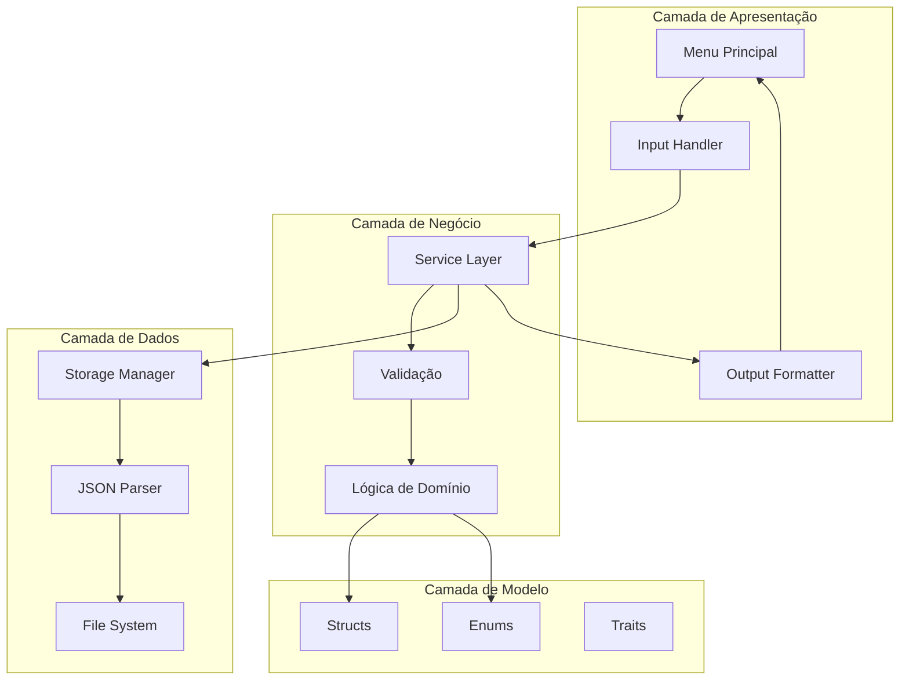
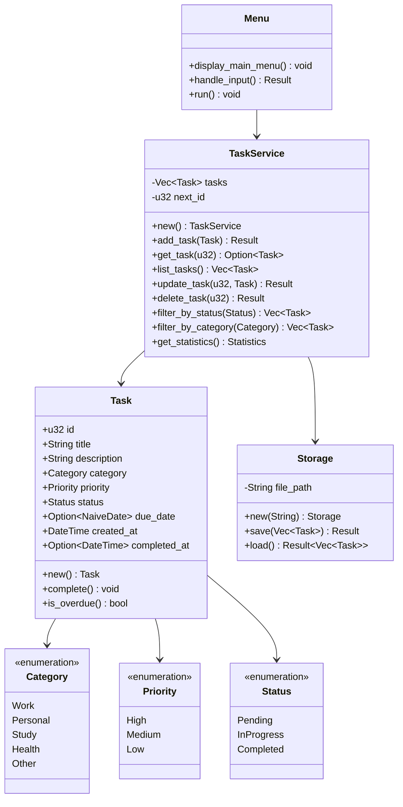
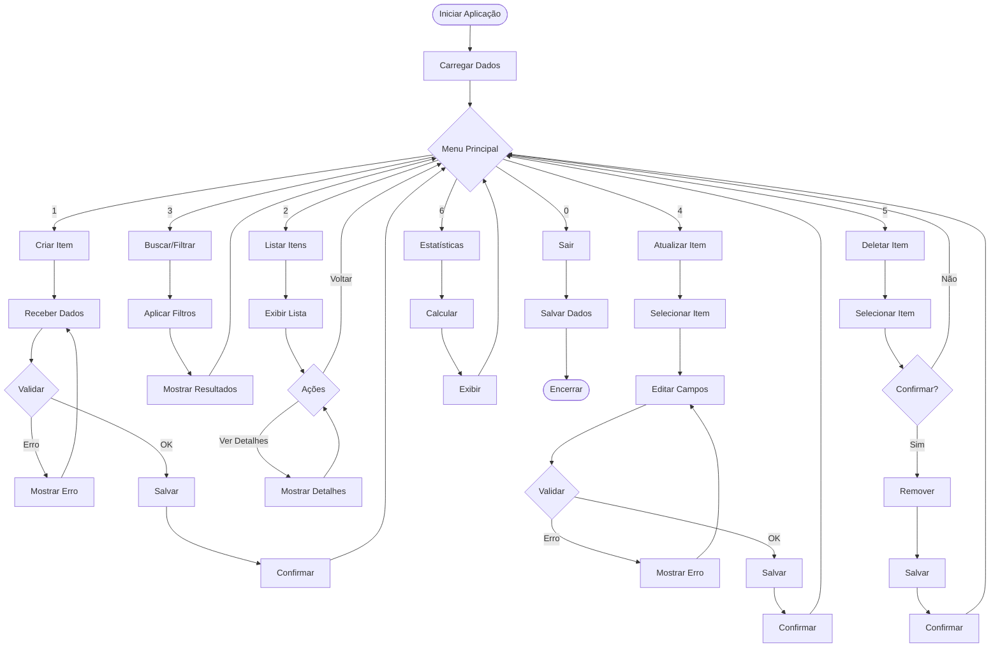
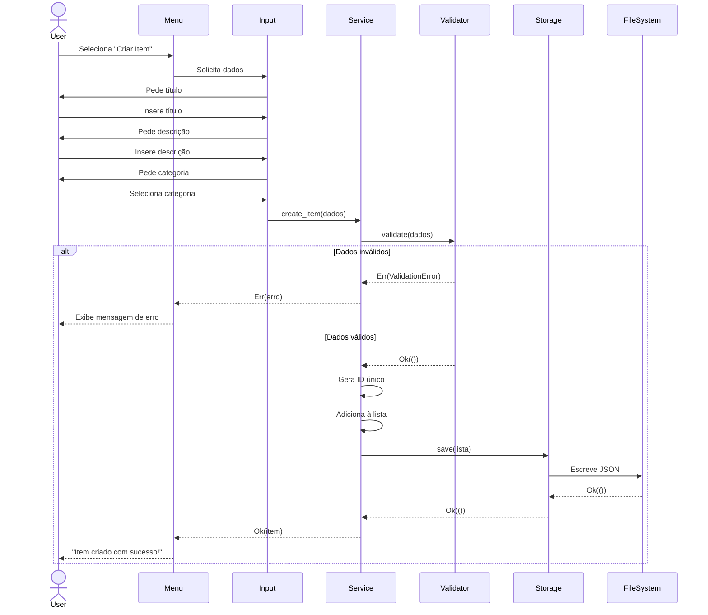
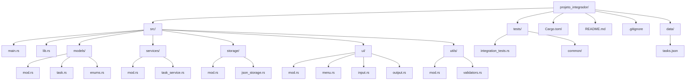
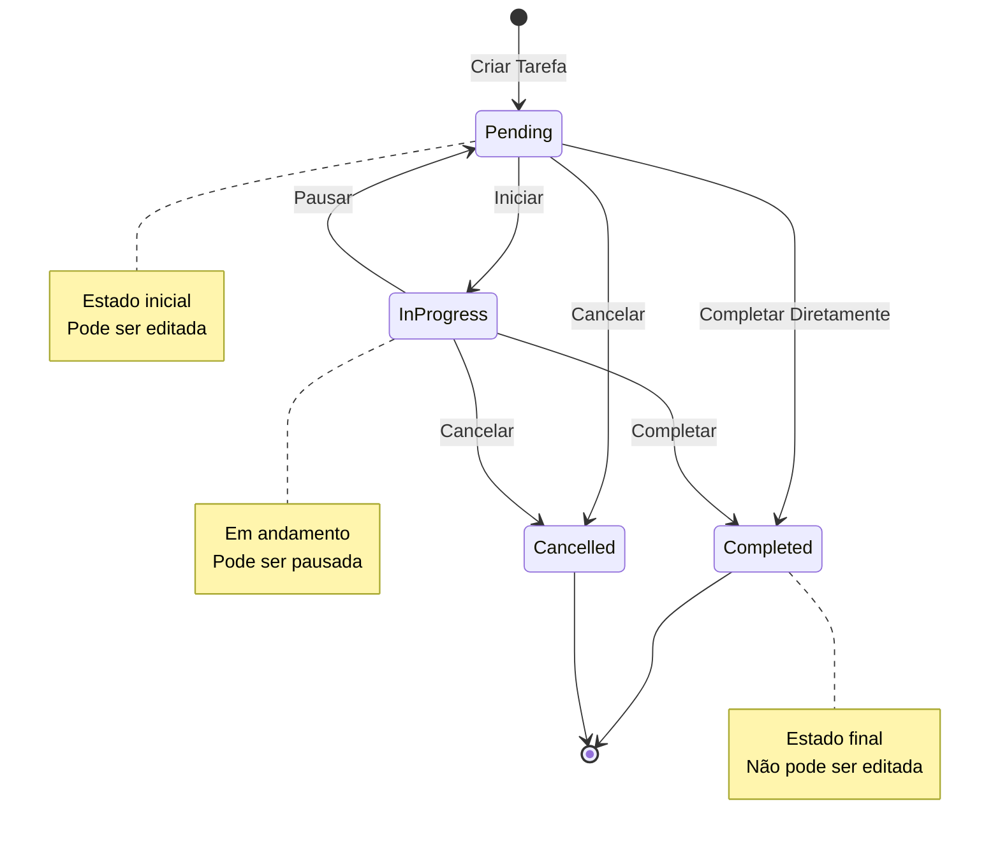

# 🎓 Dia 14: Projeto Integrador - Fase 1 de Rust

## 🎯 Parabéns por Chegar Aqui!

Você completou 13 dias de aprendizado intenso! Agora é hora de **construir sua obra-prima**: um projeto real que integra TUDO o que você aprendeu.

---

## 🏆 OBJETIVOS DE APRENDIZAGEM

Ao final deste projeto, você será capaz de:

✅ **Integrar** todos os conceitos dos dias 1-13 em uma aplicação coesa  
✅ **Organizar** código em módulos seguindo boas práticas  
✅ **Implementar** operações CRUD completas  
✅ **Persistir** dados usando arquivos JSON  
✅ **Tratar** erros de forma robusta e profissional  
✅ **Testar** seu código com testes unitários e de integração  
✅ **Documentar** seu trabalho para outros desenvolvedores  
✅ **Desenvolver** confiança para projetos mais complexos  

---

## 🎭 MOTIVAÇÃO E CONTEXTO

### 📖 A Jornada Até Aqui

Nos últimos 13 dias, você aprendeu:

- **Dias 1-3**: Fundamentos (variáveis, tipos, funções)
- **Dias 4-6**: Estruturas de controle e coleções
- **Dias 7-9**: Structs, enums e pattern matching
- **Dias 10-12**: Tratamento de erros, iteradores e módulos
- **Dia 13**: Testes e documentação

### 🏗️ Analogia: Construindo Sua Casa

Imagine que você aprendeu a:
- Fazer tijolos (variáveis)
- Misturar cimento (funções)
- Ler plantas (structs)
- Instalar encanamento (coleções)
- Colocar fiação elétrica (controle de fluxo)

**Hoje você vai construir a casa completa!** 🏠

### 💡 Por Que Este Projeto É Importante?

> "Conhecimento sem aplicação é como uma ferramenta que nunca sai da caixa."

Este projeto vai:
- **Consolidar** seu aprendizado através da prática
- **Revelar** lacunas de conhecimento para revisar
- **Criar** algo tangível para seu portfólio
- **Preparar** você para projetos profissionais reais

---

## 📚 ESCOLHA SEU DOMÍNIO

Escolha **UM** dos projetos abaixo (ou crie o seu próprio):

### 1️⃣ Gerenciador de Tarefas Avançado

**Descrição**: Sistema completo de produtividade com categorias, prioridades e filtros.

**Funcionalidades**:
- ✅ Criar, editar, listar e deletar tarefas
- 🏷️ Categorias (Trabalho, Pessoal, Estudos)
- ⭐ Níveis de prioridade (Alta, Média, Baixa)
- 📅 Datas de vencimento
- ✔️ Marcar como concluída
- 🔍 Filtrar por status, categoria, prioridade
- 📊 Estatísticas (total, concluídas, pendentes)

**Ideal para**: Quem gosta de organização e produtividade

---

### 2️⃣ Gerenciador de Finanças Pessoais

**Descrição**: Controle completo de receitas e despesas com análises.

**Funcionalidades**:
- 💰 Registrar receitas e despesas
- 🏷️ Categorias (Alimentação, Transporte, Lazer, etc.)
- 📅 Data e descrição de cada transação
- 💳 Tipos de pagamento (Dinheiro, Cartão, PIX)
- 📊 Relatórios (saldo, gastos por categoria)
- 🔍 Filtrar por período, categoria, tipo
- 📈 Estatísticas mensais

**Ideal para**: Quem quer controlar melhor o dinheiro

---

### 3️⃣ Catálogo de Livros/Filmes

**Descrição**: Biblioteca pessoal digital com avaliações e busca.

**Funcionalidades**:
- 📚 Adicionar livros/filmes com detalhes completos
- ⭐ Sistema de avaliação (1-5 estrelas)
- 🏷️ Gêneros e tags
- 📖 Status (Lido/Assistido, Lendo/Assistindo, Quero Ler/Ver)
- 🔍 Buscar por título, autor/diretor, gênero
- 📊 Estatísticas (total por gênero, média de avaliações)
- 💬 Notas e comentários pessoais

**Ideal para**: Amantes de livros e filmes

---

### 4️⃣ Sistema de Notas de Estudos

**Descrição**: Organize seus estudos com notas estruturadas e revisões.

**Funcionalidades**:
- 📝 Criar notas com título, conteúdo e tags
- 📚 Matérias/disciplinas
- 🏷️ Tags para organização
- 📅 Data de criação e última edição
- 🔍 Busca por palavra-chave, matéria, tag
- ⭐ Marcar notas importantes
- 📊 Estatísticas por matéria

**Ideal para**: Estudantes organizados

---

## 🏗️ ARQUITETURA DO PROJETO

Vamos usar a arquitetura **MVC adaptada** para CLI:

```
┌─────────────────────────────────────────┐
│            MAIN (main.rs)               │
│         Ponto de Entrada                │
└─────────────────┬───────────────────────┘
                  │
        ┌─────────┴─────────┐
        │                   │
┌───────▼────────┐  ┌──────▼──────┐
│   UI Module    │  │   Storage   │
│   (interface)  │  │   (JSON)    │
└───────┬────────┘  └──────┬──────┘
        │                   │
        └─────────┬─────────┘
                  │
          ┌───────▼────────┐
          │  Services      │
          │  (lógica)      │
          └───────┬────────┘
                  │
          ┌───────▼────────┐
          │    Models      │
          │  (structs)     │
          └────────────────┘
```

---

## 📐 ESPECIFICAÇÃO TÉCNICA COMPLETA

### 🎯 Requisitos Funcionais

#### RF01: Interface CLI Interativa
- Menu principal com opções numeradas
- Navegação clara e intuitiva
- Mensagens de confirmação para ações destrutivas
- Opção de voltar/sair em cada submenu

#### RF02: Operações CRUD Completas
- **Create**: Adicionar novos itens com validação
- **Read**: Listar todos ou buscar específicos
- **Update**: Editar itens existentes
- **Delete**: Remover itens com confirmação

#### RF03: Persistência em Arquivo
- Salvar dados em formato JSON
- Carregar dados ao iniciar
- Auto-save após cada operação
- Tratamento de arquivo corrompido

#### RF04: Validação de Dados
- Campos obrigatórios
- Formatos válidos (datas, emails, etc.)
- Valores dentro de ranges permitidos
- Mensagens de erro claras

#### RF05: Tratamento de Erros
- Captura de erros de I/O
- Erros de parsing JSON
- Validação de entrada do usuário
- Mensagens amigáveis (não técnicas)

#### RF06: Busca e Filtros
- Buscar por diferentes critérios
- Filtros combinados
- Ordenação de resultados
- Paginação (se muitos resultados)

#### RF07: Estatísticas e Relatórios
- Contadores básicos
- Agrupamentos por categoria
- Cálculos agregados (soma, média)
- Visualização formatada

---

### 🔧 Requisitos Técnicos

#### RT01: Organização em Módulos

```
src/
├── main.rs              # Ponto de entrada
├── models/              # Estruturas de dados
│   ├── mod.rs
│   └── [domain].rs      # Ex: task.rs, transaction.rs
├── services/            # Lógica de negócio
│   ├── mod.rs
│   └── [domain]_service.rs
├── storage/             # Persistência
│   ├── mod.rs
│   └── json_storage.rs
├── ui/                  # Interface do usuário
│   ├── mod.rs
│   ├── menu.rs
│   └── input.rs
└── lib.rs               # Exports públicos
```

#### RT02: Uso de Structs e Enums
- Structs para entidades principais
- Enums para estados e categorias
- Traits para comportamentos comuns
- Derive macros (Debug, Clone, Serialize)

#### RT03: Coleções
- `Vec<T>` para listas de itens
- `HashMap<K, V>` para índices rápidos
- Iteradores para processamento
- Métodos funcionais (map, filter, fold)

#### RT04: Tratamento de Erros
- Tipo `Result<T, E>` em todas operações falíveis
- Enum customizado de erros
- Propagação com operador `?`
- Conversão de erros (From trait)

#### RT05: Testes
- Testes unitários para cada módulo
- Testes de integração para fluxos completos
- Cobertura mínima de 70%
- Testes de casos extremos

#### RT06: Documentação
- Doc comments (`///`) em funções públicas
- Exemplos de uso em comentários
- README.md completo
- Comentários inline para lógica complexa

---

## 📊 DIAGRAMAS DO SISTEMA

### 1. Arquitetura Geral (Componentes)



### 2. Diagrama de Classes (Exemplo: Gerenciador de Tarefas)



### 3. Fluxograma de Navegação do Menu



### 4. Diagrama de Sequência (Criar Item)



### 5. Estrutura de Diretórios Completa



### 6. Diagrama de Estados (Tarefa)



---

## 🚀 GUIA DE IMPLEMENTAÇÃO PASSO A PASSO

### ⏱️ ETAPA 1: Planejamento (30 minutos)

#### 🎯 Objetivo
Definir claramente o que você vai construir antes de escrever código.

#### ✅ Checklist

**1. Escolha seu domínio**
- [ ] Decidi qual projeto vou fazer
- [ ] Entendi as funcionalidades principais
- [ ] Sei quem é o usuário final

**2. Defina as funcionalidades**
- [ ] Listei todas as operações CRUD
- [ ] Defini quais filtros/buscas vou implementar
- [ ] Planejei as estatísticas a exibir

**3. Desenhe os modelos de dados**
- [ ] Identifiquei as entidades principais (structs)
- [ ] Listei os campos de cada struct
- [ ] Defini os enums necessários
- [ ] Pensei nas relações entre entidades

**4. Planeje os módulos**
- [ ] Desenhei a estrutura de pastas
- [ ] Defini responsabilidades de cada módulo
- [ ] Pensei em como os módulos vão se comunicar

#### 📝 Exercício Prático

**Preencha este template:**

```
PROJETO: [Nome do seu projeto]

FUNCIONALIDADES PRINCIPAIS:
1. 
2. 
3. 
4. 
5. 

ENTIDADES (Structs):
- [Nome]: [campos principais]
- [Nome]: [campos principais]

ENUMS:
- [Nome]: [variantes]
- [Nome]: [variantes]

MÓDULOS:
- models: [responsabilidade]
- services: [responsabilidade]
- storage: [responsabilidade]
- ui: [responsabilidade]
```

#### 💡 Dica
> Gaste tempo planejando! 30 minutos de planejamento economizam horas de refatoração.

---

### ⏱️ ETAPA 2: Setup do Projeto (20 minutos)

#### 🎯 Objetivo
Criar a estrutura base do projeto com todas as pastas e arquivos necessários.

#### 📋 Passo a Passo

**1. Crie o projeto**

```bash
cargo new gerenciador_tarefas
cd gerenciador_tarefas
```

**2. Configure o Cargo.toml**

```toml
[package]
name = "gerenciador_tarefas"
version = "0.1.0"
edition = "2021"

[dependencies]
serde = { version = "1.0", features = ["derive"] }
serde_json = "1.0"
chrono = { version = "0.4", features = ["serde"] }

[dev-dependencies]
```

**3. Crie a estrutura de diretórios**

```bash
mkdir -p src/models
mkdir -p src/services
mkdir -p src/storage
mkdir -p src/ui
mkdir -p src/utils
mkdir -p tests
mkdir -p data
```

**4. Crie os arquivos de módulo**

```bash
# Models
touch src/models/mod.rs
touch src/models/task.rs
touch src/models/enums.rs

# Services
touch src/services/mod.rs
touch src/services/task_service.rs

# Storage
touch src/storage/mod.rs
touch src/storage/json_storage.rs

# UI
touch src/ui/mod.rs
touch src/ui/menu.rs
touch src/ui/input.rs
touch src/ui/output.rs

# Utils
touch src/utils/mod.rs
touch src/utils/validators.rs

# Lib
touch src/lib.rs

# Tests
touch tests/integration_tests.rs
```

**5. Configure o lib.rs**

```rust {.line-numbers}
// src/lib.rs
pub mod models;
pub mod services;
pub mod storage;
pub mod ui;
pub mod utils;
```

**6. Configure cada mod.rs**

```rust {.line-numbers}
// src/models/mod.rs
pub mod task;
pub mod enums;

pub use task::Task;
pub use enums::{Category, Priority, Status};
```

```rust {.line-numbers}
// src/services/mod.rs
pub mod task_service;

pub use task_service::TaskService;
```

```rust {.line-numbers}
// src/storage/mod.rs
pub mod json_storage;

pub use json_storage::Storage;
```

```rust {.line-numbers}
// src/ui/mod.rs
pub mod menu;
pub mod input;
pub mod output;

pub use menu::Menu;
```

```rust {.line-numbers}
// src/utils/mod.rs
pub mod validators;
```

**7. Crie o README.md**

```markdown {.line-numbers}
# Gerenciador de Tarefas

Aplicação CLI para gerenciar tarefas com categorias, prioridades e filtros.

## Funcionalidades

- [ ] Criar tarefas
- [ ] Listar tarefas
- [ ] Atualizar tarefas
- [ ] Deletar tarefas
- [ ] Filtrar por status/categoria
- [ ] Estatísticas

## Como usar

```bash
cargo run
```

## Testes

```bash
cargo test
```
```

**8. Crie o .gitignore**

```
/target
/data/*.json
Cargo.lock
```

#### ✅ Checklist de Verificação

- [ ] Projeto criado com `cargo new`
- [ ] Cargo.toml configurado com dependências
- [ ] Estrutura de pastas criada
- [ ] Todos os arquivos .rs criados
- [ ] Módulos configurados em mod.rs
- [ ] lib.rs exportando módulos
- [ ] README.md criado
- [ ] .gitignore configurado
- [ ] Projeto compila sem erros (`cargo build`)

#### 🧪 Teste

```bash
cargo build
```

Deve compilar sem erros (mesmo com arquivos vazios).

---

### ⏱️ ETAPA 3: Models (40 minutos)

#### 🎯 Objetivo
Criar as estruturas de dados que representam as entidades do seu domínio.

#### 📋 Implementação

**1. Defina os Enums (src/models/enums.rs)**

```rust {.line-numbers}
use serde::{Deserialize, Serialize};

#[derive(Debug, Clone, Copy, PartialEq, Eq, Serialize, Deserialize)]
pub enum Category {
    Work,
    Personal,
    Study,
    Health,
    Other,
}

impl Category {
    pub fn all() -> Vec<Category> {
        vec![
            Category::Work,
            Category::Personal,
            Category::Study,
            Category::Health,
            Category::Other,
        ]
    }
    
    pub fn as_str(&self) -> &str {
        match self {
            Category::Work => "Trabalho",
            Category::Personal => "Pessoal",
            Category::Study => "Estudos",
            Category::Health => "Saúde",
            Category::Other => "Outro",
        }
    }
}

#[derive(Debug, Clone, Copy, PartialEq, Eq, Serialize, Deserialize)]
pub enum Priority {
    High,
    Medium,
    Low,
}

impl Priority {
    pub fn all() -> Vec<Priority> {
        vec![Priority::High, Priority::Medium, Priority::Low]
    }
    
    pub fn as_str(&self) -> &str {
        match self {
            Priority::High => "Alta",
            Priority::Medium => "Média",
            Priority::Low => "Baixa",
        }
    }
}

#[derive(Debug, Clone, Copy, PartialEq, Eq, Serialize, Deserialize)]
pub enum Status {
    Pending,
    InProgress,
    Completed,
}

impl Status {
    pub fn as_str(&self) -> &str {
        match self {
            Status::Pending => "Pendente",
            Status::InProgress => "Em Andamento",
            Status::Completed => "Concluída",
        }
    }
}
```

**2. Defina a Struct Principal (src/models/task.rs)**

```rust {.line-numbers}
use chrono::{DateTime, Local, NaiveDate};
use serde::{Deserialize, Serialize};

use super::enums::{Category, Priority, Status};

#[derive(Debug, Clone, Serialize, Deserialize)]
pub struct Task {
    pub id: u32,
    pub title: String,
    pub description: String,
    pub category: Category,
    pub priority: Priority,
    pub status: Status,
    pub due_date: Option<NaiveDate>,
    pub created_at: DateTime<Local>,
    pub completed_at: Option<DateTime<Local>>,
}

impl Task {
    /// Cria uma nova tarefa
    pub fn new(
        id: u32,
        title: String,
        description: String,
        category: Category,
        priority: Priority,
        due_date: Option<NaiveDate>,
    ) -> Self {
        Task {
            id,
            title,
            description,
            category,
            priority,
            status: Status::Pending,
            due_date,
            created_at: Local::now(),
            completed_at: None,
        }
    }

    /// Marca a tarefa como concluída
    pub fn complete(&mut self) {
        self.status = Status::Completed;
        self.completed_at = Some(Local::now());
    }

    /// Verifica se a tarefa está atrasada
    pub fn is_overdue(&self) -> bool {
        if let Some(due_date) = self.due_date {
            if self.status != Status::Completed {
                let today = Local::now().date_naive();
                return due_date < today;
            }
        }
        false
    }

    /// Inicia a tarefa (muda status para InProgress)
    pub fn start(&mut self) {
        if self.status == Status::Pending {
            self.status = Status::InProgress;
        }
    }
}

#[cfg(test)]
mod tests {
    use super::*;
    use chrono::Duration;

    #[test]
    fn test_new_task() {
        let task = Task::new(
            1,
            "Estudar Rust".to_string(),
            "Completar Fase 1".to_string(),
            Category::Study,
            Priority::High,
            None,
        );

        assert_eq!(task.id, 1);
        assert_eq!(task.title, "Estudar Rust");
        assert_eq!(task.status, Status::Pending);
        assert!(task.completed_at.is_none());
    }

    #[test]
    fn test_complete_task() {
        let mut task = Task::new(
            1,
            "Test".to_string(),
            "Desc".to_string(),
            Category::Work,
            Priority::Medium,
            None,
        );

        task.complete();

        assert_eq!(task.status, Status::Completed);
        assert!(task.completed_at.is_some());
    }

    #[test]
    fn test_is_overdue() {
        let yesterday = Local::now().date_naive() - Duration::days(1);
        let task = Task::new(
            1,
            "Test".to_string(),
            "Desc".to_string(),
            Category::Work,
            Priority::High,
            Some(yesterday),
        );

        assert!(task.is_overdue());
    }

    #[test]
    fn test_not_overdue_when_completed() {
        let yesterday = Local::now().date_naive() - Duration::days(1);
        let mut task = Task::new(
            1,
            "Test".to_string(),
            "Desc".to_string(),
            Category::Work,
            Priority::High,
            Some(yesterday),
        );

        task.complete();

        assert!(!task.is_overdue());
    }

    #[test]
    fn test_start_task() {
        let mut task = Task::new(
            1,
            "Test".to_string(),
            "Desc".to_string(),
            Category::Work,
            Priority::Medium,
            None,
        );

        task.start();

        assert_eq!(task.status, Status::InProgress);
    }
}
```

#### ✅ Checklist de Verificação

- [ ] Enums definidos com Serialize/Deserialize
- [ ] Métodos auxiliares nos enums (as_str, all)
- [ ] Struct principal com todos os campos
- [ ] Construtor (new) implementado
- [ ] Métodos de comportamento (complete, is_overdue, start)
- [ ] Testes unitários escritos
- [ ] Todos os testes passando (`cargo test`)

#### 🧪 Execute os Testes

```bash
cargo test models
```

Todos devem passar! ✅

---

### ⏱️ ETAPA 4: Storage (30 minutos)

#### 🎯 Objetivo
Implementar a persistência de dados em arquivo JSON.

#### 📋 Implementação

**src/storage/json_storage.rs**

```rust {.line-numbers}
use serde::{Deserialize, Serialize};
use std::fs;
use std::io;
use std::path::Path;

/// Gerenciador de armazenamento em JSON
pub struct Storage {
    file_path: String,
}

impl Storage {
    /// Cria uma nova instância de Storage
    pub fn new(file_path: String) -> Self {
        Storage { file_path }
    }

    /// Salva dados em arquivo JSON
    pub fn save<T>(&self, data: &T) -> io::Result<()>
    where
        T: Serialize,
    {
        // Serializa para JSON com formatação bonita
        let json = serde_json::to_string_pretty(data)
            .map_err(|e| io::Error::new(io::ErrorKind::InvalidData, e))?;

        // Cria o diretório se não existir
        if let Some(parent) = Path::new(&self.file_path).parent() {
            fs::create_dir_all(parent)?;
        }

        // Escreve no arquivo
        fs::write(&self.file_path, json)?;

        Ok(())
    }

    /// Carrega dados do arquivo JSON
    pub fn load<T>(&self) -> io::Result<T>
    where
        T: for<'de> Deserialize<'de>,
    {
        // Verifica se o arquivo existe
        if !Path::new(&self.file_path).exists() {
            return Err(io::Error::new(
                io::ErrorKind::NotFound,
                "Arquivo não encontrado",
            ));
        }

        // Lê o arquivo
        let json = fs::read_to_string(&self.file_path)?;

        // Deserializa o JSON
        let data = serde_json::from_str(&json)
            .map_err(|e| io::Error::new(io::ErrorKind::InvalidData, e))?;

        Ok(data)
    }

    /// Verifica se o arquivo existe
    pub fn exists(&self) -> bool {
        Path::new(&self.file_path).exists()
    }

    /// Deleta o arquivo de armazenamento
    pub fn delete(&self) -> io::Result<()> {
        if self.exists() {
            fs::remove_file(&self.file_path)?;
        }
        Ok(())
    }
}

#[cfg(test)]
mod tests {
    use super::*;
    use serde::{Deserialize, Serialize};

    #[derive(Debug, Serialize, Deserialize, PartialEq)]
    struct TestData {
        id: u32,
        name: String,
    }

    #[test]
    fn test_save_and_load() {
        let storage = Storage::new("data/test_storage.json".to_string());

        let data = TestData {
            id: 1,
            name: "Test".to_string(),
        };

        // Salva
        storage.save(&data).unwrap();

        // Carrega
        let loaded: TestData = storage.load().unwrap();

        assert_eq!(data, loaded);

        // Limpa
        storage.delete().unwrap();
    }

    #[test]
    fn test_load_nonexistent_file() {
        let storage = Storage::new("data/nonexistent.json".to_string());

        let result: io::Result<TestData> = storage.load();

        assert!(result.is_err());
    }

    #[test]
    fn test_exists() {
        let storage = Storage::new("data/test_exists.json".to_string());

        assert!(!storage.exists());

        let data = TestData {
            id: 1,
            name: "Test".to_string(),
        };
        storage.save(&data).unwrap();

        assert!(storage.exists());

        storage.delete().unwrap();
        assert!(!storage.exists());
    }
}
```

#### ✅ Checklist de Verificação

- [ ] Struct Storage criada
- [ ] Método save implementado
- [ ] Método load implementado
- [ ] Método exists implementado
- [ ] Método delete implementado
- [ ] Tratamento de erros com Result
- [ ] Criação de diretório automática
- [ ] Testes unitários escritos
- [ ] Todos os testes passando

#### 🧪 Execute os Testes

```bash
cargo test storage
```

---

### ⏱️ ETAPA 5: Services (50 minutos)

#### 🎯 Objetivo
Implementar a lógica de negócio com operações CRUD completas.

#### 📋 Implementação

**src/services/task_service.rs**

```rust {.line-numbers}
use crate::models::{Category, Priority, Status, Task};
use crate::storage::Storage;
use std::io;

/// Serviço para gerenciar tarefas
pub struct TaskService {
    tasks: Vec<Task>,
    next_id: u32,
    storage: Storage,
}

impl TaskService {
    /// Cria um novo TaskService
    pub fn new(storage_path: String) -> Self {
        let storage = Storage::new(storage_path);
        let (tasks, next_id) = Self::load_from_storage(&storage);

        TaskService {
            tasks,
            next_id,
            storage,
        }
    }

    /// Carrega tarefas do storage
    fn load_from_storage(storage: &Storage) -> (Vec<Task>, u32) {
        match storage.load::<Vec<Task>>() {
            Ok(tasks) => {
                let max_id = tasks.iter().map(|t| t.id).max().unwrap_or(0);
                (tasks, max_id + 1)
            }
            Err(_) => (Vec::new(), 1),
        }
    }

    /// Salva tarefas no storage
    fn save(&self) -> io::Result<()> {
        self.storage.save(&self.tasks)
    }

    /// Adiciona uma nova tarefa
    pub fn add_task(
        &mut self,
        title: String,
        description: String,
        category: Category,
        priority: Priority,
        due_date: Option<chrono::NaiveDate>,
    ) -> io::Result<&Task> {
        let task = Task::new(
            self.next_id,
            title,
            description,
            category,
            priority,
            due_date,
        );

        self.tasks.push(task);
        self.next_id += 1;
        self.save()?;

        Ok(self.tasks.last().unwrap())
    }

    /// Retorna todas as tarefas
    pub fn list_all(&self) -> &[Task] {
        &self.tasks
    }

    /// Busca uma tarefa por ID
    pub fn get_by_id(&self, id: u32) -> Option<&Task> {
        self.tasks.iter().find(|t| t.id == id)
    }

    /// Atualiza uma tarefa
    pub fn update_task(
        &mut self,
        id: u32,
        title: Option<String>,
        description: Option<String>,
        category: Option<Category>,
        priority: Option<Priority>,
        due_date: Option<Option<chrono::NaiveDate>>,
    ) -> io::Result<()> {
        let task = self
            .tasks
            .iter_mut()
            .find(|t| t.id == id)
            .ok_or_else(|| io::Error::new(io::ErrorKind::NotFound, "Tarefa não encontrada"))?;

        if let Some(t) = title {
            task.title = t;
        }
        if let Some(d) = description {
            task.description = d;
        }
        if let Some(c) = category {
            task.category = c;
        }
        if let Some(p) = priority {
            task.priority = p;
        }
        if let Some(dd) = due_date {
            task.due_date = dd;
        }

        self.save()
    }

    /// Deleta uma tarefa
    pub fn delete_task(&mut self, id: u32) -> io::Result<()> {
        let index = self
            .tasks
            .iter()
            .position(|t| t.id == id)
            .ok_or_else(|| io::Error::new(io::ErrorKind::NotFound, "Tarefa não encontrada"))?;

        self.tasks.remove(index);
        self.save()
    }

    /// Marca uma tarefa como concluída
    pub fn complete_task(&mut self, id: u32) -> io::Result<()> {
        let task = self
            .tasks
            .iter_mut()
            .find(|t| t.id == id)
            .ok_or_else(|| io::Error::new(io::ErrorKind::NotFound, "Tarefa não encontrada"))?;

        task.complete();
        self.save()
    }

    /// Inicia uma tarefa
    pub fn start_task(&mut self, id: u32) -> io::Result<()> {
        let task = self
            .tasks
            .iter_mut()
            .find(|t| t.id == id)
            .ok_or_else(|| io::Error::new(io::ErrorKind::NotFound, "Tarefa não encontrada"))?;

        task.start();
        self.save()
    }

    /// Filtra tarefas por status
    pub fn filter_by_status(&self, status: Status) -> Vec<&Task> {
        self.tasks
            .iter()
            .filter(|t| t.status == status)
            .collect()
    }

    /// Filtra tarefas por categoria
    pub fn filter_by_category(&self, category: Category) -> Vec<&Task> {
        self.tasks
            .iter()
            .filter(|t| t.category == category)
            .collect()
    }

    /// Filtra tarefas por prioridade
    pub fn filter_by_priority(&self, priority: Priority) -> Vec<&Task> {
        self.tasks
            .iter()
            .filter(|t| t.priority == priority)
            .collect()
    }

    /// Retorna tarefas atrasadas
    pub fn get_overdue(&self) -> Vec<&Task> {
        self.tasks.iter().filter(|t| t.is_overdue()).collect()
    }

    /// Retorna estatísticas
    pub fn get_statistics(&self) -> Statistics {
        let total = self.tasks.len();
        let completed = self.filter_by_status(Status::Completed).len();
        let in_progress = self.filter_by_status(Status::InProgress).len();
        let pending = self.filter_by_status(Status::Pending).len();
        let overdue = self.get_overdue().len();

        let by_category = Category::all()
            .iter()
            .map(|c| (*c, self.filter_by_category(*c).len()))
            .collect();

        let by_priority = Priority::all()
            .iter()
            .map(|p| (*p, self.filter_by_priority(*p).len()))
            .collect();

        Statistics {
            total,
            completed,
            in_progress,
            pending,
            overdue,
            by_category,
            by_priority,
        }
    }
}

/// Estrutura para estatísticas
#[derive(Debug)]
pub struct Statistics {
    pub total: usize,
    pub completed: usize,
    pub in_progress: usize,
    pub pending: usize,
    pub overdue: usize,
    pub by_category: Vec<(Category, usize)>,
    pub by_priority: Vec<(Priority, usize)>,
}

#[cfg(test)]
mod tests {
    use super::*;
    use chrono::Local;

    fn create_test_service() -> TaskService {
        TaskService::new("data/test_tasks.json".to_string())
    }

    #[test]
    fn test_add_task() {
        let mut service = create_test_service();
        let initial_count = service.list_all().len();

        service
            .add_task(
                "Test Task".to_string(),
                "Description".to_string(),
                Category::Work,
                Priority::High,
                None,
            )
            .unwrap();

        assert_eq!(service.list_all().len(), initial_count + 1);

        // Cleanup
        service.storage.delete().ok();
    }

    #[test]
    fn test_get_by_id() {
        let mut service = create_test_service();

        let task = service
            .add_task(
                "Test".to_string(),
                "Desc".to_string(),
                Category::Personal,
                Priority::Medium,
                None,
            )
            .unwrap();

        let id = task.id;
        let found = service.get_by_id(id);

        assert!(found.is_some());
        assert_eq!(found.unwrap().title, "Test");

        // Cleanup
        service.storage.delete().ok();
    }

    #[test]
    fn test_update_task() {
        let mut service = create_test_service();

        let task = service
            .add_task(
                "Original".to_string(),
                "Desc".to_string(),
                Category::Work,
                Priority::Low,
                None,
            )
            .unwrap();

        let id = task.id;

        service
            .update_task(
                id,
                Some("Updated".to_string()),
                None,
                None,
                Some(Priority::High),
                None,
            )
            .unwrap();

        let updated = service.get_by_id(id).unwrap();
        assert_eq!(updated.title, "Updated");
        assert_eq!(updated.priority, Priority::High);

        // Cleanup
        service.storage.delete().ok();
    }

    #[test]
    fn test_delete_task() {
        let mut service = create_test_service();

        let task = service
            .add_task(
                "To Delete".to_string(),
                "Desc".to_string(),
                Category::Other,
                Priority::Low,
                None,
            )
            .unwrap();

        let id = task.id;
        let count_before = service.list_all().len();

        service.delete_task(id).unwrap();

        assert_eq!(service.list_all().len(), count_before - 1);
        assert!(service.get_by_id(id).is_none());

        // Cleanup
        service.storage.delete().ok();
    }

    #[test]
    fn test_complete_task() {
        let mut service = create_test_service();

        let task = service
            .add_task(
                "To Complete".to_string(),
                "Desc".to_string(),
                Category::Study,
                Priority::Medium,
                None,
            )
            .unwrap();

        let id = task.id;

        service.complete_task(id).unwrap();

        let completed = service.get_by_id(id).unwrap();
        assert_eq!(completed.status, Status::Completed);
        assert!(completed.completed_at.is_some());

        // Cleanup
        service.storage.delete().ok();
    }

    #[test]
    fn test_filter_by_status() {
        let mut service = create_test_service();

        service
            .add_task(
                "Task 1".to_string(),
                "Desc".to_string(),
                Category::Work,
                Priority::High,
                None,
            )
            .unwrap();

        let task2 = service
            .add_task(
                "Task 2".to_string(),
                "Desc".to_string(),
                Category::Work,
                Priority::High,
                None,
            )
            .unwrap();

        service.complete_task(task2.id).unwrap();

        let pending = service.filter_by_status(Status::Pending);
        let completed = service.filter_by_status(Status::Completed);

        assert_eq!(pending.len(), 1);
        assert_eq!(completed.len(), 1);

        // Cleanup
        service.storage.delete().ok();
    }

    #[test]
    fn test_statistics() {
        let mut service = create_test_service();

        service
            .add_task(
                "Task 1".to_string(),
                "Desc".to_string(),
                Category::Work,
                Priority::High,
                None,
            )
            .unwrap();

        service
            .add_task(
                "Task 2".to_string(),
                "Desc".to_string(),
                Category::Personal,
                Priority::Medium,
                None,
            )
            .unwrap();

        let stats = service.get_statistics();

        assert_eq!(stats.total, 2);
        assert_eq!(stats.pending, 2);
        assert_eq!(stats.completed, 0);

        // Cleanup
        service.storage.delete().ok();
    }
}
```

#### ✅ Checklist de Verificação

- [ ] TaskService struct criada
- [ ] Método add_task implementado
- [ ] Método list_all implementado
- [ ] Método get_by_id implementado
- [ ] Método update_task implementado
- [ ] Método delete_task implementado
- [ ] Métodos de filtro implementados
- [ ] Método de estatísticas implementado
- [ ] Auto-save após cada operação
- [ ] Testes para todas as operações
- [ ] Todos os testes passando

#### 🧪 Execute os Testes

```bash
cargo test services
```

---

### ⏱️ ETAPA 6: UI - Interface do Usuário (40 minutos)

#### 🎯 Objetivo
Criar a interface CLI interativa com menus e entrada de dados.

#### 📋 Implementação

**1. Módulo de Input (src/ui/input.rs)**

```rust {.line-numbers}
use std::io::{self, Write};

/// Lê uma linha de entrada do usuário
pub fn read_line(prompt: &str) -> String {
    print!("{}", prompt);
    io::stdout().flush().unwrap();

    let mut input = String::new();
    io::stdin()
        .read_line(&mut input)
        .expect("Falha ao ler entrada");

    input.trim().to_string()
}

/// Lê um número do usuário
pub fn read_number(prompt: &str) -> Option<u32> {
    let input = read_line(prompt);
    input.parse::<u32>().ok()
}

/// Lê uma opção do menu
pub fn read_option(prompt: &str, max: u32) -> Option<u32> {
    let option = read_number(prompt)?;
    if option <= max {
        Some(option)
    } else {
        None
    }
}

/// Confirma uma ação (s/n)
pub fn confirm(prompt: &str) -> bool {
    let input = read_line(&format!("{} (s/n): ", prompt));
    matches!(input.to_lowercase().as_str(), "s" | "sim" | "y" | "yes")
}

/// Pausa até o usuário pressionar Enter
pub fn pause() {
    read_line("\nPressione Enter para continuar...");
}
```

**2. Módulo de Output (src/ui/output.rs)**

```rust {.line-numbers}
use crate::models::Task;
use crate::services::Statistics;

/// Limpa a tela
pub fn clear_screen() {
    print!("\x1B[2J\x1B[1;1H");
}

/// Exibe o cabeçalho
pub fn print_header(title: &str) {
    println!("\n╔══════════════════════════════════════════════════════════╗");
    println!("║  {:^54}  ║", title);
    println!("╚══════════════════════════════════════════════════════════╝\n");
}

/// Exibe uma mensagem de sucesso
pub fn print_success(message: &str) {
    println!("\n✅ {}", message);
}

/// Exibe uma mensagem de erro
pub fn print_error(message: &str) {
    println!("\n❌ Erro: {}", message);
}

/// Exibe uma mensagem de aviso
pub fn print_warning(message: &str) {
    println!("\n⚠️  {}", message);
}

/// Exibe uma tarefa formatada
pub fn print_task(task: &Task) {
    println!("┌─────────────────────────────────────────────────────────┐");
    println!("│ ID: {:<52} │", task.id);
    println!("│ Título: {:<48} │", task.title);
    println!("│ Descrição: {:<45} │", task.description);
    println!("│ Categoria: {:<45} │", task.category.as_str());
    println!("│ Prioridade: {:<44} │", task.priority.as_str());
    println!("│ Status: {:<48} │", task.status.as_str());

    if let Some(due_date) = task.due_date {
        let overdue = if task.is_overdue() { " (ATRASADA!)" } else { "" };
        println!("│ Vencimento: {:<40}{} │", due_date, overdue);
    }

    println!(
        "│ Criada em: {:<45} │",
        task.created_at.format("%d/%m/%Y %H:%M")
    );

    if let Some(completed_at) = task.completed_at {
        println!(
            "│ Concluída em: {:<42} │",
            completed_at.format("%d/%m/%Y %H:%M")
        );
    }

    println!("└─────────────────────────────────────────────────────────┘");
}

/// Exibe uma lista de tarefas
pub fn print_task_list(tasks: &[&Task]) {
    if tasks.is_empty() {
        print_warning("Nenhuma tarefa encontrada.");
        return;
    }

    println!("\n{:<4} {:<25} {:<12} {:<10} {:<12}", "ID", "Título", "Categoria", "Prioridade", "Status");
    println!("{}", "─".repeat(70));

    for task in tasks {
        let title = if task.title.len() > 25 {
            format!("{}...", &task.title[..22])
        } else {
            task.title.clone()
        };

        let overdue = if task.is_overdue() { "⚠️ " } else { "" };

        println!(
            "{:<4} {:<25} {:<12} {:<10} {}{}",
            task.id,
            title,
            task.category.as_str(),
            task.priority.as_str(),
            overdue,
            task.status.as_str()
        );
    }

    println!("\nTotal: {} tarefa(s)", tasks.len());
}

/// Exibe estatísticas
pub fn print_statistics(stats: &Statistics) {
    println!("\n╔══════════════════════════════════════════════════════════╗");
    println!("║                      ESTATÍSTICAS                        ║");
    println!("╚══════════════════════════════════════════════════════════╝");

    println!("\n📊 Resumo Geral:");
    println!("   Total de tarefas: {}", stats.total);
    println!("   ✅ Concluídas: {}", stats.completed);
    println!("   🔄 Em andamento: {}", stats.in_progress);
    println!("   ⏳ Pendentes: {}", stats.pending);
    println!("   ⚠️  Atrasadas: {}", stats.overdue);

    println!("\n📁 Por Categoria:");
    for (category, count) in &stats.by_category {
        if *count > 0 {
            println!("   {}: {}", category.as_str(), count);
        }
    }

    println!("\n⭐ Por Prioridade:");
    for (priority, count) in &stats.by_priority {
        if *count > 0 {
            println!("   {}: {}", priority.as_str(), count);
        }
    }
}
```

**3. Módulo de Menu (src/ui/menu.rs)**

```rust {.line-numbers}
use crate::models::{Category, Priority};
use crate::services::TaskService;
use crate::ui::{input, output};
use chrono::NaiveDate;

pub struct Menu {
    service: TaskService,
}

impl Menu {
    pub fn new(service: TaskService) -> Self {
        Menu { service }
    }

    pub fn run(&mut self) {
        loop {
            output::clear_screen();
            self.display_main_menu();

            let option = input::read_option("Escolha uma opção: ", 7);

            match option {
                Some(1) => self.create_task(),
                Some(2) => self.list_tasks(),
                Some(3) => self.view_task(),
                Some(4) => self.update_task(),
                Some(5) => self.delete_task(),
                Some(6) => self.filter_tasks(),
                Some(7) => self.show_statistics(),
                Some(0) => {
                    output::print_success("Até logo! 👋");
                    break;
                }
                _ => {
                    output::print_error("Opção inválida!");
                    input::pause();
                }
            }
        }
    }

    fn display_main_menu(&self) {
        output::print_header("GERENCIADOR DE TAREFAS");
        println!("1. ➕ Criar nova tarefa");
        println!("2. 📋 Listar todas as tarefas");
        println!("3. 🔍 Ver detalhes de uma tarefa");
        println!("4. ✏️  Atualizar tarefa");
        println!("5. 🗑️  Deletar tarefa");
        println!("6. 🔎 Filtrar tarefas");
        println!("7. 📊 Estatísticas");
        println!("0. 🚪 Sair");
        println!();
    }

    fn create_task(&mut self) {
        output::clear_screen();
        output::print_header("CRIAR NOVA TAREFA");

        let title = input::read_line("Título: ");
        if title.is_empty() {
            output::print_error("Título não pode ser vazio!");
            input::pause();
            return;
        }

        let description = input::read_line("Descrição: ");

        // Categoria
        println!("\nCategorias:");
        for (i, cat) in Category::all().iter().enumerate() {
            println!("{}. {}", i + 1, cat.as_str());
        }
        let cat_option = input::read_option("Escolha a categoria: ", Category::all().len() as u32);
        let category = match cat_option {
            Some(n) => Category::all()[(n - 1) as usize],
            None => {
                output::print_error("Categoria inválida!");
                input::pause();
                return;
            }
        };

        // Prioridade
        println!("\nPrioridades:");
        for (i, pri) in Priority::all().iter().enumerate() {
            println!("{}. {}", i + 1, pri.as_str());
        }
        let pri_option = input::read_option("Escolha a prioridade: ", Priority::all().len() as u32);
        let priority = match pri_option {
            Some(n) => Priority::all()[(n - 1) as usize],
            None => {
                output::print_error("Prioridade inválida!");
                input::pause();
                return;
            }
        };

        // Data de vencimento
        let due_date_str = input::read_line("Data de vencimento (DD/MM/AAAA) ou Enter para pular: ");
        let due_date = if due_date_str.is_empty() {
            None
        } else {
            match NaiveDate::parse_from_str(&due_date_str, "%d/%m/%Y") {
                Ok(date) => Some(date),
                Err(_) => {
                    output::print_error("Data inválida! Use o formato DD/MM/AAAA");
                    input::pause();
                    return;
                }
            }
        };

        // Criar tarefa
        match self.service.add_task(title, description, category, priority, due_date) {
            Ok(task) => {
                output::print_success(&format!("Tarefa criada com ID: {}", task.id));
            }
            Err(e) => {
                output::print_error(&format!("Erro ao criar tarefa: {}", e));
            }
        }

        input::pause();
    }

    fn list_tasks(&self) {
        output::clear_screen();
        output::print_header("TODAS AS TAREFAS");

        let tasks: Vec<&crate::models::Task> = self.service.list_all().iter().collect();
        output::print_task_list(&tasks);

        input::pause();
    }

    fn view_task(&self) {
        output::clear_screen();
        output::print_header("VER DETALHES DA TAREFA");

        let id = match input::read_number("ID da tarefa: ") {
            Some(id) => id,
            None => {
                output::print_error("ID inválido!");
                input::pause();
                return;
            }
        };

        match self.service.get_by_id(id) {
            Some(task) => {
                println!();
                output::print_task(task);

                // Submenu de ações
                println!("\nAções:");
                println!("1. ▶️  Iniciar tarefa");
                println!("2. ✅ Marcar como concluída");
                println!("0. Voltar");

                let option = input::read_option("\nEscolha uma ação: ", 2);

                match option {
                    Some(1) => {
                        if let Err(e) = self.service.start_task(id) {
                            output::print_error(&format!("Erro: {}", e));
                        } else {
                            output::print_success("Tarefa iniciada!");
                        }
                    }
                    Some(2) => {
                        if let Err(e) = self.service.complete_task(id) {
                            output::print_error(&format!("Erro: {}", e));
                        } else {
                            output::print_success("Tarefa concluída!");
                        }
                    }
                    _ => {}
                }
            }
            None => {
                output::print_error("Tarefa não encontrada!");
            }
        }

        input::pause();
    }

    fn update_task(&mut self) {
        output::clear_screen();
        output::print_header("ATUALIZAR TAREFA");

        let id = match input::read_number("ID da tarefa: ") {
            Some(id) => id,
            None => {
                output::print_error("ID inválido!");
                input::pause();
                return;
            }
        };

        // Verifica se existe
        if self.service.get_by_id(id).is_none() {
            output::print_error("Tarefa não encontrada!");
            input::pause();
            return;
        }

        println!("\nDeixe em branco para manter o valor atual.\n");

        let title = input::read_line("Novo título: ");
        let title = if title.is_empty() { None } else { Some(title) };

        let description = input::read_line("Nova descrição: ");
        let description = if description.is_empty() {
            None
        } else {
            Some(description)
        };

        // Aqui você pode adicionar lógica para atualizar categoria, prioridade, etc.

        match self.service.update_task(id, title, description, None, None, None) {
            Ok(_) => {
                output::print_success("Tarefa atualizada com sucesso!");
            }
            Err(e) => {
                output::print_error(&format!("Erro ao atualizar: {}", e));
            }
        }

        input::pause();
    }

    fn delete_task(&mut self) {
        output::clear_screen();
        output::print_header("DELETAR TAREFA");

        let id = match input::read_number("ID da tarefa: ") {
            Some(id) => id,
            None => {
                output::print_error("ID inválido!");
                input::pause();
                return;
            }
        };

        // Mostra a tarefa
        match self.service.get_by_id(id) {
            Some(task) => {
                println!();
                output::print_task(task);

                if input::confirm("\nTem certeza que deseja deletar esta tarefa?") {
                    match self.service.delete_task(id) {
                        Ok(_) => {
                            output::print_success("Tarefa deletada com sucesso!");
                        }
                        Err(e) => {
                            output::print_error(&format!("Erro ao deletar: {}", e));
                        }
                    }
                } else {
                    output::print_warning("Operação cancelada.");
                }
            }
            None => {
                output::print_error("Tarefa não encontrada!");
            }
        }

        input::pause();
    }

    fn filter_tasks(&self) {
        output::clear_screen();
        output::print_header("FILTRAR TAREFAS");

        println!("1. Por Status");
        println!("2. Por Categoria");
        println!("3. Por Prioridade");
        println!("4. Tarefas Atrasadas");
        println!("0. Voltar");

        let option = input::read_option("\nEscolha o filtro: ", 4);

        match option {
            Some(1) => self.filter_by_status(),
            Some(2) => self.filter_by_category(),
            Some(3) => self.filter_by_priority(),
            Some(4) => self.show_overdue(),
            _ => {}
        }
    }

    fn filter_by_status(&self) {
        use crate::models::Status;

        println!("\n1. Pendentes");
        println!("2. Em Andamento");
        println!("3. Concluídas");

        let option = input::read_option("Escolha o status: ", 3);

        let status = match option {
            Some(1) => Status::Pending,
            Some(2) => Status::InProgress,
            Some(3) => Status::Completed,
            _ => {
                output::print_error("Opção inválida!");
                input::pause();
                return;
            }
        };

        let tasks = self.service.filter_by_status(status);
        output::print_task_list(&tasks);
        input::pause();
    }

    fn filter_by_category(&self) {
        println!();
        for (i, cat) in Category::all().iter().enumerate() {
            println!("{}. {}", i + 1, cat.as_str());
        }

        let option = input::read_option("Escolha a categoria: ", Category::all().len() as u32);

        let category = match option {
            Some(n) => Category::all()[(n - 1) as usize],
            None => {
                output::print_error("Opção inválida!");
                input::pause();
                return;
            }
        };

        let tasks = self.service.filter_by_category(category);
        output::print_task_list(&tasks);
        input::pause();
    }

    fn filter_by_priority(&self) {
        println!();
        for (i, pri) in Priority::all().iter().enumerate() {
            println!("{}. {}", i + 1, pri.as_str());
        }

        let option = input::read_option("Escolha a prioridade: ", Priority::all().len() as u32);

        let priority = match option {
            Some(n) => Priority::all()[(n - 1) as usize],
            None => {
                output::print_error("Opção inválida!");
                input::pause();
                return;
            }
        };

        let tasks = self.service.filter_by_priority(priority);
        output::print_task_list(&tasks);
        input::pause();
    }

    fn show_overdue(&self) {
        let tasks = self.service.get_overdue();
        output::print_task_list(&tasks);
        input::pause();
    }

    fn show_statistics(&self) {
        output::clear_screen();
        let stats = self.service.get_statistics();
        output::print_statistics(&stats);
        input::pause();
    }
}
```

#### ✅ Checklist de Verificação

- [ ] Módulo input implementado
- [ ] Módulo output implementado
- [ ] Módulo menu implementado
- [ ] Menu principal funcional
- [ ] Todas as operações CRUD acessíveis
- [ ] Validação de entrada
- [ ] Mensagens de erro/sucesso
- [ ] Navegação intuitiva

---

### ⏱️ ETAPA 7: Integration - Main (30 minutos)

#### 🎯 Objetivo
Integrar todos os módulos e criar o ponto de entrada da aplicação.

#### 📋 Implementação

**src/main.rs**

```rust {.line-numbers}
use gerenciador_tarefas::services::TaskService;
use gerenciador_tarefas::ui::Menu;

fn main() {
    // Caminho do arquivo de armazenamento
    let storage_path = "data/tasks.json".to_string();

    // Cria o serviço de tarefas
    let service = TaskService::new(storage_path);

    // Cria e executa o menu
    let mut menu = Menu::new(service);
    menu.run();
}
```

**tests/integration_tests.rs**

```rust {.line-numbers}
use gerenciador_tarefas::models::{Category, Priority, Status};
use gerenciador_tarefas::services::TaskService;

#[test]
fn test_full_crud_workflow() {
    // Cria serviço
    let mut service = TaskService::new("data/test_integration.json".to_string());

    // CREATE
    let task = service
        .add_task(
            "Integration Test".to_string(),
            "Testing full workflow".to_string(),
            Category::Work,
            Priority::High,
            None,
        )
        .unwrap();

    let task_id = task.id;

    // READ
    let found = service.get_by_id(task_id);
    assert!(found.is_some());
    assert_eq!(found.unwrap().title, "Integration Test");

    // UPDATE
    service
        .update_task(
            task_id,
            Some("Updated Title".to_string()),
            None,
            None,
            None,
            None,
        )
        .unwrap();

    let updated = service.get_by_id(task_id).unwrap();
    assert_eq!(updated.title, "Updated Title");

    // Complete
    service.complete_task(task_id).unwrap();
    let completed = service.get_by_id(task_id).unwrap();
    assert_eq!(completed.status, Status::Completed);

    // DELETE
    service.delete_task(task_id).unwrap();
    assert!(service.get_by_id(task_id).is_none());

    // Cleanup
    service.storage.delete().ok();
}

#[test]
fn test_persistence() {
    let storage_path = "data/test_persistence.json".to_string();

    // Cria e adiciona tarefa
    {
        let mut service = TaskService::new(storage_path.clone());
        service
            .add_task(
                "Persistent Task".to_string(),
                "Should survive restart".to_string(),
                Category::Personal,
                Priority::Medium,
                None,
            )
            .unwrap();
    }

    // Carrega novamente
    {
        let service = TaskService::new(storage_path.clone());
        let tasks = service.list_all();
        assert_eq!(tasks.len(), 1);
        assert_eq!(tasks[0].title, "Persistent Task");

        // Cleanup
        service.storage.delete().ok();
    }
}

#[test]
fn test_filters() {
    let mut service = TaskService::new("data/test_filters.json".to_string());

    // Adiciona várias tarefas
    service
        .add_task(
            "Work Task".to_string(),
            "Desc".to_string(),
            Category::Work,
            Priority::High,
            None,
        )
        .unwrap();

    service
        .add_task(
            "Personal Task".to_string(),
            "Desc".to_string(),
            Category::Personal,
            Priority::Low,
            None,
        )
        .unwrap();

    let task3 = service
        .add_task(
            "Study Task".to_string(),
            "Desc".to_string(),
            Category::Study,
            Priority::High,
            None,
        )
        .unwrap();

    service.complete_task(task3.id).unwrap();

    // Testa filtros
    let work_tasks = service.filter_by_category(Category::Work);
    assert_eq!(work_tasks.len(), 1);

    let high_priority = service.filter_by_priority(Priority::High);
    assert_eq!(high_priority.len(), 2);

    let completed = service.filter_by_status(Status::Completed);
    assert_eq!(completed.len(), 1);

    // Cleanup
    service.storage.delete().ok();
}

#[test]
fn test_statistics() {
    let mut service = TaskService::new("data/test_stats.json".to_string());

    // Adiciona tarefas
    service
        .add_task(
            "Task 1".to_string(),
            "Desc".to_string(),
            Category::Work,
            Priority::High,
            None,
        )
        .unwrap();

    let task2 = service
        .add_task(
            "Task 2".to_string(),
            "Desc".to_string(),
            Category::Work,
            Priority::Medium,
            None,
        )
        .unwrap();

    service
        .add_task(
            "Task 3".to_string(),
            "Desc".to_string(),
            Category::Personal,
            Priority::Low,
            None,
        )
        .unwrap();

    service.complete_task(task2.id).unwrap();

    // Testa estatísticas
    let stats = service.get_statistics();
    assert_eq!(stats.total, 3);
    assert_eq!(stats.completed, 1);
    assert_eq!(stats.pending, 2);

    // Cleanup
    service.storage.delete().ok();
}
```

#### ✅ Checklist de Verificação

- [ ] main.rs criado
- [ ] Todos os módulos integrados
- [ ] Aplicação compila sem erros
- [ ] Aplicação executa corretamente
- [ ] Testes de integração escritos
- [ ] Todos os testes passando

#### 🧪 Execute Tudo

```bash
# Compilar
cargo build --release

# Testar
cargo test

# Executar
cargo run
```

---

### ⏱️ ETAPA 8: Polish - Finalização (20 minutos)

#### 🎯 Objetivo
Adicionar documentação, refatorar e melhorar a qualidade geral.

#### 📋 Tarefas

**1. Adicione documentação aos módulos principais**

```rust {.line-numbers}
//! # Gerenciador de Tarefas
//!
//! Uma aplicação CLI completa para gerenciar tarefas com categorias,
//! prioridades e filtros avançados.
//!
//! ## Exemplo de Uso
//!
//! ```rust {.line-numbers}
//! use gerenciador_tarefas::services::TaskService;
//! use gerenciador_tarefas::models::{Category, Priority};
//!
//! let mut service = TaskService::new("data/tasks.json".to_string());
//! service.add_task(
//!     "Minha Tarefa".to_string(),
//!     "Descrição".to_string(),
//!     Category::Work,
//!     Priority::High,
//!     None,
//! ).unwrap();
//! ```
```

**2. Complete o README.md**

```markdown {.line-numbers}
# 📋 Gerenciador de Tarefas

Uma aplicação CLI completa e interativa para gerenciar suas tarefas diárias com categorias, prioridades e filtros avançados.

## ✨ Funcionalidades

- ✅ **CRUD Completo**: Criar, listar, atualizar e deletar tarefas
- 🏷️ **Categorias**: Trabalho, Pessoal, Estudos, Saúde e Outros
- ⭐ **Prioridades**: Alta, Média e Baixa
- 📅 **Datas de Vencimento**: Com alertas de tarefas atrasadas
- 🔍 **Filtros Avançados**: Por status, categoria, prioridade
- 📊 **Estatísticas**: Visualize seu progresso
- 💾 **Persistência**: Dados salvos automaticamente em JSON
- 🎨 **Interface Intuitiva**: Menu interativo e formatação colorida

## 🚀 Como Usar

### Instalação

```bash
# Clone o repositório
git clone https://github.com/seu-usuario/gerenciador-tarefas.git
cd gerenciador-tarefas

# Compile o projeto
cargo build --release
```

### Execução

```bash
cargo run
```

### Testes

```bash
# Todos os testes
cargo test

# Testes com output
cargo test -- --nocapture

# Testes específicos
cargo test models
cargo test services
cargo test integration
```

## 📁 Estrutura do Projeto

```
gerenciador_tarefas/
├── src/
│   ├── main.rs              # Ponto de entrada
│   ├── lib.rs               # Exports públicos
│   ├── models/              # Estruturas de dados
│   │   ├── mod.rs
│   │   ├── task.rs          # Struct Task
│   │   └── enums.rs         # Category, Priority, Status
│   ├── services/            # Lógica de negócio
│   │   ├── mod.rs
│   │   └── task_service.rs  # Operações CRUD
│   ├── storage/             # Persistência
│   │   ├── mod.rs
│   │   └── json_storage.rs  # Salvar/carregar JSON
│   └── ui/                  # Interface do usuário
│       ├── mod.rs
│       ├── menu.rs          # Menu principal
│       ├── input.rs         # Entrada de dados
│       └── output.rs        # Formatação de saída
├── tests/
│   └── integration_tests.rs # Testes de integração
├── data/
│   └── tasks.json           # Dados persistidos
├── Cargo.toml
└── README.md
```

## 🎯 Conceitos de Rust Aplicados

Este projeto integra todos os conceitos da Fase 1:

- **Dias 1-3**: Variáveis, tipos, funções
- **Dias 4-6**: Controle de fluxo, loops, coleções (Vec, HashMap)
- **Dias 7-9**: Structs, enums, pattern matching
- **Dias 10-12**: Result/Option, tratamento de erros, iteradores
- **Dia 13**: Módulos, testes, documentação

## 📚 Dependências

```toml
[dependencies]
serde = { version = "1.0", features = ["derive"] }
serde_json = "1.0"
chrono = { version = "0.4", features = ["serde"] }
```

## 🧪 Cobertura de Testes

- ✅ Testes unitários em todos os módulos
- ✅ Testes de integração para fluxos completos
- ✅ Testes de persistência
- ✅ Testes de filtros e estatísticas

## 🎓 Aprendizados

Este projeto foi desenvolvido como parte do **Dia 14: Projeto Integrador** da Fase 1 de Rust, consolidando:

- Organização de código em módulos
- Separação de responsabilidades
- Tratamento robusto de erros
- Testes automatizados
- Documentação de código
- Boas práticas de Rust

## 📝 Licença

MIT

## 👤 Autor

Seu Nome - [GitHub](https://github.com/seu-usuario)

---

**Feito com ❤️ e Rust 🦀**
```

**3. Adicione comentários inline onde necessário**

Revise seu código e adicione comentários explicativos em lógica complexa.

**4. Execute o formatador**

```bash
cargo fmt
```

**5. Execute o linter**

```bash
cargo clippy
```

**6. Verifique a cobertura de testes**

```bash
cargo test -- --test-threads=1
```

#### ✅ Checklist Final

- [ ] Documentação completa (doc comments)
- [ ] README.md detalhado
- [ ] Código formatado (cargo fmt)
- [ ] Sem warnings do clippy
- [ ] Todos os testes passando
- [ ] Aplicação funcional e sem bugs
- [ ] Código limpo e bem organizado

---

## 🎉 PARABÉNS! VOCÊ COMPLETOU A FASE 1!

### 🏆 O Que Você Conquistou

Você acabou de construir uma **aplicação completa e profissional** em Rust! Isso não é pouca coisa. Você:

✅ **Integrou** 13 dias de aprendizado em um projeto real  
✅ **Organizou** código em módulos seguindo boas práticas  
✅ **Implementou** operações CRUD completas  
✅ **Persistiu** dados usando JSON  
✅ **Tratou** erros de forma robusta  
✅ **Testou** seu código extensivamente  
✅ **Documentou** seu trabalho profissionalmente  

### 📊 Checklist de Auto-Avaliação

Avalie seu projeto:

#### Funcionalidades (40 pontos)
- [ ] (10 pts) CRUD completo funcionando
- [ ] (10 pts) Persistência em JSON
- [ ] (10 pts) Filtros e buscas
- [ ] (10 pts) Estatísticas

#### Qualidade de Código (30 pontos)
- [ ] (10 pts) Organização em módulos
- [ ] (10 pts) Tratamento de erros
- [ ] (10 pts) Código limpo e legível

#### Testes (20 pontos)
- [ ] (10 pts) Testes unitários
- [ ] (10 pts) Testes de integração

#### Documentação (10 pontos)
- [ ] (5 pts) Doc comments
- [ ] (5 pts) README completo

**Pontuação Total: _____ / 100**

- **90-100**: Excelente! Você dominou a Fase 1! 🌟
- **70-89**: Muito bom! Pequenos ajustes e você está perfeito! 👍
- **50-69**: Bom trabalho! Revise alguns conceitos. 📚
- **< 50**: Continue praticando! Você vai chegar lá! 💪

### 🎯 Próximos Passos

#### Extensões Opcionais (Desafios Extra)

Se você quer ir além, tente adicionar:

1. **🎨 Cores no Terminal**
   - Use a crate `colored` para deixar a interface mais bonita

2. **🔐 Autenticação**
   - Adicione login e senha
   - Múltiplos usuários

3. **🔔 Notificações**
   - Alertas para tarefas próximas do vencimento

4. **📤 Export/Import**
   - Exportar para CSV
   - Importar de outros formatos

5. **🔍 Busca Avançada**
   - Busca por texto no título/descrição
   - Regex support

6. **📱 Interface Web**
   - Use `actix-web` ou `rocket`
   - API REST

7. **🗄️ Banco de Dados**
   - Migre de JSON para SQLite
   - Use `diesel` ou `sqlx`

### 📚 Revisão da Fase 1

Você aprendeu:

| Dia | Tópico                 | Aplicado no Projeto          |
| --- | ---------------------- | ---------------------------- |
| 1   | Variáveis e Tipos      | Campos das structs           |
| 2   | Funções                | Métodos e funções auxiliares |
| 3   | Controle de Fluxo      | Lógica de menu e validações  |
| 4   | Loops                  | Iteração sobre tarefas       |
| 5   | Ownership Básico       | Passagem de dados            |
| 6   | Vec e Arrays           | Lista de tarefas             |
| 7   | Structs                | Task, Storage, Service       |
| 8   | Enums                  | Category, Priority, Status   |
| 9   | Pattern Matching       | Match em menus e opções      |
| 10  | Result e Option        | Tratamento de erros          |
| 11  | Iteradores             | Filtros e buscas             |
| 12  | Módulos                | Organização do código        |
| 13  | Testes                 | Cobertura completa           |
| 14  | **Projeto Integrador** | **Tudo junto!**              |

### 🚀 Preparação para Fase 2

A Fase 2 vai aprofundar em:

- **Ownership Avançado**: Borrowing, lifetimes
- **Traits**: Polimorfismo e abstrações
- **Generics**: Código reutilizável
- **Smart Pointers**: Box, Rc, RefCell
- **Concorrência**: Threads e async
- **Macros**: Metaprogramação

**Você está pronto!** 💪

### 🎊 Celebre Sua Conquista!

Você merece! Tire um momento para:

1. ⭐ Commitar seu projeto no GitHub
2. 📸 Fazer um screenshot da aplicação funcionando
3. 📝 Escrever sobre o que aprendeu
4. 🎉 Compartilhar com a comunidade
5. 🍕 Comer algo gostoso (você merece!)

---

## 💬 Mensagem Final

> "O código que você escreveu hoje é melhor do que o código que você escreveria ontem. E o código que você escreverá amanhã será melhor do que o de hoje. Continue praticando, continue aprendendo, continue crescendo."

Você não é mais um **iniciante** em Rust. Você é um **desenvolvedor Rust** que completou um projeto real, funcional e bem estruturado.

**Parabéns pela dedicação e perseverança!** 🎓🦀

---

## 📞 Recursos Adicionais

### 📖 Documentação
- [The Rust Book](https://doc.rust-lang.org/book/)
- [Rust by Example](https://doc.rust-lang.org/rust-by-example/)
- [Rust Standard Library](https://doc.rust-lang.org/std/)

### 🎥 Vídeos
- [Rust Crash Course](https://www.youtube.com/watch?v=zF34dRivLOw)
- [Let's Get Rusty](https://www.youtube.com/c/LetsGetRusty)

### 💬 Comunidade
- [Rust Users Forum](https://users.rust-lang.org/)
- [r/rust](https://www.reddit.com/r/rust/)
- [Rust Discord](https://discord.gg/rust-lang)

### 🛠️ Ferramentas
- [Rust Playground](https://play.rust-lang.org/)
- [crates.io](https://crates.io/)
- [docs.rs](https://docs.rs/)

---

**Boa sorte na Fase 2! Você consegue! 🚀**
