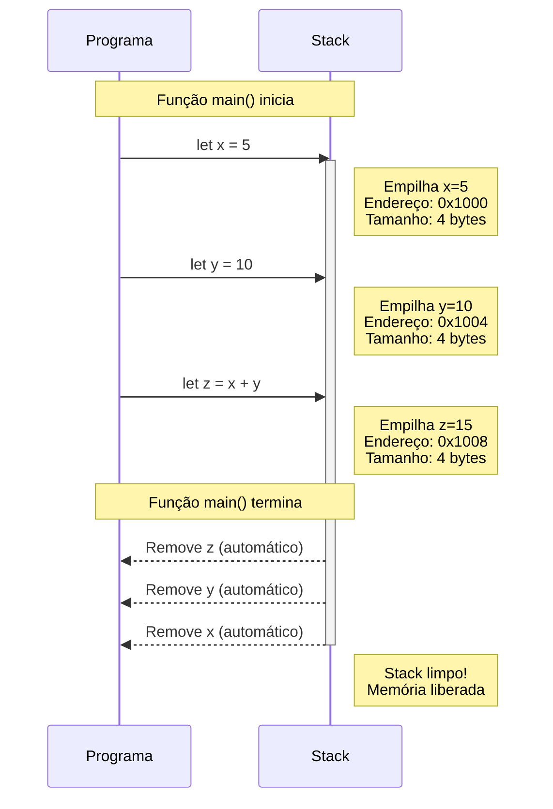
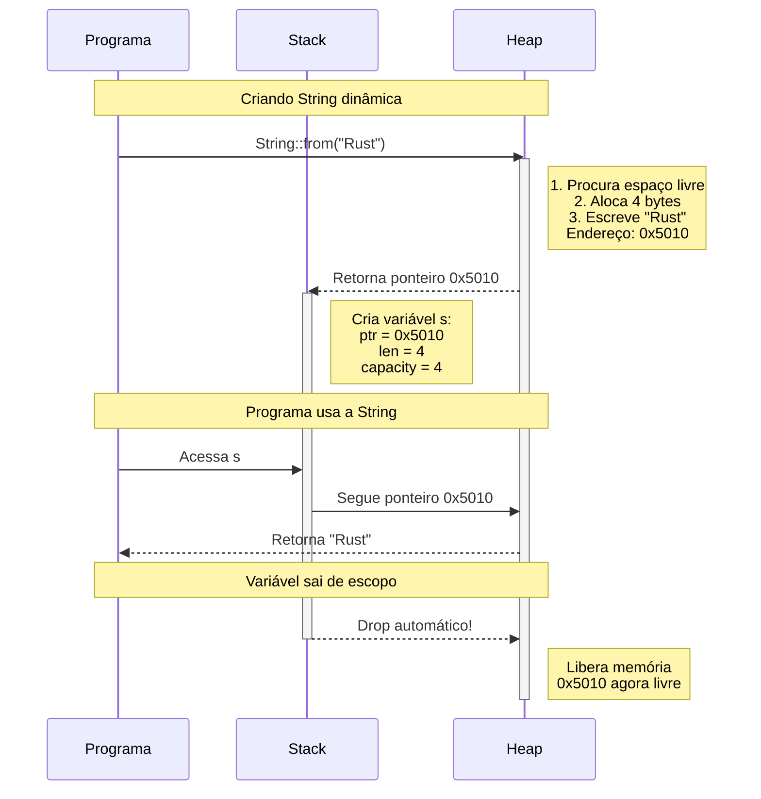
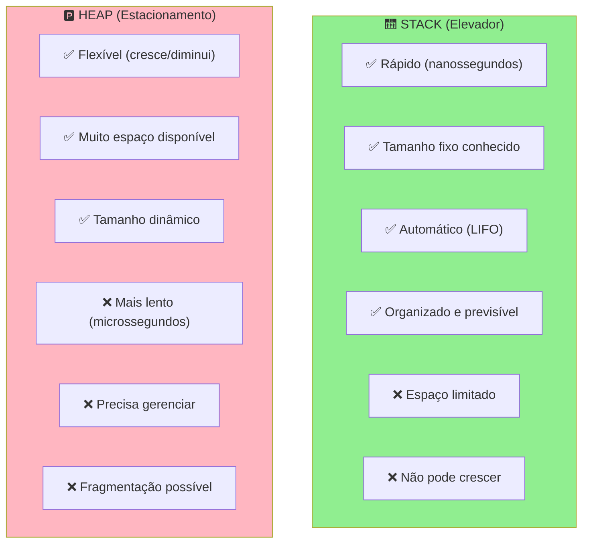
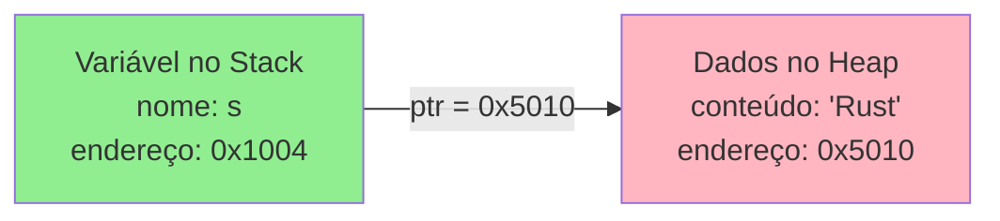
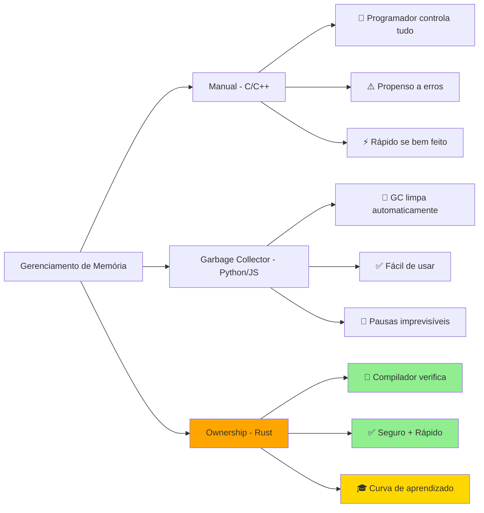
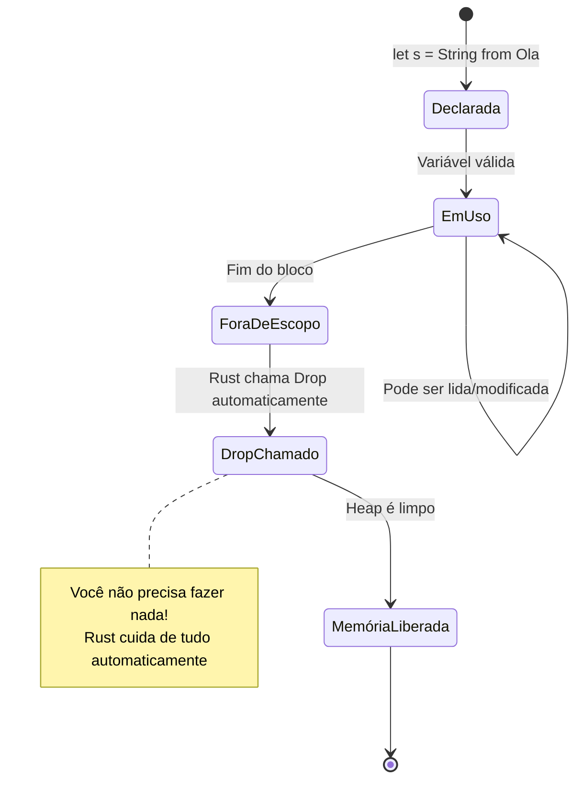
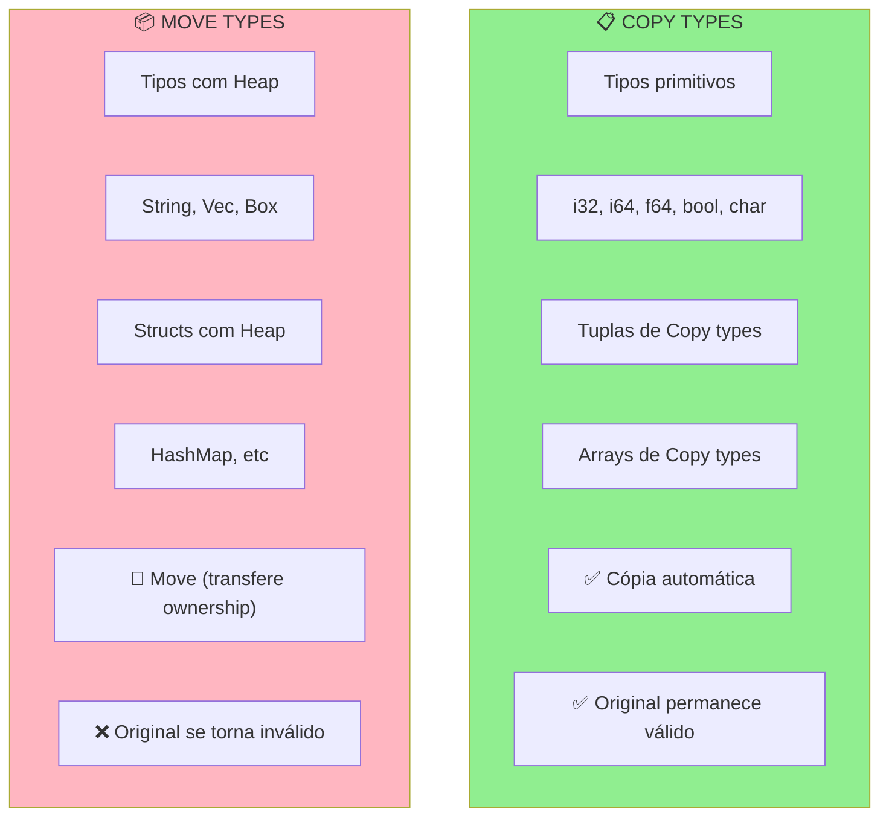
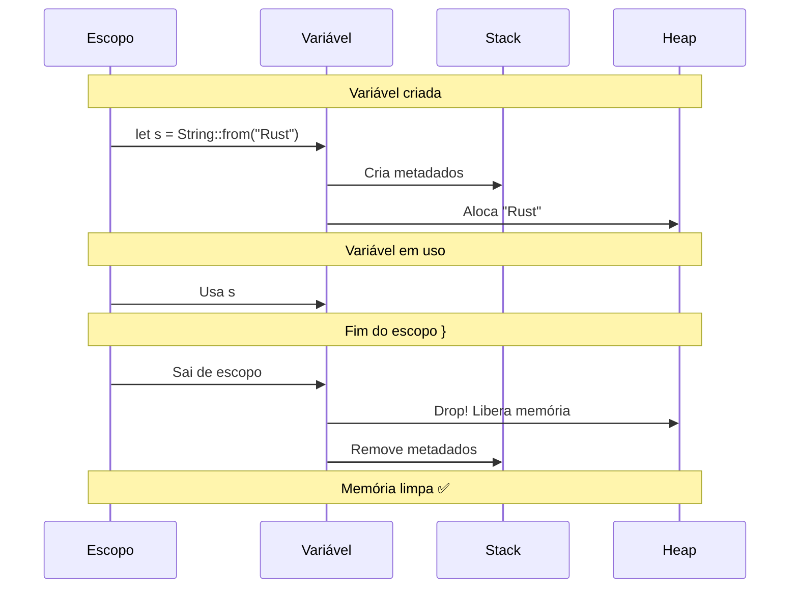
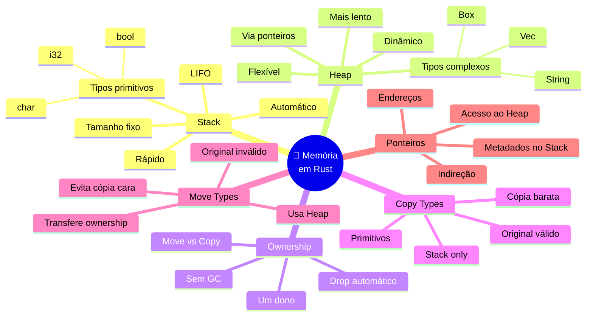
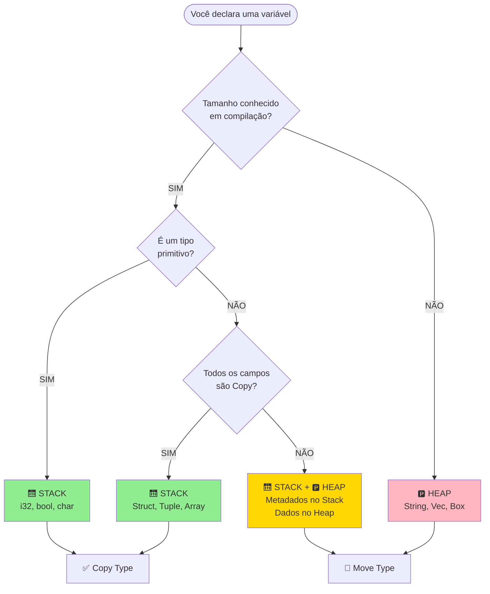

# 📘 Dia 15: Fundamentos de Memória em Rust
## O Dia Mais Importante do Seu Aprendizado! 🎯

> **Mensagem Importante:** Este é o conceito que separa Rust de todas as outras linguagens. Pode parecer difícil no início, mas você VAI entender! Cada "aha!" que você tiver hoje é uma vitória. Vamos com calma, usando muitas analogias e visualizações. 🚀

---

## 📋 OBJETIVOS DE APRENDIZAGEM

Ao final deste dia, você será capaz de:

✅ **Visualizar mentalmente** como a memória funciona (Stack e Heap)  
✅ **Compreender** a diferença fundamental entre Stack e Heap  
✅ **Entender** por que Rust gerencia memória de forma única  
✅ **Identificar** quando dados vão para Stack vs Heap  
✅ **Prever** o comportamento de Copy types vs Move types  
✅ **Preparar-se** para o conceito de Ownership (Dia 16)

---

## 🎭 ATIVAÇÃO DO CONHECIMENTO PRÉVIO

### 🔗 Conexão com a Fase 1

Lembra dos conceitos que você já aprendeu?

- **Tipos primitivos** (`i32`, `bool`, `f64`) → Você já os usou, mas onde eles ficam na memória?
- **Structs** → Estruturas que você criou... como elas são armazenadas?
- **Strings** → Por que `String` é diferente de `&str`?

**Tudo isso tem a ver com MEMÓRIA!** Hoje você descobrirá o "por quê" por trás de tudo.

---

### 🏢 ANALOGIA CENTRAL: O Edifício de Andares

Imagine a memória do seu computador como um **grande edifício**:

```
┌─────────────────────────────────────┐
│     🏢 EDIFÍCIO DA MEMÓRIA          │
├─────────────────────────────────────┤
│                                     │
│  🅿️  ESTACIONAMENTO (HEAP)         │
│  ┌───┐ ┌───┐     ┌───┐            │
│  │ 🚗│ │   │ ... │🚙 │            │
│  └───┘ └───┘     └───┘            │
│  Espaços grandes, flexíveis        │
│  Precisa procurar vaga livre       │
│  Mais lento para estacionar        │
│                                     │
├─────────────────────────────────────┤
│                                     │
│  🛗 ELEVADOR (STACK)                │
│  ┌─────────────────┐               │
│  │  📦 Caixa 3     │ ← Último      │
│  ├─────────────────┤               │
│  │  📦 Caixa 2     │               │
│  ├─────────────────┤               │
│  │  📦 Caixa 1     │ ← Primeiro    │
│  └─────────────────┘               │
│  Rápido, organizado, automático    │
│  LIFO: Último entra, primeiro sai  │
│                                     │
└─────────────────────────────────────┘
```

**Por que essa analogia é perfeita?**

- **Elevador (Stack):** Você só pode colocar/tirar caixas do topo. Rápido e previsível!
- **Estacionamento (Heap):** Você procura uma vaga livre, estaciona onde couber. Mais flexível, mas mais lento!

---

### 📖 História: O Gerente de Recursos

Imagine que você é o **gerente de um armazém**:

1. **Itens pequenos e rápidos** (canetas, post-its) → Você guarda na **gaveta da mesa** (Stack)
   - Sempre à mão, acesso instantâneo
   - Espaço limitado, mas super rápido

2. **Itens grandes e variáveis** (caixas, móveis) → Você guarda no **depósito** (Heap)
   - Precisa anotar onde guardou (ponteiro/endereço)
   - Mais espaço, mas precisa caminhar até lá

**Rust é como um gerente super eficiente:** ele decide automaticamente onde guardar cada coisa e limpa tudo quando não precisa mais!

---

## 📚 APRESENTAÇÃO DO CONTEÚDO

### 🧱 Parte 1: Stack - O Elevador Mágico

#### O que é o Stack?

O **Stack** (pilha) é uma região de memória:

- **LIFO:** Last In, First Out (Último a entrar, primeiro a sair)
- **Tamanho fixo:** Cada item tem tamanho conhecido em tempo de compilação
- **Rápido:** Acesso instantâneo, como pegar a caixa do topo do elevador
- **Automático:** Rust gerencia tudo sozinho

#### Visualização do Stack

```
MOMENTO 1: Função inicia
┌──────────────┐
│              │ ← Topo (vazio)
└──────────────┘

MOMENTO 2: let x = 5;
┌──────────────┐
│  x = 5       │ ← Topo
└──────────────┘

MOMENTO 3: let y = 10;
┌──────────────┐
│  y = 10      │ ← Topo
├──────────────┤
│  x = 5       │
└──────────────┘

MOMENTO 4: let z = true;
┌──────────────┐
│  z = true    │ ← Topo
├──────────────┤
│  y = 10      │
├──────────────┤
│  x = 5       │
└──────────────┘

MOMENTO 5: Função termina (tudo é removido automaticamente!)
┌──────────────┐
│              │ ← Topo (vazio novamente)
└──────────────┘
```

**Analogia:** Como empilhar pratos limpos e depois desempilhar para usar!

---

#### Diagrama Mermaid: Alocação no Stack



---

#### Tipos que Vivem no Stack

Todos esses tipos têm **tamanho fixo conhecido**:

| Tipo         | Tamanho | Exemplo                 |
| ------------ | ------- | ----------------------- |
| `i32`        | 4 bytes | `let x = 42;`           |
| `i64`        | 8 bytes | `let y = 100;`          |
| `f64`        | 8 bytes | `let pi = 3.14;`        |
| `bool`       | 1 byte  | `let ativo = true;`     |
| `char`       | 4 bytes | `let letra = 'A';`      |
| `(i32, i32)` | 8 bytes | `let ponto = (10, 20);` |

**Por que no Stack?** Porque o compilador sabe EXATAMENTE quanto espaço cada um ocupa!

---

### 🅿️ Parte 2: Heap - O Estacionamento Flexível

#### O que é o Heap?

O **Heap** (monte) é uma região de memória:

- **Dinâmico:** Tamanho pode variar durante a execução
- **Alocação manual:** Você pede espaço quando precisa
- **Mais lento:** Precisa procurar espaço livre (como procurar vaga no estacionamento)
- **Flexível:** Pode crescer e diminuir

#### Visualização do Heap

```
HEAP (Memória Dinâmica)
┌─────────────────────────────────────┐
│ Endereço  │ Conteúdo                │
├───────────┼─────────────────────────┤
│ 0x5000    │ [livre]                 │
│ 0x5010    │ String: "Olá"           │ ← Alocado
│ 0x5020    │ [livre]                 │
│ 0x5030    │ Vec: [1, 2, 3, 4, 5]    │ ← Alocado
│ 0x5040    │ [livre]                 │
│ 0x5050    │ String: "Rust"          │ ← Alocado
│ ...       │ ...                     │
└─────────────────────────────────────┘

Como o programa encontra esses dados?
Através de PONTEIROS guardados no Stack!
```

---

#### Como Stack e Heap Trabalham Juntos

```
let s = String::from("Olá");

STACK                          HEAP
┌─────────────────┐           ┌──────────────────┐
│ Variável: s     │           │ Endereço: 0x5010 │
│ ┌─────────────┐ │           │ ┌──────────────┐ │
│ │ ptr ────────┼─┼──────────>│ │ O  l  á      │ │
│ │ len: 3      │ │           │ └──────────────┘ │
│ │ capacity: 3 │ │           │                  │
│ └─────────────┘ │           │                  │
└─────────────────┘           └──────────────────┘
   (12 bytes)                    (3 bytes + buffer)
```

**Explicação:**

1. **No Stack:** A variável `s` contém 3 informações (metadados):
   - `ptr`: ponteiro (endereço) para os dados no Heap
   - `len`: tamanho atual da String
   - `capacity`: capacidade alocada

2. **No Heap:** Os dados reais da String ("Olá")

**Analogia:** O Stack tem um **mapa** (ponteiro) que mostra onde está o **tesouro** (dados) no Heap!

---

#### Diagrama Mermaid: Alocação no Heap



---

#### Tipos que Vivem no Heap

Tipos com **tamanho dinâmico**:

| Tipo      | Por que no Heap?      | Exemplo               |
| --------- | --------------------- | --------------------- |
| `String`  | Tamanho varia         | `String::from("Olá")` |
| `Vec<T>`  | Pode crescer/diminuir | `vec![1, 2, 3]`       |
| `Box<T>`  | Alocação explícita    | `Box::new(42)`        |
| `HashMap` | Tamanho dinâmico      | `HashMap::new()`      |

---

### 📊 Comparação Visual: Stack vs Heap



---

#### Tabela Comparativa Detalhada

| Característica    | Stack 🛗                        | Heap 🅿️                       |
| ----------------- | ------------------------------ | ---------------------------- |
| **Velocidade**    | ⚡ Muito rápido                 | 🐢 Mais lento                 |
| **Tamanho**       | Fixo (conhecido em compilação) | Dinâmico (varia em execução) |
| **Organização**   | LIFO (pilha ordenada)          | Livre (espaços dispersos)    |
| **Gerenciamento** | Automático (push/pop)          | Manual (aloca/libera)        |
| **Acesso**        | Direto                         | Indireto (via ponteiro)      |
| **Limite**        | Pequeno (~2-8 MB)              | Grande (~GB disponível)      |
| **Uso típico**    | Variáveis locais, primitivos   | Strings, Vecs, dados grandes |
| **Limpeza**       | Automática (fim do escopo)     | Precisa ser liberado         |

---

### 🔗 Parte 3: Ponteiros e Endereços de Memória

#### O que é um Ponteiro?

Um **ponteiro** é como um **endereço de casa**:

- Você não carrega a casa inteira no bolso
- Você carrega o **endereço** (GPS) da casa
- Quando precisa, você **segue o endereço** para chegar lá

```
ANALOGIA DO MUNDO REAL:

Sem ponteiro (cópia):
📦 Você carrega a TV inteira para todo lugar
   ↳ Pesado, lento, trabalhoso!

Com ponteiro (referência):
📍 Você carrega um papel com "TV está na sala"
   ↳ Leve, rápido, eficiente!
```

---

#### Visualização de Endereços de Memória

```
MEMÓRIA DO COMPUTADOR:

Endereço    │ Conteúdo
────────────┼──────────────────
0x1000      │ 42        ← variável x
0x1004      │ 0x5010    ← ponteiro para String
0x1008      │ true      ← variável ativo
...
0x5010      │ 'R'       ← String no Heap
0x5011      │ 'u'
0x5012      │ 's'
0x5013      │ 't'
```

**Exemplo em Rust:**

```rust {.line-numbers}
let x = 42;              // x está em 0x1000 (Stack)
let s = String::from("Rust"); // s (metadados) em 0x1004 (Stack)
                              // "Rust" em 0x5010 (Heap)
```

---

#### Diagrama: Como Ponteiros Funcionam



---

### 🤖 Parte 4: Gerenciamento Automático de Memória

#### Como Outras Linguagens Fazem?

##### 🐍 Python / JavaScript (Garbage Collector)

```
┌─────────────────────────────────────┐
│  PROGRAMA                           │
│  ↓                                  │
│  Cria objetos livremente            │
│  Não se preocupa com limpeza        │
│                                     │
│  🗑️ GARBAGE COLLECTOR (GC)         │
│  ↓                                  │
│  Roda periodicamente                │
│  Procura objetos não usados         │
│  Libera memória                     │
│                                     │
│  ⚠️ PROBLEMA:                       │
│  - Pausas imprevisíveis             │
│  - Overhead de performance          │
│  - Não determinístico               │
└─────────────────────────────────────┘
```

**Analogia:** É como ter um **faxineiro** que limpa sua casa de vez em quando, mas você nunca sabe quando ele vai aparecer!

---

##### 🔧 C / C++ (Manual)

```
┌─────────────────────────────────────┐
│  PROGRAMADOR                        │
│  ↓                                  │
│  malloc() - aloca memória           │
│  ... usa a memória ...              │
│  free() - libera memória            │
│                                     │
│  ⚠️ PROBLEMAS:                      │
│  - Esquecer de liberar (leak)       │
│  - Liberar duas vezes (crash)       │
│  - Usar após liberar (bug grave)    │
│  - Muito trabalho manual            │
└─────────────────────────────────────┘
```

**Analogia:** É como você mesmo ter que **lembrar de jogar cada lixo fora**, senão sua casa fica suja ou você joga o mesmo lixo duas vezes!

---

##### 🦀 Rust (Ownership System)

```
┌─────────────────────────────────────┐
│  RUST                               │
│  ↓                                  │
│  Regras em TEMPO DE COMPILAÇÃO     │
│  Verifica tudo ANTES de rodar       │
│  Insere limpeza automática          │
│                                     │
│  ✅ VANTAGENS:                      │
│  - Zero overhead em runtime         │
│  - Sem GC (sem pausas)              │
│  - Sem leaks (garantido)            │
│  - Seguro (verificado)              │
│  - Determinístico (previsível)      │
│                                     │
│  🎯 MELHOR DOS DOIS MUNDOS!         │
└─────────────────────────────────────┘
```

**Analogia:** É como ter um **assistente inteligente** que verifica seu código e garante que você sempre limpa tudo, mas sem precisar de faxineiro rodando!

---

#### Comparação Visual: Modelos de Gerenciamento



---

### 🎯 Parte 5: Gerenciamento de Memória em Rust (Ownership Preview)

#### O Sistema de Ownership (Visão Geral)

Rust usa **3 regras simples** para gerenciar memória:

1. **Cada valor tem um dono (owner)**
2. **Só pode haver um dono por vez**
3. **Quando o dono sai de escopo, o valor é liberado (Drop)**

> **Nota:** Vamos aprofundar isso no Dia 16! Por enquanto, entenda o conceito básico.

---

#### Visualização: Escopo e Drop Automático

```rust {.line-numbers}
fn main() {
    // s NÃO existe aqui ainda
    
    {
        let s = String::from("Olá"); // s passa a existir aqui
        
        println!("{}", s); // s é válida e pode ser usada
        
    } // ← s sai de escopo aqui, Drop é chamado automaticamente!
      // Memória é liberada
    
    // s NÃO existe mais aqui
}
```

**Visualização da Memória:**

```
MOMENTO 1: Antes do bloco
STACK: [vazio]
HEAP:  [vazio]

MOMENTO 2: let s = String::from("Olá");
STACK: [s: ptr→0x5010, len=3, cap=3]
HEAP:  [0x5010: "Olá"]

MOMENTO 3: Fim do bloco }
STACK: [vazio] ← s removida automaticamente
HEAP:  [vazio] ← memória liberada automaticamente (Drop)
```

**Analogia:** Quando você sai de um quarto e apaga a luz automaticamente ao fechar a porta!

---

#### Diagrama: Ciclo de Vida de uma Variável



---

### 📦 Parte 6: Copy Types vs Move Types

Esta é uma das diferenças **mais importantes** em Rust!

#### Copy Types (Tipos que Copiam)

**Tipos simples** que vivem no Stack são **copiados** automaticamente:

```rust {.line-numbers}
let x = 5;
let y = x;  // x é COPIADO para y

println!("x = {}, y = {}", x, y); // ✅ Ambos funcionam!
// x ainda é válido!
```

**Visualização da Memória:**

```
ANTES:
STACK:
┌─────────┐
│ x = 5   │
└─────────┘

DEPOIS de let y = x:
STACK:
┌─────────┐
│ y = 5   │ ← CÓPIA
├─────────┤
│ x = 5   │ ← ORIGINAL ainda existe
└─────────┘
```

**Por que funciona?** Copiar 4 bytes (um `i32`) é **barato e rápido**!

---

#### Move Types (Tipos que Movem)

**Tipos complexos** que usam o Heap são **movidos** (não copiados):

```rust {.line-numbers}
let s1 = String::from("Olá");
let s2 = s1;  // s1 é MOVIDO para s2

println!("{}", s2); // ✅ Funciona
println!("{}", s1); // ❌ ERRO! s1 não é mais válido
```

**Visualização da Memória:**

```
ANTES:
STACK:                    HEAP:
┌──────────────────┐     ┌─────────┐
│ s1: ptr→0x5010   │────>│ "Olá"   │
│     len=3        │     └─────────┘
│     cap=3        │
└──────────────────┘

DEPOIS de let s2 = s1:
STACK:                    HEAP:
┌──────────────────┐     ┌─────────┐
│ s2: ptr→0x5010   │────>│ "Olá"   │
│     len=3        │     └─────────┘
│     cap=3        │
├──────────────────┤
│ s1: INVÁLIDO ❌  │
└──────────────────┘
```

**Por que não copia?** Copiar dados grandes no Heap seria **caro e lento**! Rust move a propriedade (ownership) em vez de copiar.

---

#### Diagrama Comparativo: Copy vs Move



---

#### Tabela: Quando Copiar vs Mover

| Tipo         | Comportamento | Por quê?          | Exemplo                        |
| ------------ | ------------- | ----------------- | ------------------------------ |
| `i32`        | **Copy**      | Pequeno, Stack    | `let y = x;` (ambos válidos)   |
| `bool`       | **Copy**      | Pequeno, Stack    | `let b2 = b1;` (ambos válidos) |
| `(i32, i32)` | **Copy**      | Ambos Copy        | `let p2 = p1;` (ambos válidos) |
| `String`     | **Move**      | Heap, caro copiar | `let s2 = s1;` (s1 inválido)   |
| `Vec<i32>`   | **Move**      | Heap, caro copiar | `let v2 = v1;` (v1 inválido)   |
| `Box<i32>`   | **Move**      | Heap, ownership   | `let b2 = b1;` (b1 inválido)   |

---

#### Regra Prática Simples

```
🤔 Como saber se é Copy ou Move?

┌─────────────────────────────────────┐
│ PERGUNTA: O tipo usa o Heap?        │
├─────────────────────────────────────┤
│                                     │
│  NÃO (só Stack)  →  COPY ✅         │
│  - i32, bool, f64, char             │
│  - Tuplas/arrays de Copy types      │
│                                     │
│  SIM (usa Heap)  →  MOVE 🔄         │
│  - String, Vec, Box                 │
│  - HashMap, structs com Heap        │
│                                     │
└─────────────────────────────────────┘
```

---

### 🗑️ Parte 7: Drop Automático

#### O que é Drop?

**Drop** é a função que Rust chama automaticamente quando uma variável sai de escopo para **liberar memória**.

**Analogia:** É como um **alarme de saída** que toca quando você sai de casa, garantindo que você trancou a porta!

---

#### Como Drop Funciona

```rust {.line-numbers}
fn exemplo() {
    let s = String::from("Rust"); // Aloca memória no Heap
    
    println!("{}", s); // Usa a String
    
} // ← Drop é chamado aqui automaticamente!
  // Memória do Heap é liberada
```

**Sequência de Eventos:**

```
1. let s = String::from("Rust")
   ↓
   Aloca memória no Heap
   
2. Usa s normalmente
   ↓
   Programa acessa dados via ponteiro
   
3. Fim do escopo }
   ↓
   Rust detecta que s não é mais acessível
   
4. Chama Drop automaticamente
   ↓
   Libera memória no Heap
   
5. Remove s do Stack
   ↓
   Memória completamente limpa!
```

---

#### Diagrama: Processo de Drop



---

#### Drop com Múltiplas Variáveis

```rust {.line-numbers}
fn main() {
    let s1 = String::from("A");
    let s2 = String::from("B");
    let s3 = String::from("C");
    
} // Drop chamado na ordem INVERSA: s3, s2, s1 (LIFO!)
```

**Visualização:**

```
CRIAÇÃO (ordem normal):
s1 → s2 → s3

DROP (ordem inversa - LIFO):
s3 → s2 → s1

Por quê? Porque o Stack é LIFO!
Último a entrar, primeiro a sair.
```

---

#### Você Não Precisa Se Preocupar!

```
❌ C/C++: Você precisa lembrar de chamar free()
   int* ptr = malloc(sizeof(int));
   // ... usa ptr ...
   free(ptr); // ← VOCÊ precisa lembrar!

✅ Rust: Drop é automático!
   let s = String::from("Rust");
   // ... usa s ...
   // ← Rust libera automaticamente!
```

**Isso é INCRÍVEL!** Você tem o controle de C/C++ com a segurança de Python/JavaScript!

---

## 🗺️ MAPA MENTAL: Conceitos de Memória



---

## 🎯 Fluxograma: Onde Cada Tipo é Armazenado



---

## 💡 DEMONSTRAÇÃO E MODELAGEM

### Exemplo 1: Tipos no Stack (Copy)

```rust {.line-numbers}
fn main() {
    // Todos esses tipos vivem no Stack
    let x = 42;           // i32 - 4 bytes
    let y = 3.14;         // f64 - 8 bytes
    let ativo = true;     // bool - 1 byte
    let letra = 'A';      // char - 4 bytes
    
    // Copy acontece automaticamente
    let x2 = x;  // x é copiado para x2
    
    println!("x = {}, x2 = {}", x, x2); // ✅ Ambos funcionam!
    // x ainda é válido porque foi COPIADO
}
```

**Fotografia da Memória:**

```
STACK (após todas as declarações):
┌──────────────────┐
│ letra = 'A'      │ ← 4 bytes
├──────────────────┤
│ ativo = true     │ ← 1 byte
├──────────────────┤
│ y = 3.14         │ ← 8 bytes
├──────────────────┤
│ x2 = 42          │ ← 4 bytes (CÓPIA)
├──────────────────┤
│ x = 42           │ ← 4 bytes (ORIGINAL)
└──────────────────┘

HEAP:
[vazio - nenhum dado aqui]

Total no Stack: 21 bytes
Velocidade: ⚡ Instantânea
```

---

### Exemplo 2: Tipos no Heap (Move)

```rust {.line-numbers}
fn main() {
    // String usa o Heap
    let s1 = String::from("Olá");
    
    // s1 é MOVIDO para s2 (não copiado!)
    let s2 = s1;
    
    // println!("{}", s1); // ❌ ERRO! s1 não é mais válido
    println!("{}", s2);    // ✅ OK! s2 é o novo dono
}
```

**Fotografia da Memória:**

```
APÓS let s1 = String::from("Olá"):

STACK:                          HEAP:
┌─────────────────────┐        ┌──────────────┐
│ s1:                 │        │ 0x5010:      │
│   ptr = 0x5010 ────────────> │   'O'        │
│   len = 3           │        │   'l'        │
│   cap = 3           │        │   'á'        │
└─────────────────────┘        └──────────────┘

APÓS let s2 = s1:

STACK:                          HEAP:
┌─────────────────────┐        ┌──────────────┐
│ s2:                 │        │ 0x5010:      │
│   ptr = 0x5010 ────────────> │   'O'        │
│   len = 3           │        │   'l'        │
│   cap = 3           │        │   'á'        │
├─────────────────────┤        └──────────────┘
│ s1: ❌ INVÁLIDO     │
│   (movido)          │
└─────────────────────┘

Por que s1 é inválido?
Porque Rust MOVEU a ownership para s2!
Isso evita que dois ponteiros apontem
para a mesma memória (double free).
```

---

### Exemplo 3: Código que Compila vs Não Compila

#### ✅ Código que COMPILA:

```rust {.line-numbers}
fn main() {
    let x = 5;
    let y = x;  // Copy
    
    println!("x = {}, y = {}", x, y); // ✅ OK!
}
```

**Por quê?** `i32` implementa `Copy`, então `x` é copiado para `y`. Ambos são válidos!

---

#### ❌ Código que NÃO COMPILA:

```rust {.line-numbers}
fn main() {
    let s1 = String::from("Olá");
    let s2 = s1;  // Move
    
    println!("{}", s1); // ❌ ERRO!
    // error[E0382]: borrow of moved value: `s1`
}
```

**Por quê?** `String` NÃO implementa `Copy`. Quando fazemos `let s2 = s1`, a ownership é **movida** de `s1` para `s2`. `s1` não é mais válido!

**Mensagem do Compilador:**

```
error[E0382]: borrow of moved value: `s1`
 --> src/main.rs:5:20
  |
2 |     let s1 = String::from("Olá");
  |         -- move occurs because `s1` has type `String`,
  |            which does not implement the `Copy` trait
3 |     let s2 = s1;
  |              -- value moved here
4 |     
5 |     println!("{}", s1);
  |                    ^^ value borrowed here after move
```

**Tradução:** "Você moveu `s1` para `s2`, então `s1` não existe mais!"

---

#### ✅ Solução: Clonar se Precisar de Ambos

```rust {.line-numbers}
fn main() {
    let s1 = String::from("Olá");
    let s2 = s1.clone();  // Clona explicitamente
    
    println!("s1 = {}, s2 = {}", s1, s2); // ✅ OK!
}
```

**Fotografia da Memória:**

```
STACK:                          HEAP:
┌─────────────────────┐        ┌──────────────┐
│ s1:                 │        │ 0x5010:      │
│   ptr = 0x5010 ────────────> │   'O'        │
│   len = 3           │        │   'l'        │
│   cap = 3           │        │   'á'        │
├─────────────────────┤        ├──────────────┤
│ s2:                 │        │ 0x5020:      │
│   ptr = 0x5020 ────────────> │   'O'        │
│   len = 3           │        │   'l'        │
│   cap = 3           │        │   'á'        │
└─────────────────────┘        └──────────────┘

Agora temos DUAS cópias independentes!
Cada uma com seu próprio espaço no Heap.
```

**Nota:** `.clone()` é **explícito** em Rust. Você sabe quando está fazendo uma cópia cara!

---

### Exemplo 4: Visualização Passo a Passo

```rust {.line-numbers}
fn main() {
    let mut v = Vec::new();  // Passo 1
    v.push(1);               // Passo 2
    v.push(2);               // Passo 3
    v.push(3);               // Passo 4
} // Passo 5: Drop automático
```

**Visualização Passo a Passo:**

```
PASSO 1: let mut v = Vec::new();
STACK:                          HEAP:
┌─────────────────────┐        ┌──────────────┐
│ v:                  │        │ [vazio]      │
│   ptr = 0x5010 ────────────> │              │
│   len = 0           │        │              │
│   cap = 0           │        │              │
└─────────────────────┘        └──────────────┘

PASSO 2: v.push(1);
STACK:                          HEAP:
┌─────────────────────┐        ┌──────────────┐
│ v:                  │        │ 0x5010:      │
│   ptr = 0x5010 ────────────> │   [1]        │
│   len = 1           │        │              │
│   cap = 4           │        │              │
└─────────────────────┘        └──────────────┘
(Heap alocou espaço para 4 elementos)

PASSO 3: v.push(2);
STACK:                          HEAP:
┌─────────────────────┐        ┌──────────────┐
│ v:                  │        │ 0x5010:      │
│   ptr = 0x5010 ────────────> │   [1, 2]     │
│   len = 2           │        │              │
│   cap = 4           │        │              │
└─────────────────────┘        └──────────────┘

PASSO 4: v.push(3);
STACK:                          HEAP:
┌─────────────────────┐        ┌──────────────┐
│ v:                  │        │ 0x5010:      │
│   ptr = 0x5010 ────────────> │   [1, 2, 3]  │
│   len = 3           │        │              │
│   cap = 4           │        │              │
└─────────────────────┘        └──────────────┘

PASSO 5: } (fim do escopo)
STACK:                          HEAP:
┌─────────────────────┐        ┌──────────────┐
│ [vazio]             │        │ [liberado]   │
└─────────────────────┘        └──────────────┘
Drop foi chamado automaticamente!
Memória do Heap foi liberada.
```

---

## 🎯 PRÁTICA GUIADA

### Exercício Completo: Visualizador de Alocações de Memória

**Objetivo:** Criar um programa que demonstra claramente como Stack e Heap funcionam, com comentários explicativos em cada operação.

---

#### 📝 Código do Exercício

```rust {.line-numbers}
// Visualizador de Alocações de Memória
// Este programa demonstra Stack vs Heap, Copy vs Move

fn main() {
    println!("=== VISUALIZADOR DE MEMÓRIA ===\n");
    
    // ========================================
    // PARTE 1: TIPOS NO STACK (Copy)
    // ========================================
    println!("📦 PARTE 1: Tipos no Stack (Copy)");
    println!("----------------------------------");
    
    // Criando variáveis no Stack
    let x = 42;
    println!("✅ Criado: x = {} (Stack, 4 bytes)", x);
    
    let y = 3.14;
    println!("✅ Criado: y = {} (Stack, 8 bytes)", y);
    
    let ativo = true;
    println!("✅ Criado: ativo = {} (Stack, 1 byte)", ativo);
    
    // Copy em ação
    println!("\n🔄 Testando Copy:");
    let x2 = x;  // x é COPIADO para x2
    println!("   let x2 = x;");
    println!("   x = {} (ainda válido! ✅)", x);
    println!("   x2 = {} (cópia independente)", x2);
    println!("   Motivo: i32 implementa Copy (barato copiar 4 bytes)");
    
    // ========================================
    // PARTE 2: TIPOS NO HEAP (Move)
    // ========================================
    println!("\n📦 PARTE 2: Tipos no Heap (Move)");
    println!("----------------------------------");
    
    // Criando String (usa Heap)
    let s1 = String::from("Rust");
    println!("✅ Criado: s1 = \"{}\"", s1);
    println!("   Stack: ptr, len=4, cap=4 (12 bytes)");
    println!("   Heap: \"Rust\" (4 bytes)");
    
    // Move em ação
    println!("\n🔄 Testando Move:");
    let s2 = s1;  // s1 é MOVIDO para s2
    println!("   let s2 = s1;");
    // println!("   s1 = {}", s1); // ❌ Descomente para ver o erro!
    println!("   s1 = [INVÁLIDO] (movido! ❌)");
    println!("   s2 = \"{}\" (novo dono ✅)", s2);
    println!("   Motivo: String não implementa Copy (caro copiar Heap)");
    
    // ========================================
    // PARTE 3: CLONE EXPLÍCITO
    // ========================================
    println!("\n📦 PARTE 3: Clone Explícito");
    println!("----------------------------------");
    
    let s3 = String::from("Clone");
    println!("✅ Criado: s3 = \"{}\"", s3);
    
    let s4 = s3.clone();  // Clone explícito
    println!("🔄 let s4 = s3.clone();");
    println!("   s3 = \"{}\" (ainda válido! ✅)", s3);
    println!("   s4 = \"{}\" (cópia profunda no Heap)", s4);
    println!("   Motivo: .clone() copia dados do Heap explicitamente");
    
    // ========================================
    // PARTE 4: VEC (DINÂMICO)
    // ========================================
    println!("\n📦 PARTE 4: Vec (Crescimento Dinâmico)");
    println!("----------------------------------");
    
    let mut v = Vec::new();
    println!("✅ Criado: v = Vec vazio");
    println!("   len=0, cap=0");
    
    v.push(10);
    println!("🔄 v.push(10);");
    println!("   v = {:?}", v);
    println!("   len=1, cap=4 (alocou espaço extra!)");
    
    v.push(20);
    println!("🔄 v.push(20);");
    println!("   v = {:?}", v);
    println!("   len=2, cap=4 (ainda cabe)");
    
    v.push(30);
    println!("🔄 v.push(30);");
    println!("   v = {:?}", v);
    println!("   len=3, cap=4");
    
    // ========================================
    // PARTE 5: ESCOPO E DROP
    // ========================================
    println!("\n📦 PARTE 5: Escopo e Drop Automático");
    println!("----------------------------------");
    
    {
        let s_temp = String::from("Temporária");
        println!("✅ Criado: s_temp = \"{}\" (dentro do bloco)", s_temp);
        println!("   Esta String existe apenas neste bloco");
    } // ← Drop é chamado aqui!
    
    println!("❌ s_temp foi destruída (Drop automático)");
    println!("   Memória do Heap foi liberada");
    // println!("{}", s_temp); // ❌ Descomente para ver o erro!
    
    // ========================================
    // PARTE 6: PREVISÃO
    // ========================================
    println!("\n📦 PARTE 6: Exercício de Previsão");
    println!("----------------------------------");
    println!("O que acontece com cada variável ao final de main()?");
    println!("   x, y, ativo, x2 → Removidos do Stack");
    println!("   s2, s3, s4, v → Drop chamado, Heap liberado");
    println!("   Tudo automático! Sem leaks! ✅");
    
    println!("\n=== FIM DO VISUALIZADOR ===");
} // ← Aqui TODAS as variáveis são limpas automaticamente!
```

---

#### 🎯 Exercícios de Previsão

**Antes de rodar o código, tente prever:**

1. **Qual é o tamanho total usado no Stack?**
   - Dica: Some os tamanhos de cada variável

2. **Quantas alocações no Heap acontecem?**
   - Dica: Conte String e Vec

3. **O que acontece se você descomentar `println!("{}", s1);`?**
   - Dica: s1 foi movido!

4. **Por que `x` ainda é válido após `let x2 = x`?**
   - Dica: Copy vs Move

5. **Quando a memória do Heap é liberada?**
   - Dica: Drop automático no fim do escopo

---

#### ✅ Solução Comentada Linha a Linha

```rust {.line-numbers}
fn main() {
    // LINHA 1: Inicia função main
    // Stack: [vazio]
    // Heap: [vazio]
    
    let x = 42;
    // LINHA 2: Aloca i32 no Stack
    // Stack: [x=42] (4 bytes)
    // Heap: [vazio]
    // Operação: PUSH no Stack (rápido!)
    
    let x2 = x;
    // LINHA 3: COPIA x para x2
    // Stack: [x2=42, x=42] (8 bytes total)
    // Heap: [vazio]
    // Operação: Cópia de 4 bytes (barato!)
    // x ainda é válido porque i32 implementa Copy
    
    let s1 = String::from("Rust");
    // LINHA 4: Aloca String
    // Stack: [s1: ptr→0x5010, len=4, cap=4, x2=42, x=42]
    // Heap: [0x5010: "Rust"]
    // Operação: 
    //   1. Aloca 4 bytes no Heap para "Rust"
    //   2. Cria metadados no Stack (12 bytes)
    
    let s2 = s1;
    // LINHA 5: MOVE s1 para s2
    // Stack: [s2: ptr→0x5010, len=4, cap=4, s1: INVÁLIDO, ...]
    // Heap: [0x5010: "Rust"] (mesmo endereço!)
    // Operação: Transfere ownership
    // s1 não é mais válido (evita double free)
    
    let s3 = String::from("Clone");
    let s4 = s3.clone();
    // LINHAS 6-7: Cria s3 e CLONA para s4
    // Stack: [s4: ptr→0x5020, s3: ptr→0x5010, ...]
    // Heap: [0x5010: "Clone", 0x5020: "Clone"]
    // Operação: Cópia profunda no Heap
    // Ambos s3 e s4 são válidos (cópias independentes)
    
    let mut v = Vec::new();
    // LINHA 8: Cria Vec vazio
    // Stack: [v: ptr=null, len=0, cap=0, ...]
    // Heap: [nenhuma alocação ainda]
    
    v.push(10);
    // LINHA 9: Primeiro push
    // Stack: [v: ptr→0x5030, len=1, cap=4, ...]
    // Heap: [0x5030: [10, _, _, _]] (alocou 4 espaços)
    // Operação: Aloca buffer no Heap com capacidade inicial
    
    v.push(20);
    // LINHA 10: Segundo push
    // Stack: [v: ptr→0x5030, len=2, cap=4, ...]
    // Heap: [0x5030: [10, 20, _, _]]
    // Operação: Usa espaço já alocado (rápido!)
    
    {
        let s_temp = String::from("Temp");
        // LINHA 11: String temporária
        // Stack: [s_temp: ptr→0x5040, ...]
        // Heap: [0x5040: "Temp"]
        
    } // LINHA 12: Fim do bloco
    // Drop é chamado em s_temp!
    // Stack: [s_temp removido]
    // Heap: [0x5040 liberado]
    
} // LINHA 13: Fim de main
// Drop é chamado em TODAS as variáveis restantes!
// Ordem: v, s4, s3, s2 (LIFO - ordem inversa)
// Stack: [completamente limpo]
// Heap: [completamente limpo]
// Sem leaks! Tudo automático! ✅
```

---

#### 🧪 Experimentos Opcionais

Tente modificar o código e observe o que acontece:

1. **Experimento 1: Descomente o erro**
   ```rust {.line-numbers}
   let s1 = String::from("Teste");
   let s2 = s1;
   println!("{}", s1); // ← Descomente esta linha
   ```
   **O que você espera?** Erro de compilação!
   **Por quê?** s1 foi movido para s2.

2. **Experimento 2: Clone vs Move**
   ```rust {.line-numbers}
   let s1 = String::from("Teste");
   let s2 = s1.clone(); // ← Mude para s1.clone()
   println!("s1={}, s2={}", s1, s2);
   ```
   **O que mudou?** Agora ambos são válidos!

3. **Experimento 3: Crescimento do Vec**
   ```rust {.line-numbers}
   let mut v = Vec::new();
   for i in 0..10 {
       v.push(i);
       println!("len={}, cap={}", v.len(), v.capacity());
   }
   ```
   **Observe:** A capacidade dobra quando necessário!

4. **Experimento 4: Tipos Copy**
   ```rust {.line-numbers}
   let a = [1, 2, 3]; // Array de i32
   let b = a; // Copy ou Move?
   println!("{:?}, {:?}", a, b); // Funciona?
   ```
   **Resposta:** Copy! Arrays de tipos Copy também são Copy.

---

## 🔄 FEEDBACK E AVALIAÇÃO

### ✅ Checklist de Conceitos Cruciais

Marque cada item quando você sentir que entendeu:

- [ ] **Stack:** Entendo que é LIFO, rápido, tamanho fixo
- [ ] **Heap:** Entendo que é dinâmico, flexível, mais lento
- [ ] **Ponteiros:** Entendo que são endereços de memória
- [ ] **Copy Types:** Sei quais tipos são copiados automaticamente
- [ ] **Move Types:** Sei quais tipos são movidos (não copiados)
- [ ] **Drop:** Entendo que é automático no fim do escopo
- [ ] **Ownership:** Entendo que cada valor tem um dono
- [ ] **Clone:** Sei quando usar `.clone()` explicitamente
- [ ] **Visualização:** Consigo imaginar Stack e Heap mentalmente
- [ ] **Rust vs Outras:** Entendo por que Rust é diferente

**Meta:** Marcar pelo menos 8/10 antes de avançar para o Dia 16!

---

### 🤔 Perguntas Reflexivas sobre Memória

Responda mentalmente (ou escreva suas respostas):

1. **Por que Rust não usa Garbage Collector?**
   <details>
   <summary>💡 Resposta</summary>
   Porque Rust usa Ownership para gerenciar memória em tempo de compilação, sem overhead em runtime. Isso garante performance previsível e sem pausas.
   </details>

2. **Qual a vantagem de Move sobre Copy para tipos grandes?**
   <details>
   <summary>💡 Resposta</summary>
   Move transfere ownership sem copiar dados do Heap, economizando tempo e memória. Copiar uma String de 1MB seria muito caro!
   </details>

3. **Por que i32 implementa Copy mas String não?**
   <details>
   <summary>💡 Resposta</summary>
   i32 tem tamanho fixo (4 bytes) e vive no Stack - copiar é barato. String usa Heap com tamanho variável - copiar seria caro e inesperado.
   </details>

4. **O que acontece se você esquecer de liberar memória em C?**
   <details>
   <summary>💡 Resposta</summary>
   Memory leak! A memória fica alocada mas inacessível, desperdiçando recursos. Em Rust, isso é impossível graças ao Drop automático.
   </details>

5. **Como Rust evita "use after free"?**
   <details>
   <summary>💡 Resposta</summary>
   Através do sistema de Ownership! Quando uma variável é movida, a original se torna inválida. O compilador impede uso após o move.
   </details>

---

### 📝 Quiz com Diagramas

#### Questão 1:
```rust {.line-numbers}
let x = 5;
let y = x;
println!("{}", x);
```

**Este código compila?**
- [ ] A) Sim
- [ ] B) Não

<details>
<summary>✅ Resposta</summary>
**A) Sim!** `i32` implementa Copy, então `x` é copiado para `y`. Ambos são válidos.
</details>

---

#### Questão 2:
```rust {.line-numbers}
let s1 = String::from("Olá");
let s2 = s1;
println!("{}", s1);
```

**Este código compila?**
- [ ] A) Sim
- [ ] B) Não

<details>
<summary>✅ Resposta</summary>
**B) Não!** `String` não implementa Copy. `s1` é movido para `s2`, tornando-se inválido.
</details>

---

#### Questão 3:

Qual diagrama representa corretamente `let s = String::from("Rust");`?

**Opção A:**
```
STACK: [s = "Rust"]
HEAP: [vazio]
```

**Opção B:**
```
STACK: [s: ptr→0x5010, len=4, cap=4]
HEAP: [0x5010: "Rust"]
```

<details>
<summary>✅ Resposta</summary>
**Opção B!** String armazena metadados no Stack e dados no Heap.
</details>

---

#### Questão 4:

Quantas alocações no Heap acontecem?
```rust {.line-numbers}
let x = 42;
let s = String::from("A");
let v = vec![1, 2, 3];
```

- [ ] A) 0
- [ ] B) 1
- [ ] C) 2
- [ ] D) 3

<details>
<summary>✅ Resposta</summary>
**C) 2 alocações!** `String` e `Vec` usam Heap. `x` (i32) usa apenas Stack.
</details>

---

#### Questão 5:

Quando a memória é liberada?
```rust {.line-numbers}
fn main() {
    let s = String::from("Rust");
    println!("{}", s);
} // ← Aqui?
```

- [ ] A) Quando `s` é criado
- [ ] B) Quando `println!` é chamado
- [ ] C) No fim do escopo (})
- [ ] D) Quando o programa termina

<details>
<summary>✅ Resposta</summary>
**C) No fim do escopo!** Drop é chamado automaticamente quando `s` sai de escopo.
</details>

---

### 🎯 Auto-Avaliação Profunda

**Escala de 1 a 5 (1=não entendi, 5=domino completamente):**

| Conceito                        | Nota (1-5) | Preciso revisar? |
| ------------------------------- | ---------- | ---------------- |
| Diferença Stack vs Heap         | __         | [ ]              |
| Por que tipos Copy são copiados | __         | [ ]              |
| Por que tipos Move são movidos  | __         | [ ]              |
| Como ponteiros funcionam        | __         | [ ]              |
| Quando Drop é chamado           | __         | [ ]              |
| Por que Rust não tem GC         | __         | [ ]              |
| Visualização mental de memória  | __         | [ ]              |

**Se você marcou 4 ou 5 em todos:** Parabéns! Você está pronto para Ownership! 🎉

**Se você marcou 3 ou menos em algum:** Revise aquela seção específica. Não tenha pressa!

---

## 🚀 TRANSFERÊNCIA E APLICAÇÃO

### 🧠 Exercícios de Visualização Mental

**Exercício 1: Visualize Mentalmente**

Feche os olhos e imagine:
1. Um elevador (Stack) com caixas empilhadas
2. Um estacionamento (Heap) com carros espalhados
3. Um mapa (ponteiro) mostrando onde está cada carro

**Agora, mentalmente, execute:**
```rust {.line-numbers}
let x = 5;           // Coloca caixa no elevador
let s = String::from("Rust"); // Estaciona carro, anota localização
let y = x;           // Copia caixa (barato!)
let s2 = s;          // Transfere chave do carro (move!)
```

**Conseguiu visualizar?** Essa é a habilidade mais importante!

---

### 🎯 Preparação para Ownership (Dia 16)

Você já aprendeu os **fundamentos** de Ownership hoje:

✅ **Cada valor tem um dono** (a variável que o contém)  
✅ **Move transfere ownership** (s1 → s2)  
✅ **Drop libera memória** (fim do escopo)

**No Dia 16, você aprenderá:**
- 📌 **Borrowing:** Emprestar valores sem mover
- 📌 **References:** `&T` e `&mut T`
- 📌 **Regras de Ownership:** As 3 regras de ouro
- 📌 **Lifetimes:** Quanto tempo referências vivem

**Mas tudo isso se baseia no que você aprendeu HOJE!** 🎯

---

### 🔗 Analogias para Fixar

#### Analogia 1: Biblioteca
- **Stack:** Livros na sua mesa (acesso rápido, espaço limitado)
- **Heap:** Livros no depósito (muito espaço, precisa buscar)
- **Ponteiro:** Ficha catalográfica (mostra onde está o livro)

#### Analogia 2: Restaurante
- **Stack:** Pratos limpos empilhados (LIFO - pega o de cima)
- **Heap:** Mesas do restaurante (acomoda grupos de tamanhos variados)
- **Drop:** Garçom limpa a mesa quando você sai

#### Analogia 3: Escritório
- **Copy Types:** Post-its (barato copiar)
- **Move Types:** Computador (caro mover, melhor transferir responsabilidade)
- **Ownership:** Quem está usando o computador agora?

---

### 📚 Resumo Visual Final

```
┌─────────────────────────────────────────────────────────┐
│         🧠 MAPA MENTAL: MEMÓRIA EM RUST                 │
├─────────────────────────────────────────────────────────┤
│                                                         │
│  🛗 STACK                    🅿️ HEAP                   │
│  • Rápido ⚡                 • Flexível 🔄             │
│  • LIFO                      • Dinâmico                 │
│  • Tamanho fixo              • Tamanho variável         │
│  • i32, bool, char           • String, Vec, Box         │
│                                                         │
│  📋 COPY                     🔄 MOVE                    │
│  • Tipos pequenos            • Tipos com Heap           │
│  • Cópia automática          • Transfere ownership      │
│  • Original válido ✅        • Original inválido ❌     │
│                                                         │
│  🗑️ DROP                     🔗 PONTEIROS              │
│  • Automático                • Endereços                │
│  • Fim do escopo             • Indireção                │
│  • Libera Heap               • Acesso ao Heap           │
│                                                         │
│  🦀 RUST = SEGURO + RÁPIDO + SEM GC                    │
└─────────────────────────────────────────────────────────┘
```

---

## 🎉 MENSAGEM FINAL

### Você Chegou Até Aqui! 🏆

**Parabéns!** Você acabou de aprender o conceito **mais importante** de Rust!

Gerenciamento de memória é:
- ✅ A **base** de tudo em Rust
- ✅ O que torna Rust **único**
- ✅ O **motivo** de Rust ser tão rápido e seguro

---

### 💪 O "Click" Mental

Não se preocupe se ainda não fez o "click" completo. É **normal**!

Gerenciamento de memória é como andar de bicicleta:
1. **Primeiro:** Parece impossível 😰
2. **Depois:** Você pratica e pratica 🚴
3. **Finalmente:** Fica natural e automático! 🎉

**Dica:** Volte a este material sempre que precisar. Cada releitura trará novas compreensões!

---

### 🎯 Próximos Passos

**Antes de ir para o Dia 16:**

1. ✅ Rode o código do Visualizador de Memória
2. ✅ Faça os experimentos opcionais
3. ✅ Responda o quiz (pelo menos 4/5 corretas)
4. ✅ Pratique visualização mental
5. ✅ Revise as analogias (elevador, estacionamento)

**Quando estiver confortável:**
→ Avance para **Dia 16: Ownership e Borrowing**

---

### 🌟 Você Está no Caminho Certo!

Lembre-se:
- 🧠 **Entender memória** = Entender Rust
- 🚀 **Este conhecimento** = Base para tudo
- 💪 **Você consegue!** = Com prática e paciência

**Rust é diferente, mas você VAI dominar!** 🦀

---

## 📖 Glossário Rápido

| Termo         | Significado                                           |
| ------------- | ----------------------------------------------------- |
| **Stack**     | Pilha de memória (LIFO, rápida, tamanho fixo)         |
| **Heap**      | Monte de memória (dinâmica, flexível, mais lenta)     |
| **LIFO**      | Last In, First Out (último a entrar, primeiro a sair) |
| **Ponteiro**  | Endereço de memória (como GPS)                        |
| **Copy**      | Tipo que é copiado automaticamente                    |
| **Move**      | Tipo que transfere ownership (não copia)              |
| **Drop**      | Função que libera memória automaticamente             |
| **Ownership** | Sistema de propriedade de valores em Rust             |
| **Clone**     | Cópia explícita (inclusive dados do Heap)             |
| **GC**        | Garbage Collector (coletor de lixo)                   |

---

## 🔗 Recursos Adicionais

**Para aprofundar:**
- 📘 The Rust Book - Chapter 4 (Understanding Ownership)
- 🎥 Visualizações de memória: [Rust Playground](https://play.rust-lang.org/)
- 🧪 Experimente: Modifique o código do Visualizador

**Lembre-se:** A prática leva à perfeição! 🚀

---

**Bons estudos e até o Dia 16! 🦀✨**