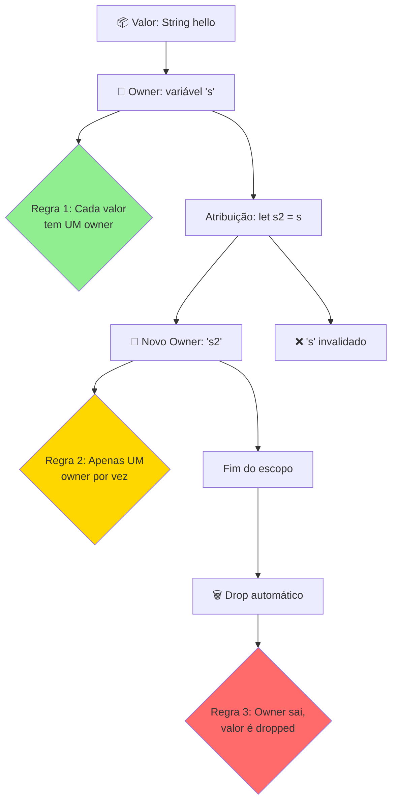
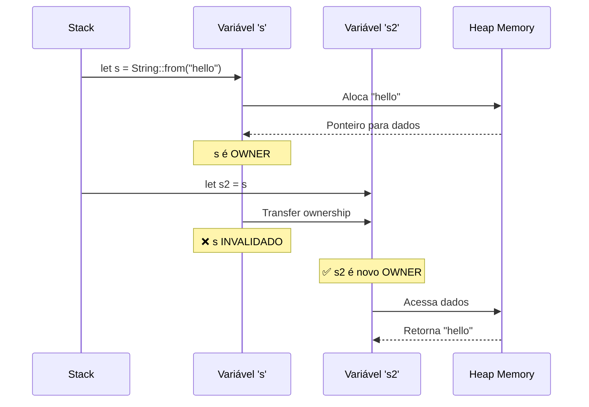
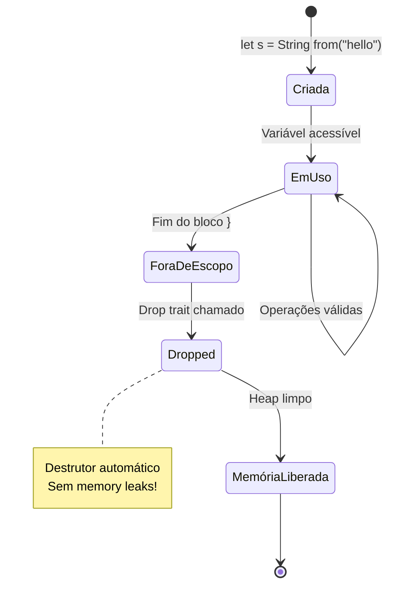
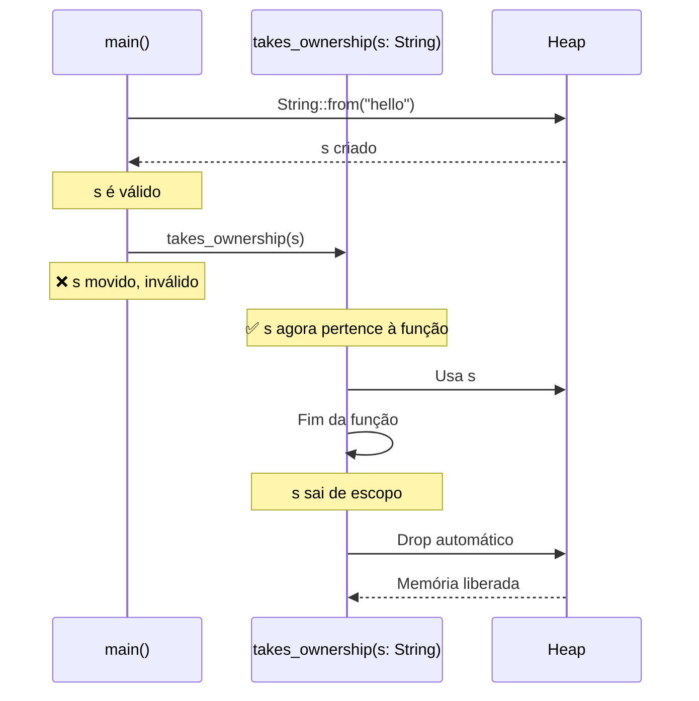
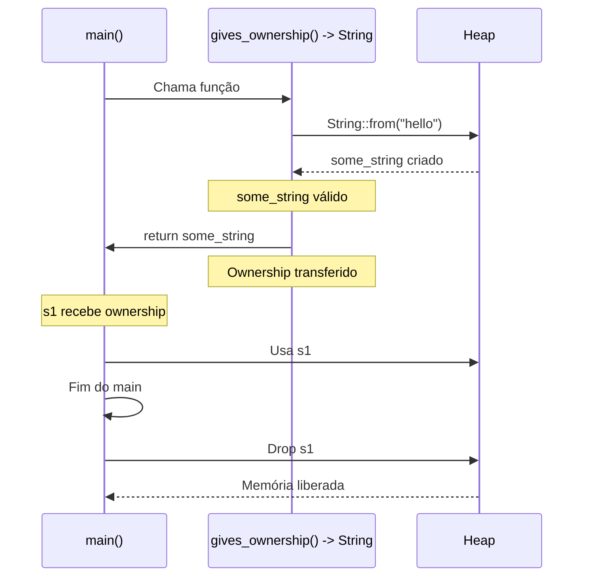

# 📘 DIA 16: AS 3 REGRAS SAGRADAS DO OWNERSHIP

## 🎯 Objetivos de Aprendizagem

Ao final deste dia, você será capaz de:

✅ **Memorizar** as 3 regras fundamentais do ownership  
✅ **Rastrear** mentalmente o fluxo de ownership no código  
✅ **Interpretar** mensagens de erro do compilador relacionadas a ownership  
✅ **Aplicar** estratégias para resolver problemas de ownership  
✅ **Distinguir** quando usar move vs clone  

---

## 🎭 Ativação do Conhecimento Prévio

### Revisão Rápida: Memória no Rust

Você já aprendeu que:
- **Stack**: armazena dados de tamanho fixo (i32, bool, arrays fixos)
- **Heap**: armazena dados de tamanho dinâmico (String, Vec)
- Heap requer gerenciamento de memória

**Hoje você aprenderá COMO o Rust gerencia essa memória automaticamente!**

---

### 🔑 Analogia Central: A Carteira de Identidade

Imagine que cada valor no Rust é como um **documento oficial** (RG, passaporte):

```
📄 DOCUMENTO: String "Olá, Rust!"
👤 PROPRIETÁRIO: variável 's'
```

**Regras do mundo real que se aplicam ao Rust:**

1. **Cada documento tem UM dono** → você não pode ter dois donos no mesmo RG
2. **Transferência de propriedade** → quando você vende um carro, a propriedade passa para o comprador (você não é mais dono)
3. **Cópia autenticada** → você pode fazer uma cópia do documento (clone), mas custa tempo e recursos
4. **Destruição automática** → quando o dono morre, os documentos são destruídos

**Esta analogia será nossa bússola durante todo o dia!**

---

## 📚 AS 3 REGRAS SAGRADAS

```rust {.line-numbers}
// REGRA 1: Cada valor tem UM owner (dono)
let s = String::from("hello"); // 's' é o owner de "hello"

// REGRA 2: Só pode haver UM owner por vez
let s2 = s; // ownership transferido para 's2'
            // 's' não é mais válido!

// REGRA 3: Quando o owner sai de escopo, o valor é dropped
{
    let s3 = String::from("world");
} // <- s3 sai de escopo aqui, memória é liberada automaticamente
```

### 📊 Diagrama 1: As 3 Regras Ilustradas



---

## 📊 Diagrama 2: Fluxograma de Transferência de Ownership

```mermaid
flowchart TD
    Start([Variável criada]) --> Check{Tipo do dado}
    
    Check -->|Stack: i32, bool, etc| Copy[✅ Cópia automática<br/>Copy trait]
    Check -->|Heap: String, Vec| Move[⚠️ Move ownership]
    
    Copy --> Both[Ambas variáveis<br/>são válidas]
    Move --> Transfer[Ownership transferido]
    Transfer --> Invalid[❌ Variável original<br/>INVÁLIDA]
    
    Invalid --> Solution{Como resolver?}
    Solution -->|Opção 1| Clone[.clone&#40;&#41;<br/>Cópia profunda]
    Solution -->|Opção 2| Borrow[Borrowing<br/>&#40;Dia 17&#41;]
    Solution -->|Opção 3| Redesign[Redesenhar lógica]
    
    style Copy fill:#90EE90
    style Move fill:#FFD700
    style Invalid fill:#FF6B6B
    style Clone fill:#87CEEB
```



---

## 💡 REGRA 1: Cada Valor Tem UM Owner

### Exemplo 1: Ownership Básico ✅

```rust {.line-numbers}
fn main() {
    let s = String::from("hello");
    println!("{}", s); // ✅ Funciona! 's' é o owner
}
```

**O que acontece:**
1. `s` é criado e se torna owner da String "hello"
2. String é alocada no heap
3. `s` tem acesso exclusivo
4. No final do `main`, `s` sai de escopo → String é dropped

---

### Exemplo 2: Tentativa de Acesso Duplo ❌

```rust {.line-numbers}
fn main() {
    let s = String::from("hello");
    let owner1 = s;
    let owner2 = s; // ❌ ERRO!
}
```

**Mensagem do Compilador:**

```
error[E0382]: use of moved value: `s`
 --> src/main.rs:4:18
  |
2 |     let s = String::from("hello");
  |         - move occurs because `s` has type `String`
3 |     let owner1 = s;
  |                  - value moved here
4 |     let owner2 = s;
  |                  ^ value used here after move
```

**Tradução:** "Você tentou usar `s` depois que o ownership foi movido para `owner1`!"

---

### 🔍 Rastreamento Passo a Passo

```rust {.line-numbers}
let s = String::from("hello");  // Passo 1: 's' é owner
let owner1 = s;                 // Passo 2: ownership → owner1
                                //          's' INVÁLIDO
let owner2 = s;                 // Passo 3: ❌ 's' não existe mais!
```

**Visualização:**

```
Passo 1:  s ──────> [String "hello" no heap]

Passo 2:  s ────X (invalidado)
          owner1 ──> [String "hello" no heap]

Passo 3:  s ────X (tentativa de usar valor inválido)
          owner1 ──> [String "hello" no heap]
```

---

## 💡 REGRA 2: Só Pode Haver UM Owner Por Vez

### 📊 Diagrama 3: Sequência de Transferência de Ownership



---

### Exemplo 3: Move vs Copy ✅

```rust {.line-numbers}
fn main() {
    // TIPOS STACK (Copy trait) - Cópia automática
    let x = 5;
    let y = x;
    println!("x = {}, y = {}", x, y); // ✅ Ambos válidos!
    
    // TIPOS HEAP (sem Copy trait) - Move
    let s1 = String::from("hello");
    let s2 = s1;
    // println!("{}", s1); // ❌ ERRO! s1 foi movido
    println!("{}", s2);    // ✅ Funciona!
}
```

**Por que a diferença?**

| Tipo | Localização | Comportamento | Razão |
|------|-------------|---------------|-------|
| `i32`, `bool`, `char` | Stack | **Copy** | Tamanho fixo, cópia é barata |
| `String`, `Vec` | Heap | **Move** | Tamanho dinâmico, cópia seria cara |

---

### 📊 Diagrama 4: Comparação Move vs Clone

```mermaid
graph LR
    subgraph "MOVE (padrão para tipos Heap)"
        A1[s1: String] -->|let s2 = s1| B1[s2: String]
        A1 -.->|invalidado| C1[❌ s1]
        B1 --> D1[Heap: hello]
        style C1 fill:#FF6B6B
    end
    
    subgraph "CLONE (cópia explícita)"
        A2[s1: String] -->|let s2 = s1.clone&#40;&#41;| B2[s2: String]
        A2 --> D2[Heap: hello]
        B2 --> E2[Heap: hello cópia]
        style A2 fill:#90EE90
        style B2 fill:#90EE90
    end
    
    subgraph "COPY (tipos Stack)"
        A3[x: i32 = 5] -->|let y = x| B3[y: i32 = 5]
        A3 --> D3[Stack: 5]
        B3 --> E3[Stack: 5]
        style A3 fill:#87CEEB
        style B3 fill:#87CEEB
    end
```



---

## 🔄 TRANSFERÊNCIA DE OWNERSHIP EM ATRIBUIÇÕES

### Exemplo 4: Múltiplas Atribuições ❌

```rust {.line-numbers}
fn main() {
    let s1 = String::from("hello");
    let s2 = s1;  // Move 1: s1 → s2
    let s3 = s2;  // Move 2: s2 → s3
    
    // println!("{}", s1); // ❌ ERRO!
    // println!("{}", s2); // ❌ ERRO!
    println!("{}", s3);    // ✅ OK!
}
```

**Rastreamento:**

```
Linha 2: s1 ──> [Heap: "hello"]
Linha 3: s1 ──X
         s2 ──> [Heap: "hello"]
Linha 4: s1 ──X
         s2 ──X
         s3 ──> [Heap: "hello"]
```

---

### Exemplo 5: Solução com Clone ✅

```rust {.line-numbers}
fn main() {
    let s1 = String::from("hello");
    let s2 = s1.clone();  // Cópia profunda
    let s3 = s1.clone();  // Outra cópia profunda
    
    println!("s1 = {}", s1); // ✅ OK!
    println!("s2 = {}", s2); // ✅ OK!
    println!("s3 = {}", s3); // ✅ OK!
}
```

**Rastreamento:**

```
s1 ──> [Heap: "hello" original]
s2 ──> [Heap: "hello" cópia 1]
s3 ──> [Heap: "hello" cópia 2]
```

⚠️ **Atenção:** Clone é **caro** em termos de performance! Use apenas quando necessário.

---

## 💡 REGRA 3: Quando o Owner Sai de Escopo, o Valor é Dropped

### 📊 Diagrama 5: Ciclo de Vida de uma Variável



---

### Exemplo 6: Escopo e Drop ✅

```rust {.line-numbers}
fn main() {
    {
        let s = String::from("hello"); // s entra em escopo
        println!("{}", s);              // s é válido aqui
    } // <- s sai de escopo, Drop é chamado automaticamente
    
    // println!("{}", s); // ❌ ERRO! s não existe mais
}
```

**O que acontece:**

```
Linha 3: s criado ──> [Heap: "hello" alocado]
Linha 4: s usado
Linha 5: } ──> Drop automático ──> [Heap: memória liberada]
Linha 7: s não existe mais no escopo
```

---

### Exemplo 7: Múltiplos Escopos ✅

```rust {.line-numbers}
fn main() {
    let s1 = String::from("outer"); // s1 no escopo externo
    
    {
        let s2 = String::from("inner"); // s2 no escopo interno
        println!("s1 = {}, s2 = {}", s1, s2);
    } // <- s2 dropped aqui
    
    println!("s1 = {}", s1); // ✅ s1 ainda válido
    // println!("{}", s2);   // ❌ ERRO! s2 foi dropped
} // <- s1 dropped aqui
```

**Linha do tempo:**

```
Linha 2: s1 ──> [Heap: "outer"]
Linha 5: s2 ──> [Heap: "inner"]
Linha 7: } ──> s2 dropped, memória liberada
Linha 9: s1 ainda válido
Linha 11: } ──> s1 dropped, memória liberada
```

---

## 🎯 OWNERSHIP EM FUNÇÕES

### 📊 Diagrama 6: Função Consome Ownership



---

### Exemplo 8: Função Consome Ownership ❌

```rust {.line-numbers}
fn main() {
    let s = String::from("hello");
    
    takes_ownership(s); // s é movido para a função
    
    // println!("{}", s); // ❌ ERRO! s foi movido
}

fn takes_ownership(some_string: String) {
    println!("{}", some_string);
} // some_string sai de escopo e é dropped
```

**Mensagem do Compilador:**

```
error[E0382]: borrow of moved value: `s`
 --> src/main.rs:5:20
  |
2 |     let s = String::from("hello");
  |         - move occurs because `s` has type `String`
3 |     
4 |     takes_ownership(s);
  |                     - value moved here
5 |     println!("{}", s);
  |                    ^ value borrowed here after move
```

---

### Exemplo 9: Função Retorna Ownership ✅

```rust {.line-numbers}
fn main() {
    let s1 = gives_ownership(); // s1 recebe ownership
    println!("{}", s1);          // ✅ OK!
}

fn gives_ownership() -> String {
    let some_string = String::from("hello");
    some_string // Retorna e transfere ownership
}
```

**Rastreamento:**

```
gives_ownership():
  - some_string criado ──> [Heap: "hello"]
  - return some_string ──> ownership transferido

main():
  - s1 recebe ownership ──> [Heap: "hello"]
  - s1 válido até fim do main
```

---

### 📊 Diagrama 7: Função Retorna Ownership



---

### Exemplo 10: Função Recebe e Retorna ✅

```rust {.line-numbers}
fn main() {
    let s1 = String::from("hello");
    let s2 = takes_and_gives_back(s1); // s1 movido, s2 recebe de volta
    
    // println!("{}", s1); // ❌ ERRO! s1 foi movido
    println!("{}", s2);    // ✅ OK!
}

fn takes_and_gives_back(a_string: String) -> String {
    a_string // Retorna e transfere ownership
}
```

**Fluxo de ownership:**

```
main: s1 ──> takes_and_gives_back(s1)
              ↓
takes_and_gives_back: a_string ──> return a_string
                                     ↓
main: s2 ──> [Heap: "hello"]
```

---

### Exemplo 11: Tipos Stack em Funções ✅

```rust {.line-numbers}
fn main() {
    let x = 5;
    makes_copy(x);
    println!("x = {}", x); // ✅ OK! i32 tem Copy trait
}

fn makes_copy(some_integer: i32) {
    println!("{}", some_integer);
}
```

**Por que funciona?**
- `i32` implementa o trait `Copy`
- Valor é **copiado**, não movido
- `x` permanece válido em `main`

---

## 🧬 CLONE TRAIT: Cópia Profunda

### O Que é Clone?

`Clone` é um trait que permite criar uma **cópia profunda** de um valor:

```rust {.line-numbers}
pub trait Clone {
    fn clone(&self) -> Self;
}
```

---

### Exemplo 12: Usando Clone ✅

```rust {.line-numbers}
fn main() {
    let s1 = String::from("hello");
    let s2 = s1.clone(); // Cópia profunda explícita
    
    println!("s1 = {}, s2 = {}", s1, s2); // ✅ Ambos válidos!
}
```

**Memória:**

```
s1 ──> [Heap: "hello" - endereço 0x1000]
s2 ──> [Heap: "hello" - endereço 0x2000] (cópia independente)
```

---

### Exemplo 13: Clone em Funções ✅

```rust {.line-numbers}
fn main() {
    let s1 = String::from("hello");
    
    takes_ownership(s1.clone()); // Passa uma cópia
    
    println!("{}", s1); // ✅ s1 ainda válido!
}

fn takes_ownership(some_string: String) {
    println!("{}", some_string);
}
```

---

### 📊 Diagrama 8: Árvore de Decisão - Quando Usar Clone

```mermaid
graph TD
    Start{Preciso usar o valor<br/>depois da operação?}
    
    Start -->|Não| Move[Use Move<br/>Transfere ownership]
    Start -->|Sim| Check{Posso usar<br/>borrowing?}
    
    Check -->|Sim| Borrow[Use &<br/>Dia 17]
    Check -->|Não| NeedCopy{Preciso de<br/>cópia independente?}
    
    NeedCopy -->|Sim| Clone[Use .clone&#40;&#41;<br/>Cópia profunda]
    NeedCopy -->|Não| Redesign[Redesenhe<br/>a lógica]
    
    Move --> Fast[✅ Rápido<br/>Sem alocação]
    Borrow --> Efficient[✅ Eficiente<br/>Sem cópia]
    Clone --> Slow[⚠️ Lento<br/>Aloca memória]
    
    style Move fill:#90EE90
    style Borrow fill:#87CEEB
    style Clone fill:#FFD700
    style Slow fill:#FFA500
```



---

### ⚠️ Quando NÃO Usar Clone

```rust {.line-numbers}
// ❌ RUIM: Clone desnecessário
fn process_string(s: String) {
    println!("{}", s);
}

fn main() {
    let s = String::from("hello");
    process_string(s.clone()); // Clone desnecessário!
    // Se você não precisa de 's' depois, apenas mova!
}

// ✅ BOM: Move simples
fn main() {
    let s = String::from("hello");
    process_string(s); // Move é mais eficiente
}
```

**Regra de ouro:** Clone é caro! Use apenas quando realmente precisar de duas cópias independentes.

---

## 🗑️ DROP TRAIT: Destrutor Automático

### O Que é Drop?

`Drop` é o trait que define o que acontece quando um valor sai de escopo:

```rust {.line-numbers}
pub trait Drop {
    fn drop(&mut self);
}
```

---

### Exemplo 14: Drop Automático ✅

```rust {.line-numbers}
fn main() {
    {
        let s = String::from("hello");
        println!("s criado");
    } // <- Drop::drop() chamado automaticamente aqui
    
    println!("s foi dropped");
}
```

**Saída:**

```
s criado
s foi dropped
```

---

### Exemplo 15: Drop Customizado ✅

```rust {.line-numbers}
struct CustomSmartPointer {
    data: String,
}

impl Drop for CustomSmartPointer {
    fn drop(&mut self) {
        println!("Dropping CustomSmartPointer com data: {}", self.data);
    }
}

fn main() {
    let c = CustomSmartPointer {
        data: String::from("meus dados"),
    };
    println!("CustomSmartPointer criado");
} // <- Drop chamado aqui
```

**Saída:**

```
CustomSmartPointer criado
Dropping CustomSmartPointer com data: meus dados
```

---

### Exemplo 16: Ordem de Drop ✅

```rust {.line-numbers}
fn main() {
    let a = String::from("a");
    let b = String::from("b");
    let c = String::from("c");
    
    println!("Variáveis criadas");
} // Drop chamado na ordem INVERSA: c, b, a
```

**Ordem de destruição:** LIFO (Last In, First Out) - último criado, primeiro destruído.

---

## 📊 Diagrama 9: Fluxo Completo de Ownership

```mermaid
flowchart TD
    Start([Programa inicia]) --> Create[Variável criada<br/>Owner estabelecido]
    
    Create --> Use{Como usar?}
    
    Use -->|Atribuição| Assign[let y = x]
    Use -->|Função| FuncCall[função&#40;x&#41;]
    Use -->|Retorno| Return[return x]
    
    Assign --> TypeCheck{Tipo?}
    TypeCheck -->|Stack Copy| BothValid[Ambas válidas]
    TypeCheck -->|Heap| Moved1[x invalidado<br/>y é novo owner]
    
    FuncCall --> Moved2[x invalidado<br/>parâmetro é owner]
    Moved2 --> FuncEnd{Função retorna?}
    FuncEnd -->|Sim| ReturnOwner[Ownership retornado]
    FuncEnd -->|Não| Dropped1[Valor dropped]
    
    Return --> NewOwner[Chamador recebe<br/>ownership]
    
    BothValid --> ScopeEnd[Fim do escopo]
    Moved1 --> ScopeEnd
    ReturnOwner --> ScopeEnd
    NewOwner --> ScopeEnd
    Dropped1 --> End
    
    ScopeEnd --> Drop[Drop trait<br/>chamado]
    Drop --> MemFree[Memória liberada]
    MemFree --> End([Programa termina])
    
    style Create fill:#90EE90
    style Moved1 fill:#FFD700
    style Moved2 fill:#FFD700
    style Drop fill:#FF6B6B
```



---

## 🎯 PRÁTICA GUIADA: Sistema de Rastreamento de Ownership

### 🎮 Como Usar Este Exercício

Para cada snippet:
1. **Leia o código** e tente identificar o erro
2. **Pense na solução** antes de ver as dicas
3. **Leia as dicas progressivamente** se precisar
4. **Compare com as soluções** apresentadas
5. **Entenda qual é a MELHOR** solução e por quê

---

## 📝 EXERCÍCIO 1: Uso Após Move

### ❌ Código com Erro

```rust {.line-numbers}
fn main() {
    let s = String::from("hello");
    let s2 = s;
    println!("{}", s);
}
```

### 🤔 Pergunta

**Por que este código não compila?**

<details>
<summary>💡 Dica 1 (clique para ver)</summary>

Observe a linha `let s2 = s;`. O que acontece com `s` quando você faz essa atribuição?

</details>

<details>
<summary>💡 Dica 2 (clique para ver)</summary>

`String` não implementa o trait `Copy`. Quando você atribui `s` a `s2`, o ownership é **movido**, não copiado.

</details>

---

### ✅ Soluções Possíveis

#### Solução 1: Usar Clone

```rust {.line-numbers}
fn main() {
    let s = String::from("hello");
    let s2 = s.clone(); // Cópia profunda
    println!("{}", s);  // ✅ OK!
}
```

**Prós:** Ambas variáveis são independentes  
**Contras:** Aloca memória adicional, mais lento  
**Quando usar:** Quando você realmente precisa de duas cópias independentes

---

#### Solução 2: Usar Borrowing (Dia 17)

```rust {.line-numbers}
fn main() {
    let s = String::from("hello");
    let s2 = &s; // Empresta, não move
    println!("{}", s); // ✅ OK!
}
```

**Prós:** Eficiente, sem alocação  
**Contras:** `s2` é uma referência, não um owner  
**Quando usar:** Quando você só precisa ler o valor

---

#### Solução 3: Reordenar o Código

```rust {.line-numbers}
fn main() {
    let s = String::from("hello");
    println!("{}", s);  // Usa 's' primeiro
    let s2 = s;         // Agora pode mover
}
```

**Prós:** Sem overhead, lógica clara  
**Contras:** Nem sempre é possível  
**Quando usar:** Quando a ordem de uso permite

---

### 🏆 Melhor Solução

**Solução 2 (Borrowing)** é geralmente a melhor, pois é eficiente e expressa a intenção de "apenas ler" o valor. Você aprenderá isso em detalhes no Dia 17!

---

## 📝 EXERCÍCIO 2: Função Consome Valor

### ❌ Código com Erro

```rust {.line-numbers}
fn main() {
    let s = String::from("hello");
    print_string(s);
    println!("Valor: {}", s);
}

fn print_string(text: String) {
    println!("{}", text);
}
```

### 🤔 Pergunta

**Por que `s` não está disponível após chamar `print_string`?**

<details>
<summary>💡 Dica 1</summary>

Observe a assinatura de `print_string`. O parâmetro é `text: String`, não `text: &String`.

</details>

<details>
<summary>💡 Dica 2</summary>

Quando você passa `s` para a função, o ownership é **transferido** para o parâmetro `text`. Quando a função termina, `text` é dropped.

</details>

---

### ✅ Soluções Possíveis

#### Solução 1: Função Retorna o Valor

```rust {.line-numbers}
fn main() {
    let s = String::from("hello");
    let s = print_string(s); // Recebe de volta
    println!("Valor: {}", s);
}

fn print_string(text: String) -> String {
    println!("{}", text);
    text // Retorna ownership
}
```

**Prós:** Mantém ownership no `main`  
**Contras:** Verboso, não idiomático  

---

#### Solução 2: Usar Referência (Borrowing)

```rust {.line-numbers}
fn main() {
    let s = String::from("hello");
    print_string(&s); // Empresta
    println!("Valor: {}", s); // ✅ OK!
}

fn print_string(text: &String) {
    println!("{}", text);
}
```

**Prós:** Idiomático, eficiente  
**Contras:** Nenhum!  

---

#### Solução 3: Usar Clone

```rust {.line-numbers}
fn main() {
    let s = String::from("hello");
    print_string(s.clone()); // Passa cópia
    println!("Valor: {}", s);
}

fn print_string(text: String) {
    println!("{}", text);
}
```

**Prós:** Funciona  
**Contras:** Ineficiente, aloca memória desnecessariamente  

---

### 🏆 Melhor Solução

**Solução 2 (Borrowing)** é a melhor! É o padrão idiomático do Rust para funções que apenas leem valores.

---

## 📝 EXERCÍCIO 3: Múltiplos Moves

### ❌ Código com Erro

```rust {.line-numbers}
fn main() {
    let s = String::from("hello");
    let s1 = s;
    let s2 = s;
    let s3 = s;
    println!("{}, {}, {}", s1, s2, s3);
}
```

### 🤔 Pergunta

**Quantos erros de compilação existem aqui?**

<details>
<summary>💡 Dica 1</summary>

Cada atribuição tenta mover `s`. Mas `s` só pode ser movido uma vez!

</details>

<details>
<summary>💡 Dica 2</summary>

Após `let s1 = s;`, `s` não é mais válido. As linhas seguintes tentam usar um valor inválido.

</details>

---

### ✅ Soluções Possíveis

#### Solução 1: Clone Múltiplo

```rust {.line-numbers}
fn main() {
    let s = String::from("hello");
    let s1 = s.clone();
    let s2 = s.clone();
    let s3 = s.clone();
    println!("{}, {}, {}", s1, s2, s3);
}
```

**Prós:** Funciona, cada variável é independente  
**Contras:** 3 alocações de memória!  

---

#### Solução 2: Borrowing Múltiplo

```rust {.line-numbers}
fn main() {
    let s = String::from("hello");
    let s1 = &s;
    let s2 = &s;
    let s3 = &s;
    println!("{}, {}, {}", s1, s2, s3);
}
```

**Prós:** Eficiente, sem alocações  
**Contras:** Todas são referências  

---

#### Solução 3: Usar Diretamente

```rust {.line-numbers}
fn main() {
    let s = String::from("hello");
    println!("{}, {}, {}", s, s, s);
}
```

**Prós:** Mais simples possível  
**Contras:** Só funciona se você não precisa das variáveis separadas  

---

### 🏆 Melhor Solução

Depende do contexto:
- Se você só precisa **ler**: **Solução 2 ou 3**
- Se você precisa **modificar independentemente**: **Solução 1**

---

## 📝 EXERCÍCIO 4: Escopo e Drop

### ❌ Código com Erro

```rust {.line-numbers}
fn main() {
    let s;
    {
        let temp = String::from("hello");
        s = temp;
    }
    println!("{}", s);
}
```

### 🤔 Pergunta

**Este código compila? Por quê?**

<details>
<summary>💡 Dica 1</summary>

Observe onde `temp` é criado e onde `s` recebe o valor.

</details>

<details>
<summary>💡 Dica 2</summary>

Quando `temp` é atribuído a `s`, o ownership é **movido**. `temp` deixa de ser o owner.

</details>

---

### ✅ Resposta

**SIM, compila!** ✅

**Por quê?**

```rust {.line-numbers}
fn main() {
    let s;                              // s declarado (sem valor)
    {
        let temp = String::from("hello"); // temp é owner
        s = temp;                         // ownership movido para s
    }                                     // temp sai de escopo, mas NÃO é dropped
                                          // (não é mais owner!)
    println!("{}", s);                    // ✅ s é owner, válido!
}                                         // s dropped aqui
```

**Lição:** O que importa é quem é o **owner** quando o escopo termina, não onde a variável foi criada!

---

## 📝 EXERCÍCIO 5: Função com Tupla

### ❌ Código com Erro

```rust {.line-numbers}
fn main() {
    let s = String::from("hello");
    let len = calculate_length(s);
    println!("String: {}, Length: {}", s, len);
}

fn calculate_length(s: String) -> usize {
    s.len()
}
```

### 🤔 Pergunta

**Como podemos usar `s` após chamar `calculate_length`?**

<details>
<summary>💡 Dica 1</summary>

A função consome `s`. Como podemos recuperá-lo?

</details>

<details>
<summary>💡 Dica 2</summary>

Podemos retornar tanto o comprimento quanto a String!

</details>

---

### ✅ Soluções Possíveis

#### Solução 1: Retornar Tupla

```rust {.line-numbers}
fn main() {
    let s = String::from("hello");
    let (s, len) = calculate_length(s); // Recebe ambos
    println!("String: {}, Length: {}", s, len);
}

fn calculate_length(s: String) -> (String, usize) {
    let length = s.len();
    (s, length) // Retorna ambos
}
```

**Prós:** Funciona, mantém ownership  
**Contras:** Verboso, não idiomático  

---

#### Solução 2: Usar Referência (MELHOR!)

```rust {.line-numbers}
fn main() {
    let s = String::from("hello");
    let len = calculate_length(&s); // Empresta
    println!("String: {}, Length: {}", s, len);
}

fn calculate_length(s: &String) -> usize {
    s.len()
}
```

**Prós:** Idiomático, eficiente, claro  
**Contras:** Nenhum!  

---

### 🏆 Melhor Solução

**Solução 2 (Borrowing)** é o padrão do Rust! Você aprenderá isso em profundidade no Dia 17.

---

## 📝 EXERCÍCIO 6: Vec e Ownership

### ❌ Código com Erro

```rust {.line-numbers}
fn main() {
    let v = vec![1, 2, 3];
    let v2 = v;
    println!("v[0] = {}", v[0]);
}
```

### 🤔 Pergunta

**Por que `Vec` se comporta como `String` e não como `i32`?**

<details>
<summary>💡 Dica 1</summary>

`Vec` armazena dados no heap, assim como `String`.

</details>

<details>
<summary>💡 Dica 2</summary>

`Vec` não implementa `Copy` porque copiar um vetor inteiro seria caro.

</details>

---

### ✅ Soluções Possíveis

#### Solução 1: Clone

```rust {.line-numbers}
fn main() {
    let v = vec![1, 2, 3];
    let v2 = v.clone();
    println!("v[0] = {}", v[0]);
}
```

---

#### Solução 2: Borrowing

```rust {.line-numbers}
fn main() {
    let v = vec![1, 2, 3];
    let v2 = &v;
    println!("v[0] = {}", v[0]);
}
```

---

### 🏆 Melhor Solução

**Solução 2** para leitura, **Solução 1** se você precisa modificar independentemente.

---

## 📝 EXERCÍCIO 7: Struct e Ownership

### ❌ Código com Erro

```rust {.line-numbers}
struct Person {
    name: String,
}

fn main() {
    let person = Person {
        name: String::from("Alice"),
    };
    
    let name = person.name;
    println!("Person: {}", person.name);
}
```

### 🤔 Pergunta

**O que acontece com `person` após mover `person.name`?**

<details>
<summary>💡 Dica 1</summary>

Quando você move um campo de uma struct, a struct inteira se torna parcialmente inválida.

</details>

<details>
<summary>💡 Dica 2</summary>

Você não pode mais usar `person` ou `person.name`, mas poderia usar outros campos se existissem.

</details>

---

### ✅ Soluções Possíveis

#### Solução 1: Clone o Campo

```rust {.line-numbers}
fn main() {
    let person = Person {
        name: String::from("Alice"),
    };
    
    let name = person.name.clone();
    println!("Person: {}", person.name);
}
```

---

#### Solução 2: Usar Referência

```rust {.line-numbers}
fn main() {
    let person = Person {
        name: String::from("Alice"),
    };
    
    let name = &person.name;
    println!("Person: {}", person.name);
}
```

---

### 🏆 Melhor Solução

**Solução 2** é mais eficiente e idiomática.

---

## 📝 EXERCÍCIO 8: Loop e Ownership

### ❌ Código com Erro

```rust {.line-numbers}
fn main() {
    let s = String::from("hello");
    
    for i in 0..3 {
        print_string(s);
    }
}

fn print_string(text: String) {
    println!("{}", text);
}
```

### 🤔 Pergunta

**Por que este código falha na segunda iteração?**

<details>
<summary>💡 Dica 1</summary>

Na primeira iteração, `s` é movido para `print_string`.

</details>

<details>
<summary>💡 Dica 2</summary>

Na segunda iteração, você tenta mover `s` novamente, mas ele já foi movido!

</details>

---

### ✅ Soluções Possíveis

#### Solução 1: Clone em Cada Iteração

```rust {.line-numbers}
fn main() {
    let s = String::from("hello");
    
    for i in 0..3 {
        print_string(s.clone());
    }
}
```

**Contras:** 3 alocações!

---

#### Solução 2: Usar Referência (MELHOR!)

```rust {.line-numbers}
fn main() {
    let s = String::from("hello");
    
    for i in 0..3 {
        print_string(&s);
    }
}

fn print_string(text: &String) {
    println!("{}", text);
}
```

**Prós:** Eficiente, sem alocações extras!

---

### 🏆 Melhor Solução

**Solução 2** é muito mais eficiente!

---

## 📝 EXERCÍCIO 9: Condicional e Ownership

### ❌ Código com Erro

```rust {.line-numbers}
fn main() {
    let s = String::from("hello");
    
    if true {
        let s2 = s;
    }
    
    println!("{}", s);
}
```

### 🤔 Pergunta

**Este código compila?**

<details>
<summary>💡 Dica 1</summary>

O que acontece com `s` dentro do bloco `if`?

</details>

<details>
<summary>💡 Dica 2</summary>

`s` é movido para `s2` dentro do bloco. Mesmo que `s2` seja dropped ao sair do bloco, `s` continua inválido.

</details>

---

### ✅ Resposta

**NÃO compila!** ❌

**Por quê?**

```rust {.line-numbers}
fn main() {
    let s = String::from("hello");
    
    if true {
        let s2 = s; // s movido aqui
    }               // s2 dropped, mas s continua inválido!
    
    println!("{}", s); // ❌ ERRO! s foi movido
}
```

**Lição:** Uma vez movido, sempre movido! Não importa se o novo owner foi dropped.

---

### ✅ Solução

```rust {.line-numbers}
fn main() {
    let s = String::from("hello");
    
    if true {
        let s2 = &s; // Empresta, não move
    }
    
    println!("{}", s); // ✅ OK!
}
```

---

## 📝 EXERCÍCIO 10: Match e Ownership

### ❌ Código com Erro

```rust {.line-numbers}
fn main() {
    let opt = Some(String::from("hello"));
    
    match opt {
        Some(s) => println!("{}", s),
        None => println!("None"),
    }
    
    println!("{:?}", opt);
}
```

### 🤔 Pergunta

**O que acontece com `opt` após o `match`?**

<details>
<summary>💡 Dica 1</summary>

O pattern `Some(s)` **move** o valor de dentro do `Option`.

</details>

<details>
<summary>💡 Dica 2</summary>

Após o match, `opt` está parcialmente movido e não pode ser usado.

</details>

---

### ✅ Soluções Possíveis

#### Solução 1: Usar Referência no Match

```rust {.line-numbers}
fn main() {
    let opt = Some(String::from("hello"));
    
    match &opt {
        Some(s) => println!("{}", s),
        None => println!("None"),
    }
    
    println!("{:?}", opt); // ✅ OK!
}
```

---

#### Solução 2: Usar `as_ref()`

```rust {.line-numbers}
fn main() {
    let opt = Some(String::from("hello"));
    
    match opt.as_ref() {
        Some(s) => println!("{}", s),
        None => println!("None"),
    }
    
    println!("{:?}", opt); // ✅ OK!
}
```

---

### 🏆 Melhor Solução

Ambas são boas! **Solução 1** é mais direta, **Solução 2** é mais idiomática para `Option`.

---

## 📝 EXERCÍCIO 11: Closure e Ownership

### ❌ Código com Erro

```rust {.line-numbers}
fn main() {
    let s = String::from("hello");
    
    let closure = || {
        println!("{}", s);
    };
    
    closure();
    println!("{}", s);
}
```

### 🤔 Pergunta

**Este código compila?**

<details>
<summary>💡 Dica 1</summary>

Closures podem **capturar** variáveis do ambiente.

</details>

<details>
<summary>💡 Dica 2</summary>

Por padrão, closures tentam **emprestar** variáveis, não movê-las.

</details>

---

### ✅ Resposta

**SIM, compila!** ✅

**Por quê?**

O closure **empresta** `s` (não move), então `s` ainda é válido após a chamada do closure.

---

### ❌ Variação que NÃO Compila

```rust {.line-numbers}
fn main() {
    let s = String::from("hello");
    
    let closure = || {
        let s2 = s; // Move s para dentro do closure
    };
    
    closure();
    println!("{}", s); // ❌ ERRO! s foi movido
}
```

---

## 📝 EXERCÍCIO 12: Return e Ownership

### ❌ Código com Erro

```rust {.line-numbers}
fn create_string() -> String {
    let s = String::from("hello");
    &s
}

fn main() {
    let s = create_string();
    println!("{}", s);
}
```

### 🤔 Pergunta

**Por que este código não compila?**

<details>
<summary>💡 Dica 1</summary>

Você está tentando retornar uma **referência** para `s`.

</details>

<details>
<summary>💡 Dica 2</summary>

`s` é dropped ao sair da função, então a referência seria inválida (dangling reference).

</details>

---

### ✅ Solução

```rust {.line-numbers}
fn create_string() -> String {
    let s = String::from("hello");
    s // Retorna ownership, não referência
}

fn main() {
    let s = create_string();
    println!("{}", s);
}
```

**Lição:** Retorne o **valor** (transferindo ownership), não uma referência para valor local!

---

## 📝 EXERCÍCIO 13: Método e Ownership

### ❌ Código com Erro

```rust {.line-numbers}
struct Data {
    value: String,
}

impl Data {
    fn consume(self) {
        println!("{}", self.value);
    }
}

fn main() {
    let data = Data {
        value: String::from("hello"),
    };
    
    data.consume();
    data.consume(); // ❌ ERRO!
}
```

### 🤔 Pergunta

**Por que não podemos chamar `consume` duas vezes?**

<details>
<summary>💡 Dica 1</summary>

Observe a assinatura: `fn consume(self)`, não `fn consume(&self)`.

</details>

<details>
<summary>💡 Dica 2</summary>

`self` (sem `&`) **move** o ownership para dentro do método!

</details>

---

### ✅ Solução

```rust {.line-numbers}
impl Data {
    fn consume(&self) { // Empresta, não move
        println!("{}", self.value);
    }
}

fn main() {
    let data = Data {
        value: String::from("hello"),
    };
    
    data.consume();
    data.consume(); // ✅ OK!
}
```

**Lição:** Use `&self` para métodos que apenas leem, `self` para métodos que consomem.

---

## 📝 EXERCÍCIO 14: Array de Strings

### ❌ Código com Erro

```rust {.line-numbers}
fn main() {
    let arr = [
        String::from("a"),
        String::from("b"),
        String::from("c"),
    ];
    
    let first = arr[0];
    println!("{:?}", arr);
}
```

### 🤔 Pergunta

**Por que não podemos mover um elemento de um array?**

<details>
<summary>💡 Dica 1</summary>

Arrays em Rust devem estar sempre completamente inicializados.

</details>

<details>
<summary>💡 Dica 2</summary>

Mover `arr[0]` deixaria o array parcialmente não inicializado, o que não é permitido.

</details>

---

### ✅ Soluções Possíveis

#### Solução 1: Clone

```rust {.line-numbers}
fn main() {
    let arr = [
        String::from("a"),
        String::from("b"),
        String::from("c"),
    ];
    
    let first = arr[0].clone();
    println!("{:?}", arr);
}
```

---

#### Solução 2: Usar Referência

```rust {.line-numbers}
fn main() {
    let arr = [
        String::from("a"),
        String::from("b"),
        String::from("c"),
    ];
    
    let first = &arr[0];
    println!("{:?}", arr);
}
```

---

#### Solução 3: Usar Vec e `remove()`

```rust {.line-numbers}
fn main() {
    let mut vec = vec![
        String::from("a"),
        String::from("b"),
        String::from("c"),
    ];
    
    let first = vec.remove(0); // Move e reorganiza
    println!("{:?}", vec);
}
```

---

### 🏆 Melhor Solução

- **Solução 2** para leitura
- **Solução 3** se você realmente precisa remover o elemento

---

## 📝 EXERCÍCIO 15: Box e Ownership

### ✅ Código que Compila

```rust {.line-numbers}
fn main() {
    let b = Box::new(String::from("hello"));
    let b2 = b;
    // println!("{}", b); // ❌ ERRO!
    println!("{}", b2);   // ✅ OK!
}
```

### 🤔 Pergunta

**`Box` se comporta como `String` ou como `i32`?**

<details>
<summary>💡 Resposta</summary>

`Box` se comporta como `String`: **move** por padrão, não implementa `Copy`.

Mesmo que `Box` seja um ponteiro (pequeno), ele **possui** os dados no heap, então mover o `Box` transfere a propriedade dos dados.

</details>

---

## 🔄 FEEDBACK E AVALIAÇÃO

### ✅ Checklist de Compreensão

Marque cada item que você consegue fazer com confiança:

- [ ] Explicar as 3 regras de ownership com suas próprias palavras
- [ ] Identificar quando um valor é movido vs copiado
- [ ] Rastrear ownership através de múltiplas atribuições
- [ ] Prever quando o compilador dará erro de ownership
- [ ] Interpretar mensagens de erro do compilador
- [ ] Decidir quando usar `clone()` vs borrowing
- [ ] Entender quando valores são dropped
- [ ] Explicar por que `String` move mas `i32` copia

---

### 📊 Quiz de Ownership

#### Questão 1

```rust {.line-numbers}
let s1 = String::from("hello");
let s2 = s1;
```

Após este código, qual afirmação é verdadeira?

A) `s1` e `s2` são ambos válidos  
B) Apenas `s2` é válido  
C) Apenas `s1` é válido  
D) Nenhum é válido  

<details>
<summary>Resposta</summary>

**B) Apenas `s2` é válido**

O ownership foi movido de `s1` para `s2`.

</details>

---

#### Questão 2

```rust {.line-numbers}
let x = 5;
let y = x;
```

Após este código, qual afirmação é verdadeira?

A) Apenas `y` é válido  
B) Apenas `x` é válido  
C) Ambos são válidos  
D) Nenhum é válido  

<details>
<summary>Resposta</summary>

**C) Ambos são válidos**

`i32` implementa `Copy`, então `x` é copiado, não movido.

</details>

---

#### Questão 3

Qual trait permite que um tipo seja copiado automaticamente em atribuições?

A) `Clone`  
B) `Copy`  
C) `Drop`  
D) `Move`  

<details>
<summary>Resposta</summary>

**B) `Copy`**

O trait `Copy` permite cópia automática. `Clone` requer chamada explícita de `.clone()`.

</details>

---

#### Questão 4

```rust {.line-numbers}
fn process(s: String) {
    println!("{}", s);
}

let s = String::from("hello");
process(s);
// Usar s aqui?
```

Podemos usar `s` após chamar `process`?

A) Sim, sempre  
B) Não, ownership foi movido  
C) Sim, se usarmos `clone()`  
D) Depende do compilador  

<details>
<summary>Resposta</summary>

**B) Não, ownership foi movido**

`s` foi movido para a função `process`. Para usar `s` depois, precisaríamos passar `s.clone()` ou mudar a assinatura para `&String`.

</details>

---

#### Questão 5

Quando um valor é dropped?

A) Quando é movido  
B) Quando sai de escopo  
C) Quando é clonado  
D) Quando é passado para uma função  

<details>
<summary>Resposta</summary>

**B) Quando sai de escopo**

O trait `Drop` é chamado automaticamente quando o owner sai de escopo.

</details>

---

## 🚀 TRANSFERÊNCIA E APLICAÇÃO

### 📖 Leitura de Mensagens de Erro

**Habilidade crítica:** Aprender a ler e entender mensagens do compilador!

#### Exemplo de Erro Comum

```
error[E0382]: use of moved value: `s`
 --> src/main.rs:4:20
  |
2 |     let s = String::from("hello");
  |         - move occurs because `s` has type `String`, which does not implement the `Copy` trait
3 |     let s2 = s;
  |              - value moved here
4 |     println!("{}", s);
  |                    ^ value used here after move
```

**Como ler:**

1. **Código do erro:** `E0382` - "use of moved value"
2. **Localização:** linha 4, coluna 20
3. **Explicação:** 
   - Linha 2: `s` foi criado
   - Linha 3: valor foi **movido** para `s2`
   - Linha 4: tentativa de usar `s` após o move

**Solução:** Use `s2` ou clone `s` antes de mover.

---

### 🎯 Padrões Comuns

#### Padrão 1: Função que Apenas Lê

```rust {.line-numbers}
// ❌ RUIM: Consome ownership
fn print_length(s: String) -> usize {
    s.len()
}

// ✅ BOM: Empresta
fn print_length(s: &String) -> usize {
    s.len()
}
```

---

#### Padrão 2: Função que Modifica

```rust {.line-numbers}
// ✅ BOM: Referência mutável (Dia 17)
fn append_world(s: &mut String) {
    s.push_str(" world");
}
```

---

#### Padrão 3: Função que Consome e Transforma

```rust {.line-numbers}
// ✅ BOM: Consome e retorna novo valor
fn to_uppercase(s: String) -> String {
    s.to_uppercase()
}
```

---

### 🔮 Preparação para Borrowing (Dia 17)

Você notou que muitos problemas de ownership podem ser resolvidos com **referências** (`&`)?

**No Dia 17, você aprenderá:**

- Como "emprestar" valores sem mover ownership
- Referências imutáveis (`&T`)
- Referências mutáveis (`&mut T`)
- Regras de borrowing
- Lifetimes básicos

**Spoiler:** Borrowing é a solução idiomática para a maioria dos problemas que resolvemos hoje com `clone()`!

---

## 📚 RECURSOS DE PRÁTICA EXTRA

### Exercícios Online

1. **Rustlings** - Exercícios interativos de ownership
   - Seção: `move_semantics`
   - Comando: `rustlings watch`

2. **Rust by Example** - Capítulo sobre Ownership
   - https://doc.rust-lang.org/rust-by-example/scope/move.html

3. **The Rust Book** - Capítulo 4
   - https://doc.rust-lang.org/book/ch04-01-what-is-ownership.html

---

### Desafios Práticos

#### Desafio 1: Implementar uma Pilha

Implemente uma pilha simples que **move** valores ao fazer `pop()`:

```rust {.line-numbers}
struct Stack {
    items: Vec<String>,
}

impl Stack {
    fn new() -> Stack {
        Stack { items: Vec::new() }
    }
    
    fn push(&mut self, item: String) {
        self.items.push(item);
    }
    
    fn pop(&mut self) -> Option<String> {
        self.items.pop()
    }
}
```

**Teste:**

```rust {.line-numbers}
fn main() {
    let mut stack = Stack::new();
    stack.push(String::from("first"));
    stack.push(String::from("second"));
    
    let item = stack.pop();
    println!("{:?}", item); // Some("second")
}
```

---

#### Desafio 2: Sistema de Transferência de Propriedade

Simule um sistema onde objetos podem ser transferidos entre "donos":

```rust {.line-numbers}
struct Item {
    name: String,
}

struct Owner {
    name: String,
    item: Option<Item>,
}

impl Owner {
    fn new(name: &str) -> Owner {
        Owner {
            name: String::from(name),
            item: None,
        }
    }
    
    fn give_item(&mut self, item: Item) {
        self.item = Some(item);
    }
    
    fn take_item(&mut self) -> Option<Item> {
        self.item.take() // Move item para fora
    }
}
```

**Teste:**

```rust {.line-numbers}
fn main() {
    let mut alice = Owner::new("Alice");
    let mut bob = Owner::new("Bob");
    
    let item = Item {
        name: String::from("Laptop"),
    };
    
    alice.give_item(item);
    
    if let Some(item) = alice.take_item() {
        bob.give_item(item);
    }
    
    // Alice não tem mais o item, Bob tem!
}
```

---

## 🎉 CELEBRAÇÃO E REFLEXÃO

### 🏆 Você Completou o Dia 16!

**Parabéns!** Você acabou de aprender o conceito mais importante do Rust: **Ownership**.

---

### 💭 Reflexão

Pense sobre:

1. Qual conceito foi mais desafiador?
2. Qual exemplo ajudou mais na compreensão?
3. Você consegue explicar as 3 regras para alguém?
4. Quais erros você cometeu e o que aprendeu?

---

### 🎯 Próximos Passos

**Dia 17: Borrowing e Referências**

Você aprenderá:
- Como "emprestar" valores sem mover ownership
- A diferença entre `&T` e `&mut T`
- Regras de borrowing
- Como resolver problemas de ownership de forma idiomática

---

## ⚠️ MENSAGEM FINAL: PACIÊNCIA E PERSISTÊNCIA

### 🧠 O "Click" Mental

Ownership é difícil no começo. É normal sentir:

- ❌ Frustração com erros do compilador
- ❌ Confusão sobre quando usar `clone()` vs `&`
- ❌ Sensação de que "outras linguagens são mais fáceis"

**MAS:**

- ✅ O compilador é seu **professor**, não seu inimigo
- ✅ Cada erro é uma **oportunidade de aprendizado**
- ✅ O "click" mental **virá** com prática
- ✅ Depois que você entende, **nunca mais esquece**

---

### 🎓 Dica de Ouro

> **"Não lute contra o compilador, aprenda com ele!"**

Cada mensagem de erro do Rust é uma mini-aula sobre ownership. Leia com atenção, entenda o que está errado, e você se tornará um expert!

---

### 🚀 Continue Praticando!

- Faça os exercícios do Rustlings
- Experimente modificar os exemplos
- Tente resolver problemas simples usando ownership
- Não tenha medo de errar!

**Você está no caminho certo! 🎉**

---

## 📋 RESUMO DAS 3 REGRAS

```
┌─────────────────────────────────────────────────────────┐
│  AS 3 REGRAS SAGRADAS DO OWNERSHIP                      │
├─────────────────────────────────────────────────────────┤
│                                                          │
│  1️⃣  Cada valor tem UM owner (dono)                     │
│      let s = String::from("hello"); // s é o owner     │
│                                                          │
│  2️⃣  Só pode haver UM owner por vez                     │
│      let s2 = s; // ownership transferido               │
│                  // s não é mais válido!                │
│                                                          │
│  3️⃣  Quando o owner sai de escopo, o valor é dropped    │
│      {                                                   │
│          let s = String::from("hello");                 │
│      } // <- s dropped aqui, memória liberada           │
│                                                          │
└─────────────────────────────────────────────────────────┘
```

---

**Fim do Dia 16! Nos vemos no Dia 17 para Borrowing! 🚀**