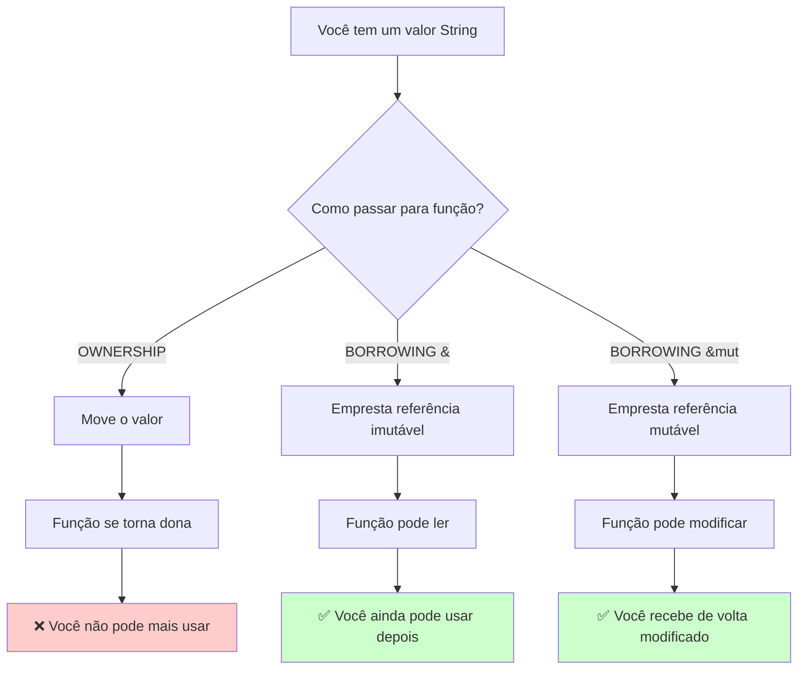
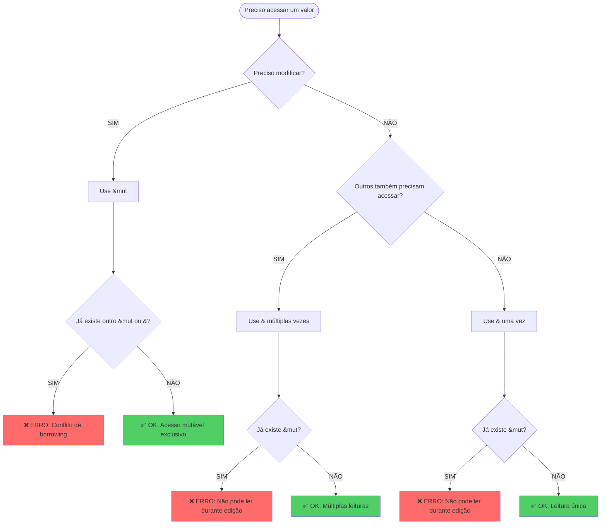
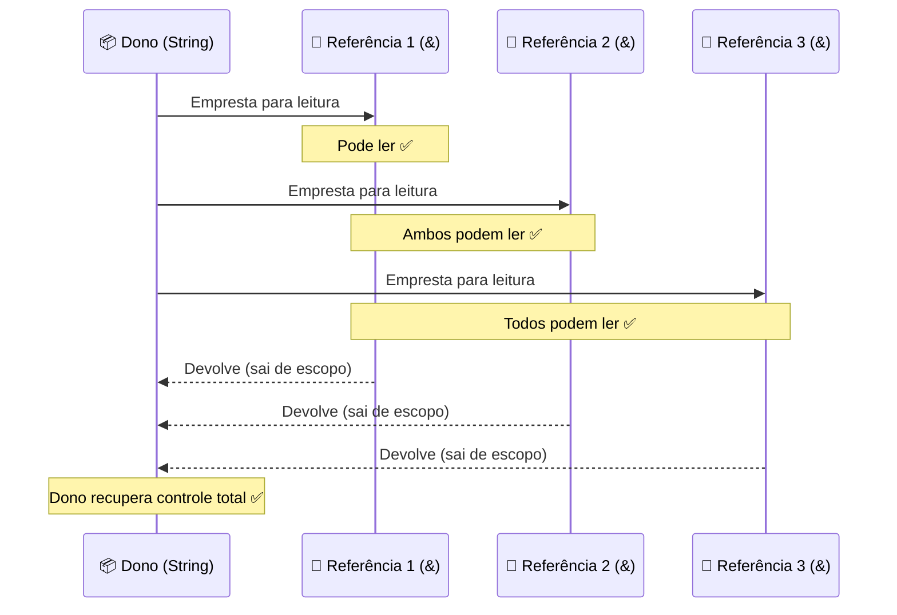
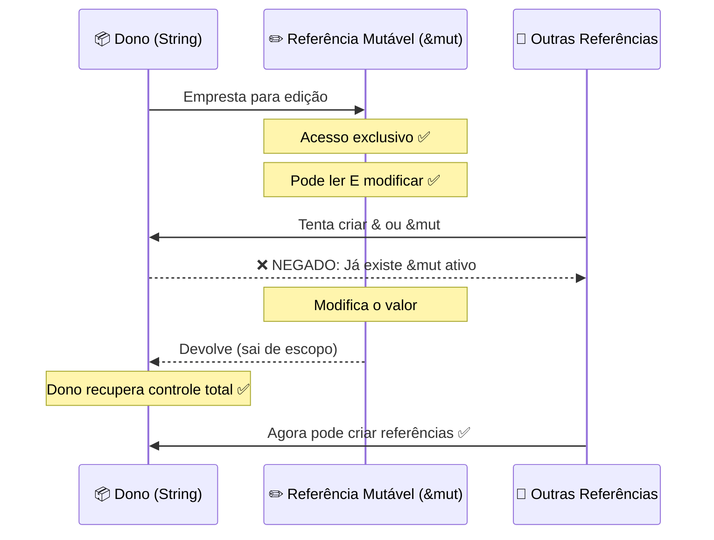
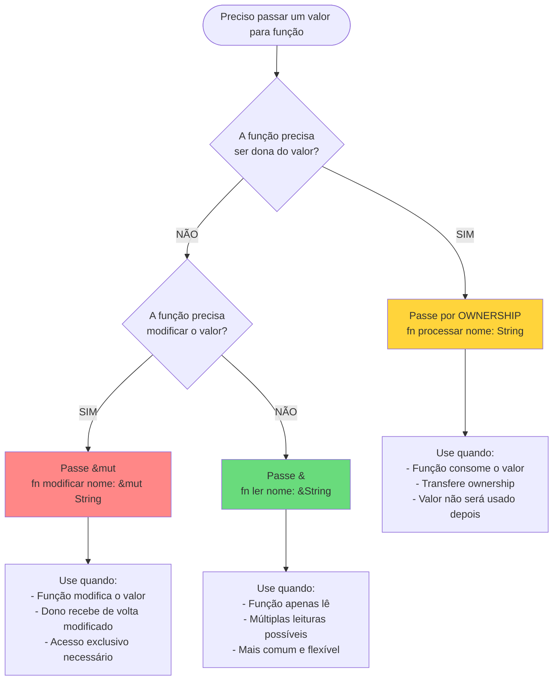
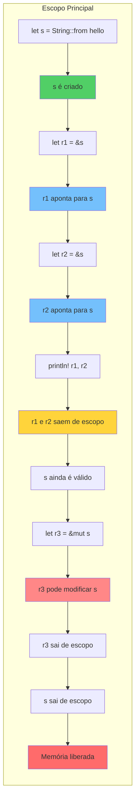
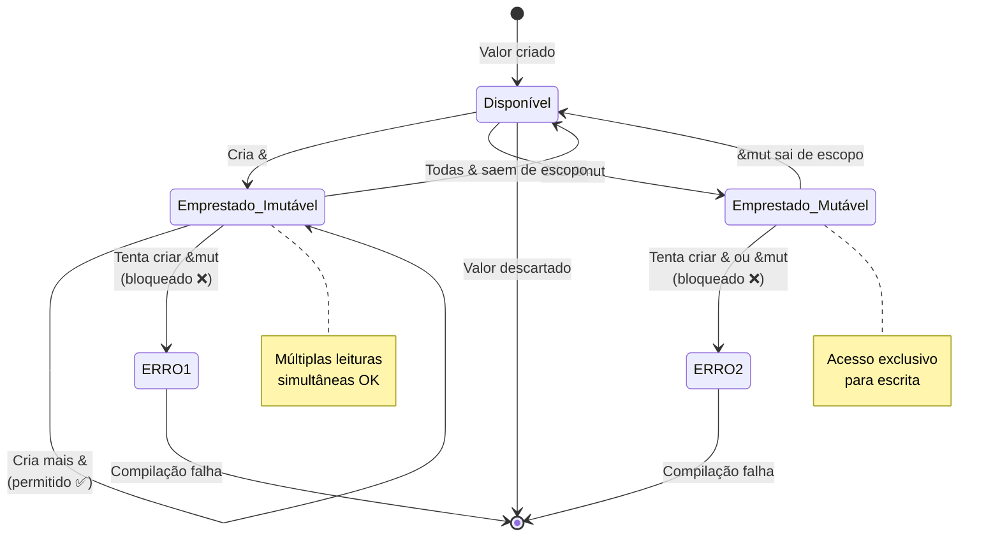

# 📘 Dia 17: Borrowing - A Chave para Produtividade em Rust

## 📋 Objetivos de Aprendizagem

Ao final deste material, você será capaz de:

✅ **Compreender** a diferença entre ownership e borrowing  
✅ **Aplicar** referências imutáveis (`&`) e mutáveis (`&mut`) corretamente  
✅ **Interpretar** mensagens do borrow checker como orientações educativas  
✅ **Refatorar** código que consome ownership para usar borrowing  
✅ **Trabalhar colaborativamente** com o compilador para escrever código seguro

---

## 🎭 Ativação do Conhecimento Prévio

### 🔄 Revisão Rápida: Ownership (Dia 16)

Você aprendeu que:
- Cada valor tem um **único dono**
- Quando o dono sai de escopo, o valor é **descartado**
- Passar valores para funções **move** o ownership
- Isso pode ser inconveniente quando queremos usar o valor depois

### 📚 Analogia Central: A Biblioteca

Imagine uma biblioteca com livros valiosos:

**🏠 OWNERSHIP (Comprar o livro)**
- Você é o dono absoluto
- Pode fazer o que quiser com ele
- Quando você se muda, o livro vai com você
- Ninguém mais pode usá-lo enquanto você tem

**👀 BORROWING IMUTÁVEL `&` (Emprestar para ler)**
- Você empresta o livro para amigos **apenas lerem**
- **Múltiplas pessoas** podem ler ao mesmo tempo
- Ninguém pode escrever ou modificar
- O livro volta para você intacto

**✏️ BORROWING MUTÁVEL `&mut` (Emprestar para editar)**
- Você empresta o livro para **uma única pessoa** fazer anotações
- **Apenas uma pessoa** pode editar por vez
- Ninguém mais pode nem ler enquanto alguém edita
- Evita conflitos e confusão

### 📖 História: O Problema do Caderno Compartilhado

Imagine uma equipe trabalhando em um caderno de projetos:

**Cenário 1: Sem regras** 😱
- Todos escrevem ao mesmo tempo
- Informações se sobrepõem
- Dados ficam corrompidos
- Ninguém sabe qual é a versão correta

**Cenário 2: Com regras de borrowing** 😊
- Todos podem **ler** simultaneamente (múltiplos `&`)
- Apenas **uma pessoa edita** por vez (`&mut`)
- Enquanto alguém edita, ninguém lê (evita dados inconsistentes)
- Resultado: dados sempre consistentes e seguros

**Rust implementa essas regras em tempo de compilação!**

---

## 📚 Apresentação do Conteúdo

### 🎯 As Três Regras de Ouro do Borrowing

```
REGRA 1: Múltiplas referências imutáveis OU uma referência mutável
        (&, &, &, ...) OU (&mut) - NUNCA ambos ao mesmo tempo

REGRA 2: Referências devem ser sempre válidas
        Não pode haver referências para dados que já foram descartados

REGRA 3: Não pode haver dangling references
        Referências sempre apontam para dados válidos na memória
```

---

### 📊 DIAGRAMA 1: Ownership vs Borrowing



---

### 📊 DIAGRAMA 2: Fluxograma de Regras de Borrowing



---

### 📊 DIAGRAMA 3: Múltiplas Referências Imutáveis



---

### 📊 DIAGRAMA 4: Única Referência Mutável



---

### 📊 DIAGRAMA 5: Árvore de Decisão - Qual Usar?



---

### 📊 DIAGRAMA 6: Ciclo de Vida de Referências



---

### 📊 DIAGRAMA 7: Borrow Checker em Ação



---

### 📋 Tabela Comparativa: &, &mut, Ownership

| Característica | `&` (Imutável) | `&mut` (Mutável) | Ownership |
|----------------|----------------|------------------|-----------|
| **Pode ler?** | ✅ Sim | ✅ Sim | ✅ Sim |
| **Pode modificar?** | ❌ Não | ✅ Sim | ✅ Sim |
| **Quantos simultâneos?** | ♾️ Múltiplos | 1️⃣ Apenas um | 1️⃣ Apenas um dono |
| **Dono mantém acesso?** | ✅ Sim (leitura) | ⚠️ Não (bloqueado) | ❌ Não (movido) |
| **Uso mais comum** | Leitura de dados | Modificação in-place | Consumir/transferir |
| **Sintaxe função** | `fn ler(s: &String)` | `fn editar(s: &mut String)` | `fn consumir(s: String)` |
| **Sintaxe método** | `fn len(&self)` | `fn push(&mut self)` | `fn into_string(self)` |

---

## 💡 Demonstração e Modelagem

### 🔴 Problema: Código com Ownership (Inconveniente)

```rust {.line-numbers}
fn main() {
    let s = String::from("Olá, Rust!");
    
    // Move ownership para a função
    calcular_tamanho(s);
    
    // ❌ ERRO: s foi movido, não pode mais usar
    // println!("String: {}", s);
}

fn calcular_tamanho(texto: String) -> usize {
    texto.len()
    // texto é descartado aqui
}
```

**Problemas:**
- ❌ Não podemos usar `s` depois de passá-lo
- ❌ Precisaríamos retornar `s` junto com o resultado
- ❌ Código fica verboso e inconveniente

---

### 🟢 Solução 1: Borrowing Imutável `&`

```rust {.line-numbers}
fn main() {
    let s = String::from("Olá, Rust!");
    
    // Empresta referência imutável
    let tamanho = calcular_tamanho(&s);
    
    // ✅ OK: s ainda é válido!
    println!("String '{}' tem {} caracteres", s, tamanho);
    
    // Podemos emprestar múltiplas vezes
    let tamanho2 = calcular_tamanho(&s);
    let tamanho3 = calcular_tamanho(&s);
}

fn calcular_tamanho(texto: &String) -> usize {
    texto.len()
    // Referência sai de escopo, mas s não é descartado
}
```

**Vantagens:**
- ✅ `s` continua disponível depois
- ✅ Podemos emprestar múltiplas vezes
- ✅ Código mais limpo e eficiente

---

### 🟡 Solução 2: Borrowing Mutável `&mut`

```rust {.line-numbers}
fn main() {
    let mut s = String::from("Olá");
    
    // Empresta referência mutável
    adicionar_mundo(&mut s);
    
    // ✅ OK: s foi modificado e ainda é válido
    println!("String modificada: {}", s); // "Olá, mundo!"
}

fn adicionar_mundo(texto: &mut String) {
    texto.push_str(", mundo!");
    // Referência sai de escopo, s volta para o dono
}
```

**Vantagens:**
- ✅ Função pode modificar o valor
- ✅ Dono recebe de volta o valor modificado
- ✅ Sem necessidade de retornar o valor

---

### 🎨 Evolução Completa: Antes → Depois

**ANTES: Ownership (Inconveniente)**

```rust {.line-numbers}
fn main() {
    let s1 = String::from("Rust");
    let s2 = String::from("Programming");
    
    // Ambos são movidos
    let resultado = concatenar(s1, s2);
    
    // ❌ Não podemos usar s1 ou s2 aqui
    println!("{}", resultado);
}

fn concatenar(a: String, b: String) -> String {
    format!("{} {}", a, b)
}
```

**DEPOIS: Borrowing (Eficiente)**

```rust {.line-numbers}
fn main() {
    let s1 = String::from("Rust");
    let s2 = String::from("Programming");
    
    // Emprestamos referências
    let resultado = concatenar(&s1, &s2);
    
    // ✅ Podemos usar s1 e s2 aqui!
    println!("{}", resultado);
    println!("Ainda tenho: {} e {}", s1, s2);
}

fn concatenar(a: &String, b: &String) -> String {
    format!("{} {}", a, b)
}
```

---

### 🔍 Casos de Uso Comuns

#### 1️⃣ Métodos com `&self` (Leitura)

```rust {.line-numbers}
struct Livro {
    titulo: String,
    paginas: u32,
}

impl Livro {
    // Método que apenas lê
    fn resumo(&self) -> String {
        format!("'{}' tem {} páginas", self.titulo, self.paginas)
    }
    
    // Método que lê e retorna referência
    fn obter_titulo(&self) -> &String {
        &self.titulo
    }
}

fn main() {
    let livro = Livro {
        titulo: String::from("Rust in Action"),
        paginas: 454,
    };
    
    // Podemos chamar múltiplas vezes
    println!("{}", livro.resumo());
    println!("{}", livro.resumo());
    println!("Título: {}", livro.obter_titulo());
}
```

---

#### 2️⃣ Métodos com `&mut self` (Modificação)

```rust {.line-numbers}
struct Contador {
    valor: i32,
}

impl Contador {
    fn novo() -> Self {
        Contador { valor: 0 }
    }
    
    // Método que modifica
    fn incrementar(&mut self) {
        self.valor += 1;
    }
    
    fn decrementar(&mut self) {
        self.valor -= 1;
    }
    
    // Método que apenas lê
    fn obter_valor(&self) -> i32 {
        self.valor
    }
}

fn main() {
    let mut contador = Contador::novo();
    
    contador.incrementar();
    contador.incrementar();
    println!("Valor: {}", contador.obter_valor()); // 2
    
    contador.decrementar();
    println!("Valor: {}", contador.obter_valor()); // 1
}
```

---

#### 3️⃣ Funções Auxiliares

```rust {.line-numbers}
fn main() {
    let texto = String::from("Olá, Rust!");
    
    // Múltiplas operações de leitura
    if eh_longo(&texto) {
        println!("Texto longo: {}", texto);
    }
    
    if contem_rust(&texto) {
        println!("Encontrei Rust!");
    }
    
    imprimir_maiusculo(&texto);
    
    // texto ainda é válido
    println!("Original: {}", texto);
}

fn eh_longo(s: &String) -> bool {
    s.len() > 10
}

fn contem_rust(s: &String) -> bool {
    s.contains("Rust")
}

fn imprimir_maiusculo(s: &String) {
    println!("{}", s.to_uppercase());
}
```

---

### 🎯 Idiomas do Rust (Rust Idioms)

#### ✅ Prefira `&str` em vez de `&String` para parâmetros

```rust {.line-numbers}
// ❌ Menos flexível
fn processar_texto(s: &String) {
    println!("{}", s);
}

// ✅ Mais flexível (aceita &String e &str)
fn processar_texto(s: &str) {
    println!("{}", s);
}

fn main() {
    let string = String::from("Olá");
    let str_slice = "Mundo";
    
    processar_texto(&string); // Funciona
    processar_texto(str_slice); // Funciona
}
```

---

#### ✅ Use `&[T]` para slices

```rust {.line-numbers}
// ✅ Aceita arrays e Vecs
fn somar(numeros: &[i32]) -> i32 {
    numeros.iter().sum()
}

fn main() {
    let array = [1, 2, 3, 4, 5];
    let vec = vec![10, 20, 30];
    
    println!("Soma array: {}", somar(&array));
    println!("Soma vec: {}", somar(&vec));
}
```

---

## 🎯 Prática Guiada: Refatoração com Borrowing

### 📝 Exercício Completo: Sistema de Gerenciamento de Tarefas

#### 🔴 Código Inicial (Problemas com Ownership)

```rust {.line-numbers}
struct Tarefa {
    titulo: String,
    descricao: String,
    concluida: bool,
}

fn main() {
    let tarefa = Tarefa {
        titulo: String::from("Estudar Rust"),
        descricao: String::from("Aprender borrowing"),
        concluida: false,
    };
    
    // Move ownership
    let info = obter_info(tarefa);
    println!("{}", info);
    
    // ❌ ERRO: tarefa foi movida
    // marcar_concluida(tarefa);
}

fn obter_info(t: Tarefa) -> String {
    format!("{}: {}", t.titulo, t.descricao)
}

fn marcar_concluida(t: Tarefa) {
    // Como modificar sem ownership?
}
```

**Problemas identificados:**
1. ❌ `obter_info` consome a tarefa
2. ❌ Não podemos usar `tarefa` depois
3. ❌ `marcar_concluida` não consegue modificar

---

#### 🟢 Solução Passo 1: Refatorar para `&`

```rust {.line-numbers}
struct Tarefa {
    titulo: String,
    descricao: String,
    concluida: bool,
}

fn main() {
    let tarefa = Tarefa {
        titulo: String::from("Estudar Rust"),
        descricao: String::from("Aprender borrowing"),
        concluida: false,
    };
    
    // Empresta referência imutável
    let info = obter_info(&tarefa);
    println!("{}", info);
    
    // ✅ OK: tarefa ainda é válida
    let status = verificar_status(&tarefa);
    println!("Status: {}", status);
}

fn obter_info(t: &Tarefa) -> String {
    format!("{}: {}", t.titulo, t.descricao)
}

fn verificar_status(t: &Tarefa) -> &str {
    if t.concluida {
        "Concluída"
    } else {
        "Pendente"
    }
}
```

**Melhorias:**
- ✅ `obter_info` agora empresta em vez de consumir
- ✅ Podemos chamar múltiplas funções de leitura
- ✅ `tarefa` permanece válida

---

#### 🟡 Solução Passo 2: Adicionar `&mut`

```rust {.line-numbers}
struct Tarefa {
    titulo: String,
    descricao: String,
    concluida: bool,
}

fn main() {
    let mut tarefa = Tarefa {
        titulo: String::from("Estudar Rust"),
        descricao: String::from("Aprender borrowing"),
        concluida: false,
    };
    
    // Leitura
    println!("{}", obter_info(&tarefa));
    
    // Modificação
    marcar_concluida(&mut tarefa);
    
    // ✅ Leitura após modificação
    println!("Status: {}", verificar_status(&tarefa));
    
    // Mais modificações
    atualizar_descricao(&mut tarefa, String::from("Dominar borrowing"));
    println!("{}", obter_info(&tarefa));
}

fn obter_info(t: &Tarefa) -> String {
    format!("{}: {}", t.titulo, t.descricao)
}

fn verificar_status(t: &Tarefa) -> &str {
    if t.concluida {
        "Concluída"
    } else {
        "Pendente"
    }
}

fn marcar_concluida(t: &mut Tarefa) {
    t.concluida = true;
}

fn atualizar_descricao(t: &mut Tarefa, nova_desc: String) {
    t.descricao = nova_desc;
}
```

**Melhorias:**
- ✅ Funções podem modificar a tarefa
- ✅ Dono recebe de volta as modificações
- ✅ Código limpo e eficiente

---

#### 🎨 Solução Passo 3: Implementar Métodos

```rust {.line-numbers}
struct Tarefa {
    titulo: String,
    descricao: String,
    concluida: bool,
}

impl Tarefa {
    // Construtor (consome valores)
    fn nova(titulo: String, descricao: String) -> Self {
        Tarefa {
            titulo,
            descricao,
            concluida: false,
        }
    }
    
    // Método de leitura (&self)
    fn obter_info(&self) -> String {
        format!("{}: {}", self.titulo, self.descricao)
    }
    
    // Método de leitura (&self)
    fn esta_concluida(&self) -> bool {
        self.concluida
    }
    
    // Método de modificação (&mut self)
    fn marcar_concluida(&mut self) {
        self.concluida = true;
    }
    
    // Método de modificação (&mut self)
    fn atualizar_descricao(&mut self, nova_desc: String) {
        self.descricao = nova_desc;
    }
    
    // Método de modificação (&mut self)
    fn reabrir(&mut self) {
        self.concluida = false;
    }
}

fn main() {
    let mut tarefa = Tarefa::nova(
        String::from("Estudar Rust"),
        String::from("Aprender borrowing"),
    );
    
    // Múltiplas leituras
    println!("{}", tarefa.obter_info());
    println!("Concluída? {}", tarefa.esta_concluida());
    
    // Modificação
    tarefa.marcar_concluida();
    println!("Concluída? {}", tarefa.esta_concluida());
    
    // Mais modificações
    tarefa.atualizar_descricao(String::from("Dominar borrowing"));
    println!("{}", tarefa.obter_info());
    
    // Reabrir
    tarefa.reabrir();
    println!("Concluída? {}", tarefa.esta_concluida());
}
```

**Padrões identificados:**
- ✅ Métodos de leitura usam `&self`
- ✅ Métodos de modificação usam `&mut self`
- ✅ Construtores consomem valores (ownership)
- ✅ Código orientado a objetos e idiomático

---

### 🔧 10-15 Snippets: Corrigindo Erros do Borrow Checker

#### ❌ Erro 1: Tentando usar valor após move

```rust {.line-numbers}
fn main() {
    let s = String::from("Olá");
    processar(s);
    println!("{}", s); // ❌ ERRO
}

fn processar(texto: String) {
    println!("{}", texto);
}
```

**Mensagem do compilador:**
```
error[E0382]: borrow of moved value: `s`
  --> src/main.rs:4:20
   |
2  |     let s = String::from("Olá");
   |         - move occurs because `s` has type `String`
3  |     processar(s);
   |               - value moved here
4  |     println!("{}", s);
   |                    ^ value borrowed here after move
```

**Explicação em português:**
O valor `s` foi **movido** para a função `processar`. Depois do move, `s` não é mais válido no escopo principal. Você está tentando usá-lo na linha 4, mas ele já foi consumido.

**✅ Solução:**
```rust {.line-numbers}
fn main() {
    let s = String::from("Olá");
    processar(&s); // Empresta em vez de mover
    println!("{}", s); // ✅ OK
}

fn processar(texto: &String) {
    println!("{}", texto);
}
```

**Por que funciona agora:**
Mudamos `processar` para aceitar `&String` (referência) em vez de `String` (ownership). Agora apenas **emprestamos** `s`, então ele continua válido após a chamada.

---

#### ❌ Erro 2: Múltiplas referências mutáveis

```rust {.line-numbers}
fn main() {
    let mut s = String::from("Olá");
    
    let r1 = &mut s;
    let r2 = &mut s; // ❌ ERRO
    
    println!("{}, {}", r1, r2);
}
```

**Mensagem do compilador:**
```
error[E0499]: cannot borrow `s` as mutable more than once at a time
  --> src/main.rs:5:14
   |
4  |     let r1 = &mut s;
   |              ------ first mutable borrow occurs here
5  |     let r2 = &mut s;
   |              ^^^^^^ second mutable borrow occurs here
6  |     
7  |     println!("{}, {}", r1, r2);
   |                        -- first borrow later used here
```

**Explicação em português:**
Você está tentando criar **duas referências mutáveis** (`r1` e `r2`) para o mesmo valor ao mesmo tempo. Rust não permite isso porque poderia causar **data races** (condições de corrida).

**✅ Solução:**
```rust {.line-numbers}
fn main() {
    let mut s = String::from("Olá");
    
    {
        let r1 = &mut s;
        r1.push_str(", mundo");
    } // r1 sai de escopo aqui
    
    let r2 = &mut s; // ✅ OK: r1 não existe mais
    r2.push_str("!");
    
    println!("{}", s);
}
```

**Por que funciona agora:**
Usamos **escopos** para garantir que `r1` saia de escopo antes de criar `r2`. Assim, nunca temos duas referências mutáveis ativas ao mesmo tempo.

---

#### ❌ Erro 3: Referência imutável e mutável juntas

```rust {.line-numbers}
fn main() {
    let mut s = String::from("Olá");
    
    let r1 = &s;     // Referência imutável
    let r2 = &s;     // Outra referência imutável
    let r3 = &mut s; // ❌ ERRO: Referência mutável
    
    println!("{}, {}, {}", r1, r2, r3);
}
```

**Mensagem do compilador:**
```
error[E0502]: cannot borrow `s` as mutable because it is also borrowed as immutable
  --> src/main.rs:6:14
   |
4  |     let r1 = &s;
   |              -- immutable borrow occurs here
5  |     let r2 = &s;
6  |     let r3 = &mut s;
   |              ^^^^^^ mutable borrow occurs here
7  |     
8  |     println!("{}, {}, {}", r1, r2, r3);
   |                            -- immutable borrow later used here
```

**Explicação em português:**
Você tem referências **imutáveis** (`r1`, `r2`) ativas e está tentando criar uma referência **mutável** (`r3`). Se `r3` modificasse `s`, as leituras de `r1` e `r2` poderiam ver dados inconsistentes.

**✅ Solução:**
```rust {.line-numbers}
fn main() {
    let mut s = String::from("Olá");
    
    let r1 = &s;
    let r2 = &s;
    println!("{}, {}", r1, r2);
    // r1 e r2 não são mais usadas depois daqui
    
    let r3 = &mut s; // ✅ OK: r1 e r2 não estão mais ativas
    r3.push_str(", mundo");
    println!("{}", r3);
}
```

**Por que funciona agora:**
O borrow checker do Rust é **inteligente**: ele sabe que `r1` e `r2` não são mais usadas após o primeiro `println!`. Então, quando criamos `r3`, as referências imutáveis já "expiraram".

---

#### ❌ Erro 4: Modificando através de referência imutável

```rust {.line-numbers}
fn main() {
    let s = String::from("Olá");
    modificar(&s); // ❌ ERRO
}

fn modificar(texto: &String) {
    texto.push_str(", mundo"); // ❌ ERRO
}
```

**Mensagem do compilador:**
```
error[E0596]: cannot borrow `*texto` as mutable, as it is behind a `&` reference
  --> src/main.rs:6:5
   |
5  | fn modificar(texto: &String) {
   |                     ------- help: consider changing this to be a mutable reference: `&mut String`
6  |     texto.push_str(", mundo");
   |     ^^^^^^^^^^^^^^^^^^^^^^^^^ `texto` is a `&` reference, so the data it refers to cannot be borrowed as mutable
```

**Explicação em português:**
Você está tentando **modificar** `texto`, mas ele é uma referência **imutável** (`&String`). Referências imutáveis não permitem modificações.

**✅ Solução:**
```rust {.line-numbers}
fn main() {
    let mut s = String::from("Olá"); // mut no dono
    modificar(&mut s); // &mut na referência
    println!("{}", s);
}

fn modificar(texto: &mut String) { // &mut no parâmetro
    texto.push_str(", mundo"); // ✅ OK
}
```

**Por que funciona agora:**
Três mudanças necessárias:
1. `s` precisa ser `mut` (dono permite modificação)
2. Passamos `&mut s` (referência mutável)
3. Função aceita `&mut String` (parâmetro mutável)

---

#### ❌ Erro 5: Dangling reference (referência pendente)

```rust {.line-numbers}
fn main() {
    let referencia = criar_referencia(); // ❌ ERRO
    println!("{}", referencia);
}

fn criar_referencia() -> &String {
    let s = String::from("Olá");
    &s // ❌ ERRO: s será descartado
}
```

**Mensagem do compilador:**
```
error[E0106]: missing lifetime specifier
  --> src/main.rs:5:26
   |
5  | fn criar_referencia() -> &String {
   |                          ^ expected named lifetime parameter
   |
   = help: this function's return type contains a borrowed value, but there is no value for it to be borrowed from
```

**Explicação em português:**
Você está tentando retornar uma **referência** para `s`, mas `s` é uma variável **local** que será **descartada** quando a função terminar. A referência apontaria para memória inválida (dangling reference).

**✅ Solução 1: Retornar ownership**
```rust {.line-numbers}
fn main() {
    let string = criar_string(); // ✅ OK
    println!("{}", string);
}

fn criar_string() -> String {
    let s = String::from("Olá");
    s // Move ownership para o chamador
}
```

**✅ Solução 2: Aceitar referência como parâmetro**
```rust {.line-numbers}
fn main() {
    let s = String::from("Olá");
    let referencia = obter_referencia(&s); // ✅ OK
    println!("{}", referencia);
}

fn obter_referencia(texto: &String) -> &String {
    texto // Retorna a mesma referência
}
```

**Por que funciona agora:**
- **Solução 1**: Transferimos ownership, então o valor não é descartado
- **Solução 2**: A referência aponta para um valor que vive no `main`, não na função

---

#### ❌ Erro 6: Modificando em loop com referência imutável

```rust {.line-numbers}
fn main() {
    let mut numeros = vec![1, 2, 3, 4, 5];
    
    for n in &numeros {
        numeros.push(*n * 2); // ❌ ERRO
    }
}
```

**Mensagem do compilador:**
```
error[E0502]: cannot borrow `numeros` as mutable because it is also borrowed as immutable
  --> src/main.rs:5:9
   |
4  |     for n in &numeros {
   |              --------
   |              |
   |              immutable borrow occurs here
   |              immutable borrow later used here
5  |         numeros.push(*n * 2);
   |         ^^^^^^^^^^^^^^^^^^^^ mutable borrow occurs here
```

**Explicação em português:**
O loop `for n in &numeros` cria uma referência **imutável** para o vetor. Dentro do loop, você está tentando **modificar** o vetor com `push`, o que requer uma referência **mutável**. Não pode ter ambas ao mesmo tempo.

**✅ Solução:**
```rust {.line-numbers}
fn main() {
    let mut numeros = vec![1, 2, 3, 4, 5];
    let copia: Vec<i32> = numeros.clone(); // Cria cópia
    
    for n in &copia {
        numeros.push(*n * 2); // ✅ OK: iterando sobre cópia
    }
    
    println!("{:?}", numeros);
}
```

**Por que funciona agora:**
Criamos uma **cópia** do vetor e iteramos sobre ela. Assim, a referência imutável aponta para `copia`, e podemos modificar `numeros` livremente.

---

#### ❌ Erro 7: Retornando referência de campo

```rust {.line-numbers}
struct Pessoa {
    nome: String,
}

impl Pessoa {
    fn obter_nome(&self) -> &String {
        &self.nome // ✅ OK
    }
    
    fn obter_primeiro_nome(&self) -> &str {
        let partes: Vec<&str> = self.nome.split(' ').collect();
        partes[0] // ❌ ERRO: partes será descartado
    }
}
```

**Mensagem do compilador:**
```
error[E0515]: cannot return value referencing local variable `partes`
  --> src/main.rs:12:9
   |
11 |         let partes: Vec<&str> = self.nome.split(' ').collect();
   |             ------ `partes` is borrowed here
12 |         partes[0]
   |         ^^^^^^^^^ returns a value referencing data owned by the current function
```

**Explicação em português:**
Você está retornando `partes[0]`, que é uma referência para dados dentro de `partes`. Mas `partes` é uma variável **local** que será **descartada** quando a função terminar.

**✅ Solução:**
```rust {.line-numbers}
struct Pessoa {
    nome: String,
}

impl Pessoa {
    fn obter_nome(&self) -> &String {
        &self.nome
    }
    
    fn obter_primeiro_nome(&self) -> &str {
        // Retorna slice direto da String original
        self.nome
            .split(' ')
            .next()
            .unwrap_or(&self.nome)
    }
}

fn main() {
    let pessoa = Pessoa {
        nome: String::from("João Silva"),
    };
    
    println!("Primeiro nome: {}", pessoa.obter_primeiro_nome());
}
```

**Por que funciona agora:**
Usamos `split().next()` que retorna uma referência **diretamente** de `self.nome`, não de uma variável local. A referência aponta para dados que vivem em `Pessoa`, não na função.

---

#### ❌ Erro 8: Modificando durante iteração

```rust {.line-numbers}
fn main() {
    let mut palavras = vec![
        String::from("Rust"),
        String::from("é"),
        String::from("incrível"),
    ];
    
    for palavra in &palavras {
        if palavra.len() < 5 {
            palavras.push(String::from("!")); // ❌ ERRO
        }
    }
}
```

**Mensagem do compilador:**
```
error[E0502]: cannot borrow `palavras` as mutable because it is also borrowed as immutable
  --> src/main.rs:9:13
   |
7  |     for palavra in &palavras {
   |                    ---------
   |                    |
   |                    immutable borrow occurs here
   |                    immutable borrow later used here
8  |         if palavra.len() < 5 {
9  |             palavras.push(String::from("!"));
   |             ^^^^^^^^^^^^^^^^^^^^^^^^^^^^^^^^ mutable borrow occurs here
```

**Explicação em português:**
Você está **iterando** sobre `&palavras` (referência imutável) e tentando **modificar** `palavras` dentro do loop. Isso violaria a regra de borrowing.

**✅ Solução:**
```rust {.line-numbers}
fn main() {
    let mut palavras = vec![
        String::from("Rust"),
        String::from("é"),
        String::from("incrível"),
    ];
    
    let mut adicoes = Vec::new();
    
    for palavra in &palavras {
        if palavra.len() < 5 {
            adicoes.push(String::from("!"));
        }
    }
    
    palavras.extend(adicoes); // Adiciona depois da iteração
    
    println!("{:?}", palavras);
}
```

**Por que funciona agora:**
Coletamos as **adições** em um vetor separado durante a iteração, e só modificamos `palavras` **depois** que o loop termina (e a referência imutável expira).

---

#### ❌ Erro 9: Referência mutável em closure

```rust {.line-numbers}
fn main() {
    let mut contador = 0;
    
    let incrementar = || {
        contador += 1; // Captura &mut contador
    };
    
    println!("Contador: {}", contador); // ❌ ERRO
    incrementar();
}
```

**Mensagem do compilador:**
```
error[E0502]: cannot borrow `contador` as immutable because it is also borrowed as mutable
  --> src/main.rs:8:31
   |
4  |     let incrementar = || {
   |                       -- mutable borrow occurs here
5  |         contador += 1;
   |         -------- first borrow occurs due to use of `contador` in closure
...
8  |     println!("Contador: {}", contador);
   |                              ^^^^^^^^ immutable borrow occurs here
9  |     incrementar();
   |     ----------- mutable borrow later used here
```

**Explicação em português:**
A closure `incrementar` captura uma referência **mutável** para `contador`. Enquanto a closure existir, você não pode criar outras referências (imutáveis ou mutáveis) para `contador`.

**✅ Solução:**
```rust {.line-numbers}
fn main() {
    let mut contador = 0;
    
    let incrementar = || {
        contador += 1;
    };
    
    incrementar(); // Usa a closure primeiro
    
    println!("Contador: {}", contador); // ✅ OK: closure não é mais usada
}
```

**Por que funciona agora:**
Chamamos `incrementar()` **antes** de tentar ler `contador`. Depois que a closure é usada pela última vez, o borrow checker permite acessar `contador` novamente.

---

#### ❌ Erro 10: Referência em struct sem lifetime

```rust {.line-numbers}
struct Livro {
    titulo: &str, // ❌ ERRO: falta lifetime
}

fn main() {
    let titulo = String::from("Rust in Action");
    let livro = Livro { titulo: &titulo };
}
```

**Mensagem do compilador:**
```
error[E0106]: missing lifetime specifier
  --> src/main.rs:2:13
   |
2  |     titulo: &str,
   |             ^ expected named lifetime parameter
   |
help: consider introducing a named lifetime parameter
   |
1  ~ struct Livro<'a> {
2  ~     titulo: &'a str,
   |
```

**Explicação em português:**
Quando uma struct contém **referências**, Rust precisa saber **por quanto tempo** essas referências são válidas. Isso é feito com **lifetimes** (anotações de tempo de vida).

**✅ Solução:**
```rust {.line-numbers}
struct Livro<'a> {
    titulo: &'a str,
}

fn main() {
    let titulo = String::from("Rust in Action");
    let livro = Livro { titulo: &titulo };
    
    println!("Livro: {}", livro.titulo);
}
```

**Por que funciona agora:**
Adicionamos `<'a>` (lifetime parameter) para indicar que a referência `titulo` deve viver **pelo menos tanto quanto** a instância de `Livro`.

---

#### ❌ Erro 11: Retornando referência com lifetime incorreto

```rust {.line-numbers}
fn maior<'a>(x: &'a str, y: &str) -> &'a str {
    if x.len() > y.len() {
        x
    } else {
        y // ❌ ERRO: y não tem lifetime 'a
    }
}
```

**Mensagem do compilador:**
```
error[E0623]: lifetime mismatch
  --> src/main.rs:6:9
   |
1  | fn maior<'a>(x: &'a str, y: &str) -> &'a str {
   |                             ----     -------
   |                             |
   |                             this parameter and the return type are declared with different lifetimes...
...
6  |         y
   |         ^ ...but data from `y` is returned here
```

**Explicação em português:**
A função promete retornar uma referência com lifetime `'a` (mesmo de `x`), mas pode retornar `y`, que tem um lifetime **diferente**. Rust não pode garantir segurança.

**✅ Solução:**
```rust {.line-numbers}
fn maior<'a>(x: &'a str, y: &'a str) -> &'a str {
    if x.len() > y.len() {
        x
    } else {
        y // ✅ OK: ambos têm lifetime 'a
    }
}

fn main() {
    let string1 = String::from("Rust");
    let string2 = String::from("Programming");
    
    let resultado = maior(&string1, &string2);
    println!("Maior: {}", resultado);
}
```

**Por que funciona agora:**
Ambos os parâmetros (`x` e `y`) agora têm o **mesmo lifetime** `'a`. Rust sabe que a referência retornada será válida enquanto **ambas** as entradas forem válidas.

---

#### ❌ Erro 12: Vec com referências sem lifetime

```rust {.line-numbers}
fn main() {
    let mut lista: Vec<&str> = Vec::new(); // ❌ ERRO implícito
    
    {
        let temp = String::from("temporário");
        lista.push(&temp);
    } // temp é descartado aqui
    
    println!("{:?}", lista); // ❌ Dangling reference
}
```

**Mensagem do compilador:**
```
error[E0597]: `temp` does not live long enough
  --> src/main.rs:6:20
   |
5  |         let temp = String::from("temporário");
   |             ---- binding `temp` declared here
6  |         lista.push(&temp);
   |                    ^^^^^ borrowed value does not live long enough
7  |     }
   |     - `temp` dropped here while still borrowed
8  |     
9  |     println!("{:?}", lista);
   |                      ----- borrow later used here
```

**Explicação em português:**
Você está tentando armazenar uma referência para `temp` no vetor, mas `temp` é **descartado** quando sai do bloco interno. A referência no vetor ficaria **inválida**.

**✅ Solução:**
```rust {.line-numbers}
fn main() {
    let mut lista: Vec<String> = Vec::new(); // Armazena Strings, não &str
    
    {
        let temp = String::from("temporário");
        lista.push(temp); // Move ownership para o vetor
    }
    
    println!("{:?}", lista); // ✅ OK
}
```

**Por que funciona agora:**
Mudamos o vetor para armazenar `String` (ownership) em vez de `&str` (referências). Agora o vetor **possui** os dados, então eles não são descartados prematuramente.

---

#### ❌ Erro 13: Método que retorna referência mutável e tenta usar self

```rust {.line-numbers}
struct Contador {
    valor: i32,
}

impl Contador {
    fn obter_mut(&mut self) -> &mut i32 {
        &mut self.valor
    }
}

fn main() {
    let mut c = Contador { valor: 0 };
    
    let ref_mut = c.obter_mut();
    *ref_mut += 1;
    
    println!("Valor: {}", c.valor); // ❌ ERRO
}
```

**Mensagem do compilador:**
```
error[E0502]: cannot borrow `c.valor` as immutable because it is also borrowed as mutable
  --> src/main.rs:16:28
   |
13 |     let ref_mut = c.obter_mut();
   |                   - mutable borrow occurs here
14 |     *ref_mut += 1;
15 |     
16 |     println!("Valor: {}", c.valor);
   |                            ^^^^^^^ immutable borrow occurs here
   |                            |
   |                            mutable borrow later used here
```

**Explicação em português:**
`ref_mut` é uma referência **mutável** para `c.valor`. Enquanto `ref_mut` existir, você não pode acessar `c.valor` de outra forma (nem para leitura).

**✅ Solução:**
```rust {.line-numbers}
struct Contador {
    valor: i32,
}

impl Contador {
    fn obter_mut(&mut self) -> &mut i32 {
        &mut self.valor
    }
}

fn main() {
    let mut c = Contador { valor: 0 };
    
    {
        let ref_mut = c.obter_mut();
        *ref_mut += 1;
    } // ref_mut sai de escopo aqui
    
    println!("Valor: {}", c.valor); // ✅ OK
}
```

**Por que funciona agora:**
Colocamos `ref_mut` em um **bloco separado** para que ela saia de escopo antes de tentarmos acessar `c.valor`.

---

#### ❌ Erro 14: Split borrow em struct

```rust {.line-numbers}
struct Dados {
    x: i32,
    y: i32,
}

impl Dados {
    fn processar(&mut self) {
        self.atualizar_x(&self.y); // ❌ ERRO
    }
    
    fn atualizar_x(&mut self, valor: &i32) {
        self.x = *valor;
    }
}
```

**Mensagem do compilador:**
```
error[E0502]: cannot borrow `self.y` as immutable because it is also borrowed as mutable
  --> src/main.rs:8:27
   |
8  |         self.atualizar_x(&self.y);
   |         -----            ^^^^^^^^ immutable borrow occurs here
   |         |
   |         mutable borrow occurs here
```

**Explicação em português:**
`atualizar_x` precisa de `&mut self` (referência mutável para toda a struct), mas você está tentando também criar `&self.y` (referência imutável para um campo). Rust vê isso como conflito.

**✅ Solução:**
```rust {.line-numbers}
struct Dados {
    x: i32,
    y: i32,
}

impl Dados {
    fn processar(&mut self) {
        let y_valor = self.y; // Copia o valor
        self.atualizar_x(y_valor); // Passa cópia, não referência
    }
    
    fn atualizar_x(&mut self, valor: i32) {
        self.x = valor;
    }
}

fn main() {
    let mut dados = Dados { x: 0, y: 42 };
    dados.processar();
    println!("x = {}", dados.x);
}
```

**Por que funciona agora:**
Em vez de passar uma **referência** para `self.y`, copiamos o **valor** de `y` e passamos a cópia. Assim, não há conflito de borrowing.

---

#### ❌ Erro 15: Closure capturando referência mutável duas vezes

```rust {.line-numbers}
fn main() {
    let mut x = 5;
    
    let mut incrementar = || x += 1;
    let mut dobrar = || x *= 2; // ❌ ERRO
    
    incrementar();
    dobrar();
}
```

**Mensagem do compilador:**
```
error[E0499]: cannot borrow `x` as mutable more than once at a time
  --> src/main.rs:5:26
   |
4  |     let mut incrementar = || x += 1;
   |                           -- ----- first borrow occurs due to use of `x` in closure
   |                           |
   |                           first mutable borrow occurs here
5  |     let mut dobrar = || x *= 2;
   |                      ^^ ----- second borrow occurs due to use of `x` in closure
   |                      |
   |                      second mutable borrow occurs here
6  |     
7  |     incrementar();
   |     ----------- first borrow later used here
```

**Explicação em português:**
Ambas as closures (`incrementar` e `dobrar`) capturam referências **mutáveis** para `x`. Você não pode ter duas referências mutáveis ativas ao mesmo tempo.

**✅ Solução:**
```rust {.line-numbers}
fn main() {
    let mut x = 5;
    
    {
        let mut incrementar = || x += 1;
        incrementar();
    } // incrementar sai de escopo
    
    {
        let mut dobrar = || x *= 2;
        dobrar();
    } // dobrar sai de escopo
    
    println!("x = {}", x);
}
```

**Por que funciona agora:**
Usamos **escopos** para garantir que cada closure seja usada e descartada antes de criar a próxima. Assim, nunca temos duas referências mutáveis ativas simultaneamente.

---

### 📊 Comparação Antes/Depois - Resumo

| Aspecto | ANTES (Ownership) | DEPOIS (Borrowing) |
|---------|-------------------|-------------------|
| **Flexibilidade** | ❌ Valor consumido | ✅ Valor reutilizável |
| **Eficiência** | ⚠️ Pode precisar clonar | ✅ Sem cópias desnecessárias |
| **Verbosidade** | ❌ Precisa retornar valores | ✅ Código mais limpo |
| **Múltiplos acessos** | ❌ Difícil | ✅ Fácil com & |
| **Modificação** | ⚠️ Precisa ownership | ✅ Fácil com &mut |
| **Segurança** | ✅ Seguro | ✅ Seguro |

---

## 🔄 Feedback e Avaliação

### ✅ Checklist de Borrowing

Antes de compilar seu código, verifique:

- [ ] **Referências imutáveis**: Usei `&` quando só preciso ler?
- [ ] **Referências mutáveis**: Usei `&mut` quando preciso modificar?
- [ ] **Regra 1**: Tenho múltiplos `&` OU um único `&mut` (nunca ambos)?
- [ ] **Regra 2**: Minhas referências são válidas (não apontam para dados descartados)?
- [ ] **Regra 3**: Não tenho dangling references?
- [ ] **Escopos**: Usei blocos `{}` para controlar lifetimes quando necessário?
- [ ] **Métodos**: Usei `&self` para leitura e `&mut self` para modificação?
- [ ] **Parâmetros**: Preferi `&str` em vez de `&String` quando possível?

---

### 🎯 Exercícios de Rastreamento

**Exercício 1: Trace o borrowing**

```rust {.line-numbers}
fn main() {
    let mut s = String::from("Olá");
    
    let r1 = &s;        // Linha A
    let r2 = &s;        // Linha B
    println!("{} {}", r1, r2); // Linha C
    
    let r3 = &mut s;    // Linha D
    r3.push_str("!");   // Linha E
    println!("{}", r3); // Linha F
}
```

**Perguntas:**
1. Quantas referências imutáveis existem na Linha C?
2. Por que Linha D não causa erro?
3. O que aconteceria se tentássemos usar `r1` na Linha F?

**Respostas:**
1. Duas: `r1` e `r2`
2. Porque `r1` e `r2` não são mais usadas depois da Linha C (expiram)
3. Erro: `r1` e `r3` não podem coexistir (& e &mut juntos)

---

**Exercício 2: Identifique o erro**

```rust {.line-numbers}
fn main() {
    let mut vec = vec![1, 2, 3];
    
    let primeiro = &vec[0];
    vec.push(4);
    println!("Primeiro: {}", primeiro);
}
```

**Pergunta:** Por que este código não compila?

**Resposta:** `primeiro` é uma referência imutável para um elemento do vetor. `vec.push(4)` precisa de uma referência mutável para o vetor. Não pode ter & e &mut ao mesmo tempo.

---

### 📝 Quiz sobre Regras

**1. Qual afirmação é verdadeira?**
- a) Posso ter múltiplas referências mutáveis ao mesmo tempo
- b) Posso ter múltiplas referências imutáveis ao mesmo tempo ✅
- c) Posso ter referências imutáveis e mutáveis ao mesmo tempo
- d) Não posso ter nenhuma referência

**2. O que acontece quando uma referência sai de escopo?**
- a) O valor é descartado
- b) O valor é copiado
- c) O empréstimo termina e o dono recupera controle ✅
- d) Nada acontece

**3. Qual é a sintaxe correta para emprestar mutavelmente?**
- a) `let r = *mut s;`
- b) `let r = &mut s;` ✅
- c) `let r = mut &s;`
- d) `let r = &s mut;`

**4. Quando devo usar `&self` em um método?**
- a) Quando o método modifica o objeto
- b) Quando o método apenas lê o objeto ✅
- c) Quando o método consome o objeto
- d) Sempre

**5. O que é uma dangling reference?**
- a) Uma referência para dados válidos
- b) Uma referência para dados que foram descartados ✅
- c) Uma referência mutável
- d) Uma referência imutável

---

### 🎓 Auto-avaliação

**Nível 1 - Iniciante** (você está aqui se...)
- [ ] Entendo a diferença entre `&` e `&mut`
- [ ] Sei que não posso ter & e &mut juntos
- [ ] Consigo criar referências simples

**Nível 2 - Intermediário** (você está aqui se...)
- [ ] Uso escopos para controlar lifetimes
- [ ] Entendo mensagens do borrow checker
- [ ] Refatoro código de ownership para borrowing

**Nível 3 - Avançado** (você está aqui se...)
- [ ] Trabalho naturalmente com o borrow checker
- [ ] Entendo lifetimes explícitos
- [ ] Projeto APIs idiomáticas com borrowing

---

## 🚀 Transferência e Aplicação

### 💪 Prática com Borrow Checker

**Desafio 1: Sistema de Biblioteca**

Implemente um sistema onde:
- Livros podem ser consultados (múltiplas leituras)
- Apenas um usuário pode editar por vez
- Use `&` e `&mut` apropriadamente

```rust {.line-numbers}
struct Livro {
    titulo: String,
    disponivel: bool,
}

impl Livro {
    // Implemente métodos aqui
}

fn main() {
    // Teste seu código aqui
}
```

---

**Desafio 2: Processador de Texto**

Crie funções que:
- Contam palavras (leitura)
- Convertem para maiúsculas (modificação)
- Adicionam prefixo (modificação)

Use borrowing apropriadamente.

---

### 🔜 Preparação para Slices (Dia 18)

Você aprendeu sobre **referências** (`&T`, `&mut T`). Slices são um tipo especial de referência que aponta para **parte** de uma coleção:

- `&str` - slice de String
- `&[T]` - slice de array/Vec

**Preview:**
```rust {.line-numbers}
let s = String::from("Olá, mundo!");
let ola = &s[0..3];  // Slice: "Olá"
let mundo = &s[5..11]; // Slice: "mundo"
```

Slices usam os mesmos princípios de borrowing que você acabou de aprender!

---

### 📚 Recursos Extras

**Documentação Oficial:**
- [The Rust Book - References and Borrowing](https://doc.rust-lang.org/book/ch04-02-references-and-borrowing.html)
- [Rust by Example - Borrowing](https://doc.rust-lang.org/rust-by-example/scope/borrow.html)

**Vídeos Recomendados:**
- "Rust Ownership and Borrowing Explained" - Let's Get Rusty
- "Understanding Rust Lifetimes" - Jon Gjengset

**Ferramentas:**
- [Rust Playground](https://play.rust-lang.org/) - Teste código online
- `cargo clippy` - Linter que sugere melhorias de borrowing

---

## 🎉 Conclusão

### 🌟 O que você aprendeu hoje

✅ **Referências imutáveis (`&`)**: Emprestar para leitura  
✅ **Referências mutáveis (`&mut`)**: Emprestar para modificação  
✅ **Regras de borrowing**: Múltiplos & OU um &mut  
✅ **Borrow checker**: Seu aliado para código seguro  
✅ **Refatoração**: Transformar ownership em borrowing  
✅ **Métodos**: `&self` vs `&mut self`  

---

### 💡 Mensagem Final

**O Borrow Checker é seu amigo! 🤝**

Pode parecer frustrante no início, mas ele está te protegendo de:
- ❌ Data races (condições de corrida)
- ❌ Dangling pointers (ponteiros inválidos)
- ❌ Use-after-free (uso após liberação)
- ❌ Iterator invalidation (invalidação de iteradores)

**Todos esses bugs são impossíveis em Rust seguro!**

Com prática, você vai:
1. **Antecipar** erros de borrowing antes de compilar
2. **Entender** mensagens do compilador rapidamente
3. **Projetar** código que trabalha COM as regras
4. **Apreciar** a segurança que Rust oferece

**Continue praticando e celebre cada erro do compilador como uma oportunidade de aprendizado!** 🎓

---

### 📅 Próximos Passos

**Dia 18: Slices** 🍕
- String slices (`&str`)
- Array slices (`&[T]`)
- Ranges e indexação
- Padrões idiomáticos

**Dia 19: Structs** 🏗️
- Definindo structs
- Métodos e funções associadas
- Tuple structs
- Unit-like structs

---

**Bons estudos e até o próximo dia! 🚀**