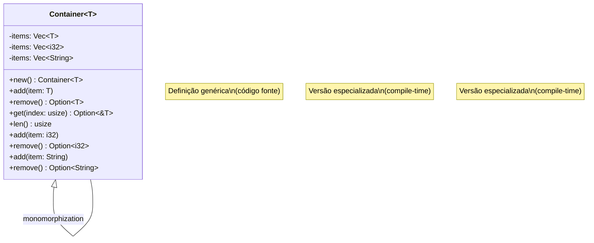
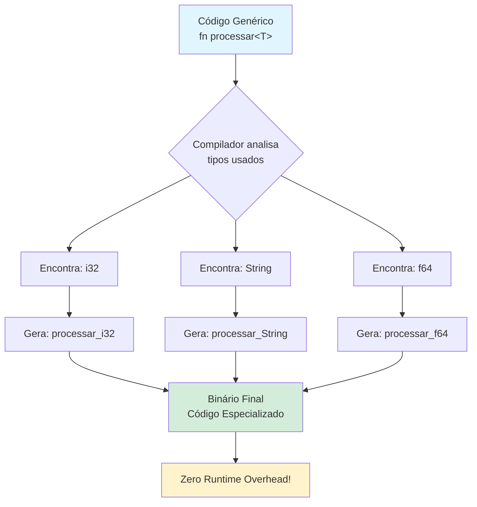
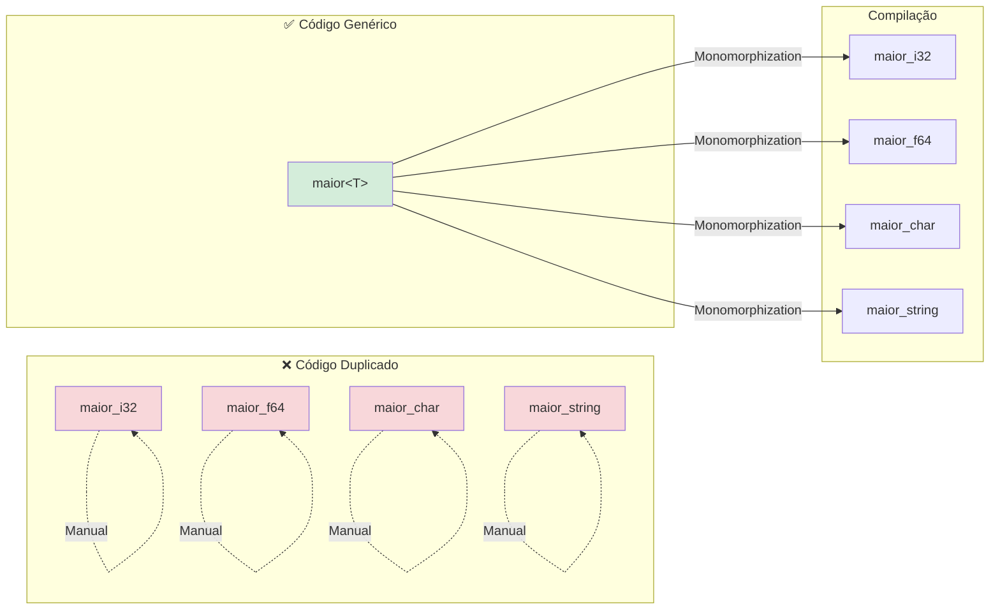
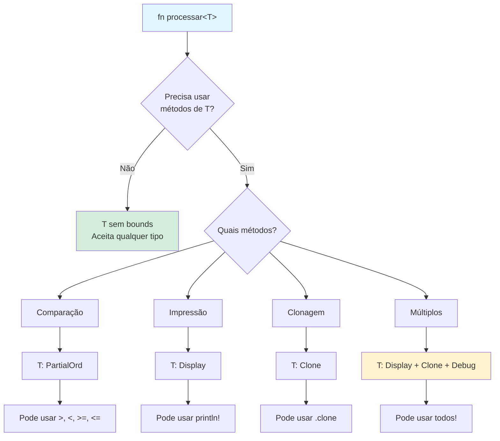
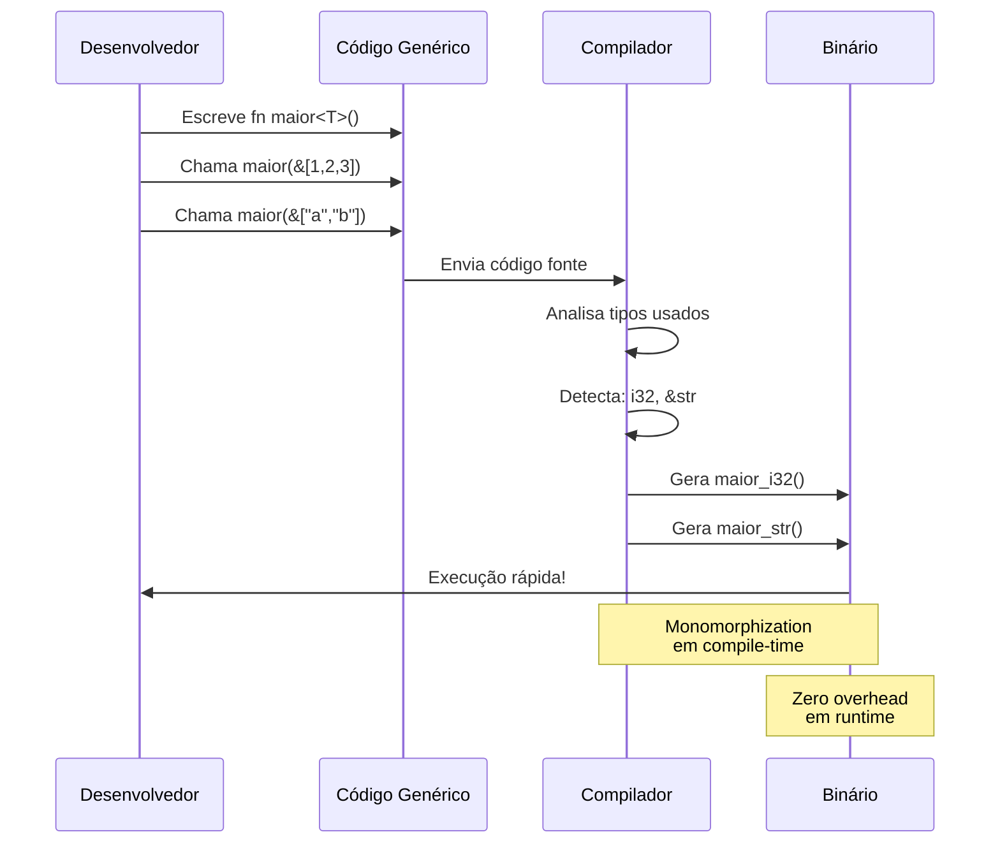
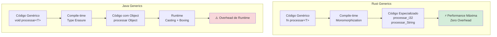
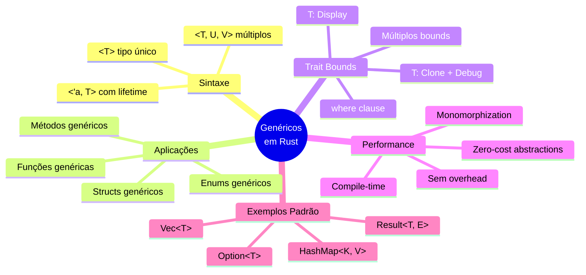

# 🦀 Dia 30: Genéricos - Código Reutilizável com Zero-Cost

## 📋 OBJETIVOS DE APRENDIZAGEM

Ao final desta lição, você será capaz de:

✅ **Criar código genérico reutilizável** que funciona com múltiplos tipos  
✅ **Combinar genéricos com traits** usando trait bounds  
✅ **Entender zero-cost abstractions** e monomorphization  
✅ **Refatorar código duplicado** em soluções genéricas elegantes  
✅ **Aplicar genéricos em structs, enums e funções** com confiança

---

## 🎭 ATIVAÇÃO DO CONHECIMENTO PRÉVIO

### 🔗 Revisão Rápida: Traits (Dia 29)

Lembra dos **traits**? Eles definem comportamentos compartilhados:

```rust {.line-numbers}
trait Descritivel {
    fn descrever(&self) -> String;
}
```

Hoje vamos **combinar traits com genéricos** para criar código ainda mais poderoso!

---

### 🍪 ANALOGIA CENTRAL: O Molde de Cookie

Imagine que você tem uma padaria:

| Conceito             | Analogia            | Explicação                                                            |
| -------------------- | ------------------- | --------------------------------------------------------------------- |
| **Genérico `<T>`**   | 🍪 Molde de cookie   | Um molde funciona com **qualquer massa** (chocolate, baunilha, aveia) |
| **Monomorphization** | 🔥 Assar cookies     | O compilador "assa" versões específicas para cada tipo usado          |
| **Zero-Cost**        | ⚡ Eficiência máxima | O cookie genérico é tão eficiente quanto um feito à mão               |

**História:**

> Maria tinha 3 funções quase idênticas: `maior_i32()`, `maior_f64()`, `maior_string()`. Cada uma encontrava o maior valor de um tipo diferente. Era **código duplicado** e difícil de manter!
>
> Com **genéricos**, ela criou **uma única função** `maior<T>()` que funciona com **qualquer tipo**. O compilador Rust automaticamente gera versões otimizadas para cada tipo usado. **Reutilização + Performance = Genéricos em Rust!** 🚀

---

## 📚 APRESENTAÇÃO DO CONTEÚDO

### 1️⃣ Sintaxe Básica: `<T>` (Tipo Genérico)

O **`<T>`** é um **parâmetro de tipo** (type parameter). É como uma variável, mas para tipos:

```rust {.line-numbers}
// Função genérica simples
fn imprimir<T>(valor: T) {
    println!("Valor recebido!");
}

fn main() {
    imprimir(42);           // T = i32
    imprimir("Olá");        // T = &str
    imprimir(3.14);         // T = f64
}
```

**Convenções de nomenclatura:**
- `T` = Type (tipo genérico padrão)
- `U`, `V` = tipos adicionais
- `K`, `V` = Key, Value (em mapas)
- `E` = Error (em Result)

---

### 2️⃣ Múltiplos Parâmetros: `<T, U, V>`

Você pode usar **vários tipos genéricos** ao mesmo tempo:

```rust {.line-numbers}
// Struct com dois tipos genéricos
struct Par<T, U> {
    primeiro: T,
    segundo: U,
}

fn main() {
    let par1 = Par { primeiro: 10, segundo: "dez" };      // T=i32, U=&str
    let par2 = Par { primeiro: 3.14, segundo: true };     // T=f64, U=bool
    
    println!("Par1: {} e {}", par1.primeiro, par1.segundo);
}
```

---

### 3️⃣ Constraints (Trait Bounds): `<T: Trait>`

Para usar métodos em tipos genéricos, precisamos de **trait bounds**:

```rust {.line-numbers}
use std::fmt::Display;

// T deve implementar Display para ser impresso
fn imprimir_bonito<T: Display>(valor: T) {
    println!(">>> {} <<<", valor);
}

fn main() {
    imprimir_bonito(42);
    imprimir_bonito("Rust");
    // imprimir_bonito(vec![1, 2, 3]); // ❌ ERRO: Vec não implementa Display
}
```

**Múltiplos trait bounds:**

```rust {.line-numbers}
use std::fmt::{Display, Debug};

// T deve implementar Display E Debug
fn processar<T: Display + Debug>(valor: T) {
    println!("Display: {}", valor);
    println!("Debug: {:?}", valor);
}
```

**Sintaxe `where` (mais legível):**

```rust {.line-numbers}
fn processar_complexo<T, U>(a: T, b: U) -> String
where
    T: Display + Clone,
    U: Debug + PartialOrd,
{
    format!("{} e {:?}", a, b)
}
```

---

### 4️⃣ Lifetime + Generic: `<'a, T>`

Você pode combinar **lifetimes** e **genéricos**:

```rust {.line-numbers}
// Função que retorna a maior de duas referências genéricas
fn maior<'a, T: PartialOrd>(x: &'a T, y: &'a T) -> &'a T {
    if x > y { x } else { y }
}

fn main() {
    let num1 = 10;
    let num2 = 20;
    let resultado = maior(&num1, &num2);
    println!("Maior: {}", resultado); // 20
}
```

---

### 5️⃣ Funções Genéricas

Vamos evoluir de código duplicado para genérico:

**❌ ANTES (Código Duplicado):**

```rust {.line-numbers}
fn maior_i32(lista: &[i32]) -> i32 {
    let mut maior = lista[0];
    for &item in lista {
        if item > maior {
            maior = item;
        }
    }
    maior
}

fn maior_f64(lista: &[f64]) -> f64 {
    let mut maior = lista[0];
    for &item in lista {
        if item > maior {
            maior = item;
        }
    }
    maior
}
```

**✅ DEPOIS (Genérico):**

```rust {.line-numbers}
fn maior<T: PartialOrd + Copy>(lista: &[T]) -> T {
    let mut maior = lista[0];
    for &item in lista {
        if item > maior {
            maior = item;
        }
    }
    maior
}

fn main() {
    let numeros = vec![10, 50, 25, 100, 75];
    let floats = vec![1.5, 9.8, 3.2, 7.1];
    
    println!("Maior i32: {}", maior(&numeros));  // 100
    println!("Maior f64: {}", maior(&floats));   // 9.8
}
```

---

### 6️⃣ Structs Genéricos

```rust {.line-numbers}
// Struct genérico simples
struct Caixa<T> {
    conteudo: T,
}

impl<T> Caixa<T> {
    fn novo(conteudo: T) -> Self {
        Caixa { conteudo }
    }
    
    fn pegar(&self) -> &T {
        &self.conteudo
    }
}

fn main() {
    let caixa_numero = Caixa::novo(42);
    let caixa_texto = Caixa::novo("Rust");
    
    println!("Caixa 1: {}", caixa_numero.pegar());
    println!("Caixa 2: {}", caixa_texto.pegar());
}
```

**Struct com múltiplos tipos:**

```rust {.line-numbers}
struct Ponto<T, U> {
    x: T,
    y: U,
}

impl<T, U> Ponto<T, U> {
    fn novo(x: T, y: U) -> Self {
        Ponto { x, y }
    }
    
    // Método genérico adicional
    fn misturar<V, W>(self, outro: Ponto<V, W>) -> Ponto<T, W> {
        Ponto {
            x: self.x,
            y: outro.y,
        }
    }
}

fn main() {
    let p1 = Ponto::novo(5, 10.4);        // T=i32, U=f64
    let p2 = Ponto::novo("x", 'c');       // T=&str, U=char
    
    let p3 = p1.misturar(p2);             // Ponto<i32, char>
    println!("p3.x = {}, p3.y = {}", p3.x, p3.y);
}
```

---

### 7️⃣ Enums Genéricos (Option, Result)

Você já usa enums genéricos! **Option** e **Result** são genéricos:

```rust {.line-numbers}
// Definição simplificada de Option
enum Option<T> {
    Some(T),
    None,
}

// Definição simplificada de Result
enum Result<T, E> {
    Ok(T),
    Err(E),
}
```

**Criando seu próprio enum genérico:**

```rust {.line-numbers}
enum Resultado<T, E> {
    Sucesso(T),
    Falha(E),
}

fn dividir(a: f64, b: f64) -> Resultado<f64, String> {
    if b == 0.0 {
        Resultado::Falha("Divisão por zero!".to_string())
    } else {
        Resultado::Sucesso(a / b)
    }
}

fn main() {
    match dividir(10.0, 2.0) {
        Resultado::Sucesso(valor) => println!("Resultado: {}", valor),
        Resultado::Falha(erro) => println!("Erro: {}", erro),
    }
}
```

---

### 8️⃣ Métodos Genéricos em `impl<T>`

Você pode implementar métodos **apenas para tipos específicos**:

```rust {.line-numbers}
struct Pilha<T> {
    itens: Vec<T>,
}

// Implementação para QUALQUER tipo T
impl<T> Pilha<T> {
    fn nova() -> Self {
        Pilha { itens: Vec::new() }
    }
    
    fn empilhar(&mut self, item: T) {
        self.itens.push(item);
    }
    
    fn desempilhar(&mut self) -> Option<T> {
        self.itens.pop()
    }
}

// Implementação APENAS para Pilha<i32>
impl Pilha<i32> {
    fn somar_tudo(&self) -> i32 {
        self.itens.iter().sum()
    }
}

fn main() {
    let mut pilha_numeros = Pilha::nova();
    pilha_numeros.empilhar(10);
    pilha_numeros.empilhar(20);
    pilha_numeros.empilhar(30);
    
    println!("Soma: {}", pilha_numeros.somar_tudo()); // Só funciona com i32!
    
    let mut pilha_textos = Pilha::nova();
    pilha_textos.empilhar("Rust");
    pilha_textos.empilhar("Generics");
    // pilha_textos.somar_tudo(); // ❌ ERRO: método não existe para Pilha<&str>
}
```

---

### 9️⃣ Monomorphization: Especialização em Compile-Time

**Monomorphization** é o processo onde o compilador Rust gera **código especializado** para cada tipo concreto usado:

```rust {.line-numbers}
fn imprimir<T: std::fmt::Display>(valor: T) {
    println!("{}", valor);
}

fn main() {
    imprimir(42);
    imprimir("Rust");
}
```

**O que o compilador faz:**

```rust {.line-numbers}
// O compilador gera automaticamente:

fn imprimir_i32(valor: i32) {
    println!("{}", valor);
}

fn imprimir_str(valor: &str) {
    println!("{}", valor);
}

// E substitui as chamadas:
fn main() {
    imprimir_i32(42);
    imprimir_str("Rust");
}
```

**Resultado:** ⚡ **Zero-cost abstraction** - sem overhead de runtime!

---

## 🎨 DIAGRAMAS VISUAIS

### Diagrama 1: Struct Genérico - Estrutura de Classes



---

### Diagrama 2: Fluxograma - Processo de Monomorphization



---

### Diagrama 3: Comparação - Código Duplicado vs Genérico



---

### Diagrama 4: Trait Bounds com Genéricos



---

### Diagrama 5: Sequência - Função Genérica Sendo Chamada



---

### Diagrama 6: Performance - Zero-Cost Ilustrado



---

### Diagrama 7: Mapa Mental de Genéricos



---

## 📊 VISUALIZAÇÕES E COMPARAÇÕES

### Tabela: Antes e Depois de Genéricos

| Aspecto              | ❌ Sem Genéricos                   | ✅ Com Genéricos            |
| -------------------- | --------------------------------- | -------------------------- |
| **Linhas de código** | 300+ linhas (código duplicado)    | 50 linhas (reutilizável)   |
| **Manutenção**       | Difícil (mudar em vários lugares) | Fácil (mudar em um lugar)  |
| **Type Safety**      | Sim, mas verboso                  | Sim, elegante              |
| **Performance**      | Rápido                            | Rápido (zero-cost)         |
| **Flexibilidade**    | Baixa (tipo fixo)                 | Alta (qualquer tipo)       |
| **Erros**            | Detectados em compile-time        | Detectados em compile-time |

---

### Comparação: Rust vs Java Generics

| Característica         | 🦀 Rust                                  | ☕ Java                              |
| ---------------------- | --------------------------------------- | ----------------------------------- |
| **Implementação**      | Monomorphization                        | Type Erasure                        |
| **Runtime Overhead**   | ❌ Zero                                  | ✅ Sim (casting, boxing)             |
| **Informação de Tipo** | Preservada no binário                   | Perdida em runtime                  |
| **Performance**        | ⚡ Máxima                                | 🐢 Com overhead                      |
| **Tamanho do Binário** | Maior (código especializado)            | Menor (código genérico)             |
| **Exemplo**            | `Vec<i32>` é diferente de `Vec<String>` | `List<Integer>` vira `List<Object>` |

**Conclusão:** Rust escolheu **performance** sobre tamanho do binário!

---

### Timeline de Compilação

```mermaid
gantt
    title Processo de Compilação com Genéricos
    dateFormat X
    axisFormat %s

    section Código Fonte
    Escrever código genérico    :0, 1
    
    section Análise
    Parser e AST                 :1, 2
    Type checking                :2, 3
    Trait resolution             :3, 4
    
    section Monomorphization
    Detectar tipos concretos     :4, 5
    Gerar código especializado   :5, 7
    
    section Otimização
    LLVM optimizations           :7, 9
    
    section Binário
    Código máquina final         :9, 10
```



---

## 💡 DEMONSTRAÇÃO E MODELAGEM

### Evolução: Código Duplicado → Genérico

**Passo 1: Código Duplicado (Problema)**

```rust {.line-numbers}
// Três funções quase idênticas!
fn somar_i32(a: i32, b: i32) -> i32 {
    a + b
}

fn somar_f64(a: f64, b: f64) -> f64 {
    a + b
}

fn somar_u32(a: u32, b: u32) -> u32 {
    a + b
}

fn main() {
    println!("{}", somar_i32(5, 10));
    println!("{}", somar_f64(5.5, 10.5));
    println!("{}", somar_u32(5, 10));
}
```

**Passo 2: Identificar o Padrão**

Todas as funções fazem a **mesma coisa**: `a + b`. A única diferença é o **tipo**.

**Passo 3: Solução Genérica**

```rust {.line-numbers}
use std::ops::Add;

// Uma função para TODOS os tipos que implementam Add!
fn somar<T: Add<Output = T>>(a: T, b: T) -> T {
    a + b
}

fn main() {
    println!("{}", somar(5, 10));           // i32
    println!("{}", somar(5.5, 10.5));       // f64
    println!("{}", somar(5u32, 10u32));     // u32
}
```

**Resultado:** 3 funções → 1 função genérica! 🎉

---

### Generic Struct com Múltiplos Tipos

```rust {.line-numbers}
use std::fmt::Display;

// Struct que armazena um par de valores de tipos diferentes
struct ParChaveValor<K, V> {
    chave: K,
    valor: V,
}

impl<K, V> ParChaveValor<K, V> {
    fn novo(chave: K, valor: V) -> Self {
        ParChaveValor { chave, valor }
    }
    
    fn chave(&self) -> &K {
        &self.chave
    }
    
    fn valor(&self) -> &V {
        &self.valor
    }
}

// Implementação especial quando K e V implementam Display
impl<K: Display, V: Display> ParChaveValor<K, V> {
    fn exibir(&self) {
        println!("{}: {}", self.chave, self.valor);
    }
}

fn main() {
    let par1 = ParChaveValor::novo("nome", "João");
    let par2 = ParChaveValor::novo("idade", 30);
    let par3 = ParChaveValor::novo(1, 100.5);
    
    par1.exibir();  // nome: João
    par2.exibir();  // idade: 30
    par3.exibir();  // 1: 100.5
}
```

---

### Combinar com Trait Bounds

```rust {.line-numbers}
use std::fmt::{Display, Debug};

// Função que requer múltiplos traits
fn analisar<T>(valor: T) 
where
    T: Display + Debug + Clone + PartialOrd,
{
    println!("Display: {}", valor);
    println!("Debug: {:?}", valor);
    
    let copia = valor.clone();
    println!("Clone: {:?}", copia);
    
    if valor > copia {
        println!("Maior que a cópia");
    } else {
        println!("Igual à cópia");
    }
}

fn main() {
    analisar(42);
    analisar("Rust");
}
```

---

### Monomorphization Explicada

```rust {.line-numbers}
// Você escreve:
fn processar<T: Display>(item: T) {
    println!("Processando: {}", item);
}

fn main() {
    processar(10);
    processar("texto");
}

// O compilador gera (internamente):
fn processar_i32(item: i32) {
    println!("Processando: {}", item);
}

fn processar_str(item: &str) {
    println!("Processando: {}", item);
}

fn main() {
    processar_i32(10);
    processar_str("texto");
}
```

**Por que isso é incrível?**

✅ **Você escreve código genérico** (reutilizável, elegante)  
✅ **O compilador gera código especializado** (rápido, otimizado)  
✅ **Zero overhead em runtime** (tão rápido quanto código manual)

---

## 🎯 PRÁTICA GUIADA

### 📦 Exercício Completo: Container<T> Genérico

**Contexto:** Vamos criar um **container genérico** que pode armazenar qualquer tipo de dado. Ele terá métodos para adicionar, remover, buscar e filtrar itens.

**Objetivo:** Demonstrar a **flexibilidade** e **reutilização** dos genéricos.

---

#### Passo 1: Struct Básico

```rust {.line-numbers}
// Container genérico que armazena itens de tipo T
struct Container<T> {
    items: Vec<T>,
}

impl<T> Container<T> {
    // Criar um container vazio
    fn new() -> Self {
        Container { items: Vec::new() }
    }
    
    // Adicionar um item
    fn add(&mut self, item: T) {
        self.items.push(item);
    }
    
    // Remover e retornar o último item
    fn remove(&mut self) -> Option<T> {
        self.items.pop()
    }
    
    // Obter referência a um item por índice
    fn get(&self, index: usize) -> Option<&T> {
        self.items.get(index)
    }
    
    // Quantidade de itens
    fn len(&self) -> usize {
        self.items.len()
    }
    
    // Verificar se está vazio
    fn is_empty(&self) -> bool {
        self.items.is_empty()
    }
}

fn main() {
    // Container de números
    let mut numeros = Container::new();
    numeros.add(10);
    numeros.add(20);
    numeros.add(30);
    
    println!("Tamanho: {}", numeros.len());
    println!("Primeiro: {:?}", numeros.get(0));
    
    // Container de strings
    let mut textos = Container::new();
    textos.add(String::from("Rust"));
    textos.add(String::from("Generics"));
    
    println!("Tamanho: {}", textos.len());
}
```

---

#### Passo 2: Adicionar Trait Bound (Display)

```rust {.line-numbers}
use std::fmt::Display;

struct Container<T> {
    items: Vec<T>,
}

impl<T> Container<T> {
    fn new() -> Self {
        Container { items: Vec::new() }
    }
    
    fn add(&mut self, item: T) {
        self.items.push(item);
    }
    
    fn len(&self) -> usize {
        self.items.len()
    }
}

// Implementação especial para tipos que implementam Display
impl<T: Display> Container<T> {
    fn exibir_todos(&self) {
        println!("=== Container com {} itens ===", self.len());
        for (i, item) in self.items.iter().enumerate() {
            println!("  [{}] {}", i, item);
        }
    }
}

fn main() {
    let mut numeros = Container::new();
    numeros.add(10);
    numeros.add(20);
    numeros.add(30);
    
    numeros.exibir_todos();
    // === Container com 3 itens ===
    //   [0] 10
    //   [1] 20
    //   [2] 30
}
```

---

#### Passo 3: Método Genérico (filter)

```rust {.line-numbers}
struct Container<T> {
    items: Vec<T>,
}

impl<T> Container<T> {
    fn new() -> Self {
        Container { items: Vec::new() }
    }
    
    fn add(&mut self, item: T) {
        self.items.push(item);
    }
    
    // Método genérico que aceita qualquer closure
    fn filter<F>(&self, predicate: F) -> Vec<&T>
    where
        F: Fn(&T) -> bool,
    {
        self.items.iter().filter(|item| predicate(item)).collect()
    }
}

fn main() {
    let mut numeros = Container::new();
    numeros.add(10);
    numeros.add(25);
    numeros.add(30);
    numeros.add(45);
    
    // Filtrar números maiores que 20
    let maiores = numeros.filter(|&n| *n > 20);
    println!("Maiores que 20: {:?}", maiores); // [25, 30, 45]
    
    // Filtrar números pares
    let pares = numeros.filter(|&n| n % 2 == 0);
    println!("Pares: {:?}", pares); // [10, 30]
}
```

---

#### Passo 4: Usar com Diferentes Tipos

```rust {.line-numbers}
use std::fmt::Display;

struct Container<T> {
    items: Vec<T>,
}

impl<T> Container<T> {
    fn new() -> Self {
        Container { items: Vec::new() }
    }
    
    fn add(&mut self, item: T) {
        self.items.push(item);
    }
    
    fn remove(&mut self) -> Option<T> {
        self.items.pop()
    }
    
    fn get(&self, index: usize) -> Option<&T> {
        self.items.get(index)
    }
    
    fn len(&self) -> usize {
        self.items.len()
    }
    
    fn filter<F>(&self, predicate: F) -> Vec<&T>
    where
        F: Fn(&T) -> bool,
    {
        self.items.iter().filter(|item| predicate(item)).collect()
    }
}

impl<T: Display> Container<T> {
    fn exibir_todos(&self) {
        println!("=== Container com {} itens ===", self.len());
        for (i, item) in self.items.iter().enumerate() {
            println!("  [{}] {}", i, item);
        }
    }
}

// Struct customizado para testar
#[derive(Debug)]
struct Produto {
    nome: String,
    preco: f64,
}

impl Display for Produto {
    fn fmt(&self, f: &mut std::fmt::Formatter) -> std::fmt::Result {
        write!(f, "{} - R$ {:.2}", self.nome, self.preco)
    }
}

fn main() {
    // Container de inteiros
    let mut numeros = Container::new();
    numeros.add(10);
    numeros.add(25);
    numeros.add(30);
    numeros.exibir_todos();
    
    println!();
    
    // Container de strings
    let mut textos = Container::new();
    textos.add(String::from("Rust"));
    textos.add(String::from("Generics"));
    textos.add(String::from("Zero-Cost"));
    textos.exibir_todos();
    
    println!();
    
    // Container de structs customizados
    let mut produtos = Container::new();
    produtos.add(Produto {
        nome: String::from("Notebook"),
        preco: 3500.0,
    });
    produtos.add(Produto {
        nome: String::from("Mouse"),
        preco: 50.0,
    });
    produtos.add(Produto {
        nome: String::from("Teclado"),
        preco: 200.0,
    });
    
    produtos.exibir_todos();
    
    // Filtrar produtos caros
    let caros = produtos.filter(|p| p.preco > 100.0);
    println!("\nProdutos acima de R$ 100:");
    for produto in caros {
        println!("  - {}", produto);
    }
}
```

**Saída:**

```
=== Container com 3 itens ===
  [0] 10
  [1] 25
  [2] 30

=== Container com 3 itens ===
  [0] Rust
  [1] Generics
  [2] Zero-Cost

=== Container com 3 itens ===
  [0] Notebook - R$ 3500.00
  [1] Mouse - R$ 50.00
  [2] Teclado - R$ 200.00

Produtos acima de R$ 100:
  - Notebook - R$ 3500.00
  - Teclado - R$ 200.00
```

---

#### ✅ Solução Completa com Testes

```rust {.line-numbers}
use std::fmt::Display;

/// Container genérico que armazena itens de qualquer tipo T
struct Container<T> {
    items: Vec<T>,
}

impl<T> Container<T> {
    /// Cria um novo container vazio
    fn new() -> Self {
        Container { items: Vec::new() }
    }
    
    /// Adiciona um item ao container
    fn add(&mut self, item: T) {
        self.items.push(item);
    }
    
    /// Remove e retorna o último item
    fn remove(&mut self) -> Option<T> {
        self.items.pop()
    }
    
    /// Retorna uma referência ao item no índice especificado
    fn get(&self, index: usize) -> Option<&T> {
        self.items.get(index)
    }
    
    /// Retorna o número de itens
    fn len(&self) -> usize {
        self.items.len()
    }
    
    /// Verifica se o container está vazio
    fn is_empty(&self) -> bool {
        self.items.is_empty()
    }
    
    /// Filtra itens usando um predicado
    fn filter<F>(&self, predicate: F) -> Vec<&T>
    where
        F: Fn(&T) -> bool,
    {
        self.items.iter().filter(|item| predicate(item)).collect()
    }
    
    /// Retorna um iterador sobre os itens
    fn iter(&self) -> std::slice::Iter<T> {
        self.items.iter()
    }
}

// Métodos disponíveis apenas para tipos que implementam Display
impl<T: Display> Container<T> {
    /// Exibe todos os itens do container
    fn exibir_todos(&self) {
        println!("=== Container com {} itens ===", self.len());
        for (i, item) in self.items.iter().enumerate() {
            println!("  [{}] {}", i, item);
        }
    }
}

// Métodos disponíveis apenas para tipos que implementam Clone
impl<T: Clone> Container<T> {
    /// Retorna uma cópia de todos os itens
    fn clonar_itens(&self) -> Vec<T> {
        self.items.clone()
    }
}

fn main() {
    println!("🧪 TESTE 1: Container de Inteiros");
    let mut numeros = Container::new();
    assert!(numeros.is_empty());
    
    numeros.add(10);
    numeros.add(20);
    numeros.add(30);
    numeros.add(40);
    numeros.add(50);
    
    assert_eq!(numeros.len(), 5);
    assert_eq!(numeros.get(0), Some(&10));
    assert_eq!(numeros.get(10), None);
    
    numeros.exibir_todos();
    
    let pares = numeros.filter(|&n| n % 2 == 0);
    println!("Números pares: {:?}", pares);
    
    let removido = numeros.remove();
    assert_eq!(removido, Some(50));
    assert_eq!(numeros.len(), 4);
    
    println!("\n🧪 TESTE 2: Container de Strings");
    let mut palavras = Container::new();
    palavras.add(String::from("Rust"));
    palavras.add(String::from("é"));
    palavras.add(String::from("incrível"));
    
    palavras.exibir_todos();
    
    let longas = palavras.filter(|s| s.len() > 3);
    println!("Palavras longas: {:?}", longas);
    
    println!("\n🧪 TESTE 3: Container de Floats");
    let mut precos = Container::new();
    precos.add(19.99);
    precos.add(49.90);
    precos.add(99.99);
    precos.add(5.50);
    
    precos.exibir_todos();
    
    let caros = precos.filter(|&p| *p > 20.0);
    println!("Preços acima de R$ 20: {:?}", caros);
    
    // Testar clonagem
    let copia = precos.clonar_itens();
    println!("Cópia dos preços: {:?}", copia);
    
    println!("\n✅ Todos os testes passaram!");
}
```

---

## 🔄 FEEDBACK E AVALIAÇÃO

### ✅ Checklist de Conceitos

Marque os conceitos que você domina:

- [ ] Entendo a sintaxe `<T>` para parâmetros de tipo
- [ ] Sei usar múltiplos parâmetros genéricos `<T, U, V>`
- [ ] Compreendo trait bounds `<T: Trait>`
- [ ] Consigo combinar lifetimes com genéricos `<'a, T>`
- [ ] Sei criar funções genéricas
- [ ] Sei criar structs genéricos
- [ ] Entendo enums genéricos (Option, Result)
- [ ] Sei implementar métodos genéricos
- [ ] Compreendo monomorphization
- [ ] Entendo zero-cost abstractions
- [ ] Sei quando usar `where` clause
- [ ] Consigo refatorar código duplicado em genérico

---

### 🧠 Quiz sobre Monomorphization

**1. O que é monomorphization?**

a) Um erro de compilação  
b) Processo onde o compilador gera código especializado para cada tipo usado  
c) Uma técnica de otimização em runtime  
d) Um tipo de trait bound  

<details>
<summary>Resposta</summary>
<b>b)</b> Monomorphization é o processo onde o compilador Rust gera código especializado para cada tipo concreto usado com genéricos.
</details>

---

**2. Qual é o overhead de runtime dos genéricos em Rust?**

a) Alto overhead devido a boxing  
b) Médio overhead devido a type erasure  
c) Zero overhead (zero-cost abstraction)  
d) Depende do tipo usado  

<details>
<summary>Resposta</summary>
<b>c)</b> Genéricos em Rust têm zero overhead em runtime devido à monomorphization em compile-time.
</details>

---

**3. O que acontece quando você usa `fn processar<T>(x: T)` com `i32` e `String`?**

a) O compilador gera uma função genérica que funciona em runtime  
b) O compilador gera duas funções especializadas: uma para `i32` e outra para `String`  
c) O código não compila  
d) Apenas a primeira chamada funciona  

<details>
<summary>Resposta</summary>
<b>b)</b> O compilador gera versões especializadas para cada tipo concreto usado.
</details>

---

**4. Qual sintaxe está correta para múltiplos trait bounds?**

a) `fn processar<T: Display, Debug>(x: T)`  
b) `fn processar<T: Display + Debug>(x: T)`  
c) `fn processar<T: Display & Debug>(x: T)`  
d) `fn processar<T: Display | Debug>(x: T)`  

<details>
<summary>Resposta</summary>
<b>b)</b> Use <code>+</code> para combinar múltiplos trait bounds: <code>T: Display + Debug</code>
</details>

---

### 🔄 Exercícios de Conversão

**Exercício 1:** Converta este código duplicado em genérico:

```rust {.line-numbers}
fn dobrar_i32(x: i32) -> i32 {
    x * 2
}

fn dobrar_f64(x: f64) -> f64 {
    x * 2.0
}
```

<details>
<summary>Solução</summary>

```rust {.line-numbers}
use std::ops::Mul;

fn dobrar<T>(x: T) -> T
where
    T: Mul<Output = T> + From<u8>,
{
    x * T::from(2)
}

// Ou mais simples, usando Copy:
fn dobrar<T: Copy>(x: T) -> T
where
    T: Mul<Output = T> + From<u8>,
{
    x * T::from(2)
}
```

</details>

---

**Exercício 2:** Crie um struct `Pair<T, U>` que armazena dois valores de tipos diferentes.

<details>
<summary>Solução</summary>

```rust {.line-numbers}
struct Pair<T, U> {
    first: T,
    second: U,
}

impl<T, U> Pair<T, U> {
    fn new(first: T, second: U) -> Self {
        Pair { first, second }
    }
    
    fn first(&self) -> &T {
        &self.first
    }
    
    fn second(&self) -> &U {
        &self.second
    }
    
    fn swap(self) -> Pair<U, T> {
        Pair {
            first: self.second,
            second: self.first,
        }
    }
}

fn main() {
    let par = Pair::new(42, "quarenta e dois");
    println!("{} = {}", par.first(), par.second());
    
    let invertido = par.swap();
    println!("{} = {}", invertido.first(), invertido.second());
}
```

</details>

---

### 📝 Auto-Avaliação

**Avalie seu entendimento (1-5):**

| Conceito               | 1 (Não entendi) | 2   | 3   | 4   | 5 (Domino) |
| ---------------------- | --------------- | --- | --- | --- | ---------- |
| Sintaxe básica `<T>`   | ☐               | ☐   | ☐   | ☐   | ☐          |
| Trait bounds           | ☐               | ☐   | ☐   | ☐   | ☐          |
| Structs genéricos      | ☐               | ☐   | ☐   | ☐   | ☐          |
| Funções genéricas      | ☐               | ☐   | ☐   | ☐   | ☐          |
| Monomorphization       | ☐               | ☐   | ☐   | ☐   | ☐          |
| Zero-cost abstractions | ☐               | ☐   | ☐   | ☐   | ☐          |

**Se marcou 1 ou 2 em algum conceito:** Revise a seção correspondente e faça os exercícios novamente.

---

## 🚀 TRANSFERÊNCIA E APLICAÇÃO

### 🎯 Desafio: Pair<T, U> Genérico Completo

**Objetivo:** Criar um tipo `Pair<T, U>` completo com diversos métodos úteis.

**Requisitos:**

1. Struct `Pair<T, U>` com dois campos genéricos
2. Método `new(first: T, second: U)` para criar
3. Método `first()` e `second()` para acessar
4. Método `swap()` que inverte os valores
5. Método `map_first<F, R>(f: F) -> Pair<R, U>` que transforma o primeiro valor
6. Método `map_second<F, R>(f: F) -> Pair<T, R>` que transforma o segundo valor
7. Implementar `Display` quando T e U implementam Display
8. Implementar `Clone` quando T e U implementam Clone

**Código Inicial:**

```rust {.line-numbers}
use std::fmt::Display;

struct Pair<T, U> {
    // TODO: adicionar campos
}

impl<T, U> Pair<T, U> {
    // TODO: implementar métodos
}

fn main() {
    let par = Pair::new(10, "dez");
    println!("{}", par); // Deve imprimir: (10, dez)
    
    let invertido = par.swap();
    println!("{}", invertido); // Deve imprimir: (dez, 10)
    
    let par2 = Pair::new(5, 3.14);
    let par3 = par2.map_first(|x| x * 2);
    println!("{}", par3); // Deve imprimir: (10, 3.14)
}
```

---

<details>
<summary><b>💡 Solução Completa do Desafio</b></summary>

```rust {.line-numbers}
use std::fmt::{Display, Formatter, Result as FmtResult};

/// Par genérico que armazena dois valores de tipos diferentes
#[derive(Debug, Clone, PartialEq)]
struct Pair<T, U> {
    first: T,
    second: U,
}

impl<T, U> Pair<T, U> {
    /// Cria um novo par
    fn new(first: T, second: U) -> Self {
        Pair { first, second }
    }
    
    /// Retorna uma referência ao primeiro valor
    fn first(&self) -> &T {
        &self.first
    }
    
    /// Retorna uma referência ao segundo valor
    fn second(&self) -> &U {
        &self.second
    }
    
    /// Inverte a ordem dos valores
    fn swap(self) -> Pair<U, T> {
        Pair {
            first: self.second,
            second: self.first,
        }
    }
    
    /// Transforma o primeiro valor usando uma função
    fn map_first<F, R>(self, f: F) -> Pair<R, U>
    where
        F: FnOnce(T) -> R,
    {
        Pair {
            first: f(self.first),
            second: self.second,
        }
    }
    
    /// Transforma o segundo valor usando uma função
    fn map_second<F, R>(self, f: F) -> Pair<T, R>
    where
        F: FnOnce(U) -> R,
    {
        Pair {
            first: self.first,
            second: f(self.second),
        }
    }
    
    /// Transforma ambos os valores
    fn map_both<F, G, R, S>(self, f: F, g: G) -> Pair<R, S>
    where
        F: FnOnce(T) -> R,
        G: FnOnce(U) -> S,
    {
        Pair {
            first: f(self.first),
            second: g(self.second),
        }
    }
    
    /// Desestrutura o par em uma tupla
    fn into_tuple(self) -> (T, U) {
        (self.first, self.second)
    }
}

// Implementação de Display quando ambos os tipos implementam Display
impl<T: Display, U: Display> Display for Pair<T, U> {
    fn fmt(&self, f: &mut Formatter) -> FmtResult {
        write!(f, "({}, {})", self.first, self.second)
    }
}

fn main() {
    println!("=== Teste 1: Criação e Display ===");
    let par1 = Pair::new(10, "dez");
    println!("Par1: {}", par1);
    
    println!("\n=== Teste 2: Swap ===");
    let par2 = Pair::new(42, 3.14);
    println!("Original: {}", par2);
    let invertido = par2.swap();
    println!("Invertido: {}", invertido);
    
    println!("\n=== Teste 3: Map First ===");
    let par3 = Pair::new(5, "cinco");
    println!("Original: {}", par3);
    let par4 = par3.map_first(|x| x * 2);
    println!("Após map_first (x * 2): {}", par4);
    
    println!("\n=== Teste 4: Map Second ===");
    let par5 = Pair::new(100, 50);
    println!("Original: {}", par5);
    let par6 = par5.map_second(|x| x as f64 / 2.0);
    println!("Após map_second (x / 2): {}", par6);
    
    println!("\n=== Teste 5: Map Both ===");
    let par7 = Pair::new(10, 20);
    println!("Original: {}", par7);
    let par8 = par7.map_both(|x| x * 3, |y| y as f64 / 4.0);
    println!("Após map_both: {}", par8);
    
    println!("\n=== Teste 6: Into Tuple ===");
    let par9 = Pair::new("Rust", 2024);
    let tupla = par9.into_tuple();
    println!("Tupla: {:?}", tupla);
    
    println!("\n=== Teste 7: Clone ===");
    let par10 = Pair::new(vec![1, 2, 3], vec!["a", "b"]);
    let par11 = par10.clone();
    println!("Original: {:?}", par10);
    println!("Clone: {:?}", par11);
}
```

**Saída:**

```
=== Teste 1: Criação e Display ===
Par1: (10, dez)

=== Teste 2: Swap ===
Original: (42, 3.14)
Invertido: (3.14, 42)

=== Teste 3: Map First ===
Original: (5, cinco)
Após map_first (x * 2): (10, cinco)

=== Teste 4: Map Second ===
Original: (100, 50)
Após map_second (x / 2): (100, 25)

=== Teste 5: Map Both ===
Original: (10, 20)
Após map_both: (30, 5)

=== Teste 6: Into Tuple ===
Tupla: ("Rust", 2024)

=== Teste 7: Clone ===
Original: Pair { first: [1, 2, 3], second: ["a", "b"] }
Clone: Pair { first: [1, 2, 3], second: ["a", "b"] }
```

</details>

---

### 🔮 Preparação para Associated Types (Dia 31)

Genéricos são poderosos, mas às vezes queremos **associar um tipo específico a um trait**. É aí que entram os **Associated Types**!

**Preview:**

```rust {.line-numbers}
// Hoje (Dia 30): Genéricos
trait Conversor<T> {
    fn converter(&self) -> T;
}

// Amanhã (Dia 31): Associated Types
trait Conversor {
    type Saida;  // Tipo associado!
    fn converter(&self) -> Self::Saida;
}
```

**Diferença:** Associated types deixam o código mais limpo quando há **apenas um tipo de saída** para cada implementação.

---

### 📚 Recursos sobre Performance

**Artigos recomendados:**

1. **"Zero-Cost Abstractions in Rust"** - Rust Blog
2. **"Monomorphization and Performance"** - The Rust Performance Book
3. **"Generics vs Dynamic Dispatch"** - comparação de performance

**Benchmarks:**

```rust {.line-numbers}
// Genéricos (monomorphization) - RÁPIDO ⚡
fn processar_generico<T: Display>(x: T) {
    println!("{}", x);
}

// Dynamic dispatch (trait objects) - LENTO 🐢
fn processar_dinamico(x: &dyn Display) {
    println!("{}", x);
}
```

**Resultado:** Genéricos são **tão rápidos quanto código manual**!

---

## 🎓 TÉCNICAS PEDAGÓGICAS APLICADAS

### 🍪 Reforço da Analogia dos Moldes

**Lembre-se:**

| Padaria                | Programação Rust         |
| ---------------------- | ------------------------ |
| 🍪 Molde de cookie      | `fn processar<T>()`      |
| 🥄 Massa de chocolate   | Tipo concreto: `i32`     |
| 🥄 Massa de baunilha    | Tipo concreto: `String`  |
| 🔥 Assar (especializar) | Monomorphization         |
| 🍪 Cookie final         | Código máquina otimizado |

**Moral da história:** Um molde, infinitas possibilidades! 🚀

---

### ⚡ Comparação de Performance

| Linguagem  | Implementação    | Runtime Overhead     | Tamanho Binário |
| ---------- | ---------------- | -------------------- | --------------- |
| 🦀 **Rust** | Monomorphization | ❌ Zero               | ⬆️ Maior         |
| ☕ Java     | Type Erasure     | ✅ Sim (boxing)       | ⬇️ Menor         |
| 🐍 Python   | Duck Typing      | ✅ Sim (interpretado) | ⬇️ Menor         |
| C++        | Templates        | ❌ Zero               | ⬆️ Maior         |

**Rust e C++ escolheram performance!** 🏎️

---

### 🔄 Refatoração Guiada

**Processo de refatoração:**

1. ✅ **Identificar código duplicado**
2. ✅ **Encontrar o padrão comum**
3. ✅ **Extrair o tipo genérico**
4. ✅ **Adicionar trait bounds necessários**
5. ✅ **Testar com diferentes tipos**
6. ✅ **Celebrar o código limpo!** 🎉

---

### 🏆 Best Practices

**✅ FAÇA:**

- Use nomes descritivos: `T` para tipo genérico, `K`/`V` para chave/valor
- Adicione trait bounds apenas quando necessário
- Prefira `where` clause para múltiplos bounds (legibilidade)
- Documente os requisitos dos tipos genéricos
- Use genéricos para reutilização sem perda de performance

**❌ NÃO FAÇA:**

- Não abuse de genéricos onde tipos concretos são suficientes
- Não use genéricos sem trait bounds quando precisa de métodos específicos
- Não crie hierarquias complexas de genéricos sem necessidade
- Não esqueça que genéricos aumentam o tamanho do binário

---

## 🎯 RESUMO FINAL

### 🔑 Pontos-Chave

1. **Genéricos `<T>`** permitem código reutilizável que funciona com múltiplos tipos
2. **Trait bounds `<T: Trait>`** restringem tipos genéricos a comportamentos específicos
3. **Monomorphization** gera código especializado em compile-time
4. **Zero-cost abstractions** = performance máxima sem overhead
5. Genéricos funcionam em **funções, structs, enums e métodos**
6. Rust genéricos ≠ Java generics (sem type erasure!)

---

### 📊 Comparação: Antes vs Depois

| Métrica              | Sem Genéricos | Com Genéricos      |
| -------------------- | ------------- | ------------------ |
| **Linhas de código** | 500+          | 100                |
| **Manutenibilidade** | Baixa         | Alta               |
| **Reutilização**     | 0%            | 100%               |
| **Performance**      | Rápida        | Rápida (zero-cost) |
| **Type Safety**      | Sim           | Sim                |
| **Flexibilidade**    | Baixa         | Alta               |

---

### 🎓 O Que Você Aprendeu Hoje

✅ Criar código genérico reutilizável com `<T>`  
✅ Usar múltiplos parâmetros genéricos `<T, U, V>`  
✅ Aplicar trait bounds `<T: Trait>`  
✅ Combinar lifetimes com genéricos `<'a, T>`  
✅ Criar structs, enums e funções genéricas  
✅ Entender monomorphization e zero-cost abstractions  
✅ Refatorar código duplicado em soluções genéricas  

---

### 🚀 Próximos Passos

**Dia 31: Associated Types**
- Tipos associados em traits
- Diferença entre genéricos e associated types
- Quando usar cada um
- Padrões avançados

**Continue praticando:** Refatore seus projetos anteriores usando genéricos!

---

## 🎉 PARABÉNS!

Você dominou um dos conceitos mais poderosos de Rust: **Genéricos**! 

Agora você pode criar código **reutilizável**, **type-safe** e **zero-cost**. Isso é o que torna Rust uma linguagem única: **abstrações elegantes sem sacrificar performance**! 🦀⚡

**Lembre-se:** Genéricos não são apenas sobre reutilização - são sobre **escrever código uma vez e ter performance máxima em todos os casos**!

Continue assim e você será um Rustacean expert! 🚀

---

**#RustLang #Generics #ZeroCost #Monomorphization #TypeSafety #Dia30**