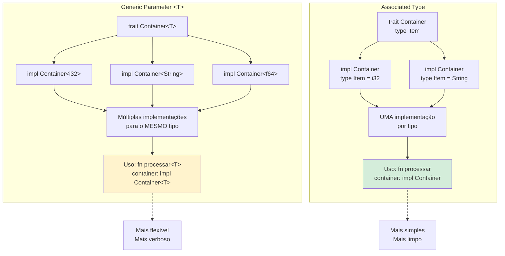
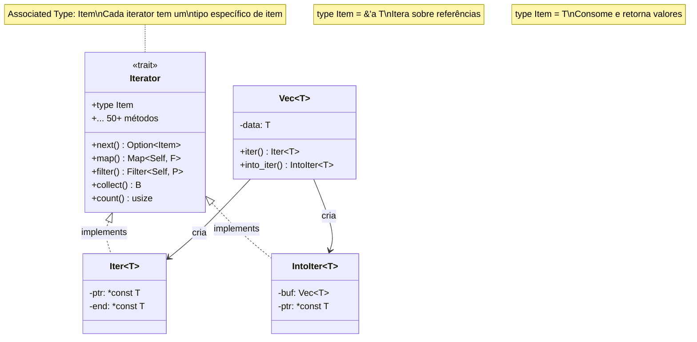
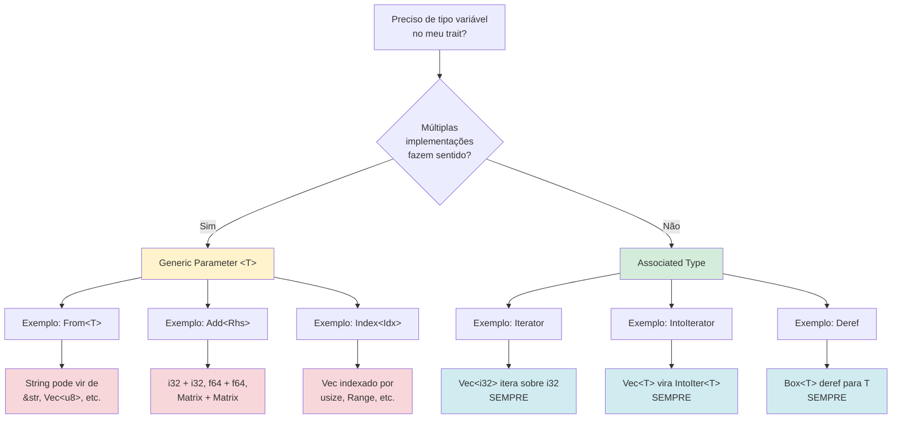
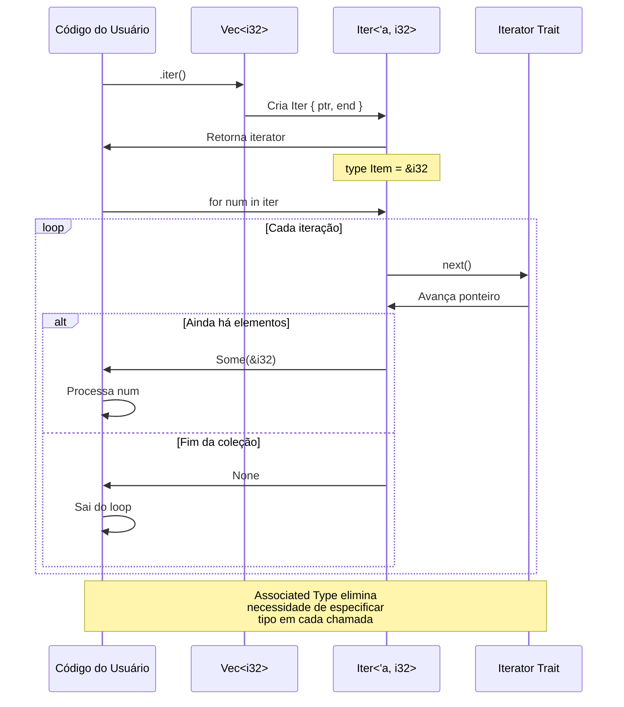
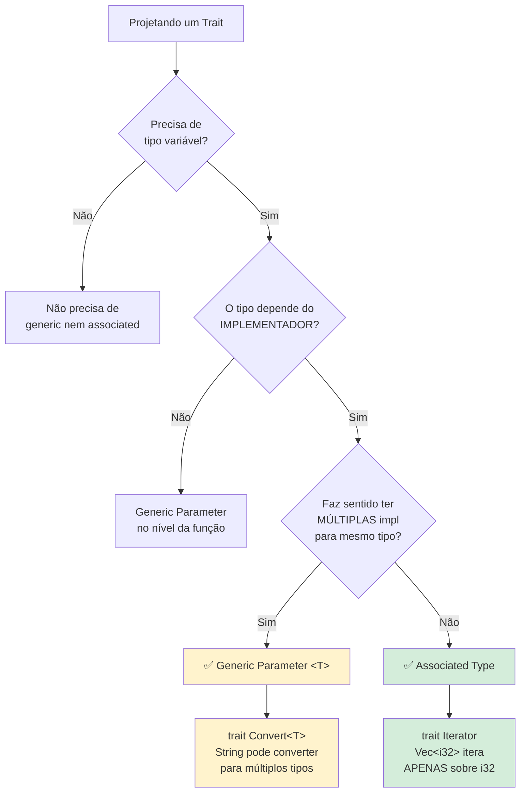

# 🦀 Dia 31: Associated Types - Especialização Contextual

## 📋 OBJETIVOS DE APRENDIZAGEM

Ao final desta lição, você será capaz de:

✅ **Compreender associated types** e sua sintaxe em traits  
✅ **Implementar o Iterator trait** com associated types  
✅ **Escolher conscientemente** entre associated types e generic parameters  
✅ **Aplicar a regra de ouro** da especialização contextual  
✅ **Criar iterators customizados** para suas estruturas de dados

---

## 🎭 ATIVAÇÃO DO CONHECIMENTO PRÉVIO

### 🔗 Revisão Rápida: Traits e Genéricos (Dia 29 e 30)

**Traits (Dia 29):** Definem comportamentos compartilhados

```rust {.line-numbers}
trait Descritivel {
    fn descrever(&self) -> String;
}
```

**Genéricos (Dia 30):** Código reutilizável com múltiplos tipos

```rust {.line-numbers}
fn processar<T: Display>(valor: T) {
    println!("{}", valor);
}
```

Hoje vamos aprender uma **terceira forma** de trabalhar com tipos em traits: **Associated Types**!

---

### 🍽️ ANALOGIA CENTRAL: O Menu do Restaurante

Imagine dois tipos de restaurantes:

| Tipo de Restaurante | Conceito Rust | Como Funciona |
|---------------------|---------------|---------------|
| **🌮 Restaurante Buffet** | Generic `<T>` | Você escolhe **qualquer combinação** de pratos. Múltiplas escolhas possíveis! |
| **🍱 Restaurante Executivo** | Associated Type | Cada prato principal já vem com **um acompanhamento específico**. Contexto determina o tipo! |

**História:**

> João foi a um restaurante executivo. Ele pediu "Prato 1" e automaticamente recebeu arroz, feijão e salada. Não precisou escolher os acompanhamentos - **o contexto (Prato 1) já determinava tudo**.
>
> Maria foi a um buffet. Ela escolheu frango, mas teve que **especificar** se queria arroz, batata ou macarrão. **Múltiplas combinações** eram possíveis!
>
> **Associated types são como o restaurante executivo:** o tipo implementador determina automaticamente o tipo associado. **Genéricos são como o buffet:** você precisa especificar cada tipo explicitamente.

---

## 📚 APRESENTAÇÃO DO CONTEÚDO

### 🎯 REGRA DE OURO

Antes de mergulhar na sintaxe, entenda esta regra fundamental:

| Situação | Use |
|----------|-----|
| **Uma implementação lógica por tipo** | ✅ Associated Type |
| **Múltiplas implementações fazem sentido** | ✅ Generic Parameter `<T>` |

**Exemplos:**

- `Iterator` → **Associated Type** (cada coleção itera sobre **um tipo específico** de item)
- `From<T>` → **Generic Parameter** (um tipo pode ser convertido **de múltiplos tipos**)

---

### 1️⃣ Sintaxe: `trait Nome { type Item; }`

**Definição de trait com associated type:**

```rust {.line-numbers}
trait Container {
    type Item;  // Associated type (tipo associado)
    
    fn add(&mut self, item: Self::Item);
    fn get(&self, index: usize) -> Option<&Self::Item>;
}
```

**Pontos-chave:**

- `type Item;` declara um **tipo associado** chamado `Item`
- `Self::Item` referencia o tipo associado
- Quem implementa o trait **define** qual é o tipo concreto

---

### 2️⃣ Implementação: `type Item = ConcreteType;`

**Implementando o trait:**

```rust {.line-numbers}
struct NumeroContainer {
    items: Vec<i32>,
}

impl Container for NumeroContainer {
    type Item = i32;  // Define o tipo associado como i32
    
    fn add(&mut self, item: Self::Item) {
        self.items.push(item);
    }
    
    fn get(&self, index: usize) -> Option<&Self::Item> {
        self.items.get(index)
    }
}

struct TextoContainer {
    items: Vec<String>,
}

impl Container for TextoContainer {
    type Item = String;  // Define o tipo associado como String
    
    fn add(&mut self, item: Self::Item) {
        self.items.push(item);
    }
    
    fn get(&self, index: usize) -> Option<&Self::Item> {
        self.items.get(index)
    }
}

fn main() {
    let mut numeros = NumeroContainer { items: Vec::new() };
    numeros.add(10);
    numeros.add(20);
    
    let mut textos = TextoContainer { items: Vec::new() };
    textos.add(String::from("Rust"));
    textos.add(String::from("Associated Types"));
    
    println!("Número: {:?}", numeros.get(0));  // Some(10)
    println!("Texto: {:?}", textos.get(0));    // Some("Rust")
}
```

---

### 3️⃣ Diferença vs Generic `<T>`

Vamos comparar as **duas abordagens** lado a lado:

#### ❌ Versão com Generic Parameter (Verbosa)

```rust {.line-numbers}
trait Container<T> {
    fn add(&mut self, item: T);
    fn get(&self, index: usize) -> Option<&T>;
}

struct NumeroContainer {
    items: Vec<i32>,
}

impl Container<i32> for NumeroContainer {
    fn add(&mut self, item: i32) {
        self.items.push(item);
    }
    
    fn get(&self, index: usize) -> Option<&i32> {
        self.items.get(index)
    }
}

// Problema: você precisa especificar o tipo TODA VEZ que usa!
fn processar_container<T>(container: &impl Container<T>) {
    // ...
}

// Ou pior:
fn processar_container<T, C: Container<T>>(container: &C) {
    // ...
}
```

#### ✅ Versão com Associated Type (Limpa)

```rust {.line-numbers}
trait Container {
    type Item;
    
    fn add(&mut self, item: Self::Item);
    fn get(&self, index: usize) -> Option<&Self::Item>;
}

struct NumeroContainer {
    items: Vec<i32>,
}

impl Container for NumeroContainer {
    type Item = i32;
    
    fn add(&mut self, item: Self::Item) {
        self.items.push(item);
    }
    
    fn get(&self, index: usize) -> Option<&Self::Item> {
        self.items.get(index)
    }
}

// Muito mais limpo!
fn processar_container(container: &impl Container) {
    // O tipo Item é inferido automaticamente!
}
```

**Diferenças principais:**

| Aspecto | Generic `<T>` | Associated Type |
|---------|---------------|-----------------|
| **Declaração** | `trait Nome<T>` | `trait Nome { type Item; }` |
| **Implementação** | `impl Nome<i32> for Struct` | `impl Nome for Struct { type Item = i32; }` |
| **Múltiplas impl** | ✅ Possível (impl para diferentes T) | ❌ Apenas uma impl por tipo |
| **Uso em funções** | Precisa especificar `<T>` | Inferido automaticamente |
| **Legibilidade** | Mais verboso | Mais limpo |
| **Quando usar** | Múltiplas implementações | Uma implementação lógica |

---

### 4️⃣ Iterator Trait - Exemplo Principal

O **Iterator trait** é o exemplo **mais importante** de associated types em Rust!

**Definição simplificada:**

```rust {.line-numbers}
trait Iterator {
    type Item;  // Tipo dos elementos iterados
    
    fn next(&mut self) -> Option<Self::Item>;
    
    // Métodos com implementação padrão:
    // fn map, filter, collect, etc.
}
```

**Por que associated type aqui?**

- Um `Vec<i32>` **sempre** itera sobre `i32`
- Um `Vec<String>` **sempre** itera sobre `String`
- Não faz sentido ter múltiplas implementações de Iterator para o mesmo tipo
- **Contexto determina o tipo:** se você tem `Vec<i32>`, o `Item` é `i32`

**Exemplo real:**

```rust {.line-numbers}
fn main() {
    let numeros = vec![1, 2, 3, 4, 5];
    
    // .iter() retorna um iterator com Item = &i32
    for num in numeros.iter() {
        println!("{}", num);  // num é &i32
    }
    
    // .into_iter() retorna um iterator com Item = i32
    for num in numeros.into_iter() {
        println!("{}", num);  // num é i32 (ownership movido)
    }
}
```

---

### 5️⃣ Associated Constants

Além de tipos, você também pode ter **constantes associadas**:

```rust {.line-numbers}
trait Forma {
    type Coordenada;
    
    const DIMENSOES: u32;  // Constante associada
    
    fn area(&self) -> f64;
}

struct Retangulo {
    largura: f64,
    altura: f64,
}

impl Forma for Retangulo {
    type Coordenada = (f64, f64);
    
    const DIMENSOES: u32 = 2;  // 2D
    
    fn area(&self) -> f64 {
        self.largura * self.altura
    }
}

struct Cubo {
    lado: f64,
}

impl Forma for Cubo {
    type Coordenada = (f64, f64, f64);
    
    const DIMENSOES: u32 = 3;  // 3D
    
    fn area(&self) -> f64 {
        6.0 * self.lado * self.lado
    }
}

fn main() {
    println!("Retângulo tem {} dimensões", Retangulo::DIMENSOES);
    println!("Cubo tem {} dimensões", Cubo::DIMENSOES);
}
```

---

### 6️⃣ Quando Usar Associated Type vs Generic Parameter

**Árvore de decisão:**

```
┌─────────────────────────────────────────────┐
│ Preciso de um tipo variável no meu trait?  │
└──────────────────┬──────────────────────────┘
                   │
                   ▼
        ┌──────────────────────┐
        │ Faz sentido ter      │
        │ MÚLTIPLAS            │
        │ implementações       │
        │ do trait para o      │
        │ mesmo tipo?          │
        └──────┬───────────────┘
               │
       ┌───────┴───────┐
       │               │
      SIM             NÃO
       │               │
       ▼               ▼
┌──────────────┐  ┌────────────────┐
│ Generic      │  │ Associated     │
│ Parameter    │  │ Type           │
│ <T>          │  │ type Item;     │
└──────────────┘  └────────────────┘
```

**Exemplos práticos:**

| Trait | Abordagem | Razão |
|-------|-----------|-------|
| `Iterator` | Associated Type | Cada coleção itera sobre **um tipo específico** |
| `From<T>` | Generic `<T>` | Um tipo pode ser convertido **de múltiplos tipos** |
| `Add<Rhs>` | Generic `<Rhs>` | Você pode somar tipos diferentes (i32 + i32, f64 + f64, etc.) |
| `IntoIterator` | Associated Type | Cada tipo se transforma em **um iterator específico** |
| `Index<Idx>` | Generic `<Idx>` | Você pode indexar com diferentes tipos (usize, Range, etc.) |

**Exemplo: `From<T>` precisa ser genérico**

```rust {.line-numbers}
struct Ponto {
    x: i32,
    y: i32,
}

// Múltiplas implementações para o mesmo tipo!
impl From<(i32, i32)> for Ponto {
    fn from(tupla: (i32, i32)) -> Self {
        Ponto { x: tupla.0, y: tupla.1 }
    }
}

impl From<[i32; 2]> for Ponto {
    fn from(array: [i32; 2]) -> Self {
        Ponto { x: array[0], y: array[1] }
    }
}

fn main() {
    let p1 = Ponto::from((10, 20));
    let p2 = Ponto::from([30, 40]);
    
    println!("p1: ({}, {})", p1.x, p1.y);
    println!("p2: ({}, {})", p2.x, p2.y);
}
```

---

## 🎨 DIAGRAMAS VISUAIS

### Diagrama 1: Comparação - Generic vs Associated Type



---

### Diagrama 2: Iterator Trait - Anatomia



---

### Diagrama 3: Fluxograma - Quando Usar Cada Um



---

### Diagrama 4: Sequência - Iterator em Ação



---

### Diagrama 5: Árvore de Decisão - Escolher Abordagem



---

## 📊 VISUALIZAÇÕES E COMPARAÇÕES

### Tabela Comparativa Detalhada

| Característica | Generic Parameter `<T>` | Associated Type |
|----------------|-------------------------|-----------------|
| **Sintaxe trait** | `trait Nome<T> { ... }` | `trait Nome { type Item; ... }` |
| **Sintaxe impl** | `impl Nome<i32> for Struct` | `impl Nome for Struct { type Item = i32; }` |
| **Múltiplas impl** | ✅ Sim (diferentes T) | ❌ Não (apenas uma) |
| **Uso em funções** | `fn f<T>(x: impl Nome<T>)` | `fn f(x: impl Nome)` |
| **Legibilidade** | 🟡 Média (mais verboso) | 🟢 Alta (mais limpo) |
| **Flexibilidade** | 🟢 Alta | 🟡 Média |
| **Inferência** | 🟡 Precisa especificar | 🟢 Automática |
| **Exemplo clássico** | `From<T>`, `Add<Rhs>` | `Iterator`, `IntoIterator` |
| **Quando usar** | Múltiplas conversões | Uma relação lógica |

---

### Exemplos Lado a Lado

#### Exemplo 1: Conversão (Generic é melhor)

```rust {.line-numbers}
// ✅ CORRETO: Generic Parameter
trait Converter<T> {
    fn converter(&self) -> T;
}

struct Numero(i32);

impl Converter<String> for Numero {
    fn converter(&self) -> String {
        self.0.to_string()
    }
}

impl Converter<f64> for Numero {
    fn converter(&self) -> f64 {
        self.0 as f64
    }
}

// Múltiplas implementações! ✅
```

```rust {.line-numbers}
// ❌ ERRADO: Associated Type
trait Converter {
    type Saida;
    fn converter(&self) -> Self::Saida;
}

struct Numero(i32);

impl Converter for Numero {
    type Saida = String;  // Só pode escolher UM tipo! ❌
    fn converter(&self) -> Self::Saida {
        self.0.to_string()
    }
}

// Não posso ter outra impl para f64! ❌
```

---

#### Exemplo 2: Iterator (Associated Type é melhor)

```rust {.line-numbers}
// ✅ CORRETO: Associated Type
trait Iterator {
    type Item;
    fn next(&mut self) -> Option<Self::Item>;
}

struct Contador {
    atual: u32,
    max: u32,
}

impl Iterator for Contador {
    type Item = u32;  // Contexto determina: sempre u32
    
    fn next(&mut self) -> Option<Self::Item> {
        if self.atual < self.max {
            self.atual += 1;
            Some(self.atual)
        } else {
            None
        }
    }
}

// Uso limpo:
fn processar(iter: impl Iterator) {  // Tipo inferido! ✅
    // ...
}
```

```rust {.line-numbers}
// ❌ VERBOSO: Generic Parameter
trait Iterator<T> {
    fn next(&mut self) -> Option<T>;
}

struct Contador {
    atual: u32,
    max: u32,
}

impl Iterator<u32> for Contador {
    fn next(&mut self) -> Option<u32> {
        if self.atual < self.max {
            self.atual += 1;
            Some(self.atual)
        } else {
            None
        }
    }
}

// Uso verboso:
fn processar<T>(iter: impl Iterator<T>) {  // Precisa especificar T! ❌
    // ...
}
```

---

### Iterator Trait - Anatomia Completa

```rust {.line-numbers}
// Definição simplificada do Iterator trait
pub trait Iterator {
    // Associated type: tipo dos elementos
    type Item;
    
    // Método obrigatório
    fn next(&mut self) -> Option<Self::Item>;
    
    // Métodos com implementação padrão (alguns exemplos):
    
    fn map<B, F>(self, f: F) -> Map<Self, F>
    where
        F: FnMut(Self::Item) -> B,
    { /* ... */ }
    
    fn filter<P>(self, predicate: P) -> Filter<Self, P>
    where
        P: FnMut(&Self::Item) -> bool,
    { /* ... */ }
    
    fn collect<B: FromIterator<Self::Item>>(self) -> B
    { /* ... */ }
    
    fn count(self) -> usize
    { /* ... */ }
    
    fn sum<S>(self) -> S
    where
        S: Sum<Self::Item>,
    { /* ... */ }
    
    // ... mais de 50 métodos!
}
```

**Componentes:**

1. **`type Item`** - O tipo associado (elementos do iterator)
2. **`next()`** - Método obrigatório (retorna próximo elemento)
3. **Adaptadores** - Métodos que transformam iterators (`map`, `filter`)
4. **Consumidores** - Métodos que consomem iterators (`collect`, `sum`)

---

## 💡 DEMONSTRAÇÃO E MODELAGEM

### Iterator Trait Explicado

Vamos entender **por que** Iterator usa associated type:

```rust {.line-numbers}
// Um Vec<i32> SEMPRE itera sobre i32
let numeros: Vec<i32> = vec![1, 2, 3];

// O tipo do iterator é determinado pelo tipo do Vec
for num in numeros.iter() {
    // num é &i32 - não há ambiguidade!
}

// Não faz sentido ter múltiplas implementações:
// - Vec<i32> iterando sobre i32 ✅
// - Vec<i32> iterando sobre String ❌ (não faz sentido!)
```

**Conclusão:** Como há **apenas uma forma lógica** de iterar sobre um tipo, usamos **associated type**.

---

### Implementação Customizada

Vamos criar um iterator simples que conta de 0 até N:

```rust {.line-numbers}
struct Contador {
    atual: u32,
    max: u32,
}

impl Contador {
    fn new(max: u32) -> Self {
        Contador { atual: 0, max }
    }
}

// Implementar Iterator trait
impl Iterator for Contador {
    type Item = u32;  // Vamos iterar sobre u32
    
    fn next(&mut self) -> Option<Self::Item> {
        if self.atual < self.max {
            self.atual += 1;
            Some(self.atual)
        } else {
            None
        }
    }
}

fn main() {
    let contador = Contador::new(5);
    
    // Usar em for loop
    for num in contador {
        println!("{}", num);  // 1, 2, 3, 4, 5
    }
    
    // Usar com adaptadores
    let contador2 = Contador::new(10);
    let pares: Vec<u32> = contador2
        .filter(|x| x % 2 == 0)
        .collect();
    
    println!("Pares: {:?}", pares);  // [2, 4, 6, 8, 10]
}
```

---

### Por Que Associated Type Aqui?

Vamos comparar as duas abordagens:

#### ❌ Se usássemos Generic Parameter:

```rust {.line-numbers}
trait Iterator<T> {
    fn next(&mut self) -> Option<T>;
}

// Problema 1: Implementação verbosa
impl Iterator<u32> for Contador {
    fn next(&mut self) -> Option<u32> { /* ... */ }
}

// Problema 2: Uso verboso
fn processar<T>(mut iter: impl Iterator<T>) {
    while let Some(item) = iter.next() {
        // ...
    }
}

// Problema 3: Ambiguidade
let contador = Contador::new(5);
processar::<u32>(contador);  // Precisa especificar! ❌
```

#### ✅ Com Associated Type:

```rust {.line-numbers}
trait Iterator {
    type Item;
    fn next(&mut self) -> Option<Self::Item>;
}

// Implementação limpa
impl Iterator for Contador {
    type Item = u32;
    fn next(&mut self) -> Option<Self::Item> { /* ... */ }
}

// Uso limpo
fn processar(mut iter: impl Iterator) {
    while let Some(item) = iter.next() {
        // Tipo inferido automaticamente! ✅
    }
}

// Sem ambiguidade
let contador = Contador::new(5);
processar(contador);  // Tipo inferido! ✅
```

---

### Comparação com Versão Genérica (Problemas)

**Problema 1: Verbosidade**

```rust {.line-numbers}
// Generic: precisa especificar T em TODOS os lugares
fn somar_iterator<T, I>(iter: I) -> T
where
    I: Iterator<T>,
    T: std::ops::Add<Output = T> + Default,
{
    iter.fold(T::default(), |acc, x| acc + x)
}

// Associated Type: mais limpo
fn somar_iterator<I>(iter: I) -> I::Item
where
    I: Iterator,
    I::Item: std::ops::Add<Output = I::Item> + Default,
{
    iter.fold(I::Item::default(), |acc, x| acc + x)
}
```

**Problema 2: Múltiplas Implementações Desnecessárias**

```rust {.line-numbers}
// Com generic, tecnicamente você poderia fazer:
impl Iterator<u32> for Contador { /* ... */ }
impl Iterator<String> for Contador { /* ... */ }  // ❌ Não faz sentido!

// Associated type PREVINE isso:
impl Iterator for Contador {
    type Item = u32;  // Apenas UMA escolha
}
```

---

## 🎯 PRÁTICA GUIADA

### 📐 Exercício Completo: Iterator Customizado - Fibonacci

**Contexto:** A sequência de Fibonacci é uma série matemática onde cada número é a soma dos dois anteriores: 0, 1, 1, 2, 3, 5, 8, 13, 21, ...

**Objetivo:** Criar um iterator que gera números de Fibonacci infinitamente.

---

#### Passo 1: Estrutura Básica

```rust {.line-numbers}
struct FibonacciIterator {
    atual: u64,
    proximo: u64,
}

impl FibonacciIterator {
    fn new() -> Self {
        FibonacciIterator {
            atual: 0,
            proximo: 1,
        }
    }
}

fn main() {
    let fib = FibonacciIterator::new();
    println!("Fibonacci criado!");
}
```

---

#### Passo 2: Implementar Iterator Trait

```rust {.line-numbers}
struct FibonacciIterator {
    atual: u64,
    proximo: u64,
}

impl FibonacciIterator {
    fn new() -> Self {
        FibonacciIterator {
            atual: 0,
            proximo: 1,
        }
    }
}

impl Iterator for FibonacciIterator {
    type Item = u64;  // Associated type: vamos retornar u64
    
    fn next(&mut self) -> Option<Self::Item> {
        let resultado = self.atual;
        
        // Calcular próximo número
        let novo_proximo = self.atual + self.proximo;
        
        // Atualizar estado
        self.atual = self.proximo;
        self.proximo = novo_proximo;
        
        Some(resultado)
    }
}

fn main() {
    let fib = FibonacciIterator::new();
    
    // Pegar os primeiros 10 números
    for (i, num) in fib.take(10).enumerate() {
        println!("Fib[{}] = {}", i, num);
    }
}
```

**Saída:**

```
Fib[0] = 0
Fib[1] = 1
Fib[2] = 1
Fib[3] = 2
Fib[4] = 3
Fib[5] = 5
Fib[6] = 8
Fib[7] = 13
Fib[8] = 21
Fib[9] = 34
```

---

#### Passo 3: Usar em For Loop

```rust {.line-numbers}
fn main() {
    println!("=== Primeiros 15 números de Fibonacci ===");
    
    let fib = FibonacciIterator::new();
    
    for num in fib.take(15) {
        println!("{}", num);
    }
}
```

---

#### Passo 4: Combinação com Adaptadores

```rust {.line-numbers}
fn main() {
    println!("=== Fibonacci com Adaptadores ===\n");
    
    // Números pares de Fibonacci
    println!("Números PARES:");
    let fib_pares: Vec<u64> = FibonacciIterator::new()
        .take(20)
        .filter(|x| x % 2 == 0)
        .collect();
    println!("{:?}\n", fib_pares);
    
    // Números maiores que 100
    println!("Números > 100:");
    let fib_grandes: Vec<u64> = FibonacciIterator::new()
        .skip_while(|x| *x <= 100)
        .take(5)
        .collect();
    println!("{:?}\n", fib_grandes);
    
    // Soma dos primeiros 10
    println!("Soma dos primeiros 10:");
    let soma: u64 = FibonacciIterator::new()
        .take(10)
        .sum();
    println!("{}\n", soma);
    
    // Dobrar cada número
    println!("Primeiros 8 dobrados:");
    let dobrados: Vec<u64> = FibonacciIterator::new()
        .take(8)
        .map(|x| x * 2)
        .collect();
    println!("{:?}", dobrados);
}
```

**Saída:**

```
=== Fibonacci com Adaptadores ===

Números PARES:
[0, 2, 8, 34, 144, 610, 2584, 10946]

Números > 100:
[144, 233, 377, 610, 987]

Soma dos primeiros 10:
88

Primeiros 8 dobrados:
[0, 2, 2, 4, 6, 10, 16, 26]
```

---

#### ✅ Solução Completa com Testes

```rust {.line-numbers}
/// Iterator que gera a sequência de Fibonacci
struct FibonacciIterator {
    atual: u64,
    proximo: u64,
}

impl FibonacciIterator {
    /// Cria um novo iterator de Fibonacci começando em 0, 1
    fn new() -> Self {
        FibonacciIterator {
            atual: 0,
            proximo: 1,
        }
    }
}

impl Iterator for FibonacciIterator {
    type Item = u64;
    
    fn next(&mut self) -> Option<Self::Item> {
        let resultado = self.atual;
        
        // Calcular próximo número de Fibonacci
        let novo_proximo = self.atual.saturating_add(self.proximo);
        
        // Atualizar estado
        self.atual = self.proximo;
        self.proximo = novo_proximo;
        
        Some(resultado)
    }
}

fn main() {
    println!("🧪 TESTE 1: Primeiros 10 números");
    let primeiros_10: Vec<u64> = FibonacciIterator::new()
        .take(10)
        .collect();
    assert_eq!(primeiros_10, vec![0, 1, 1, 2, 3, 5, 8, 13, 21, 34]);
    println!("{:?} ✅\n", primeiros_10);
    
    println!("🧪 TESTE 2: Números pares");
    let pares: Vec<u64> = FibonacciIterator::new()
        .take(15)
        .filter(|x| x % 2 == 0)
        .collect();
    assert_eq!(pares, vec![0, 2, 8, 34, 144]);
    println!("{:?} ✅\n", pares);
    
    println!("🧪 TESTE 3: Soma dos primeiros 10");
    let soma: u64 = FibonacciIterator::new()
        .take(10)
        .sum();
    assert_eq!(soma, 88);
    println!("Soma = {} ✅\n", soma);
    
    println!("🧪 TESTE 4: Números maiores que 50");
    let maiores: Vec<u64> = FibonacciIterator::new()
        .skip_while(|x| *x <= 50)
        .take(5)
        .collect();
    assert_eq!(maiores, vec![55, 89, 144, 233, 377]);
    println!("{:?} ✅\n", maiores);
    
    println!("🧪 TESTE 5: Map (dobrar valores)");
    let dobrados: Vec<u64> = FibonacciIterator::new()
        .take(6)
        .map(|x| x * 2)
        .collect();
    assert_eq!(dobrados, vec![0, 2, 2, 4, 6, 10]);
    println!("{:?} ✅\n", dobrados);
    
    println!("🧪 TESTE 6: Enumerate");
    println!("Índice | Fibonacci");
    println!("-------|----------");
    for (i, fib) in FibonacciIterator::new().take(8).enumerate() {
        println!("  {:2}   |   {:3}", i, fib);
    }
    println!("✅\n");
    
    println!("🧪 TESTE 7: Find (primeiro > 100)");
    let primeiro_maior = FibonacciIterator::new()
        .find(|x| *x > 100);
    assert_eq!(primeiro_maior, Some(144));
    println!("Primeiro > 100: {:?} ✅\n", primeiro_maior);
    
    println!("🧪 TESTE 8: Zip com range");
    let com_indices: Vec<(usize, u64)> = (0..5)
        .zip(FibonacciIterator::new())
        .collect();
    assert_eq!(com_indices, vec![(0, 0), (1, 1), (2, 1), (3, 2), (4, 3)]);
    println!("{:?} ✅\n", com_indices);
    
    println!("✅ Todos os testes passaram!");
}
```

---

### 🎨 Variação: Fibonacci com Limite

Vamos criar uma versão que para quando atinge um limite:

```rust {.line-numbers}
struct FibonacciLimitado {
    atual: u64,
    proximo: u64,
    limite: u64,
}

impl FibonacciLimitado {
    fn new(limite: u64) -> Self {
        FibonacciLimitado {
            atual: 0,
            proximo: 1,
            limite,
        }
    }
}

impl Iterator for FibonacciLimitado {
    type Item = u64;
    
    fn next(&mut self) -> Option<Self::Item> {
        if self.atual > self.limite {
            return None;  // Para quando ultrapassa o limite
        }
        
        let resultado = self.atual;
        
        let novo_proximo = self.atual.saturating_add(self.proximo);
        self.atual = self.proximo;
        self.proximo = novo_proximo;
        
        Some(resultado)
    }
}

fn main() {
    println!("Fibonacci até 100:");
    let fib_100: Vec<u64> = FibonacciLimitado::new(100).collect();
    println!("{:?}", fib_100);
    // [0, 1, 1, 2, 3, 5, 8, 13, 21, 34, 55, 89]
}
```

---

## 🔄 FEEDBACK E AVALIAÇÃO

### ✅ Checklist de Conceitos

Marque os conceitos que você domina:

- [ ] Entendo a sintaxe `type Item;` em traits
- [ ] Sei implementar associated types com `type Item = ConcreteType;`
- [ ] Compreendo a diferença entre associated type e generic parameter
- [ ] Sei quando usar cada abordagem (regra de ouro)
- [ ] Consigo implementar o Iterator trait
- [ ] Entendo por que Iterator usa associated type
- [ ] Sei usar associated constants
- [ ] Consigo criar iterators customizados
- [ ] Entendo como adaptadores funcionam com iterators
- [ ] Sei combinar múltiplos adaptadores

---

### 🧠 Quiz sobre Escolha

**1. Quando você deve usar associated type em vez de generic parameter?**

a) Sempre que possível  
b) Quando múltiplas implementações fazem sentido  
c) Quando há apenas uma implementação lógica por tipo  
d) Nunca, genéricos são sempre melhores  

<details>
<summary>Resposta</summary>
<b>c)</b> Use associated type quando há apenas uma implementação lógica por tipo. Exemplo: Vec&lt;i32&gt; sempre itera sobre i32.
</details>

---

**2. Por que o Iterator trait usa associated type em vez de generic parameter?**

a) Por questões de performance  
b) Porque cada coleção itera sobre um tipo específico de elemento  
c) Para economizar memória  
d) Por convenção histórica  

<details>
<summary>Resposta</summary>
<b>b)</b> Cada coleção tem um tipo específico de elemento que itera. Vec&lt;i32&gt; sempre itera sobre i32, não faz sentido ter múltiplas implementações.
</details>

---

**3. Qual trait DEVE usar generic parameter?**

a) `Iterator`  
b) `From<T>`  
c) `IntoIterator`  
d) `Deref`  

<details>
<summary>Resposta</summary>
<b>b)</b> From&lt;T&gt; precisa ser genérico porque um tipo pode ser convertido DE múltiplos tipos diferentes. Exemplo: String pode vir de &str, Vec&lt;u8&gt;, etc.
</details>

---

**4. O que acontece se você tentar implementar o mesmo trait com associated type duas vezes para o mesmo tipo?**

a) O compilador escolhe a primeira implementação  
b) O compilador gera um erro  
c) Ambas as implementações coexistem  
d) A segunda sobrescreve a primeira  

<details>
<summary>Resposta</summary>
<b>b)</b> O compilador gera um erro porque só pode haver uma implementação de um trait com associated type por tipo.
</details>

---

### 🔄 Exercícios de Implementação

**Exercício 1:** Implemente um iterator que conta regressivamente de N até 0.

<details>
<summary>Solução</summary>

```rust {.line-numbers}
struct ContadorRegressivo {
    atual: u32,
}

impl ContadorRegressivo {
    fn new(inicio: u32) -> Self {
        ContadorRegressivo { atual: inicio }
    }
}

impl Iterator for ContadorRegressivo {
    type Item = u32;
    
    fn next(&mut self) -> Option<Self::Item> {
        if self.atual > 0 {
            let resultado = self.atual;
            self.atual -= 1;
            Some(resultado)
        } else {
            None
        }
    }
}

fn main() {
    let contador = ContadorRegressivo::new(5);
    
    for num in contador {
        println!("{}", num);  // 5, 4, 3, 2, 1
    }
}
```

</details>

---

**Exercício 2:** Crie um iterator que retorna apenas números pares de 0 até N.

<details>
<summary>Solução</summary>

```rust {.line-numbers}
struct IteradorPares {
    atual: u32,
    max: u32,
}

impl IteradorPares {
    fn new(max: u32) -> Self {
        IteradorPares { atual: 0, max }
    }
}

impl Iterator for IteradorPares {
    type Item = u32;
    
    fn next(&mut self) -> Option<Self::Item> {
        if self.atual <= self.max {
            let resultado = self.atual;
            self.atual += 2;  // Pular para o próximo par
            Some(resultado)
        } else {
            None
        }
    }
}

fn main() {
    let pares = IteradorPares::new(10);
    
    for num in pares {
        println!("{}", num);  // 0, 2, 4, 6, 8, 10
    }
    
    // Ou usando collect
    let pares_vec: Vec<u32> = IteradorPares::new(20).collect();
    println!("{:?}", pares_vec);
}
```

</details>

---

### 📝 Auto-Avaliação

**Avalie seu entendimento (1-5):**

| Conceito | 1 (Não entendi) | 2 | 3 | 4 | 5 (Domino) |
|----------|----------------|---|---|---|------------|
| Sintaxe associated type | ☐ | ☐ | ☐ | ☐ | ☐ |
| Diferença vs generic | ☐ | ☐ | ☐ | ☐ | ☐ |
| Regra de ouro | ☐ | ☐ | ☐ | ☐ | ☐ |
| Iterator trait | ☐ | ☐ | ☐ | ☐ | ☐ |
| Implementar iterators | ☐ | ☐ | ☐ | ☐ | ☐ |
| Adaptadores de iterator | ☐ | ☐ | ☐ | ☐ | ☐ |

**Se marcou 1 ou 2 em algum conceito:** Revise a seção correspondente e implemente os exercícios novamente.

---

## 🚀 TRANSFERÊNCIA E APLICAÇÃO

### 🎯 Desafio: Iterator para Estrutura Própria

**Objetivo:** Criar uma estrutura de dados customizada e implementar Iterator para ela.

**Requisitos:**

1. Criar um `struct Playlist` que armazena músicas
2. Cada música tem: título, artista, duração
3. Implementar `Iterator` para iterar sobre as músicas
4. Criar métodos auxiliares: `adicionar_musica()`, `total_duracao()`
5. Usar adaptadores para filtrar músicas por artista
6. Usar adaptadores para encontrar músicas longas (> 4 minutos)

**Código Inicial:**

```rust {.line-numbers}
#[derive(Debug, Clone)]
struct Musica {
    titulo: String,
    artista: String,
    duracao_segundos: u32,
}

struct Playlist {
    musicas: Vec<Musica>,
}

impl Playlist {
    fn new() -> Self {
        // TODO
    }
    
    fn adicionar_musica(&mut self, musica: Musica) {
        // TODO
    }
}

// TODO: Implementar Iterator

fn main() {
    let mut playlist = Playlist::new();
    
    playlist.adicionar_musica(Musica {
        titulo: "Bohemian Rhapsody".to_string(),
        artista: "Queen".to_string(),
        duracao_segundos: 354,
    });
    
    // TODO: adicionar mais músicas e testar
}
```

---

<details>
<summary><b>💡 Solução Completa do Desafio</b></summary>

```rust {.line-numbers}
#[derive(Debug, Clone)]
struct Musica {
    titulo: String,
    artista: String,
    duracao_segundos: u32,
}

impl Musica {
    fn new(titulo: &str, artista: &str, duracao_segundos: u32) -> Self {
        Musica {
            titulo: titulo.to_string(),
            artista: artista.to_string(),
            duracao_segundos,
        }
    }
    
    fn duracao_formatada(&self) -> String {
        let minutos = self.duracao_segundos / 60;
        let segundos = self.duracao_segundos % 60;
        format!("{}:{:02}", minutos, segundos)
    }
}

struct Playlist {
    musicas: Vec<Musica>,
    indice_atual: usize,
}

impl Playlist {
    fn new() -> Self {
        Playlist {
            musicas: Vec::new(),
            indice_atual: 0,
        }
    }
    
    fn adicionar_musica(&mut self, musica: Musica) {
        self.musicas.push(musica);
    }
    
    fn total_duracao(&self) -> u32 {
        self.musicas.iter().map(|m| m.duracao_segundos).sum()
    }
    
    fn total_duracao_formatada(&self) -> String {
        let total = self.total_duracao();
        let minutos = total / 60;
        let segundos = total % 60;
        format!("{}:{:02}", minutos, segundos)
    }
    
    fn len(&self) -> usize {
        self.musicas.len()
    }
}

// Implementar Iterator para Playlist
impl Iterator for Playlist {
    type Item = Musica;
    
    fn next(&mut self) -> Option<Self::Item> {
        if self.indice_atual < self.musicas.len() {
            let musica = self.musicas[self.indice_atual].clone();
            self.indice_atual += 1;
            Some(musica)
        } else {
            None
        }
    }
}

fn main() {
    println!("=== 🎵 Sistema de Playlist ===\n");
    
    let mut playlist = Playlist::new();
    
    // Adicionar músicas
    playlist.adicionar_musica(Musica::new("Bohemian Rhapsody", "Queen", 354));
    playlist.adicionar_musica(Musica::new("Stairway to Heaven", "Led Zeppelin", 482));
    playlist.adicionar_musica(Musica::new("Hotel California", "Eagles", 391));
    playlist.adicionar_musica(Musica::new("Imagine", "John Lennon", 183));
    playlist.adicionar_musica(Musica::new("Another One Bites the Dust", "Queen", 216));
    playlist.adicionar_musica(Musica::new("Smells Like Teen Spirit", "Nirvana", 301));
    
    println!("📊 Estatísticas:");
    println!("Total de músicas: {}", playlist.len());
    println!("Duração total: {}\n", playlist.total_duracao_formatada());
    
    // Teste 1: Iterar sobre todas as músicas
    println!("=== Teste 1: Todas as Músicas ===");
    let mut playlist_clone = Playlist {
        musicas: playlist.musicas.clone(),
        indice_atual: 0,
    };
    
    for musica in playlist_clone {
        println!("🎵 {} - {} [{}]", 
            musica.titulo, 
            musica.artista, 
            musica.duracao_formatada()
        );
    }
    
    // Teste 2: Filtrar por artista
    println!("\n=== Teste 2: Músicas do Queen ===");
    let musicas_queen: Vec<Musica> = playlist.musicas.iter()
        .filter(|m| m.artista == "Queen")
        .cloned()
        .collect();
    
    for musica in &musicas_queen {
        println!("👑 {} [{}]", musica.titulo, musica.duracao_formatada());
    }
    
    // Teste 3: Músicas longas (> 4 minutos = 240 segundos)
    println!("\n=== Teste 3: Músicas Longas (> 4 min) ===");
    let musicas_longas: Vec<Musica> = playlist.musicas.iter()
        .filter(|m| m.duracao_segundos > 240)
        .cloned()
        .collect();
    
    for musica in &musicas_longas {
        println!("⏱️  {} - {} [{}]", 
            musica.titulo,
            musica.artista,
            musica.duracao_formatada()
        );
    }
    
    // Teste 4: Música mais longa
    println!("\n=== Teste 4: Música Mais Longa ===");
    let mais_longa = playlist.musicas.iter()
        .max_by_key(|m| m.duracao_segundos);
    
    if let Some(musica) = mais_longa {
        println!("🏆 {} - {} [{}]",
            musica.titulo,
            musica.artista,
            musica.duracao_formatada()
        );
    }
    
    // Teste 5: Duração média
    println!("\n=== Teste 5: Duração Média ===");
    let duracao_media = playlist.musicas.iter()
        .map(|m| m.duracao_segundos)
        .sum::<u32>() / playlist.musicas.len() as u32;
    
    println!("📊 Duração média: {}:{:02}", duracao_media / 60, duracao_media % 60);
    
    // Teste 6: Títulos em ordem alfabética
    println!("\n=== Teste 6: Títulos Ordenados ===");
    let mut titulos: Vec<String> = playlist.musicas.iter()
        .map(|m| m.titulo.clone())
        .collect();
    titulos.sort();
    
    for (i, titulo) in titulos.iter().enumerate() {
        println!("{}. {}", i + 1, titulo);
    }
    
    println!("\n✅ Todos os testes concluídos!");
}
```

**Saída:**

```
=== 🎵 Sistema de Playlist ===

📊 Estatísticas:
Total de músicas: 6
Duração total: 32:07

=== Teste 1: Todas as Músicas ===
🎵 Bohemian Rhapsody - Queen [5:54]
🎵 Stairway to Heaven - Led Zeppelin [8:02]
🎵 Hotel California - Eagles [6:31]
🎵 Imagine - John Lennon [3:03]
🎵 Another One Bites the Dust - Queen [3:36]
🎵 Smells Like Teen Spirit - Nirvana [5:01]

=== Teste 2: Músicas do Queen ===
👑 Bohemian Rhapsody [5:54]
👑 Another One Bites the Dust [3:36]

=== Teste 3: Músicas Longas (> 4 min) ===
⏱️  Bohemian Rhapsody - Queen [5:54]
⏱️  Stairway to Heaven - Led Zeppelin [8:02]
⏱️  Hotel California - Eagles [6:31]
⏱️  Smells Like Teen Spirit - Nirvana [5:01]

=== Teste 4: Música Mais Longa ===
🏆 Stairway to Heaven - Led Zeppelin [8:02]

=== Teste 5: Duração Média ===
📊 Duração média: 5:21

=== Teste 6: Títulos Ordenados ===
1. Another One Bites the Dust
2. Bohemian Rhapsody
3. Hotel California
4. Imagine
5. Smells Like Teen Spirit
6. Stairway to Heaven

✅ Todos os testes concluídos!
```

</details>

---

### 🔮 Preparação para Trait Objects (Dia 32)

Associated types funcionam perfeitamente com **static dispatch** (monomorphization). Mas e se precisarmos de **dynamic dispatch**?

**Preview:**

```rust {.line-numbers}
// Hoje (Dia 31): Static dispatch
fn processar<T: Iterator>(iter: T) {
    // Tipo conhecido em compile-time
}

// Amanhã (Dia 32): Dynamic dispatch
fn processar(iter: Box<dyn Iterator<Item = i32>>) {
    // Tipo determinado em runtime!
}
```

**Diferença:** Trait objects permitem **polimorfismo em runtime**, mas com um pequeno custo de performance.

---

### 📚 Recursos sobre Iterator

**Documentação oficial:**

1. **std::iter::Iterator** - Documentação completa
2. **Iterator Adaptors** - map, filter, take, skip, etc.
3. **Iterator Consumers** - collect, sum, count, etc.

**Padrões comuns:**

```rust {.line-numbers}
// Transformar coleção
let dobrados: Vec<i32> = vec![1, 2, 3]
    .iter()
    .map(|x| x * 2)
    .collect();

// Filtrar e coletar
let pares: Vec<i32> = vec![1, 2, 3, 4, 5]
    .into_iter()
    .filter(|x| x % 2 == 0)
    .collect();

// Encadear operações
let resultado: i32 = vec![1, 2, 3, 4, 5]
    .iter()
    .filter(|&&x| x > 2)
    .map(|x| x * 2)
    .sum();

// Encontrar elemento
let primeiro_grande = vec![1, 5, 10, 15]
    .iter()
    .find(|&&x| x > 8);
```

---

## 🎓 TÉCNICAS PEDAGÓGICAS APLICADAS

### 🍽️ Reforço da Analogia do Restaurante

**Lembre-se:**

| Restaurante | Programação Rust |
|-------------|------------------|
| 🍱 Prato executivo | Associated Type |
| 🌮 Buffet livre | Generic Parameter `<T>` |
| Prato 1 → acompanhamentos fixos | `Vec<i32>` → itera sobre `i32` |
| Escolher cada item | Especificar cada tipo `<T>` |

**Moral da história:** Use associated types quando o contexto determina o tipo!

---

### 📊 Comparação Sistemática

| Decisão | Generic `<T>` | Associated Type |
|---------|---------------|-----------------|
| **Múltiplas impl?** | ✅ Sim | ❌ Não |
| **Verbosidade** | 🟡 Alta | 🟢 Baixa |
| **Flexibilidade** | 🟢 Alta | 🟡 Média |
| **Inferência** | 🟡 Manual | 🟢 Automática |
| **Exemplo** | `From<T>` | `Iterator` |

---

### 🎯 Decisão Baseada em Regras

**Fluxograma de decisão:**

1. ❓ Preciso de tipo variável?
   - Não → Não precisa de generic nem associated
   - Sim → Continue

2. ❓ Múltiplas implementações fazem sentido?
   - Sim → **Generic Parameter `<T>`**
   - Não → **Associated Type**

3. ✅ Decisão tomada!

---

### 🦀 Idiomas Rust

**Padrões idiomáticos com Iterator:**

```rust {.line-numbers}
// ✅ Idiomático: usar iterator
let soma: i32 = vec![1, 2, 3, 4, 5]
    .iter()
    .sum();

// ❌ Não idiomático: loop manual
let mut soma = 0;
for num in &vec![1, 2, 3, 4, 5] {
    soma += num;
}

// ✅ Idiomático: encadear adaptadores
let resultado: Vec<i32> = numeros
    .iter()
    .filter(|&&x| x > 0)
    .map(|x| x * 2)
    .collect();

// ❌ Não idiomático: múltiplos loops
let mut filtrados = Vec::new();
for num in &numeros {
    if *num > 0 {
        filtrados.push(num);
    }
}
let mut resultado = Vec::new();
for num in &filtrados {
    resultado.push(*num * 2);
}
```

---

## 🎯 RESUMO FINAL

### 🔑 Pontos-Chave

1. **Associated types** simplificam assinaturas de traits
2. **Regra de ouro:** uma implementação lógica → associated type; múltiplas → generic
3. **Iterator** é o exemplo clássico de associated type
4. Associated types tornam o código **mais limpo e legível**
5. `type Item = ConcreteType;` define o tipo associado
6. Associated types funcionam com **static dispatch** (monomorphization)

---

### 📊 Comparação Final

| Aspecto | Antes (Generic) | Depois (Associated) |
|---------|-----------------|---------------------|
| **Assinatura** | `fn f<T>(x: impl Trait<T>)` | `fn f(x: impl Trait)` |
| **Implementação** | `impl Trait<i32>` | `impl Trait { type Item = i32; }` |
| **Legibilidade** | 🟡 Média | 🟢 Alta |
| **Múltiplas impl** | ✅ Possível | ❌ Apenas uma |

---

### 🎓 O Que Você Aprendeu Hoje

✅ Sintaxe de associated types: `type Item;`  
✅ Implementação: `type Item = ConcreteType;`  
✅ Diferença fundamental entre associated type e generic parameter  
✅ Regra de ouro para escolher a abordagem correta  
✅ Iterator trait e sua implementação  
✅ Como criar iterators customizados  
✅ Uso de adaptadores e consumidores de iterators  

---

### 🚀 Próximos Passos

**Dia 32: Trait Objects (Dynamic Dispatch)**
- `dyn Trait` syntax
- Box<dyn Trait>
- Static vs Dynamic dispatch
- Quando usar cada um
- Object safety

**Continue praticando:** Implemente iterators para suas estruturas de dados!

---

## 🎉 PARABÉNS!

Você dominou **Associated Types**, um conceito intermediário fundamental em Rust! 

Agora você entende quando usar **associated types vs generic parameters** e pode criar **iterators customizados** idiomáticos. Você está se tornando um verdadeiro **Rustacean**! 🦀

**Lembre-se:** Associated types são sobre **especialização contextual** - quando o tipo implementador determina naturalmente o tipo associado, use associated types para código mais limpo e elegante!

Continue assim e você será um expert em Rust! 🚀

---

**#RustLang #AssociatedTypes #Iterator #TraitDesign #Dia31**