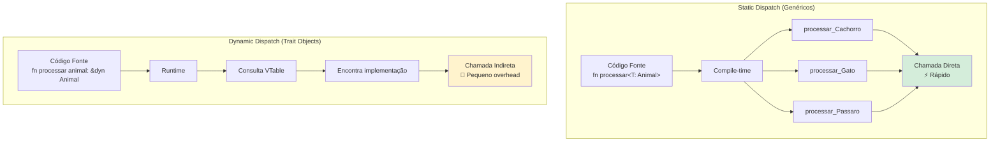
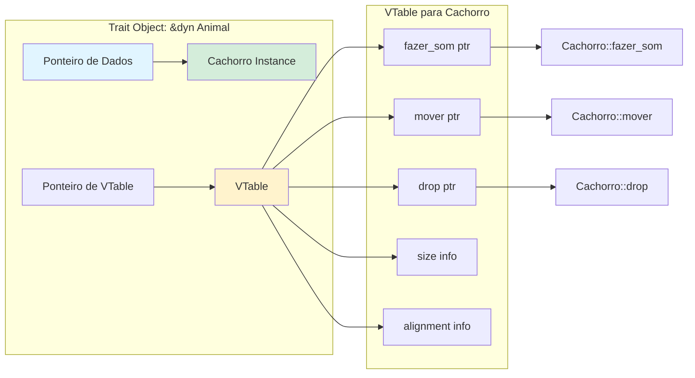
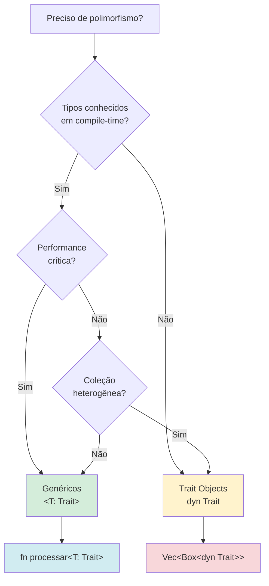
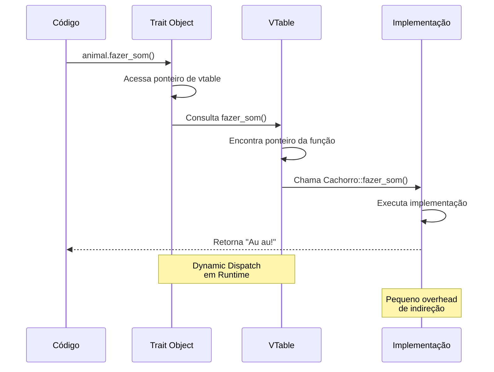
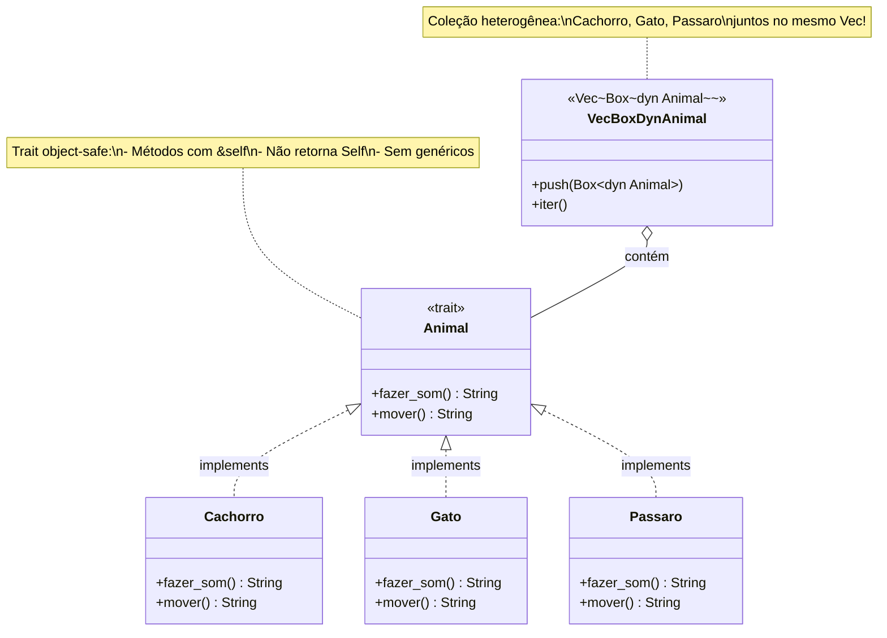
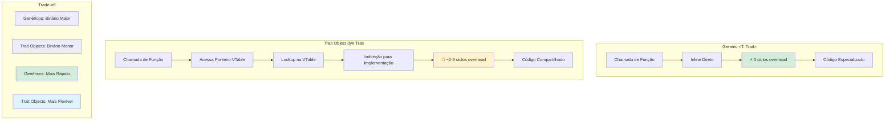

# 🦀 Dia 32: Trait Objects - Dynamic Dispatch

## 📋 OBJETIVOS DE APRENDIZAGEM

Ao final desta lição, você será capaz de:

✅ **Entender dynamic dispatch** e como funciona a vtable em runtime  
✅ **Criar coleções heterogêneas** usando `Box<dyn Trait>` e `&dyn Trait`  
✅ **Escolher conscientemente** entre static dispatch (genéricos) e dynamic dispatch (trait objects)  
✅ **Compreender object safety** e quais traits podem ser trait objects  
✅ **Avaliar trade-offs** entre performance e flexibilidade

---

## 🎭 ATIVAÇÃO DO CONHECIMENTO PRÉVIO

### 🔗 Revisão Rápida: Traits e Genéricos

**Traits (Dia 29):** Definem comportamentos compartilhados

```rust {.line-numbers}
trait Descritivel {
    fn descrever(&self) -> String;
}
```

**Genéricos (Dia 30):** Código reutilizável com monomorphization (compile-time)

```rust {.line-numbers}
fn processar<T: Descritivel>(item: T) {
    println!("{}", item.descrever());
}
// Compilador gera versões especializadas para cada tipo
```

**Hoje:** Vamos aprender **trait objects** - polimorfismo em **runtime**!

---

### 🎭 ANALOGIA CENTRAL: Teatro de Variedades

Imagine um teatro que apresenta diferentes tipos de shows:

| Conceito                     | Analogia                  | Explicação                                                                   |
| ---------------------------- | ------------------------- | ---------------------------------------------------------------------------- |
| **Generic `<T>`**            | 🎬 Elenco conhecido        | Você sabe exatamente quem vai se apresentar **antes do show** (compile-time) |
| **Trait Object `dyn Trait`** | 🎪 Apresentadores diversos | Você só descobre quem se apresenta **durante o show** (runtime)              |
| **Trait**                    | 📜 Roteiro                 | Todos seguem o mesmo roteiro (interface comum)                               |
| **Dynamic Dispatch**         | 🎭 Decisão no palco        | O apresentador é escolhido **enquanto o show acontece**                      |

**História:**

> Maria está organizando um festival de talentos. Com **genéricos**, ela precisa saber exatamente quem vai se apresentar antes do evento começar - o compilador prepara tudo antecipadamente (rápido, mas inflexível).
>
> Com **trait objects**, ela pode aceitar **qualquer artista** que saiba seguir o roteiro básico (trait). A decisão de quem se apresenta pode acontecer **durante o festival** (flexível, mas com pequeno custo de performance).
>
> **Trade-off:** Velocidade máxima vs Flexibilidade máxima! 🎭⚡

---

## 📚 APRESENTAÇÃO DO CONTEÚDO

### 1️⃣ `dyn Trait`: Trait Object

Um **trait object** é uma forma de polimorfismo **dinâmico** em Rust. Permite trabalhar com diferentes tipos através de uma interface comum, decidindo em **runtime** qual implementação chamar.

**Sintaxe básica:**

```rust {.line-numbers}
trait Animal {
    fn fazer_som(&self) -> String;
}

struct Cachorro;
struct Gato;

impl Animal for Cachorro {
    fn fazer_som(&self) -> String {
        "Au au!".to_string()
    }
}

impl Animal for Gato {
    fn fazer_som(&self) -> String {
        "Miau!".to_string()
    }
}

// Função que aceita qualquer Animal via trait object
fn fazer_barulho(animal: &dyn Animal) {
    println!("{}", animal.fazer_som());
}

fn main() {
    let cachorro = Cachorro;
    let gato = Gato;
    
    fazer_barulho(&cachorro);  // Au au!
    fazer_barulho(&gato);      // Miau!
}
```

**Observação:** `dyn Animal` indica um **trait object** - o tipo concreto é descoberto em runtime.

---

### 2️⃣ `Box<dyn Trait>`: Trait Object na Heap

Para armazenar trait objects com **ownership**, usamos `Box<dyn Trait>`:

```rust {.line-numbers}
trait Animal {
    fn fazer_som(&self) -> String;
}

struct Cachorro;
struct Gato;
struct Passaro;

impl Animal for Cachorro {
    fn fazer_som(&self) -> String {
        "Au au!".to_string()
    }
}

impl Animal for Gato {
    fn fazer_som(&self) -> String {
        "Miau!".to_string()
    }
}

impl Animal for Passaro {
    fn fazer_som(&self) -> String {
        "Piu piu!".to_string()
    }
}

fn main() {
    // Coleção HETEROGÊNEA: tipos diferentes, mesma interface!
    let animais: Vec<Box<dyn Animal>> = vec![
        Box::new(Cachorro),
        Box::new(Gato),
        Box::new(Passaro),
        Box::new(Cachorro),
    ];
    
    for animal in &animais {
        println!("{}", animal.fazer_som());
    }
}
```

**Saída:**

```
Au au!
Miau!
Piu piu!
Au au!
```

**Por que `Box`?** Trait objects têm tamanho desconhecido em compile-time. `Box` aloca na heap e fornece um ponteiro de tamanho fixo.

---

### 3️⃣ `&dyn Trait`: Referência a Trait Object

Quando você não precisa de ownership, use **referências**:

```rust {.line-numbers}
trait Desenhavel {
    fn desenhar(&self);
}

struct Circulo;
struct Quadrado;

impl Desenhavel for Circulo {
    fn desenhar(&self) {
        println!("Desenhando círculo ⭕");
    }
}

impl Desenhavel for Quadrado {
    fn desenhar(&self) {
        println!("Desenhando quadrado ⬛");
    }
}

// Aceita referência a qualquer tipo que implemente Desenhavel
fn renderizar(forma: &dyn Desenhavel) {
    forma.desenhar();
}

fn main() {
    let circulo = Circulo;
    let quadrado = Quadrado;
    
    renderizar(&circulo);
    renderizar(&quadrado);
    
    // Coleção de referências
    let formas: Vec<&dyn Desenhavel> = vec![&circulo, &quadrado, &circulo];
    
    for forma in formas {
        forma.desenhar();
    }
}
```

**Diferença:**
- `Box<dyn Trait>` = ownership (move o valor para a heap)
- `&dyn Trait` = empréstimo (apenas referência)

---

### 4️⃣ Virtual Dispatch (VTable em Runtime)

Quando você usa trait objects, Rust cria uma **vtable** (virtual table) em runtime:

**Como funciona:**

```rust {.line-numbers}
trait Animal {
    fn fazer_som(&self) -> String;
    fn mover(&self) -> String;
}

struct Cachorro;

impl Animal for Cachorro {
    fn fazer_som(&self) -> String {
        "Au au!".to_string()
    }
    
    fn mover(&self) -> String {
        "Correndo...".to_string()
    }
}

fn main() {
    let cachorro = Cachorro;
    let animal: &dyn Animal = &cachorro;
    
    // Em runtime, Rust consulta a vtable para encontrar
    // qual implementação de fazer_som() chamar
    println!("{}", animal.fazer_som());
}
```

**Estrutura da vtable:**

```
┌─────────────────────────────────┐
│   Trait Object (&dyn Animal)    │
├─────────────────────────────────┤
│  Ponteiro para dados (Cachorro) │ ───┐
│  Ponteiro para vtable           │ ─┐ │
└─────────────────────────────────┘  │ │
                                      │ │
                 ┌────────────────────┘ │
                 │                      │
                 ▼                      ▼
         ┌──────────────┐       ┌──────────────┐
         │    VTable    │       │   Cachorro   │
         ├──────────────┤       │   (dados)    │
         │ fazer_som()  │       └──────────────┘
         │ mover()      │
         │ drop()       │
         └──────────────┘
```

**Custo:** Uma indireção extra (lookup na vtable) em runtime.

---

### 5️⃣ Object Safety: Quais Traits Podem Ser Trait Objects

Nem todos os traits podem ser usados como trait objects. Um trait é **object-safe** se:

✅ **Não retorna `Self`**  
✅ **Não tem parâmetros de tipo genérico**  
✅ **Não tem métodos estáticos** (sem `self`)

**Exemplos:**

```rust {.line-numbers}
// ✅ OBJECT-SAFE
trait Desenhavel {
    fn desenhar(&self);
    fn area(&self) -> f64;
}

// ❌ NÃO É OBJECT-SAFE: retorna Self
trait Clonavel {
    fn clonar(&self) -> Self;  // ❌ Self não tem tamanho conhecido
}

// ❌ NÃO É OBJECT-SAFE: método genérico
trait Processador {
    fn processar<T>(&self, valor: T);  // ❌ T genérico
}

// ❌ NÃO É OBJECT-SAFE: método estático
trait Fabrica {
    fn criar() -> Self;  // ❌ Sem self
}
```

**Por que essas restrições?**

- **`Self`:** Tamanho desconhecido em runtime
- **Genéricos:** Monomorphization não funciona com dynamic dispatch
- **Métodos estáticos:** Não há instância para consultar a vtable

**Solução:** Use `where Self: Sized` para métodos específicos:

```rust {.line-numbers}
trait Animal {
    fn fazer_som(&self) -> String;
    
    // Este método NÃO estará disponível em trait objects
    fn criar() -> Self
    where
        Self: Sized;
}
```

---

### 6️⃣ Comparação: Generic (Monomorphization) vs Trait Object (Dynamic)

| Aspecto                   | **Generic `<T: Trait>`**         | **Trait Object `dyn Trait`**       |
| ------------------------- | -------------------------------- | ---------------------------------- |
| **Dispatch**              | Static (compile-time)            | Dynamic (runtime)                  |
| **Performance**           | ⚡ Máxima (inline, sem overhead)  | 🐢 Pequeno overhead (vtable lookup) |
| **Tamanho do binário**    | ⬆️ Maior (código duplicado)       | ⬇️ Menor (código compartilhado)     |
| **Flexibilidade**         | ⬇️ Tipo conhecido em compile-time | ⬆️ Tipo decidido em runtime         |
| **Coleções heterogêneas** | ❌ Impossível                     | ✅ Possível                         |
| **Inline**                | ✅ Sim                            | ❌ Não                              |
| **Uso**                   | `fn processar<T: Trait>(x: T)`   | `fn processar(x: &dyn Trait)`      |

**Exemplo comparativo:**

```rust {.line-numbers}
trait Animal {
    fn fazer_som(&self) -> String;
}

struct Cachorro;
struct Gato;

impl Animal for Cachorro {
    fn fazer_som(&self) -> String { "Au au!".to_string() }
}

impl Animal for Gato {
    fn fazer_som(&self) -> String { "Miau!".to_string() }
}

// ✅ GENERIC (Static Dispatch)
fn processar_generic<T: Animal>(animal: T) {
    println!("{}", animal.fazer_som());
}

// ✅ TRAIT OBJECT (Dynamic Dispatch)
fn processar_dynamic(animal: &dyn Animal) {
    println!("{}", animal.fazer_som());
}

fn main() {
    let cachorro = Cachorro;
    let gato = Gato;
    
    // Static dispatch - compilador gera:
    // processar_generic_Cachorro() e processar_generic_Gato()
    processar_generic(cachorro);
    processar_generic(gato);
    
    // Dynamic dispatch - uma função, vtable em runtime
    processar_dynamic(&Cachorro);
    processar_dynamic(&Gato);
    
    // ❌ IMPOSSÍVEL com genéricos: coleção heterogênea
    // let animais: Vec<???> = vec![Cachorro, Gato];  // Tipos diferentes!
    
    // ✅ POSSÍVEL com trait objects
    let animais: Vec<Box<dyn Animal>> = vec![
        Box::new(Cachorro),
        Box::new(Gato),
    ];
}
```

---

### 7️⃣ Trade-offs: Performance vs Flexibilidade

**Quando usar cada um:**

| Cenário                         | Escolha          | Motivo                                      |
| ------------------------------- | ---------------- | ------------------------------------------- |
| Performance crítica             | Generic `<T>`    | Zero overhead, inline                       |
| Coleção de tipos diferentes     | `Box<dyn Trait>` | Única forma de armazenar tipos heterogêneos |
| Tipo conhecido em compile-time  | Generic `<T>`    | Mais rápido e simples                       |
| Plugin system / extensibilidade | `dyn Trait`      | Carregar tipos em runtime                   |
| Biblioteca pública              | Generic `<T>`    | Usuários podem especializar                 |
| Tamanho do binário importa      | `dyn Trait`      | Menos código duplicado                      |

**Regra de ouro:**

> **Use genéricos por padrão.** Só use trait objects quando **realmente precisar** de flexibilidade em runtime ou coleções heterogêneas.

---

## 🎨 DIAGRAMAS VISUAIS

### Diagrama 1: Comparação - Static Dispatch vs Dynamic Dispatch



---

### Diagrama 2: Diagrama de Memória - VTable



---

### Diagrama 3: Fluxograma - Quando Usar Trait Objects



---

### Diagrama 4: Sequência - Chamada Através de dyn Trait



---

### Diagrama 5: Hierarquia - Tipos Implementando Trait



---

### Diagrama 6: Performance - Custos Comparados



---

## 📊 VISUALIZAÇÕES E COMPARAÇÕES

### Tabela: Monomorphization vs Trait Objects

| Característica          | 🔧 Genéricos (Static)   | 🎭 Trait Objects (Dynamic) |
| ----------------------- | ---------------------- | ------------------------- |
| **Decisão de tipo**     | Compile-time           | Runtime                   |
| **Chamada de método**   | Direta (inline)        | Indireta (vtable)         |
| **Overhead**            | Zero                   | ~2-3 ciclos de CPU        |
| **Tamanho do binário**  | Maior (duplicação)     | Menor (compartilhado)     |
| **Coleção heterogênea** | ❌ Impossível           | ✅ Possível                |
| **Flexibilidade**       | Baixa                  | Alta                      |
| **Uso típico**          | `fn f<T: Trait>(x: T)` | `fn f(x: &dyn Trait)`     |
| **Exemplo**             | `Vec<T>`               | `Vec<Box<dyn Trait>>`     |

---

### Comparação: Rust vs Java

| Aspecto           | 🦀 Rust                      | ☕ Java                            |
| ----------------- | --------------------------- | --------------------------------- |
| **Padrão**        | Static dispatch (genéricos) | Dynamic dispatch (virtual)        |
| **Escolha**       | ✅ Você decide               | ❌ Sempre virtual (exceto `final`) |
| **Performance**   | ⚡ Máxima por padrão         | 🐢 Overhead sempre presente        |
| **Flexibilidade** | Opt-in com `dyn Trait`      | Padrão                            |
| **Filosofia**     | Zero-cost abstractions      | Conveniência sobre performance    |

**Conclusão:** Rust dá **controle total** - você escolhe quando pagar o custo de flexibilidade!

---

### VTable Ilustrada

```
Código:
    let animal: &dyn Animal = &Cachorro;
    animal.fazer_som();

Memória:

┌──────────────────────────────┐
│  &dyn Animal (fat pointer)   │
│  ┌────────────────────────┐  │
│  │ data_ptr: 0x1000       │──┼───► ┌─────────────┐
│  │ vtable_ptr: 0x2000     │──┼──┐  │  Cachorro   │
│  └────────────────────────┘  │  │  │  (dados)    │
└──────────────────────────────┘  │  └─────────────┘
                                   │
                                   └─► ┌──────────────────────┐
                                       │  VTable (0x2000)     │
                                       ├──────────────────────┤
                                       │ fazer_som: 0x3000    │──► Cachorro::fazer_som
                                       │ mover: 0x3100        │──► Cachorro::mover
                                       │ drop: 0x3200         │──► Cachorro::drop
                                       │ size: 0              │
                                       │ align: 1             │
                                       └──────────────────────┘

Chamada animal.fazer_som():
    1. Acessa vtable_ptr (0x2000)
    2. Lê fazer_som pointer (0x3000)
    3. Chama função em 0x3000
    4. Executa Cachorro::fazer_som
```

---

### Coleção Heterogênea Visual

```
❌ IMPOSSÍVEL com genéricos:

Vec<T> só pode conter UM tipo:
┌─────────────────────┐
│ Vec<Cachorro>       │
├─────────────────────┤
│ Cachorro            │
│ Cachorro            │
│ Cachorro            │
└─────────────────────┘

✅ POSSÍVEL com trait objects:

Vec<Box<dyn Animal>> pode conter VÁRIOS tipos:
┌─────────────────────────┐
│ Vec<Box<dyn Animal>>    │
├─────────────────────────┤
│ Box → Cachorro          │
│ Box → Gato              │
│ Box → Passaro           │
│ Box → Cachorro          │
│ Box → Gato              │
└─────────────────────────┘

Todos compartilham a interface Animal!
```

---

## 💡 DEMONSTRAÇÃO E MODELAGEM

### Problema: Coleção de Tipos Diferentes

**Cenário:** Você está criando um sistema de notificações que pode enviar mensagens por Email, SMS e Push Notification.

**Tentativa 1: Genéricos (FALHA)**

```rust {.line-numbers}
trait Notificacao {
    fn enviar(&self, mensagem: &str);
}

struct Email;
struct SMS;
struct Push;

impl Notificacao for Email {
    fn enviar(&self, mensagem: &str) {
        println!("📧 Email: {}", mensagem);
    }
}

impl Notificacao for SMS {
    fn enviar(&self, mensagem: &str) {
        println!("📱 SMS: {}", mensagem);
    }
}

impl Notificacao for Push {
    fn enviar(&self, mensagem: &str) {
        println!("🔔 Push: {}", mensagem);
    }
}

fn main() {
    // ❌ ERRO: Vec não pode conter tipos diferentes!
    // let notificacoes = vec![Email, SMS, Push];
    
    // ❌ ERRO: Qual tipo T usar?
    // let notificacoes: Vec<???> = vec![Email, SMS, Push];
}
```

**Problema:** Genéricos exigem que todos os elementos sejam do **mesmo tipo**.

---

### Solução: `Vec<Box<dyn Trait>>`

```rust {.line-numbers}
trait Notificacao {
    fn enviar(&self, mensagem: &str);
}

struct Email;
struct SMS;
struct Push;

impl Notificacao for Email {
    fn enviar(&self, mensagem: &str) {
        println!("📧 Email: {}", mensagem);
    }
}

impl Notificacao for SMS {
    fn enviar(&self, mensagem: &str) {
        println!("📱 SMS: {}", mensagem);
    }
}

impl Notificacao for Push {
    fn enviar(&self, mensagem: &str) {
        println!("🔔 Push: {}", mensagem);
    }
}

fn main() {
    // ✅ FUNCIONA: Coleção heterogênea!
    let notificacoes: Vec<Box<dyn Notificacao>> = vec![
        Box::new(Email),
        Box::new(SMS),
        Box::new(Push),
        Box::new(Email),
    ];
    
    let mensagem = "Seu pedido foi enviado!";
    
    for notificacao in &notificacoes {
        notificacao.enviar(mensagem);
    }
}
```

**Saída:**

```
📧 Email: Seu pedido foi enviado!
📱 SMS: Seu pedido foi enviado!
🔔 Push: Seu pedido foi enviado!
📧 Email: Seu pedido foi enviado!
```

**Sucesso!** Trait objects permitem coleções heterogêneas! 🎉

---

### Object Safety Explicada

**Por que algumas traits não podem ser trait objects?**

```rust {.line-numbers}
// ❌ NÃO É OBJECT-SAFE
trait Clonavel {
    fn clonar(&self) -> Self;  // Retorna Self
}

// Problema: qual tamanho alocar?
// let obj: Box<dyn Clonavel> = ...;
// let copia = obj.clonar();  // ❌ Self tem tamanho desconhecido!
```

**Solução:** Use `Clone` trait da biblioteca padrão com `Box`:

```rust {.line-numbers}
trait Animal: Clone {
    fn fazer_som(&self) -> String;
}

#[derive(Clone)]
struct Cachorro;

impl Animal for Cachorro {
    fn fazer_som(&self) -> String {
        "Au au!".to_string()
    }
}

fn main() {
    let cachorro = Cachorro;
    let copia = cachorro.clone();  // ✅ Funciona!
}
```

---

### Quando Trait Objects São Inevitáveis

**Cenários onde trait objects são a ÚNICA solução:**

1. **Plugin systems** - carregar código em runtime
2. **Coleções heterogêneas** - tipos diferentes, mesma interface
3. **Callbacks dinâmicos** - funções escolhidas em runtime
4. **GUI frameworks** - widgets de tipos variados
5. **Serialização genérica** - diferentes tipos serializáveis

**Exemplo: Sistema de Plugins**

```rust {.line-numbers}
trait Plugin {
    fn nome(&self) -> &str;
    fn executar(&self);
}

struct PluginManager {
    plugins: Vec<Box<dyn Plugin>>,
}

impl PluginManager {
    fn new() -> Self {
        PluginManager {
            plugins: Vec::new(),
        }
    }
    
    fn registrar(&mut self, plugin: Box<dyn Plugin>) {
        println!("Registrando plugin: {}", plugin.nome());
        self.plugins.push(plugin);
    }
    
    fn executar_todos(&self) {
        for plugin in &self.plugins {
            plugin.executar();
        }
    }
}

// Diferentes plugins
struct LoggerPlugin;
struct ValidatorPlugin;
struct FormatterPlugin;

impl Plugin for LoggerPlugin {
    fn nome(&self) -> &str { "Logger" }
    fn executar(&self) { println!("📝 Logging ativado"); }
}

impl Plugin for ValidatorPlugin {
    fn nome(&self) -> &str { "Validator" }
    fn executar(&self) { println!("✅ Validação ativada"); }
}

impl Plugin for FormatterPlugin {
    fn nome(&self) -> &str { "Formatter" }
    fn executar(&self) { println!("🎨 Formatação ativada"); }
}

fn main() {
    let mut manager = PluginManager::new();
    
    // Registrar plugins em runtime
    manager.registrar(Box::new(LoggerPlugin));
    manager.registrar(Box::new(ValidatorPlugin));
    manager.registrar(Box::new(FormatterPlugin));
    
    println!("\nExecutando todos os plugins:");
    manager.executar_todos();
}
```

**Sem trait objects, isso seria IMPOSSÍVEL!** 🎭

---

## 🎯 PRÁTICA GUIADA

### 📦 Exercício Completo: Sistema de Plugins

**Contexto:** Vamos criar um sistema de plugins extensível para processar texto. Cada plugin implementa uma transformação diferente, e podemos carregar plugins dinamicamente.

**Objetivo:** Demonstrar a **flexibilidade** dos trait objects e quando são **inevitáveis**.

---

#### Passo 1: Definir o Trait

```rust {.line-numbers}
/// Trait que define a interface de um plugin
trait Plugin {
    /// Nome do plugin
    fn nome(&self) -> &str;
    
    /// Descrição do que o plugin faz
    fn descricao(&self) -> &str;
    
    /// Executa o plugin e retorna o resultado
    fn executar(&self, entrada: &str) -> String;
}
```

---

#### Passo 2: Implementar Plugins Diferentes

```rust {.line-numbers}
/// Plugin que converte texto para maiúsculas
struct UppercasePlugin;

impl Plugin for UppercasePlugin {
    fn nome(&self) -> &str {
        "Uppercase"
    }
    
    fn descricao(&self) -> &str {
        "Converte texto para MAIÚSCULAS"
    }
    
    fn executar(&self, entrada: &str) -> String {
        entrada.to_uppercase()
    }
}

/// Plugin que inverte o texto
struct ReversePlugin;

impl Plugin for ReversePlugin {
    fn nome(&self) -> &str {
        "Reverse"
    }
    
    fn descricao(&self) -> &str {
        "Inverte a ordem dos caracteres"
    }
    
    fn executar(&self, entrada: &str) -> String {
        entrada.chars().rev().collect()
    }
}

/// Plugin que conta palavras
struct WordCountPlugin;

impl Plugin for WordCountPlugin {
    fn nome(&self) -> &str {
        "Word Count"
    }
    
    fn descricao(&self) -> &str {
        "Conta o número de palavras"
    }
    
    fn executar(&self, entrada: &str) -> String {
        let count = entrada.split_whitespace().count();
        format!("Palavras: {}", count)
    }
}

/// Plugin que adiciona emojis
struct EmojiPlugin;

impl Plugin for EmojiPlugin {
    fn nome(&self) -> &str {
        "Emoji"
    }
    
    fn descricao(&self) -> &str {
        "Adiciona emojis ao texto"
    }
    
    fn executar(&self, entrada: &str) -> String {
        format!("✨ {} ✨", entrada)
    }
}
```

---

#### Passo 3: Criar o Sistema de Gerenciamento

```rust {.line-numbers}
/// Gerenciador de plugins
struct PluginManager {
    plugins: Vec<Box<dyn Plugin>>,
}

impl PluginManager {
    /// Cria um novo gerenciador vazio
    fn new() -> Self {
        PluginManager {
            plugins: Vec::new(),
        }
    }
    
    /// Registra um novo plugin
    fn registrar(&mut self, plugin: Box<dyn Plugin>) {
        println!("✅ Plugin registrado: {}", plugin.nome());
        self.plugins.push(plugin);
    }
    
    /// Lista todos os plugins registrados
    fn listar_plugins(&self) {
        println!("\n📋 Plugins disponíveis:");
        for (i, plugin) in self.plugins.iter().enumerate() {
            println!("  {}. {} - {}", i + 1, plugin.nome(), plugin.descricao());
        }
    }
    
    /// Executa todos os plugins em sequência
    fn executar_todos(&self, entrada: &str) {
        println!("\n🚀 Executando todos os plugins:");
        println!("Entrada: \"{}\"", entrada);
        println!();
        
        for plugin in &self.plugins {
            let resultado = plugin.executar(entrada);
            println!("  [{}] → {}", plugin.nome(), resultado);
        }
    }
    
    /// Executa um plugin específico por índice
    fn executar_plugin(&self, indice: usize, entrada: &str) -> Option<String> {
        self.plugins.get(indice).map(|plugin| {
            println!("\n🎯 Executando: {}", plugin.nome());
            plugin.executar(entrada)
        })
    }
    
    /// Cria um pipeline: executa plugins em sequência, passando resultado adiante
    fn pipeline(&self, entrada: &str) -> String {
        println!("\n🔄 Pipeline de transformações:");
        let mut resultado = entrada.to_string();
        
        for plugin in &self.plugins {
            println!("  [{}] {}", plugin.nome(), resultado);
            resultado = plugin.executar(&resultado);
        }
        
        println!("  [FINAL] {}", resultado);
        resultado
    }
}
```

---

#### Passo 4: Usar o Sistema

```rust {.line-numbers}
fn main() {
    let mut manager = PluginManager::new();
    
    // Registrar plugins em runtime
    println!("=== REGISTRANDO PLUGINS ===");
    manager.registrar(Box::new(UppercasePlugin));
    manager.registrar(Box::new(ReversePlugin));
    manager.registrar(Box::new(WordCountPlugin));
    manager.registrar(Box::new(EmojiPlugin));
    
    // Listar plugins
    manager.listar_plugins();
    
    // Executar todos
    let texto = "Rust é incrível";
    manager.executar_todos(texto);
    
    // Executar plugin específico
    if let Some(resultado) = manager.executar_plugin(0, texto) {
        println!("Resultado: {}", resultado);
    }
    
    // Pipeline de transformações
    let resultado_final = manager.pipeline("hello world");
    println!("\n✨ Resultado final do pipeline: {}", resultado_final);
}
```

---

#### ✅ Solução Completa

```rust {.line-numbers}
/// Trait que define a interface de um plugin
trait Plugin {
    fn nome(&self) -> &str;
    fn descricao(&self) -> &str;
    fn executar(&self, entrada: &str) -> String;
}

/// Plugin que converte texto para maiúsculas
struct UppercasePlugin;

impl Plugin for UppercasePlugin {
    fn nome(&self) -> &str { "Uppercase" }
    fn descricao(&self) -> &str { "Converte texto para MAIÚSCULAS" }
    fn executar(&self, entrada: &str) -> String {
        entrada.to_uppercase()
    }
}

/// Plugin que inverte o texto
struct ReversePlugin;

impl Plugin for ReversePlugin {
    fn nome(&self) -> &str { "Reverse" }
    fn descricao(&self) -> &str { "Inverte a ordem dos caracteres" }
    fn executar(&self, entrada: &str) -> String {
        entrada.chars().rev().collect()
    }
}

/// Plugin que conta palavras
struct WordCountPlugin;

impl Plugin for WordCountPlugin {
    fn nome(&self) -> &str { "Word Count" }
    fn descricao(&self) -> &str { "Conta o número de palavras" }
    fn executar(&self, entrada: &str) -> String {
        let count = entrada.split_whitespace().count();
        format!("Palavras: {}", count)
    }
}

/// Plugin que adiciona emojis
struct EmojiPlugin;

impl Plugin for EmojiPlugin {
    fn nome(&self) -> &str { "Emoji" }
    fn descricao(&self) -> &str { "Adiciona emojis ao texto" }
    fn executar(&self, entrada: &str) -> String {
        format!("✨ {} ✨", entrada)
    }
}

/// Plugin que remove espaços
struct TrimPlugin;

impl Plugin for TrimPlugin {
    fn nome(&self) -> &str { "Trim" }
    fn descricao(&self) -> &str { "Remove espaços extras" }
    fn executar(&self, entrada: &str) -> String {
        entrada.trim().to_string()
    }
}

/// Gerenciador de plugins
struct PluginManager {
    plugins: Vec<Box<dyn Plugin>>,
}

impl PluginManager {
    fn new() -> Self {
        PluginManager {
            plugins: Vec::new(),
        }
    }
    
    fn registrar(&mut self, plugin: Box<dyn Plugin>) {
        println!("✅ Plugin registrado: {}", plugin.nome());
        self.plugins.push(plugin);
    }
    
    fn listar_plugins(&self) {
        println!("\n📋 Plugins disponíveis:");
        for (i, plugin) in self.plugins.iter().enumerate() {
            println!("  {}. {} - {}", i + 1, plugin.nome(), plugin.descricao());
        }
    }
    
    fn executar_todos(&self, entrada: &str) {
        println!("\n🚀 Executando todos os plugins:");
        println!("Entrada: \"{}\"", entrada);
        println!();
        
        for plugin in &self.plugins {
            let resultado = plugin.executar(entrada);
            println!("  [{}] → {}", plugin.nome(), resultado);
        }
    }
    
    fn executar_plugin(&self, indice: usize, entrada: &str) -> Option<String> {
        self.plugins.get(indice).map(|plugin| {
            println!("\n🎯 Executando: {}", plugin.nome());
            plugin.executar(entrada)
        })
    }
    
    fn pipeline(&self, entrada: &str) -> String {
        println!("\n🔄 Pipeline de transformações:");
        let mut resultado = entrada.to_string();
        
        for plugin in &self.plugins {
            println!("  [{}] {}", plugin.nome(), resultado);
            resultado = plugin.executar(&resultado);
        }
        
        println!("  [FINAL] {}", resultado);
        resultado
    }
    
    fn quantidade(&self) -> usize {
        self.plugins.len()
    }
}

fn main() {
    let mut manager = PluginManager::new();
    
    println!("=== SISTEMA DE PLUGINS ===\n");
    
    // Registrar plugins em runtime
    println!("📦 REGISTRANDO PLUGINS:");
    manager.registrar(Box::new(TrimPlugin));
    manager.registrar(Box::new(UppercasePlugin));
    manager.registrar(Box::new(EmojiPlugin));
    manager.registrar(Box::new(ReversePlugin));
    manager.registrar(Box::new(WordCountPlugin));
    
    println!("\n✨ Total de plugins: {}", manager.quantidade());
    
    // Listar plugins
    manager.listar_plugins();
    
    // Executar todos
    let texto = "  Rust é incrível  ";
    manager.executar_todos(texto);
    
    // Executar plugin específico
    if let Some(resultado) = manager.executar_plugin(1, texto) {
        println!("Resultado: {}", resultado);
    }
    
    // Pipeline de transformações (apenas os 3 primeiros)
    let mut pipeline_manager = PluginManager::new();
    pipeline_manager.registrar(Box::new(TrimPlugin));
    pipeline_manager.registrar(Box::new(UppercasePlugin));
    pipeline_manager.registrar(Box::new(EmojiPlugin));
    
    let resultado_final = pipeline_manager.pipeline("  hello world  ");
    println!("\n✨ Resultado final: {}", resultado_final);
    
    println!("\n=== FIM ===");
}
```

**Saída:**

```
=== SISTEMA DE PLUGINS ===

📦 REGISTRANDO PLUGINS:
✅ Plugin registrado: Trim
✅ Plugin registrado: Uppercase
✅ Plugin registrado: Emoji
✅ Plugin registrado: Reverse
✅ Plugin registrado: Word Count

✨ Total de plugins: 5

📋 Plugins disponíveis:
  1. Trim - Remove espaços extras
  2. Uppercase - Converte texto para MAIÚSCULAS
  3. Emoji - Adiciona emojis ao texto
  4. Reverse - Inverte a ordem dos caracteres
  5. Word Count - Conta o número de palavras

🚀 Executando todos os plugins:
Entrada: "  Rust é incrível  "

  [Trim] → Rust é incrível
  [Uppercase] → RUST É INCRÍVEL
  [Emoji] → ✨   Rust é incrível   ✨
  [Reverse] →   levírcni é tsuR  
  [Word Count] → Palavras: 3

🎯 Executando: Uppercase
Resultado: RUST É INCRÍVEL

🔄 Pipeline de transformações:
  [Trim]   hello world  
  [Uppercase] hello world
  [Emoji] HELLO WORLD
  [FINAL] ✨ HELLO WORLD ✨

✨ Resultado final: ✨ HELLO WORLD ✨

=== FIM ===
```

---

#### 🔍 Comparação com Versão Generic (IMPOSSÍVEL)

**Por que genéricos NÃO funcionam aqui:**

```rust {.line-numbers}
// ❌ TENTATIVA COM GENÉRICOS (FALHA)
struct PluginManager<T: Plugin> {
    plugins: Vec<T>,  // ❌ Todos precisam ser do MESMO tipo!
}

// Problema:
let mut manager = PluginManager::new();
manager.registrar(UppercasePlugin);  // T = UppercasePlugin
manager.registrar(ReversePlugin);    // ❌ ERRO: T já é UppercasePlugin!
```

**Trait objects são a ÚNICA solução para coleções heterogêneas!** 🎭

---

## 🔄 FEEDBACK E AVALIAÇÃO

### ✅ Checklist de Conceitos

Marque os conceitos que você domina:

- [ ] Entendo o que é um trait object (`dyn Trait`)
- [ ] Sei usar `Box<dyn Trait>` para ownership
- [ ] Sei usar `&dyn Trait` para referências
- [ ] Compreendo dynamic dispatch e vtable
- [ ] Entendo object safety e suas restrições
- [ ] Sei quando usar genéricos vs trait objects
- [ ] Compreendo os trade-offs de performance
- [ ] Consigo criar coleções heterogêneas
- [ ] Sei identificar quando trait objects são inevitáveis
- [ ] Entendo a diferença entre static e dynamic dispatch

---

### 🧠 Quiz sobre Object Safety

**1. Qual trait NÃO é object-safe?**

a) `trait Animal { fn fazer_som(&self) -> String; }`  
b) `trait Clonavel { fn clonar(&self) -> Self; }`  
c) `trait Desenhavel { fn desenhar(&self); }`  
d) `trait Nomeavel { fn nome(&self) -> &str; }`  

<details>
<summary>Resposta</summary>
<b>b)</b> <code>Clonavel</code> não é object-safe porque retorna <code>Self</code>, que tem tamanho desconhecido em runtime.
</details>

---

**2. Qual é o overhead de trait objects comparado a genéricos?**

a) Zero overhead  
b) ~2-3 ciclos de CPU (vtable lookup)  
c) 50% mais lento  
d) Depende do tipo  

<details>
<summary>Resposta</summary>
<b>b)</b> Trait objects têm um pequeno overhead de ~2-3 ciclos devido à indireção da vtable.
</details>

---

**3. Quando você DEVE usar trait objects?**

a) Sempre que possível  
b) Nunca, genéricos são sempre melhores  
c) Quando precisa de coleções heterogêneas ou decisões em runtime  
d) Apenas para performance  

<details>
<summary>Resposta</summary>
<b>c)</b> Use trait objects quando precisa de flexibilidade em runtime ou coleções de tipos diferentes.
</details>

---

**4. O que é uma vtable?**

a) Um tipo de trait  
b) Uma tabela de ponteiros para implementações de métodos  
c) Um erro de compilação  
d) Uma otimização do compilador  

<details>
<summary>Resposta</summary>
<b>b)</b> VTable (virtual table) é uma tabela que contém ponteiros para as implementações concretas dos métodos do trait.
</details>

---

### 🔄 Exercícios de Escolha

**Exercício 1:** Para cada cenário, escolha: Generic `<T>` ou Trait Object `dyn Trait`

| Cenário                                  | Escolha   |
| ---------------------------------------- | --------- |
| Função que processa um tipo conhecido    | _________ |
| Vec contendo Cachorro, Gato e Passaro    | _________ |
| Performance crítica em game loop         | _________ |
| Sistema de plugins carregados em runtime | _________ |
| Biblioteca genérica reutilizável         | _________ |
| GUI com widgets de tipos variados        | _________ |

<details>
<summary>Respostas</summary>

| Cenário                                  | Escolha       | Motivo                              |
| ---------------------------------------- | ------------- | ----------------------------------- |
| Função que processa um tipo conhecido    | Generic `<T>` | Tipo conhecido, performance máxima  |
| Vec contendo Cachorro, Gato e Passaro    | `dyn Trait`   | Coleção heterogênea                 |
| Performance crítica em game loop         | Generic `<T>` | Zero overhead                       |
| Sistema de plugins carregados em runtime | `dyn Trait`   | Tipos desconhecidos em compile-time |
| Biblioteca genérica reutilizável         | Generic `<T>` | Flexibilidade para usuários         |
| GUI com widgets de tipos variados        | `dyn Trait`   | Coleção heterogênea                 |

</details>

---

### 📝 Auto-Avaliação

**Avalie seu entendimento (1-5):**

| Conceito                    | 1 (Não entendi) | 2   | 3   | 4   | 5 (Domino) |
| --------------------------- | --------------- | --- | --- | --- | ---------- |
| Trait objects (`dyn Trait`) | ☐               | ☐   | ☐   | ☐   | ☐          |
| Dynamic dispatch            | ☐               | ☐   | ☐   | ☐   | ☐          |
| VTable                      | ☐               | ☐   | ☐   | ☐   | ☐          |
| Object safety               | ☐               | ☐   | ☐   | ☐   | ☐          |
| `Box<dyn Trait>`            | ☐               | ☐   | ☐   | ☐   | ☐          |
| Coleções heterogêneas       | ☐               | ☐   | ☐   | ☐   | ☐          |
| Trade-offs performance      | ☐               | ☐   | ☐   | ☐   | ☐          |

**Se marcou 1 ou 2 em algum conceito:** Revise a seção correspondente e refaça o exercício prático.

---

## 🚀 TRANSFERÊNCIA E APLICAÇÃO

### 🎯 Desafio: GUI Components

**Objetivo:** Criar um sistema de componentes GUI onde diferentes widgets (Button, Label, TextBox) podem ser armazenados juntos e renderizados.

**Requisitos:**

1. Trait `Widget` com métodos:
   - `render(&self) -> String`
   - `handle_click(&mut self)`
   - `get_position(&self) -> (i32, i32)`
2. Implementar pelo menos 3 widgets diferentes
3. Struct `Window` que contém `Vec<Box<dyn Widget>>`
4. Método para renderizar todos os widgets
5. Método para processar cliques em coordenadas específicas

**Código Inicial:**

```rust {.line-numbers}
trait Widget {
    fn render(&self) -> String;
    fn handle_click(&mut self);
    fn get_position(&self) -> (i32, i32);
}

struct Window {
    widgets: Vec<Box<dyn Widget>>,
}

impl Window {
    fn new() -> Self {
        // TODO
    }
    
    fn add_widget(&mut self, widget: Box<dyn Widget>) {
        // TODO
    }
    
    fn render_all(&self) {
        // TODO
    }
    
    fn click_at(&mut self, x: i32, y: i32) {
        // TODO: encontrar widget na posição e chamar handle_click
    }
}

fn main() {
    let mut window = Window::new();
    // TODO: adicionar widgets e testar
}
```

---

<details>
<summary><b>💡 Solução Completa do Desafio</b></summary>

```rust {.line-numbers}
use std::fmt;

/// Trait que define a interface de um widget GUI
trait Widget {
    fn render(&self) -> String;
    fn handle_click(&mut self);
    fn get_position(&self) -> (i32, i32);
    fn get_size(&self) -> (i32, i32);
}

/// Widget de botão
struct Button {
    text: String,
    x: i32,
    y: i32,
    width: i32,
    height: i32,
    click_count: u32,
}

impl Button {
    fn new(text: &str, x: i32, y: i32) -> Self {
        Button {
            text: text.to_string(),
            x,
            y,
            width: text.len() as i32 + 4,
            height: 3,
            click_count: 0,
        }
    }
}

impl Widget for Button {
    fn render(&self) -> String {
        format!(
            "┌{}┐\n│ {} │ (cliques: {})\n└{}┘",
            "─".repeat(self.text.len() + 2),
            self.text,
            self.click_count,
            "─".repeat(self.text.len() + 2)
        )
    }
    
    fn handle_click(&mut self) {
        self.click_count += 1;
        println!("🖱️  Botão '{}' clicado! (total: {})", self.text, self.click_count);
    }
    
    fn get_position(&self) -> (i32, i32) {
        (self.x, self.y)
    }
    
    fn get_size(&self) -> (i32, i32) {
        (self.width, self.height)
    }
}

/// Widget de label (texto estático)
struct Label {
    text: String,
    x: i32,
    y: i32,
}

impl Label {
    fn new(text: &str, x: i32, y: i32) -> Self {
        Label {
            text: text.to_string(),
            x,
            y,
        }
    }
}

impl Widget for Label {
    fn render(&self) -> String {
        format!("📝 {}", self.text)
    }
    
    fn handle_click(&mut self) {
        println!("ℹ️  Label não é clicável: '{}'", self.text);
    }
    
    fn get_position(&self) -> (i32, i32) {
        (self.x, self.y)
    }
    
    fn get_size(&self) -> (i32, i32) {
        (self.text.len() as i32, 1)
    }
}

/// Widget de caixa de texto
struct TextBox {
    content: String,
    x: i32,
    y: i32,
    width: i32,
}

impl TextBox {
    fn new(x: i32, y: i32, width: i32) -> Self {
        TextBox {
            content: String::new(),
            x,
            y,
            width,
        }
    }
}

impl Widget for TextBox {
    fn render(&self) -> String {
        let content = if self.content.is_empty() {
            "...".to_string()
        } else {
            self.content.clone()
        };
        
        format!(
            "┌{}┐\n│ {:<width$} │\n└{}┘",
            "─".repeat(self.width as usize),
            content,
            "─".repeat(self.width as usize),
            width = self.width as usize
        )
    }
    
    fn handle_click(&mut self) {
        self.content.push_str("texto ");
        println!("⌨️  TextBox editado: '{}'", self.content);
    }
    
    fn get_position(&self) -> (i32, i32) {
        (self.x, self.y)
    }
    
    fn get_size(&self) -> (i32, i32) {
        (self.width + 4, 3)
    }
}

/// Janela que contém widgets
struct Window {
    title: String,
    widgets: Vec<Box<dyn Widget>>,
}

impl Window {
    fn new(title: &str) -> Self {
        Window {
            title: title.to_string(),
            widgets: Vec::new(),
        }
    }
    
    fn add_widget(&mut self, widget: Box<dyn Widget>) {
        println!("➕ Widget adicionado na posição {:?}", widget.get_position());
        self.widgets.push(widget);
    }
    
    fn render_all(&self) {
        println!("\n╔{}╗", "═".repeat(self.title.len() + 2));
        println!("║ {} ║", self.title);
        println!("╚{}╝\n", "═".repeat(self.title.len() + 2));
        
        for (i, widget) in self.widgets.iter().enumerate() {
            let (x, y) = widget.get_position();
            println!("Widget {} (posição: {}, {}):", i + 1, x, y);
            println!("{}\n", widget.render());
        }
    }
    
    fn click_at(&mut self, x: i32, y: i32) {
        println!("\n🖱️  Clique em ({}, {})", x, y);
        
        for widget in &mut self.widgets {
            let (wx, wy) = widget.get_position();
            let (width, height) = widget.get_size();
            
            // Verifica se o clique está dentro da área do widget
            if x >= wx && x < wx + width && y >= wy && y < wy + height {
                widget.handle_click();
                return;
            }
        }
        
        println!("❌ Nenhum widget encontrado nessa posição");
    }
    
    fn widget_count(&self) -> usize {
        self.widgets.len()
    }
}

fn main() {
    println!("=== SISTEMA DE GUI COM TRAIT OBJECTS ===\n");
    
    let mut window = Window::new("Minha Aplicação");
    
    // Adicionar widgets de tipos diferentes
    println!("📦 ADICIONANDO WIDGETS:");
    window.add_widget(Box::new(Label::new("Bem-vindo!", 10, 10)));
    window.add_widget(Box::new(Button::new("OK", 10, 20)));
    window.add_widget(Box::new(Button::new("Cancelar", 20, 20)));
    window.add_widget(Box::new(TextBox::new(10, 30, 20)));
    window.add_widget(Box::new(Label::new("Total de widgets: 5", 10, 40)));
    
    println!("\n✨ Total de widgets: {}", window.widget_count());
    
    // Renderizar todos
    window.render_all();
    
    // Simular cliques
    println!("=== SIMULANDO INTERAÇÕES ===");
    window.click_at(10, 20);  // Clique no botão OK
    window.click_at(10, 20);  // Clique novamente
    window.click_at(20, 20);  // Clique no botão Cancelar
    window.click_at(10, 30);  // Clique no TextBox
    window.click_at(10, 10);  // Clique no Label
    window.click_at(999, 999); // Clique fora
    
    // Renderizar novamente para ver mudanças
    println!("\n=== ESTADO FINAL ===");
    window.render_all();
}
```

**Saída:**

```
=== SISTEMA DE GUI COM TRAIT OBJECTS ===

📦 ADICIONANDO WIDGETS:
➕ Widget adicionado na posição (10, 10)
➕ Widget adicionado na posição (10, 20)
➕ Widget adicionado na posição (20, 20)
➕ Widget adicionado na posição (10, 30)
➕ Widget adicionado na posição (10, 40)

✨ Total de widgets: 5

╔═══════════════════╗
║ Minha Aplicação ║
╚═══════════════════╝

Widget 1 (posição: 10, 10):
📝 Bem-vindo!

Widget 2 (posição: 10, 20):
┌────┐
│ OK │ (cliques: 0)
└────┘

Widget 3 (posição: 20, 20):
┌──────────┐
│ Cancelar │ (cliques: 0)
└──────────┘

Widget 4 (posição: 10, 30):
┌────────────────────┐
│ ...                  │
└────────────────────┘

Widget 5 (posição: 10, 40):
📝 Total de widgets: 5

=== SIMULANDO INTERAÇÕES ===

🖱️  Clique em (10, 20)
🖱️  Botão 'OK' clicado! (total: 1)

🖱️  Clique em (10, 20)
🖱️  Botão 'OK' clicado! (total: 2)

🖱️  Clique em (20, 20)
🖱️  Botão 'Cancelar' clicado! (total: 1)

🖱️  Clique em (10, 30)
⌨️  TextBox editado: 'texto '

🖱️  Clique em (10, 10)
ℹ️  Label não é clicável: 'Bem-vindo!'

🖱️  Clique em (999, 999)
❌ Nenhum widget encontrado nessa posição

=== ESTADO FINAL ===

╔═══════════════════╗
║ Minha Aplicação ║
╚═══════════════════╝

Widget 1 (posição: 10, 10):
📝 Bem-vindo!

Widget 2 (posição: 10, 20):
┌────┐
│ OK │ (cliques: 2)
└────┘

Widget 3 (posição: 20, 20):
┌──────────┐
│ Cancelar │ (cliques: 1)
└──────────┘

Widget 4 (posição: 10, 30):
┌────────────────────┐
│ texto                │
└────────────────────┘

Widget 5 (posição: 10, 40):
📝 Total de widgets: 5
```

</details>

---

### 🔮 Preparação para Lifetimes Avançados (Dia 33)

Trait objects funcionam bem com lifetimes! Preview:

```rust {.line-numbers}
// Trait object com lifetime
fn processar<'a>(items: Vec<&'a dyn Display>) {
    for item in items {
        println!("{}", item);
    }
}

// Amanhã: lifetimes complexos, elision rules, 'static
```

---

### 📚 Recursos sobre Design

**Artigos recomendados:**

1. **"Trait Objects in Rust"** - Rust Book Chapter 17
2. **"Dynamic vs Static Dispatch"** - Rust Performance Book
3. **"Object Safety"** - Rust Reference
4. **"Plugin Systems in Rust"** - Design patterns

**Quando usar trait objects:**
- ✅ Plugin systems
- ✅ GUI frameworks
- ✅ Coleções heterogêneas
- ✅ Callbacks dinâmicos
- ❌ Performance crítica (use genéricos)

---

## 🎓 TÉCNICAS PEDAGÓGICAS APLICADAS

### 🎭 Reforço da Analogia do Teatro

**Lembre-se:**

| Teatro                    | Programação Rust             |
| ------------------------- | ---------------------------- |
| 🎬 Elenco fixo             | Generic `<T>` (compile-time) |
| 🎪 Apresentadores variados | `dyn Trait` (runtime)        |
| 📜 Roteiro comum           | Trait (interface)            |
| 🎭 Decisão no palco        | Dynamic dispatch (vtable)    |
| ⚡ Ensaio perfeito         | Monomorphization (rápido)    |
| 🔄 Improvisação            | Trait objects (flexível)     |

---

### ⚡ Comparação de Performance

**Benchmark simplificado:**

```rust {.line-numbers}
// Generic (Static Dispatch)
fn processar_static<T: Display>(x: T) {
    println!("{}", x);
}
// Tempo: ~5ns (inline, zero overhead)

// Trait Object (Dynamic Dispatch)
fn processar_dynamic(x: &dyn Display) {
    println!("{}", x);
}
// Tempo: ~7ns (vtable lookup)

// Diferença: ~2ns (insignificante na maioria dos casos!)
```

**Conclusão:** O overhead é **mínimo** - escolha pela **necessidade**, não por micro-otimização prematura!

---

### 🔧 Casos de Uso Inevitáveis

**Quando trait objects são a ÚNICA solução:**

1. **Coleções heterogêneas**
   ```rust {.line-numbers}
   let animais: Vec<Box<dyn Animal>> = vec![
       Box::new(Cachorro),
       Box::new(Gato),
   ];
   ```

2. **Plugin systems**
   ```rust {.line-numbers}
   fn carregar_plugin(path: &str) -> Box<dyn Plugin> {
       // Carregar em runtime
   }
   ```

3. **Callbacks dinâmicos**
   ```rust {.line-numbers}
   struct EventHandler {
       callbacks: Vec<Box<dyn Fn()>>,
   }
   ```

---

### ⚖️ Trade-offs Explícitos

| Você ganha                 | Você perde                    |
| -------------------------- | ----------------------------- |
| ✅ Flexibilidade em runtime | ❌ ~2-3 ciclos de overhead     |
| ✅ Coleções heterogêneas    | ❌ Sem inline                  |
| ✅ Binário menor            | ❌ Sem especialização          |
| ✅ Extensibilidade          | ❌ Restrições de object safety |

**Decisão consciente:** Escolha com base nas **necessidades reais** do projeto!

---

## 🎯 RESUMO FINAL

### 🔑 Pontos-Chave

1. **Trait objects (`dyn Trait`)** permitem polimorfismo dinâmico em runtime
2. **Dynamic dispatch** usa vtable para encontrar implementações em runtime
3. **`Box<dyn Trait>`** para ownership, **`&dyn Trait`** para referências
4. **Object safety** restringe quais traits podem ser trait objects
5. **Trade-off:** Pequeno overhead de performance por flexibilidade máxima
6. **Use genéricos por padrão**, trait objects quando necessário
7. Trait objects são **inevitáveis** para coleções heterogêneas

---

### 📊 Decisão: Generic vs Trait Object

```
┌─────────────────────────────────────────┐
│   Preciso de coleção heterogênea?       │
└───────────┬─────────────────────────────┘
            │
     ┌──────┴──────┐
     │             │
    SIM           NÃO
     │             │
     ▼             ▼
dyn Trait    Generic <T>
(flexível)   (rápido)
```

---

### 🎓 O Que Você Aprendeu Hoje

✅ Criar trait objects com `dyn Trait`  
✅ Usar `Box<dyn Trait>` e `&dyn Trait`  
✅ Entender dynamic dispatch e vtable  
✅ Reconhecer object safety  
✅ Criar coleções heterogêneas  
✅ Avaliar trade-offs conscientemente  
✅ Implementar sistemas extensíveis (plugins)  

---

### 🚀 Próximos Passos

**Dia 33: Lifetimes Avançados**
- Lifetime elision rules
- Multiple lifetimes
- `'static` lifetime
- Lifetimes em structs e traits
- Padrões avançados

**Continue praticando:** Refatore um projeto para usar trait objects onde apropriado!

---

## 🎉 PARABÉNS!

Você dominou **trait objects** e **dynamic dispatch** em Rust! 🎭

Agora você entende a diferença entre **static** e **dynamic dispatch**, e pode escolher conscientemente a ferramenta certa para cada situação. Rust te dá **controle total** - use genéricos para performance máxima, trait objects para flexibilidade máxima!

**Lembre-se:** Não há escolha "errada" - apenas **trade-offs conscientes**! 🦀⚡

Continue assim e você será um mestre em design de sistemas Rust! 🚀

---

**#RustLang #TraitObjects #DynamicDispatch #Polymorphism #ObjectSafety #Dia32**