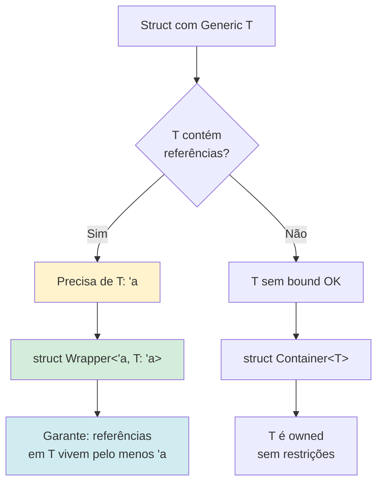
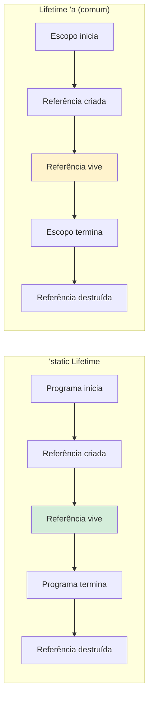
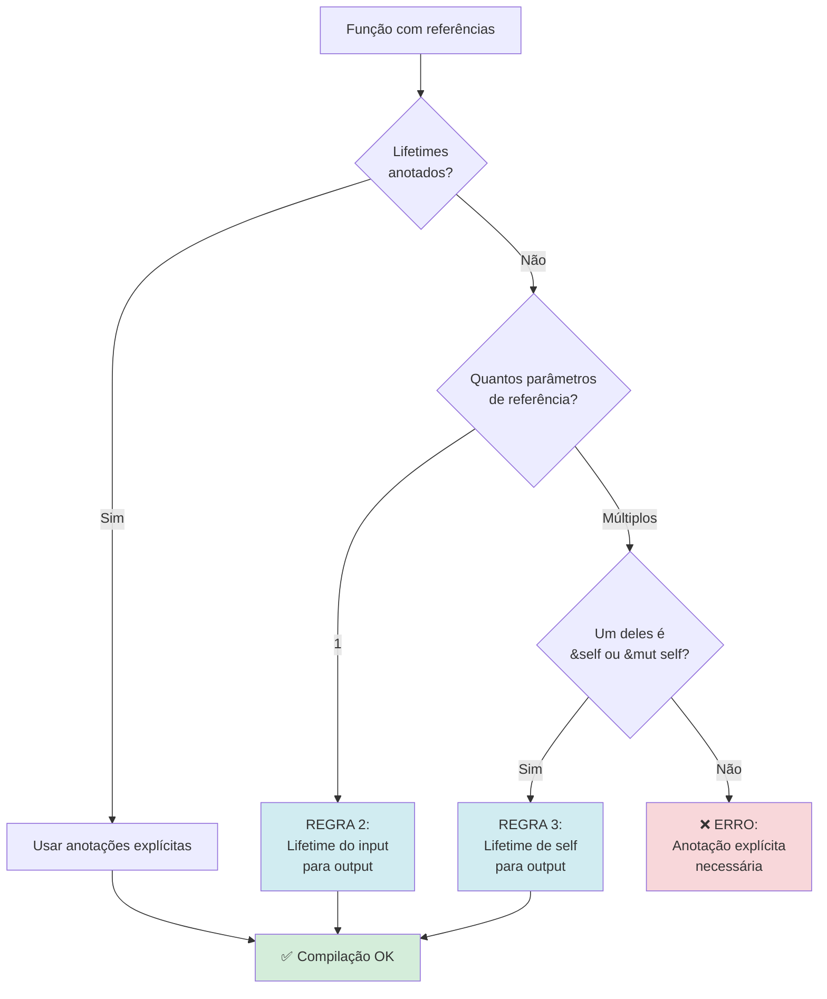
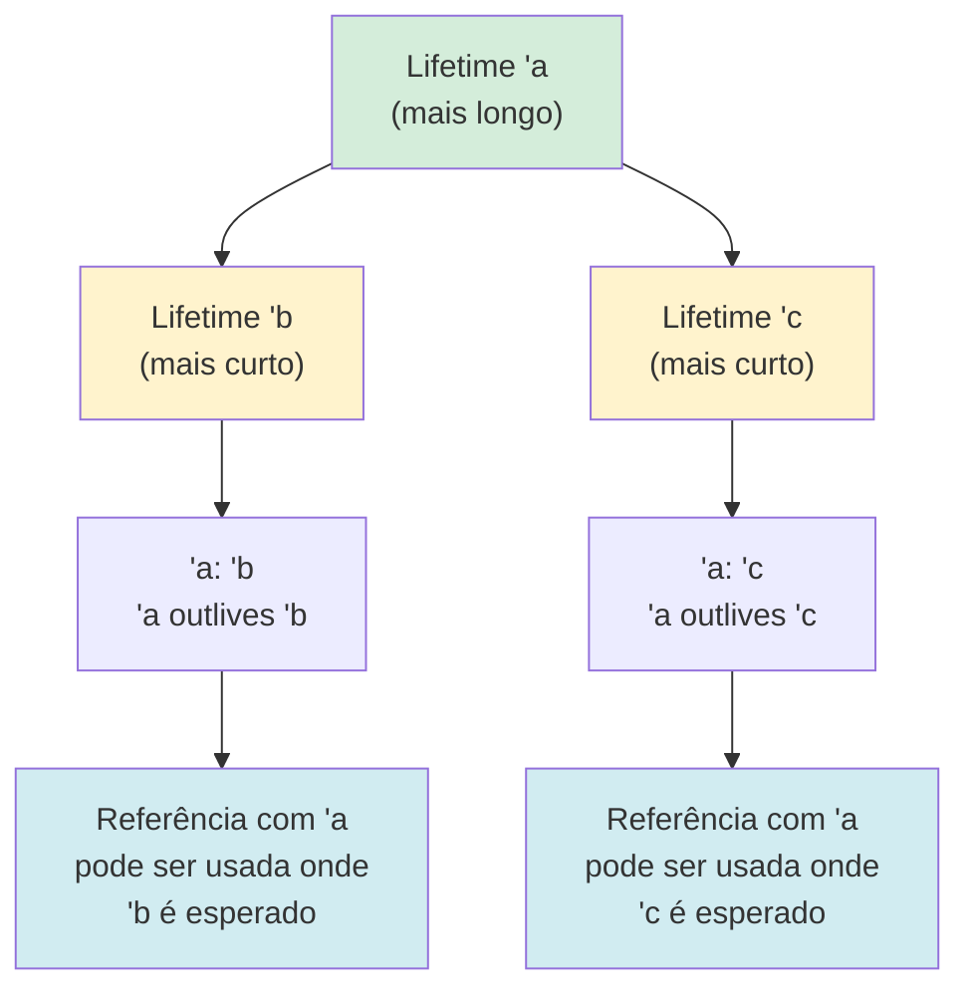
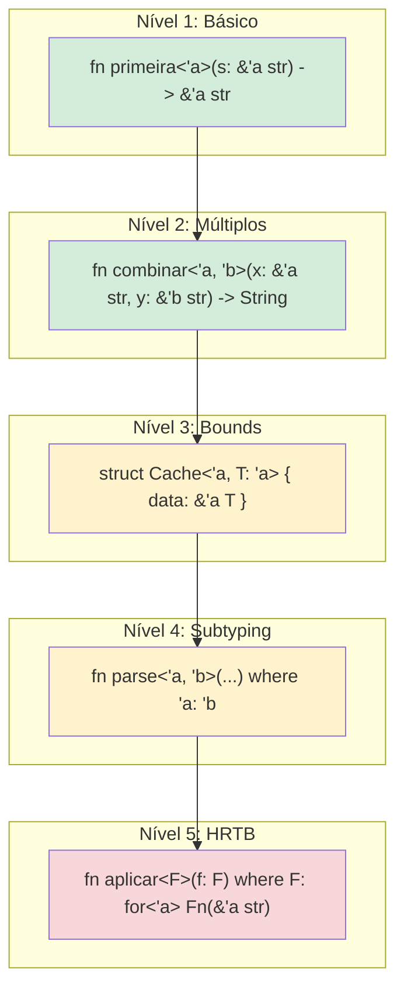

# 🦀 Dia 33: Lifetimes Avançados - Conceitos Desafiadores

> ⚠️ **AVISO IMPORTANTE**: Lifetimes avançados são um dos tópicos **mais desafiadores** em Rust. Se você sentir dificuldade, isso é **completamente normal**. A maioria dos Rustaceans leva tempo para dominar esse conceito. Vamos com calma, passo a passo! 💙

---

## 📋 OBJETIVOS DE APRENDIZAGEM

Ao final desta lição, você será capaz de:

✅ **Entender lifetime bounds** (`T: 'a`) e quando usá-los  
✅ **Trabalhar com múltiplos lifetimes** relacionados (`'a`, `'b`)  
✅ **Compreender `'static`** em diferentes contextos  
✅ **Aplicar lifetime subtyping** (`'a: 'b`)  
✅ **Reconhecer elision rules** completas  
✅ **Ter uma base sólida** para continuar praticando

> 💡 **Expectativa Realista**: Não é necessário dominar 100% deste conteúdo agora. O objetivo é **familiarização** e **compreensão gradual**. A prática ao longo do tempo solidificará esses conceitos!

---

## 🎭 ATIVAÇÃO DO CONHECIMENTO PRÉVIO

### 🔗 Revisão: Lifetimes Básicos (Dia 19)

Você já aprendeu:

```rust {.line-numbers}
// Lifetime básico: 'a indica que a referência é válida
fn maior<'a>(x: &'a str, y: &'a str) -> &'a str {
    if x.len() > y.len() { x } else { y }
}
```

**Conceito:** `'a` garante que a referência retornada vive **pelo menos** enquanto as entradas vivem.

---

### 🏠 ANALOGIA CENTRAL: Contratos de Aluguel

Imagine um sistema de **contratos de aluguel** de imóveis:

| Conceito Rust | Analogia de Aluguel | Explicação |
|---------------|---------------------|------------|
| **Lifetime `'a`** | 📄 Contrato de 12 meses | Uma referência válida por um período específico |
| **Múltiplos lifetimes** | 📄📄 Dois contratos diferentes | Referências com durações independentes |
| **Lifetime bounds `T: 'a`** | 🏠 Imóvel deve durar mais que contrato | Um tipo T deve viver pelo menos tanto quanto `'a` |
| **`'static`** | 🏛️ Propriedade permanente | Referência que vive para sempre (programa inteiro) |
| **Subtyping `'a: 'b`** | 📄➡️📄 Contrato A cobre contrato B | Lifetime `'a` vive **pelo menos** tanto quanto `'b` |

---

### 📖 História: A Biblioteca e os Empréstimos

> **Maria** gerencia uma biblioteca. Ela empresta livros com **prazos diferentes**:
>
> - Um livro de referência pode ser emprestado por **1 semana** (`'a`)
> - Um romance pode ser emprestado por **2 semanas** (`'b`)
> - A enciclopédia **nunca sai da biblioteca** (`'static`)
>
> Às vezes, Maria precisa garantir que um livro **viva mais tempo** que outro. Por exemplo:
> - Um **índice** (referência) só é válido enquanto o **livro principal** existe
> - O índice tem lifetime `'a`, o livro tem lifetime `'b`
> - Regra: `'b: 'a` (o livro deve viver pelo menos tanto quanto o índice)
>
> **Lifetimes avançados** são como gerenciar esses **relacionamentos complexos** entre empréstimos! 📚

---

## 📚 APRESENTAÇÃO DO CONTEÚDO

### 1️⃣ Lifetime Bounds: `T: 'a`

**O que significa:** O tipo `T` deve conter apenas referências que vivem **pelo menos** tanto quanto `'a`.

#### Exemplo Simples

```rust {.line-numbers}
// T: 'a significa: qualquer referência dentro de T deve viver pelo menos 'a
struct Wrapper<'a, T: 'a> {
    valor: &'a T,
}

fn main() {
    let numero = 42;
    let wrapper = Wrapper { valor: &numero };
    println!("Valor: {}", wrapper.valor);
}
```

**Por que `T: 'a`?**

Sem o bound, o compilador não sabe se `T` contém referências. Com `T: 'a`, garantimos que **qualquer referência dentro de T** vive pelo menos `'a`.

---

#### Exemplo Prático: Cache com Referências

```rust {.line-numbers}
use std::collections::HashMap;

// Cache que armazena referências a dados
struct Cache<'a, T: 'a> {
    dados: HashMap<String, &'a T>,
}

impl<'a, T: 'a> Cache<'a, T> {
    fn new() -> Self {
        Cache {
            dados: HashMap::new(),
        }
    }
    
    fn inserir(&mut self, chave: String, valor: &'a T) {
        self.dados.insert(chave, valor);
    }
    
    fn buscar(&self, chave: &str) -> Option<&&'a T> {
        self.dados.get(chave)
    }
}

fn main() {
    let texto1 = String::from("Rust");
    let texto2 = String::from("Lifetimes");
    
    let mut cache = Cache::new();
    cache.inserir("lang".to_string(), &texto1);
    cache.inserir("topic".to_string(), &texto2);
    
    if let Some(valor) = cache.buscar("lang") {
        println!("Encontrado: {}", valor);
    }
}
```

**Explicação:**
- `T: 'a` garante que `T` não contém referências que morrem antes de `'a`
- O cache armazena `&'a T` (referências com lifetime `'a`)
- Tudo permanece válido enquanto `'a` viver

---

### 2️⃣ Múltiplos Lifetimes: `'a`, `'b` com Relacionamentos

Às vezes, precisamos de **lifetimes independentes** para diferentes referências.

#### Exemplo: Dois Lifetimes Independentes

```rust {.line-numbers}
// x e y podem ter lifetimes diferentes
fn primeira_palavra<'a, 'b>(x: &'a str, y: &'b str) -> &'a str {
    x.split_whitespace().next().unwrap_or(x)
}

fn main() {
    let frase1 = String::from("Olá mundo");
    
    {
        let frase2 = String::from("Rust é incrível");
        let resultado = primeira_palavra(&frase1, &frase2);
        println!("Primeira palavra: {}", resultado);
    } // frase2 morre aqui, mas resultado ainda é válido (vem de frase1)
    
    // resultado ainda seria válido aqui se estivesse no escopo
}
```

**Por que dois lifetimes?**

- `'a` para `x` (retornamos uma referência de `x`)
- `'b` para `y` (apenas lemos, não retornamos)
- Eles são **independentes** - `y` pode morrer antes de `x`

---

#### Exemplo: Struct com Múltiplos Lifetimes

```rust {.line-numbers}
// Struct que mantém referências com lifetimes diferentes
struct Contexto<'a, 'b> {
    titulo: &'a str,      // Lifetime 'a
    descricao: &'b str,   // Lifetime 'b (independente)
}

impl<'a, 'b> Contexto<'a, 'b> {
    fn novo(titulo: &'a str, descricao: &'b str) -> Self {
        Contexto { titulo, descricao }
    }
    
    fn exibir(&self) {
        println!("Título: {}", self.titulo);
        println!("Descrição: {}", self.descricao);
    }
}

fn main() {
    let titulo = String::from("Rust Avançado");
    
    {
        let descricao = String::from("Lifetimes complexos");
        let ctx = Contexto::novo(&titulo, &descricao);
        ctx.exibir();
    } // descricao morre aqui
    
    // titulo ainda está vivo
    println!("Título ainda existe: {}", titulo);
}
```

---

### 3️⃣ `'static` Lifetime: Referências Eternas

**`'static`** significa que a referência é válida **durante toda a execução do programa**.

#### Contexto 1: String Literals

```rust {.line-numbers}
// String literals têm lifetime 'static
let s: &'static str = "Olá, mundo!";

// Equivalente a:
let s: &str = "Olá, mundo!"; // Compilador infere 'static
```

**Por que?** String literals são armazenadas no **binário do programa**, então existem para sempre.

---

#### Contexto 2: Dados Globais

```rust {.line-numbers}
// Constante global tem lifetime 'static
static VERSAO: &str = "1.0.0";

fn obter_versao() -> &'static str {
    VERSAO
}

fn main() {
    println!("Versão: {}", obter_versao());
}
```

---

#### Contexto 3: Owned Data com `Box::leak`

```rust {.line-numbers}
fn criar_estatico() -> &'static str {
    // Box::leak transforma Box<T> em &'static T
    // CUIDADO: isso causa memory leak intencional!
    let s = String::from("Dado eterno");
    Box::leak(s.into_boxed_str())
}

fn main() {
    let referencia = criar_estatico();
    println!("Referência estática: {}", referencia);
    // Esta referência é válida para sempre!
}
```

**⚠️ Aviso:** `Box::leak` deve ser usado com **muito cuidado** - cria memory leak intencional!

---

#### Contexto 4: Trait Bounds com `'static`

```rust {.line-numbers}
use std::fmt::Display;

// T: 'static significa: T não contém referências não-estáticas
fn imprimir_eternamente<T: Display + 'static>(valor: T) {
    println!("{}", valor);
}

fn main() {
    let numero = 42;
    imprimir_eternamente(numero); // OK: i32 não contém referências
    
    let texto = String::from("Rust");
    imprimir_eternamente(texto); // OK: String owned, sem referências
    
    let referencia = &texto;
    // imprimir_eternamente(referencia); // ❌ ERRO: &String tem lifetime não-estático
}
```

**Importante:** `T: 'static` **NÃO** significa que `T` vive para sempre. Significa que `T` **não contém referências de curta duração**.

---

### 4️⃣ Lifetime Subtyping: `'a: 'b`

**Lê-se:** "`'a` vive **pelo menos** tanto quanto `'b`" ou "`'a` outlives `'b`".

#### Visualização

```
Timeline:
|-------- 'a --------|
    |--- 'b ---|

'a: 'b significa que 'a engloba 'b
```

---

#### Exemplo: Parser com Subtyping

```rust {.line-numbers}
// 'a: 'b significa que 'a vive pelo menos tanto quanto 'b
struct Parser<'a> {
    input: &'a str,
}

impl<'a> Parser<'a> {
    fn new(input: &'a str) -> Self {
        Parser { input }
    }
    
    // 'b é um lifetime menor ou igual a 'a
    fn parse_slice<'b>(&'b self) -> &'a str
    where
        'a: 'b, // 'a deve viver pelo menos tanto quanto 'b
    {
        self.input
    }
}

fn main() {
    let texto = String::from("Rust lifetimes");
    let parser = Parser::new(&texto);
    
    {
        let slice = parser.parse_slice();
        println!("Slice: {}", slice);
    } // 'b termina aqui
    
    // 'a ainda está vivo (texto ainda existe)
}
```

**Explicação:**
- `'a` é o lifetime do `input`
- `'b` é o lifetime da referência `&self`
- `'a: 'b` garante que `input` vive pelo menos tanto quanto `self`

---

#### Exemplo Prático: Contexto Aninhado

```rust {.line-numbers}
struct Documento<'a> {
    conteudo: &'a str,
}

struct Secao<'a, 'b: 'a> {
    documento: &'b Documento<'a>,
    inicio: usize,
    fim: usize,
}

impl<'a, 'b: 'a> Secao<'a, 'b> {
    fn novo(documento: &'b Documento<'a>, inicio: usize, fim: usize) -> Self {
        Secao { documento, inicio, fim }
    }
    
    fn texto(&self) -> &'a str {
        &self.documento.conteudo[self.inicio..self.fim]
    }
}

fn main() {
    let conteudo = String::from("Rust é uma linguagem incrível");
    let doc = Documento { conteudo: &conteudo };
    
    let secao = Secao::novo(&doc, 0, 4);
    println!("Seção: {}", secao.texto()); // "Rust"
}
```

**Explicação:**
- `'b: 'a` significa que `'b` (lifetime do `Documento`) vive pelo menos tanto quanto `'a` (lifetime do conteúdo)
- Isso permite retornar `&'a str` de forma segura

---

### 5️⃣ Elision Rules Completas (3 Regras)

**Lifetime elision** permite omitir anotações de lifetime em casos comuns.

#### As 3 Regras de Elision

**Regra 1:** Cada parâmetro de referência recebe seu próprio lifetime.

```rust {.line-numbers}
// Você escreve:
fn primeira(s: &str) -> &str { s }

// Compilador expande para:
fn primeira<'a>(s: &'a str) -> &'a str { s }
```

---

**Regra 2:** Se há exatamente **um** lifetime de entrada, ele é atribuído a todas as saídas.

```rust {.line-numbers}
// Você escreve:
fn processar(input: &str) -> &str { input }

// Compilador expande para:
fn processar<'a>(input: &'a str) -> &'a str { input }
```

---

**Regra 3:** Se há múltiplos lifetimes de entrada, mas um deles é `&self` ou `&mut self`, o lifetime de `self` é atribuído a todas as saídas.

```rust {.line-numbers}
struct Parser {
    input: String,
}

impl Parser {
    // Você escreve:
    fn parse(&self, delimitador: &str) -> &str {
        &self.input
    }
    
    // Compilador expande para:
    fn parse<'a, 'b>(&'a self, delimitador: &'b str) -> &'a str {
        &self.input
    }
}
```

---

#### Quando Elision NÃO Funciona

```rust {.line-numbers}
// ❌ ERRO: múltiplos inputs, nenhum é &self
// fn maior(x: &str, y: &str) -> &str { // Ambíguo!
//     if x.len() > y.len() { x } else { y }
// }

// ✅ CORRETO: anotação explícita necessária
fn maior<'a>(x: &'a str, y: &'a str) -> &'a str {
    if x.len() > y.len() { x } else { y }
}
```

---

### 6️⃣ HRTB: `for<'a>` (Introdução Básica)

**Higher-Rank Trait Bounds (HRTB)** são lifetimes **quantificados universalmente**.

> 💡 **Nota:** Este é um conceito **muito avançado**. Não se preocupe se não entender completamente agora!

#### O Problema

```rust {.line-numbers}
// Como aceitar uma closure que funciona com QUALQUER lifetime?
// fn aplicar<F>(f: F) -> i32
// where
//     F: Fn(&str) -> i32, // Qual lifetime para &str?
// {
//     f("teste")
// }
```

---

#### A Solução: `for<'a>`

```rust {.line-numbers}
// for<'a> significa: "para QUALQUER lifetime 'a"
fn aplicar<F>(f: F) -> i32
where
    F: for<'a> Fn(&'a str) -> i32,
{
    f("teste")
}

fn contar_chars(s: &str) -> i32 {
    s.len() as i32
}

fn main() {
    let resultado = aplicar(contar_chars);
    println!("Resultado: {}", resultado); // 5
}
```

**Explicação:**
- `for<'a>` declara que a closure deve funcionar com **qualquer lifetime**
- Isso permite passar closures que aceitam referências com lifetimes arbitrários

---

#### Exemplo Prático: Validador Genérico

```rust {.line-numbers}
// Validador que aceita qualquer função de validação
fn validar_todos<F>(itens: Vec<String>, validador: F) -> bool
where
    F: for<'a> Fn(&'a str) -> bool,
{
    itens.iter().all(|item| validador(item))
}

fn nao_vazio(s: &str) -> bool {
    !s.is_empty()
}

fn main() {
    let palavras = vec![
        String::from("Rust"),
        String::from("Lifetimes"),
        String::from("HRTB"),
    ];
    
    let todas_validas = validar_todos(palavras, nao_vazio);
    println!("Todas válidas: {}", todas_validas); // true
}
```

> 📝 **Nota:** Na prática, você raramente precisa escrever `for<'a>` manualmente. O compilador geralmente infere automaticamente!

---

## 🎨 DIAGRAMAS VISUAIS

### Diagrama 1: Timeline - Múltiplos Lifetimes

```mermaid
gantt
    title Múltiplos Lifetimes em Ação
    dateFormat X
    axisFormat %s

    section Lifetime 'a
    Variável x criada           :0, 1
    x vive                      :1, 8
    x destruída                 :8, 9

    section Lifetime 'b
    Variável y criada           :2, 3
    y vive                      :3, 6
    y destruída                 :6, 7

    section Lifetime 'c
    Variável z criada           :4, 5
    z vive (mais curto)         :5, 5.5
    z destruída                 :5.5, 6

    section Relacionamento
    'a engloba 'b e 'c          :1, 8
```



**Interpretação:**
- `'a` é o lifetime mais longo (0-9)
- `'b` é intermediário (2-7)
- `'c` é o mais curto (4-6)
- `'a: 'b` e `'a: 'c` são verdadeiros (`'a` outlives ambos)

---

### Diagrama 2: Lifetime Bounds Explicados



---

### Diagrama 3: Comparação - `'static` vs `'a`



**Diferença:**
- **`'static`**: vive durante **todo o programa**
- **`'a`**: vive durante um **escopo específico**

---

### Diagrama 4: Fluxograma - Elision Rules



---

### Diagrama 5: Relacionamentos - `'a: 'b`



**Regra:** Se `'a: 'b`, então `'a` vive **pelo menos** tanto quanto `'b`.

---

### Diagrama 6: Exemplos Visuais Progressivos



---

## 📊 VISUALIZAÇÕES E COMPARAÇÕES

### Tabela: Comparação de Lifetimes

| Conceito | Sintaxe | Significado | Quando Usar |
|----------|---------|-------------|-------------|
| **Lifetime básico** | `'a` | Referência válida por `'a` | Sempre que há referências |
| **Lifetime bound** | `T: 'a` | T vive pelo menos `'a` | Quando T contém referências |
| **Static lifetime** | `'static` | Vive todo o programa | String literals, constantes globais |
| **Subtyping** | `'a: 'b` | `'a` outlives `'b` | Relacionamentos entre lifetimes |
| **HRTB** | `for<'a>` | Para qualquer lifetime | Closures genéricas sobre lifetimes |

---

### Linhas do Tempo Sobrepostas

```
Programa completo:
|================================================|
                    'static

Função main:
|============================================|
              'a (lifetime longo)

Bloco interno:
        |===================|
              'b (lifetime médio)

Expressão temporária:
            |===|
             'c (lifetime curto)

Relacionamentos:
'static: 'a: 'b: 'c
(cada um vive pelo menos tanto quanto os seguintes)
```

---

### "Contratos" com Durações

| Contrato | Duração | Analogia Rust |
|----------|---------|---------------|
| 🏛️ **Propriedade Permanente** | Infinito | `'static` |
| 📄 **Contrato de 12 meses** | 1 ano | `'a` (lifetime longo) |
| 📄 **Contrato de 6 meses** | 6 meses | `'b` (lifetime médio) |
| 📄 **Contrato de 1 mês** | 1 mês | `'c` (lifetime curto) |

**Regra:** Um contrato mais longo pode **cobrir** um contrato mais curto (`'a: 'b`).

---

## 💡 DEMONSTRAÇÃO E MODELAGEM

### Progressão em 5 Níveis

#### Nível 1: Lifetime Único (Revisão)

```rust {.line-numbers}
// Simples: um lifetime, entrada e saída relacionadas
fn primeira_palavra<'a>(texto: &'a str) -> &'a str {
    texto.split_whitespace().next().unwrap_or("")
}

fn main() {
    let frase = String::from("Rust é incrível");
    let palavra = primeira_palavra(&frase);
    println!("Primeira palavra: {}", palavra);
}
```

---

#### Nível 2: Múltiplos Lifetimes Independentes

```rust {.line-numbers}
// Dois lifetimes independentes
fn escolher<'a, 'b>(escolha: bool, x: &'a str, y: &'b str) -> &'a str {
    // Sempre retorna x (lifetime 'a)
    // y pode ter lifetime diferente
    x
}

fn main() {
    let texto1 = String::from("Primeira opção");
    
    {
        let texto2 = String::from("Segunda opção");
        let resultado = escolher(true, &texto1, &texto2);
        println!("Escolhido: {}", resultado);
    } // texto2 morre aqui, mas resultado ainda é válido
}
```

---

#### Nível 3: Lifetime Bounds em Structs

```rust {.line-numbers}
use std::fmt::Display;

// T: 'a garante que T não contém referências que morrem antes de 'a
struct Container<'a, T: 'a + Display> {
    valor: &'a T,
}

impl<'a, T: 'a + Display> Container<'a, T> {
    fn novo(valor: &'a T) -> Self {
        Container { valor }
    }
    
    fn exibir(&self) {
        println!("Valor: {}", self.valor);
    }
}

fn main() {
    let numero = 42;
    let container = Container::novo(&numero);
    container.exibir();
}
```

---

#### Nível 4: Lifetime Subtyping

```rust {.line-numbers}
// 'a: 'b significa que 'a vive pelo menos tanto quanto 'b
struct Documento<'a> {
    texto: &'a str,
}

struct Referencia<'a, 'b: 'a> {
    documento: &'b Documento<'a>,
}

impl<'a, 'b: 'a> Referencia<'a, 'b> {
    fn novo(documento: &'b Documento<'a>) -> Self {
        Referencia { documento }
    }
    
    fn obter_texto(&self) -> &'a str {
        self.documento.texto
    }
}

fn main() {
    let conteudo = String::from("Rust avançado");
    let doc = Documento { texto: &conteudo };
    let ref_doc = Referencia::novo(&doc);
    
    println!("Texto: {}", ref_doc.obter_texto());
}
```

---

#### Nível 5: HRTB (Avançado)

```rust {.line-numbers}
// for<'a> permite closures que funcionam com qualquer lifetime
fn processar_strings<F>(strings: Vec<String>, processador: F)
where
    F: for<'a> Fn(&'a str) -> usize,
{
    for s in &strings {
        let tamanho = processador(s);
        println!("{} tem {} caracteres", s, tamanho);
    }
}

fn main() {
    let palavras = vec![
        String::from("Rust"),
        String::from("Lifetimes"),
        String::from("Avançados"),
    ];
    
    processar_strings(palavras, |s| s.len());
}
```

---

### Por Que Múltiplos Lifetimes?

**Problema:** Nem todas as referências têm a mesma duração!

```rust {.line-numbers}
// ❌ Forçar o mesmo lifetime seria muito restritivo
// fn processar<'a>(longo: &'a str, curto: &'a str) -> &'a str {
//     longo // OK, mas curto deve viver tanto quanto longo (desnecessário!)
// }

// ✅ Lifetimes independentes são mais flexíveis
fn processar<'a, 'b>(longo: &'a str, curto: &'b str) -> &'a str {
    longo // curto pode morrer antes, sem problemas!
}
```

---

### `'static` em Diferentes Contextos

#### Contexto 1: String Literals

```rust {.line-numbers}
fn obter_mensagem() -> &'static str {
    "Esta string está no binário" // 'static implícito
}
```

---

#### Contexto 2: Constantes Globais

```rust {.line-numbers}
static CONFIGURACAO: &str = "modo=produção";

fn ler_config() -> &'static str {
    CONFIGURACAO
}
```

---

#### Contexto 3: Trait Bounds

```rust {.line-numbers}
// T: 'static significa: T não contém referências de curta duração
fn armazenar<T: 'static>(valor: T) -> T {
    valor // Pode ser armazenado indefinidamente
}

fn main() {
    let numero = 42;
    armazenar(numero); // OK: i32 não tem referências
    
    let texto = String::from("Rust");
    armazenar(texto); // OK: String é owned
    
    let referencia = &texto;
    // armazenar(referencia); // ❌ ERRO: &String não é 'static
}
```

---

### Elision em Ação

```rust {.line-numbers}
struct Parser {
    input: String,
}

impl Parser {
    // Elision aplica Regra 3: lifetime de &self para output
    fn parse(&self) -> &str {
        &self.input
    }
    
    // Expandido pelo compilador:
    // fn parse<'a>(&'a self) -> &'a str {
    //     &self.input
    // }
}

fn main() {
    let parser = Parser {
        input: String::from("dados"),
    };
    
    let resultado = parser.parse();
    println!("Resultado: {}", resultado);
}
```

---

## 🎯 PRÁTICA GUIADA

### 📝 Exercício Completo: Parser com Referências

**Contexto:** Vamos criar um **parser de texto** que mantém uma referência ao input original e retorna slices (fatias) desse input. Este é um caso real onde lifetimes avançados são necessários!

**Objetivo:** Demonstrar lifetimes em um cenário prático de parsing.

---

#### Passo 1: Struct Básico

```rust {.line-numbers}
// Parser que mantém referência ao input
struct Parser<'a> {
    input: &'a str,
    pos: usize,
}

impl<'a> Parser<'a> {
    fn new(input: &'a str) -> Self {
        Parser { input, pos: 0 }
    }
    
    fn input(&self) -> &'a str {
        self.input
    }
    
    fn posicao(&self) -> usize {
        self.pos
    }
}

fn main() {
    let texto = String::from("Rust é incrível");
    let parser = Parser::new(&texto);
    
    println!("Input: {}", parser.input());
    println!("Posição: {}", parser.posicao());
}
```

**Explicação:**
- `Parser<'a>` armazena `&'a str` (referência com lifetime `'a`)
- O parser **não possui** o texto, apenas **referencia** ele
- Lifetime `'a` garante que o parser não sobrevive ao texto

---

#### Passo 2: Métodos que Retornam Slices

```rust {.line-numbers}
struct Parser<'a> {
    input: &'a str,
    pos: usize,
}

impl<'a> Parser<'a> {
    fn new(input: &'a str) -> Self {
        Parser { input, pos: 0 }
    }
    
    // Retorna slice do input (lifetime 'a)
    fn restante(&self) -> &'a str {
        &self.input[self.pos..]
    }
    
    // Consome caracteres e retorna slice consumido
    fn consumir(&mut self, n: usize) -> &'a str {
        let inicio = self.pos;
        let fim = (self.pos + n).min(self.input.len());
        self.pos = fim;
        &self.input[inicio..fim]
    }
    
    // Consome até encontrar um caractere
    fn consumir_ate(&mut self, delimitador: char) -> &'a str {
        let inicio = self.pos;
        
        if let Some(pos_relativa) = self.restante().find(delimitador) {
            self.pos += pos_relativa;
            &self.input[inicio..self.pos]
        } else {
            self.pos = self.input.len();
            &self.input[inicio..]
        }
    }
}

fn main() {
    let texto = String::from("Rust:Lifetimes:Avançados");
    let mut parser = Parser::new(&texto);
    
    let parte1 = parser.consumir_ate(':');
    println!("Parte 1: {}", parte1); // "Rust"
    
    parser.consumir(1); // Pula o ':'
    
    let parte2 = parser.consumir_ate(':');
    println!("Parte 2: {}", parte2); // "Lifetimes"
    
    parser.consumir(1); // Pula o ':'
    
    let parte3 = parser.restante();
    println!("Parte 3: {}", parte3); // "Avançados"
}
```

**Por Que Lifetime `'a`?**

- Todos os slices retornados vêm do `input` original
- Eles devem viver enquanto `input` viver
- `'a` conecta os slices ao `input`

---

#### Passo 3: Composição de Parsers

```rust {.line-numbers}
struct Parser<'a> {
    input: &'a str,
    pos: usize,
}

impl<'a> Parser<'a> {
    fn new(input: &'a str) -> Self {
        Parser { input, pos: 0 }
    }
    
    fn restante(&self) -> &'a str {
        &self.input[self.pos..]
    }
    
    fn consumir_ate(&mut self, delimitador: char) -> &'a str {
        let inicio = self.pos;
        
        if let Some(pos_relativa) = self.restante().find(delimitador) {
            self.pos += pos_relativa;
            &self.input[inicio..self.pos]
        } else {
            self.pos = self.input.len();
            &self.input[inicio..]
        }
    }
    
    fn pular(&mut self, n: usize) {
        self.pos = (self.pos + n).min(self.input.len());
    }
    
    fn esta_no_fim(&self) -> bool {
        self.pos >= self.input.len()
    }
}

// Função que usa o parser
fn extrair_palavras(texto: &str) -> Vec<&str> {
    let mut parser = Parser::new(texto);
    let mut palavras = Vec::new();
    
    while !parser.esta_no_fim() {
        let palavra = parser.consumir_ate(' ');
        if !palavra.is_empty() {
            palavras.push(palavra);
        }
        parser.pular(1); // Pula o espaço
    }
    
    palavras
}

fn main() {
    let frase = String::from("Rust tem lifetimes avançados");
    let palavras = extrair_palavras(&frase);
    
    println!("Palavras:");
    for (i, palavra) in palavras.iter().enumerate() {
        println!("  [{}] {}", i, palavra);
    }
}
```

---

#### Passo 4: Lifetime Bounds Necessários

```rust {.line-numbers}
use std::fmt::Display;

// Parser genérico com lifetime bound
struct ParserGenerico<'a, T: 'a> {
    dados: &'a [T],
    pos: usize,
}

impl<'a, T: 'a> ParserGenerico<'a, T> {
    fn new(dados: &'a [T]) -> Self {
        ParserGenerico { dados, pos: 0 }
    }
    
    fn proximo(&mut self) -> Option<&'a T> {
        if self.pos < self.dados.len() {
            let item = &self.dados[self.pos];
            self.pos += 1;
            Some(item)
        } else {
            None
        }
    }
}

// Implementação especial para tipos Display
impl<'a, T: 'a + Display> ParserGenerico<'a, T> {
    fn exibir_restante(&self) {
        println!("Restante:");
        for item in &self.dados[self.pos..] {
            println!("  - {}", item);
        }
    }
}

fn main() {
    let numeros = vec![10, 20, 30, 40, 50];
    let mut parser = ParserGenerico::new(&numeros);
    
    println!("Primeiro: {:?}", parser.proximo()); // Some(10)
    println!("Segundo: {:?}", parser.proximo());  // Some(20)
    
    parser.exibir_restante();
    // Restante:
    //   - 30
    //   - 40
    //   - 50
}
```

**Por Que `T: 'a`?**

- `T` pode conter referências
- `T: 'a` garante que essas referências vivem pelo menos `'a`
- Sem isso, o compilador não sabe se é seguro

---

#### ✅ Solução Completa com Testes

```rust {.line-numbers}
/// Parser que mantém referência ao input e permite parsing incremental
struct Parser<'a> {
    input: &'a str,
    pos: usize,
}

impl<'a> Parser<'a> {
    /// Cria um novo parser
    fn new(input: &'a str) -> Self {
        Parser { input, pos: 0 }
    }
    
    /// Retorna o input completo
    fn input(&self) -> &'a str {
        self.input
    }
    
    /// Retorna a posição atual
    fn posicao(&self) -> usize {
        self.pos
    }
    
    /// Retorna o texto restante a partir da posição atual
    fn restante(&self) -> &'a str {
        &self.input[self.pos..]
    }
    
    /// Verifica se chegou ao fim
    fn esta_no_fim(&self) -> bool {
        self.pos >= self.input.len()
    }
    
    /// Consome n caracteres e retorna o slice consumido
    fn consumir(&mut self, n: usize) -> &'a str {
        let inicio = self.pos;
        let fim = (self.pos + n).min(self.input.len());
        self.pos = fim;
        &self.input[inicio..fim]
    }
    
    /// Pula n caracteres sem retornar nada
    fn pular(&mut self, n: usize) {
        self.pos = (self.pos + n).min(self.input.len());
    }
    
    /// Consome até encontrar o delimitador (não inclui o delimitador)
    fn consumir_ate(&mut self, delimitador: char) -> &'a str {
        let inicio = self.pos;
        
        if let Some(pos_relativa) = self.restante().find(delimitador) {
            self.pos += pos_relativa;
            &self.input[inicio..self.pos]
        } else {
            self.pos = self.input.len();
            &self.input[inicio..]
        }
    }
    
    /// Consome enquanto o predicado for verdadeiro
    fn consumir_enquanto<F>(&mut self, predicado: F) -> &'a str
    where
        F: Fn(char) -> bool,
    {
        let inicio = self.pos;
        
        for (i, c) in self.restante().char_indices() {
            if !predicado(c) {
                self.pos += i;
                return &self.input[inicio..self.pos];
            }
        }
        
        self.pos = self.input.len();
        &self.input[inicio..]
    }
    
    /// Pula espaços em branco
    fn pular_espacos(&mut self) {
        self.consumir_enquanto(|c| c.is_whitespace());
    }
    
    /// Reseta o parser para o início
    fn resetar(&mut self) {
        self.pos = 0;
    }
}

fn main() {
    println!("🧪 TESTE 1: Parsing Básico");
    let texto1 = String::from("Rust:Lifetimes:Avançados");
    let mut parser1 = Parser::new(&texto1);
    
    let parte1 = parser1.consumir_ate(':');
    assert_eq!(parte1, "Rust");
    println!("✅ Parte 1: {}", parte1);
    
    parser1.pular(1); // Pula ':'
    
    let parte2 = parser1.consumir_ate(':');
    assert_eq!(parte2, "Lifetimes");
    println!("✅ Parte 2: {}", parte2);
    
    parser1.pular(1); // Pula ':'
    
    let parte3 = parser1.restante();
    assert_eq!(parte3, "Avançados");
    println!("✅ Parte 3: {}", parte3);
    
    println!("\n🧪 TESTE 2: Consumir Enquanto");
    let texto2 = String::from("abc123xyz");
    let mut parser2 = Parser::new(&texto2);
    
    let letras = parser2.consumir_enquanto(|c| c.is_alphabetic());
    assert_eq!(letras, "abc");
    println!("✅ Letras: {}", letras);
    
    let numeros = parser2.consumir_enquanto(|c| c.is_numeric());
    assert_eq!(numeros, "123");
    println!("✅ Números: {}", numeros);
    
    let resto = parser2.restante();
    assert_eq!(resto, "xyz");
    println!("✅ Resto: {}", resto);
    
    println!("\n🧪 TESTE 3: Pular Espaços");
    let texto3 = String::from("   Rust   é   incrível   ");
    let mut parser3 = Parser::new(&texto3);
    
    parser3.pular_espacos();
    let palavra1 = parser3.consumir_ate(' ');
    assert_eq!(palavra1, "Rust");
    println!("✅ Palavra 1: {}", palavra1);
    
    parser3.pular_espacos();
    let palavra2 = parser3.consumir_ate(' ');
    assert_eq!(palavra2, "é");
    println!("✅ Palavra 2: {}", palavra2);
    
    parser3.pular_espacos();
    let palavra3 = parser3.consumir_ate(' ');
    assert_eq!(palavra3, "incrível");
    println!("✅ Palavra 3: {}", palavra3);
    
    println!("\n🧪 TESTE 4: Reset");
    let texto4 = String::from("teste");
    let mut parser4 = Parser::new(&texto4);
    
    parser4.consumir(3);
    assert_eq!(parser4.posicao(), 3);
    
    parser4.resetar();
    assert_eq!(parser4.posicao(), 0);
    assert_eq!(parser4.restante(), "teste");
    println!("✅ Reset funcionou!");
    
    println!("\n🧪 TESTE 5: Extração de Palavras");
    let frase = String::from("Rust tem lifetimes avançados");
    let mut parser5 = Parser::new(&frase);
    let mut palavras = Vec::new();
    
    while !parser5.esta_no_fim() {
        parser5.pular_espacos();
        if !parser5.esta_no_fim() {
            let palavra = parser5.consumir_enquanto(|c| !c.is_whitespace());
            palavras.push(palavra);
        }
    }
    
    assert_eq!(palavras, vec!["Rust", "tem", "lifetimes", "avançados"]);
    println!("✅ Palavras extraídas:");
    for (i, palavra) in palavras.iter().enumerate() {
        println!("   [{}] {}", i, palavra);
    }
    
    println!("\n✅ Todos os testes passaram!");
}
```

---

## 🔄 FEEDBACK E AVALIAÇÃO

### ✅ Checklist de Compreensão

Marque os conceitos que você compreende:

- [ ] Entendo o que significa `T: 'a` (lifetime bound)
- [ ] Sei quando usar múltiplos lifetimes (`'a`, `'b`)
- [ ] Compreendo `'static` em diferentes contextos
- [ ] Entendo lifetime subtyping (`'a: 'b`)
- [ ] Conheço as 3 regras de elision
- [ ] Sei quando elision não funciona
- [ ] Tenho noção básica de HRTB (`for<'a>`)
- [ ] Consigo implementar structs com lifetimes
- [ ] Entendo por que lifetimes são necessários

> 💙 **Lembre-se:** Não é necessário marcar todos! Lifetimes avançados levam tempo para dominar.

---

### 🧠 Quiz Conceitual

**1. O que significa `T: 'a`?**

a) T é um tipo estático  
b) T deve viver exatamente `'a`  
c) T não pode conter referências que morrem antes de `'a`  
d) T é um tipo genérico sem restrições  

<details>
<summary>Resposta</summary>
<b>c)</b> <code>T: 'a</code> significa que T não pode conter referências que morrem antes do lifetime <code>'a</code>.
</details>

---

**2. Qual é a diferença entre `'static` como lifetime e como trait bound?**

a) Não há diferença  
b) Como lifetime significa "vive para sempre"; como bound significa "não contém referências de curta duração"  
c) Como lifetime é inválido  
d) Como bound é inválido  

<details>
<summary>Resposta</summary>
<b>b)</b> <code>&'static str</code> significa que a referência vive para sempre. <code>T: 'static</code> significa que T não contém referências não-estáticas (mas T pode ser temporário).
</details>

---

**3. O que significa `'a: 'b`?**

a) `'a` e `'b` são iguais  
b) `'a` vive menos que `'b`  
c) `'a` vive pelo menos tanto quanto `'b`  
d) `'a` e `'b` são independentes  

<details>
<summary>Resposta</summary>
<b>c)</b> <code>'a: 'b</code> significa que <code>'a</code> outlives <code>'b</code> (vive pelo menos tanto quanto).
</details>

---

**4. Quando a elision NÃO funciona?**

a) Quando há múltiplos inputs e nenhum é `&self`  
b) Quando há apenas um input  
c) Quando há `&self`  
d) Elision sempre funciona  

<details>
<summary>Resposta</summary>
<b>a)</b> Quando há múltiplos parâmetros de referência e nenhum é <code>&self</code>, o compilador não sabe qual lifetime usar para o output.
</details>

---

### 🔄 Exercícios de Anotação

**Exercício 1:** Adicione anotações de lifetime explícitas:

```rust {.line-numbers}
// Versão com elision
fn primeira(s: &str) -> &str {
    s.split_whitespace().next().unwrap_or("")
}

// Adicione lifetimes explícitos:
// fn primeira<...>(s: ...) -> ... {
//     s.split_whitespace().next().unwrap_or("")
// }
```

<details>
<summary>Solução</summary>

```rust {.line-numbers}
fn primeira<'a>(s: &'a str) -> &'a str {
    s.split_whitespace().next().unwrap_or("")
}
```

</details>

---

**Exercício 2:** Corrija o código adicionando lifetimes:

```rust {.line-numbers}
// ❌ Este código não compila
// struct Holder {
//     referencia: &str,
// }

// Corrija adicionando lifetimes:
```

<details>
<summary>Solução</summary>

```rust {.line-numbers}
struct Holder<'a> {
    referencia: &'a str,
}
```

</details>

---

### 📝 Auto-Avaliação Honesta

**Avalie seu entendimento (1-5):**

| Conceito | 1 (Confuso) | 2 | 3 | 4 | 5 (Claro) |
|----------|-------------|---|---|---|-----------|
| Lifetime bounds `T: 'a` | ☐ | ☐ | ☐ | ☐ | ☐ |
| Múltiplos lifetimes | ☐ | ☐ | ☐ | ☐ | ☐ |
| `'static` lifetime | ☐ | ☐ | ☐ | ☐ | ☐ |
| Subtyping `'a: 'b` | ☐ | ☐ | ☐ | ☐ | ☐ |
| Elision rules | ☐ | ☐ | ☐ | ☐ | ☐ |
| HRTB `for<'a>` | ☐ | ☐ | ☐ | ☐ | ☐ |

**Se marcou 1 ou 2:** Isso é normal! Revise os exemplos e pratique mais. Lifetimes levam tempo.

**Se marcou 3:** Você está no caminho certo! Continue praticando.

**Se marcou 4 ou 5:** Excelente! Você está dominando um dos conceitos mais difíceis de Rust!

---

## 🚀 TRANSFERÊNCIA E APLICAÇÃO

### 🎯 Prática Adicional Opcional

**Exercício 1: Struct com Duas Referências**

Crie um struct que armazena duas referências com lifetimes independentes:

```rust {.line-numbers}
// TODO: Implemente
// struct DuasRefs<...> {
//     primeira: ...,
//     segunda: ...,
// }
```

<details>
<summary>Solução</summary>

```rust {.line-numbers}
struct DuasRefs<'a, 'b> {
    primeira: &'a str,
    segunda: &'b str,
}

impl<'a, 'b> DuasRefs<'a, 'b> {
    fn nova(primeira: &'a str, segunda: &'b str) -> Self {
        DuasRefs { primeira, segunda }
    }
    
    fn exibir(&self) {
        println!("Primeira: {}, Segunda: {}", self.primeira, self.segunda);
    }
}

fn main() {
    let texto1 = String::from("Rust");
    
    {
        let texto2 = String::from("Lifetimes");
        let refs = DuasRefs::nova(&texto1, &texto2);
        refs.exibir();
    } // texto2 morre aqui
    
    // texto1 ainda está vivo
}
```

</details>

---

**Exercício 2: Iterator com Lifetime**

Implemente um iterator que retorna referências:

```rust {.line-numbers}
struct MeuIterator<'a> {
    // TODO: campos
}

impl<'a> Iterator for MeuIterator<'a> {
    type Item = &'a str;
    
    fn next(&mut self) -> Option<Self::Item> {
        // TODO: implementar
        None
    }
}
```

<details>
<summary>Solução</summary>

```rust {.line-numbers}
struct MeuIterator<'a> {
    palavras: &'a [&'a str],
    indice: usize,
}

impl<'a> MeuIterator<'a> {
    fn novo(palavras: &'a [&'a str]) -> Self {
        MeuIterator { palavras, indice: 0 }
    }
}

impl<'a> Iterator for MeuIterator<'a> {
    type Item = &'a str;
    
    fn next(&mut self) -> Option<Self::Item> {
        if self.indice < self.palavras.len() {
            let palavra = self.palavras[self.indice];
            self.indice += 1;
            Some(palavra)
        } else {
            None
        }
    }
}

fn main() {
    let palavras = ["Rust", "tem", "lifetimes"];
    let mut iter = MeuIterator::novo(&palavras);
    
    while let Some(palavra) = iter.next() {
        println!("{}", palavra);
    }
}
```

</details>

---

### 🔮 Preparação para Operator Overloading (Dia 34)

Lifetimes avançados são fundamentais para trabalhar com **referências complexas**. No próximo dia, vamos explorar **operator overloading**, que permite customizar operadores (`+`, `-`, `*`, etc.) para seus tipos!

**Preview:**

```rust {.line-numbers}
use std::ops::Add;

struct Ponto {
    x: i32,
    y: i32,
}

// Implementar + para Ponto
impl Add for Ponto {
    type Output = Ponto;
    
    fn add(self, outro: Ponto) -> Ponto {
        Ponto {
            x: self.x + outro.x,
            y: self.y + outro.y,
        }
    }
}

fn main() {
    let p1 = Ponto { x: 1, y: 2 };
    let p2 = Ponto { x: 3, y: 4 };
    let p3 = p1 + p2; // Operador + customizado!
    println!("({}, {})", p3.x, p3.y);
}
```

---

### 📚 Recursos de Aprofundamento

**Livros:**
1. **"The Rust Programming Language"** - Capítulo 10 (Lifetimes)
2. **"Programming Rust"** - Capítulo 5 (References)
3. **"Rust for Rustaceans"** - Capítulo 1 (Foundations)

**Artigos:**
1. **"Understanding Rust Lifetimes"** - Rust Blog
2. **"Common Rust Lifetime Misconceptions"** - fasterthanli.me
3. **"Lifetime Variance in Rust"** - doc.rust-lang.org

**Ferramentas:**
1. **Rust Playground** - Experimente com lifetimes online
2. **Compiler Error Messages** - Leia com atenção, elas ensinam muito!
3. **Clippy** - Sugere melhorias em lifetimes

---

## 🎓 TÉCNICAS PEDAGÓGICAS APLICADAS

### 🏠 Reforço da Analogia: Contratos de Aluguel

**Lembre-se:**

| Situação | Analogia | Rust |
|----------|----------|------|
| 🏛️ Propriedade permanente | Nunca expira | `'static` |
| 📄 Contrato de 12 meses | Duração específica | `'a` |
| 📄📄 Dois contratos | Durações independentes | `'a`, `'b` |
| 📄➡️📄 Contrato A cobre B | Um engloba outro | `'a: 'b` |
| 🏠 Imóvel dura mais que contrato | Tipo vive mais que lifetime | `T: 'a` |

---

### 📊 Visualização Temporal

```
Programa:
|================================================| 'static

Função main:
|============================================|     'a

Bloco interno:
    |===================|                         'b

Expressão:
        |===|                                     'c

Relacionamentos válidos:
'static: 'a: 'b: 'c
(cada um vive pelo menos tanto quanto os seguintes)
```

---

### 📈 Progressão Gradual

1. ✅ **Lifetimes básicos** (Dia 19) - fundação
2. ✅ **Lifetime bounds** - `T: 'a`
3. ✅ **Múltiplos lifetimes** - `'a`, `'b`
4. ✅ **Subtyping** - `'a: 'b`
5. ✅ **Elision rules** - simplificação
6. ✅ **HRTB** - nível avançado

**Você progrediu do básico ao avançado!** 🎉

---

### 💙 Normalização da Dificuldade

> **É NORMAL achar lifetimes avançados difíceis!**
>
> - Até desenvolvedores experientes em Rust levam tempo para dominar
> - A maioria dos casos usa elision (você não precisa anotar)
> - O compilador ajuda com mensagens de erro detalhadas
> - A comunidade Rust é muito acolhedora - pergunte sem medo!
> - **Compreensão vem com prática ao longo do tempo**

**Você não está sozinho nessa jornada!** 🦀💪

---

### 🎯 Encorajamento Explícito

**Parabéns por chegar até aqui!** 🎉

Lifetimes avançados são um dos tópicos **mais desafiadores** em Rust. O fato de você ter estudado este material já demonstra:

✅ **Persistência** - Você não desistiu diante da complexidade  
✅ **Curiosidade** - Você quer entender profundamente  
✅ **Comprometimento** - Você está investindo em seu aprendizado  

**Dicas para continuar:**

1. **Pratique regularmente** - Lifetimes se tornam naturais com o tempo
2. **Leia mensagens de erro** - O compilador é seu professor
3. **Comece simples** - Não precisa usar lifetimes complexos em todos os projetos
4. **Peça ajuda** - A comunidade Rust é incrível
5. **Seja paciente consigo mesmo** - Aprendizado leva tempo

---

## 🎯 RESUMO FINAL

### 🔑 Pontos-Chave

1. **Lifetime bounds `T: 'a`** garantem que T não contém referências que morrem antes de `'a`
2. **Múltiplos lifetimes** (`'a`, `'b`) permitem referências com durações independentes
3. **`'static`** significa "vive para sempre" (como lifetime) ou "sem referências de curta duração" (como bound)
4. **Subtyping `'a: 'b`** significa que `'a` vive pelo menos tanto quanto `'b`
5. **Elision rules** permitem omitir lifetimes em casos comuns
6. **HRTB `for<'a>`** permite closures genéricas sobre lifetimes

---

### ⚠️ MENSAGEM IMPORTANTE

> **Lifetimes avançados são complexos por natureza.**
>
> - A maioria dos casos usa **elision** (você não anota)
> - Quando necessário, o **compilador te guia** com mensagens claras
> - É **OK pedir ajuda** da comunidade
> - **Compreensão vem com tempo e prática**
> - Você **não precisa dominar 100%** agora
>
> **Continue praticando e seja paciente consigo mesmo!** 💙

---

### 📊 Comparação: Antes vs Depois

| Aspecto | Antes (Dia 19) | Depois (Dia 33) |
|---------|----------------|-----------------|
| **Conhecimento** | Lifetimes básicos | Lifetimes avançados |
| **Anotações** | `'a` simples | `'a`, `'b`, `T: 'a`, `'a: 'b` |
| **Contextos** | Funções simples | Structs complexos, parsers |
| **Elision** | Uso básico | Compreensão completa |
| **Confiança** | Iniciante | Intermediário |

---

### 🎓 O Que Você Aprendeu Hoje

✅ Lifetime bounds (`T: 'a`) e quando usá-los  
✅ Múltiplos lifetimes relacionados (`'a`, `'b`)  
✅ `'static` em diferentes contextos  
✅ Lifetime subtyping (`'a: 'b`)  
✅ As 3 regras de elision completas  
✅ Noção básica de HRTB (`for<'a>`)  
✅ Implementação prática de parser com lifetimes  

---

### 🚀 Próximos Passos

**Dia 34: Operator Overloading**
- Customizar operadores (`+`, `-`, `*`, `/`)
- Traits `Add`, `Sub`, `Mul`, `Div`
- Implementar operadores para tipos customizados
- Criar APIs ergonômicas

**Continue praticando lifetimes em seus projetos!**

---

## 🎉 PARABÉNS!

Você completou um dos dias **mais desafiadores** do curso de Rust! 🏆

Lifetimes avançados são considerados um dos tópicos mais difíceis em Rust, e você teve a **coragem** de enfrentá-los. Isso demonstra seu **comprometimento** com o aprendizado profundo.

**Lembre-se:**

- ✅ **Não é necessário dominar 100% agora**
- ✅ **Prática leva à compreensão**
- ✅ **O compilador é seu aliado**
- ✅ **A comunidade está aqui para ajudar**
- ✅ **Você está no caminho certo!**

**Continue assim e você será um Rustacean expert!** 🦀💙

---

**#RustLang #Lifetimes #Advanced #Ownership #BorrowChecker #Dia33**