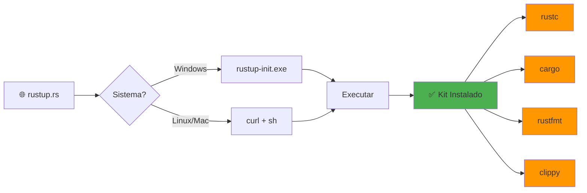
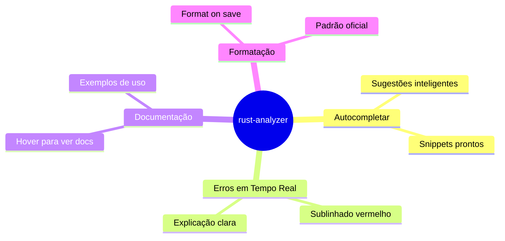
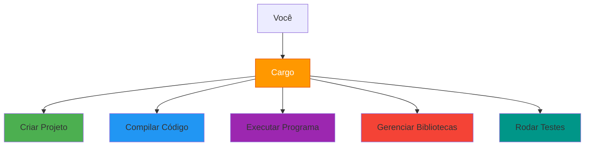
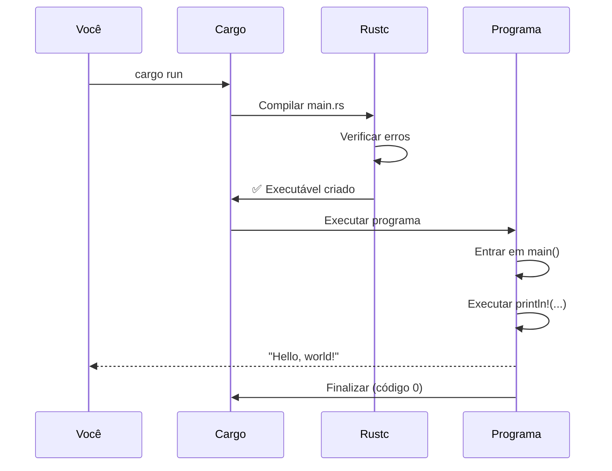
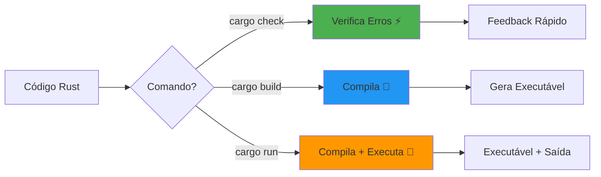

<!DOCTYPE html>
<html lang="pt-BR">
<head>
    <meta charset="utf-8">
    <meta name="viewport" content="width=device-width, initial-scale=1.0">
    <title>Dia 1 - Setup e Hello World | Curso Rust</title>
    
    <!-- Reveal.js Configuration -->
    <link rel="stylesheet" href="https://cdn.jsdelivr.net/npm/reveal.js@4.5.0/dist/reveal.css">
    <link rel="stylesheet" href="https://cdn.jsdelivr.net/npm/reveal.js@4.5.0/dist/theme/black.css">
    <link rel="stylesheet" href="https://cdn.jsdelivr.net/npm/reveal.js@4.5.0/plugin/highlight/monokai.css">
</head>
<body>
    <div class="reveal">
        <div class="slides">

<!-- SLIDE 1: ABERTURA -->
---

# 🦀 **DIA 1**

## Setup e Hello World

### **A Oficina do Ferreiro**

<br>

**Bem-vindo à sua jornada em Rust!**

<!-- IMAGE PROMPT (English):
"Ancient blacksmith workshop transforming into modern high-tech laboratory, glowing orange forge merging with holographic code screens, friendly orange crab mascot (Rust logo) standing at anvil, dramatic lighting with orange and blue tones, digital art style, inspiring and empowering atmosphere, wide cinematic composition, 8K quality, professional illustration"

Style: Digital Art / Concept Art
Aspect Ratio: 16:9
Mood: Inspiring, transformative, empowering
Colors: Orange (Rust), blue accents, warm forge glow
-->

<!-- IMAGE PLACEHOLDER: Oficina de ferreiro se transformando em laboratório tech moderno, caranguejo Rust na bigorna, iluminação dramática -->

---

<!-- SLIDE 2: ÍNDICE NAVEGÁVEL -->

## 📋 **NAVEGAÇÃO**

<div style="text-align: left; font-size: 0.9em;">

1. [🎭 A História do Ferreiro](#/3)
2. [🦀 O Que é Rust?](#/5)
3. [🛠️ Instalando Seu Kit](#/8)
4. [🖥️ Configurando VSCode](#/11)
5. [🏗️ Primeiro Projeto](#/14)
6. [🔬 Anatomia do Hello World](#/18)
7. [🎯 Prática: Cartão de Visitas](#/23)
8. [🏆 Conclusão](#/28)

</div>

---

<!-- SLIDE 3: RESPIRAÇÃO -->

> **"Toda jornada épica começa com um único passo"**

<br>

Hoje você dará esse primeiro passo! 👣

---

<!-- SLIDE 4: A HISTÓRIA DO FERREIRO -->

## 🎭 **A História do Ferreiro**

<br>

Imagine herdar uma oficina vazia do seu avô...

**Você tem 3 opções:**

---

### **Opção 1** 🛒
Comprar ferramentas separadas, sem garantia

### **Opção 2** 👷
Contratar um mestre, mas nunca aprender

### **Opção 3** 🎁
**Kit completo profissional** + manual ilustrado

---

<!-- SLIDE 5: O QUE É RUST -->

## 🦀 **O Que é Rust?**

<br>

### **Rust é a Opção 3!**

Um kit completo de desenvolvimento que funciona **perfeitamente** em qualquer lugar.

<!-- IMAGE PROMPT (English):
"Tesla Model S dashboard with futuristic holographic coding interface, glowing orange Rust crab logo on premium leather steering wheel, blue ambient interior lighting, photorealistic 3D render, luxury tech aesthetic, sleek and professional composition, cinematic camera angle, high-end automotive photography style, 8K quality"

Style: Photorealistic 3D Render
Aspect Ratio: 16:9
Mood: Futuristic, professional, premium
Colors: Orange (Rust logo), blue ambient, dark luxury interior
-->

<!-- IMAGE PLACEHOLDER: Interior de Tesla futurista com logo Rust no volante, interface holográfica de código -->

---

## **Se Linguagens Fossem Carros...**

| Linguagem | Tipo de Carro | Características |
|-----------|---------------|-----------------|
| 🐍 **Python** | Carro automático | Fácil, confortável, não muito rápido |
| ⚡ **C** | Fórmula 1 | Super rápido, mas você controla TUDO |
| 🦀 **Rust** | **Tesla** | Rápido + Piloto automático inteligente |

---

## **O Kit Completo do Rust**

<div style="text-align: left;">

✅ **rustc** → O compilador mestre  
✅ **cargo** → Gerenciador inteligente  
✅ **rustfmt** → Formatador automático  
✅ **rust-analyzer** → Assistente inteligente  

</div>

<br>

**Tudo funciona igual** no Windows, Linux e Mac! 🌍

---

<!-- SLIDE 6: RESPIRAÇÃO/TRANSIÇÃO -->

---

# 🛠️

## **INSTALAÇÃO**

Montando sua oficina

----

<!-- SLIDE 7: FLUXO DE INSTALAÇÃO -->

## **Fluxo de Instalação**



---

<!-- SLIDE 8: INSTALAÇÃO WINDOWS -->

## 🪟 **Instalação Windows**

### **4 Passos Simples:**

1. Acesse `rustup.rs`
2. Baixe `rustup-init.exe`
3. Execute e pressione **1** (instalação padrão)
4. Aguarde 2-5 minutos ☕

<!-- IMAGE PROMPT (English):
"Clean modern Windows desktop with browser showing rustup.rs website, download progress indicator for rustup-init.exe file, bright and minimalist workspace setup, natural daylight through window, photorealistic style, user-friendly atmosphere, shallow depth of field, professional tech tutorial aesthetic, 4K quality"

Style: Photorealistic
Aspect Ratio: 16:9
Mood: Clean, professional, approachable
Colors: Windows blue, white, natural lighting
-->

<!-- IMAGE PLACEHOLDER: Desktop Windows com navegador mostrando site rustup.rs e download em progresso -->

---

## **Verificando a Instalação**

<br>

Abra um **novo terminal** e digite:

```bash
rustc --version
```

<br>

**Resposta esperada:**

```
rustc 1.91.1 (ed61e7d7e 2025-11-07)
```

<br>

**🎉 Sucesso!**

---

<!-- SLIDE 9: INSTALAÇÃO LINUX -->

## 🐧 **Instalação Linux**

<br>

Cole este comando no terminal:

```bash
curl --proto '=https' --tlsv1.2 -sSf https://sh.rustup.rs | sh
```

<br>

Pressione **1** e aguarde!

---

## **Configurar PATH (Linux)**

<br>

Após instalação, execute:

```bash
source $HOME/.cargo/env
```

<br>

Depois verifique:

```bash
rustc --version
```

---

<!-- SLIDE 10: RESPIRAÇÃO/TRANSIÇÃO -->

---

# 🖥️

## **VSCODE**

Sua bancada de trabalho

----

<!-- SLIDE 11: POR QUE VSCODE -->

## **VSCode: Sua Bancada Organizada**

<br>

**Sem VSCode:**  
Martelo sem luz, trabalhando no escuro 🔦

**Com VSCode:**  
Bancada iluminada + assistente inteligente 💡

<!-- IMAGE PROMPT (English):
"Modern developer workspace with VSCode editor on ultrawide monitor showing Rust code, rust-analyzer extension active with code suggestions, mechanical keyboard with RGB backlighting, coffee mug, succulent plant, warm desk lamp lighting, cozy home office setup, photorealistic photography style, tech enthusiast aesthetic, bokeh background, 4K quality"

Style: Photorealistic Photography
Aspect Ratio: 16:9
Mood: Cozy, productive, professional
Colors: Blue (VSCode), orange (Rust highlights), warm ambient lighting
-->

<!-- IMAGE PLACEHOLDER: Workspace moderno com VSCode mostrando código Rust, teclado mecânico, iluminação aconchegante -->

---

## **rust-analyzer: Superpoderes**



---

## **Instalando rust-analyzer**

### **3 Passos:**

1. Abra VSCode
2. Clique no ícone de **Extensions** (quadradinhos)
3. Busque: `rust-analyzer` → **Install**

<br>

**Configuração extra:**

- Ative **Format On Save** nas configurações
- Seu código será formatado automaticamente! ✨

---

<!-- SLIDE 12: RESPIRAÇÃO/TRANSIÇÃO -->

---

# 🏗️

## **PRIMEIRO PROJETO**

Forjando sua primeira peça

----

<!-- SLIDE 13: CARGO - O GERENTE -->

## **Cargo: O Gerente da Oficina**

<br>



---

## **Criando o Projeto**

<br>

No terminal, digite:

```bash
cargo new hello_rust
cd hello_rust
code .
```

<br>

**🎉 Pronto! Projeto criado!**

---

## **Estrutura do Projeto**

```
hello_rust/
├── Cargo.toml      ← Configurações
├── src/
│   └── main.rs     ← Seu código
└── .gitignore
```

<br>

**Analogia:**

- `Cargo.toml` = Certidão de nascimento
- `src/main.rs` = Onde você escreve código
- `.gitignore` = Lista de coisas a ignorar

---

## **Cargo.toml: A Certidão**

```toml
[package]
name = "hello_rust"
version = "0.1.0"
edition = "2024"

[dependencies]
```

| Campo | Significado |
|-------|-------------|
| `name` | Nome do projeto |
| `version` | Versão atual |
| `edition` | Versão do Rust |
| `dependencies` | Bibliotecas externas |

---

<!-- SLIDE 14: HELLO WORLD -->

## **src/main.rs: O Código**

```rust {.line-numbers}
fn main() {
    println!("Hello, world!");
}
```

<br>

**Apenas 3 linhas!** 🎯

Vamos dissecar cada parte...

---

<!-- SLIDE 15: RESPIRAÇÃO/TRANSIÇÃO -->

---

# 🔬

## **ANATOMIA**

Dissecando o Hello World

----

<!-- SLIDE 16: FUNÇÃO MAIN -->

## **Linha 1: fn main() {**

```rust {.line-numbers}
fn main() {
```

<br>

| Símbolo | Significado | Analogia |
|---------|-------------|----------|
| `fn` | **Function** (função) | Receita de cozinha |
| `main` | Nome especial | Porta de entrada da casa |
| `()` | Sem parâmetros | Receita sem ingredientes |
| `{` | Início do corpo | Começo das instruções |

---

## **Linha 2: println!(...)**

```rust {.line-numbers}
    println!("Hello, world!");
```

<br>

| Parte | O que faz |
|-------|-----------|
| `println!` | **Print line** - imprime + pula linha |
| `!` | É uma **macro** (não função comum) |
| `"..."` | Texto (string) |
| `;` | Fim da instrução (obrigatório!) |

---

## **Linha 3: }**

```rust {.line-numbers}
}
```

<br>

**Fecha chave** = fim do corpo da função

<br>

⚠️ **Importante:**  
Toda `{` precisa de uma `}` correspondente!

---

## **Fluxo de Execução**



---

<!-- SLIDE 17: COMANDOS CARGO -->

## **3 Comandos Essenciais**

| Comando | O que faz | Quando usar |
|---------|-----------|-------------|
| `cargo build` | Compila (não executa) | Só verificar compilação |
| `cargo run` | Compila + executa | **Mais usado!** |
| `cargo check` | Verifica (mais rápido) | Checar erros rapidamente |

---

## **cargo run na Prática**

```bash
cargo run
```

<br>

**Saída:**

```
   Compiling hello_rust v0.1.0
    Finished dev [unoptimized] in 2.35s
     Running `target/debug/hello_rust`
Hello, world!
```

<br>

**A última linha é a saída do seu programa!** 🎉

<!-- IMAGE PROMPT (English):
"Terminal window displaying successful Rust compilation output, green checkmarks and success messages, clean command line interface with syntax highlighting, Hello world output prominently shown, dark terminal theme, modern monospace font, professional developer setup, photorealistic style, sharp focus, 4K quality"

Style: Photorealistic (Screenshot Style)
Aspect Ratio: 16:9
Mood: Successful, satisfying, clear
Colors: Dark terminal background, green success text, white/colored output
-->

<!-- IMAGE PLACEHOLDER: Terminal mostrando compilação bem-sucedida do Rust com "Hello, world!" em destaque -->

---

## **Comparação dos Comandos**



---

<!-- SLIDE 18: RESPIRAÇÃO/TRANSIÇÃO -->

---

# 🎯

## **PRÁTICA**

Cartão de Visitas Digital

----

<!-- SLIDE 19: EXERCÍCIO -->

## **Seu Desafio:**

<br>

Criar um programa que imprime seu **cartão de visitas** com:

- ✅ Seu nome
- ✅ Sua profissão/interesse
- ✅ Seus contatos
- ✅ Uma mensagem pessoal

<!-- IMAGE PROMPT (English):
"Elegant digital business card displayed on holographic screen in futuristic office, glowing neon borders, professional contact information, Rust crab logo watermark, cyberpunk aesthetic with orange and cyan colors, 3D illustration style, clean and modern design, floating in space, dramatic lighting, 8K quality"

Style: 3D Illustration / Cyberpunk
Aspect Ratio: 16:9
Mood: Professional, futuristic, creative
Colors: Orange (Rust), cyan, neon accents, dark background
-->

<!-- IMAGE PLACEHOLDER: Cartão de visitas digital holográfico futurista com informações de contato e logo Rust -->

---

## **Exemplo de Saída**

```
╔═════════════════════════════════════╗
║                                     ║
║     🦀 CARTÃO DE VISITAS 🦀         ║
║                                     ║
║  Nome: João Silva                   ║
║  Profissão: Estudante de Rust       ║
║                                     ║
║  📧 joao@exemplo.com                ║
║  🐙 github.com/joaosilva            ║
║                                     ║
║  "Aprendendo Rust, um dia por vez!" ║
║                                     ║
╚═════════════════════════════════════╝
```

---

## **Passo 1: Criar Projeto**

```bash
cargo new cartao_visitas
cd cartao_visitas
code .
```

<br>

**Próximo:** Edite `src/main.rs`

---

## **Passo 2: Estrutura Básica**

```rust {.line-numbers}
fn main() {
    // Borda superior
    println!("╔═══════════════════╗");
    
    // Título
    println!("║  CARTÃO VISITAS   ║");
    
    // Suas informações aqui...
    
    // Borda inferior
    println!("╚═══════════════════╝");
}
```

---

## **Dica: Múltiplas Linhas**

<br>

Você pode usar `println!` **quantas vezes quiser**!

<br>

```rust {.line-numbers}
println!("Linha 1");
println!("Linha 2");
println!("Linha 3");
```

<br>

Cada `println!` adiciona uma nova linha na tela.

---

## **Personalize!**

<br>

**Substitua pelos seus dados:**

- Seu nome verdadeiro
- Sua profissão ou interesse
- Seu email/GitHub
- Uma frase que te representa

<br>

**Seja criativo!** Adicione emojis, desenhos ASCII, o que quiser! 🎨

---

<!-- SLIDE 20: RESPIRAÇÃO/TRANSIÇÃO -->

---

# 🏆

## **VOCÊ CONSEGUIU!**

Reflexão e próximos passos

----

<!-- SLIDE 21: CONQUISTAS -->

## **✅ Conquistas Desbloqueadas**

<br>

- 🎖️ **Instalador Profissional** - Ambiente configurado
- 🦀 **Primeiro Programa** - Hello World executado
- 💻 **VSCode Master** - Editor configurado
- 🎨 **Cartão Digital** - Programa personalizado

<!-- IMAGE PROMPT (English):
"Achievement unlocked notification in game style, glowing golden trophy with Rust crab mascot, celebration confetti and particles, video game UI elements, vibrant orange and gold colors, digital illustration style, epic and rewarding atmosphere, centered composition, 4K quality"

Style: Digital Illustration / Game UI
Aspect Ratio: 16:9
Mood: Celebratory, rewarding, accomplished
Colors: Gold, orange (Rust), bright particles, dark background
-->

<!-- IMAGE PLACEHOLDER: Notificação de conquista estilo jogo com troféu dourado e mascote Rust, confetes -->

---

## **📊 Seu Progresso**

```
Dia 1/60: ████ 1.7% completo
```

<br>

**Você plantou a semente!** 🌱

Agora é regar todos os dias.

---

## **🔜 Próximo Dia: Variáveis**

<br>

**No Dia 2, você vai aprender:**

- 📦 Criar variáveis para guardar dados
- 🔄 Modificar valores
- 🎲 Trabalhar com tipos diferentes

<br>

**Prévia:**

```rust {.line-numbers}
let nome = "João";
let idade = 25;
println!("Olá, {}! Você tem {} anos.", nome, idade);
```

---

## **📚 Recursos Extras**

<br>

**Documentação:**
- [Rust Book](https://doc.rust-lang.org/book/) (oficial)
- [Rust By Example](https://doc.rust-lang.org/rust-by-example/)

**Comunidades:**
- Discord Rust Brasil
- Telegram Rust Lang BR

**Prática:**
- [Rustlings](https://github.com/rust-lang/rustlings)
- [Exercism - Rust Track](https://exercism.org/tracks/rust)

---

<!-- SLIDE 22: ENCERRAMENTO -->

## **🎉 Parabéns!**

<br>

Você completou o **Dia 1** da sua jornada em Rust!

<br>

**Você está oficialmente um Rustáceo!** 🦀

<br>

> "A jornada de mil milhas começa com um único passo"  
> — Lao Tsé

<!-- IMAGE PROMPT (English):
"Heroic silhouette of person standing at mountain peak with arms raised in victory pose, sunrise breaking through clouds, epic landscape vista, orange Rust crab logo subtly in sky, inspirational and motivational atmosphere, cinematic wide shot, dramatic backlighting, photorealistic style with painterly touches, 8K quality"

Style: Cinematic Photography / Digital Painting
Aspect Ratio: 16:9
Mood: Triumphant, inspirational, epic
Colors: Orange sunrise, blue mountains, golden light, silhouette
-->

<!-- IMAGE PLACEHOLDER: Silhueta de pessoa no topo da montanha celebrando, nascer do sol dramático, logo Rust no céu -->

---

## **Nos vemos no Dia 2!** 👋

<br>

**Continue praticando e explorando!**

[🔝 Voltar ao Início](#/0)

---

<!-- FIM DOS SLIDES -->

        </div>
    </div>

    <!-- Reveal.js Scripts -->
    <script src="https://cdn.jsdelivr.net/npm/reveal.js@4.5.0/dist/reveal.js"></script>
    <script src="https://cdn.jsdelivr.net/npm/reveal.js@4.5.0/plugin/notes/notes.js"></script>
    <script src="https://cdn.jsdelivr.net/npm/reveal.js@4.5.0/plugin/markdown/markdown.js"></script>
    <script src="https://cdn.jsdelivr.net/npm/reveal.js@4.5.0/plugin/highlight/highlight.js"></script>
    <script src="https://cdn.jsdelivr.net/npm/reveal.js@4.5.0/plugin/math/math.js"></script>
    <script src="https://cdn.jsdelivr.net/npm/reveal.js@4.5.0/plugin/mermaid/mermaid.js"></script>

    <script>
        Reveal.initialize({
            hash: true,
            slideNumber: true,
            transition: 'slide',
            backgroundTransition: 'fade',
            center: true,
            width: 1920,
            height: 1080,
            margin: 0.04,
            plugins: [ 
                RevealMarkdown, 
                RevealHighlight, 
                RevealNotes,
                RevealMath,
                RevealMermaid
            ]
        });
    </script>
</body>
</html>